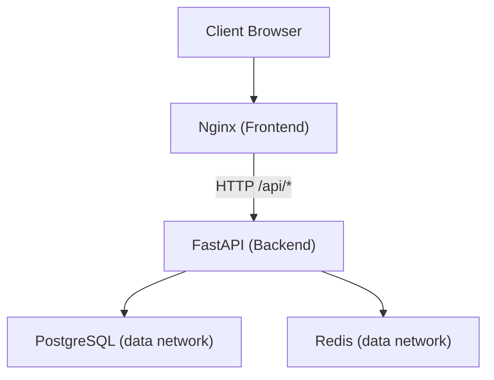
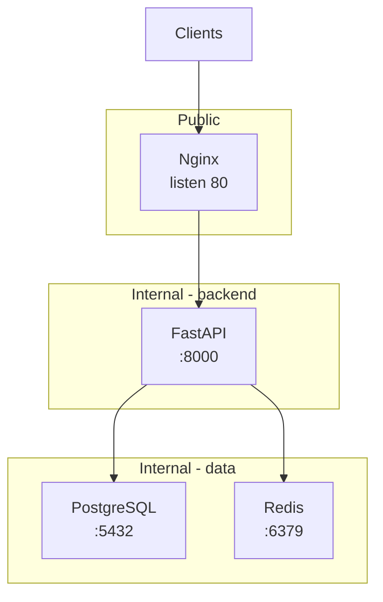
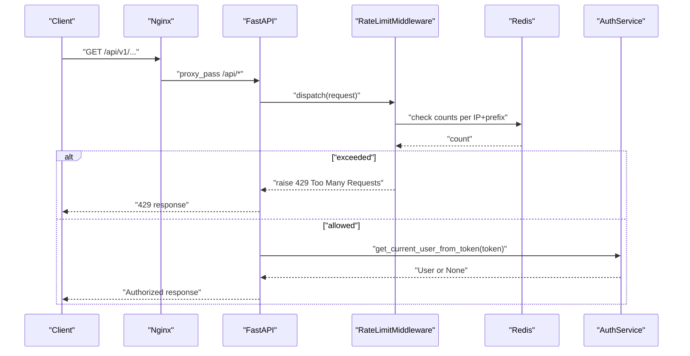
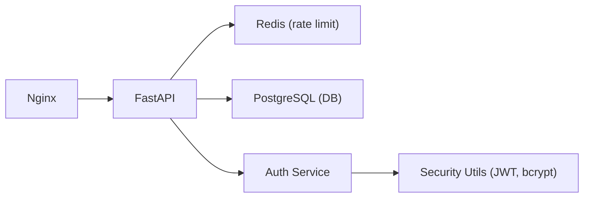

# Security & SSL Configuration

<cite>
**Referenced Files in This Document**
- [nginx.conf](file://frontend/nginx/nginx.conf)
- [docker-compose.prod.yml](file://docker-compose.prod.yml)
- [DEPLOYMENT.md](file://DEPLOYMENT.md)
- [main.py](file://backend/app/main.py)
- [security.py](file://backend/app/core/security.py)
- [config.py](file://backend/app/core/config.py)
- [security_audit.py](file://backend/app/core/security_audit.py)
- [deps.py](file://backend/app/api/deps.py)
- [session.py](file://backend/app/db/session.py)
- [auth_service.py](file://backend/app/services/auth_service.py)
- [Dockerfile (backend)](file://backend/Dockerfile)
- [Dockerfile (frontend)](file://frontend/Dockerfile)
</cite>

## Table of Contents
1. Introduction
2. Project Structure
3. Core Components
4. Architecture Overview
5. Detailed Component Analysis
6. Dependency Analysis
7. Performance Considerations
8. Troubleshooting Guide
9. Conclusion

## Introduction
This document provides production-grade security hardening and SSL/HTTPS configuration guidance for the Rental Housing Matching System. It covers Nginx reverse proxy security, SSL termination with Let’s Encrypt, CORS policy, API authentication and authorization, database connection security, Redis authentication and isolation, container security best practices, firewall rules, port exposure minimization, and monitoring security events. The content is grounded in the repository’s existing configurations and application code.

## Project Structure
The system deploys via Docker Compose with three tiers:
- Frontend: Nginx serves the Vue SPA and proxies API requests to the backend.
- Backend: FastAPI application with middleware for CORS, rate limiting, metrics, and logging.
- Data: PostgreSQL and Redis on internal networks only.

**Diagram sources**
- [docker-compose.prod.yml:1-217](file://docker-compose.prod.yml#L1-L217)
- [nginx.conf:1-89](file://frontend/nginx/nginx.conf#L1-L89)
- [main.py:1-82](file://backend/app/main.py#L1-L82)

**Section sources**
- [docker-compose.prod.yml:1-217](file://docker-compose.prod.yml#L1-L217)
- [nginx.conf:1-89](file://frontend/nginx/nginx.conf#L1-L89)
- [main.py:1-82](file://backend/app/main.py#L1-L82)

## Core Components
- Nginx reverse proxy: request size limits, security headers, API proxying, WebSocket/SSE support, static asset caching, and metrics endpoint access control.
- Application security: JWT-based auth, password hashing, role-based guards, CORS policy, rate limiting, structured logging, and Prometheus metrics.
- Data services: PostgreSQL with strong credentials and health checks; Redis with AOF persistence, memory policies, and password protection.
- Container runtime: multi-stage builds, non-root user, resource limits, and health checks.

**Section sources**
- [nginx.conf:1-89](file://frontend/nginx/nginx.conf#L1-L89)
- [main.py:1-82](file://backend/app/main.py#L1-L82)
- [security.py:1-34](file://backend/app/core/security.py#L1-L34)
- [security_audit.py:1-150](file://backend/app/core/security_audit.py#L1-L150)
- [deps.py:1-58](file://backend/app/api/deps.py#L1-L58)
- [config.py:1-167](file://backend/app/core/config.py#L1-L167)
- [docker-compose.prod.yml:1-217](file://docker-compose.prod.yml#L1-L217)
- [Dockerfile (backend):1-61](file://backend/Dockerfile#L1-L61)
- [Dockerfile (frontend):1-29](file://frontend/Dockerfile#L1-L29)

## Architecture Overview
Production deployment uses a three-tier network model:
- frontend: public-facing Nginx (port 80 exposed).
- backend: FastAPI behind Nginx, not directly exposed.
- data: PostgreSQL and Redis on an internal-only network.

**Diagram sources**
- [docker-compose.prod.yml:1-217](file://docker-compose.prod.yml#L1-L217)
- [nginx.conf:1-89](file://frontend/nginx/nginx.conf#L1-L89)
- [Dockerfile (backend):1-61](file://backend/Dockerfile#L1-L61)

## Detailed Component Analysis

### Nginx Reverse Proxy Security
- Request size limit: client_max_body_size set to restrict uploads.
- Security headers: X-Content-Type-Options, X-Frame-Options, X-XSS-Protection, Referrer-Policy added globally.
- API proxy: forwards to upstream backend with proper headers and timeouts; supports WebSocket/SSE by disabling buffering and cache where needed.
- Metrics endpoint: restricted to private IP ranges using allow/deny directives.
- Static assets: long-lived cache with immutable headers; index.html served without cache.

Operational notes:
- For HTTPS, obtain certificates with Certbot and mount them into the Nginx container as documented. Update Nginx config to listen on 443 and redirect HTTP to HTTPS.

**Section sources**
- [nginx.conf:1-89](file://frontend/nginx/nginx.conf#L1-L89)
- [DEPLOYMENT.md:41-63](file://DEPLOYMENT.md#L41-L63)

### SSL Certificate Management and HTTPS Termination
- Use Certbot standalone mode to obtain certificates before starting Nginx.
- Mount certificate volumes read-only into the Nginx container.
- Configure Nginx to serve HTTPS and enforce HTTP-to-HTTPS redirection.
- Automate renewal with a cron job that restarts Nginx post-renewal.

**Section sources**
- [DEPLOYMENT.md:41-63](file://DEPLOYMENT.md#L41-L63)

### Security Headers Implementation
- Global headers are added at the server level to protect against common web vulnerabilities.
- Ensure consistent header application across all responses.

**Section sources**
- [nginx.conf:33-38](file://frontend/nginx/nginx.conf#L33-L38)

### Database Connection Security
- Credentials are provided via environment variables and injected into service containers.
- Health checks validate connectivity using the configured user and database name.
- The async engine is created from the DATABASE_URL setting.

Recommendations:
- Enforce TLS for database connections by configuring the connection string to require SSL and providing CA certificates if required by your hosting provider.
- Rotate passwords regularly and store secrets securely outside version control.

**Section sources**
- [docker-compose.prod.yml:10-35](file://docker-compose.prod.yml#L10-L35)
- [session.py:1-14](file://backend/app/db/session.py#L1-L14)

### Redis Authentication and Network Isolation
- Redis runs with AOF persistence enabled and requires a password via command-line flags.
- Health check authenticates using the same password.
- Redis is attached to the internal data network only.

Best practices:
- Keep REDIS_PASSWORD secret and rotate periodically.
- Avoid exposing Redis ports externally.

**Section sources**
- [docker-compose.prod.yml:36-63](file://docker-compose.prod.yml#L36-L63)

### CORS Policy Configuration
- In development, CORS allows all origins; in production, it is constrained to configured origins.
- Credentials are allowed when necessary.

Configuration keys:
- CORS_ORIGINS: list of allowed origins in production.

**Section sources**
- [main.py:27-39](file://backend/app/main.py#L27-L39)
- [config.py:40-44](file://backend/app/core/config.py#L40-L44)

### API Security Measures
- Authentication:
  - Passwords hashed with bcrypt.
  - Access tokens issued with HS256 and configurable expiration.
  - Refresh token support with type enforcement and expiry validation.
- Authorization:
  - Role-based dependencies for tenant, landlord, and admin access.
- Rate Limiting:
  - Redis-backed sliding window limiter per client IP and endpoint prefix.
  - Returns 429 with Retry-After header when exceeded.
- Logging and Monitoring:
  - Structured request/response logging middleware.
  - Prometheus metrics endpoint and Celery task metrics.

**Diagram sources**
- [main.py:44-57](file://backend/app/main.py#L44-L57)
- [security_audit.py:49-95](file://backend/app/core/security_audit.py#L49-L95)
- [auth_service.py:40-51](file://backend/app/services/auth_service.py#L40-L51)
- [deps.py:19-30](file://backend/app/api/deps.py#L19-L30)

**Section sources**
- [security.py:1-34](file://backend/app/core/security.py#L1-L34)
- [security_audit.py:1-150](file://backend/app/core/security_audit.py#L1-L150)
- [deps.py:1-58](file://backend/app/api/deps.py#L1-L58)
- [main.py:1-82](file://backend/app/main.py#L1-L82)

### Container Security Best Practices
- Multi-stage builds reduce attack surface.
- Non-root user for application processes.
- Resource limits and reservations defined for each service.
- Health checks ensure liveness and readiness.
- Log rotation configured for json-file driver.

**Section sources**
- [Dockerfile (backend):1-61](file://backend/Dockerfile#L1-L61)
- [Dockerfile (frontend):1-29](file://frontend/Dockerfile#L1-L29)
- [docker-compose.prod.yml:1-217](file://docker-compose.prod.yml#L1-L217)

### Firewall Rules and Port Exposure Minimization
- Only Nginx exposes port 80 to the host.
- Backend and data services are not exposed externally.
- Internal networks isolate backend and data tiers.

Operational guidance:
- Enable host firewall (e.g., UFW) allowing only SSH, HTTP, and HTTPS.
- Do not expose database or Redis ports to the internet.

**Section sources**
- [docker-compose.prod.yml:170-196](file://docker-compose.prod.yml#L170-L196)
- [DEPLOYMENT.md:122-134](file://DEPLOYMENT.md#L122-L134)

### Monitoring Security Events
- Prometheus metrics include request counts, latency, and DB pool status.
- Structured JSON logging in production.
- Health endpoint available for probes.
- Audit utilities provide OWASP Top 10 compliance snapshot.

**Section sources**
- [main.py:41-69](file://backend/app/main.py#L41-L69)
- [security_audit.py:25-41](file://backend/app/core/security_audit.py#L25-L41)
- [DEPLOYMENT.md:86-91](file://DEPLOYMENT.md#L86-L91)

## Dependency Analysis
The following diagram shows key runtime dependencies relevant to security:

**Diagram sources**
- [docker-compose.prod.yml:1-217](file://docker-compose.prod.yml#L1-L217)
- [main.py:1-82](file://backend/app/main.py#L1-L82)
- [security.py:1-34](file://backend/app/core/security.py#L1-L34)
- [security_audit.py:1-150](file://backend/app/core/security_audit.py#L1-L150)

**Section sources**
- [docker-compose.prod.yml:1-217](file://docker-compose.prod.yml#L1-L217)
- [main.py:1-82](file://backend/app/main.py#L1-L82)

## Performance Considerations
- Nginx keepalive connections to backend improve throughput.
- Gzip compression reduces payload sizes for supported types.
- Static assets use long cache with immutable headers.
- Rate limiting protects backend from abuse while preserving legitimate traffic.
- Redis memory policy ensures eviction under pressure.

[No sources needed since this section provides general guidance]

## Troubleshooting Guide
- Verify Nginx logs and health endpoints.
- Check backend logs for rate limit events and authentication failures.
- Validate Redis connectivity with authenticated ping.
- Confirm database readiness using health checks.
- Review Prometheus metrics for anomalies.

**Section sources**
- [DEPLOYMENT.md:112-134](file://DEPLOYMENT.md#L112-L134)
- [docker-compose.prod.yml:23-28](file://docker-compose.prod.yml#L23-L28)
- [docker-compose.prod.yml:53-57](file://docker-compose.prod.yml#L53-L57)

## Conclusion
By combining hardened Nginx settings, strict CORS and authentication controls, Redis-backed rate limiting, secure container runtime, and internal network isolation, the system achieves a robust security posture for production. Follow the SSL termination steps, enforce least-privilege networking, and continuously monitor security events to maintain resilience over time.