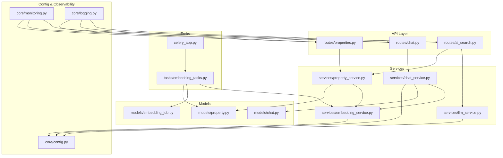
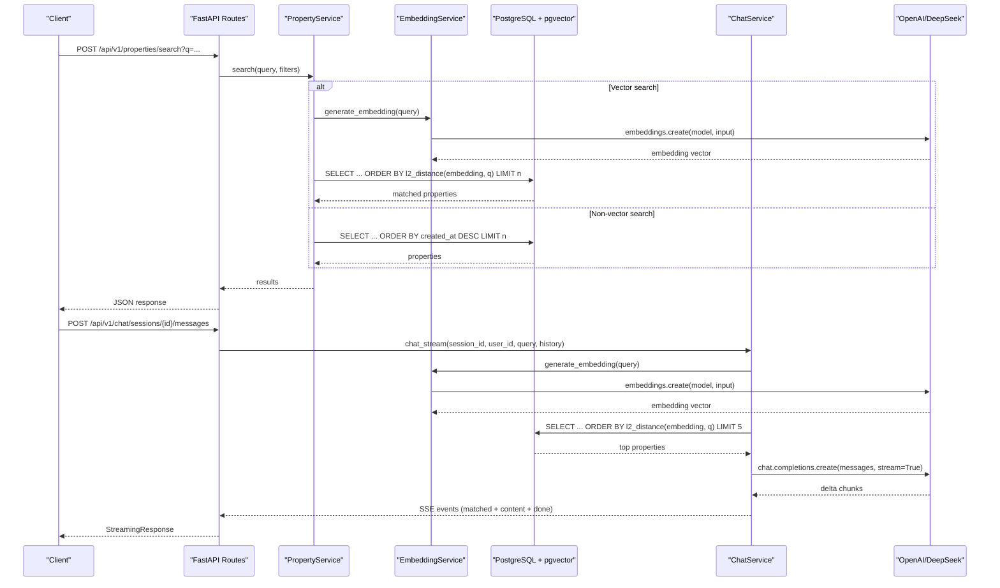
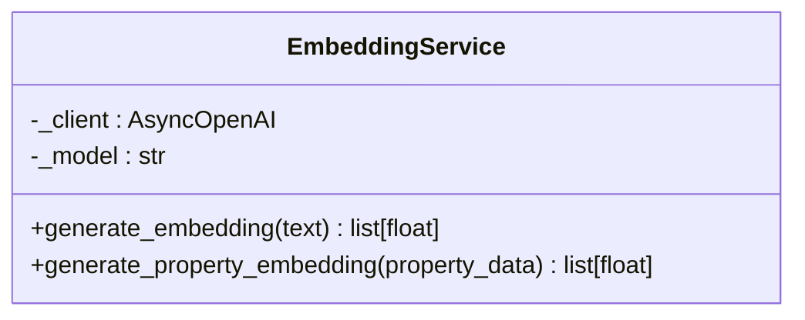
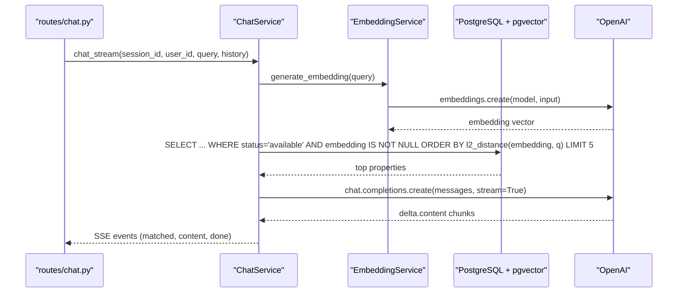
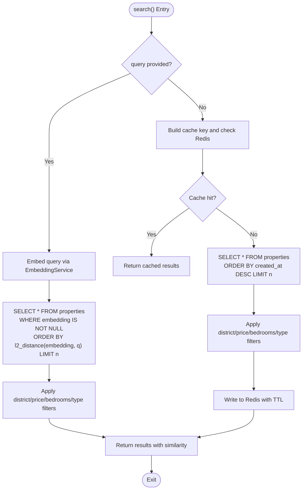
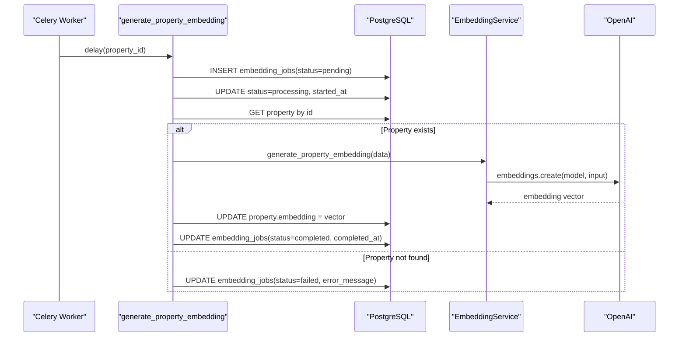
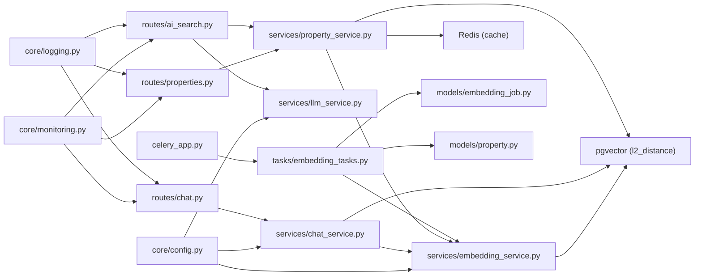
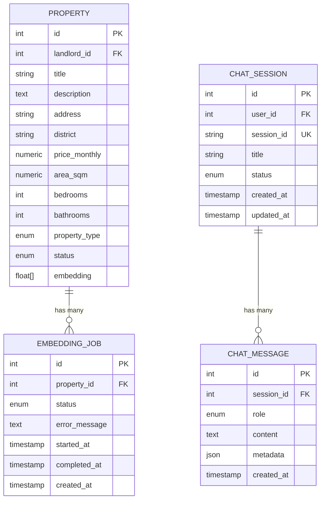

# AI Services (OpenAI Integration)

<cite>
**Referenced Files in This Document**
- [embedding_service.py](file://backend/app/services/embedding_service.py)
- [chat_service.py](file://backend/app/services/chat_service.py)
- [embedding_tasks.py](file://backend/app/tasks/embedding_tasks.py)
- [config.py](file://backend/app/core/config.py)
- [ai_search.py](file://backend/app/api/v1/routes/ai_search.py)
- [llm_service.py](file://backend/app/services/llm_service.py)
- [celery_app.py](file://backend/app/celery_app.py)
- [property.py](file://backend/app/models/property.py)
- [property_service.py](file://backend/app/services/property_service.py)
- [properties.py](file://backend/app/api/v1/routes/properties.py)
- [chat.py](file://backend/app/api/v1/routes/chat.py)
- [embedding_job.py](file://backend/app/models/embedding_job.py)
- [monitoring.py](file://backend/app/core/monitoring.py)
- [logging.py](file://backend/app/core/logging.py)
</cite>

## Table of Contents
1. [Introduction](#introduction)
2. [Project Structure](#project-structure)
3. [Core Components](#core-components)
4. [Architecture Overview](#architecture-overview)
5. [Detailed Component Analysis](#detailed-component-analysis)
6. [Dependency Analysis](#dependency-analysis)
7. [Performance Considerations](#performance-considerations)
8. [Troubleshooting Guide](#troubleshooting-guide)
9. [Conclusion](#conclusion)
10. [Appendices](#appendices)

## Introduction
This document explains the AI services integration with OpenAI for embeddings and chat completion, focusing on:
- EmbeddingService for converting property descriptions and user queries into vector embeddings used by pgvector-based semantic search.
- ChatService providing a RAG-enabled conversational interface that augments LLM responses with retrieved properties from the database.
- Celery-based asynchronous embedding job pipeline to generate and update embeddings for properties.
- Configuration management for API keys, model selection, and rate limiting.
- Examples for generating embeddings, performing semantic searches, and implementing streaming chat responses.
- Performance optimization strategies including batch processing, caching, and streaming.
- Cost optimization techniques, fallbacks for API failures, and monitoring of usage and response quality.

## Project Structure
The AI-related functionality is implemented across services, tasks, models, routes, configuration, and observability modules:
- Services: EmbeddingService, ChatService, PropertyService, LLMService
- Tasks: Celery tasks for embedding generation and reindexing
- Models: Property (with vector column), EmbeddingJob, ChatSession/ChatMessage
- Routes: AI search endpoints, chat endpoints, property endpoints
- Configuration: OpenAI and DeepSeek settings, Redis, rate limits
- Observability: Prometheus metrics and structured logging

**Diagram sources**
- [ai_search.py:1-160](file://backend/app/api/v1/routes/ai_search.py#L1-L160)
- [chat.py:1-143](file://backend/app/api/v1/routes/chat.py#L1-L143)
- [properties.py:1-162](file://backend/app/api/v1/routes/properties.py#L1-L162)
- [embedding_service.py:1-32](file://backend/app/services/embedding_service.py#L1-L32)
- [chat_service.py:1-302](file://backend/app/services/chat_service.py#L1-L302)
- [property_service.py:1-239](file://backend/app/services/property_service.py#L1-L239)
- [llm_service.py:1-209](file://backend/app/services/llm_service.py#L1-L209)
- [embedding_tasks.py:1-112](file://backend/app/tasks/embedding_tasks.py#L1-L112)
- [celery_app.py:1-31](file://backend/app/celery_app.py#L1-L31)
- [property.py:1-86](file://backend/app/models/property.py#L1-L86)
- [embedding_job.py:1-35](file://backend/app/models/embedding_job.py#L1-L35)
- [chat.py:1-62](file://backend/app/models/chat.py#L1-L62)
- [config.py:1-167](file://backend/app/core/config.py#L1-L167)
- [monitoring.py:1-227](file://backend/app/core/monitoring.py#L1-L227)
- [logging.py:1-231](file://backend/app/core/logging.py#L1-L231)

**Section sources**
- [embedding_service.py:1-32](file://backend/app/services/embedding_service.py#L1-L32)
- [chat_service.py:1-302](file://backend/app/services/chat_service.py#L1-L302)
- [embedding_tasks.py:1-112](file://backend/app/tasks/embedding_tasks.py#L1-L112)
- [config.py:1-167](file://backend/app/core/config.py#L1-L167)
- [ai_search.py:1-160](file://backend/app/api/v1/routes/ai_search.py#L1-L160)
- [llm_service.py:1-209](file://backend/app/services/llm_service.py#L1-L209)
- [celery_app.py:1-31](file://backend/app/celery_app.py#L1-L31)
- [property.py:1-86](file://backend/app/models/property.py#L1-L86)
- [property_service.py:1-239](file://backend/app/services/property_service.py#L1-L239)
- [properties.py:1-162](file://backend/app/api/v1/routes/properties.py#L1-L162)
- [chat.py:1-143](file://backend/app/api/v1/routes/chat.py#L1-L143)
- [embedding_job.py:1-35](file://backend/app/models/embedding_job.py#L1-L35)
- [monitoring.py:1-227](file://backend/app/core/monitoring.py#L1-L227)
- [logging.py:1-231](file://backend/app/core/logging.py#L1-L231)

## Core Components
- EmbeddingService: Wraps AsyncOpenAI to generate embeddings for text and property data using configured model.
- ChatService: Implements session/message management, RAG context building via pgvector similarity search, and both non-streaming and streaming chat completions.
- PropertyService: Provides unified search with optional vector query; dispatches async embedding tasks on create/update; caches non-vector results in Redis.
- LLMService: Unified provider abstraction supporting DeepSeek and OpenAI for parsing natural language queries and generating summaries; includes fallback logic.
- Celery Tasks: Asynchronous jobs to generate embeddings per property and bulk reindex missing embeddings.
- Configuration: Centralized settings for OpenAI/DeepSeek API keys, models, Redis URL, and rate limiting parameters.
- Observability: Prometheus metrics middleware and structured logging for request tracing and task performance.

**Section sources**
- [embedding_service.py:1-32](file://backend/app/services/embedding_service.py#L1-L32)
- [chat_service.py:1-302](file://backend/app/services/chat_service.py#L1-L302)
- [property_service.py:1-239](file://backend/app/services/property_service.py#L1-L239)
- [llm_service.py:1-209](file://backend/app/services/llm_service.py#L1-L209)
- [embedding_tasks.py:1-112](file://backend/app/tasks/embedding_tasks.py#L1-L112)
- [config.py:1-167](file://backend/app/core/config.py#L1-L167)
- [monitoring.py:1-227](file://backend/app/core/monitoring.py#L1-L227)
- [logging.py:1-231](file://backend/app/core/logging.py#L1-L231)

## Architecture Overview
The system integrates FastAPI routes with services that call OpenAI APIs and PostgreSQL/pgvector for semantic search. Celery workers process embedding jobs asynchronously.

**Diagram sources**
- [properties.py:36-91](file://backend/app/api/v1/routes/properties.py#L36-L91)
- [property_service.py:91-195](file://backend/app/services/property_service.py#L91-L195)
- [embedding_service.py:17-32](file://backend/app/services/embedding_service.py#L17-L32)
- [chat.py:106-130](file://backend/app/api/v1/routes/chat.py#L106-L130)
- [chat_service.py:171-302](file://backend/app/services/chat_service.py#L171-L302)

## Detailed Component Analysis

### EmbeddingService
Responsibilities:
- Initialize AsyncOpenAI client with configured key and embedding model.
- Generate embeddings for arbitrary text or property data.
- Build property text from title, description, address, district, and type.

Key behaviors:
- Uses environment-driven model name and API key.
- Returns list[float] embedding vectors compatible with pgvector.

**Diagram sources**
- [embedding_service.py:17-32](file://backend/app/services/embedding_service.py#L17-L32)

**Section sources**
- [embedding_service.py:1-32](file://backend/app/services/embedding_service.py#L1-L32)
- [config.py:46-57](file://backend/app/core/config.py#L46-L57)

### ChatService (RAG-enabled Conversational Interface)
Responsibilities:
- Manage chat sessions and messages.
- Build RAG context by embedding user query and retrieving top similar available properties via pgvector.
- Provide non-streaming and streaming chat completions with OpenAI.
- Persist user and assistant messages with metadata (e.g., matched properties).

RAG flow:
- Embed query -> compute l2_distance with stored property embeddings -> select top matches -> format context -> append to system prompt -> call chat completions.

Streaming behavior:
- Yields SSE-formatted events: matched properties first, then content deltas, then done markers.

**Diagram sources**
- [chat.py:106-130](file://backend/app/api/v1/routes/chat.py#L106-L130)
- [chat_service.py:87-143](file://backend/app/services/chat_service.py#L87-L143)
- [chat_service.py:227-302](file://backend/app/services/chat_service.py#L227-L302)
- [embedding_service.py:23-32](file://backend/app/services/embedding_service.py#L23-L32)

**Section sources**
- [chat_service.py:1-302](file://backend/app/services/chat_service.py#L1-L302)
- [chat.py:1-143](file://backend/app/api/v1/routes/chat.py#L1-L143)
- [embedding_service.py:17-32](file://backend/app/services/embedding_service.py#L17-L32)

### PropertyService (Unified Search and Task Dispatch)
Responsibilities:
- Implement search with optional vector query using pgvector similarity.
- Cache non-vector search results in Redis for reduced latency.
- Dispatch async embedding tasks when properties are created or updated.

Search algorithm:
- If query provided: embed query and order by l2_distance(embedding, q).
- Else: order by created_at desc and optionally apply filters.
- Cacheable only for non-vector queries.

**Diagram sources**
- [property_service.py:91-195](file://backend/app/services/property_service.py#L91-L195)

**Section sources**
- [property_service.py:1-239](file://backend/app/services/property_service.py#L1-L239)
- [property.py:12-22](file://backend/app/models/property.py#L12-L22)
- [property.py:78](file://backend/app/models/property.py#L78)

### LLMService (Provider Abstraction and Summaries)
Responsibilities:
- Provide parse_search_query and generate_search_summary methods.
- Prefer DeepSeek client if configured; fallback to OpenAI.
- Enforce structured JSON output for parsing and produce friendly summaries.

Fallback strategy:
- Raises RuntimeError if neither provider is configured.
- Gracefully degrades summary generation when LLM unavailable.

**Section sources**
- [llm_service.py:1-209](file://backend/app/services/llm_service.py#L1-L209)
- [ai_search.py:80-160](file://backend/app/api/v1/routes/ai_search.py#L80-L160)

### Celery Embedding Job Pipeline
Responsibilities:
- generate_property_embedding: Create pending job, mark processing, fetch property, generate embedding, persist result, mark completed/failed.
- reindex_all_properties: Find all properties without embeddings and enqueue jobs.

Reliability:
- Auto-retry with backoff and max retries.
- Error messages captured in job records.

**Diagram sources**
- [embedding_tasks.py:16-80](file://backend/app/tasks/embedding_tasks.py#L16-L80)
- [embedding_job.py:10-35](file://backend/app/models/embedding_job.py#L10-L35)
- [embedding_service.py:23-32](file://backend/app/services/embedding_service.py#L23-L32)

**Section sources**
- [embedding_tasks.py:1-112](file://backend/app/tasks/embedding_tasks.py#L1-L112)
- [embedding_job.py:1-35](file://backend/app/models/embedding_job.py#L1-L35)
- [celery_app.py:1-31](file://backend/app/celery_app.py#L1-L31)

### Configuration Management
Key settings:
- OPENAI_API_KEY, OPENAI_EMBEDDING_MODEL, OPENAI_CHAT_MODEL
- DEEPSEEK_API_KEY, DEEPSEEK_CHAT_MODEL, DEEPSEEK_BASE_URL
- REDIS_URL for Celery broker/backend and search caching
- RATE_LIMIT_REQUESTS, RATE_LIMIT_WINDOW_SECONDS for rate limiting

Usage:
- EmbeddingService and ChatService read OpenAI settings at initialization.
- LLMService uses DeepSeek if configured, otherwise falls back to OpenAI.
- Celery app configures broker/backend and task routing.

**Section sources**
- [config.py:46-70](file://backend/app/core/config.py#L46-L70)
- [config.py:153-161](file://backend/app/core/config.py#L153-L161)
- [celery_app.py:9-30](file://backend/app/celery_app.py#L9-L30)

## Dependency Analysis
High-level dependencies among components:

**Diagram sources**
- [config.py:1-167](file://backend/app/core/config.py#L1-L167)
- [embedding_service.py:1-32](file://backend/app/services/embedding_service.py#L1-L32)
- [chat_service.py:1-302](file://backend/app/services/chat_service.py#L1-L302)
- [llm_service.py:1-209](file://backend/app/services/llm_service.py#L1-L209)
- [property_service.py:1-239](file://backend/app/services/property_service.py#L1-L239)
- [properties.py:1-162](file://backend/app/api/v1/routes/properties.py#L1-L162)
- [ai_search.py:1-160](file://backend/app/api/v1/routes/ai_search.py#L1-L160)
- [chat.py:1-143](file://backend/app/api/v1/routes/chat.py#L1-L143)
- [embedding_tasks.py:1-112](file://backend/app/tasks/embedding_tasks.py#L1-L112)
- [embedding_job.py:1-35](file://backend/app/models/embedding_job.py#L1-L35)
- [property.py:1-86](file://backend/app/models/property.py#L1-L86)
- [celery_app.py:1-31](file://backend/app/celery_app.py#L1-L31)
- [monitoring.py:1-227](file://backend/app/core/monitoring.py#L1-L227)
- [logging.py:1-231](file://backend/app/core/logging.py#L1-L231)

**Section sources**
- [embedding_service.py:1-32](file://backend/app/services/embedding_service.py#L1-L32)
- [chat_service.py:1-302](file://backend/app/services/chat_service.py#L1-L302)
- [property_service.py:1-239](file://backend/app/services/property_service.py#L1-L239)
- [llm_service.py:1-209](file://backend/app/services/llm_service.py#L1-L209)
- [embedding_tasks.py:1-112](file://backend/app/tasks/embedding_tasks.py#L1-L112)
- [config.py:1-167](file://backend/app/core/config.py#L1-L167)
- [celery_app.py:1-31](file://backend/app/celery_app.py#L1-L31)
- [property.py:1-86](file://backend/app/models/property.py#L1-L86)
- [properties.py:1-162](file://backend/app/api/v1/routes/properties.py#L1-L162)
- [chat.py:1-143](file://backend/app/api/v1/routes/chat.py#L1-L143)
- [embedding_job.py:1-35](file://backend/app/models/embedding_job.py#L1-L35)
- [monitoring.py:1-227](file://backend/app/core/monitoring.py#L1-L227)
- [logging.py:1-231](file://backend/app/core/logging.py#L1-L231)

## Performance Considerations
- Batch processing:
  - Use reindex_all_properties to enqueue missing embeddings in batches; consider adding batching within tasks to reduce API calls overhead.
- Caching embeddings:
  - Cache query embeddings in Redis keyed by normalized query text to avoid repeated OpenAI calls during high traffic.
  - Cache non-vector search results with TTL to reduce DB load.
- Streaming responses:
  - Use chat_stream to deliver matched properties and content deltas via SSE for better UX and lower perceived latency.
- Database indexing:
  - Ensure pgvector index exists for efficient l2_distance queries.
- Rate limiting:
  - Configure RATE_LIMIT_REQUESTS and RATE_LIMIT_WINDOW_SECONDS to protect against bursts; integrate with middleware if needed.
- Model selection:
  - Choose cost-effective embedding models (e.g., small variants) and appropriate chat models based on accuracy vs. cost trade-offs.

[No sources needed since this section provides general guidance]

## Troubleshooting Guide
Common issues and diagnostics:
- Missing API keys:
  - LLMService raises RuntimeError if no provider configured; verify OPENAI_API_KEY or DEEPSEEK_API_KEY.
- Embedding job failures:
  - Check embedding_jobs.status and error_message; ensure property exists and OpenAI client can connect.
- No matching properties in RAG:
  - Verify Property.embedding is populated and status is available; confirm pgvector extension enabled.
- Streaming errors:
  - ChatService catches exceptions and yields error events; inspect logs for stack traces.
- Monitoring:
  - Use /metrics endpoint for HTTP and Celery task metrics; review request duration histograms and task latencies.
- Logging:
  - Structured logs include request_id, method, path, status_code, duration_ms; use to trace AI service interactions.

**Section sources**
- [llm_service.py:91-99](file://backend/app/services/llm_service.py#L91-L99)
- [embedding_tasks.py:70-76](file://backend/app/tasks/embedding_tasks.py#L70-L76)
- [chat_service.py:298-301](file://backend/app/services/chat_service.py#L298-L301)
- [monitoring.py:167-176](file://backend/app/core/monitoring.py#L167-L176)
- [logging.py:124-167](file://backend/app/core/logging.py#L124-L167)

## Conclusion
The AI services layer integrates OpenAI embeddings and chat completions with PostgreSQL/pgvector to enable semantic search and RAG-powered conversations. The design separates concerns across services, leverages Celery for reliable background processing, and provides observability through metrics and structured logging. With careful configuration, caching, and streaming, the system balances responsiveness, cost, and reliability while offering robust fallbacks and monitoring.

[No sources needed since this section summarizes without analyzing specific files]

## Appendices

### Example Workflows

- Generate embeddings for new properties:
  - Create or update a property via properties routes; PropertyService dispatches an embedding task which generates and persists the vector.
  - Reference paths:
    - [properties.py:16-33](file://backend/app/api/v1/routes/properties.py#L16-L33)
    - [property_service.py:48-60](file://backend/app/services/property_service.py#L48-L60)
    - [embedding_tasks.py:22-80](file://backend/app/tasks/embedding_tasks.py#L22-L80)

- Perform semantic searches:
  - Call search endpoint with natural language query; PropertyService embeds query and orders by similarity.
  - Reference paths:
    - [properties.py:36-91](file://backend/app/api/v1/routes/properties.py#L36-L91)
    - [property_service.py:135-168](file://backend/app/services/property_service.py#L135-L168)

- Implement context-aware chat responses:
  - Use chat routes to send messages; ChatService builds RAG context and streams responses.
  - Reference paths:
    - [chat.py:106-130](file://backend/app/api/v1/routes/chat.py#L106-L130)
    - [chat_service.py:227-302](file://backend/app/services/chat_service.py#L227-L302)

### Data Models Diagram

**Diagram sources**
- [property.py:38-86](file://backend/app/models/property.py#L38-L86)
- [embedding_job.py:17-35](file://backend/app/models/embedding_job.py#L17-L35)
- [chat.py:23-62](file://backend/app/models/chat.py#L23-L62)