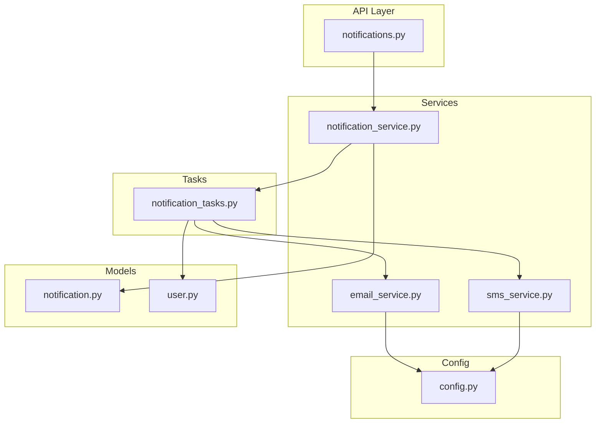
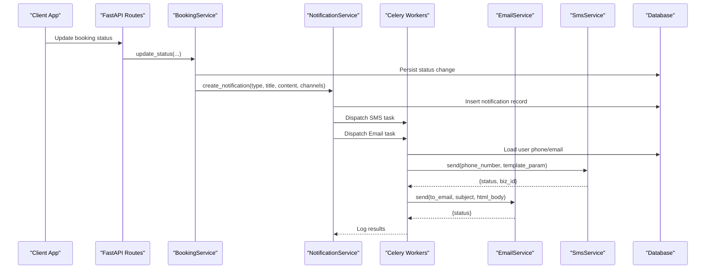
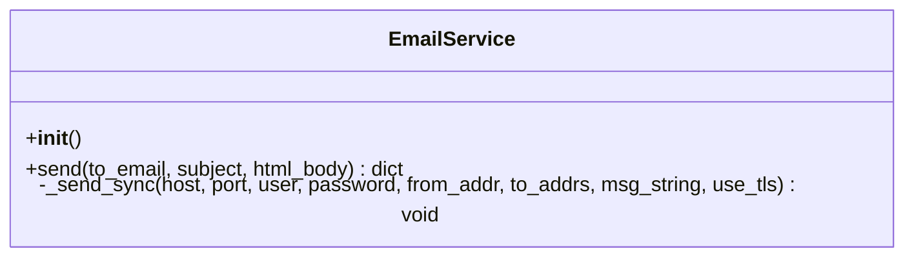
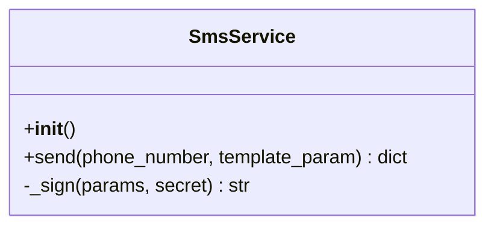
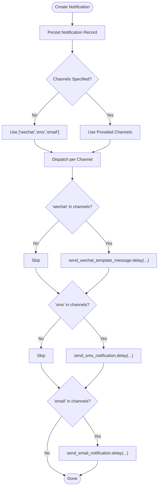
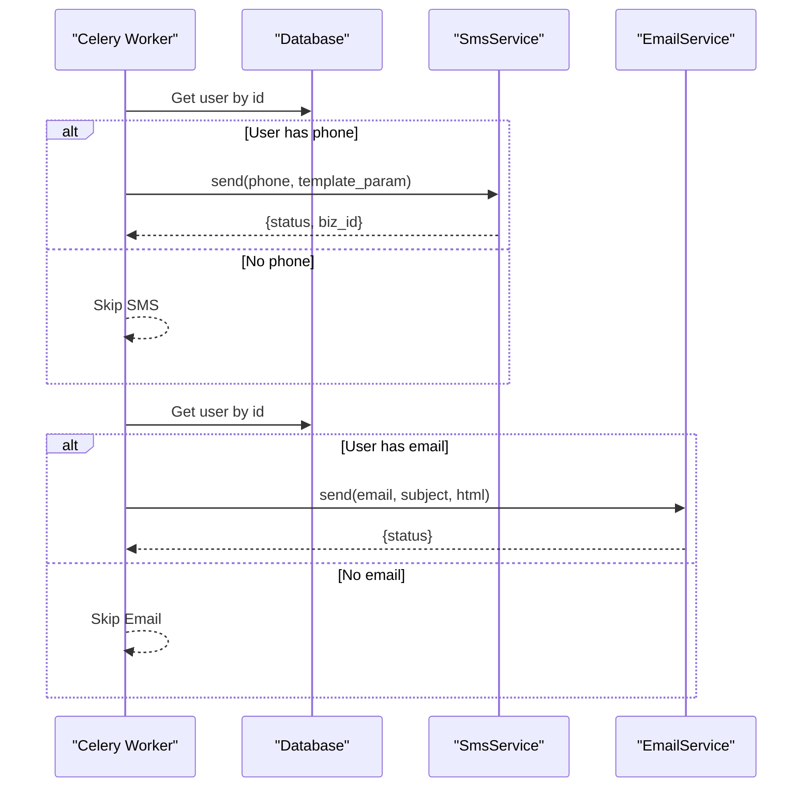
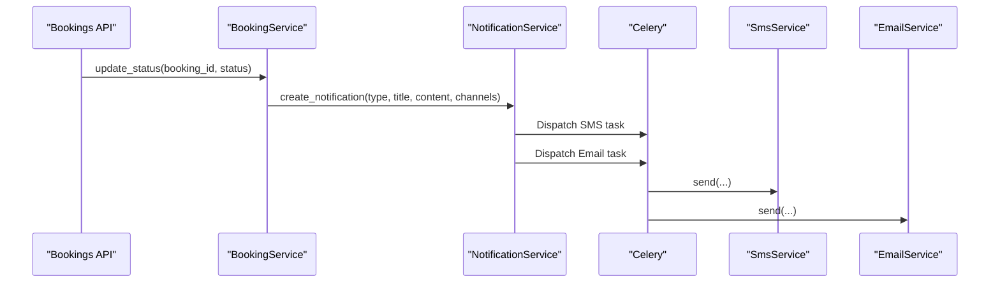
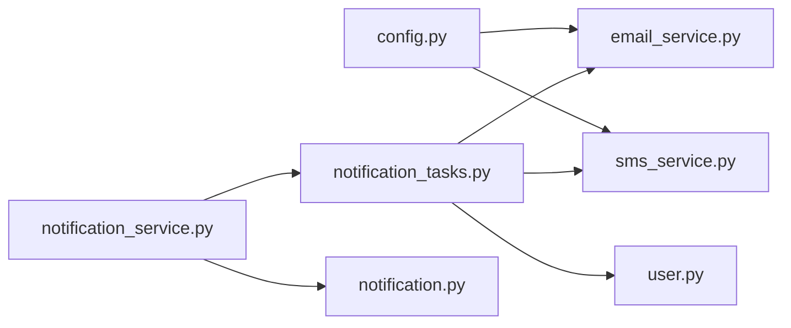

# Communication Services (Email & SMS)

<cite>
**Referenced Files in This Document**
- [email_service.py](file://backend/app/services/email_service.py)
- [sms_service.py](file://backend/app/services/sms_service.py)
- [config.py](file://backend/app/core/config.py)
- [notification_tasks.py](file://backend/app/tasks/notification_tasks.py)
- [notification_service.py](file://backend/app/services/notification_service.py)
- [notification.py](file://backend/app/models/notification.py)
- [notifications.py](file://backend/app/api/v1/routes/notifications.py)
- [booking_service.py](file://backend/app/services/booking_service.py)
- [user.py](file://backend/app/models/user.py)
</cite>

## Table of Contents
1. Introduction
2. Project Structure
3. Core Components
4. Architecture Overview
5. Detailed Component Analysis
6. Dependency Analysis
7. Performance Considerations
8. Troubleshooting Guide
9. Conclusion

## Introduction
This document explains the communication services for email and SMS notifications, focusing on:
- EmailService using SMTP to send HTML emails (e.g., booking confirmations, system notifications).
- SmsService integrating with Alibaba Cloud SMS API for urgent alerts and two-factor authentication codes.
- Message templates, formatting options, and delivery status tracking.
- Configuration management for SMTP and Alibaba Cloud settings.
- Examples of triggering notifications based on user actions and system events.
- Retry mechanisms, logging, and monitoring considerations.
- Security and compliance guidance for sensitive communications.

## Project Structure
The communication subsystem spans services, tasks, configuration, models, and API routes:
- Services: EmailService and SmsService encapsulate provider-specific logic.
- Tasks: Celery tasks orchestrate asynchronous sending and retries.
- NotificationService: Centralizes dispatching across channels (WeChat, SMS, Email).
- Models: Notification entity persists in-app notifications.
- Config: Settings for SMTP and Alibaba Cloud SMS.
- API: Endpoints to list and manage in-app notifications.

**Diagram sources**
- [notifications.py:1-50](file://backend/app/api/v1/routes/notifications.py#L1-L50)
- [notification_service.py:1-164](file://backend/app/services/notification_service.py#L1-L164)
- [notification_tasks.py:1-217](file://backend/app/tasks/notification_tasks.py#L1-L217)
- [email_service.py:1-76](file://backend/app/services/email_service.py#L1-L76)
- [sms_service.py:1-96](file://backend/app/services/sms_service.py#L1-L96)
- [config.py:121-145](file://backend/app/core/config.py#L121-L145)
- [notification.py:1-36](file://backend/app/models/notification.py#L1-L36)
- [user.py:1-48](file://backend/app/models/user.py#L1-L48)

**Section sources**
- [notifications.py:1-50](file://backend/app/api/v1/routes/notifications.py#L1-L50)
- [notification_service.py:1-164](file://backend/app/services/notification_service.py#L1-L164)
- [notification_tasks.py:1-217](file://backend/app/tasks/notification_tasks.py#L1-L217)
- [email_service.py:1-76](file://backend/app/services/email_service.py#L1-L76)
- [sms_service.py:1-96](file://backend/app/services/sms_service.py#L1-L96)
- [config.py:121-145](file://backend/app/core/config.py#L121-L145)
- [notification.py:1-36](file://backend/app/models/notification.py#L1-L36)
- [user.py:1-48](file://backend/app/models/user.py#L1-L48)

## Core Components
- EmailService: Sends HTML emails via SMTP with TLS support and configurable sender identity. Returns a status dict indicating sent or skipped.
- SmsService: Calls Alibaba Cloud SendSms API with HMAC-SHA1 signature and returns a status dict including BizId on success.
- NotificationService: Persists in-app notifications and dispatches channel-specific tasks (SMS, Email, WeChat).
- Celery Tasks: Asynchronous workers for SMS and Email with retry/backoff; fetch recipient details from DB before sending.
- Configuration: Pydantic-based settings for SMTP and Alibaba Cloud SMS endpoints and credentials.

Key responsibilities:
- Formatting: Email uses HTML bodies; SMS uses template parameters.
- Delivery status: Services return structured results; tasks log outcomes.
- Channel selection: NotificationService maps notification types to channels and templates.

**Section sources**
- [email_service.py:11-76](file://backend/app/services/email_service.py#L11-L76)
- [sms_service.py:15-96](file://backend/app/services/sms_service.py#L15-L96)
- [notification_service.py:37-164](file://backend/app/services/notification_service.py#L37-L164)
- [notification_tasks.py:136-217](file://backend/app/tasks/notification_tasks.py#L136-L217)
- [config.py:121-145](file://backend/app/core/config.py#L121-L145)

## Architecture Overview
End-to-end flow for a booking status change that triggers notifications:

**Diagram sources**
- [booking_service.py:81-134](file://backend/app/services/booking_service.py#L81-L134)
- [notification_service.py:108-164](file://backend/app/services/notification_service.py#L108-L164)
- [notification_tasks.py:136-217](file://backend/app/tasks/notification_tasks.py#L136-L217)
- [sms_service.py:41-96](file://backend/app/services/sms_service.py#L41-L96)
- [email_service.py:17-76](file://backend/app/services/email_service.py#L17-L76)
- [notification.py:20-36](file://backend/app/models/notification.py#L20-L36)

## Detailed Component Analysis

### EmailService (SMTP)
Responsibilities:
- Build MIME multipart message with HTML body.
- Connect to SMTP server with optional TLS.
- Execute synchronous SMTP operations off the event loop.
- Return structured status and log outcomes.

Configuration used:
- Host, port, user, password, from name/email, TLS flag.

Error handling:
- Skips if no recipient or SMTP not configured.
- Logs exceptions and re-raises to allow Celery retry.

**Diagram sources**
- [email_service.py:11-76](file://backend/app/services/email_service.py#L11-L76)

**Section sources**
- [email_service.py:11-76](file://backend/app/services/email_service.py#L11-L76)
- [config.py:132-145](file://backend/app/core/config.py#L132-L145)

### SmsService (Alibaba Cloud)
Responsibilities:
- Build request parameters and compute HMAC-SHA1 signature.
- Call SendSms API over HTTPS.
- Parse response and return structured status including BizId.

Configuration used:
- Access key ID/secret, sign name, template code, endpoint override.

Error handling:
- Skips if missing config or empty phone number.
- Logs errors and re-raises for Celery retry.

**Diagram sources**
- [sms_service.py:15-96](file://backend/app/services/sms_service.py#L15-L96)

**Section sources**
- [sms_service.py:15-96](file://backend/app/services/sms_service.py#L15-L96)
- [config.py:121-130](file://backend/app/core/config.py#L121-L130)

### NotificationService (Channel Dispatcher)
Responsibilities:
- Persist Notification records.
- Map notification types to channel metadata (e.g., WeChat template IDs).
- Fire-and-forget dispatch to Celery tasks for SMS and Email.

Channel behavior:
- Default channels include wechat, sms, email unless specified.
- Each channel dispatch is isolated; failures are logged but do not block DB write.

**Diagram sources**
- [notification_service.py:108-164](file://backend/app/services/notification_service.py#L108-L164)
- [notification.py:10-36](file://backend/app/models/notification.py#L10-L36)

**Section sources**
- [notification_service.py:37-164](file://backend/app/services/notification_service.py#L37-L164)
- [notification.py:10-36](file://backend/app/models/notification.py#L10-L36)

### Celery Tasks (Retries and Logging)
Responsibilities:
- Resolve recipient details (phone/email) from DB.
- Invoke SmsService or EmailService.
- Configure autoretry with backoff and max retries.
- Log successes and failures.

**Diagram sources**
- [notification_tasks.py:136-217](file://backend/app/tasks/notification_tasks.py#L136-L217)
- [sms_service.py:41-96](file://backend/app/services/sms_service.py#L41-L96)
- [email_service.py:17-76](file://backend/app/services/email_service.py#L17-L76)

**Section sources**
- [notification_tasks.py:136-217](file://backend/app/tasks/notification_tasks.py#L136-L217)

### Triggering Notifications from Business Events
Example: Booking status updates trigger multi-channel notifications. The service maps statuses to notification types and selects channels accordingly.

**Diagram sources**
- [booking_service.py:81-134](file://backend/app/services/booking_service.py#L81-L134)
- [notification_service.py:108-164](file://backend/app/services/notification_service.py#L108-L164)
- [notification_tasks.py:136-217](file://backend/app/tasks/notification_tasks.py#L136-L217)

**Section sources**
- [booking_service.py:81-134](file://backend/app/services/booking_service.py#L81-L134)
- [notification_service.py:108-164](file://backend/app/services/notification_service.py#L108-L164)

## Dependency Analysis
High-level dependencies among components:

**Diagram sources**
- [config.py:121-145](file://backend/app/core/config.py#L121-L145)
- [email_service.py:11-76](file://backend/app/services/email_service.py#L11-L76)
- [sms_service.py:15-96](file://backend/app/services/sms_service.py#L15-L96)
- [notification_service.py:108-164](file://backend/app/services/notification_service.py#L108-L164)
- [notification_tasks.py:136-217](file://backend/app/tasks/notification_tasks.py#L136-L217)
- [user.py:24-48](file://backend/app/models/user.py#L24-L48)
- [notification.py:20-36](file://backend/app/models/notification.py#L20-L36)

**Section sources**
- [config.py:121-145](file://backend/app/core/config.py#L121-L145)
- [email_service.py:11-76](file://backend/app/services/email_service.py#L11-L76)
- [sms_service.py:15-96](file://backend/app/services/sms_service.py#L15-L96)
- [notification_service.py:108-164](file://backend/app/services/notification_service.py#L108-L164)
- [notification_tasks.py:136-217](file://backend/app/tasks/notification_tasks.py#L136-L217)
- [user.py:24-48](file://backend/app/models/user.py#L24-L48)
- [notification.py:20-36](file://backend/app/models/notification.py#L20-L36)

## Performance Considerations
- Offload SMTP calls to an executor to avoid blocking the async event loop.
- Use Celery with autoretry and exponential backoff to handle transient network issues.
- Keep HTTP timeouts reasonable for SMS API calls.
- Prefer minimal payload sizes for SMS template parameters.
- Batch or debounce high-frequency notifications where appropriate at the application layer.

[No sources needed since this section provides general guidance]

## Troubleshooting Guide
Common issues and diagnostics:
- Missing configuration:
  - Email: If SMTP host/user/password are absent, sends are skipped with a warning.
  - SMS: If access keys are absent, sends are skipped with a warning.
- Missing recipients:
  - SMS: Skipped when user has no phone.
  - Email: Skipped when user has no email.
- Provider errors:
  - SMS: Non-OK response includes error message; logs captured.
  - Email: Exceptions are logged and re-raised for Celery retry.
- Monitoring:
  - Inspect worker logs for “sent”, “skipped”, and “failed” entries.
  - Track BizId for SMS and status fields returned by services.

Operational checks:
- Verify environment variables for SMTP and Alibaba Cloud SMS.
- Ensure Celery workers are running and consuming tasks.
- Validate database connectivity for recipient lookups.

**Section sources**
- [email_service.py:23-34](file://backend/app/services/email_service.py#L23-L34)
- [sms_service.py:47-57](file://backend/app/services/sms_service.py#L47-L57)
- [notification_tasks.py:146-173](file://backend/app/tasks/notification_tasks.py#L146-L173)
- [notification_tasks.py:188-217](file://backend/app/tasks/notification_tasks.py#L188-L217)

## Conclusion
The communication subsystem provides robust, configurable, and observable channels for email and SMS notifications. EmailService leverages SMTP with TLS, while SmsService integrates with Alibaba Cloud using secure signing. NotificationService centralizes dispatching and persistence, and Celery tasks ensure reliability through retries and detailed logging. Proper configuration, security practices, and monitoring enable dependable delivery for critical user-facing messages.

[No sources needed since this section summarizes without analyzing specific files]