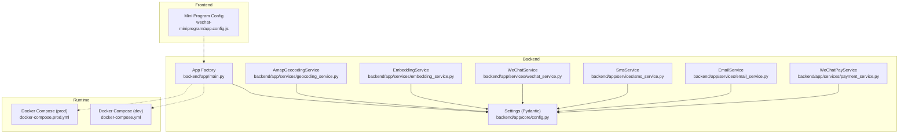
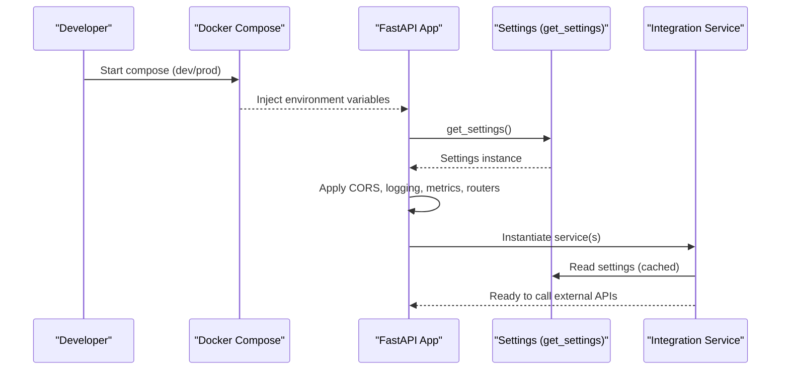
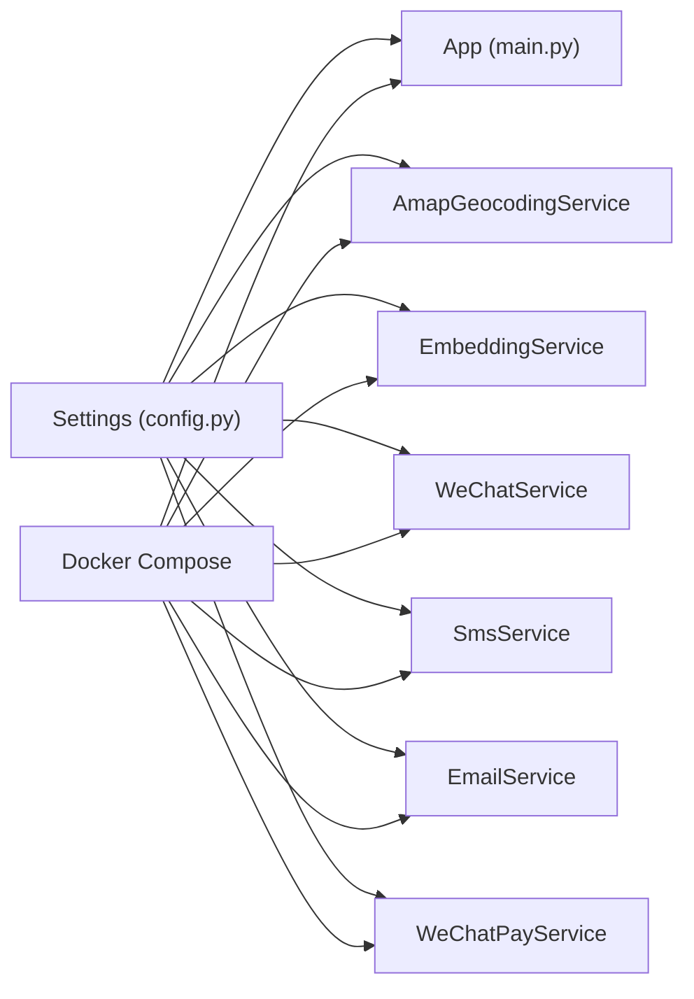
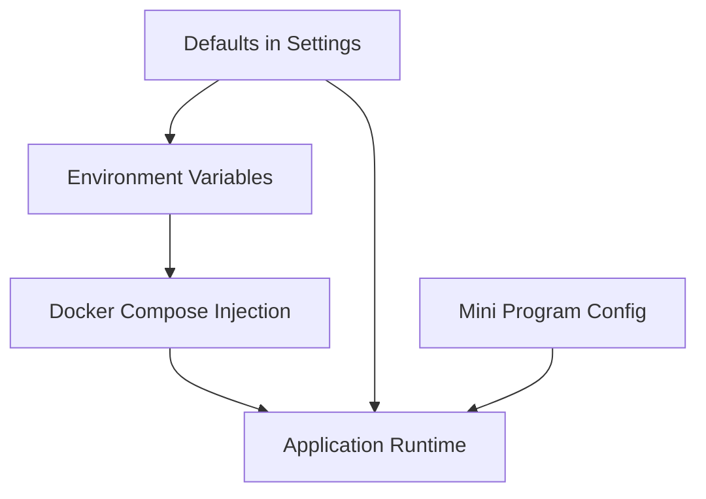

# Configuration & Environment Management

<cite>
**Referenced Files in This Document**
- [config.py](file://backend/app/core/config.py)
- [main.py](file://backend/app/main.py)
- [docker-compose.yml](file://docker-compose.yml)
- [docker-compose.prod.yml](file://docker-compose.prod.yml)
- [geocoding_service.py](file://backend/app/services/geocoding_service.py)
- [embedding_service.py](file://backend/app/services/embedding_service.py)
- [wechat_service.py](file://backend/app/services/wechat_service.py)
- [sms_service.py](file://backend/app/services/sms_service.py)
- [email_service.py](file://backend/app/services/email_service.py)
- [payment_service.py](file://backend/app/services/payment_service.py)
- [app.config.js](file://wechat-miniprogram/app.config.js)
- [README.md](file://README.md)
</cite>

## Table of Contents
1. [Introduction](#introduction)
2. [Project Structure](#project-structure)
3. [Core Components](#core-components)
4. [Architecture Overview](#architecture-overview)
5. [Detailed Component Analysis](#detailed-component-analysis)
6. [Dependency Analysis](#dependency-analysis)
7. [Performance Considerations](#performance-considerations)
8. [Troubleshooting Guide](#troubleshooting-guide)
9. [Conclusion](#conclusion)
10. [Appendices](#appendices)

## Introduction
This document explains how configuration and environment management are implemented across all external integrations. It focuses on the centralized Pydantic-based settings system, environment-specific configurations for development and production, Docker integration, and service-specific configuration examples (AMap, OpenAI, WeChat Mini Program, SMS, Email, and WeChat Pay). It also covers security best practices, validation behavior, migration strategies for schema changes, and troubleshooting guidance.

## Project Structure
Configuration is centralized in a single Pydantic Settings class and consumed by services and application startup. Environment variables drive runtime behavior, with Docker Compose providing environment-specific wiring. The frontend mini program uses a simple config file to select API endpoints per environment.

**Diagram sources**
- [config.py:1-167](file://backend/app/core/config.py#L1-L167)
- [main.py:1-82](file://backend/app/main.py#L1-L82)
- [docker-compose.yml:1-53](file://docker-compose.yml#L1-L53)
- [docker-compose.prod.yml:1-217](file://docker-compose.prod.yml#L1-L217)
- [geocoding_service.py:1-145](file://backend/app/services/geocoding_service.py#L1-L145)
- [embedding_service.py:1-32](file://backend/app/services/embedding_service.py#L1-L32)
- [wechat_service.py:1-146](file://backend/app/services/wechat_service.py#L1-L146)
- [sms_service.py:1-96](file://backend/app/services/sms_service.py#L1-L96)
- [email_service.py:1-76](file://backend/app/services/email_service.py#L1-L76)
- [payment_service.py:1-445](file://backend/app/services/payment_service.py#L1-L445)
- [app.config.js:1-15](file://wechat-miniprogram/app.config.js#L1-L15)

**Section sources**
- [config.py:1-167](file://backend/app/core/config.py#L1-L167)
- [main.py:1-82](file://backend/app/main.py#L1-L82)
- [docker-compose.yml:1-53](file://docker-compose.yml#L1-L53)
- [docker-compose.prod.yml:1-217](file://docker-compose.prod.yml#L1-L217)
- [app.config.js:1-15](file://wechat-miniprogram/app.config.js#L1-L15)

## Core Components
- Centralized Settings: A single Pydantic Settings class defines all configuration fields, defaults, and environment variable aliases. It reads from an .env file and ignores unknown extra keys.
- Application bootstrap: The app factory loads settings once and applies environment-dependent behaviors such as CORS origins and rate limiting.
- Service consumers: Each integration service retrieves settings via a cached accessor and uses them to configure clients and endpoints.

Key responsibilities:
- Define typed configuration with defaults and env aliases
- Provide a cached singleton accessor for performance
- Drive runtime behavior (debug mode, CORS, rate limits)
- Expose environment-specific toggles (e.g., production vs development)

**Section sources**
- [config.py:1-167](file://backend/app/core/config.py#L1-L167)
- [main.py:1-82](file://backend/app/main.py#L1-L82)

## Architecture Overview
The configuration architecture follows a clear separation:
- Settings definition: Single source of truth for all configuration fields
- Runtime loading: FastAPI app initialization consumes settings
- Service usage: Services read settings at construction time
- Environment orchestration: Docker Compose injects environment variables per deployment target

**Diagram sources**
- [main.py:17-78](file://backend/app/main.py#L17-L78)
- [config.py:164-167](file://backend/app/core/config.py#L164-L167)
- [docker-compose.yml:1-53](file://docker-compose.yml#L1-L53)
- [docker-compose.prod.yml:66-99](file://docker-compose.prod.yml#L66-L99)

## Detailed Component Analysis

### Centralized Settings Model
- Uses Pydantic v2-style BaseSettings with model_config pointing to an .env file and ignoring unknown fields.
- Fields include database URLs, Redis URL, JWT secrets, CORS origins, AI provider keys and models, AMap keys and endpoints, upload policy, WeChat credentials, SMS provider options, SMTP settings, JS key for AMap, and rate limiting parameters.
- A cached function returns a singleton Settings instance to avoid repeated parsing.

Operational notes:
- Defaults provide safe local development values; production overrides come from environment variables or Docker Compose.
- Many sensitive fields have empty defaults and rely on environment injection.

**Section sources**
- [config.py:1-167](file://backend/app/core/config.py#L1-L167)

### Application Bootstrap and Environment Behavior
- Loads settings early and configures:
  - Title and debug flag from settings
  - CORS origins: strict list in production, wildcard in non-production
  - Prometheus middleware and metrics endpoint
  - Optional Redis-backed rate limiting (graceful fallback if unavailable)
  - Request logging middleware and global exception handlers
  - Router inclusion with configured prefix
  - Static uploads directory mounting

Environment-driven behaviors:
- Production tightens CORS and disables debug
- Rate limiting depends on Redis availability and settings

**Section sources**
- [main.py:17-78](file://backend/app/main.py#L17-L78)

### AMap Integration (Geocoding and Nearby POI)
- Reads web key, geocode/around endpoints, timeouts, radius, and page size from settings.
- Validates presence of the web key before making requests.
- Uses httpx.AsyncClient with timeout derived from settings.

Common pitfalls:
- Missing AMAP_WEB_KEY raises a runtime error
- Invalid location format or missing geocodes raise value errors
- Network timeouts controlled by AMAP_GEOCODE_TIMEOUT_SECONDS

**Section sources**
- [geocoding_service.py:38-145](file://backend/app/services/geocoding_service.py#L38-L145)
- [config.py:74-97](file://backend/app/core/config.py#L74-L97)

### OpenAI Embeddings
- Initializes AsyncOpenAI client using OPENAI_API_KEY and selects embedding model from settings.
- Provides methods to generate embeddings for arbitrary text or property data.

Validation:
- Requires OPENAI_API_KEY to be set; otherwise client creation will fail when used.

**Section sources**
- [embedding_service.py:17-32](file://backend/app/services/embedding_service.py#L17-L32)
- [config.py:46-57](file://backend/app/core/config.py#L46-L57)

### WeChat Mini Program Service
- Manages login code exchange, access token caching, template messages, and customer service messages.
- Reads appid, secret, and token URL from settings.
- Caches access tokens with expiration handling.

Security considerations:
- Secrets must be provided via environment variables
- Token caching reduces repeated calls to WeChat servers

**Section sources**
- [wechat_service.py:23-146](file://backend/app/services/wechat_service.py#L23-L146)
- [config.py:107-119](file://backend/app/core/config.py#L107-L119)

### Alibaba Cloud SMS
- Implements HMAC-SHA1 signing and sends SMS via Aliyun’s API.
- Skips sending if not configured or phone number is empty.
- Endpoint can be overridden via settings.

Operational notes:
- AccessKeyId and AccessKeySecret must be provided
- TemplateCode and SignName required for successful sends

**Section sources**
- [sms_service.py:15-96](file://backend/app/services/sms_service.py#L15-L96)
- [config.py:121-130](file://backend/app/core/config.py#L121-L130)

### Email (SMTP)
- Sends HTML emails over SMTP with optional TLS.
- Skips sending if host/user/password are missing.
- Runs synchronous SMTP operations in an executor to avoid blocking the event loop.

Operational notes:
- From address falls back to user if not explicitly set
- TLS enabled by default unless disabled via settings

**Section sources**
- [email_service.py:11-76](file://backend/app/services/email_service.py#L11-L76)
- [config.py:132-145](file://backend/app/core/config.py#L132-L145)

### WeChat Pay V3
- Handles JSAPI order creation, callback verification/decryption, order queries, closing orders, and refunds.
- Requires merchant ID, APIv3 key, serial number, notify URLs, and a private key file path.
- Signs outgoing requests and verifies callbacks using platform certificate flow (structural implementation present; full cert fetch deferred).

Security requirements:
- Private key file must exist at the configured path
- APIv3 key used for decrypting callback resources
- Notify URLs must be publicly reachable during testing

**Section sources**
- [payment_service.py:60-445](file://backend/app/services/payment_service.py#L60-L445)
- [config.py:78-100](file://backend/app/core/config.py#L78-L100)

### Frontend Mini Program Configuration
- Simple config object selects base URLs for development and production.
- Switches between local dev server and production domain.

Usage:
- Change the selected environment constant to build/release for production.

**Section sources**
- [app.config.js:1-15](file://wechat-miniprogram/app.config.js#L1-L15)

## Dependency Analysis
- All services depend on the centralized Settings accessor.
- The app factory depends on Settings to configure middleware and routers.
- Docker Compose files inject environment variables into services and containers.

**Diagram sources**
- [config.py:1-167](file://backend/app/core/config.py#L1-L167)
- [main.py:1-82](file://backend/app/main.py#L1-L82)
- [docker-compose.yml:1-53](file://docker-compose.yml#L1-L53)
- [docker-compose.prod.yml:1-217](file://docker-compose.prod.yml#L1-L217)

**Section sources**
- [config.py:1-167](file://backend/app/core/config.py#L1-L167)
- [main.py:1-82](file://backend/app/main.py#L1-L82)
- [docker-compose.yml:1-53](file://docker-compose.yml#L1-L53)
- [docker-compose.prod.yml:1-217](file://docker-compose.prod.yml#L1-L217)

## Performance Considerations
- Settings caching: get_settings uses an LRU cache to avoid re-parsing environment variables on each import.
- HTTP timeouts: AMap requests use configurable timeouts to prevent hanging connections.
- Rate limiting: Optional Redis-backed limiter can be enabled; ensure Redis connectivity and memory policies are tuned for production.
- File I/O: WeChat Pay private key is lazily loaded and cached per service instance.

[No sources needed since this section provides general guidance]

## Troubleshooting Guide

### Common Configuration Issues
- Missing API keys:
  - AMap: RuntimeError raised if AMAP_WEB_KEY is not set.
  - OpenAI: Client initialization fails without OPENAI_API_KEY.
  - WeChat Pay: FileNotFoundError if private key path is invalid.
- Incorrect endpoints:
  - AMap geocode/around URLs must be valid and reachable.
  - WeChat token and message endpoints require network access.
  - SMS endpoint can be overridden; verify DNS and firewall rules.
- SMTP misconfiguration:
  - Host, user, password must be set; TLS may need adjustment depending on provider.

### Connection Problems
- Database and Redis:
  - Ensure DATABASE_URL and REDIS_URL match container networking and credentials.
  - In production, passwords should be injected securely and match docker-compose definitions.
- External API reachability:
  - Verify outbound internet access from containers.
  - Check proxy/firewall rules for domains like amap.com, weixin.qq.com, aliyuncs.com, openai.com.

### Service Discovery Failures
- Container names and networks:
  - Use internal service names (postgres, redis) within Docker networks.
  - Confirm health checks pass before dependent services start.

### Validation and Migration Strategies
- Schema evolution:
  - Add new fields with sensible defaults to maintain backward compatibility.
  - Mark breaking changes carefully; consider deprecation warnings in services.
- Environment drift:
  - Keep .env.example updated whenever new variables are introduced.
  - Use separate .env.prod for production and never commit secrets.

### Required Environment Variables (selected)
- Core:
  - DATABASE_URL, ALEMBIC_DATABASE_URL, REDIS_URL, AUTH_SECRET_KEY, ACCESS_TOKEN_EXPIRE_MINUTES, REFRESH_TOKEN_EXPIRE_DAYS, CORS_ORIGINS, ENVIRONMENT, DEBUG
- AI providers:
  - OPENAI_API_KEY, OPENAI_EMBEDDING_MODEL, OPENAI_CHAT_MODEL
  - DEEPSEEK_API_KEY, DEEPSEEK_CHAT_MODEL, DEEPSEEK_BASE_URL
- AMap:
  - AMAP_WEB_KEY, AMAP_GEOCODE_URL, AMAP_GEOCODE_TIMEOUT_SECONDS, AMAP_AROUND_URL, AMAP_NEARBY_RADIUS_METERS, AMAP_NEARBY_PAGE_SIZE, AMAP_JS_KEY
- WeChat Mini Program:
  - WECHAT_APPID, WECHAT_SECRET, WECHAT_TOKEN_URL
- SMS (Alibaba Cloud):
  - SMS_PROVIDER, SMS_ACCESS_KEY_ID, SMS_ACCESS_KEY_SECRET, SMS_SIGN_NAME, SMS_TEMPLATE_CODE, SMS_ENDPOINT
- Email (SMTP):
  - SMTP_HOST, SMTP_PORT, SMTP_USER, SMTP_PASSWORD, SMTP_FROM_NAME, SMTP_FROM_EMAIL, SMTP_USE_TLS
- Uploads:
  - UPLOAD_DIR, MAX_UPLOAD_SIZE, ALLOWED_IMAGE_TYPES, MAX_IMAGES_PER_PROPERTY
- Rate limiting:
  - RATE_LIMIT_REQUESTS, RATE_LIMIT_WINDOW_SECONDS
- WeChat Pay:
  - WECHAT_PAY_MCHID, WECHAT_PAY_API_V3_KEY, WECHAT_PAY_SERIAL_NO, WECHAT_PAY_NOTIFY_URL, WECHAT_PAY_REFUND_NOTIFY_URL, WECHAT_PAY_PRIVATE_KEY_PATH

For a concise reference, see the project README’s environment variables section.

**Section sources**
- [geocoding_service.py:46-48](file://backend/app/services/geocoding_service.py#L46-L48)
- [embedding_service.py:17-21](file://backend/app/services/embedding_service.py#L17-L21)
- [payment_service.py:103-115](file://backend/app/services/payment_service.py#L103-L115)
- [README.md:196-209](file://README.md#L196-L209)

## Conclusion
The configuration system centralizes all external integrations behind a typed, validated, and cached Settings model. Environment variables and Docker Compose orchestrate differences across deployments. Services consume settings directly, enabling consistent and secure configuration. Following the security and troubleshooting recommendations ensures reliable operation across development, staging, and production environments.

[No sources needed since this section summarizes without analyzing specific files]

## Appendices

### Security Best Practices
- Store secrets in environment variables or Docker secrets; never hardcode or commit secrets.
- Rotate API keys regularly and audit usage logs.
- Restrict CORS origins in production and disable debug mode.
- Validate and sanitize inputs before calling external APIs.
- Use least-privilege credentials for databases and third-party services.

[No sources needed since this section provides general guidance]

### Example Configuration Scenarios

#### Development
- Local .env with defaults and localhost endpoints
- Docker Compose exposes Postgres and Redis locally
- CORS allows all origins for convenience

**Section sources**
- [docker-compose.yml:1-53](file://docker-compose.yml#L1-L53)
- [main.py:27-39](file://backend/app/main.py#L27-L39)

#### Production
- Separate .env.prod with real secrets and production endpoints
- Strict CORS origins and disabled debug
- Resource limits and persistent volumes for services
- Health checks and restart policies

**Section sources**
- [docker-compose.prod.yml:1-217](file://docker-compose.prod.yml#L1-L217)
- [main.py:27-39](file://backend/app/main.py#L27-L39)

### Configuration Hierarchy Summary
- Defaults defined in Settings class
- Environment variables override defaults
- Docker Compose injects environment variables per service
- Frontend mini program selects endpoints via a config file

**Diagram sources**
- [config.py:1-167](file://backend/app/core/config.py#L1-L167)
- [docker-compose.yml:1-53](file://docker-compose.yml#L1-L53)
- [docker-compose.prod.yml:1-217](file://docker-compose.prod.yml#L1-L217)
- [app.config.js:1-15](file://wechat-miniprogram/app.config.js#L1-L15)