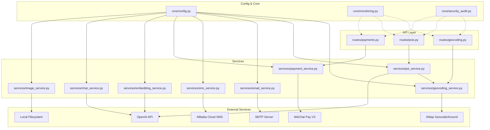
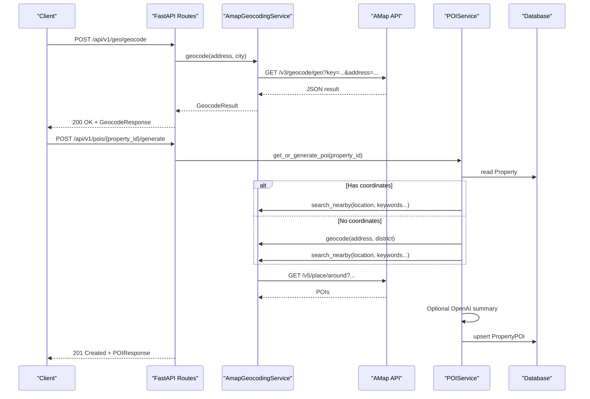
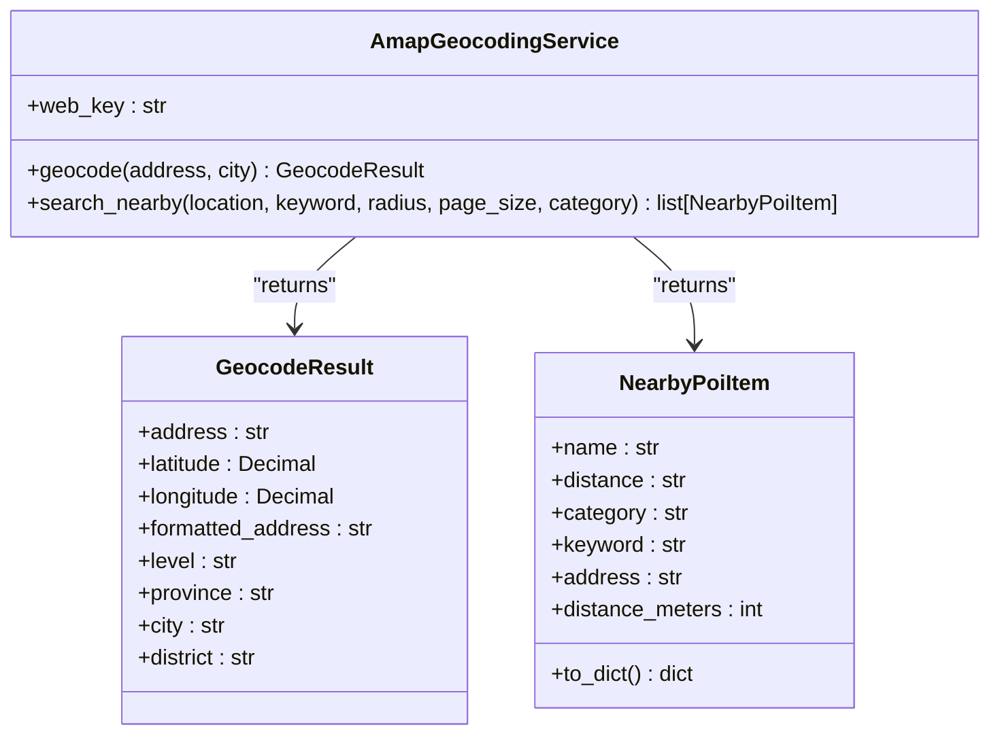
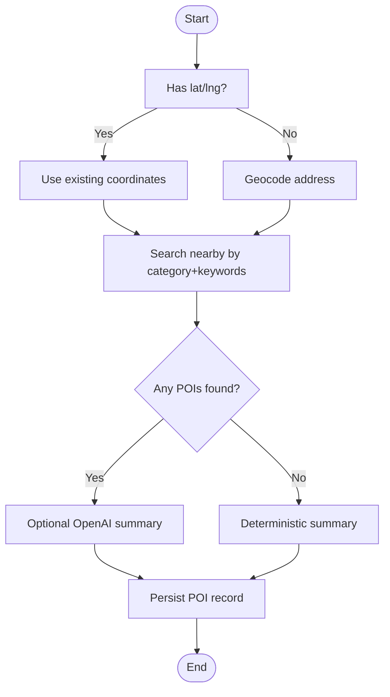
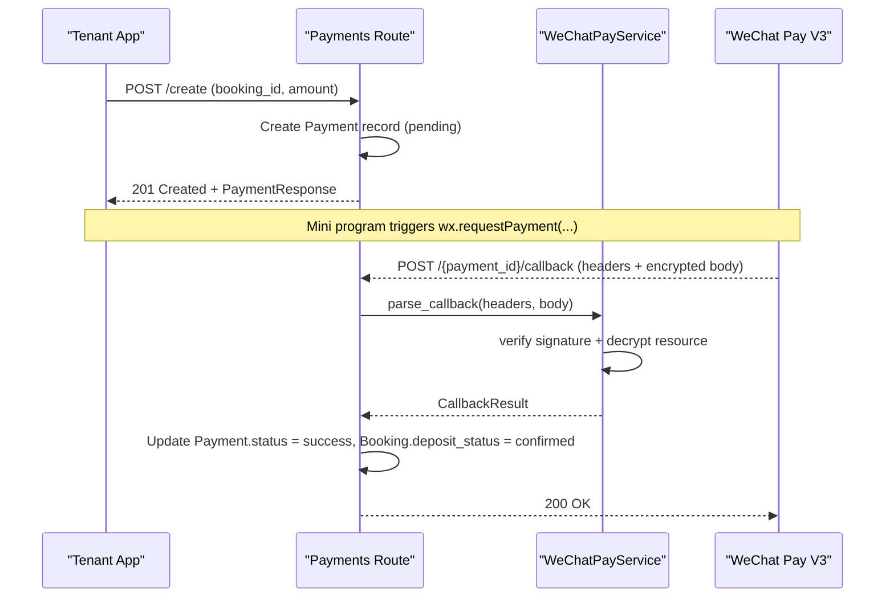
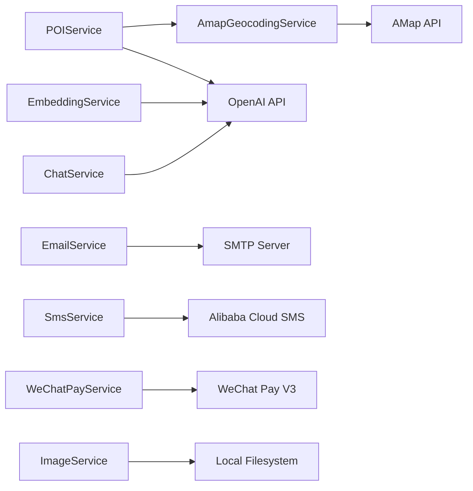

# External Integrations

<cite>
**Referenced Files in This Document**
- [geocoding_service.py](file://backend/app/services/geocoding_service.py)
- [poi_service.py](file://backend/app/services/poi_service.py)
- [geocoding.py](file://backend/app/api/v1/routes/geocoding.py)
- [pois.py](file://backend/app/api/v1/routes/pois.py)
- [email_service.py](file://backend/app/services/email_service.py)
- [sms_service.py](file://backend/app/services/sms_service.py)
- [payment_service.py](file://backend/app/services/payment_service.py)
- [payments.py](file://backend/app/api/v1/routes/payments.py)
- [embedding_service.py](file://backend/app/services/embedding_service.py)
- [chat_service.py](file://backend/app/services/chat_service.py)
- [image_service.py](file://backend/app/services/image_service.py)
- [config.py](file://backend/app/core/config.py)
- [monitoring.py](file://backend/app/core/monitoring.py)
- [security_audit.py](file://backend/app/core/security_audit.py)
</cite>

## Table of Contents
1. [Introduction](#introduction)
2. [Project Structure](#project-structure)
3. [Core Components](#core-components)
4. [Architecture Overview](#architecture-overview)
5. [Detailed Component Analysis](#detailed-component-analysis)
6. [Dependency Analysis](#dependency-analysis)
7. [Performance Considerations](#performance-considerations)
8. [Troubleshooting Guide](#troubleshooting-guide)
9. [Conclusion](#conclusion)
10. [Appendices](#appendices)

## Introduction
This document provides comprehensive documentation for all external service integrations in the Rental Housing Structure platform. It covers:
- AMap geographic services for geocoding, nearby POI search, and map visualization support
- Email notifications via SMTP
- SMS notifications via Alibaba Cloud
- Payment gateway integration with WeChat Pay V3 (deposit collection and service fees)
- OpenAI API for embeddings generation and chat completion
- File storage for property images and documents
- Error handling strategies, retry mechanisms, and fallbacks
- Configuration management for API keys, rate limiting, and monitoring
- Guidance for implementing new external integrations and testing strategies

## Project Structure
External integrations are implemented as dedicated services under backend/app/services, exposed through FastAPI routes under backend/app/api/v1/routes, and configured via backend/app/core/config.py. Monitoring and rate limiting are provided by core modules.

**Diagram sources**
- [geocoding.py:1-25](file://backend/app/api/v1/routes/geocoding.py#L1-L25)
- [pois.py:1-32](file://backend/app/api/v1/routes/pois.py#L1-L32)
- [payments.py:1-85](file://backend/app/api/v1/routes/payments.py#L1-L85)
- [geocoding_service.py:1-145](file://backend/app/services/geocoding_service.py#L1-L145)
- [poi_service.py:1-311](file://backend/app/services/poi_service.py#L1-L311)
- [email_service.py:1-76](file://backend/app/services/email_service.py#L1-L76)
- [sms_service.py:1-96](file://backend/app/services/sms_service.py#L1-L96)
- [payment_service.py:1-445](file://backend/app/services/payment_service.py#L1-L445)
- [embedding_service.py:1-32](file://backend/app/services/embedding_service.py#L1-L32)
- [chat_service.py:1-302](file://backend/app/services/chat_service.py#L1-L302)
- [image_service.py:1-95](file://backend/app/services/image_service.py#L1-L95)
- [config.py:1-167](file://backend/app/core/config.py#L1-L167)
- [monitoring.py:1-227](file://backend/app/core/monitoring.py#L1-L227)
- [security_audit.py:49-110](file://backend/app/core/security_audit.py#L49-L110)

**Section sources**
- [geocoding.py:1-25](file://backend/app/api/v1/routes/geocoding.py#L1-L25)
- [pois.py:1-32](file://backend/app/api/v1/routes/pois.py#L1-L32)
- [payments.py:1-85](file://backend/app/api/v1/routes/payments.py#L1-L85)
- [geocoding_service.py:1-145](file://backend/app/services/geocoding_service.py#L1-L145)
- [poi_service.py:1-311](file://backend/app/services/poi_service.py#L1-L311)
- [email_service.py:1-76](file://backend/app/services/email_service.py#L1-L76)
- [sms_service.py:1-96](file://backend/app/services/sms_service.py#L1-L96)
- [payment_service.py:1-445](file://backend/app/services/payment_service.py#L1-L445)
- [embedding_service.py:1-32](file://backend/app/services/embedding_service.py#L1-L32)
- [chat_service.py:1-302](file://backend/app/services/chat_service.py#L1-L302)
- [image_service.py:1-95](file://backend/app/services/image_service.py#L1-L95)
- [config.py:1-167](file://backend/app/core/config.py#L1-L167)
- [monitoring.py:1-227](file://backend/app/core/monitoring.py#L1-L227)
- [security_audit.py:49-110](file://backend/app/core/security_audit.py#L49-L110)

## Core Components
- AMapGeocodingService: Provides geocoding and nearby POI search using AMap APIs.
- POIService: Orchestrates POI data generation per property, combining AMap results and optional OpenAI summarization with deterministic fallbacks.
- EmailService: Sends HTML emails via SMTP asynchronously.
- SmsService: Sends SMS via Alibaba Cloud with HMAC-SHA1 signature.
- WeChatPayService: Implements JSAPI order creation, callback parsing/decryption, order query, close, and refund flows.
- EmbeddingService: Generates text embeddings via OpenAI.
- ChatService: Provides chat completions with RAG context built from embeddings and pgvector search.
- ImageService: Manages local file uploads and metadata for property images.
- Config: Centralized settings for all integrations.
- Monitoring: Prometheus metrics middleware and endpoints.
- Rate Limiting: Token-bucket limiter using Redis.

**Section sources**
- [geocoding_service.py:1-145](file://backend/app/services/geocoding_service.py#L1-L145)
- [poi_service.py:1-311](file://backend/app/services/poi_service.py#L1-L311)
- [email_service.py:1-76](file://backend/app/services/email_service.py#L1-L76)
- [sms_service.py:1-96](file://backend/app/services/sms_service.py#L1-L96)
- [payment_service.py:1-445](file://backend/app/services/payment_service.py#L1-L445)
- [embedding_service.py:1-32](file://backend/app/services/embedding_service.py#L1-L32)
- [chat_service.py:1-302](file://backend/app/services/chat_service.py#L1-L302)
- [image_service.py:1-95](file://backend/app/services/image_service.py#L1-L95)
- [config.py:1-167](file://backend/app/core/config.py#L1-L167)
- [monitoring.py:1-227](file://backend/app/core/monitoring.py#L1-L227)
- [security_audit.py:49-110](file://backend/app/core/security_audit.py#L49-L110)

## Architecture Overview
The system uses a layered architecture:
- API routes handle HTTP requests and delegate to services.
- Services encapsulate third-party calls and business logic.
- Configuration is centralized and injected into services.
- Monitoring and rate limiting are applied at the application level.

**Diagram sources**
- [geocoding.py:1-25](file://backend/app/api/v1/routes/geocoding.py#L1-L25)
- [pois.py:1-32](file://backend/app/api/v1/routes/pois.py#L1-L32)
- [geocoding_service.py:1-145](file://backend/app/services/geocoding_service.py#L1-L145)
- [poi_service.py:1-311](file://backend/app/services/poi_service.py#L1-L311)

## Detailed Component Analysis

### AMap Geographic Services Integration
Responsibilities:
- Geocode addresses to latitude/longitude.
- Search nearby POIs by location and keyword with configurable radius and page size.
- Provide structured results for downstream features like POI generation and map visualization.

Key behaviors:
- Validates configuration (web key).
- Uses async HTTP client with timeouts.
- Normalizes and sorts POI results by distance.

**Diagram sources**
- [geocoding_service.py:1-145](file://backend/app/services/geocoding_service.py#L1-L145)

Error handling and fallbacks:
- Missing API key raises a clear error; route maps it to 503.
- Invalid responses raise descriptive errors; route maps them to 400.
- Network or timeout errors propagate to callers for upstream handling.

Configuration:
- Web key, geocode URL, around URL, timeouts, default radius, and page size are set via environment variables.

Usage examples:
- Route endpoint for geocoding address.
- POI generation pipeline uses geocoding and nearby search.

**Section sources**
- [geocoding_service.py:1-145](file://backend/app/services/geocoding_service.py#L1-L145)
- [geocoding.py:1-25](file://backend/app/api/v1/routes/geocoding.py#L1-L25)
- [config.py:74-97](file://backend/app/core/config.py#L74-L97)

### POI Data Generation and Map Visualization Support
Responsibilities:
- Generate per-property POI summaries and categorized nearby facilities.
- Combine AMap results with optional OpenAI-generated summaries.
- Persist POI data for reuse and display on maps.

Flow overview:
- Resolve location from existing coordinates or geocoding.
- Collect nearby categories using multiple keywords.
- Optionally generate natural-language summary via OpenAI.
- Fallback to deterministic content if external services fail.

**Diagram sources**
- [poi_service.py:1-311](file://backend/app/services/poi_service.py#L1-L311)
- [geocoding_service.py:1-145](file://backend/app/services/geocoding_service.py#L1-L145)

Integration points:
- Uses AMapGeocodingService for location resolution and nearby search.
- Optionally uses OpenAI chat model for summary generation.
- Persists results to database for retrieval and map rendering.

**Section sources**
- [poi_service.py:1-311](file://backend/app/services/poi_service.py#L1-L311)
- [pois.py:1-32](file://backend/app/api/v1/routes/pois.py#L1-L32)

### Email Service (SMTP)
Responsibilities:
- Send HTML emails via SMTP asynchronously.
- Gracefully skip sending when not configured or recipient is empty.

Behavior:
- Constructs MIME message and sends via smtplib in an executor to avoid blocking the event loop.
- Returns status dict indicating sent or skipped.

Error handling:
- Logs warnings when SMTP is not configured.
- Re-raises exceptions after logging for caller handling.

Configuration:
- Host, port, user, password, sender name/email, TLS flag.

**Section sources**
- [email_service.py:1-76](file://backend/app/services/email_service.py#L1-L76)
- [config.py:132-145](file://backend/app/core/config.py#L132-L145)

### SMS Service (Alibaba Cloud)
Responsibilities:
- Send SMS messages via Alibaba Cloud SMS API.
- Build HMAC-SHA1 signatures and send requests.

Behavior:
- Skips sending if phone number missing or credentials not configured.
- Returns status dict with success/failure details.

Error handling:
- Logs warnings and errors; re-raises network-level exceptions.

Configuration:
- Access key ID/secret, sign name, template code, endpoint override.

**Section sources**
- [sms_service.py:1-96](file://backend/app/services/sms_service.py#L1-L96)
- [config.py:121-130](file://backend/app/core/config.py#L121-L130)

### Payment Gateway Integration (WeChat Pay V3)
Responsibilities:
- Create JSAPI prepay orders for mini program payments.
- Verify and decrypt payment callbacks.
- Query order status, close unpaid orders, and apply refunds.

Key flows:
- Order creation signs request body and sets required headers.
- Callback verification validates structure and decrypts resource payload.
- Refund flow supports reason and optional notify URL.

**Diagram sources**
- [payments.py:1-85](file://backend/app/api/v1/routes/payments.py#L1-L85)
- [payment_service.py:1-445](file://backend/app/services/payment_service.py#L1-L445)

Error handling and security:
- Signature verification placeholder documented; production should fetch and cache platform certificate and verify signatures.
- Decryption uses AES-GCM with API v3 key.
- All HTTP calls use httpx.AsyncClient; errors raised to callers.

Configuration:
- Merchant ID, API v3 key, serial number, appid, notify URLs, private key path.

Notes:
- Current route simulates callback processing; replace with real WeChat callback verification in production.

**Section sources**
- [payment_service.py:1-445](file://backend/app/services/payment_service.py#L1-L445)
- [payments.py:1-85](file://backend/app/api/v1/routes/payments.py#L1-L85)
- [config.py:107-119](file://backend/app/core/config.py#L107-L119)

### OpenAI API Integration (Embeddings and Chat)
Responsibilities:
- Generate embeddings for text and property descriptions.
- Provide chat completions with RAG context built from vector similarity search.

Embeddings:
- AsyncOpenAI client configured with API key and model.
- Utility to build property text from fields.

Chat:
- Builds RAG context by embedding query and searching pgvector-indexed properties.
- Streams or non-streaming responses; persists messages and matched properties.

Error handling:
- Exceptions logged; streaming yields error chunks and terminates gracefully.

Configuration:
- API key, embedding model, chat model.

**Section sources**
- [embedding_service.py:1-32](file://backend/app/services/embedding_service.py#L1-L32)
- [chat_service.py:1-302](file://backend/app/services/chat_service.py#L1-L302)
- [config.py:46-57](file://backend/app/core/config.py#L46-L57)

### File Storage Integration (Property Images)
Responsibilities:
- Upload property images to local filesystem.
- Track metadata in database and manage primary image selection.

Behavior:
- Generates safe filenames and writes bytes to disk.
- Supports delete and setting primary image.

Error handling:
- Database operations wrapped in transactions; file deletions guarded by existence checks.

Configuration:
- Upload directory, max upload size, allowed types, max images per property.

**Section sources**
- [image_service.py:1-95](file://backend/app/services/image_service.py#L1-L95)
- [config.py:99-105](file://backend/app/core/config.py#L99-L105)

## Dependency Analysis
External dependencies and their relationships:
- AMapGeocodingService depends on AMap REST APIs.
- POIService depends on AMapGeocodingService and optionally OpenAI.
- EmailService depends on SMTP servers.
- SmsService depends on Alibaba Cloud SMS.
- WeChatPayService depends on WeChat Pay V3.
- EmbeddingService and ChatService depend on OpenAI.
- ImageService depends on local filesystem and database.

**Diagram sources**
- [geocoding_service.py:1-145](file://backend/app/services/geocoding_service.py#L1-L145)
- [poi_service.py:1-311](file://backend/app/services/poi_service.py#L1-L311)
- [email_service.py:1-76](file://backend/app/services/email_service.py#L1-L76)
- [sms_service.py:1-96](file://backend/app/services/sms_service.py#L1-L96)
- [payment_service.py:1-445](file://backend/app/services/payment_service.py#L1-L445)
- [embedding_service.py:1-32](file://backend/app/services/embedding_service.py#L1-L32)
- [chat_service.py:1-302](file://backend/app/services/chat_service.py#L1-L302)
- [image_service.py:1-95](file://backend/app/services/image_service.py#L1-L95)

**Section sources**
- [geocoding_service.py:1-145](file://backend/app/services/geocoding_service.py#L1-L145)
- [poi_service.py:1-311](file://backend/app/services/poi_service.py#L1-L311)
- [email_service.py:1-76](file://backend/app/services/email_service.py#L1-L76)
- [sms_service.py:1-96](file://backend/app/services/sms_service.py#L1-L96)
- [payment_service.py:1-445](file://backend/app/services/payment_service.py#L1-L445)
- [embedding_service.py:1-32](file://backend/app/services/embedding_service.py#L1-L32)
- [chat_service.py:1-302](file://backend/app/services/chat_service.py#L1-L302)
- [image_service.py:1-95](file://backend/app/services/image_service.py#L1-L95)

## Performance Considerations
- Timeouts: AMap geocoding and nearby search use configurable timeouts to prevent long waits.
- Asynchronous I/O: Email sending runs in an executor to avoid blocking the event loop; other services use async HTTP clients.
- Metrics: Prometheus middleware tracks request counts, latency, and in-flight requests; Celery task metrics are available when installed.
- Rate Limiting: Token-bucket limiter protects endpoints from abuse using Redis.

Recommendations:
- Add exponential backoff and retries for transient failures in external calls.
- Cache frequently accessed POI data and OpenAI summaries.
- Monitor external service latency and error rates via Prometheus dashboards.

[No sources needed since this section provides general guidance]

## Troubleshooting Guide
Common issues and resolutions:
- AMap key not configured: Ensure AMAP_WEB_KEY is set; route returns 503 when missing.
- Geocoding failure: Validate address/city inputs; check AMap API info field for error details.
- Nearby search empty: Adjust radius/page size; confirm location format and category keywords.
- SMTP not configured: Set SMTP_HOST, SMTP_USER, SMTP_PASSWORD; service skips sending and logs warning.
- SMS not configured: Set SMS_ACCESS_KEY_ID and SMS_ACCESS_KEY_SECRET; service skips sending and logs warning.
- WeChat Pay callback: Implement full signature verification using platform certificate; ensure API v3 key and private key paths are correct.
- OpenAI errors: Verify OPENAI_API_KEY and model names; consider fallbacks and retries.
- File upload errors: Check UPLOAD_DIR permissions and MAX_UPLOAD_SIZE; validate allowed image types.

Monitoring and observability:
- Use /metrics endpoint to inspect request latency and counts.
- Enable Celery metrics for background tasks.
- Review logs for service-specific warnings and exceptions.

**Section sources**
- [geocoding.py:1-25](file://backend/app/api/v1/routes/geocoding.py#L1-L25)
- [email_service.py:1-76](file://backend/app/services/email_service.py#L1-L76)
- [sms_service.py:1-96](file://backend/app/services/sms_service.py#L1-L96)
- [payment_service.py:1-445](file://backend/app/services/payment_service.py#L1-L445)
- [monitoring.py:1-227](file://backend/app/core/monitoring.py#L1-L227)
- [security_audit.py:49-110](file://backend/app/core/security_audit.py#L49-L110)

## Conclusion
The platform integrates multiple external services to deliver location-based search, notifications, payments, AI-powered features, and media management. Each integration follows consistent patterns:
- Centralized configuration
- Async I/O where applicable
- Clear error handling and logging
- Fallbacks and graceful degradation
- Observability via metrics and rate limiting

Adopting the recommended enhancements (retries, caching, robust signature verification) will improve reliability and performance.

[No sources needed since this section summarizes without analyzing specific files]

## Appendices

### Configuration Management Summary
- AMap: web key, geocode/around URLs, timeouts, radius, page size.
- Email: host, port, user, password, sender name/email, TLS.
- SMS: provider, access keys, sign name, template code, endpoint.
- Payments: merchant ID, API v3 key, serial number, appid, notify URLs, private key path.
- OpenAI: API key, embedding model, chat model.
- Uploads: directory, max size, allowed types, max images per property.
- Rate limiting: requests per window, window duration.

**Section sources**
- [config.py:74-161](file://backend/app/core/config.py#L74-L161)

### Implementing a New External Service Integration
Steps:
1. Add configuration fields in Settings with validation aliases.
2. Create a service class that reads settings and performs async calls.
3. Wrap HTTP calls with timeouts and proper error handling.
4. Expose functionality via a FastAPI route with appropriate status codes.
5. Add metrics and logging; consider rate limiting and retries.
6. Write tests mocking external dependencies.

Example pattern references:
- Service initialization and settings usage.
- Async HTTP client usage and response handling.
- Route mapping and exception translation.

**Section sources**
- [geocoding_service.py:1-145](file://backend/app/services/geocoding_service.py#L1-L145)
- [geocoding.py:1-25](file://backend/app/api/v1/routes/geocoding.py#L1-L25)
- [config.py:1-167](file://backend/app/core/config.py#L1-L167)

### Testing Strategies for Third-Party Dependencies
- Mock HTTP clients (e.g., httpx.AsyncClient) to simulate responses and errors.
- Use test fixtures for configuration overrides.
- Validate error paths (missing keys, invalid payloads, network failures).
- For payments, mock callback payloads and verify decryption/signature flows.
- For AI services, stub embeddings and chat completions.

[No sources needed since this section provides general guidance]