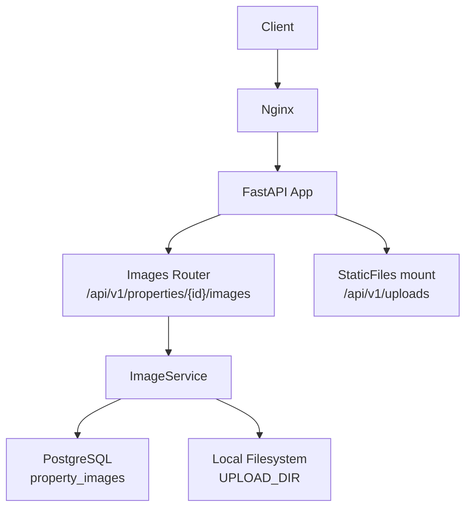
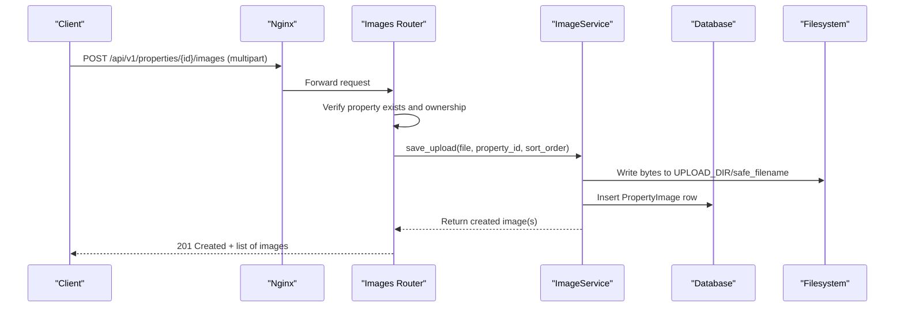
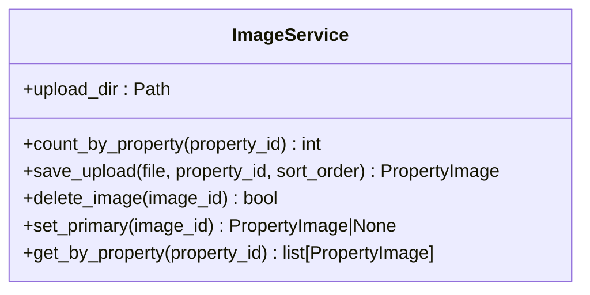
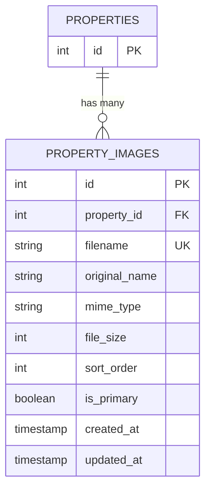
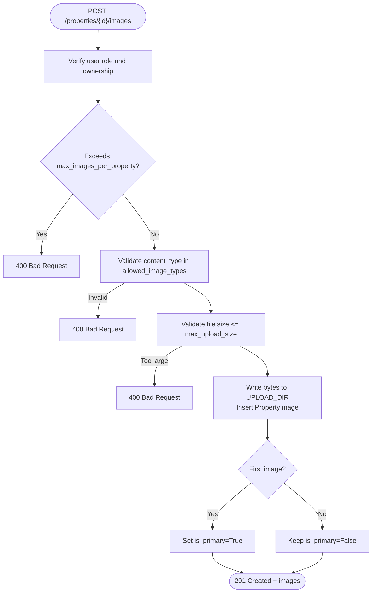
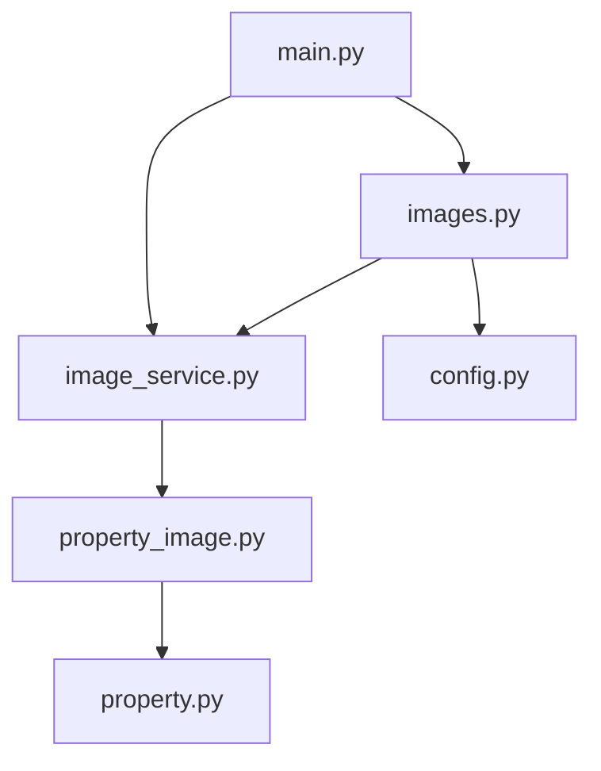

# File Storage & Media Handling

<cite>
**Referenced Files in This Document**
- [image_service.py](file://backend/app/services/image_service.py)
- [property_image.py](file://backend/app/models/property_image.py)
- [property.py](file://backend/app/models/property.py)
- [images.py](file://backend/app/api/v1/routes/images.py)
- [config.py](file://backend/app/core/config.py)
- [main.py](file://backend/app/main.py)
- [20260620_0003_property_images.py](file://backend/alembic/versions/20260620_0003_property_images.py)
- [test_images.py](file://backend/tests/test_images.py)
</cite>

## Table of Contents
1. [Introduction](#introduction)
2. [Project Structure](#project-structure)
3. [Core Components](#core-components)
4. [Architecture Overview](#architecture-overview)
5. [Detailed Component Analysis](#detailed-component-analysis)
6. [Dependency Analysis](#dependency-analysis)
7. [Performance Considerations](#performance-considerations)
8. [Troubleshooting Guide](#troubleshooting-guide)
9. [Conclusion](#conclusion)
10. [Appendices](#appendices)

## Introduction
This document explains the file storage and media handling services for property images. It covers the ImageService implementation, the PropertyImage model and its relationship with properties, the upload workflow (validation, format checks, size limits), and how files are stored and served. It also outlines security measures, performance considerations, and maintenance procedures for cleanup and quota management.

## Project Structure
The image feature spans API routes, a service layer, data models, configuration, and static file serving:
- API route: handles HTTP endpoints for listing, uploading, deleting, and setting primary images.
- Service: encapsulates business logic for saving, deleting, and managing images.
- Model: defines the database schema and relationships.
- Configuration: provides upload directory, allowed types, size limits, and per-property limits.
- Static serving: mounts the upload directory to serve uploaded files via an internal path.

**Diagram sources**
- [images.py:1-151](file://backend/app/api/v1/routes/images.py#L1-L151)
- [image_service.py:1-95](file://backend/app/services/image_service.py#L1-L95)
- [main.py:73-77](file://backend/app/main.py#L73-L77)

**Section sources**
- [images.py:1-151](file://backend/app/api/v1/routes/images.py#L1-L151)
- [image_service.py:1-95](file://backend/app/services/image_service.py#L1-L95)
- [main.py:73-77](file://backend/app/main.py#L73-L77)

## Core Components
- ImageService: manages persistence of image metadata and filesystem operations for uploads and deletions; determines primary image based on count.
- PropertyImage model: stores filename, original name, MIME type, size, sort order, and primary flag; linked to Property via foreign key.
- Images router: enforces ownership, validates file types and sizes, counts existing images against limits, persists uploads, and serves metadata.
- Settings: centralizes upload_dir, max_upload_size, allowed_image_types, and max_images_per_property.
- Static file mount: exposes uploaded files under /api/v1/uploads for direct access by clients or CDN origin.

Key responsibilities:
- Validation: content type whitelist, size limit, per-property count limit.
- Persistence: write bytes to disk, record metadata in DB, set first image as primary automatically.
- Access control: require landlord role or admin; verify property ownership before mutating.
- Serving: mount upload directory for static retrieval.

**Section sources**
- [image_service.py:13-95](file://backend/app/services/image_service.py#L13-L95)
- [property_image.py:8-23](file://backend/app/models/property_image.py#L8-L23)
- [images.py:26-151](file://backend/app/api/v1/routes/images.py#L26-L151)
- [config.py:99-105](file://backend/app/core/config.py#L99-L105)
- [main.py:73-77](file://backend/app/main.py#L73-L77)

## Architecture Overview
End-to-end flow for uploading property images:

**Diagram sources**
- [images.py:26-80](file://backend/app/api/v1/routes/images.py#L26-L80)
- [image_service.py:27-52](file://backend/app/services/image_service.py#L27-L52)

## Detailed Component Analysis

### ImageService
Responsibilities:
- Count images per property to enforce ordering and determine primary status.
- Save uploaded file bytes to local filesystem using a unique filename.
- Persist image metadata into the database.
- Delete image from both filesystem and database.
- Set a specific image as primary while unsetting others for the same property.
- List images for a property ordered by sort_order and id.

Complexity notes:
- save_upload performs one filesystem write and one DB insert per file.
- set_primary issues an update to reset all primaries for a property, then sets the target.

**Diagram sources**
- [image_service.py:13-95](file://backend/app/services/image_service.py#L13-L95)

**Section sources**
- [image_service.py:13-95](file://backend/app/services/image_service.py#L13-L95)

### PropertyImage Model and Relationship
Schema highlights:
- Unique filename constraint ensures no collisions.
- Foreign key to properties with cascade delete.
- Boolean is_primary indicates cover image; sort_order controls display sequence.
- Timestamps inherited from mixin.

Relationship:
- One Property has many PropertyImage entries; deletion cascades to images.

**Diagram sources**
- [property_image.py:8-23](file://backend/app/models/property_image.py#L8-L23)
- [property.py:84-86](file://backend/app/models/property.py#L84-L86)
- [20260620_0003_property_images.py:20-41](file://backend/alembic/versions/20260620_0003_property_images.py#L20-L41)

**Section sources**
- [property_image.py:8-23](file://backend/app/models/property_image.py#L8-L23)
- [property.py:84-86](file://backend/app/models/property.py#L84-L86)
- [20260620_0003_property_images.py:20-41](file://backend/alembic/versions/20260620_0003_property_images.py#L20-L41)

### Upload Workflow and Validation
Validation and enforcement:
- Ownership check: only the property’s landlord or an admin can mutate images.
- Type validation: only configured MIME types accepted.
- Size validation: reject files exceeding configured maximum.
- Quantity limit: prevent exceeding max_images_per_property.
- Primary assignment: first image becomes primary automatically.

**Diagram sources**
- [images.py:26-80](file://backend/app/api/v1/routes/images.py#L26-L80)
- [image_service.py:27-52](file://backend/app/services/image_service.py#L27-L52)
- [config.py:99-105](file://backend/app/core/config.py#L99-L105)

**Section sources**
- [images.py:26-80](file://backend/app/api/v1/routes/images.py#L26-L80)
- [image_service.py:27-52](file://backend/app/services/image_service.py#L27-L52)
- [config.py:99-105](file://backend/app/core/config.py#L99-L105)

### Serving Uploaded Images
- The application mounts the upload directory at /api/v1/uploads, enabling direct retrieval of files by their stored filenames.
- Clients can construct URLs like /api/v1/uploads/<filename> after receiving metadata from the upload/list endpoints.

**Diagram sources**
- [main.py:73-77](file://backend/app/main.py#L73-L77)

**Section sources**
- [main.py:73-77](file://backend/app/main.py#L73-L77)

## Dependency Analysis
High-level dependencies among components:

**Diagram sources**
- [images.py:1-151](file://backend/app/api/v1/routes/images.py#L1-L151)
- [image_service.py:1-95](file://backend/app/services/image_service.py#L1-L95)
- [property_image.py:1-23](file://backend/app/models/property_image.py#L1-L23)
- [property.py:84-86](file://backend/app/models/property.py#L84-L86)
- [config.py:99-105](file://backend/app/core/config.py#L99-L105)
- [main.py:73-77](file://backend/app/main.py#L73-L77)

**Section sources**
- [images.py:1-151](file://backend/app/api/v1/routes/images.py#L1-L151)
- [image_service.py:1-95](file://backend/app/services/image_service.py#L1-L95)
- [property_image.py:1-23](file://backend/app/models/property_image.py#L1-L23)
- [property.py:84-86](file://backend/app/models/property.py#L84-L86)
- [config.py:99-105](file://backend/app/core/config.py#L99-L105)
- [main.py:73-77](file://backend/app/main.py#L73-L77)

## Performance Considerations
Current implementation:
- Local filesystem writes and reads; synchronous byte copy during upload.
- No server-side image resizing, compression, or thumbnail generation.
- Static serving via mounted directory; no CDN integration in code.

Recommendations:
- Add server-side processing to generate thumbnails and optimized variants (e.g., WebP) upon upload.
- Introduce background tasks for heavy image processing to keep APIs responsive.
- Enable caching headers for static assets and consider a CDN edge cache in front of /api/v1/uploads.
- Implement lazy loading on the client side for image galleries.
- Monitor disk usage and implement quotas or rotation policies.

[No sources needed since this section provides general guidance]

## Troubleshooting Guide
Common issues and diagnostics:
- Upload rejected due to unsupported type or size: verify ALLOWED_IMAGE_TYPES and MAX_UPLOAD_SIZE settings; ensure Nginx client_max_body_size allows the payload.
- Exceeding image count: confirm MAX_IMAGES_PER_PROPERTY and current count per property.
- Unauthorized mutations: ensure the caller is the property owner or admin; check authentication token and role.
- Missing files when accessing /api/v1/uploads: confirm the upload directory exists and is mounted correctly; verify permissions.

Relevant tests:
- End-to-end tests validate upload, listing, deletion, primary switching, and unauthorized access scenarios.

**Section sources**
- [images.py:26-151](file://backend/app/api/v1/routes/images.py#L26-L151)
- [config.py:99-105](file://backend/app/core/config.py#L99-L105)
- [test_images.py:51-249](file://backend/tests/test_images.py#L51-L249)

## Conclusion
The current system provides a robust foundation for property image management with clear separation of concerns, strong validation, and straightforward serving. Extending it with server-side optimization, background processing, and CDN integration will improve performance and scalability.

[No sources needed since this section summarizes without analyzing specific files]

## Appendices

### Configuration Options
- UPLOAD_DIR: Directory used for storing uploaded images.
- MAX_UPLOAD_SIZE: Maximum single file size in bytes.
- ALLOWED_IMAGE_TYPES: Whitelist of accepted MIME types.
- MAX_IMAGES_PER_PROPERTY: Maximum number of images per property.

**Section sources**
- [config.py:99-105](file://backend/app/core/config.py#L99-L105)

### Example Workflows

- Upload property images:
  - Endpoint: POST /api/v1/properties/{property_id}/images
  - Body: multipart/form-data with field files containing multiple image files.
  - Behavior: validates ownership, type, size, and count; writes files to UPLOAD_DIR; records metadata; returns created images.

- Generate responsive thumbnails:
  - Not implemented server-side. Recommended approach: add a post-upload task that creates multiple sizes and formats, updates metadata, and optionally replaces or augments the stored files.

- Serve optimized images:
  - Directly via GET /api/v1/uploads/<filename>. For production, place a CDN in front of this endpoint and configure cache headers.

- Security measures:
  - Role-based authorization enforced in routes.
  - Content-type whitelist and size limits enforced before writing.
  - Unique filename prevents overwrites.

- Maintenance procedures:
  - Cleanup unused files: periodically scan the database for orphaned filenames not referenced by any PropertyImage and remove them from the filesystem.
  - Quota management: monitor UPLOAD_DIR disk usage; implement alerts and automated pruning if thresholds are exceeded.

**Section sources**
- [images.py:26-151](file://backend/app/api/v1/routes/images.py#L26-L151)
- [image_service.py:27-95](file://backend/app/services/image_service.py#L27-L95)
- [main.py:73-77](file://backend/app/main.py#L73-L77)