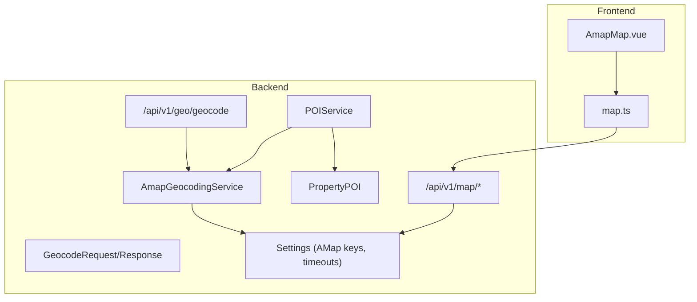
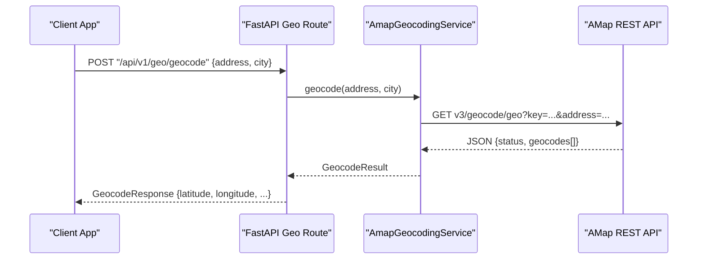
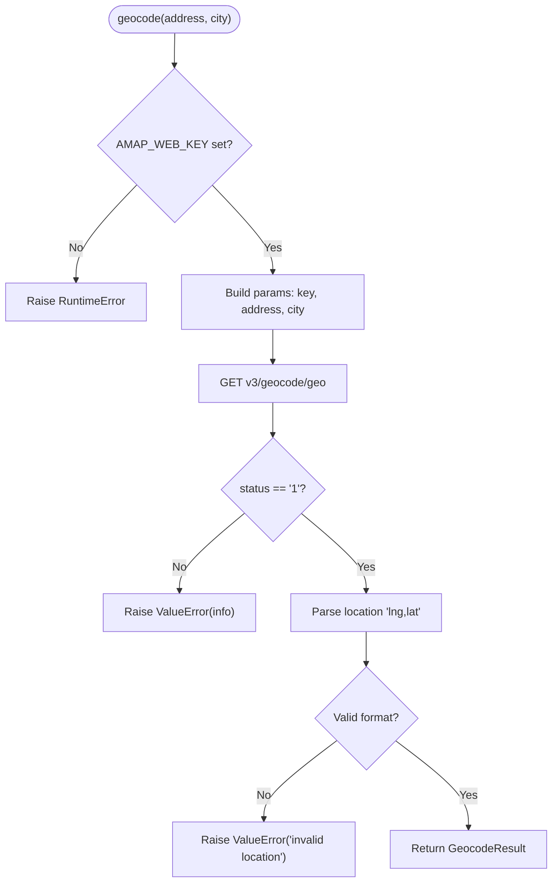
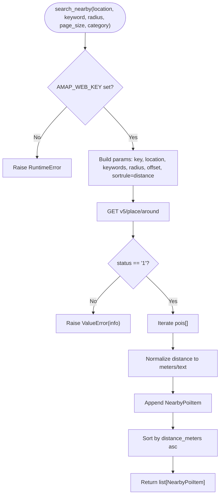
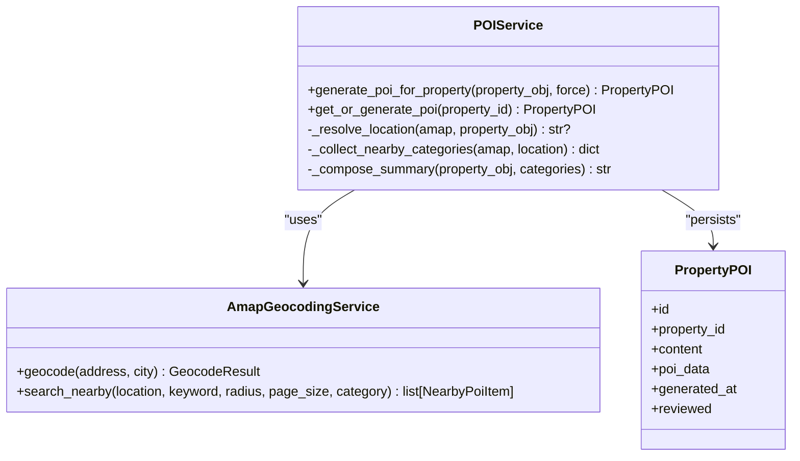
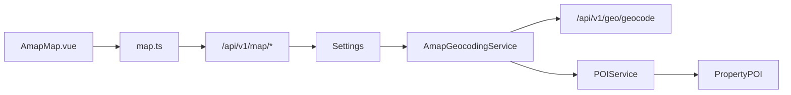

# Geographic Services (AMap Integration)

<cite>
**Referenced Files in This Document**
- [geocoding_service.py](file://backend/app/services/geocoding_service.py)
- [geocoding.py](file://backend/app/schemas/geocoding.py)
- [geocoding.py](file://backend/app/api/v1/routes/geocoding.py)
- [config.py](file://backend/app/core/config.py)
- [poi_service.py](file://backend/app/services/poi_service.py)
- [pois.py](file://backend/app/api/v1/routes/pois.py)
- [poi.py](file://backend/app/models/poi.py)
- [map_routes.py](file://backend/app/api/v1/routes/map_routes.py)
- [AmapMap.vue](file://frontend/src/components/AmapMap.vue)
- [map.ts](file://frontend/src/services/map.ts)
- [test_geocoding.py](file://backend/tests/test_geocoding.py)
- [geocode_properties.py](file://backend/scripts/geocode_properties.py)
</cite>

## Table of Contents
1. [Introduction](#introduction)
2. [Project Structure](#project-structure)
3. [Core Components](#core-components)
4. [Architecture Overview](#architecture-overview)
5. [Detailed Component Analysis](#detailed-component-analysis)
6. [Dependency Analysis](#dependency-analysis)
7. [Performance Considerations](#performance-considerations)
8. [Troubleshooting Guide](#troubleshooting-guide)
9. [Conclusion](#conclusion)
10. [Appendices](#appendices)

## Introduction
This document explains the AMap geographic services integration used to geocode addresses, search nearby points of interest (POI), and visualize locations on a map. It focuses on the AmapGeocodingService implementation, data structures GeocodeResult and NearbyPoiItem, API endpoints for geocoding and POI search, configuration requirements, error handling, and performance strategies for batch operations and caching.

## Project Structure
The geographic features are implemented across backend services, schemas, routes, models, frontend components, and scripts:
- Backend service layer: AmapGeocodingService provides geocoding and nearby POI search.
- Schemas: Pydantic request/response models for geocoding.
- Routes: FastAPI endpoints for geocoding and POI generation.
- Models: PropertyPOI stores generated POI summaries and structured data per property.
- Frontend: AmapMap component renders AMap with markers; map.ts calls map-related APIs.
- Scripts: Batch geocoding utility to backfill coordinates for properties.

**Diagram sources**
- [geocoding_service.py:38-145](file://backend/app/services/geocoding_service.py#L38-L145)
- [geocoding.py:1-19](file://backend/app/schemas/geocoding.py#L1-L19)
- [geocoding.py:1-25](file://backend/app/api/v1/routes/geocoding.py#L1-L25)
- [poi_service.py:109-311](file://backend/app/services/poi_service.py#L109-L311)
- [poi.py:12-28](file://backend/app/models/poi.py#L12-L28)
- [map_routes.py:14-80](file://backend/app/api/v1/routes/map_routes.py#L14-L80)
- [config.py:74-97](file://backend/app/core/config.py#L74-L97)
- [AmapMap.vue:66-122](file://frontend/src/components/AmapMap.vue#L66-L122)
- [map.ts:38-56](file://frontend/src/services/map.ts#L38-L56)

**Section sources**
- [geocoding_service.py:38-145](file://backend/app/services/geocoding_service.py#L38-L145)
- [geocoding.py:1-19](file://backend/app/schemas/geocoding.py#L1-L19)
- [geocoding.py:1-25](file://backend/app/api/v1/routes/geocoding.py#L1-L25)
- [poi_service.py:109-311](file://backend/app/services/poi_service.py#L109-L311)
- [poi.py:12-28](file://backend/app/models/poi.py#L12-L28)
- [map_routes.py:14-80](file://backend/app/api/v1/routes/map_routes.py#L14-L80)
- [config.py:74-97](file://backend/app/core/config.py#L74-L97)
- [AmapMap.vue:66-122](file://frontend/src/components/AmapMap.vue#L66-L122)
- [map.ts:38-56](file://frontend/src/services/map.ts#L38-L56)

## Core Components
- AmapGeocodingService: Encapsulates HTTP calls to AMap geocoding and around-search endpoints. Provides methods to convert addresses to coordinates and to search nearby POIs by keyword and radius.
- GeocodeResult: Dataclass representing geocoding output including address, latitude, longitude, and optional administrative details.
- NearbyPoiItem: Dataclass representing a POI item from nearby search, including name, distance text, category, keyword, and address.
- POIService: Orchestrates POI summary generation for properties using AmapGeocodingService and optionally an LLM to compose a natural-language summary. Persists results to PropertyPOI.
- Geocoding API endpoint: POST /api/v1/geo/geocode accepts a GeocodeRequest and returns a GeocodeResponse.
- Map endpoints: GET /api/v1/map/properties supports viewport-based queries; GET /api/v1/map/config returns AMap JS key and default center/zoom.
- Frontend AmapMap component: Dynamically loads AMap SDK and renders a marker at the given coordinates.

**Section sources**
- [geocoding_service.py:9-36](file://backend/app/services/geocoding_service.py#L9-L36)
- [geocoding_service.py:38-145](file://backend/app/services/geocoding_service.py#L38-L145)
- [geocoding.py:1-19](file://backend/app/schemas/geocoding.py#L1-L19)
- [geocoding.py:1-25](file://backend/app/api/v1/routes/geocoding.py#L1-L25)
- [poi_service.py:109-311](file://backend/app/services/poi_service.py#L109-L311)
- [map_routes.py:14-80](file://backend/app/api/v1/routes/map_routes.py#L14-L80)
- [AmapMap.vue:66-122](file://frontend/src/components/AmapMap.vue#L66-L122)

## Architecture Overview
The system integrates AMap via HTTP REST APIs. The backend exposes a geocoding endpoint and uses AMap’s around-search to enrich property listings with nearby facilities. The frontend renders AMap maps and fetches property markers within a viewport.

**Diagram sources**
- [geocoding.py:1-25](file://backend/app/api/v1/routes/geocoding.py#L1-L25)
- [geocoding_service.py:46-85](file://backend/app/services/geocoding_service.py#L46-L85)
- [config.py:78-85](file://backend/app/core/config.py#L78-L85)

## Detailed Component Analysis

### AmapGeocodingService
Responsibilities:
- Geocode an address to coordinates using AMap v3 geocoding endpoint.
- Search nearby POIs using AMap v5 around endpoint with configurable radius and page size.
- Enforce timeout settings and validate responses.

Key behaviors:
- Requires AMAP_WEB_KEY; raises a runtime error if missing.
- Uses httpx.AsyncClient with configured timeout.
- Parses location string into Decimal latitude/longitude.
- For nearby search, normalizes distances and sorts by meters when available.

**Diagram sources**
- [geocoding_service.py:46-85](file://backend/app/services/geocoding_service.py#L46-L85)

**Section sources**
- [geocoding_service.py:38-85](file://backend/app/services/geocoding_service.py#L38-L85)

### Nearby POI Search
Responsibilities:
- Query AMap around endpoint with location, keywords, radius, and sort by distance.
- Normalize distance values and return NearbyPoiItem list sorted by proximity.

Usage patterns:
- Used internally by POIService to collect categories like transport, medical, education, shopping, dining, and daily services.
- Supports fallbacks when AMap fails or returns empty results.

**Diagram sources**
- [geocoding_service.py:87-145](file://backend/app/services/geocoding_service.py#L87-L145)

**Section sources**
- [geocoding_service.py:87-145](file://backend/app/services/geocoding_service.py#L87-L145)

### GeocodeResult and NearbyPoiItem
- GeocodeResult fields:
  - address: original input address
  - latitude: Decimal latitude
  - longitude: Decimal longitude
  - formatted_address: optional normalized address
  - level: optional granularity level
  - province/city/district: optional administrative divisions
- NearbyPoiItem fields:
  - name: POI name
  - distance: human-readable distance string
  - category: category label
  - keyword: search keyword used
  - address: optional POI address
  - distance_meters: optional numeric distance for sorting

These structures are used by:
- Geocoding API response mapping
- POIService to aggregate and summarize nearby amenities

**Section sources**
- [geocoding_service.py:9-36](file://backend/app/services/geocoding_service.py#L9-L36)

### POIService and PropertyPOI
- POIService:
  - Resolves location from existing coordinates or geocodes the property address.
  - Collects nearby POIs by predefined categories and keywords.
  - Optionally composes a natural-language summary using an LLM; falls back to deterministic text.
  - Persists content and poi_data into PropertyPOI.
- PropertyPOI model:
  - Stores content summary, poi_data JSON, timestamps, and review flag.

**Diagram sources**
- [poi_service.py:109-311](file://backend/app/services/poi_service.py#L109-L311)
- [poi.py:12-28](file://backend/app/models/poi.py#L12-L28)
- [geocoding_service.py:38-145](file://backend/app/services/geocoding_service.py#L38-L145)

**Section sources**
- [poi_service.py:109-311](file://backend/app/services/poi_service.py#L109-L311)
- [poi.py:12-28](file://backend/app/models/poi.py#L12-L28)

### API Endpoints
- Geocoding:
  - POST /api/v1/geo/geocode
  - Request body: GeocodeRequest {address, city?}
  - Response: GeocodeResponse {address, latitude, longitude, formatted_address?, level?, province?, city?, district?}
  - Error handling:
    - Missing AMAP_WEB_KEY -> 503 Service Unavailable
    - Invalid address or no result -> 400 Bad Request
- POI Generation:
  - POST /api/v1/{property_id}/generate
  - GET /api/v1/{property_id}
  - Returns POIResponse based on PropertyPOI
- Map:
  - GET /api/v1/map/properties?sw_lat&sw_lng&ne_lat&ne_lng&limit
  - GET /api/v1/map/config returns amap_js_key and default center/zoom

**Section sources**
- [geocoding.py:1-25](file://backend/app/api/v1/routes/geocoding.py#L1-L25)
- [geocoding.py:1-19](file://backend/app/schemas/geocoding.py#L1-L19)
- [pois.py:11-32](file://backend/app/api/v1/routes/pois.py#L11-L32)
- [map_routes.py:14-80](file://backend/app/api/v1/routes/map_routes.py#L14-L80)

### Configuration Requirements
Required environment variables:
- AMAP_WEB_KEY: AMap web service key for REST APIs
- AMAP_GEOCODE_URL: Geocoding endpoint URL (default provided)
- AMAP_AROUND_URL: Around-search endpoint URL (default provided)
- AMAP_GEOCODE_TIMEOUT_SECONDS: Timeout for geocoding and nearby requests (default provided)
- AMAP_NEARBY_RADIUS_METERS: Default radius for nearby search
- AMAP_NEARBY_PAGE_SIZE: Default page size for nearby search
- AMAP_JS_KEY: AMap JS key for frontend map rendering (used by /map/config)

Optional:
- CORS_ORIGINS, rate limiting settings, Redis URL, database URLs, OpenAI keys for POI summary generation.

**Section sources**
- [config.py:74-97](file://backend/app/core/config.py#L74-L97)
- [config.py:147-151](file://backend/app/core/config.py#L147-L151)
- [map_routes.py:71-80](file://backend/app/api/v1/routes/map_routes.py#L71-L80)

### Frontend Integration Examples
- Property listing map visualization:
  - Use AmapMap.vue with latitude/longitude/address props to render a marker and controls.
  - If AMap JS key is not configured, it shows a fallback link to AMap URI.
- Location-based searches:
  - Use map.ts to call /api/v1/map/properties with viewport bounds to load properties within the visible area.
  - Use /api/v1/map/config to obtain AMap JS key and initial center/zoom.

**Section sources**
- [AmapMap.vue:66-122](file://frontend/src/components/AmapMap.vue#L66-L122)
- [map.ts:38-56](file://frontend/src/services/map.ts#L38-L56)
- [map_routes.py:71-80](file://backend/app/api/v1/routes/map_routes.py#L71-L80)

## Dependency Analysis
- AmapGeocodingService depends on Settings for keys and timeouts.
- POIService depends on AmapGeocodingService and PropertyPOI model.
- Geocoding route depends on GeocodeRequest/Response schemas and AmapGeocodingService.
- Map routes depend on Settings for JS key and database session for property queries.
- Frontend AmapMap depends on VITE_AMAP_KEY env var and dynamically loads AMap SDK.

**Diagram sources**
- [geocoding_service.py:38-145](file://backend/app/services/geocoding_service.py#L38-L145)
- [geocoding.py:1-25](file://backend/app/api/v1/routes/geocoding.py#L1-L25)
- [poi_service.py:109-311](file://backend/app/services/poi_service.py#L109-L311)
- [poi.py:12-28](file://backend/app/models/poi.py#L12-L28)
- [map_routes.py:14-80](file://backend/app/api/v1/routes/map_routes.py#L14-L80)
- [AmapMap.vue:66-122](file://frontend/src/components/AmapMap.vue#L66-L122)
- [map.ts:38-56](file://frontend/src/services/map.ts#L38-L56)

**Section sources**
- [geocoding_service.py:38-145](file://backend/app/services/geocoding_service.py#L38-L145)
- [geocoding.py:1-25](file://backend/app/api/v1/routes/geocoding.py#L1-L25)
- [poi_service.py:109-311](file://backend/app/services/poi_service.py#L109-L311)
- [poi.py:12-28](file://backend/app/models/poi.py#L12-L28)
- [map_routes.py:14-80](file://backend/app/api/v1/routes/map_routes.py#L14-L80)
- [AmapMap.vue:66-122](file://frontend/src/components/AmapMap.vue#L66-L122)
- [map.ts:38-56](file://frontend/src/services/map.ts#L38-L56)

## Performance Considerations
Batch geocoding:
- Use the provided script to backfill coordinates for properties without lat/lng. It iterates properties, calls geocode, and updates records with a small delay to avoid rate limits.
- Consider running in dry-run mode first to validate success rates before committing updates.

Caching frequently accessed locations:
- Introduce a cache layer keyed by address+city to store GeocodeResult and reuse across requests.
- Cache nearby POI results keyed by location+keyword+radius+category to reduce repeated AMap calls.
- Use Redis (configured via REDIS_URL) for distributed caching with TTLs appropriate for address stability.

Optimization tips:
- Increase AMAP_GEOCODE_TIMEOUT_SECONDS only if necessary; keep defaults to fail fast.
- Tune AMAP_NEARBY_RADIUS_METERS and AMAP_NEARBY_PAGE_SIZE to balance coverage and latency.
- Defer POI generation until needed (on-demand via POI endpoints) and persist results to avoid recomputation.

[No sources needed since this section provides general guidance]

## Troubleshooting Guide
Common errors and resolutions:
- Missing AMAP_WEB_KEY:
  - Symptom: 503 Service Unavailable on geocoding endpoint.
  - Resolution: Set AMAP_WEB_KEY in environment.
- Invalid address or no result:
  - Symptom: 400 Bad Request with info message.
  - Resolution: Validate address strings, include city parameter when helpful.
- Network timeouts:
  - Symptom: Requests exceed AMAP_GEOCODE_TIMEOUT_SECONDS.
  - Resolution: Adjust timeout setting; check network connectivity and AMap service status.
- Rate limits:
  - Symptom: AMap returns error info indicating quota exceeded.
  - Resolution: Implement client-side throttling and caching; stagger batch jobs; consider multiple keys if permitted.
- Frontend map not loading:
  - Symptom: AMap script fails to load or no key configured.
  - Resolution: Ensure VITE_AMAP_KEY is set and accessible via /api/v1/map/config; verify CORS and security code if required.

Validation references:
- Tests cover successful geocoding and missing key scenarios.

**Section sources**
- [geocoding.py:1-25](file://backend/app/api/v1/routes/geocoding.py#L1-L25)
- [test_geocoding.py:54-98](file://backend/tests/test_geocoding.py#L54-L98)
- [config.py:74-97](file://backend/app/core/config.py#L74-L97)
- [AmapMap.vue:66-87](file://frontend/src/components/AmapMap.vue#L66-L87)

## Conclusion
The AMap integration provides robust geocoding and nearby POI capabilities that enhance property listings and map visualizations. By configuring keys and timeouts correctly, handling errors gracefully, and applying caching and batching strategies, the system can deliver responsive and reliable geographic features.

[No sources needed since this section summarizes without analyzing specific files]

## Appendices

### API Reference Summary
- POST /api/v1/geo/geocode
  - Request: GeocodeRequest {address, city?}
  - Response: GeocodeResponse {address, latitude, longitude, formatted_address?, level?, province?, city?, district?}
  - Errors: 503 (missing key), 400 (invalid/no result)
- GET /api/v1/map/properties
  - Query: sw_lat, sw_lng, ne_lat, ne_lng, limit
  - Response: {count, items[]}
- GET /api/v1/map/config
  - Response: {amap_js_key, center, zoom}
- POST /api/v1/{property_id}/generate
  - Response: POIResponse (content, poi_data, timestamps, reviewed)
- GET /api/v1/{property_id}
  - Response: POIResponse

**Section sources**
- [geocoding.py:1-25](file://backend/app/api/v1/routes/geocoding.py#L1-L25)
- [geocoding.py:1-19](file://backend/app/schemas/geocoding.py#L1-L19)
- [map_routes.py:14-80](file://backend/app/api/v1/routes/map_routes.py#L14-L80)
- [pois.py:11-32](file://backend/app/api/v1/routes/pois.py#L11-L32)

### Batch Geocoding Script Usage
- Run the script to update properties lacking coordinates.
- Supports dry-run mode to preview changes without writing to the database.

**Section sources**
- [geocode_properties.py:18-74](file://backend/scripts/geocode_properties.py#L18-L74)