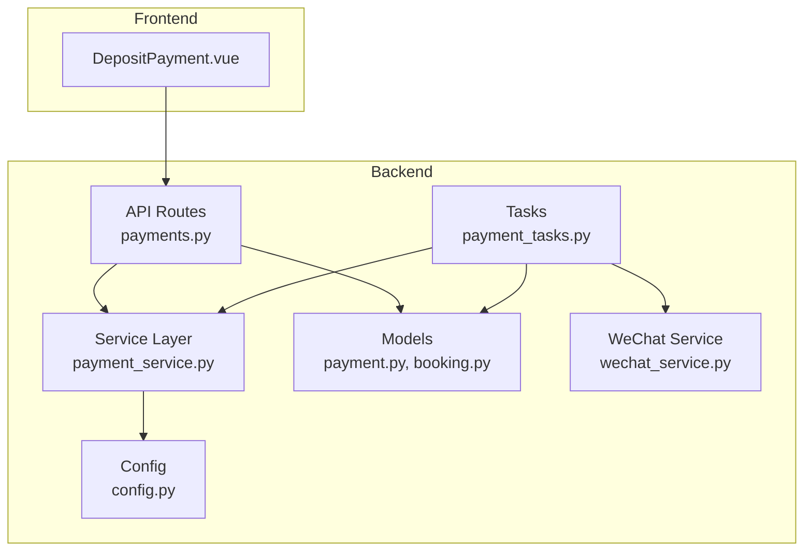
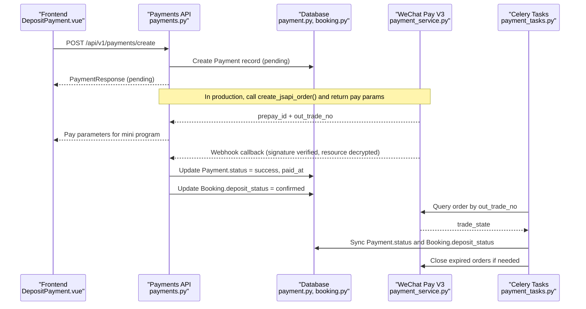
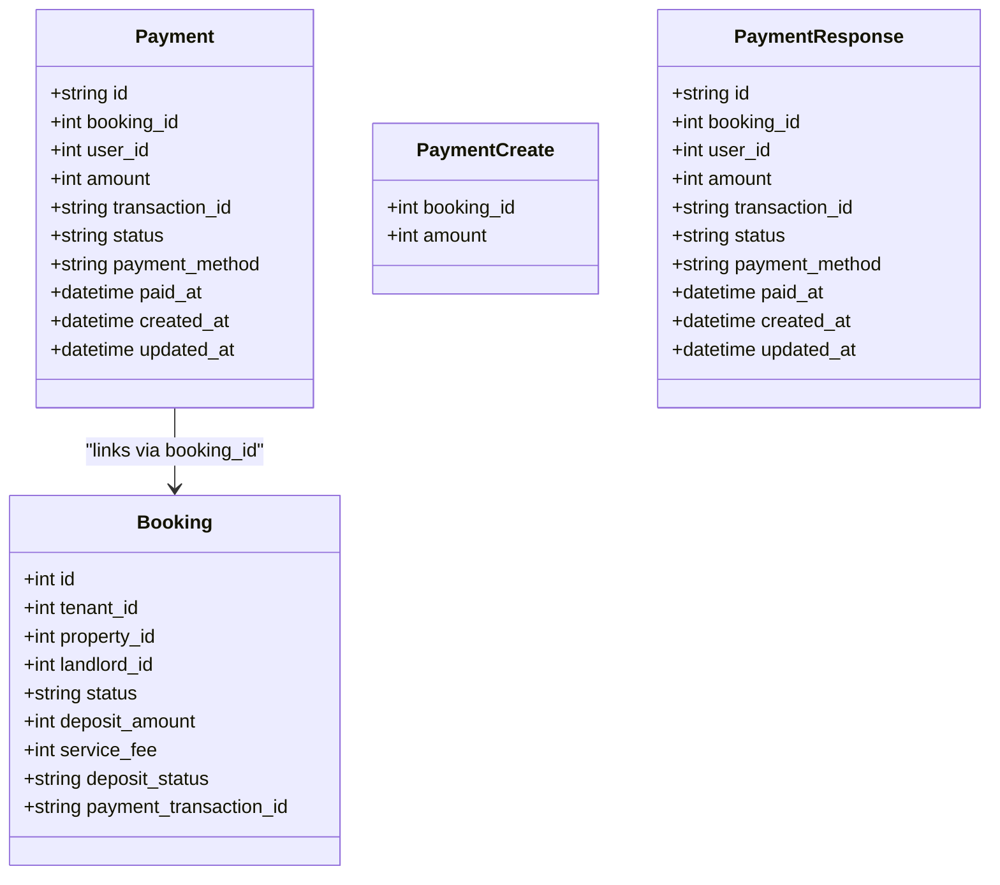
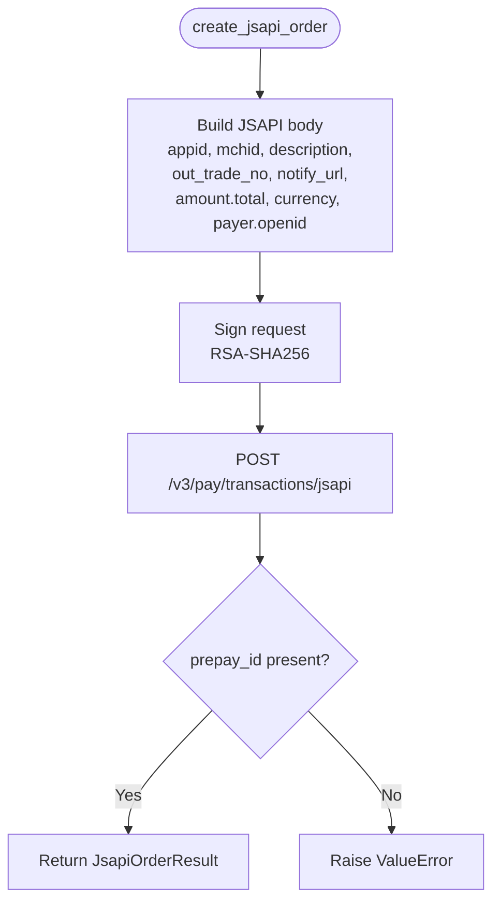
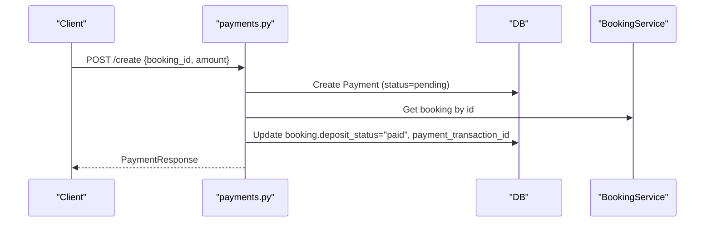
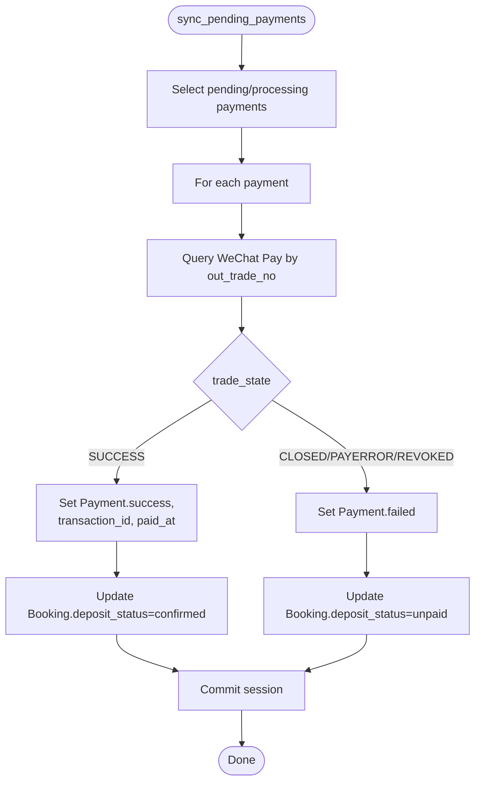
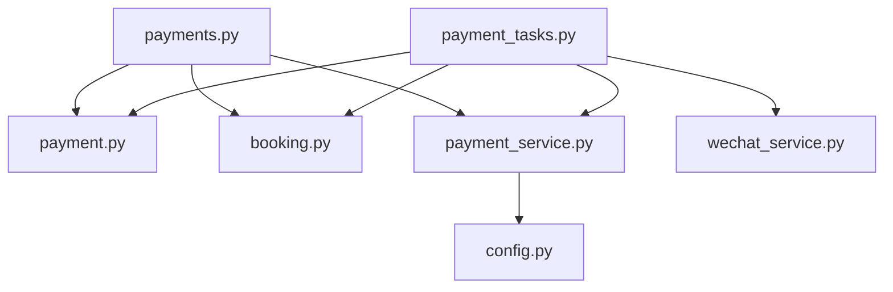

# Payment Gateway Integration

<cite>
**Referenced Files in This Document**
- [payment_service.py](file://backend/app/services/payment_service.py)
- [payments.py](file://backend/app/api/v1/routes/payments.py)
- [payment.py](file://backend/app/models/payment.py)
- [booking.py](file://backend/app/models/booking.py)
- [audit_log.py](file://backend/app/models/audit_log.py)
- [config.py](file://backend/app/core/config.py)
- [payment_tasks.py](file://backend/app/tasks/payment_tasks.py)
- [wechat_service.py](file://backend/app/services/wechat_service.py)
- [deposit_contract_payment_poi.py](file://backend/alembic/versions/20260623_0008_deposit_contract_payment_poi.py)
- [DepositPayment.vue](file://frontend/src/views/DepositPayment.vue)
</cite>

## Table of Contents
1. [Introduction](#introduction)
2. [Project Structure](#project-structure)
3. [Core Components](#core-components)
4. [Architecture Overview](#architecture-overview)
5. [Detailed Component Analysis](#detailed-component-analysis)
6. [Dependency Analysis](#dependency-analysis)
7. [Performance Considerations](#performance-considerations)
8. [Troubleshooting Guide](#troubleshooting-guide)
9. [Conclusion](#conclusion)
10. [Appendices](#appendices)

## Introduction
This document explains the payment gateway integration for deposit collection and related transaction processing, focusing on WeChat Pay V3. It covers the Payment model, service layer implementation, API endpoints, background tasks for reconciliation and order lifecycle management, configuration, security measures, error handling, and testing strategies. While Alipay is mentioned as a supported method in the project’s UI, only WeChat Pay V3 is implemented in the backend code analyzed here.

## Project Structure
The payment system spans models, services, API routes, background tasks, and frontend views:
- Models define persistent entities for payments and bookings, including deposit-related fields.
- Services encapsulate WeChat Pay V3 operations (order creation, callback parsing, refunds).
- API routes expose endpoints to create payments and handle callbacks.
- Background tasks poll and reconcile payment statuses and close expired orders.
- Configuration centralizes credentials and URLs.
- Frontend provides a deposit payment page that triggers payment creation.

**Diagram sources**
- [payments.py:1-85](file://backend/app/api/v1/routes/payments.py#L1-L85)
- [payment_service.py:1-445](file://backend/app/services/payment_service.py#L1-L445)
- [payment.py:1-34](file://backend/app/models/payment.py#L1-L34)
- [booking.py:1-47](file://backend/app/models/booking.py#L1-L47)
- [payment_tasks.py:1-241](file://backend/app/tasks/payment_tasks.py#L1-L241)
- [config.py:1-167](file://backend/app/core/config.py#L1-L167)
- [wechat_service.py:1-146](file://backend/app/services/wechat_service.py#L1-L146)
- [DepositPayment.vue:1-207](file://frontend/src/views/DepositPayment.vue#L1-L207)

**Section sources**
- [payment_service.py:1-445](file://backend/app/services/payment_service.py#L1-L445)
- [payments.py:1-85](file://backend/app/api/v1/routes/payments.py#L1-L85)
- [payment.py:1-34](file://backend/app/models/payment.py#L1-L34)
- [booking.py:1-47](file://backend/app/models/booking.py#L1-L47)
- [payment_tasks.py:1-241](file://backend/app/tasks/payment_tasks.py#L1-L241)
- [config.py:1-167](file://backend/app/core/config.py#L1-L167)
- [wechat_service.py:1-146](file://backend/app/services/wechat_service.py#L1-L146)
- [DepositPayment.vue:1-207](file://frontend/src/views/DepositPayment.vue#L1-L207)

## Core Components
- Payment model: Stores payment records with identifiers, amounts, status, method, timestamps, and relationships to users and bookings.
- WeChatPayService: Implements WeChat Pay V3 JSAPI order creation, signature building, callback verification and decryption, order query, closing unpaid orders, and refund application.
- Payments API: Endpoints to create a payment record and simulate a callback; includes authorization checks and booking updates.
- Background tasks: Periodic jobs to sync pending payments, close expired orders, and send result notifications via WeChat template messages.
- Configuration: Centralized settings for app identity, SMS, email, and placeholders for payment credentials.
- Audit logging: Generic audit log model available for recording actions and details.

Key responsibilities:
- Deposit collection flows are modeled through Payment and Booking deposit_status fields.
- Transaction states are managed by updating Payment.status and associated Booking.deposit_status.
- Reconciliation is handled by Celery tasks querying WeChat Pay APIs.

**Section sources**
- [payment.py:1-34](file://backend/app/models/payment.py#L1-L34)
- [payment_service.py:1-445](file://backend/app/services/payment_service.py#L1-L445)
- [payments.py:1-85](file://backend/app/api/v1/routes/payments.py#L1-L85)
- [payment_tasks.py:1-241](file://backend/app/tasks/payment_tasks.py#L1-L241)
- [config.py:1-167](file://backend/app/core/config.py#L1-L167)
- [audit_log.py:1-25](file://backend/app/models/audit_log.py#L1-L25)

## Architecture Overview
The payment flow integrates frontend initiation, backend API orchestration, WeChat Pay V3 interactions, and background reconciliation.

**Diagram sources**
- [payments.py:1-85](file://backend/app/api/v1/routes/payments.py#L1-L85)
- [payment_service.py:1-445](file://backend/app/services/payment_service.py#L1-L445)
- [payment.py:1-34](file://backend/app/models/payment.py#L1-L34)
- [booking.py:1-47](file://backend/app/models/booking.py#L1-L47)
- [payment_tasks.py:1-241](file://backend/app/tasks/payment_tasks.py#L1-L241)
- [DepositPayment.vue:1-207](file://frontend/src/views/DepositPayment.vue#L1-L207)

## Detailed Component Analysis

### Payment Model and Schema
- Payment entity includes id, booking_id, user_id, amount, transaction_id, status, payment_method, paid_at, and timestamps. Relationships link to Booking and User.
- PaymentCreate and PaymentResponse schemas define request/response contracts for the API.

**Diagram sources**
- [payment.py:1-34](file://backend/app/models/payment.py#L1-L34)
- [booking.py:1-47](file://backend/app/models/booking.py#L1-L47)
- [payment.py:1-23](file://backend/app/schemas/payment.py#L1-L23)

**Section sources**
- [payment.py:1-34](file://backend/app/models/payment.py#L1-L34)
- [payment.py:1-23](file://backend/app/schemas/payment.py#L1-L23)
- [booking.py:1-47](file://backend/app/models/booking.py#L1-L47)

### WeChatPayService Implementation
Responsibilities:
- Order creation for JSAPI (mini program) using merchant credentials and notify URL.
- Signature generation for outbound requests and pay parameter signing for client-side payment.
- Callback parsing: verify signature structure, decrypt resource payload using AES-GCM with APIv3 key, and extract payment details.
- Order queries by out_trade_no or transaction_id.
- Closing unpaid orders and applying refunds.

Security notes:
- Outbound requests use RSA-SHA256 signatures with merchant private key.
- Callbacks include signature verification scaffolding and AES-GCM decryption; platform certificate-based verification should be added for production readiness.

**Diagram sources**
- [payment_service.py:245-292](file://backend/app/services/payment_service.py#L245-L292)

**Section sources**
- [payment_service.py:1-445](file://backend/app/services/payment_service.py#L1-L445)

### Payments API Endpoints
- POST /api/v1/payments/create: Validates booking ownership, creates a Payment record with status pending, updates booking deposit_status to paid, and returns PaymentResponse.
- POST /api/v1/payments/{payment_id}/callback: Simulates callback processing; in production, must validate WeChat callback headers and decrypt resource before updating state.
- GET /api/v1/payments/{payment_id}: Retrieves payment with authorization checks.

**Diagram sources**
- [payments.py:15-45](file://backend/app/api/v1/routes/payments.py#L15-L45)
- [booking.py:1-47](file://backend/app/models/booking.py#L1-L47)

**Section sources**
- [payments.py:1-85](file://backend/app/api/v1/routes/payments.py#L1-L85)

### Background Tasks and Reconciliation
- sync_pending_payments: Queries WeChat Pay for pending/processing payments, updates Payment.status and Booking.deposit_status based on trade_state, and logs changes.
- close_expired_payments: Identifies long-pending payments, closes them locally and via WeChat Pay, and resets booking deposit_status to unpaid when appropriate.
- send_payment_result_message: Sends WeChat template messages upon payment success/failure.

**Diagram sources**
- [payment_tasks.py:27-77](file://backend/app/tasks/payment_tasks.py#L27-L77)
- [payment_service.py:379-413](file://backend/app/services/payment_service.py#L379-L413)

**Section sources**
- [payment_tasks.py:1-241](file://backend/app/tasks/payment_tasks.py#L1-L241)

### Configuration Management
Current Settings:
- WeChat Mini Program identity fields: wechat_appid, wechat_secret, token URL.
- Placeholders for payment credentials are referenced in WeChatPayService but not defined in Settings.

Recommended additions for production:
- Merchant ID: wechat_pay_mchid
- API v3 key: wechat_pay_api_v3_key
- Serial number: wechat_pay_serial_no
- Private key path: wechat_pay_private_key_path
- Notify URLs: wechat_pay_notify_url, wechat_pay_refund_notify_url
- Currency defaults: e.g., default_currency = "CNY"

These fields are consumed by WeChatPayService properties and methods.

**Section sources**
- [config.py:107-120](file://backend/app/core/config.py#L107-L120)
- [payment_service.py:70-115](file://backend/app/services/payment_service.py#L70-L115)

### Security Measures
- Signature verification:
  - Outbound requests signed with RSA-SHA256 using merchant private key.
  - Callback signature verification scaffolded; production should fetch and cache WeChat platform certificates and verify signatures using the correct serial_no.
- Decryption:
  - Callback resource decrypted using AES-256-GCM with APIv3 key.
- Idempotency:
  - Ensure callbacks are processed idempotently by checking existing Payment.status before updates.
- PCI compliance considerations:
  - Do not store sensitive card data; rely on WeChat Pay tokens and transaction IDs.
  - Enforce HTTPS, secure storage of private keys and API keys, and least-privilege access.

**Section sources**
- [payment_service.py:127-239](file://backend/app/services/payment_service.py#L127-L239)

### Error Handling and Reconciliation
- Network failures:
  - HTTP errors raised by httpx; tasks wrap calls in try/except and log warnings/errors.
- Declined payments:
  - Map WeChat trade_state CLOSED/PAYERROR/REVOKED to failed status and update booking accordingly.
- Reconciliation:
  - Periodic polling ensures eventual consistency between local state and WeChat Pay.
  - Expired order closure prevents stale pending states.

**Section sources**
- [payment_tasks.py:27-77](file://backend/app/tasks/payment_tasks.py#L27-L77)
- [payment_tasks.py:121-173](file://backend/app/tasks/payment_tasks.py#L121-L173)

### Testing Strategies
- Unit tests for WeChatService cover jscode2session, access token caching, and template message sending using mocked httpx responses.
- Integration tests for WeChat login endpoints validate new/existing user flows and config retrieval.
- Recommended extensions:
  - Mock WeChatPayService methods for order creation, query, and refund.
  - Test callback parsing with valid/invalid signatures and payloads.
  - Validate idempotent callback handling and state transitions.
  - Use sandbox credentials and test URLs provided by WeChat Pay.

**Section sources**
- [test_wechat.py:1-183](file://backend/tests/test_wechat.py#L1-L183)

## Dependency Analysis
The following diagram shows core dependencies among payment components:

**Diagram sources**
- [payments.py:1-85](file://backend/app/api/v1/routes/payments.py#L1-L85)
- [payment.py:1-34](file://backend/app/models/payment.py#L1-L34)
- [booking.py:1-47](file://backend/app/models/booking.py#L1-L47)
- [payment_service.py:1-445](file://backend/app/services/payment_service.py#L1-L445)
- [payment_tasks.py:1-241](file://backend/app/tasks/payment_tasks.py#L1-L241)
- [config.py:1-167](file://backend/app/core/config.py#L1-L167)
- [wechat_service.py:1-146](file://backend/app/services/wechat_service.py#L1-L146)

**Section sources**
- [payments.py:1-85](file://backend/app/api/v1/routes/payments.py#L1-L85)
- [payment_tasks.py:1-241](file://backend/app/tasks/payment_tasks.py#L1-L241)

## Performance Considerations
- Asynchronous HTTP calls via httpx improve throughput for WeChat Pay interactions.
- Lazy loading of private key reduces startup overhead.
- Background tasks decouple reconciliation from request paths, reducing latency.
- Avoid redundant queries by caching WeChat platform certificates and access tokens where applicable.

[No sources needed since this section provides general guidance]

## Troubleshooting Guide
Common issues and resolutions:
- Missing private key file:
  - Ensure wechat_pay_private_key_path points to a valid PEM file accessible to the process.
- Invalid callback signature:
  - Verify headers wechatpay-timestamp, wechatpay-nonce, wechatpay-signature, wechatpay-serial.
  - Implement full platform certificate verification and ensure time skew is within acceptable bounds.
- Decryption failures:
  - Confirm APIv3 key matches the one configured in WeChat Pay and is correctly set in settings.
- Stale pending payments:
  - Run sync_pending_payments and close_expired_payments tasks; check logs for network errors.
- Booking status mismatch:
  - Inspect Payment.trade_state and ensure Booking.deposit_status is updated consistently.

**Section sources**
- [payment_service.py:103-115](file://backend/app/services/payment_service.py#L103-L115)
- [payment_service.py:207-239](file://backend/app/services/payment_service.py#L207-L239)
- [payment_tasks.py:27-77](file://backend/app/tasks/payment_tasks.py#L27-L77)

## Conclusion
The current implementation provides a robust foundation for WeChat Pay V3 integration focused on deposit collection. It includes order creation, callback parsing, reconciliation tasks, and basic notification flows. To reach production readiness, add missing configuration fields, implement full callback signature verification with platform certificates, enforce idempotency in callback handlers, and expand tests to cover edge cases and sandbox scenarios.

[No sources needed since this section summarizes without analyzing specific files]

## Appendices

### Data Model Evolution
Migration adds deposit and service fee fields to properties and bookings, and introduces deposit_status and payment_transaction_id on bookings.

**Section sources**
- [deposit_contract_payment_poi.py:21-30](file://backend/alembic/versions/20260623_0008_deposit_contract_payment_poi.py#L21-L30)

### Frontend Payment Page
The deposit payment view displays amounts in CNY and USD, initiates payment creation, and shows success feedback.

**Section sources**
- [DepositPayment.vue:1-207](file://frontend/src/views/DepositPayment.vue#L1-L207)