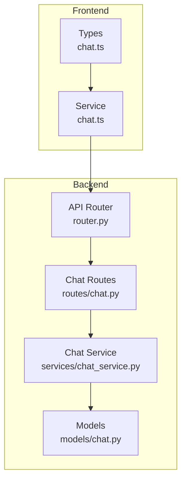
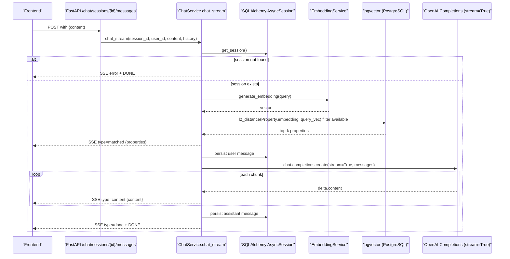
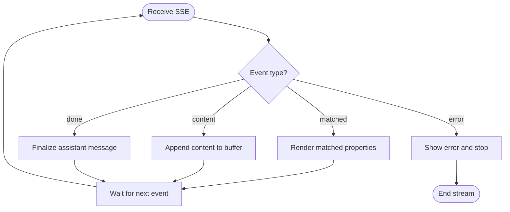
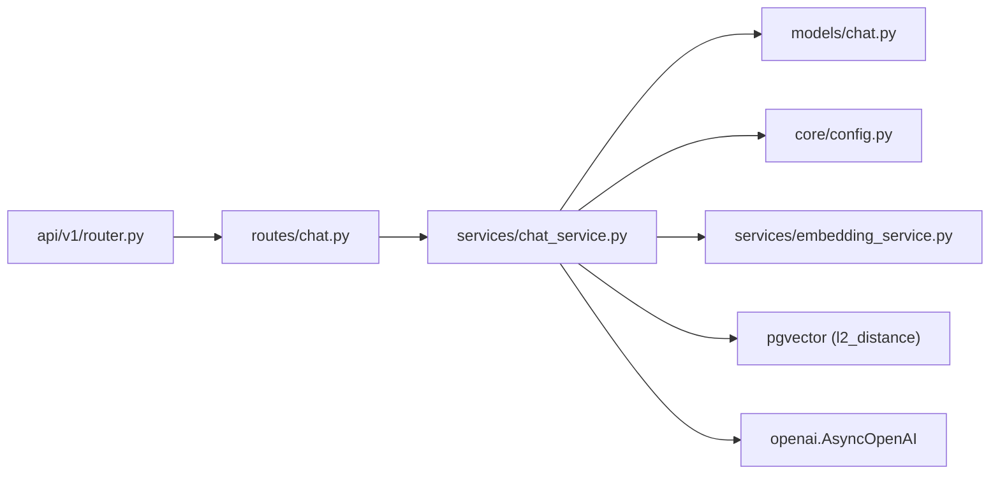

# AI Chat Service

<cite>
**Referenced Files in This Document**
- [chat.py](file://backend/app/api/v1/routes/chat.py)
- [router.py](file://backend/app/api/v1/router.py)
- [chat_service.py](file://backend/app/services/chat_service.py)
- [chat.py](file://backend/app/models/chat.py)
- [chat.ts](file://frontend/src/services/chat.ts)
- [chat.ts](file://frontend/src/types/chat.ts)
</cite>

## Table of Contents
1. [Introduction](#introduction)
2. [Project Structure](#project-structure)
3. [Core Components](#core-components)
4. [Architecture Overview](#architecture-overview)
5. [Detailed Component Analysis](#detailed-component-analysis)
6. [Dependency Analysis](#dependency-analysis)
7. [Performance Considerations](#performance-considerations)
8. [Troubleshooting Guide](#troubleshooting-guide)
9. [Conclusion](#conclusion)
10. [Appendices](#appendices)

## Introduction
This document explains the AI chat service module that powers real-time, streaming conversations for a rental housing platform. It covers message sending and receiving, Server-Sent Events (SSE) streaming responses, conversation management, RAG-based property context retrieval, error handling for network interruptions, and how the frontend integrates with the backend to display progressive updates.

## Project Structure
The chat feature spans backend API routes, a service layer, data models, and frontend types and services:
- Backend API routes define REST endpoints for session and message operations and an SSE endpoint for streaming responses.
- The service layer orchestrates database access, OpenAI streaming calls, and RAG context building using embeddings and pgvector.
- Data models define sessions and messages with roles and metadata.
- Frontend types describe chat entities and SSE events; a basic chat service is provided for HTTP calls.

**Diagram sources**
- [router.py:1-23](file://backend/app/api/v1/router.py#L1-L23)
- [chat.py:1-143](file://backend/app/api/v1/routes/chat.py#L1-L143)
- [chat_service.py:1-302](file://backend/app/services/chat_service.py#L1-L302)
- [chat.py:1-62](file://backend/app/models/chat.py#L1-L62)
- [chat.ts:1-24](file://frontend/src/services/chat.ts#L1-L24)
- [chat.ts:1-41](file://frontend/src/types/chat.ts#L1-L41)

**Section sources**
- [router.py:1-23](file://backend/app/api/v1/router.py#L1-L23)
- [chat.py:1-143](file://backend/app/api/v1/routes/chat.py#L1-L143)
- [chat_service.py:1-302](file://backend/app/services/chat_service.py#L1-L302)
- [chat.py:1-62](file://backend/app/models/chat.py#L1-L62)
- [chat.ts:1-24](file://frontend/src/services/chat.ts#L1-L24)
- [chat.ts:1-41](file://frontend/src/types/chat.ts#L1-L41)

## Core Components
- API Layer: FastAPI router exposing session CRUD, message listing, and an SSE endpoint for streaming replies.
- Service Layer: Manages sessions/messages, builds RAG context via embeddings and vector similarity, and streams OpenAI completions as SSE chunks.
- Models: Define ChatSession and ChatMessage with roles, status, timestamps, and JSON metadata.
- Frontend Types and Service: Strongly typed interfaces for sessions, messages, matched properties, and SSE events; a minimal service for non-streaming endpoints.

Key responsibilities:
- Session lifecycle: create, list, delete.
- Message persistence: user and assistant messages with role and metadata.
- Streaming: SSE protocol with typed event payloads for matched properties, incremental content, completion, and errors.
- RAG integration: embedding query, vector search over available properties, and context injection into system prompt.

**Section sources**
- [chat.py:1-143](file://backend/app/api/v1/routes/chat.py#L1-L143)
- [chat_service.py:1-302](file://backend/app/services/chat_service.py#L1-L302)
- [chat.py:1-62](file://backend/app/models/chat.py#L1-L62)
- [chat.ts:1-24](file://frontend/src/services/chat.ts#L1-L24)
- [chat.ts:1-41](file://frontend/src/types/chat.ts#L1-L41)

## Architecture Overview
The chat architecture combines REST endpoints for session/message management and an SSE stream for real-time AI responses. The service layer composes RAG context retrieval and OpenAI streaming calls.

**Diagram sources**
- [chat.py:106-130](file://backend/app/api/v1/routes/chat.py#L106-L130)
- [chat_service.py:227-302](file://backend/app/services/chat_service.py#L227-L302)
- [chat_service.py:87-143](file://backend/app/services/chat_service.py#L87-L143)
- [chat.py:23-62](file://backend/app/models/chat.py#L23-L62)

## Detailed Component Analysis

### API Layer: Chat Routes
- Endpoints:
  - Create session: POST /chat/sessions
  - List sessions: GET /chat/sessions
  - Get messages: GET /chat/sessions/{session_id}/messages
  - Send message (SSE): POST /chat/sessions/{session_id}/messages
  - Delete session: DELETE /chat/sessions/{session_id}
- Authentication and DB session are injected via dependencies.
- SSE response uses media_type text/event-stream and appropriate headers to prevent buffering.

Implementation highlights:
- History is fetched before streaming to provide context.
- StreamingResponse wraps the generator from the service layer.

**Section sources**
- [chat.py:1-143](file://backend/app/api/v1/routes/chat.py#L1-L143)

### Service Layer: ChatService
Responsibilities:
- Session management: create, list, close, delete, retrieve.
- Message retrieval: ordered by creation time.
- RAG context builder: generates embedding for the query, performs vector similarity search on Property records, returns context text and matched properties.
- Non-streaming chat: returns full reply and matched properties after saving both user and assistant messages.
- Streaming chat: yields SSE-formatted events for matched properties, incremental content, completion, and errors; persists user and assistant messages around the stream.

Streaming flow details:
- Validates session existence.
- Auto-titles session on first message if title is null.
- Builds RAG context and emits matched properties event.
- Persists user message before streaming.
- Streams OpenAI deltas and accumulates full reply.
- Persists assistant message and emits done/DONE.
- Catches exceptions and emits error/DONE.

RAG context builder:
- Uses embedding service to convert query to vector.
- Queries PostgreSQL with pgvector distance ordering and filters for available properties.
- Formats matched properties into a structured list and a human-readable context string.

**Section sources**
- [chat_service.py:17-302](file://backend/app/services/chat_service.py#L17-L302)

### Data Models: Sessions and Messages
- ChatSession:
  - Fields: id, user_id, session_id (unique), title, status (active/closed), timestamps.
  - Relationship to messages with cascade delete.
- ChatMessage:
  - Fields: id, session_id, role (user/assistant/system), content (text), metadata (JSON), timestamp.
  - Role enum supports system prompts when needed.

These models underpin persistence and serialization across the API.

**Section sources**
- [chat.py:1-62](file://backend/app/models/chat.py#L1-L62)

### Frontend Integration: Types and Service
- Types:
  - ChatSession, ChatMessage, MatchedProperty, SSEEvent with typed fields for streamed events.
- Service:
  - Provides methods to create/list/delete sessions and fetch messages.
  - Does not yet include streaming client code; can be extended to consume SSE.

Integration guidance:
- Use the types to parse SSE payloads and update UI progressively.
- Maintain local conversation state keyed by session id.
- For streaming, open an EventSource or fetch stream reader to the SSE endpoint and handle events in order.

**Section sources**
- [chat.ts:1-24](file://frontend/src/services/chat.ts#L1-L24)
- [chat.ts:1-41](file://frontend/src/types/chat.ts#L1-L41)

### SSE Protocol and Progressive Updates
Event types emitted by the server:
- matched: includes matched_properties array for immediate display.
- content: incremental text fragment to append to the current assistant message.
- done: signals end of stream.
- error: contains error message; followed by DONE.

Client-side processing pattern:
- Initialize a buffer for the current assistant message.
- On matched: render or cache matched properties.
- On content: append to buffer and re-render incrementally.
- On done: finalize assistant message and clear buffer.
- On error: show error and stop rendering.

[No sources needed since this diagram shows conceptual workflow, not actual code structure]

## Dependency Analysis
High-level dependency relationships:
- API routes depend on ChatService and SQLAlchemy async session.
- ChatService depends on:
  - Configuration for OpenAI credentials and model name.
  - EmbeddingService for query embedding generation.
  - pgvector SQL functions for similarity search.
  - OpenAI Async client for streaming completions.
  - SQLAlchemy models for persistence.

**Diagram sources**
- [chat.py:1-143](file://backend/app/api/v1/routes/chat.py#L1-L143)
- [chat_service.py:1-302](file://backend/app/services/chat_service.py#L1-L302)
- [chat.py:1-62](file://backend/app/models/chat.py#L1-L62)
- [router.py:1-23](file://backend/app/api/v1/router.py#L1-L23)

**Section sources**
- [chat.py:1-143](file://backend/app/api/v1/routes/chat.py#L1-L143)
- [chat_service.py:1-302](file://backend/app/services/chat_service.py#L1-L302)
- [chat.py:1-62](file://backend/app/models/chat.py#L1-L62)
- [router.py:1-23](file://backend/app/api/v1/router.py#L1-L23)

## Performance Considerations
- Streaming reduces perceived latency by delivering content incrementally.
- RAG limits results to top-k similar properties to control payload size and LLM input length.
- Avoid buffering at proxies by setting appropriate headers on SSE responses.
- Persist user message before streaming to ensure resilience against mid-stream failures.
- Consider batching or debouncing UI updates for very high-frequency content chunks.

[No sources needed since this section provides general guidance]

## Troubleshooting Guide
Common issues and remedies:
- Session not found:
  - Ensure correct session_id and user authorization.
  - Verify session creation succeeded and is active.
- Network interruptions during streaming:
  - Implement client-side retry logic and reconnect to SSE endpoint.
  - Re-fetch conversation history to reconstruct state after reconnect.
- Empty or missing matched properties:
  - Confirm embeddings exist for properties and that they are marked available.
  - Validate embedding generation pipeline and pgvector index availability.
- Large payloads or slow responses:
  - Tune top-k limit and max_tokens.
  - Review system prompt length and context formatting.
- SSE buffering:
  - Ensure server sets no-cache and keep-alive headers.
  - Check reverse proxy settings (e.g., Nginx) to avoid buffering.

**Section sources**
- [chat_service.py:227-302](file://backend/app/services/chat_service.py#L227-L302)
- [chat.py:122-130](file://backend/app/api/v1/routes/chat.py#L122-L130)

## Conclusion
The AI chat service provides a robust foundation for real-time, streaming conversational experiences grounded in domain-specific RAG context. It cleanly separates concerns between routing, business logic, and persistence while offering typed contracts for frontend integration. Extending the frontend to consume SSE will enable smooth, progressive rendering of AI-generated responses and immediate visibility of matched properties.

## Appendices

### API Reference Summary
- POST /chat/sessions
  - Request: optional title
  - Response: session object
- GET /chat/sessions
  - Response: list of sessions
- GET /chat/sessions/{session_id}/messages
  - Response: list of messages
- POST /chat/sessions/{session_id}/messages
  - Request: message content
  - Response: SSE stream with events: matched, content, done, error
- DELETE /chat/sessions/{session_id}
  - Response: 204 No Content

**Section sources**
- [chat.py:47-143](file://backend/app/api/v1/routes/chat.py#L47-L143)

### Frontend Implementation Notes
- Use the provided types to parse SSE payloads.
- Maintain per-session state for messages and matched properties.
- Implement an SSE consumer to handle event types and update UI incrementally.
- Add retry and reconnection logic for robustness against network issues.

**Section sources**
- [chat.ts:1-24](file://frontend/src/services/chat.ts#L1-L24)
- [chat.ts:1-41](file://frontend/src/types/chat.ts#L1-L41)