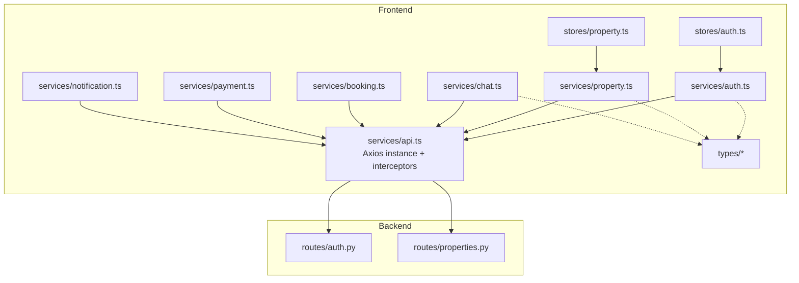
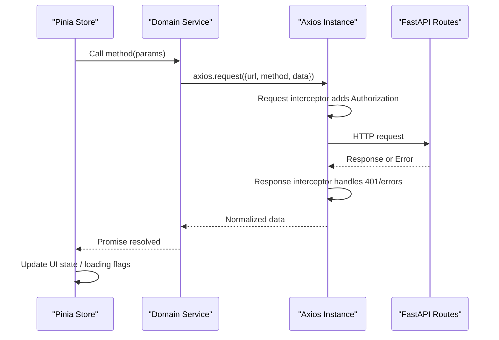
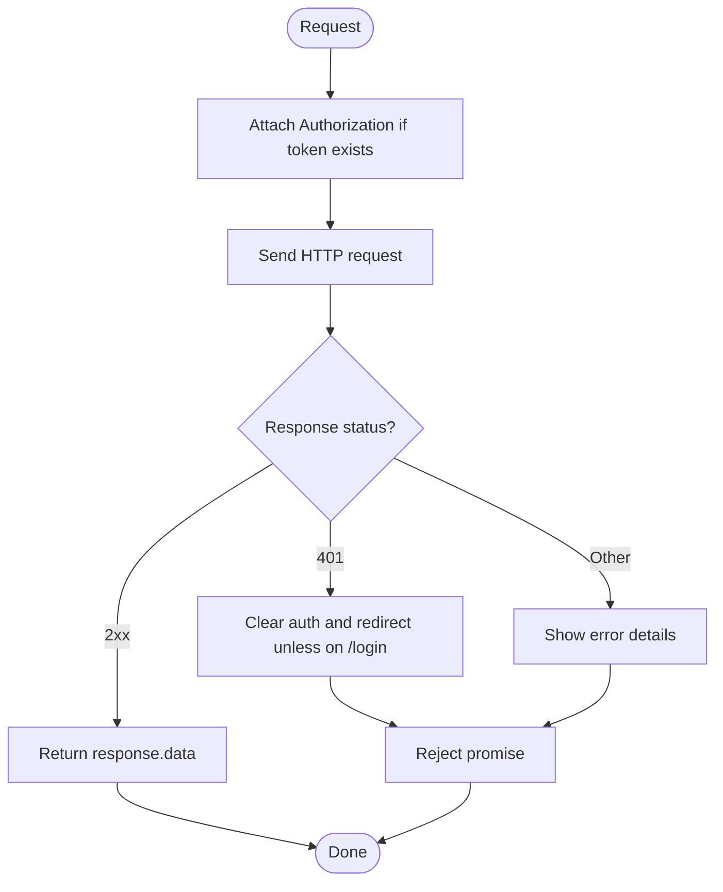
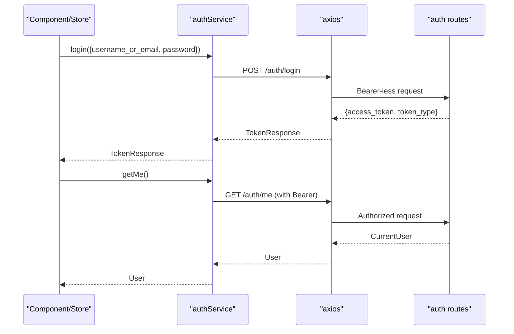
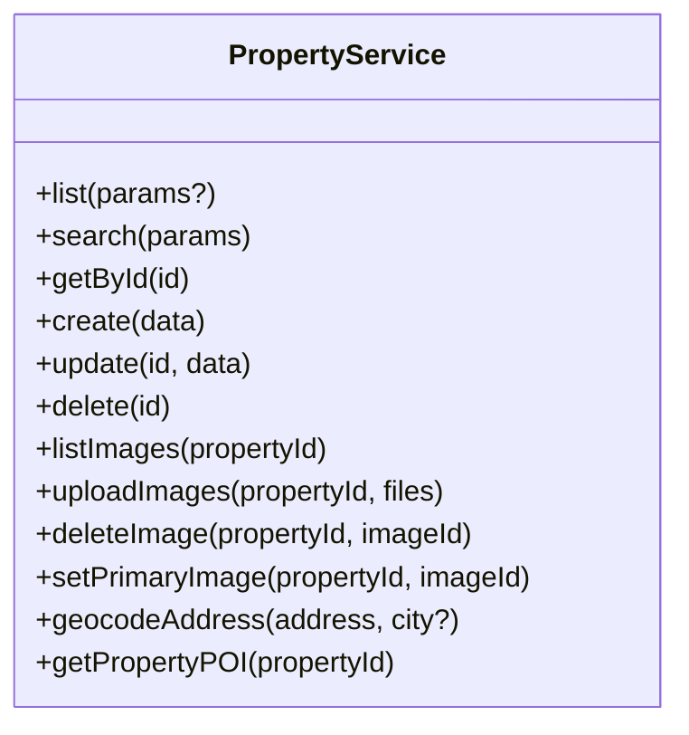
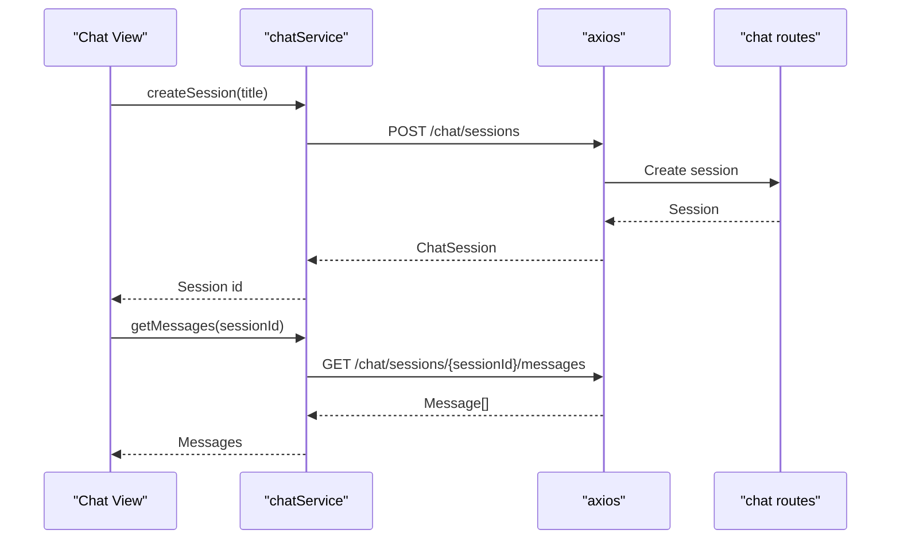
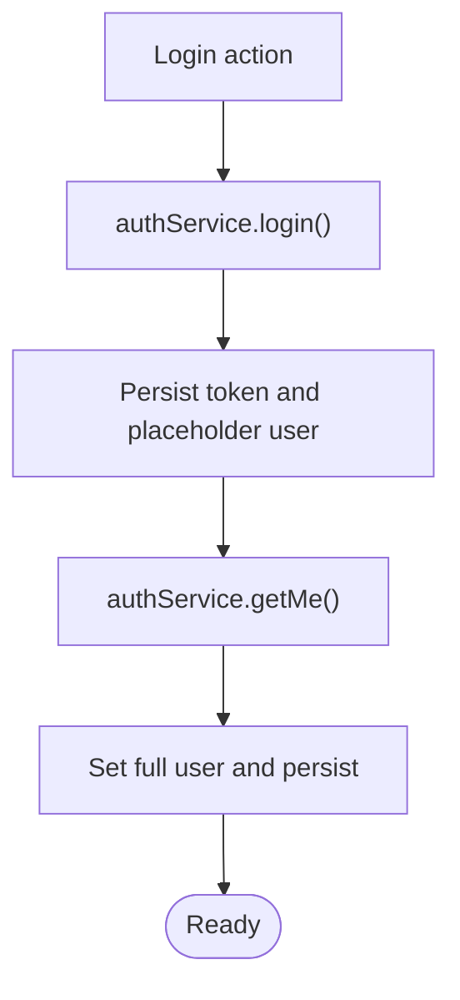
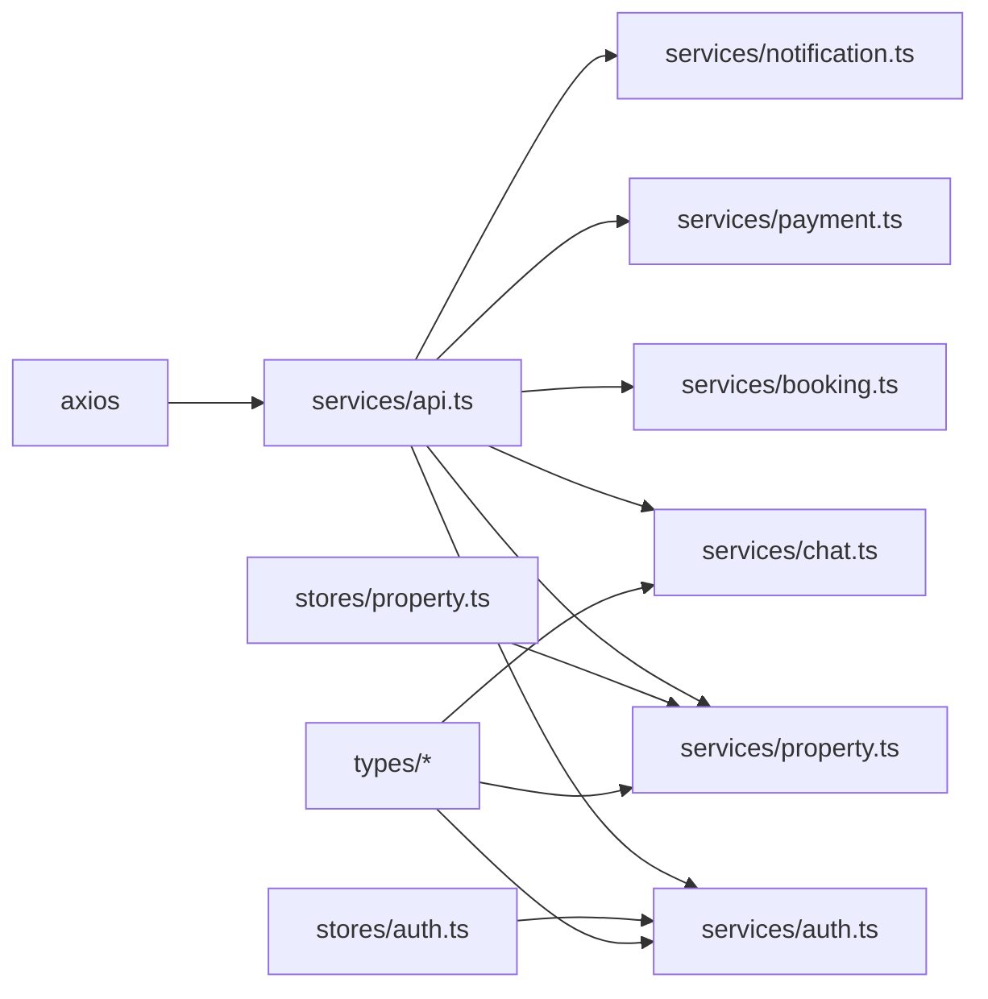

# API Service Layer & Data Fetching

<cite>
**Referenced Files in This Document**
- [api.ts](file://frontend/src/services/api.ts)
- [auth.ts](file://frontend/src/services/auth.ts)
- [property.ts](file://frontend/src/services/property.ts)
- [chat.ts](file://frontend/src/services/chat.ts)
- [booking.ts](file://frontend/src/services/booking.ts)
- [payment.ts](file://frontend/src/services/payment.ts)
- [notification.ts](file://frontend/src/services/notification.ts)
- [auth.ts](file://frontend/src/stores/auth.ts)
- [property.ts](file://frontend/src/stores/property.ts)
- [auth.ts](file://frontend/src/types/auth.ts)
- [property.ts](file://frontend/src/types/property.ts)
- [chat.ts](file://frontend/src/types/chat.ts)
- [auth.py](file://backend/app/api/v1/routes/auth.py)
- [properties.py](file://backend/app/api/v1/routes/properties.py)
- [package.json](file://frontend/package.json)
</cite>

## Table of Contents
1. [Introduction](#introduction)
2. [Project Structure](#project-structure)
3. [Core Components](#core-components)
4. [Architecture Overview](#architecture-overview)
5. [Detailed Component Analysis](#detailed-component-analysis)
6. [Dependency Analysis](#dependency-analysis)
7. [Performance Considerations](#performance-considerations)
8. [Troubleshooting Guide](#troubleshooting-guide)
9. [Conclusion](#conclusion)
10. [Appendices](#appendices)

## Introduction
This document explains the frontend API service layer architecture and data fetching patterns for the application. It covers the centralized Axios client configuration, request/response interceptors, error handling, authentication token management, and domain-specific service modules (auth, property, chat). It also documents state synchronization with Pinia stores, file upload handling, and provides guidance on caching, deduplication, offline support, cancellation, progress tracking, and best practices.

## Project Structure
The frontend organizes HTTP calls into a thin service layer that wraps Axios and exposes typed methods per domain. Stores manage UI state and orchestrate service calls. Types define contracts between services and backend responses.

**Diagram sources**
- [api.ts:1-56](file://frontend/src/services/api.ts#L1-L56)
- [auth.ts:1-22](file://frontend/src/services/auth.ts#L1-L22)
- [property.ts:1-86](file://frontend/src/services/property.ts#L1-L86)
- [chat.ts:1-24](file://frontend/src/services/chat.ts#L1-L24)
- [booking.ts:1-25](file://frontend/src/services/booking.ts#L1-L25)
- [payment.ts:1-34](file://frontend/src/services/payment.ts#L1-L34)
- [notification.ts:1-21](file://frontend/src/services/notification.ts#L1-L21)
- [auth.ts:1-101](file://frontend/src/stores/auth.ts#L1-L101)
- [property.ts:1-136](file://frontend/src/stores/property.ts#L1-L136)
- [auth.py:1-94](file://backend/app/api/v1/routes/auth.py#L1-L94)
- [properties.py:1-162](file://backend/app/api/v1/routes/properties.py#L1-L162)

**Section sources**
- [api.ts:1-56](file://frontend/src/services/api.ts#L1-L56)
- [auth.ts:1-22](file://frontend/src/services/auth.ts#L1-L22)
- [property.ts:1-86](file://frontend/src/services/property.ts#L1-L86)
- [chat.ts:1-24](file://frontend/src/services/chat.ts#L1-L24)
- [booking.ts:1-25](file://frontend/src/services/booking.ts#L1-L25)
- [payment.ts:1-34](file://frontend/src/services/payment.ts#L1-L34)
- [notification.ts:1-21](file://frontend/src/services/notification.ts#L1-L21)
- [auth.ts:1-101](file://frontend/src/stores/auth.ts#L1-L101)
- [property.ts:1-136](file://frontend/src/stores/property.ts#L1-L136)
- [auth.py:1-94](file://backend/app/api/v1/routes/auth.py#L1-L94)
- [properties.py:1-162](file://backend/app/api/v1/routes/properties.py#L1-L162)

## Core Components
- Centralized Axios client: base URL, timeout, default headers, request interceptor to attach Authorization header from local storage, response interceptor to handle 401 and display user-friendly errors.
- Domain services: auth, property, chat, booking, payment, notification. Each service exports functions that call the Axios client and return normalized data.
- Stores: Pinia stores coordinate loading states, persist tokens, and synchronize UI state with API responses.

Key responsibilities:
- api.ts: global HTTP behavior and cross-cutting concerns (auth injection, error UX).
- Services: encapsulate endpoint URLs, parameter mapping, and response unwrapping.
- Stores: manage loading flags, cache last search params, and keep local state consistent with server state.

**Section sources**
- [api.ts:1-56](file://frontend/src/services/api.ts#L1-L56)
- [auth.ts:1-22](file://frontend/src/services/auth.ts#L1-L22)
- [property.ts:1-86](file://frontend/src/services/property.ts#L1-L86)
- [chat.ts:1-24](file://frontend/src/services/chat.ts#L1-L24)
- [auth.ts:1-101](file://frontend/src/stores/auth.ts#L1-L101)
- [property.ts:1-136](file://frontend/src/stores/property.ts#L1-L136)

## Architecture Overview
The flow begins at components or stores calling service methods. Services use the shared Axios instance which injects the bearer token and centralizes error handling. Backend routes validate requests and return typed JSON responses.

**Diagram sources**
- [api.ts:1-56](file://frontend/src/services/api.ts#L1-L56)
- [auth.ts:1-22](file://frontend/src/services/auth.ts#L1-L22)
- [property.ts:1-86](file://frontend/src/services/property.ts#L1-L86)
- [auth.py:1-94](file://backend/app/api/v1/routes/auth.py#L1-L94)
- [properties.py:1-162](file://backend/app/api/v1/routes/properties.py#L1-L162)

## Detailed Component Analysis

### Centralized API Client (Axios)
- Base configuration:
  - baseURL set to "/api/v1".
  - Timeout configured.
  - Default Content-Type set to application/json.
- Request interceptor:
  - Reads access_token from localStorage and attaches it as a Bearer token.
- Response interceptor:
  - On 401: clears stored credentials and redirects to login unless already on the login page; shows detail message when available.
  - On other errors: displays validation or server messages via UI notifications.

**Diagram sources**
- [api.ts:1-56](file://frontend/src/services/api.ts#L1-L56)

**Section sources**
- [api.ts:1-56](file://frontend/src/services/api.ts#L1-L56)

### Auth Service
- Methods:
  - register(data): POST /auth/register, returns User.
  - login(data): POST /auth/login with flexible username/email fields, returns TokenResponse.
  - getMe(): GET /auth/me, returns User.
- Parameter normalization:
  - login accepts multiple username variants and maps them to the expected field.
- State sync:
  - The auth store persists tokens and user profile, and refreshes current user after login.

**Diagram sources**
- [auth.ts:1-22](file://frontend/src/services/auth.ts#L1-L22)
- [auth.py:1-94](file://backend/app/api/v1/routes/auth.py#L1-L94)
- [auth.ts:1-101](file://frontend/src/stores/auth.ts#L1-L101)

**Section sources**
- [auth.ts:1-22](file://frontend/src/services/auth.ts#L1-L22)
- [auth.ts:1-101](file://frontend/src/stores/auth.ts#L1-L101)
- [auth.py:1-94](file://backend/app/api/v1/routes/auth.py#L1-L94)
- [auth.ts:1-23](file://frontend/src/types/auth.ts#L1-L23)

### Property Service
- Methods:
  - list(params?): GET /properties with pagination and filters.
  - search(params): GET /properties/search with natural language and filters.
  - getById(id): GET /properties/{id}.
  - create(data): POST /properties.
  - update(id, data): PATCH /properties/{id}.
  - delete(id): DELETE /properties/{id}.
  - Image management:
    - listImages(propertyId): GET /properties/{id}/images.
    - uploadImages(propertyId, files): POST /properties/{id}/images with multipart/form-data.
    - deleteImage(propertyId, imageId): DELETE /properties/{id}/images/{imageId}.
    - setPrimaryImage(propertyId, imageId): PATCH /properties/{id}/images/{imageId}/primary.
  - Geocoding:
    - geocodeAddress(address, city?): POST /geo/geocode, normalizes coordinates to numbers.
  - POI:
    - getPropertyPOI(propertyId): GET /pois/{id}, returns null on failure.

**Diagram sources**
- [property.ts:1-86](file://frontend/src/services/property.ts#L1-L86)
- [properties.py:1-162](file://backend/app/api/v1/routes/properties.py#L1-L162)

**Section sources**
- [property.ts:1-86](file://frontend/src/services/property.ts#L1-L86)
- [properties.py:1-162](file://backend/app/api/v1/routes/properties.py#L1-L162)
- [property.ts:1-95](file://frontend/src/types/property.ts#L1-L95)

### Chat Service
- Methods:
  - createSession(title?): POST /chat/sessions.
  - listSessions(): GET /chat/sessions.
  - getMessages(sessionId): GET /chat/sessions/{sessionId}/messages.
  - deleteSession(sessionId): DELETE /chat/sessions/{sessionId}.
- Types include SSE event shape for streaming responses (consumed by callers).

**Diagram sources**
- [chat.ts:1-24](file://frontend/src/services/chat.ts#L1-L24)
- [chat.ts:1-41](file://frontend/src/types/chat.ts#L1-L41)

**Section sources**
- [chat.ts:1-24](file://frontend/src/services/chat.ts#L1-L24)
- [chat.ts:1-41](file://frontend/src/types/chat.ts#L1-L41)

### Booking, Payment, Notification Services
- Booking:
  - create(data), list(), getById(id), updateStatus(id, status), cancel(id).
- Payment:
  - createPayment(data), getPayment(paymentId), paymentCallback(paymentId).
- Notification:
  - list(), markRead(id), markAllRead(), getUnreadCount().

These services follow the same pattern: wrap Axios calls, unwrap response.data, and expose strongly-typed promises.

**Section sources**
- [booking.ts:1-25](file://frontend/src/services/booking.ts#L1-L25)
- [payment.ts:1-34](file://frontend/src/services/payment.ts#L1-L34)
- [notification.ts:1-21](file://frontend/src/services/notification.ts#L1-L21)

### Stores and Data Synchronization
- Auth store:
  - Persists access_token and user object to localStorage.
  - Loads persisted state on initialization.
  - After login, fetches full user profile and updates store.
  - Provides computed flags for roles and login state.
- Property store:
  - Manages lists, search results, current property, and images.
  - Tracks loading states and last search parameters.
  - Optimistically updates local collections after mutations (e.g., remove, set primary image).

**Diagram sources**
- [auth.ts:1-101](file://frontend/src/stores/auth.ts#L1-L101)
- [auth.ts:1-22](file://frontend/src/services/auth.ts#L1-L22)

**Section sources**
- [auth.ts:1-101](file://frontend/src/stores/auth.ts#L1-L101)
- [property.ts:1-136](file://frontend/src/stores/property.ts#L1-L136)

## Dependency Analysis
- Frontend dependencies:
  - axios for HTTP.
  - pinia for state management.
  - element-plus for UI feedback (error messages).
- Module coupling:
  - All services depend on the shared Axios instance.
  - Stores depend on services and types.
  - Services depend on type definitions for compile-time safety.

**Diagram sources**
- [api.ts:1-56](file://frontend/src/services/api.ts#L1-L56)
- [auth.ts:1-22](file://frontend/src/services/auth.ts#L1-L22)
- [property.ts:1-86](file://frontend/src/services/property.ts#L1-L86)
- [chat.ts:1-24](file://frontend/src/services/chat.ts#L1-L24)
- [booking.ts:1-25](file://frontend/src/services/booking.ts#L1-L25)
- [payment.ts:1-34](file://frontend/src/services/payment.ts#L1-L34)
- [notification.ts:1-21](file://frontend/src/services/notification.ts#L1-L21)
- [auth.ts:1-101](file://frontend/src/stores/auth.ts#L1-L101)
- [property.ts:1-136](file://frontend/src/stores/property.ts#L1-L136)
- [auth.ts:1-23](file://frontend/src/types/auth.ts#L1-L23)
- [property.ts:1-95](file://frontend/src/types/property.ts#L1-L95)
- [chat.ts:1-41](file://frontend/src/types/chat.ts#L1-L41)
- [package.json:1-31](file://frontend/package.json#L1-L31)

**Section sources**
- [package.json:1-31](file://frontend/package.json#L1-L31)

## Performance Considerations
- Caching strategies:
  - Implement in-memory caches keyed by request signatures (method + URL + params) to avoid duplicate network calls.
  - Add time-based TTL for read endpoints like properties and sessions.
- Request deduplication:
  - Maintain a map of pending requests; if an identical request is issued while one is in-flight, return the existing promise.
- Offline support considerations:
  - Use a background queue to persist failed writes and retry when connectivity is restored.
  - Cache critical reads locally (e.g., recent properties) and serve stale data while refreshing in the background.
- File uploads:
  - For large files, consider chunked uploads and resumable transfers.
  - Track upload progress using Axios onUploadProgress and surface it to the UI.
- Request cancellation:
  - Use AbortController to cancel in-flight requests when navigating away or when new queries supersede previous ones.
- Token refresh:
  - Intercept 401 responses and attempt a silent refresh before retrying the original request once.

[No sources needed since this section provides general guidance]

## Troubleshooting Guide
Common issues and resolutions:
- 401 Unauthorized:
  - The response interceptor clears credentials and redirects to login unless already on the login page. Ensure the token is present in localStorage and not expired.
- Validation errors:
  - The interceptor extracts detail arrays or strings and displays them via Element Plus messages. Check backend error payloads for structured messages.
- Network timeouts:
  - Requests have a fixed timeout. Increase it for long-running operations or implement retries for transient failures.
- Upload failures:
  - Verify multipart/form-data headers are set when uploading images. Confirm the server accepts the payload size and MIME types.

Operational tips:
- Centralize retry logic in the Axios response interceptor for specific status codes (e.g., 429, 5xx).
- Wrap store actions in try/catch blocks to update UI states consistently and show user-friendly messages.

**Section sources**
- [api.ts:1-56](file://frontend/src/services/api.ts#L1-L56)

## Conclusion
The frontend API layer is cleanly separated into a shared Axios client and domain services, with Pinia stores orchestrating state and lifecycle. Authentication is handled centrally via interceptors, and error UX is standardized. To further improve robustness, add caching, deduplication, offline queuing, token refresh, request cancellation, and upload progress tracking as outlined above.

[No sources needed since this section summarizes without analyzing specific files]

## Appendices

### API Method Signatures and Contracts

- Auth Service
  - register(data: RegisterRequest): Promise<User>
  - login(data: LoginRequest): Promise<TokenResponse>
  - getMe(): Promise<User>

- Property Service
  - list(params?: { skip?: number; limit?: number; district?: string; status?: string }): Promise<Property[]>
  - search(params: PropertySearchParams): Promise<PropertySearchResult[]>
  - getById(id: number | string): Promise<Property>
  - create(data: PropertyCreate): Promise<Property>
  - update(id: number | string, data: PropertyUpdate): Promise<Property>
  - delete(id: number | string): Promise<void>
  - listImages(propertyId: number | string): Promise<PropertyImage[]>
  - uploadImages(propertyId: number | string, files: File[]): Promise<PropertyImage[]>
  - deleteImage(propertyId: number | string, imageId: number | string): Promise<void>
  - setPrimaryImage(propertyId: number | string, imageId: number | string): Promise<PropertyImage>
  - geocodeAddress(address: string, city?: string): Promise<GeocodeResult>
  - getPropertyPOI(propertyId: number | string): Promise<PropertyPOI | null>

- Chat Service
  - createSession(title?: string): Promise<ChatSession>
  - listSessions(): Promise<ChatSession[]>
  - getMessages(sessionId: number): Promise<ChatMessage[]>
  - deleteSession(sessionId: number): Promise<void>

- Booking Service
  - create(data: BookingCreate): Promise<Booking>
  - list(): Promise<Booking[]>
  - getById(id: number): Promise<Booking>
  - updateStatus(id: number, status: 'approved' | 'rejected'): Promise<Booking>
  - cancel(id: number): Promise<Booking>

- Payment Service
  - createPayment(data: PaymentCreate): Promise<PaymentResponse>
  - getPayment(paymentId: string): Promise<PaymentResponse>
  - paymentCallback(paymentId: string): Promise<PaymentResponse>

- Notification Service
  - list(): Promise<Notification[]>
  - markRead(id: number): Promise<Notification>
  - markAllRead(): Promise<void>
  - getUnreadCount(): Promise<UnreadCount>

**Section sources**
- [auth.ts:1-22](file://frontend/src/services/auth.ts#L1-L22)
- [property.ts:1-86](file://frontend/src/services/property.ts#L1-L86)
- [chat.ts:1-24](file://frontend/src/services/chat.ts#L1-L24)
- [booking.ts:1-25](file://frontend/src/services/booking.ts#L1-L25)
- [payment.ts:1-34](file://frontend/src/services/payment.ts#L1-L34)
- [notification.ts:1-21](file://frontend/src/services/notification.ts#L1-L21)
- [auth.ts:1-23](file://frontend/src/types/auth.ts#L1-L23)
- [property.ts:1-95](file://frontend/src/types/property.ts#L1-L95)
- [chat.ts:1-41](file://frontend/src/types/chat.ts#L1-L41)