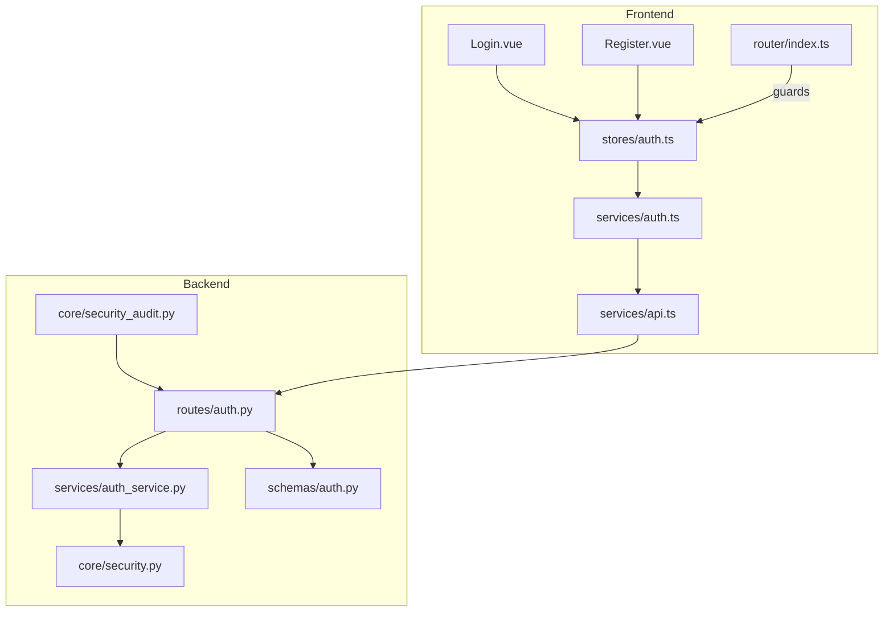
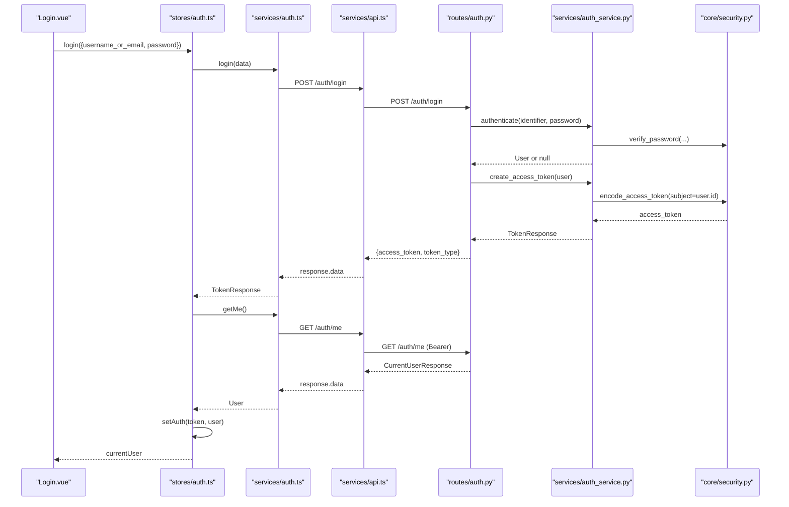
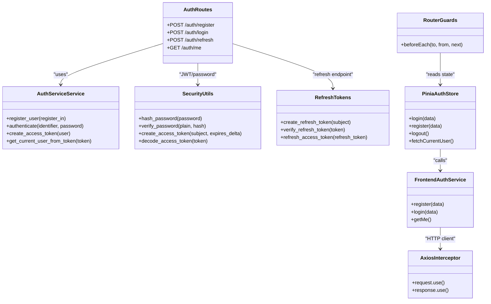

# Authentication Service Module

<cite>
**Referenced Files in This Document**
- [auth.ts](file://frontend/src/services/auth.ts)
- [api.ts](file://frontend/src/services/api.ts)
- [auth.ts](file://frontend/src/stores/auth.ts)
- [Login.vue](file://frontend/src/views/Login.vue)
- [Register.vue](file://frontend/src/views/Register.vue)
- [index.ts](file://frontend/src/router/index.ts)
- [auth.py](file://backend/app/api/v1/routes/auth.py)
- [auth_service.py](file://backend/app/services/auth_service.py)
- [security.py](file://backend/app/core/security.py)
- [security_audit.py](file://backend/app/core/security_audit.py)
- [auth.py](file://backend/app/schemas/auth.py)
- [user.ts](file://frontend/src/types/user.ts)
</cite>

## Table of Contents
1. [Introduction](#introduction)
2. [Project Structure](#project-structure)
3. [Core Components](#core-components)
4. [Architecture Overview](#architecture-overview)
5. [Detailed Component Analysis](#detailed-component-analysis)
6. [Dependency Analysis](#dependency-analysis)
7. [Performance Considerations](#performance-considerations)
8. [Troubleshooting Guide](#troubleshooting-guide)
9. [Conclusion](#conclusion)

## Introduction
This document explains the authentication service module across frontend and backend, covering login, register, logout, token refresh, state management with Pinia, localStorage persistence, protected route access, API contracts, error handling, and integration points between Vue components and services.

## Project Structure
The authentication feature spans:
- Frontend:
  - Services layer for HTTP calls (auth service and Axios instance)
  - Pinia store for state and persistence
  - Views for user interactions (login/register)
  - Router guards for protected routes
- Backend:
  - FastAPI routes for auth endpoints
  - Auth service for business logic
  - Security utilities for JWT and password hashing
  - Refresh token support and audit helpers
  - Pydantic schemas for request/response validation

**Diagram sources**
- [Login.vue:1-204](file://frontend/src/views/Login.vue#L1-L204)
- [Register.vue:1-131](file://frontend/src/views/Register.vue#L1-L131)
- [auth.ts:1-101](file://frontend/src/stores/auth.ts#L1-L101)
- [auth.ts:1-22](file://frontend/src/services/auth.ts#L1-L22)
- [api.ts:1-56](file://frontend/src/services/api.ts#L1-L56)
- [index.ts:1-212](file://frontend/src/router/index.ts#L1-L212)
- [auth.py:1-94](file://backend/app/api/v1/routes/auth.py#L1-L94)
- [auth_service.py:1-77](file://backend/app/services/auth_service.py#L1-L77)
- [security.py:1-34](file://backend/app/core/security.py#L1-L34)
- [security_audit.py:1-150](file://backend/app/core/security_audit.py#L1-L150)
- [auth.py:1-63](file://backend/app/schemas/auth.py#L1-L63)

**Section sources**
- [auth.ts:1-22](file://frontend/src/services/auth.ts#L1-L22)
- [api.ts:1-56](file://frontend/src/services/api.ts#L1-L56)
- [auth.ts:1-101](file://frontend/src/stores/auth.ts#L1-L101)
- [Login.vue:1-204](file://frontend/src/views/Login.vue#L1-L204)
- [Register.vue:1-131](file://frontend/src/views/Register.vue#L1-L131)
- [index.ts:1-212](file://frontend/src/router/index.ts#L1-L212)
- [auth.py:1-94](file://backend/app/api/v1/routes/auth.py#L1-L94)
- [auth_service.py:1-77](file://backend/app/services/auth_service.py#L1-L77)
- [security.py:1-34](file://backend/app/core/security.py#L1-L34)
- [security_audit.py:1-150](file://backend/app/core/security_audit.py#L1-L150)
- [auth.py:1-63](file://backend/app/schemas/auth.py#L1-L63)
- [user.ts:1-24](file://frontend/src/types/user.ts#L1-L24)

## Core Components
- Frontend auth service: thin HTTP wrapper around Axios for /auth endpoints.
- Pinia auth store: manages token and user state, persists to localStorage, orchestrates login flow and fetches current user.
- Axios interceptor: attaches Authorization header and handles 401 errors globally.
- Backend auth routes: register, login, refresh, me endpoints with Pydantic validation and audit logging.
- Auth service (backend): user creation, authentication, JWT creation, and token decoding.
- Security utilities: bcrypt hashing/verification, JWT encode/decode.
- Refresh token support: create/verify refresh tokens and issue new access tokens.
- Router guards: enforce requiresAuth, requiresLandlord, requiresAdmin based on stored token and user role.

**Section sources**
- [auth.ts:1-22](file://frontend/src/services/auth.ts#L1-L22)
- [auth.ts:1-101](file://frontend/src/stores/auth.ts#L1-L101)
- [api.ts:1-56](file://frontend/src/services/api.ts#L1-L56)
- [auth.py:1-94](file://backend/app/api/v1/routes/auth.py#L1-L94)
- [auth_service.py:1-77](file://backend/app/services/auth_service.py#L1-L77)
- [security.py:1-34](file://backend/app/core/security.py#L1-L34)
- [security_audit.py:1-150](file://backend/app/core/security_audit.py#L1-L150)
- [index.ts:1-212](file://frontend/src/router/index.ts#L1-L212)

## Architecture Overview
End-to-end authentication flow from UI to backend and back:

**Diagram sources**
- [Login.vue:88-104](file://frontend/src/views/Login.vue#L88-L104)
- [auth.ts:54-66](file://frontend/src/stores/auth.ts#L54-L66)
- [auth.ts:10-17](file://frontend/src/services/auth.ts#L10-L17)
- [api.ts:12-22](file://frontend/src/services/api.ts#L12-L22)
- [auth.py:37-60](file://backend/app/api/v1/routes/auth.py#L37-L60)
- [auth_service.py:29-38](file://backend/app/services/auth_service.py#L29-L38)
- [security.py:16-28](file://backend/app/core/security.py#L16-L28)

## Detailed Component Analysis

### Frontend Auth Service
- Methods:
  - register(data: RegisterRequest): Promise<User>
    - Posts to /auth/register and returns user object.
  - login(data: LoginRequest): Promise<TokenResponse>
    - Normalizes input to username_or_email and posts to /auth/login.
  - getMe(): Promise<User>
    - Fetches current user profile using stored token.

- Parameter normalization:
  - Accepts flexible fields (username/email) and maps to backend’s username_or_email.

- Response transformation:
  - Unwraps Axios response data before returning.

- Error handling:
  - Relies on global Axios interceptor for 401 and other errors.

**Section sources**
- [auth.ts:1-22](file://frontend/src/services/auth.ts#L1-L22)
- [api.ts:12-22](file://frontend/src/services/api.ts#L12-L22)

### Axios Interceptor (Authorization and Errors)
- Request interceptor:
  - Reads access_token from localStorage and sets Authorization: Bearer <token>.
- Response interceptor:
  - On 401: clears local storage and redirects to /login unless already on login page; shows detail message.
  - For other errors: displays detail messages (string or array).

**Section sources**
- [api.ts:12-56](file://frontend/src/services/api.ts#L12-L56)

### Pinia Auth Store
- State:
  - user: User | null
  - token: string | null
  - loading: boolean
- Computed:
  - isLoggedIn: boolean
  - isLandlord: boolean
  - isAdmin: boolean
- Key methods:
  - setAuth(newToken: string, newUser: User): persists token and user to localStorage.
  - clearAuth(): removes token and user from memory and localStorage.
  - loadFromStorage(): hydrates state from localStorage on initialization.
  - register(data: RegisterRequest): Promise<User>: calls authService.register and toggles loading.
  - login(data: LoginRequest): 
    - Calls authService.login, stores token, then fetches full user via getMe and updates state.
  - fetchCurrentUser(): refreshes user profile and persists it.
  - logout(): clears auth and navigates to /login.

- Persistence:
  - Keys: access_token, user (JSON stringified).

**Section sources**
- [auth.ts:1-101](file://frontend/src/stores/auth.ts#L1-L101)

### Backend Auth Routes
- POST /auth/register
  - Validates RegisterRequest schema.
  - Creates user via AuthService and logs audit event.
  - Returns CurrentUserResponse with 201 status.
  - Handles IntegrityError as 409 conflict.
- POST /auth/login
  - Authenticates via AuthService.authenticate.
  - Logs audit event on success.
  - Returns TokenResponse with access_token.
  - Returns 401 with WWW-Authenticate header on failure.
- POST /auth/refresh
  - Expects Authorization: Bearer <refresh_token>.
  - Uses refresh_access_token to issue new access and refresh tokens.
  - Returns TokenResponse.
  - Returns 401 on invalid or missing refresh token.
- GET /auth/me
  - Requires valid bearer token via dependency injection.
  - Returns CurrentUserResponse.

**Section sources**
- [auth.py:14-94](file://backend/app/api/v1/routes/auth.py#L14-L94)
- [auth.py:8-28](file://backend/app/schemas/auth.py#L8-L28)
- [auth.py:40-52](file://backend/app/schemas/auth.py#L40-L52)

### Backend Auth Service
- register_user(register_in: RegisterRequest): creates user with hashed password via UserService.
- authenticate(identifier: str, password: str): verifies user existence, active status, and password.
- create_access_token(user: User): encodes JWT with subject=user.id.
- get_current_user_from_token(token: str): decodes JWT and loads active user.
- wechat_login(code: str): exchanges code for openid and finds or creates user.

**Section sources**
- [auth_service.py:19-51](file://backend/app/services/auth_service.py#L19-L51)

### Security Utilities
- Password hashing/verification:
  - hash_password, verify_password using bcrypt.
- JWT:
  - create_access_token(subject, expires_delta): encodes with configured algorithm and secret.
  - decode_access_token(token): decodes and validates signature/expiry.

**Section sources**
- [security.py:12-33](file://backend/app/core/security.py#L12-L33)

### Refresh Token Support
- create_refresh_token(subject): long-lived refresh token with type=refresh.
- verify_refresh_token(token): validates type and expiry.
- refresh_access_token(refresh_token): issues new access and refresh tokens.

**Section sources**
- [security_audit.py:102-149](file://backend/app/core/security_audit.py#L102-L149)

### Router Guards and Protected Routes
- Global beforeEach guard:
  - Checks localStorage for access_token and user.
  - Redirects unauthenticated users to /login with redirect query when accessing requiresAuth routes.
  - Redirects authenticated users away from guest-only routes (/login, /register).
  - Enforces role-based access: requiresLandlord and requiresAdmin checks against user.role.

**Section sources**
- [index.ts:182-209](file://frontend/src/router/index.ts#L182-L209)

### Vue Components Integration
- Login.vue:
  - Submits form to authStore.login with normalized fields.
  - Shows success message and navigates to redirect target or home.
- Register.vue:
  - Validates form locally and calls authStore.register.
  - Displays server-side error details if provided.

**Section sources**
- [Login.vue:88-104](file://frontend/src/views/Login.vue#L88-L104)
- [Register.vue:85-114](file://frontend/src/views/Register.vue#L85-L114)

### Data Models and Types
- Frontend types:
  - RegisterRequest, LoginRequest, TokenResponse match backend schemas.
  - User matches backend CurrentUserResponse fields.

**Section sources**
- [auth.ts:1-23](file://frontend/src/types/auth.ts#L1-L23)
- [user.ts:1-24](file://frontend/src/types/user.ts#L1-L24)
- [auth.py:8-28](file://backend/app/schemas/auth.py#L8-L28)
- [auth.py:40-52](file://backend/app/schemas/auth.py#L40-L52)

## Dependency Analysis

**Diagram sources**
- [auth_service.py:14-51](file://backend/app/services/auth_service.py#L14-L51)
- [auth.py:14-94](file://backend/app/api/v1/routes/auth.py#L14-L94)
- [security.py:12-33](file://backend/app/core/security.py#L12-L33)
- [security_audit.py:102-149](file://backend/app/core/security_audit.py#L102-L149)
- [auth.ts:1-22](file://frontend/src/services/auth.ts#L1-L22)
- [api.ts:12-56](file://frontend/src/services/api.ts#L12-L56)
- [auth.ts:1-101](file://frontend/src/stores/auth.ts#L1-L101)
- [index.ts:182-209](file://frontend/src/router/index.ts#L182-L209)

**Section sources**
- [auth_service.py:14-51](file://backend/app/services/auth_service.py#L14-L51)
- [auth.py:14-94](file://backend/app/api/v1/routes/auth.py#L14-L94)
- [security.py:12-33](file://backend/app/core/security.py#L12-L33)
- [security_audit.py:102-149](file://backend/app/core/security_audit.py#L102-L149)
- [auth.ts:1-22](file://frontend/src/services/auth.ts#L1-L22)
- [api.ts:12-56](file://frontend/src/services/api.ts#L12-L56)
- [auth.ts:1-101](file://frontend/src/stores/auth.ts#L1-L101)
- [index.ts:182-209](file://frontend/src/router/index.ts#L182-L209)

## Performance Considerations
- Minimize network calls by fetching user profile once after login and caching in localStorage.
- Use router guards to avoid unnecessary requests until a valid token exists.
- Consider implementing token refresh proactively before expiration to reduce 401 interruptions.
- Debounce repeated login attempts and show loading states to prevent duplicate requests.

[No sources needed since this section provides general guidance]

## Troubleshooting Guide
- 401 Unauthorized:
  - Ensure access_token is present in localStorage and Authorization header is attached.
  - If 401 occurs on non-login pages, the interceptor clears storage and redirects to /login.
- Invalid credentials:
  - Backend returns 401 with detail message; displayed via interceptor.
- Registration conflicts:
  - Duplicate username/email/phone results in 409 conflict; shown as error message.
- Refresh token failures:
  - Missing or invalid refresh token yields 401; ensure Authorization header contains Bearer refresh token.
- Role-based access denied:
  - Guard redirects to home if user lacks required role (landlord/admin).

**Section sources**
- [api.ts:24-56](file://frontend/src/services/api.ts#L24-L56)
- [auth.py:30-34](file://backend/app/api/v1/routes/auth.py#L30-L34)
- [auth.py:45-50](file://backend/app/api/v1/routes/auth.py#L45-L50)
- [auth.py:68-84](file://backend/app/api/v1/routes/auth.py#L68-L84)
- [index.ts:200-206](file://frontend/src/router/index.ts#L200-L206)

## Conclusion
The authentication module integrates a clean separation of concerns:
- Frontend service and store handle API calls, state, and persistence.
- Axios interceptors centralize authorization and error handling.
- Backend routes validate inputs, perform secure operations, and return typed responses.
- Router guards enforce access control consistently.
This design supports robust login, registration, logout, and token refresh flows while maintaining clarity and extensibility.