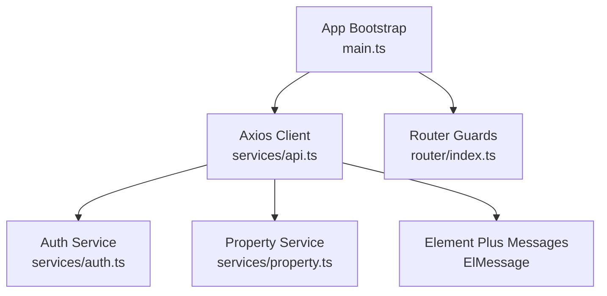
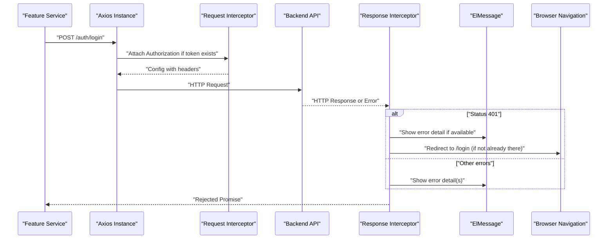
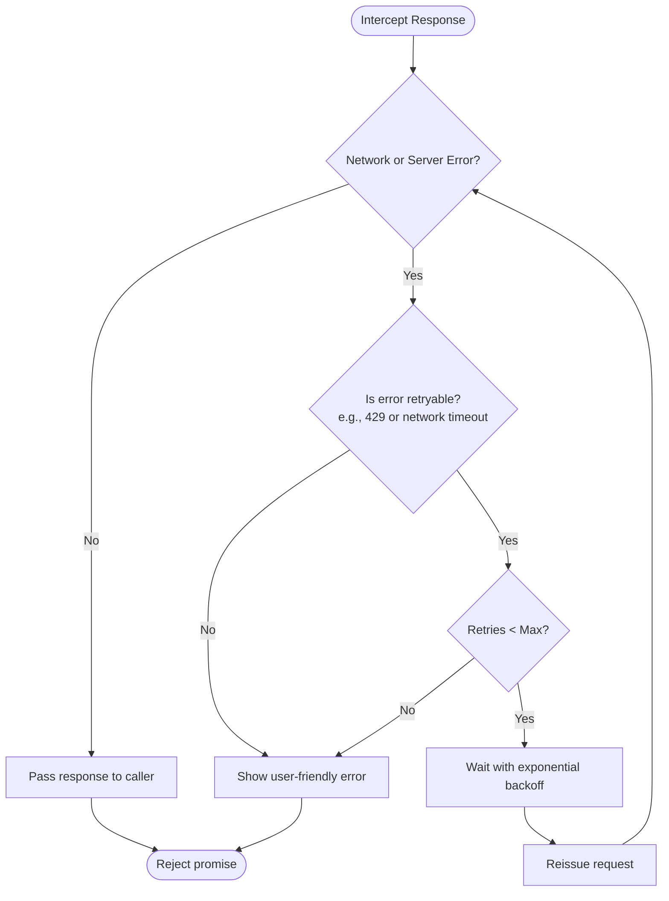
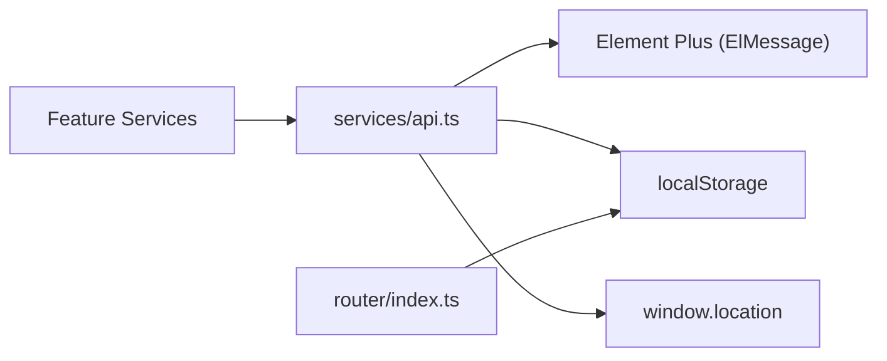

# Core API Client Configuration

<cite>
**Referenced Files in This Document**
- [api.ts](file://frontend/src/services/api.ts)
- [auth.ts](file://frontend/src/services/auth.ts)
- [property.ts](file://frontend/src/services/property.ts)
- [main.ts](file://frontend/src/main.ts)
- [index.ts](file://frontend/src/router/index.ts)
</cite>

## Table of Contents
1. [Introduction](#introduction)
2. [Project Structure](#project-structure)
3. [Core Components](#core-components)
4. [Architecture Overview](#architecture-overview)
5. [Detailed Component Analysis](#detailed-component-analysis)
6. [Dependency Analysis](#dependency-analysis)
7. [Performance Considerations](#performance-considerations)
8. [Troubleshooting Guide](#troubleshooting-guide)
9. [Conclusion](#conclusion)
10. [Appendices](#appendices)

## Introduction
This document explains the centralized Axios client configuration used across the frontend application. It covers:
- Centralized axios instance setup with baseURL, timeout, and default headers
- Request interceptor for automatic Authorization header attachment using JWT tokens from localStorage
- Response interceptor logic for HTTP error handling, 401 unauthorized handling with redirect to login, and user-friendly error messages via Element Plus ElMessage
- Examples for customizing interceptors, adding additional headers, and implementing retry mechanisms
- Error handling patterns and guidance on extending the client for specific use cases

## Project Structure
The core API client is defined in a single service file and consumed by feature-specific services. The UI framework (Element Plus) is initialized at app bootstrap, enabling global message notifications.

**Diagram sources**
- [main.ts:10-21](file://frontend/src/main.ts#L10-L21)
- [api.ts:1-56](file://frontend/src/services/api.ts#L1-L56)
- [auth.ts:1-22](file://frontend/src/services/auth.ts#L1-L22)
- [property.ts:1-86](file://frontend/src/services/property.ts#L1-L86)
- [index.ts:177-212](file://frontend/src/router/index.ts#L177-L212)

**Section sources**
- [main.ts:10-21](file://frontend/src/main.ts#L10-L21)
- [api.ts:1-56](file://frontend/src/services/api.ts#L1-L56)
- [auth.ts:1-22](file://frontend/src/services/auth.ts#L1-L22)
- [property.ts:1-86](file://frontend/src/services/property.ts#L1-L86)
- [index.ts:177-212](file://frontend/src/router/index.ts#L177-L212)

## Core Components
- Centralized Axios instance:
  - baseURL set to the API base path
  - timeout configured for request duration limits
  - default Content-Type header set to JSON
- Request interceptor:
  - Reads access token from localStorage
  - Attaches Authorization header as Bearer token when present
- Response interceptor:
  - Handles 401 Unauthorized responses: clears local auth state and redirects to login unless already on the login page
  - Displays user-friendly error messages using ElMessage for server-provided details or arrays of messages
- Services consume the centralized client:
  - Auth service uses the client for authentication endpoints
  - Property service demonstrates usage including multipart uploads with custom headers

**Section sources**
- [api.ts:4-10](file://frontend/src/services/api.ts#L4-L10)
- [api.ts:13-22](file://frontend/src/services/api.ts#L13-L22)
- [api.ts:25-54](file://frontend/src/services/api.ts#L25-L54)
- [auth.ts:1-22](file://frontend/src/services/auth.ts#L1-L22)
- [property.ts:66-72](file://frontend/src/services/property.ts#L66-L72)

## Architecture Overview
The following sequence diagram shows how a typical authenticated request flows through the Axios client, including token injection and error handling.

**Diagram sources**
- [api.ts:13-22](file://frontend/src/services/api.ts#L13-L22)
- [api.ts:25-54](file://frontend/src/services/api.ts#L25-L54)
- [main.ts:10-21](file://frontend/src/main.ts#L10-L21)

## Detailed Component Analysis

### Centralized Axios Instance Setup
- Base URL: All requests are prefixed with the API base path, simplifying service calls.
- Timeout: Requests will fail after a configured duration, preventing indefinite waits.
- Default Headers: JSON content type is set globally; per-request overrides are supported where needed (e.g., multipart uploads).

Key behaviors:
- Global defaults reduce duplication and ensure consistent behavior across all services.
- Per-call options can override defaults when necessary.

**Section sources**
- [api.ts:4-10](file://frontend/src/services/api.ts#L4-L10)
- [property.ts:66-72](file://frontend/src/services/property.ts#L66-L72)

### Request Interceptor: Automatic Authorization Header
- Token source: Reads the access token from localStorage under a specific key.
- Behavior: If a token exists, it attaches an Authorization header with the Bearer scheme.
- Impact: All subsequent requests automatically include authentication when the user is logged in.

Considerations:
- Ensure token storage keys are consistent across the app.
- Avoid attaching tokens to public endpoints if required by security policy.

**Section sources**
- [api.ts:13-22](file://frontend/src/services/api.ts#L13-L22)
- [index.ts:182-190](file://frontend/src/router/index.ts#L182-L190)

### Response Interceptor: Error Handling and 401 Redirect
- 401 Unauthorized handling:
  - Clears stored token and user data from localStorage
  - Redirects to the login page unless the current route is already the login page
  - Displays any server-provided error detail via ElMessage
- General error handling:
  - Extracts detail field from response payload
  - Supports both string and array formats for error messages
  - Shows each message via ElMessage.error

Notes:
- The interceptor preserves the original error while still showing user feedback.
- Login flow avoids redirect loops by checking the current pathname.

**Section sources**
- [api.ts:25-54](file://frontend/src/services/api.ts#L25-L54)
- [main.ts:10-21](file://frontend/src/main.ts#L10-L21)

### Usage Patterns Across Services
- Authentication service:
  - Uses the centralized client for login, register, and profile retrieval
  - Relies on the request interceptor to attach the token after successful login
- Property service:
  - Demonstrates standard CRUD operations
  - Shows how to override default headers for multipart uploads

Examples of usage patterns:
- Standard GET/POST/PATCH/DELETE calls without extra configuration
- Multipart upload with explicit Content-Type header override

**Section sources**
- [auth.ts:1-22](file://frontend/src/services/auth.ts#L1-L22)
- [property.ts:28-86](file://frontend/src/services/property.ts#L28-L86)

### Customization Examples

#### Adding Additional Default Headers
- Extend the instance’s default headers to include common fields such as locale or trace IDs.
- Use per-request headers for one-off needs like file uploads.

Relevant pattern reference:
- Overriding headers per request for multipart uploads

**Section sources**
- [api.ts:4-10](file://frontend/src/services/api.ts#L4-L10)
- [property.ts:66-72](file://frontend/src/services/property.ts#L66-L72)

#### Implementing Retry Mechanisms
- For transient network errors or rate limiting, implement retries within the response interceptor:
  - Detect specific status codes (e.g., 429 Too Many Requests) or network errors
  - Apply exponential backoff with a maximum retry count
  - Optionally respect Retry-After headers when provided by the server
- Keep retries idempotent (safe to repeat) and avoid retrying non-idempotent mutations.

Conceptual flow:

[No sources needed since this diagram shows conceptual workflow, not actual code structure]

#### Extending for Specific Use Cases
- Add logging or tracing headers for debugging.
- Introduce request cancellation tokens for long-running operations.
- Centralize environment-based configuration (e.g., different base URLs for dev/prod).

[No sources needed since this section provides general guidance]

## Dependency Analysis
The Axios client depends on:
- Element Plus for user-facing error notifications
- LocalStorage for token persistence
- Browser navigation for redirect on 401

**Diagram sources**
- [api.ts:1-56](file://frontend/src/services/api.ts#L1-L56)
- [index.ts:182-190](file://frontend/src/router/index.ts#L182-L190)

**Section sources**
- [api.ts:1-56](file://frontend/src/services/api.ts#L1-L56)
- [index.ts:182-190](file://frontend/src/router/index.ts#L182-L190)

## Performance Considerations
- Timeout tuning: Adjust timeout based on expected backend latency and network conditions.
- Minimize payload size: Leverage pagination and selective fields to reduce transfer time.
- Avoid unnecessary retries: Only retry idempotent requests and respect server rate-limit hints.
- Prefer streaming for large downloads: Use appropriate response types and handle progress events if needed.

[No sources needed since this section provides general guidance]

## Troubleshooting Guide
Common issues and resolutions:
- Missing Authorization header:
  - Verify that the token is stored under the expected key and that the request interceptor reads it correctly.
- Unexpected redirect to login:
  - Confirm that 401 responses are handled and that the current route is not the login page during redirect logic.
- Error messages not displayed:
  - Ensure Element Plus is initialized globally so ElMessage is available.
  - Validate that the server returns a detail field in the error payload.

Operational references:
- Token storage and retrieval
- Global Element Plus initialization
- 401 handling and redirect logic

**Section sources**
- [api.ts:13-22](file://frontend/src/services/api.ts#L13-L22)
- [api.ts:25-54](file://frontend/src/services/api.ts#L25-L54)
- [main.ts:10-21](file://frontend/src/main.ts#L10-L21)

## Conclusion
The centralized Axios client provides a robust foundation for API communication:
- Consistent configuration via baseURL, timeout, and default headers
- Automatic authentication via request interceptor
- Comprehensive error handling and user feedback via response interceptor
- Clear extension points for advanced scenarios like retries and custom headers

Adopting these patterns ensures predictable behavior, improved user experience, and easier maintenance across the application.

[No sources needed since this section summarizes without analyzing specific files]

## Appendices

### Quick Reference: Key Behaviors
- Base URL: Configured once on the instance
- Timeout: Applied to all requests by default
- Default headers: JSON content type set globally
- Authorization: Automatically attached when token exists
- 401 handling: Clears auth state and redirects to login
- Error display: User-friendly messages via ElMessage

**Section sources**
- [api.ts:4-10](file://frontend/src/services/api.ts#L4-L10)
- [api.ts:13-22](file://frontend/src/services/api.ts#L13-L22)
- [api.ts:25-54](file://frontend/src/services/api.ts#L25-L54)