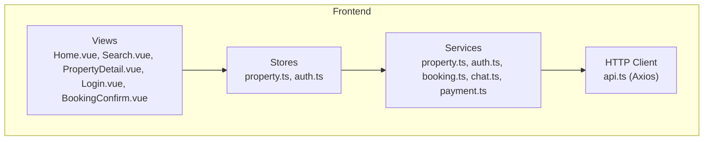
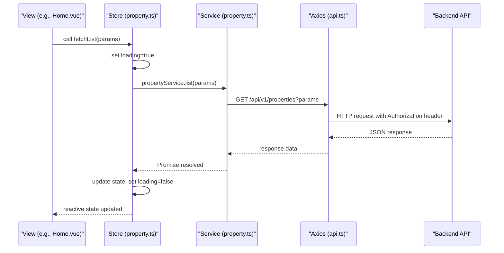
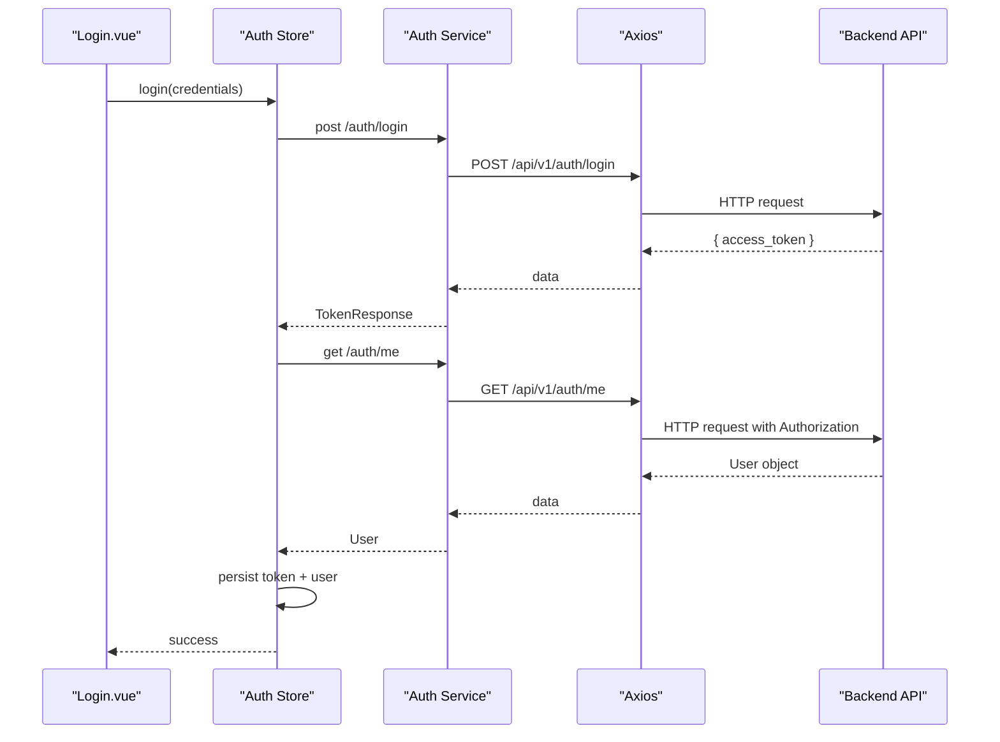
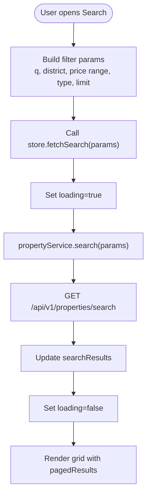
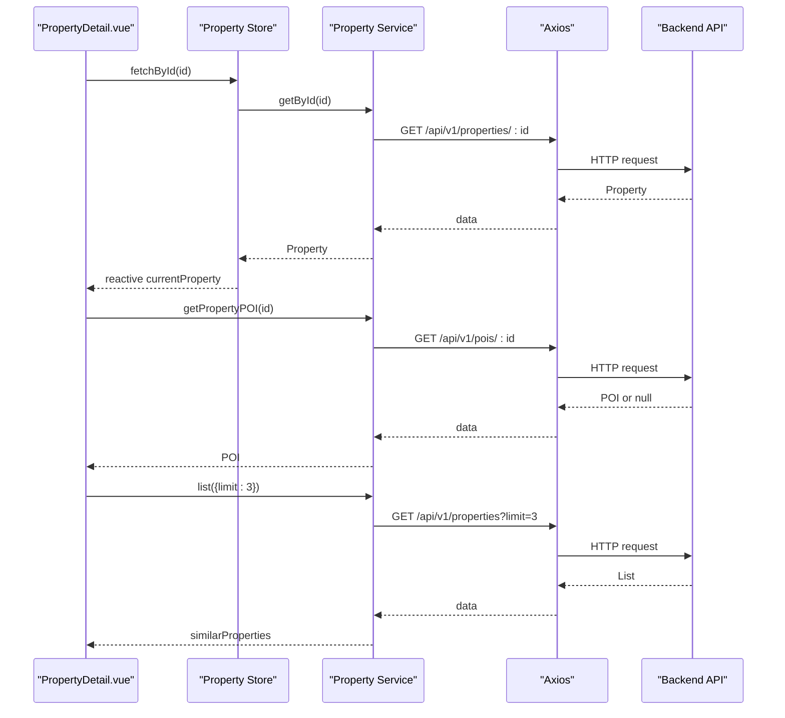
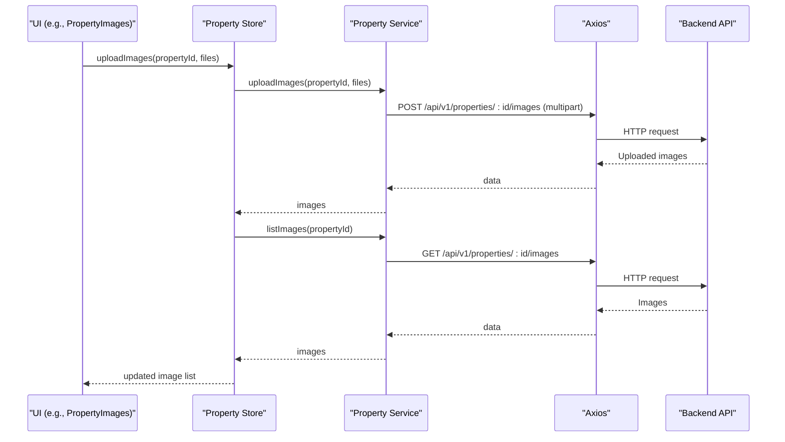
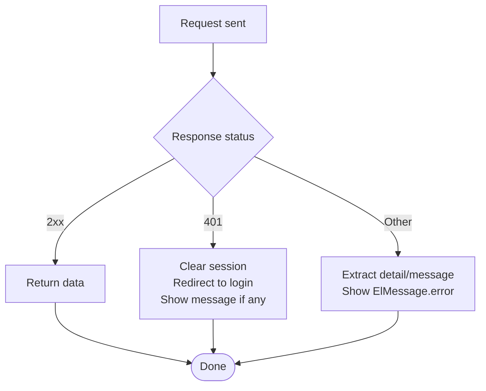
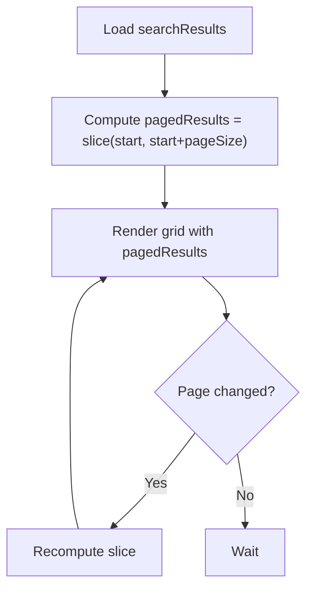
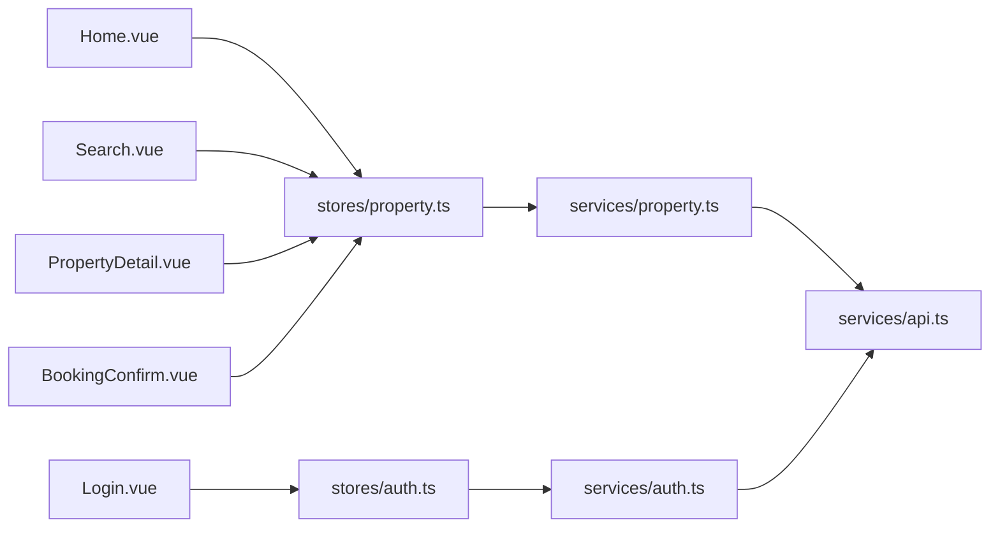

# Data Fetching Patterns & Best Practices

<cite>
**Referenced Files in This Document**
- [api.ts](file://frontend/src/services/api.ts)
- [property.ts](file://frontend/src/services/property.ts)
- [auth.ts](file://frontend/src/services/auth.ts)
- [booking.ts](file://frontend/src/services/booking.ts)
- [chat.ts](file://frontend/src/services/chat.ts)
- [payment.ts](file://frontend/src/services/payment.ts)
- [property_store.ts](file://frontend/src/stores/property.ts)
- [auth_store.ts](file://frontend/src/stores/auth.ts)
- [Home.vue](file://frontend/src/views/Home.vue)
- [Search.vue](file://frontend/src/views/Search.vue)
- [PropertyDetail.vue](file://frontend/src/views/PropertyDetail.vue)
- [Login.vue](file://frontend/src/views/Login.vue)
- [BookingConfirm.vue](file://frontend/src/views/BookingConfirm.vue)
</cite>

## Table of Contents
1. Introduction
2. Project Structure
3. Core Components
4. Architecture Overview
5. Detailed Component Analysis
6. Dependency Analysis
7. Performance Considerations
8. Troubleshooting Guide
9. Conclusion

## Introduction
This document explains the data fetching patterns and best practices implemented across the frontend application. It covers how API requests are structured, how loading states and errors are handled, and where retry mechanisms, caching, deduplication, offline support, progress tracking, pagination, and performance optimizations exist or can be added. It also provides guidance for consistent error boundaries, loading skeletons, graceful degradation, and debugging approaches for network issues.

## Project Structure
The frontend is organized by feature layers:
- Services: thin HTTP clients wrapping Axios with typed endpoints
- Stores: Pinia stores coordinating state, loading flags, and request orchestration
- Views: Vue components that trigger store methods and render UI states (loading, empty, error)
- Shared HTTP client: a single Axios instance with interceptors for auth and global error handling

**Diagram sources**
- [Home.vue:1-719](file://frontend/src/views/Home.vue#L1-L719)
- [Search.vue:1-495](file://frontend/src/views/Search.vue#L1-L495)
- [PropertyDetail.vue:1-800](file://frontend/src/views/PropertyDetail.vue#L1-L800)
- [Login.vue:1-204](file://frontend/src/views/Login.vue#L1-L204)
- [BookingConfirm.vue:1-326](file://frontend/src/views/BookingConfirm.vue#L1-L326)
- [property_store.ts:1-136](file://frontend/src/stores/property.ts#L1-L136)
- [auth_store.ts:1-101](file://frontend/src/stores/auth.ts#L1-L101)
- [property.ts:1-86](file://frontend/src/services/property.ts#L1-L86)
- [auth.ts:1-22](file://frontend/src/services/auth.ts#L1-L22)
- [booking.ts:1-25](file://frontend/src/services/booking.ts#L1-L25)
- [chat.ts:1-24](file://frontend/src/services/chat.ts#L1-L24)
- [payment.ts:1-34](file://frontend/src/services/payment.ts#L1-L34)
- [api.ts:1-56](file://frontend/src/services/api.ts#L1-L56)

**Section sources**
- [api.ts:1-56](file://frontend/src/services/api.ts#L1-L56)
- [property.ts:1-86](file://frontend/src/services/property.ts#L1-L86)
- [auth.ts:1-22](file://frontend/src/services/auth.ts#L1-L22)
- [booking.ts:1-25](file://frontend/src/services/booking.ts#L1-L25)
- [chat.ts:1-24](file://frontend/src/services/chat.ts#L1-L24)
- [payment.ts:1-34](file://frontend/src/services/payment.ts#L1-L34)
- [property_store.ts:1-136](file://frontend/src/stores/property.ts#L1-L136)
- [auth_store.ts:1-101](file://frontend/src/stores/auth.ts#L1-L101)
- [Home.vue:1-719](file://frontend/src/views/Home.vue#L1-L719)
- [Search.vue:1-495](file://frontend/src/views/Search.vue#L1-L495)
- [PropertyDetail.vue:1-800](file://frontend/src/views/PropertyDetail.vue#L1-L800)
- [Login.vue:1-204](file://frontend/src/views/Login.vue#L1-L204)
- [BookingConfirm.vue:1-326](file://frontend/src/views/BookingConfirm.vue#L1-L326)

## Core Components
- Central HTTP client (Axios):
  - Base URL, timeout, default headers
  - Request interceptor to attach Authorization header from localStorage
  - Response interceptor to handle 401 (logout and redirect), and display user-friendly messages for validation/server errors
- Service layer:
  - Thin wrappers around Axios calls with typed parameters and responses
  - Specialized handling for multipart uploads and optional endpoints
- Store layer:
  - Centralized state for lists, current entities, search results, and images
  - Loading flags per operation; try/finally to reset loading
  - Local cache of last search params
- View layer:
  - Uses Element Plus v-loading for skeleton-like loading indicators
  - Empty states and fallbacks when data is missing
  - Pagination via computed slices for large result sets

Key implementation references:
- Global HTTP client setup and interceptors
- Property service endpoints including image upload
- Auth service login flow and profile fetch
- Booking service CRUD operations
- Chat and payment services
- Property store methods for list/search/detail/images
- Auth store login/register/current user flows
- Home view listing and loading
- Search view filters, semantic mode, and pagination
- Property detail view POI and similar properties loading
- Login view form submission and error handling
- Booking confirm page submission and status-based error messaging

**Section sources**
- [api.ts:1-56](file://frontend/src/services/api.ts#L1-L56)
- [property.ts:1-86](file://frontend/src/services/property.ts#L1-L86)
- [auth.ts:1-22](file://frontend/src/services/auth.ts#L1-L22)
- [booking.ts:1-25](file://frontend/src/services/booking.ts#L1-L25)
- [chat.ts:1-24](file://frontend/src/services/chat.ts#L1-L24)
- [payment.ts:1-34](file://frontend/src/services/payment.ts#L1-L34)
- [property_store.ts:1-136](file://frontend/src/stores/property.ts#L1-L136)
- [auth_store.ts:1-101](file://frontend/src/stores/auth.ts#L1-L101)
- [Home.vue:1-719](file://frontend/src/views/Home.vue#L1-L719)
- [Search.vue:1-495](file://frontend/src/views/Search.vue#L1-L495)
- [PropertyDetail.vue:1-800](file://frontend/src/views/PropertyDetail.vue#L1-L800)
- [Login.vue:1-204](file://frontend/src/views/Login.vue#L1-L204)
- [BookingConfirm.vue:1-326](file://frontend/src/views/BookingConfirm.vue#L1-L326)

## Architecture Overview
End-to-end request flow from view to server and back:

**Diagram sources**
- [Home.vue:310-312](file://frontend/src/views/Home.vue#L310-L312)
- [property_store.ts:17-24](file://frontend/src/stores/property.ts#L17-L24)
- [property.ts:29-31](file://frontend/src/services/property.ts#L29-L31)
- [api.ts:1-56](file://frontend/src/services/api.ts#L1-L56)

## Detailed Component Analysis

### Authentication Flow
- Login triggers store method which posts credentials, then fetches current user and persists token and user info.
- Interceptors automatically attach Authorization header on subsequent requests and handle 401 by clearing session and redirecting.

**Diagram sources**
- [Login.vue:88-104](file://frontend/src/views/Login.vue#L88-L104)
- [auth_store.ts:54-66](file://frontend/src/stores/auth.ts#L54-L66)
- [auth.ts:10-21](file://frontend/src/services/auth.ts#L10-L21)
- [api.ts:12-22](file://frontend/src/services/api.ts#L12-L22)

**Section sources**
- [Login.vue:88-104](file://frontend/src/views/Login.vue#L88-L104)
- [auth_store.ts:17-42](file://frontend/src/stores/auth.ts#L17-L42)
- [auth.ts:1-22](file://frontend/src/services/auth.ts#L1-L22)
- [api.ts:12-22](file://frontend/src/services/api.ts#L12-L22)

### Property Listing and Search
- Home view loads a small initial list using store method.
- Search view composes filters into query params, calls store search, and renders paginated results via computed slice.

**Diagram sources**
- [Search.vue:319-338](file://frontend/src/views/Search.vue#L319-L338)
- [property_store.ts:26-34](file://frontend/src/stores/property.ts#L26-L34)
- [property.ts:33-35](file://frontend/src/services/property.ts#L33-L35)

**Section sources**
- [Home.vue:310-312](file://frontend/src/views/Home.vue#L310-L312)
- [Search.vue:244-390](file://frontend/src/views/Search.vue#L244-L390)
- [property_store.ts:17-34](file://frontend/src/stores/property.ts#L17-L34)
- [property.ts:29-35](file://frontend/src/services/property.ts#L29-L35)

### Property Detail, POI, and Similar Properties
- Loads property by ID, then conditionally loads POI analysis and similar properties.
- Uses separate loading flags for POI and global loading for property.

**Diagram sources**
- [PropertyDetail.vue:389-426](file://frontend/src/views/PropertyDetail.vue#L389-L426)
- [property_store.ts:36-46](file://frontend/src/stores/property.ts#L36-L46)
- [property.ts:37-39](file://frontend/src/services/property.ts#L37-L39)
- [property.ts:83-85](file://frontend/src/services/property.ts#L83-L85)
- [property.ts:29-31](file://frontend/src/services/property.ts#L29-L31)

**Section sources**
- [PropertyDetail.vue:389-426](file://frontend/src/views/PropertyDetail.vue#L389-L426)
- [property_store.ts:36-46](file://frontend/src/stores/property.ts#L36-L46)
- [property.ts:37-39](file://frontend/src/services/property.ts#L37-L39)
- [property.ts:83-85](file://frontend/src/services/property.ts#L83-L85)

### Image Upload and Management
- Upload uses FormData and explicit multipart header.
- After upload, re-fetches image list to refresh UI.
- Delete and set primary image update local state optimistically.

**Diagram sources**
- [property_store.ts:81-90](file://frontend/src/stores/property.ts#L81-L90)
- [property.ts:66-72](file://frontend/src/services/property.ts#L66-L72)
- [property.ts:62-64](file://frontend/src/services/property.ts#L62-L64)

**Section sources**
- [property_store.ts:72-103](file://frontend/src/stores/property.ts#L72-L103)
- [property.ts:62-80](file://frontend/src/services/property.ts#L62-L80)

### Error Handling and Graceful Degradation
- Global 401 handling clears session and redirects to login unless already on login page.
- Validation and server errors show user-friendly messages.
- Specific views handle business-level errors (e.g., duplicate booking, forbidden roles).

**Diagram sources**
- [api.ts:24-54](file://frontend/src/services/api.ts#L24-L54)
- [BookingConfirm.vue:192-210](file://frontend/src/views/BookingConfirm.vue#L192-L210)

**Section sources**
- [api.ts:12-54](file://frontend/src/services/api.ts#L12-L54)
- [Login.vue:88-104](file://frontend/src/views/Login.vue#L88-L104)
- [BookingConfirm.vue:192-210](file://frontend/src/views/BookingConfirm.vue#L192-L210)

### Pagination and Large Dataset Handling
- Search view computes a paged subset of results locally and displays an Element Plus pagination control.
- For very large datasets, consider server-side pagination with skip/limit parameters.

**Diagram sources**
- [Search.vue:292-295](file://frontend/src/views/Search.vue#L292-L295)
- [Search.vue:223-231](file://frontend/src/views/Search.vue#L223-L231)

**Section sources**
- [Search.vue:244-390](file://frontend/src/views/Search.vue#L244-L390)

### Progress Tracking for File Uploads
- Current upload path does not expose upload progress events.
- Recommendation: use Axios onUploadProgress to track bytes sent and update UI accordingly.

[No sources needed since this section provides general guidance]

### Retry Mechanisms
- Frontend currently does not implement automatic retries for failed requests.
- Recommendation: add a retry wrapper around Axios calls with exponential backoff for transient errors (network timeouts, 5xx).

[No sources needed since this section provides general guidance]

### Request Deduplication
- No centralized deduplication is present.
- Recommendation: maintain a map of in-flight request keys (e.g., normalized URL + params) and return the same promise for identical concurrent requests.

[No sources needed since this section provides general guidance]

### Offline Support and Caching
- No persistent client-side cache or offline strategy is implemented.
- Recommendations:
  - Use a lightweight cache (in-memory or IndexedDB) keyed by endpoint + params with TTL.
  - Serve stale data while background refetch occurs.
  - Queue mutations offline and replay when connectivity resumes.

[No sources needed since this section provides general guidance]

### Consistent Error Boundaries and Loading Skeletons
- Loading skeletons: Element Plus v-loading is used broadly to indicate pending data.
- Error boundaries: Global interceptor centralizes 401 and validation errors; specific pages handle domain-specific errors.
- Recommendation: introduce component-level error boundaries to catch rendering errors and provide recovery actions.

**Section sources**
- [Home.vue:90-94](file://frontend/src/views/Home.vue#L90-L94)
- [Search.vue:202-208](file://frontend/src/views/Search.vue#L202-L208)
- [api.ts:24-54](file://frontend/src/services/api.ts#L24-L54)

## Dependency Analysis
High-level dependency relationships between modules involved in data fetching:

**Diagram sources**
- [Home.vue:1-719](file://frontend/src/views/Home.vue#L1-L719)
- [Search.vue:1-495](file://frontend/src/views/Search.vue#L1-L495)
- [PropertyDetail.vue:1-800](file://frontend/src/views/PropertyDetail.vue#L1-L800)
- [Login.vue:1-204](file://frontend/src/views/Login.vue#L1-L204)
- [BookingConfirm.vue:1-326](file://frontend/src/views/BookingConfirm.vue#L1-L326)
- [property_store.ts:1-136](file://frontend/src/stores/property.ts#L1-L136)
- [auth_store.ts:1-101](file://frontend/src/stores/auth.ts#L1-L101)
- [property.ts:1-86](file://frontend/src/services/property.ts#L1-L86)
- [auth.ts:1-22](file://frontend/src/services/auth.ts#L1-L22)
- [api.ts:1-56](file://frontend/src/services/api.ts#L1-L56)

**Section sources**
- [property_store.ts:1-136](file://frontend/src/stores/property.ts#L1-L136)
- [auth_store.ts:1-101](file://frontend/src/stores/auth.ts#L1-L101)
- [property.ts:1-86](file://frontend/src/services/property.ts#L1-L86)
- [auth.ts:1-22](file://frontend/src/services/auth.ts#L1-L22)
- [api.ts:1-56](file://frontend/src/services/api.ts#L1-L56)

## Performance Considerations
- Prefer server-side pagination for large datasets; currently Search uses client-side slicing.
- Avoid redundant requests by implementing request deduplication at the service layer.
- Cache frequently accessed read-only data (e.g., property listings) with TTL invalidation on writes.
- Use AbortController to cancel stale requests (e.g., rapid filter changes).
- Defer heavy computations off the main thread or memoize derived data.
- Lazy-load non-critical resources (maps, images) and use placeholders.

[No sources needed since this section provides general guidance]

## Troubleshooting Guide
- Network errors:
  - Check browser DevTools Network tab for request/response payloads and status codes.
  - Verify Authorization header presence and correctness.
- Authentication issues:
  - 401 responses clear session and redirect; ensure tokens are persisted and refreshed appropriately.
- Validation errors:
  - Server returns structured details; global interceptor surfaces them via notifications.
- Business logic errors:
  - Some views handle specific statuses (e.g., duplicate bookings, forbidden roles) and show targeted messages.
- Debugging tips:
  - Add logging in Axios interceptors for request/response metadata.
  - Instrument store methods to log timing and payload shapes.
  - Use Vue DevTools to inspect store state transitions during requests.

**Section sources**
- [api.ts:24-54](file://frontend/src/services/api.ts#L24-L54)
- [BookingConfirm.vue:192-210](file://frontend/src/views/BookingConfirm.vue#L192-L210)

## Conclusion
The application follows a clean separation of concerns: views orchestrate user interactions, stores manage state and loading, services encapsulate HTTP calls, and a shared Axios client centralizes authentication and error handling. While basic patterns for loading and error display are in place, enhancements such as retry, deduplication, caching, offline support, upload progress, and robust error boundaries will improve reliability, performance, and user experience.