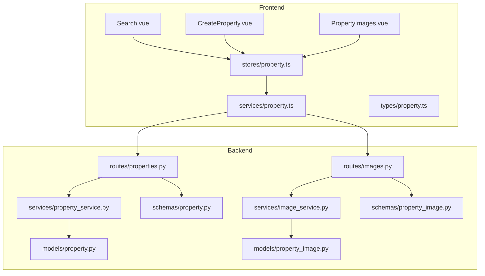
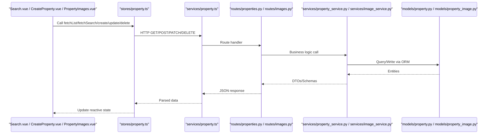
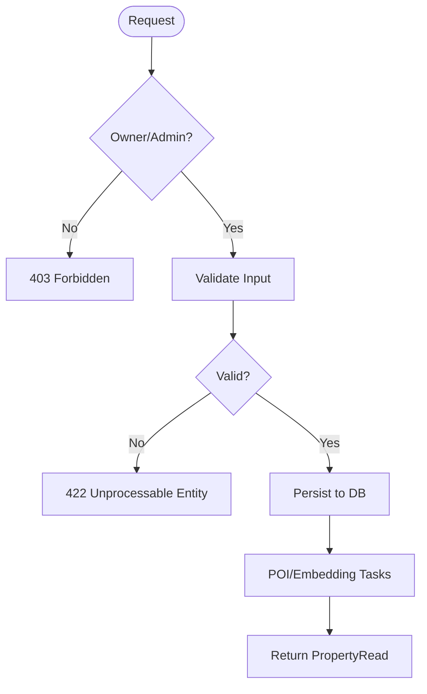
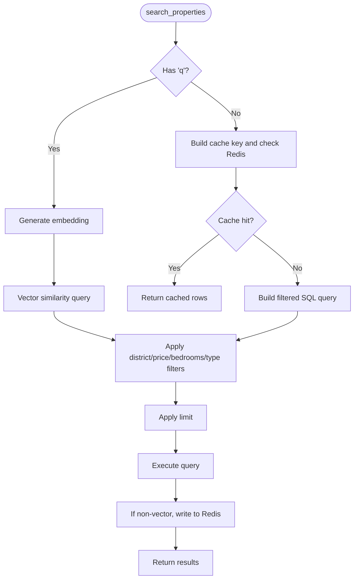
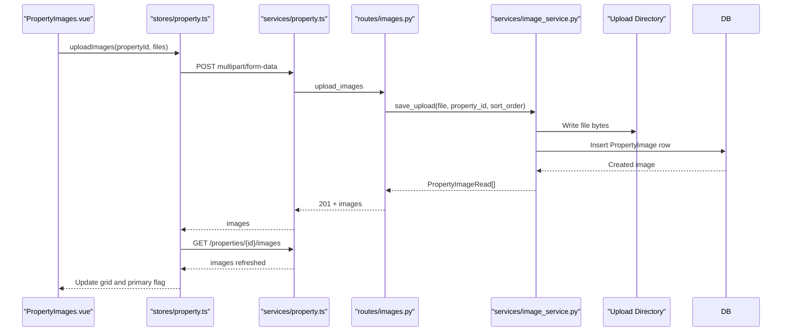
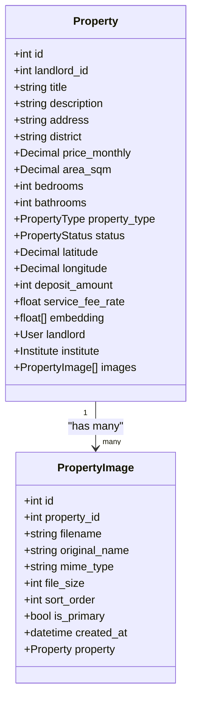
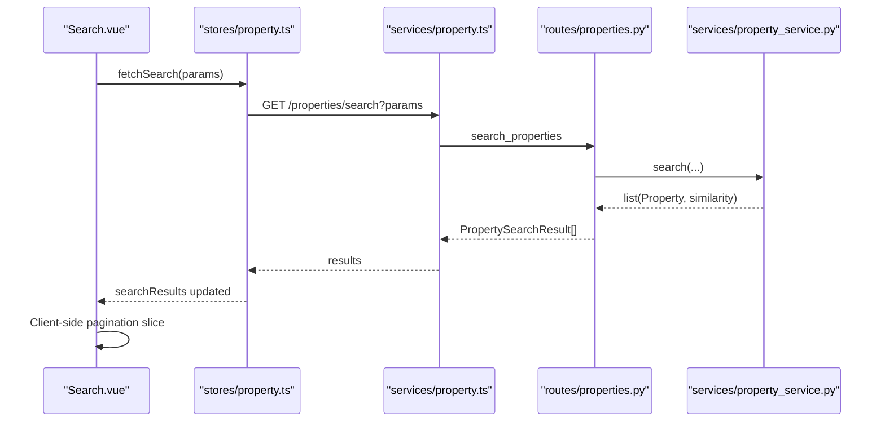
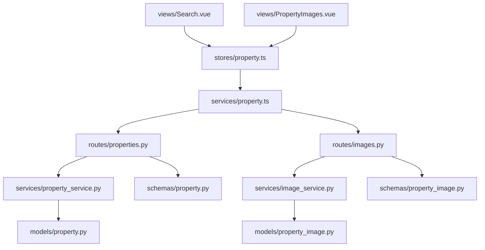

# Property Management Service

<cite>
**Referenced Files in This Document**
- [properties.py](file://backend/app/api/v1/routes/properties.py)
- [images.py](file://backend/app/api/v1/routes/images.py)
- [property_service.py](file://backend/app/services/property_service.py)
- [image_service.py](file://backend/app/services/image_service.py)
- [property.py](file://backend/app/models/property.py)
- [property_image.py](file://backend/app/models/property_image.py)
- [property.py](file://backend/app/schemas/property.py)
- [property_image.py](file://backend/app/schemas/property_image.py)
- [property.ts](file://frontend/src/services/property.ts)
- [property.ts](file://frontend/src/stores/property.ts)
- [property.ts](file://frontend/src/types/property.ts)
- [Search.vue](file://frontend/src/views/Search.vue)
- [PropertyImages.vue](file://frontend/src/views/PropertyImages.vue)
- [CreateProperty.vue](file://frontend/src/views/CreateProperty.vue)
</cite>

## Table of Contents
1. [Introduction](#introduction)
2. [Project Structure](#project-structure)
3. [Core Components](#core-components)
4. [Architecture Overview](#architecture-overview)
5. [Detailed Component Analysis](#detailed-component-analysis)
6. [Dependency Analysis](#dependency-analysis)
7. [Performance Considerations](#performance-considerations)
8. [Troubleshooting Guide](#troubleshooting-guide)
9. [Conclusion](#conclusion)
10. [Appendices](#appendices)

## Introduction
This document provides comprehensive documentation for the property management service module, covering all property-related API endpoints (CRUD, search, filtering), image upload and management, and integration between backend services and frontend stores and views. It explains method signatures, data models, pagination handling, loading states, error scenarios, and synchronization between API responses and local store state.

## Project Structure
The property management feature spans backend routes, services, models, schemas, and frontend services, stores, types, and views:
- Backend:
  - Routes expose REST endpoints for properties and images.
  - Services encapsulate business logic (CRUD, search with optional vector similarity, caching).
  - Models define database entities; Schemas define request/response contracts.
- Frontend:
  - Service layer wraps HTTP calls.
  - Store manages state, loading flags, and caches results.
  - Views implement UI interactions and integrate with the store.

**Diagram sources**
- [properties.py:1-162](file://backend/app/api/v1/routes/properties.py#L1-L162)
- [images.py:1-151](file://backend/app/api/v1/routes/images.py#L1-L151)
- [property_service.py:1-239](file://backend/app/services/property_service.py#L1-L239)
- [image_service.py:1-95](file://backend/app/services/image_service.py#L1-L95)
- [property.py:1-86](file://backend/app/models/property.py#L1-L86)
- [property_image.py:1-23](file://backend/app/models/property_image.py#L1-L23)
- [property.py:1-79](file://backend/app/schemas/property.py#L1-L79)
- [property_image.py:1-22](file://backend/app/schemas/property_image.py#L1-L22)
- [property.ts:1-86](file://frontend/src/services/property.ts#L1-L86)
- [property.ts:1-136](file://frontend/src/stores/property.ts#L1-L136)
- [property.ts:1-95](file://frontend/src/types/property.ts#L1-L95)
- [Search.vue:1-495](file://frontend/src/views/Search.vue#L1-L495)
- [PropertyImages.vue:1-521](file://frontend/src/views/PropertyImages.vue#L1-L521)
- [CreateProperty.vue:1-424](file://frontend/src/views/CreateProperty.vue#L1-L424)

**Section sources**
- [properties.py:1-162](file://backend/app/api/v1/routes/properties.py#L1-L162)
- [images.py:1-151](file://backend/app/api/v1/routes/images.py#L1-L151)
- [property_service.py:1-239](file://backend/app/services/property_service.py#L1-L239)
- [image_service.py:1-95](file://backend/app/services/image_service.py#L1-L95)
- [property.py:1-86](file://backend/app/models/property.py#L1-L86)
- [property_image.py:1-23](file://backend/app/models/property_image.py#L1-L23)
- [property.py:1-79](file://backend/app/schemas/property.py#L1-L79)
- [property_image.py:1-22](file://backend/app/schemas/property_image.py#L1-L22)
- [property.ts:1-86](file://frontend/src/services/property.ts#L1-L86)
- [property.ts:1-136](file://frontend/src/stores/property.ts#L1-L136)
- [property.ts:1-95](file://frontend/src/types/property.ts#L1-L95)
- [Search.vue:1-495](file://frontend/src/views/Search.vue#L1-L495)
- [PropertyImages.vue:1-521](file://frontend/src/views/PropertyImages.vue#L1-L521)
- [CreateProperty.vue:1-424](file://frontend/src/views/CreateProperty.vue#L1-L424)

## Core Components
- API Endpoints:
  - Properties CRUD: create, list, get by id, update, delete.
  - Search: advanced filters and optional natural language query with pgvector similarity.
  - Images: upload multiple, list, delete, set primary.
- Services:
  - PropertyService: persistence operations, search with optional Redis cache and async embedding task dispatch.
  - ImageService: file validation, storage, metadata management, primary image selection.
- Data Contracts:
  - Pydantic schemas enforce input/output shapes and constraints.
  - SQLAlchemy models define DB schema, relationships, and indexes.
- Frontend Integration:
  - Service functions wrap HTTP calls.
  - Pinia store centralizes state, loading flags, and image lists.
  - Views orchestrate user flows and synchronize with store.

**Section sources**
- [properties.py:16-162](file://backend/app/api/v1/routes/properties.py#L16-L162)
- [images.py:26-151](file://backend/app/api/v1/routes/images.py#L26-L151)
- [property_service.py:44-239](file://backend/app/services/property_service.py#L44-L239)
- [image_service.py:13-95](file://backend/app/services/image_service.py#L13-L95)
- [property.py:11-79](file://backend/app/schemas/property.py#L11-L79)
- [property_image.py:6-22](file://backend/app/schemas/property_image.py#L6-L22)
- [property.ts:28-86](file://frontend/src/services/property.ts#L28-L86)
- [property.ts:6-136](file://frontend/src/stores/property.ts#L6-L136)

## Architecture Overview
End-to-end flow from UI to persistence and back:

**Diagram sources**
- [Search.vue:244-390](file://frontend/src/views/Search.vue#L244-L390)
- [CreateProperty.vue:320-395](file://frontend/src/views/CreateProperty.vue#L320-L395)
- [PropertyImages.vue:179-350](file://frontend/src/views/PropertyImages.vue#L179-L350)
- [property.ts:17-136](file://frontend/src/stores/property.ts#L17-L136)
- [property.ts:28-86](file://frontend/src/services/property.ts#L28-L86)
- [properties.py:16-162](file://backend/app/api/v1/routes/properties.py#L16-L162)
- [images.py:26-151](file://backend/app/api/v1/routes/images.py#L26-L151)
- [property_service.py:44-239](file://backend/app/services/property_service.py#L44-L239)
- [image_service.py:13-95](file://backend/app/services/image_service.py#L13-L95)
- [property.py:38-86](file://backend/app/models/property.py#L38-L86)
- [property_image.py:8-23](file://backend/app/models/property_image.py#L8-L23)

## Detailed Component Analysis

### Property API Endpoints
- POST /api/v1/properties
  - Purpose: Create a new property listing.
  - Auth: Requires landlord role or admin override.
  - Request body: PropertyCreate schema fields including landlord_id.
  - Response: PropertyRead with images and timestamps.
  - Validation: Landlord existence and ownership checks.
- GET /api/v1/properties/search
  - Purpose: Advanced search with filters and optional natural language query.
  - Query params: q, district, price_min, price_max, bedrooms, property_type, limit.
  - Response: List of PropertySearchResult with optional similarity score and images.
- GET /api/v1/properties
  - Purpose: Paginated listing with optional district and status filters.
  - Query params: skip, limit, district, status.
  - Response: List of PropertyRead.
- GET /api/v1/properties/{property_id}
  - Purpose: Retrieve a single property by ID.
  - Response: PropertyRead or 404.
- PATCH /api/v1/properties/{property_id}
  - Purpose: Partial update of a property.
  - Auth: Owner or admin.
  - Response: Updated PropertyRead or 404/403.
- DELETE /api/v1/properties/{property_id}
  - Purpose: Delete a property.
  - Auth: Owner or admin.
  - Response: 204 on success or 404/403.

**Diagram sources**
- [properties.py:16-162](file://backend/app/api/v1/routes/properties.py#L16-L162)
- [property_service.py:48-61](file://backend/app/services/property_service.py#L48-L61)

**Section sources**
- [properties.py:16-162](file://backend/app/api/v1/routes/properties.py#L16-L162)
- [property_service.py:44-239](file://backend/app/services/property_service.py#L44-L239)
- [property.py:11-79](file://backend/app/schemas/property.py#L11-L79)

### Search and Filtering
- Supported filters:
  - Natural language query (q): triggers vector similarity using pgvector.
  - District filter.
  - Price range (price_min, price_max).
  - Bedrooms exact match.
  - Property type enum.
  - Limit (1–100).
- Caching:
  - Non-vector searches are cached in Redis with deterministic keys and TTL.
- Similarity:
  - When q is provided, results include similarity scores ordered by distance.

**Diagram sources**
- [properties.py:36-91](file://backend/app/api/v1/routes/properties.py#L36-L91)
- [property_service.py:91-195](file://backend/app/services/property_service.py#L91-L195)

**Section sources**
- [properties.py:36-91](file://backend/app/api/v1/routes/properties.py#L36-L91)
- [property_service.py:91-195](file://backend/app/services/property_service.py#L91-L195)

### Image Upload and Management
- Endpoints:
  - POST /api/v1/properties/{property_id}/images
    - Upload multiple images; validates count limits, MIME types, and size.
    - Sets first uploaded image as primary if none exists.
  - GET /api/v1/properties/{property_id}/images
    - Lists images sorted by sort_order and id.
  - DELETE /api/v1/properties/{property_id}/images/{image_id}
    - Deletes image record and file from disk.
  - PATCH /api/v1/properties/{property_id}/images/{image_id}/primary
    - Sets selected image as primary; unsets others for the same property.
- Storage:
  - Files saved under configured upload directory with unique filenames.
  - Metadata persisted with original name, MIME type, size, and order.

**Diagram sources**
- [PropertyImages.vue:265-333](file://frontend/src/views/PropertyImages.vue#L265-L333)
- [property.ts:81-103](file://frontend/src/stores/property.ts#L81-L103)
- [property.ts:66-80](file://frontend/src/services/property.ts#L66-L80)
- [images.py:26-80](file://backend/app/api/v1/routes/images.py#L26-L80)
- [image_service.py:27-52](file://backend/app/services/image_service.py#L27-L52)

**Section sources**
- [images.py:26-151](file://backend/app/api/v1/routes/images.py#L26-L151)
- [image_service.py:13-95](file://backend/app/services/image_service.py#L13-L95)
- [property_image.py:6-22](file://backend/app/schemas/property_image.py#L6-L22)
- [property_image.py:8-23](file://backend/app/models/property_image.py#L8-L23)

### Data Models and Schemas
- Property model includes:
  - Basic info (title, description, address, district).
  - Pricing and area, room counts, type, status.
  - Geolocation coordinates.
  - Optional deposit amount and service fee rate.
  - Vector embedding column for semantic search.
  - Relationships to User, Institute, and PropertyImage.
- PropertyImage model includes:
  - File metadata and ordering.
  - Primary flag and timestamp.
- Schemas enforce:
  - Field constraints (length, ranges, enums).
  - Read models include computed primary_image_url helper.

**Diagram sources**
- [property.py:38-86](file://backend/app/models/property.py#L38-L86)
- [property_image.py:8-23](file://backend/app/models/property_image.py#L8-L23)

**Section sources**
- [property.py:1-86](file://backend/app/models/property.py#L1-L86)
- [property_image.py:1-23](file://backend/app/models/property_image.py#L1-L23)
- [property.py:11-79](file://backend/app/schemas/property.py#L11-L79)
- [property_image.py:6-22](file://backend/app/schemas/property_image.py#L6-L22)

### Frontend Integration and State Management
- Service methods:
  - list(params), search(params), getById(id), create(data), update(id, data), delete(id).
  - Image helpers: listImages, uploadImages, deleteImage, setPrimaryImage.
  - Geocode helper for address resolution.
- Store responsibilities:
  - Reactive refs for properties, searchResults, currentProperty, images.
  - Loading flags for general and image operations.
  - Methods to fetch, create, update, remove, and manage images with optimistic updates where appropriate.
- Views:
  - Search.vue builds filters, maps country/overseas_area to district, invokes store.search, and implements client-side pagination.
  - CreateProperty.vue handles form submission and edit mode, integrating with store.create/update.
  - PropertyImages.vue orchestrates upload, deletion, and primary selection, refreshing image lists after mutations.

**Diagram sources**
- [Search.vue:319-351](file://frontend/src/views/Search.vue#L319-L351)
- [property.ts:26-34](file://frontend/src/stores/property.ts#L26-L34)
- [property.ts:33-35](file://frontend/src/services/property.ts#L33-L35)
- [properties.py:36-91](file://backend/app/api/v1/routes/properties.py#L36-L91)
- [property_service.py:91-195](file://backend/app/services/property_service.py#L91-L195)

**Section sources**
- [property.ts:1-86](file://frontend/src/services/property.ts#L1-L86)
- [property.ts:1-136](file://frontend/src/stores/property.ts#L1-L136)
- [property.ts:1-95](file://frontend/src/types/property.ts#L1-L95)
- [Search.vue:244-390](file://frontend/src/views/Search.vue#L244-L390)
- [CreateProperty.vue:320-395](file://frontend/src/views/CreateProperty.vue#L320-L395)
- [PropertyImages.vue:179-350](file://frontend/src/views/PropertyImages.vue#L179-L350)

## Dependency Analysis
- Coupling:
  - Routes depend on services and schemas; services depend on models and external integrations (Redis, pgvector).
  - Frontend service depends on router endpoints; store depends on service; views depend on store.
- External Integrations:
  - Redis for search result caching (non-vector queries).
  - pgvector for vector similarity when q is provided.
  - Celery tasks dispatched asynchronously for embeddings.
- Potential Circular Dependencies:
  - None observed at module level; lazy imports used to avoid hard dependencies.

**Diagram sources**
- [properties.py:1-162](file://backend/app/api/v1/routes/properties.py#L1-L162)
- [images.py:1-151](file://backend/app/api/v1/routes/images.py#L1-L151)
- [property_service.py:1-239](file://backend/app/services/property_service.py#L1-L239)
- [image_service.py:1-95](file://backend/app/services/image_service.py#L1-L95)
- [property.py:1-86](file://backend/app/models/property.py#L1-L86)
- [property_image.py:1-23](file://backend/app/models/property_image.py#L1-L23)
- [property.py:1-79](file://backend/app/schemas/property.py#L1-L79)
- [property_image.py:1-22](file://backend/app/schemas/property_image.py#L1-L22)
- [property.ts:1-86](file://frontend/src/services/property.ts#L1-L86)
- [property.ts:1-136](file://frontend/src/stores/property.ts#L1-L136)
- [Search.vue:1-495](file://frontend/src/views/Search.vue#L1-L495)
- [PropertyImages.vue:1-521](file://frontend/src/views/PropertyImages.vue#L1-L521)

**Section sources**
- [property_service.py:1-239](file://backend/app/services/property_service.py#L1-L239)
- [image_service.py:1-95](file://backend/app/services/image_service.py#L1-L95)
- [property.ts:1-86](file://frontend/src/services/property.ts#L1-L86)
- [property.ts:1-136](file://frontend/src/stores/property.ts#L1-L136)

## Performance Considerations
- Search caching:
  - Deterministic cache keys based on filter parameters; TTL reduces repeated DB load for common queries.
- Vector search:
  - Uses pgvector l2_distance; ensure embedding vectors exist and are indexed for performance.
- Pagination:
  - Backend supports skip/limit for listings; frontend implements client-side pagination for search results.
- Image uploads:
  - Enforce file size and type limits; batch uploads reduce round trips but still validate per file.
- Asynchronous tasks:
  - Embedding generation is dispatched in background threads to avoid blocking requests.

[No sources needed since this section provides general guidance]

## Troubleshooting Guide
- Common errors:
  - 404 Not Found: Property or image not found during read/update/delete operations.
  - 403 Forbidden: Unauthorized access when landlord attempts to modify another’s property.
  - 422 Unprocessable Entity: Invalid landlord_id reference or missing required fields.
  - 400 Bad Request: Unsupported file type or exceeding max upload size/image count.
- Debugging tips:
  - Verify auth middleware and role checks in route handlers.
  - Confirm Redis availability for search caching; fallback behavior logs debug messages.
  - Ensure upload directory exists and is writable.
  - Check that embeddings exist before vector search; otherwise, results may be empty.

**Section sources**
- [properties.py:16-162](file://backend/app/api/v1/routes/properties.py#L16-L162)
- [images.py:26-151](file://backend/app/api/v1/routes/images.py#L26-L151)
- [property_service.py:102-195](file://backend/app/services/property_service.py#L102-L195)
- [image_service.py:27-95](file://backend/app/services/image_service.py#L27-L95)

## Conclusion
The property management service provides a robust, extensible foundation for managing rental listings with advanced search capabilities and rich media support. The clear separation of concerns across routes, services, models, and schemas ensures maintainability, while the frontend integrates seamlessly through typed services and centralized store state.

[No sources needed since this section summarizes without analyzing specific files]

## Appendices

### API Reference Summary
- Properties
  - POST /api/v1/properties
  - GET /api/v1/properties/search?q=&district=&price_min=&price_max=&bedrooms=&property_type=&limit=
  - GET /api/v1/properties?skip=&limit=&district=&status=
  - GET /api/v1/properties/{property_id}
  - PATCH /api/v1/properties/{property_id}
  - DELETE /api/v1/properties/{property_id}
- Images
  - POST /api/v1/properties/{property_id}/images (multipart/form-data)
  - GET /api/v1/properties/{property_id}/images
  - DELETE /api/v1/properties/{property_id}/images/{image_id}
  - PATCH /api/v1/properties/{property_id}/images/{image_id}/primary

**Section sources**
- [properties.py:16-162](file://backend/app/api/v1/routes/properties.py#L16-L162)
- [images.py:26-151](file://backend/app/api/v1/routes/images.py#L26-L151)

### Method Signatures Overview
- PropertyService
  - create(property_in: PropertyCreate) -> Property
  - get(property_id: int) -> Property | None
  - list(skip: int, limit: int, district: str | None, status: str | None) -> list[Property]
  - search(query: str | None, district: str | None, price_min: Decimal | None, price_max: Decimal | None, bedrooms: int | None, property_type: str | None, limit: int) -> list[tuple[Property, float | None]]
  - update(property_id: int, property_in: PropertyUpdate) -> Property | None
  - delete(property_id: int) -> bool
- ImageService
  - save_upload(file: UploadFile, property_id: int, sort_order: int) -> PropertyImage
  - delete_image(image_id: int) -> bool
  - set_primary(image_id: int) -> PropertyImage | None
  - get_by_property(property_id: int) -> list[PropertyImage]

**Section sources**
- [property_service.py:48-239](file://backend/app/services/property_service.py#L48-L239)
- [image_service.py:27-95](file://backend/app/services/image_service.py#L27-L95)