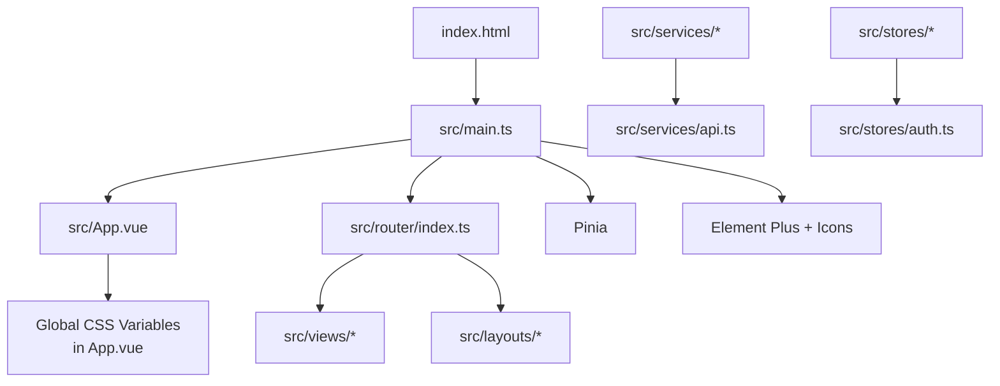
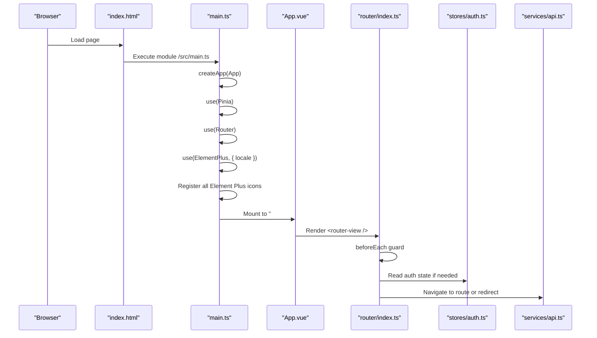
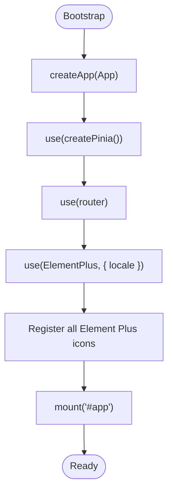
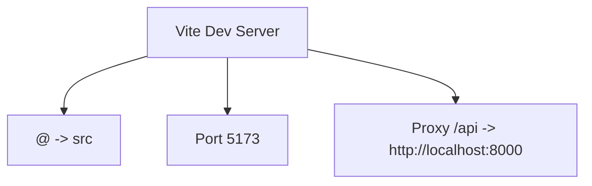
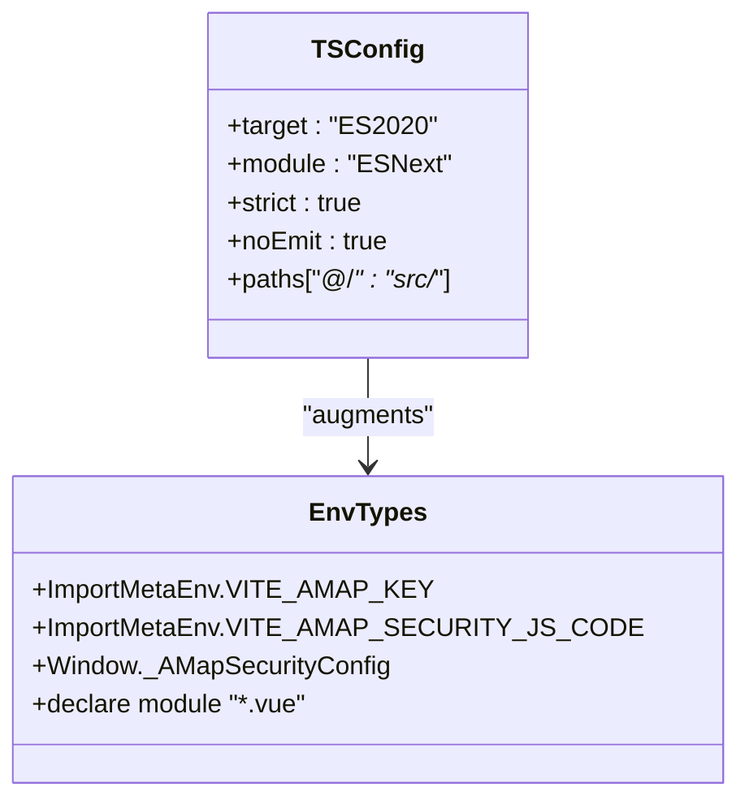
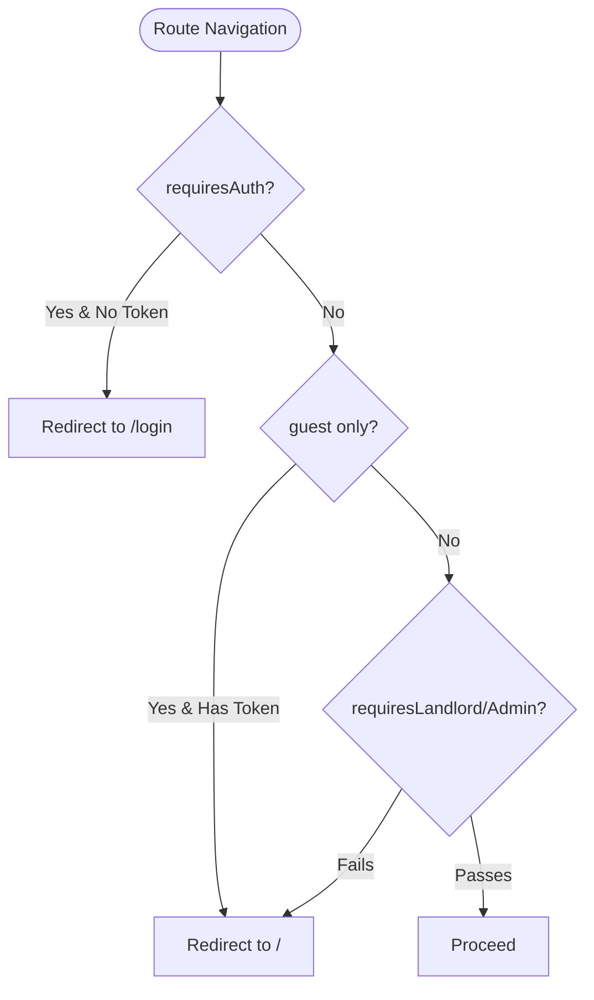
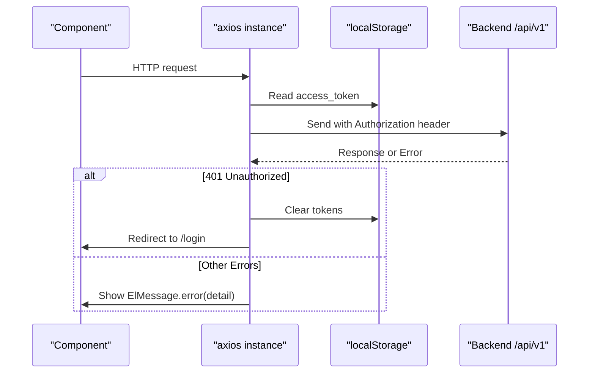
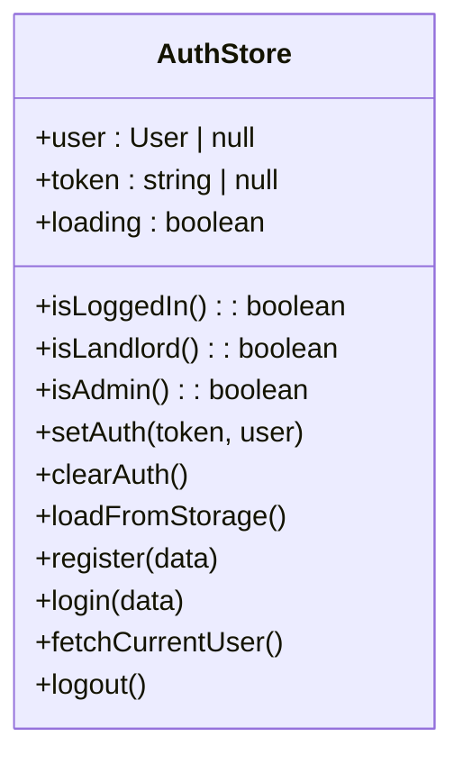
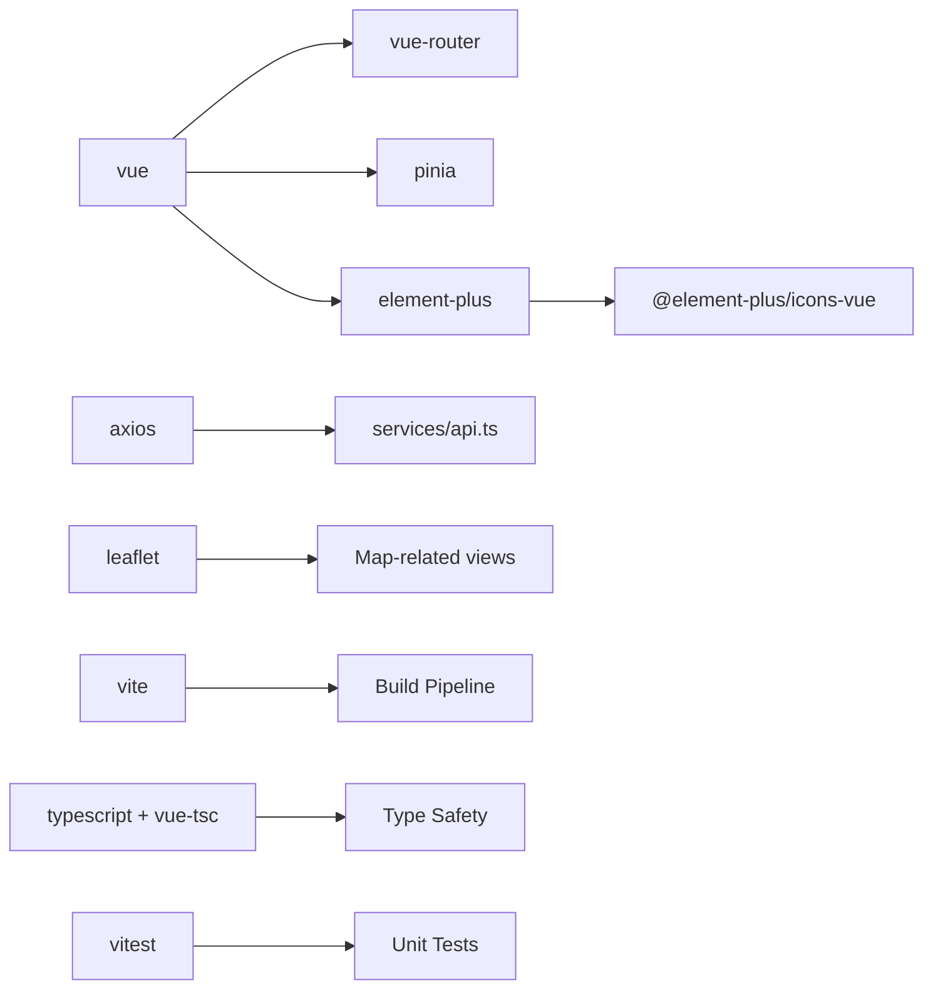

# Application Setup & Configuration

<cite>
**Referenced Files in This Document**
- [main.ts](file://frontend/src/main.ts)
- [vite.config.ts](file://frontend/vite.config.ts)
- [package.json](file://frontend/package.json)
- [tsconfig.json](file://frontend/tsconfig.json)
- [tsconfig.app.json](file://frontend/tsconfig.app.json)
- [env.d.ts](file://frontend/env.d.ts)
- [index.html](file://frontend/index.html)
- [App.vue](file://frontend/src/App.vue)
- [router/index.ts](file://frontend/src/router/index.ts)
- [services/api.ts](file://frontend/src/services/api.ts)
- [stores/auth.ts](file://frontend/src/stores/auth.ts)
- [vitest.config.ts](file://frontend/vitest.config.ts)
</cite>

## Table of Contents
1. [Introduction](#introduction)
2. [Project Structure](#project-structure)
3. [Core Components](#core-components)
4. [Architecture Overview](#architecture-overview)
5. [Detailed Component Analysis](#detailed-component-analysis)
6. [Dependency Analysis](#dependency-analysis)
7. [Performance Considerations](#performance-considerations)
8. [Troubleshooting Guide](#troubleshooting-guide)
9. [Conclusion](#conclusion)
10. [Appendices](#appendices)

## Introduction
This document explains how the Vue 3 frontend application is bootstrapped and configured. It covers:
- Application bootstrap in main.ts, including plugin initialization (Pinia, Vue Router, Element Plus), global component registration, and app mounting
- Vite build configuration for development server, TypeScript compilation options, aliasing, proxying, and optimization strategies
- Project structure conventions, file organization patterns, and naming standards
- Environment configuration management, dependency management via package.json, and TypeScript configuration for type safety
- Examples of extending the setup with custom plugins, global styles, and utility functions

## Project Structure
The frontend follows a feature-oriented layout under src/:
- Entry points: index.html, main.ts, App.vue
- Routing: router/index.ts
- State management: stores/
- API layer: services/
- UI components: components/, layouts/, views/
- Types: types/
- Assets: assets/
- Build and test configs: vite.config.ts, vitest.config.ts, tsconfig*.json, env.d.ts, package.json

**Diagram sources**
- [index.html:1-16](file://frontend/index.html#L1-L16)
- [main.ts:1-22](file://frontend/src/main.ts#L1-L22)
- [App.vue:1-145](file://frontend/src/App.vue#L1-L145)
- [router/index.ts:1-212](file://frontend/src/router/index.ts#L1-L212)
- [services/api.ts:1-56](file://frontend/src/services/api.ts#L1-L56)
- [stores/auth.ts:1-101](file://frontend/src/stores/auth.ts#L1-L101)

**Section sources**
- [index.html:1-16](file://frontend/index.html#L1-L16)
- [main.ts:1-22](file://frontend/src/main.ts#L1-L22)
- [App.vue:1-145](file://frontend/src/App.vue#L1-L145)
- [router/index.ts:1-212](file://frontend/src/router/index.ts#L1-L212)
- [services/api.ts:1-56](file://frontend/src/services/api.ts#L1-L56)
- [stores/auth.ts:1-101](file://frontend/src/stores/auth.ts#L1-L101)

## Core Components
- Bootstrap entrypoint: Creates the Vue app instance, registers Pinia, Vue Router, and Element Plus (with Chinese locale), globally registers all Element Plus icons, and mounts to #app.
- Global theme and styles: Centralized CSS variables and Element Plus overrides are defined in App.vue.
- Routing: Declarative routes with lazy-loaded components and navigation guards for authentication and role-based access.
- API client: Axios instance with base URL, timeout, request/response interceptors for token injection and error handling.
- State management: Pinia store for authentication state, persistence to localStorage, and helper getters for roles.

**Section sources**
- [main.ts:1-22](file://frontend/src/main.ts#L1-L22)
- [App.vue:1-145](file://frontend/src/App.vue#L1-L145)
- [router/index.ts:1-212](file://frontend/src/router/index.ts#L1-L212)
- [services/api.ts:1-56](file://frontend/src/services/api.ts#L1-L56)
- [stores/auth.ts:1-101](file://frontend/src/stores/auth.ts#L1-L101)

## Architecture Overview
High-level runtime flow from HTML to mounted application and routing:

**Diagram sources**
- [index.html:1-16](file://frontend/index.html#L1-L16)
- [main.ts:1-22](file://frontend/src/main.ts#L1-L22)
- [App.vue:1-145](file://frontend/src/App.vue#L1-L145)
- [router/index.ts:1-212](file://frontend/src/router/index.ts#L1-L212)
- [stores/auth.ts:1-101](file://frontend/src/stores/auth.ts#L1-L101)
- [services/api.ts:1-56](file://frontend/src/services/api.ts#L1-L56)

## Detailed Component Analysis

### Bootstrap Process (main.ts)
- Creates the Vue app instance with App.vue as root
- Initializes Pinia for reactive state
- Initializes Vue Router for navigation
- Registers Element Plus with Chinese locale and imports its CSS
- Globally registers all Element Plus icons for convenience
- Mounts the app to the DOM element #app

**Diagram sources**
- [main.ts:1-22](file://frontend/src/main.ts#L1-L22)

**Section sources**
- [main.ts:1-22](file://frontend/src/main.ts#L1-L22)

### Vite Configuration (vite.config.ts)
- Uses @vitejs/plugin-vue
- Configures path alias '@' to 'src'
- Development server on port 5173
- Proxies '/api' requests to http://localhost:8000 with changeOrigin enabled

**Diagram sources**
- [vite.config.ts:1-22](file://frontend/vite.config.ts#L1-L22)

**Section sources**
- [vite.config.ts:1-22](file://frontend/vite.config.ts#L1-L22)

### TypeScript Configuration (tsconfig.json, tsconfig.app.json, env.d.ts)
- Target ES2020, modules ESNext, bundler resolution
- Strict mode enabled; noEmit true (build handled by Vite)
- Path mapping '@/*' to 'src/*'
- Includes .vue files and env.d.ts; excludes tests
- env.d.ts augments ImportMetaEnv for Vite environment variables and declares *.vue module types

**Diagram sources**
- [tsconfig.json:1-25](file://frontend/tsconfig.json#L1-L25)
- [tsconfig.app.json:1-4](file://frontend/tsconfig.app.json#L1-L4)
- [env.d.ts:1-23](file://frontend/env.d.ts#L1-L23)

**Section sources**
- [tsconfig.json:1-25](file://frontend/tsconfig.json#L1-L25)
- [tsconfig.app.json:1-4](file://frontend/tsconfig.app.json#L1-L4)
- [env.d.ts:1-23](file://frontend/env.d.ts#L1-L23)

### Routing and Guards (router/index.ts)
- Defines nested routes under DefaultLayout with lazy-loaded view components
- Uses meta flags: requiresAuth, guest, requiresLandlord, requiresAdmin
- beforeEach guard enforces:
  - Redirect unauthenticated users to login when requiresAuth is set
  - Redirect authenticated users away from guest-only routes
  - Enforce landlord/admin roles based on meta flags

**Diagram sources**
- [router/index.ts:1-212](file://frontend/src/router/index.ts#L1-L212)

**Section sources**
- [router/index.ts:1-212](file://frontend/src/router/index.ts#L1-L212)

### API Client (services/api.ts)
- Axios instance with baseURL '/api/v1', timeout, and JSON content-type
- Request interceptor attaches Authorization Bearer token from localStorage
- Response interceptor handles 401 by clearing tokens and redirecting to login (except during login attempts), and shows user-friendly messages for validation errors

**Diagram sources**
- [services/api.ts:1-56](file://frontend/src/services/api.ts#L1-L56)

**Section sources**
- [services/api.ts:1-56](file://frontend/src/services/api.ts#L1-L56)

### Authentication Store (stores/auth.ts)
- Manages user, token, loading state
- Provides computed flags for isLoggedIn, isLandlord, isAdmin
- Persists auth state to localStorage and restores it on store creation
- Exposes login/register/logout/fetchCurrentUser methods

**Diagram sources**
- [stores/auth.ts:1-101](file://frontend/src/stores/auth.ts#L1-L101)

**Section sources**
- [stores/auth.ts:1-101](file://frontend/src/stores/auth.ts#L1-L101)

### Global Styles and Theme (App.vue)
- Defines CSS custom properties for brand colors, typography, spacing, shadows, and border radius
- Overrides Element Plus theme variables to align with brand design
- Provides utility classes and transitions used across views

**Section sources**
- [App.vue:1-145](file://frontend/src/App.vue#L1-L145)

## Dependency Analysis
Key dependencies and their roles:
- vue, vue-router, pinia: core framework, routing, and state management
- element-plus and @element-plus/icons-vue: UI library and icon set
- axios: HTTP client
- leaflet and @types/leaflet: map integration
- vite, @vitejs/plugin-vue, vue-tsc, typescript: build toolchain and type checking
- vitest: unit testing

**Diagram sources**
- [package.json:1-31](file://frontend/package.json#L1-L31)

**Section sources**
- [package.json:1-31](file://frontend/package.json#L1-L31)

## Performance Considerations
- Lazy-loading routes reduces initial bundle size by splitting code per view
- Using a single Axios instance centralizes interceptors and avoids redundant configurations
- Global CSS variables and Element Plus theme overrides minimize repeated styling logic
- Keep third-party libraries tree-shaken by importing only what you need (e.g., specific icons instead of entire icon sets)
- Consider enabling production optimizations in Vite (minification, chunking) through standard Vite defaults and additional plugins if needed

[No sources needed since this section provides general guidance]

## Troubleshooting Guide
- 401 Unauthorized redirects: The API client clears tokens and navigates to login on 401 responses unless currently on the login page. Ensure tokens exist in localStorage after successful login.
- Route guards not working: Verify meta flags (requiresAuth, requiresLandlord, requiresAdmin) and that user role is correctly persisted and parsed.
- Environment variables undefined: Confirm variable names match those declared in env.d.ts and are prefixed with VITE_. For AMap security, ensure window._AMapSecurityConfig is set before using the map SDK.
- Proxy issues in dev: Confirm backend runs on localhost:8000 and that requests start with /api so Vite can proxy them.

**Section sources**
- [services/api.ts:1-56](file://frontend/src/services/api.ts#L1-L56)
- [router/index.ts:1-212](file://frontend/src/router/index.ts#L1-L212)
- [env.d.ts:1-23](file://frontend/env.d.ts#L1-L23)

## Conclusion
The application uses a clean, modular setup:
- main.ts initializes core plugins and mounts the app
- Vite configures aliases, dev server, and API proxy
- TypeScript ensures type safety with strict settings and augmented environment types
- Router enforces authentication and role-based access
- Axios centralizes HTTP concerns
- Pinia manages persistent auth state
This structure supports scalable growth through clear separation of concerns and consistent conventions.

[No sources needed since this section summarizes without analyzing specific files]

## Appendices

### Extending the Application Setup

- Add a custom plugin
  - Create a plugin function that returns an object with install(app, options)
  - Register it in main.ts using app.use(yourPlugin)
  - Example reference paths:
    - [main.ts:1-22](file://frontend/src/main.ts#L1-L22)

- Add global styles
  - Extend CSS variables or add new utility classes in App.vue
  - Reference:
    - [App.vue:1-145](file://frontend/src/App.vue#L1-L145)

- Add utility functions
  - Place helpers under src/utils/ and import where needed
  - Keep pure functions free of side effects for better testability

- Configure environment variables
  - Declare variables in env.d.ts and consume via import.meta.env.VITE_*
  - Reference:
    - [env.d.ts:1-23](file://frontend/env.d.ts#L1-L23)

- Adjust Vite behavior
  - Modify vite.config.ts for aliases, server options, and plugins
  - Reference:
    - [vite.config.ts:1-22](file://frontend/vite.config.ts#L1-L22)

- Update dependencies
  - Edit package.json scripts and dependencies/devDependencies
  - Reference:
    - [package.json:1-31](file://frontend/package.json#L1-L31)

- Testing configuration
  - Customize test globals, environment, includes, and coverage in vitest.config.ts
  - Reference:
    - [vitest.config.ts:1-22](file://frontend/vitest.config.ts#L1-L22)