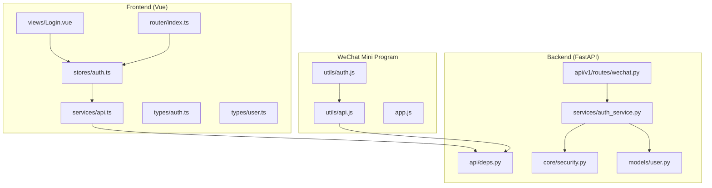
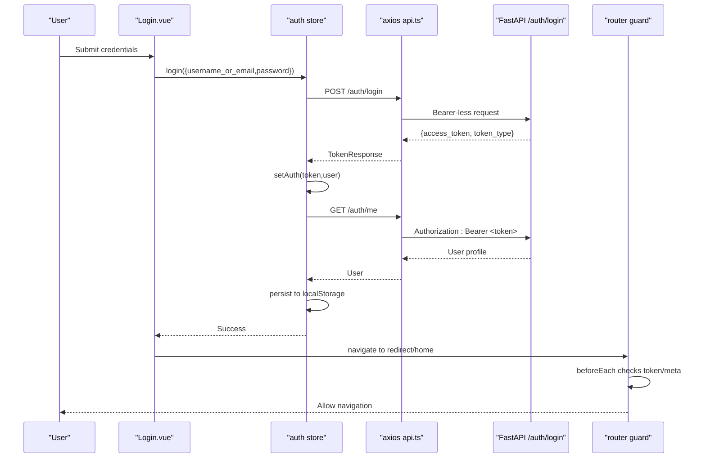
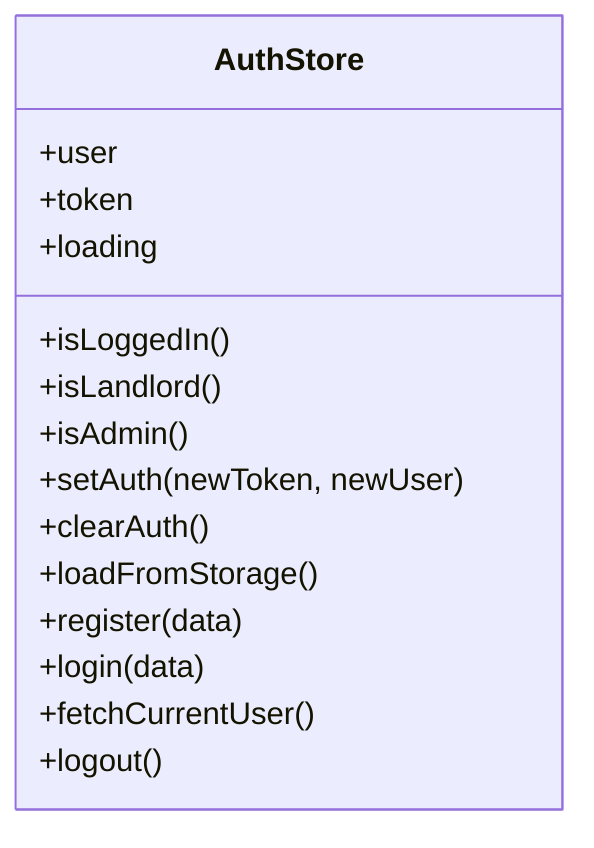
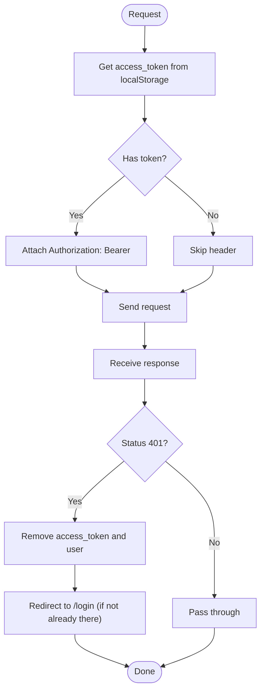
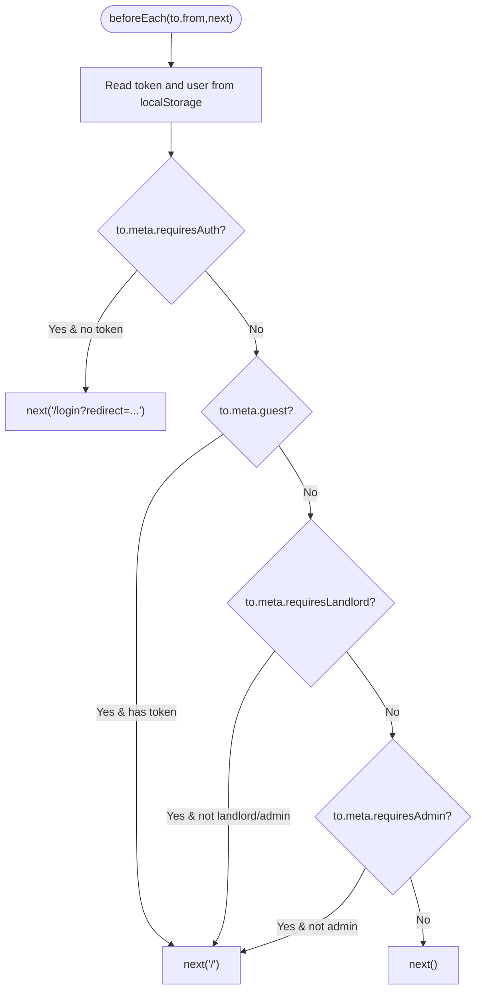
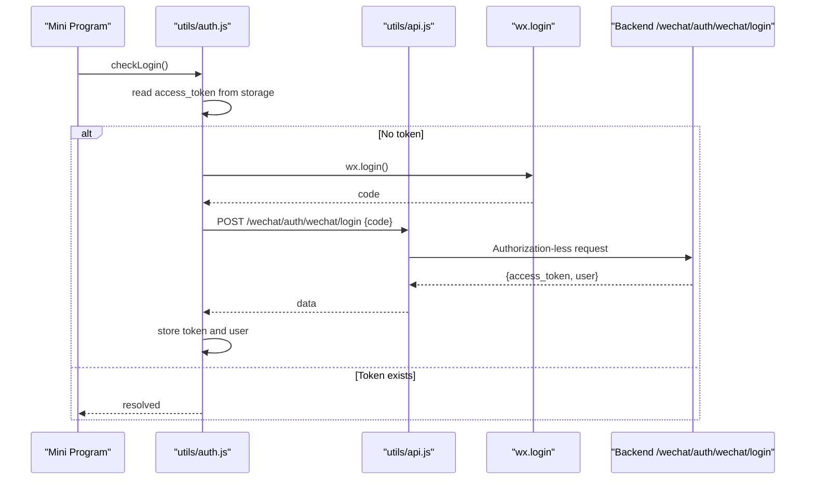
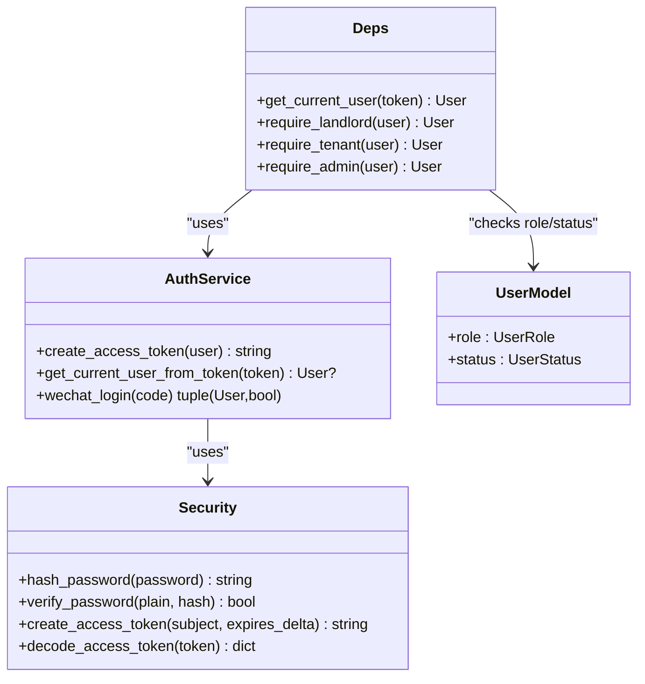
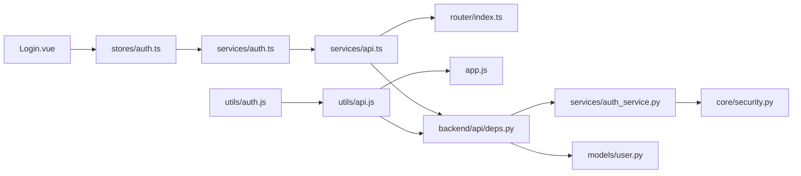

# Authentication & Authorization Flow

<cite>
**Referenced Files in This Document**
- [frontend/src/stores/auth.ts](file://frontend/src/stores/auth.ts)
- [frontend/src/services/auth.ts](file://frontend/src/services/auth.ts)
- [frontend/src/services/api.ts](file://frontend/src/services/api.ts)
- [frontend/src/router/index.ts](file://frontend/src/router/index.ts)
- [frontend/src/types/auth.ts](file://frontend/src/types/auth.ts)
- [frontend/src/types/user.ts](file://frontend/src/types/user.ts)
- [frontend/src/views/Login.vue](file://frontend/src/views/Login.vue)
- [frontend/src/views/Register.vue](file://frontend/src/views/Register.vue)
- [wechat-miniprogram/utils/auth.js](file://wechat-miniprogram/utils/auth.js)
- [wechat-miniprogram/utils/api.js](file://wechat-miniprogram/utils/api.js)
- [wechat-miniprogram/app.js](file://wechat-miniprogram/app.js)
- [backend/app/api/v1/routes/wechat.py](file://backend/app/api/v1/routes/wechat.py)
- [backend/app/services/auth_service.py](file://backend/app/services/auth_service.py)
- [backend/app/core/security.py](file://backend/app/core/security.py)
- [backend/app/models/user.py](file://backend/app/models/user.py)
- [backend/app/api/deps.py](file://backend/app/api/deps.py)
</cite>

## Table of Contents
1. Introduction
2. Project Structure
3. Core Components
4. Architecture Overview
5. Detailed Component Analysis
6. Dependency Analysis
7. Performance Considerations
8. Troubleshooting Guide
9. Conclusion

## Introduction
This document explains the complete authentication and authorization flow for the frontend application, including JWT token lifecycle (login/logout, refresh strategy), session persistence, role-based access control (RBAC) with route guards and component-level permissions, API request authorization, WeChat Mini Program integration, cross-platform strategies, and security best practices. It also provides practical examples for protected routes, conditional UI rendering by roles, and graceful error handling.

## Project Structure
The authentication and authorization logic spans multiple layers:
- Frontend Vue app: Pinia store, HTTP client interceptors, router guards, auth views, and type definitions.
- WeChat Mini Program: Local storage-based session, request wrapper, and login utility.
- Backend FastAPI: Token creation/verification, user model and roles, dependency injection for authorization, and WeChat login endpoint.

**Diagram sources**
- [frontend/src/stores/auth.ts:1-101](file://frontend/src/stores/auth.ts#L1-L101)
- [frontend/src/services/api.ts:1-56](file://frontend/src/services/api.ts#L1-L56)
- [frontend/src/router/index.ts:1-212](file://frontend/src/router/index.ts#L1-L212)
- [frontend/src/views/Login.vue:1-204](file://frontend/src/views/Login.vue#L1-L204)
- [frontend/src/types/auth.ts:1-23](file://frontend/src/types/auth.ts#L1-L23)
- [frontend/src/types/user.ts:1-24](file://frontend/src/types/user.ts#L1-L24)
- [wechat-miniprogram/utils/auth.js:1-81](file://wechat-miniprogram/utils/auth.js#L1-L81)
- [wechat-miniprogram/utils/api.js:1-52](file://wechat-miniprogram/utils/api.js#L1-L52)
- [wechat-miniprogram/app.js:1-21](file://wechat-miniprogram/app.js#L1-L21)
- [backend/app/api/deps.py:1-58](file://backend/app/api/deps.py#L1-L58)
- [backend/app/core/security.py:1-34](file://backend/app/core/security.py#L1-L34)
- [backend/app/models/user.py:1-48](file://backend/app/models/user.py#L1-L48)
- [backend/app/services/auth_service.py:1-77](file://backend/app/services/auth_service.py#L1-L77)
- [backend/app/api/v1/routes/wechat.py:1-82](file://backend/app/api/v1/routes/wechat.py#L1-L82)

**Section sources**
- [frontend/src/stores/auth.ts:1-101](file://frontend/src/stores/auth.ts#L1-L101)
- [frontend/src/services/api.ts:1-56](file://frontend/src/services/api.ts#L1-L56)
- [frontend/src/router/index.ts:1-212](file://frontend/src/router/index.ts#L1-L212)
- [wechat-miniprogram/utils/auth.js:1-81](file://wechat-miniprogram/utils/auth.js#L1-L81)
- [wechat-miniprogram/utils/api.js:1-52](file://wechat-miniprogram/utils/api.js#L1-L52)
- [wechat-miniprogram/app.js:1-21](file://wechat-miniprogram/app.js#L1-L21)
- [backend/app/api/deps.py:1-58](file://backend/app/api/deps.py#L1-L58)
- [backend/app/core/security.py:1-34](file://backend/app/core/security.py#L1-L34)
- [backend/app/models/user.py:1-48](file://backend/app/models/user.py#L1-L48)
- [backend/app/services/auth_service.py:1-77](file://backend/app/services/auth_service.py#L1-L77)
- [backend/app/api/v1/routes/wechat.py:1-82](file://backend/app/api/v1/routes/wechat.py#L1-L82)

## Core Components
- Auth Store (Pinia): Manages token and user state, persists to localStorage, exposes computed flags for roles, and orchestrates login/register/logout flows.
- HTTP Client Interceptors: Automatically attach Bearer tokens to requests and handle 401 responses by clearing session and redirecting to login.
- Router Guards: Enforce requiresAuth, guest-only, requiresLandlord, and requiresAdmin constraints before navigation.
- Auth Views: Login and Register forms that call the store methods and handle success/error feedback.
- WeChat Mini Program Auth: Uses wx.login code exchange to obtain a JWT, stores it locally, and attaches it to subsequent requests.
- Backend Security: Creates/decodes JWTs, verifies passwords, and provides dependency-injected current user and role requirements.

Key responsibilities:
- Session persistence across page reloads via localStorage (web) or wx storage (Mini Program).
- Centralized token attachment and error handling at the HTTP layer.
- Declarative route protection using meta fields.
- Role checks both on the frontend (UI gating) and backend (API enforcement).

**Section sources**
- [frontend/src/stores/auth.ts:1-101](file://frontend/src/stores/auth.ts#L1-L101)
- [frontend/src/services/api.ts:1-56](file://frontend/src/services/api.ts#L1-L56)
- [frontend/src/router/index.ts:1-212](file://frontend/src/router/index.ts#L1-L212)
- [frontend/src/views/Login.vue:1-204](file://frontend/src/views/Login.vue#L1-L204)
- [frontend/src/views/Register.vue:1-131](file://frontend/src/views/Register.vue#L1-L131)
- [wechat-miniprogram/utils/auth.js:1-81](file://wechat-miniprogram/utils/auth.js#L1-L81)
- [wechat-miniprogram/utils/api.js:1-52](file://wechat-miniprogram/utils/api.js#L1-L52)
- [backend/app/core/security.py:1-34](file://backend/app/core/security.py#L1-L34)
- [backend/app/api/deps.py:1-58](file://backend/app/api/deps.py#L1-L58)

## Architecture Overview
End-to-end authentication sequence for web login and API authorization:

**Diagram sources**
- [frontend/src/views/Login.vue:88-104](file://frontend/src/views/Login.vue#L88-L104)
- [frontend/src/stores/auth.ts:54-66](file://frontend/src/stores/auth.ts#L54-L66)
- [frontend/src/services/auth.ts:10-17](file://frontend/src/services/auth.ts#L10-L17)
- [frontend/src/services/api.ts:12-22](file://frontend/src/services/api.ts#L12-L22)
- [frontend/src/router/index.ts:182-209](file://frontend/src/router/index.ts#L182-L209)

## Detailed Component Analysis

### Web Auth Store (Pinia)
Responsibilities:
- State: token, user, loading.
- Persistence: loadFromStorage/setAuth/clearAuth using localStorage keys access_token and user.
- Flows: register, login (fetches profile after login), fetchCurrentUser, logout.
- Computed flags: isLoggedIn, isLandlord, isAdmin based on user.role.

Security notes:
- Tokens are stored in localStorage; consider HttpOnly cookies for enhanced security.
- No automatic token refresh is implemented; expired tokens result in 401 handling.

**Diagram sources**
- [frontend/src/stores/auth.ts:8-100](file://frontend/src/stores/auth.ts#L8-L100)

**Section sources**
- [frontend/src/stores/auth.ts:1-101](file://frontend/src/stores/auth.ts#L1-L101)
- [frontend/src/types/user.ts:1-24](file://frontend/src/types/user.ts#L1-L24)

### HTTP Client Interceptors (Axios)
Responsibilities:
- Request interceptor: Attach Authorization header if access_token exists.
- Response interceptor: On 401, clear session and redirect to login (except when already on login page); display error messages from response detail.

**Diagram sources**
- [frontend/src/services/api.ts:12-54](file://frontend/src/services/api.ts#L12-L54)

**Section sources**
- [frontend/src/services/api.ts:1-56](file://frontend/src/services/api.ts#L1-L56)

### Route Guards and RBAC
Responsibilities:
- Requires authentication: routes with meta.requiresAuth redirect to login if no token.
- Guest-only: routes with meta.guest redirect to home if token present.
- Role-based: meta.requiresLandlord and meta.requiresAdmin enforce roles by reading user from localStorage.

**Diagram sources**
- [frontend/src/router/index.ts:182-209](file://frontend/src/router/index.ts#L182-L209)

**Section sources**
- [frontend/src/router/index.ts:1-212](file://frontend/src/router/index.ts#L1-L212)

### Auth Views (Login and Register)
- Login form validates inputs, calls store.login, shows success, and navigates to redirect or home.
- Register form validates inputs, calls store.register, shows success, and redirects to login.

Best practices demonstrated:
- Use Element Plus validation rules.
- Display user-friendly messages via ElMessage.
- Avoid double-handling errors since the HTTP interceptor already surfaces details.

**Section sources**
- [frontend/src/views/Login.vue:88-113](file://frontend/src/views/Login.vue#L88-L113)
- [frontend/src/views/Register.vue:85-114](file://frontend/src/views/Register.vue#L85-L114)

### WeChat Mini Program Authentication
Flow:
- On launch, app checks global login status.
- utils/auth.checkLogin reads local token; if missing, performs wx.login and exchanges code for JWT via backend.
- utils/api attaches Authorization header automatically and handles 401 by clearing session and rejecting with a friendly message.

**Diagram sources**
- [wechat-miniprogram/utils/auth.js:9-53](file://wechat-miniprogram/utils/auth.js#L9-L53)
- [wechat-miniprogram/utils/api.js:4-41](file://wechat-miniprogram/utils/api.js#L4-L41)
- [wechat-miniprogram/app.js:1-21](file://wechat-miniprogram/app.js#L1-L21)
- [backend/app/api/v1/routes/wechat.py:19-38](file://backend/app/api/v1/routes/wechat.py#L19-L38)

**Section sources**
- [wechat-miniprogram/utils/auth.js:1-81](file://wechat-miniprogram/utils/auth.js#L1-L81)
- [wechat-miniprogram/utils/api.js:1-52](file://wechat-miniprogram/utils/api.js#L1-L52)
- [wechat-miniprogram/app.js:1-21](file://wechat-miniprogram/app.js#L1-L21)
- [backend/app/api/v1/routes/wechat.py:1-82](file://backend/app/api/v1/routes/wechat.py#L1-L82)

### Backend Security and Dependencies
- Token creation/decoding uses HS algorithm and secret key from settings.
- Password hashing/verification via bcrypt-compatible context.
- get_current_user dependency decodes token and returns active user; require_* dependencies enforce roles.

**Diagram sources**
- [backend/app/services/auth_service.py:14-77](file://backend/app/services/auth_service.py#L14-L77)
- [backend/app/core/security.py:12-34](file://backend/app/core/security.py#L12-L34)
- [backend/app/api/deps.py:19-57](file://backend/app/api/deps.py#L19-L57)
- [backend/app/models/user.py:11-42](file://backend/app/models/user.py#L11-L42)

**Section sources**
- [backend/app/core/security.py:1-34](file://backend/app/core/security.py#L1-L34)
- [backend/app/services/auth_service.py:1-77](file://backend/app/services/auth_service.py#L1-L77)
- [backend/app/api/deps.py:1-58](file://backend/app/api/deps.py#L1-L58)
- [backend/app/models/user.py:1-48](file://backend/app/models/user.py#L1-L48)

## Dependency Analysis
- Frontend auth store depends on services/auth and types/user.
- Services/auth depends on services/api which centralizes headers and error handling.
- Router guards depend on localStorage state and route meta.
- Mini Program auth depends on utils/api and app globalData.
- Backend endpoints depend on deps.get_current_user and services.auth_service.

**Diagram sources**
- [frontend/src/views/Login.vue:1-204](file://frontend/src/views/Login.vue#L1-L204)
- [frontend/src/stores/auth.ts:1-101](file://frontend/src/stores/auth.ts#L1-L101)
- [frontend/src/services/auth.ts:1-22](file://frontend/src/services/auth.ts#L1-L22)
- [frontend/src/services/api.ts:1-56](file://frontend/src/services/api.ts#L1-L56)
- [frontend/src/router/index.ts:1-212](file://frontend/src/router/index.ts#L1-L212)
- [wechat-miniprogram/utils/auth.js:1-81](file://wechat-miniprogram/utils/auth.js#L1-L81)
- [wechat-miniprogram/utils/api.js:1-52](file://wechat-miniprogram/utils/api.js#L1-L52)
- [wechat-miniprogram/app.js:1-21](file://wechat-miniprogram/app.js#L1-L21)
- [backend/app/api/deps.py:1-58](file://backend/app/api/deps.py#L1-L58)
- [backend/app/services/auth_service.py:1-77](file://backend/app/services/auth_service.py#L1-L77)
- [backend/app/core/security.py:1-34](file://backend/app/core/security.py#L1-L34)
- [backend/app/models/user.py:1-48](file://backend/app/models/user.py#L1-L48)

**Section sources**
- [frontend/src/stores/auth.ts:1-101](file://frontend/src/stores/auth.ts#L1-L101)
- [frontend/src/services/api.ts:1-56](file://frontend/src/services/api.ts#L1-L56)
- [frontend/src/router/index.ts:1-212](file://frontend/src/router/index.ts#L1-L212)
- [wechat-miniprogram/utils/auth.js:1-81](file://wechat-miniprogram/utils/auth.js#L1-L81)
- [wechat-miniprogram/utils/api.js:1-52](file://wechat-miniprogram/utils/api.js#L1-L52)
- [backend/app/api/deps.py:1-58](file://backend/app/api/deps.py#L1-L58)
- [backend/app/services/auth_service.py:1-77](file://backend/app/services/auth_service.py#L1-L77)
- [backend/app/core/security.py:1-34](file://backend/app/core/security.py#L1-L34)
- [backend/app/models/user.py:1-48](file://backend/app/models/user.py#L1-L48)

## Performance Considerations
- Token attachment is O(1) per request via interceptor; negligible overhead.
- Profile fetch after login adds one extra request; consider caching user profile in the store to avoid repeated calls.
- Router guards perform minimal checks; ensure user object parsing is guarded against malformed storage (already handled).
- For high traffic, consider short-lived access tokens with refresh tokens to reduce re-authentication costs while maintaining security.

[No sources needed since this section provides general guidance]

## Troubleshooting Guide
Common issues and resolutions:
- 401 Unauthorized: The HTTP interceptor clears session and redirects to login. Ensure the token is present and not expired. If you see repeated redirects, verify backend token verification and secret configuration.
- Invalid JSON in user storage: The store’s loadFromStorage catches parse errors and clears auth to recover gracefully.
- Missing role metadata: Ensure routes use correct meta flags (requiresAuth, requiresLandlord, requiresAdmin) and that user.role matches backend enums.
- WeChat login failures: Confirm wx.login succeeds and the backend endpoint is reachable; check network and CORS settings.

Operational tips:
- Always validate server responses and surface user-friendly messages.
- Keep error paths consistent between web and Mini Program clients.

**Section sources**
- [frontend/src/services/api.ts:24-54](file://frontend/src/services/api.ts#L24-L54)
- [frontend/src/stores/auth.ts:31-42](file://frontend/src/stores/auth.ts#L31-L42)
- [wechat-miniprogram/utils/api.js:19-41](file://wechat-miniprogram/utils/api.js#L19-L41)

## Conclusion
The system implements a cohesive authentication and authorization flow:
- Web: Pinia store manages JWT and user state, axios interceptors attach tokens and handle 401, router guards enforce access, and views orchestrate UX.
- Mini Program: Local storage-backed session with wx.login code exchange and centralized request wrapper.
- Backend: Secure token issuance/verification, password hashing, and dependency-injected role checks.

Recommendations for enhancement:
- Implement token refresh with short-lived access tokens and secure refresh tokens.
- Prefer HttpOnly cookies over localStorage for sensitive tokens where feasible.
- Add explicit CSRF protections for cookie-based sessions.
- Introduce component-level directives/composables for fine-grained UI permissions.

[No sources needed since this section summarizes without analyzing specific files]