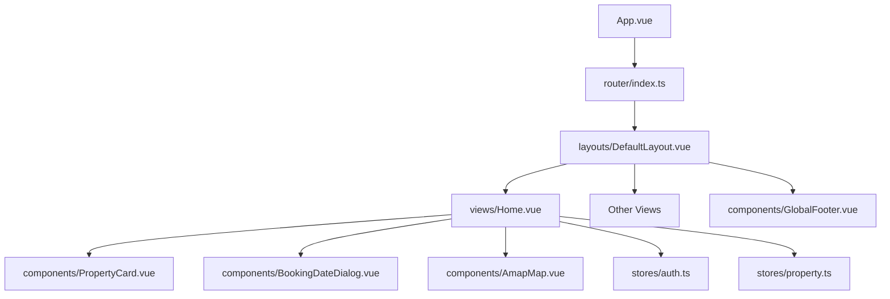
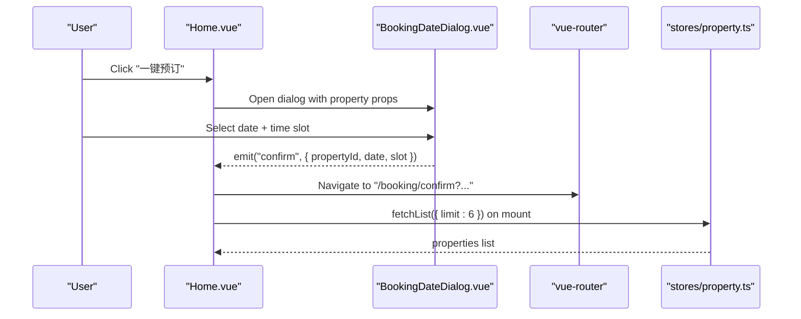
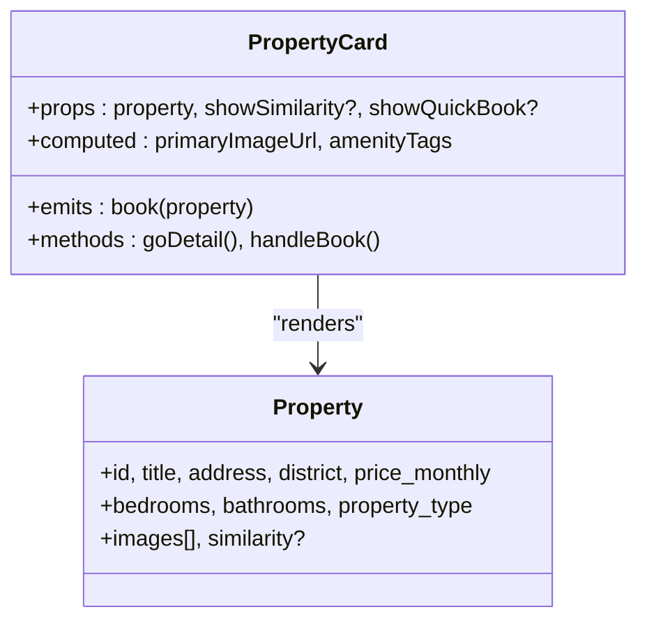
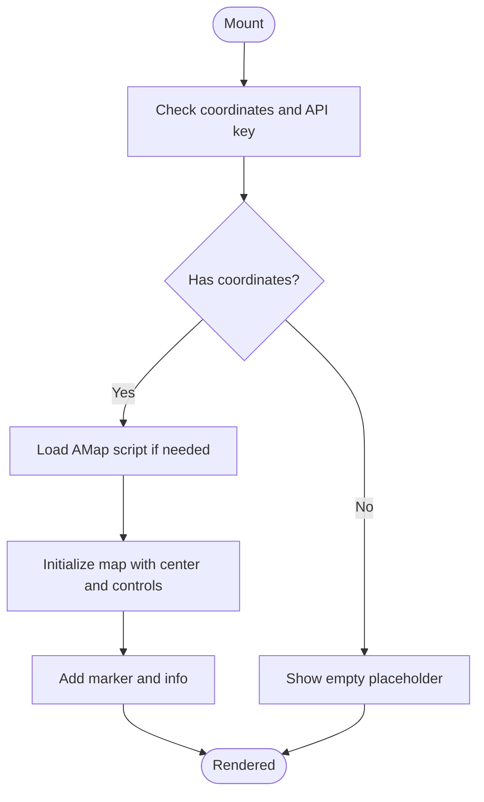
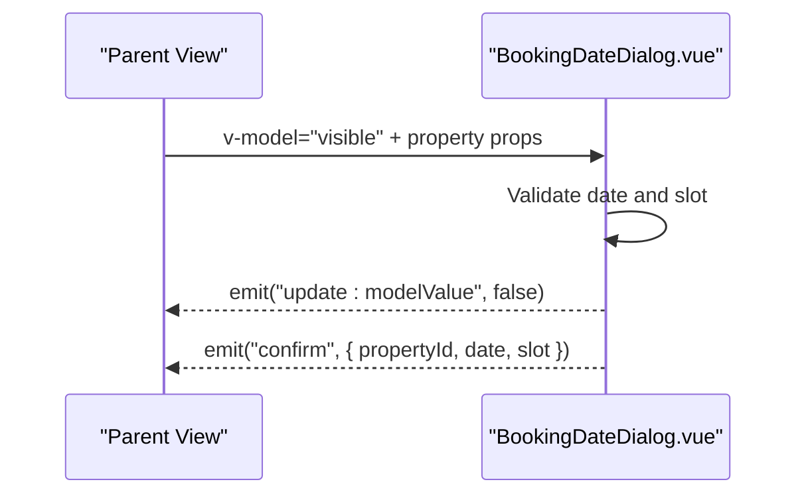
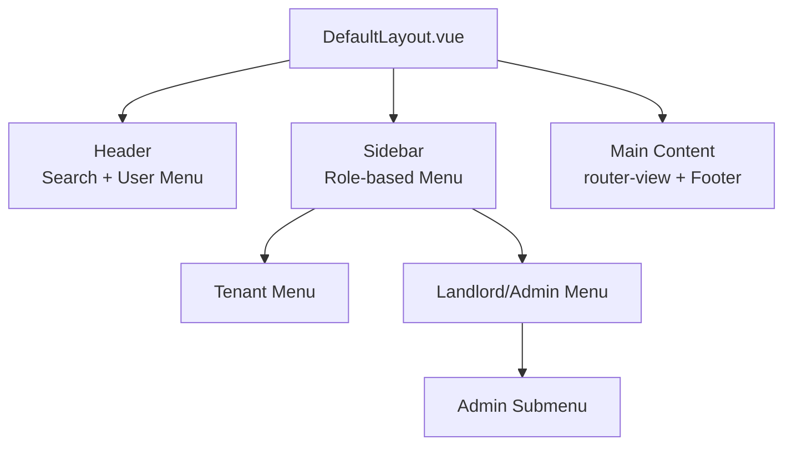
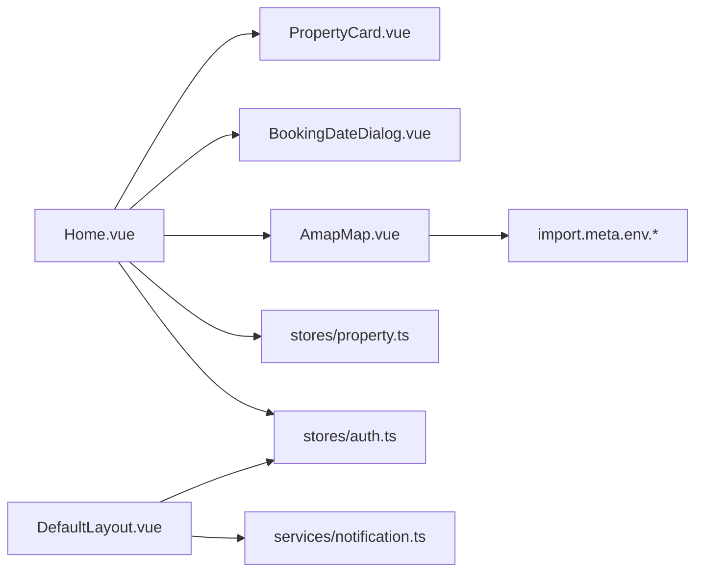

# Component Architecture & Reusable Components

<cite>
**Referenced Files in This Document**
- [App.vue](file://frontend/src/App.vue)
- [DefaultLayout.vue](file://frontend/src/layouts/DefaultLayout.vue)
- [PropertyCard.vue](file://frontend/src/components/PropertyCard.vue)
- [AmapMap.vue](file://frontend/src/components/AmapMap.vue)
- [BookingDateDialog.vue](file://frontend/src/components/BookingDateDialog.vue)
- [GlobalFooter.vue](file://frontend/src/components/GlobalFooter.vue)
- [Home.vue](file://frontend/src/views/Home.vue)
- [router/index.ts](file://frontend/src/router/index.ts)
- [stores/auth.ts](file://frontend/src/stores/auth.ts)
- [stores/property.ts](file://frontend/src/stores/property.ts)
- [types/property.ts](file://frontend/src/types/property.ts)
- [PropertyCard.test.ts](file://frontend/src/__tests__/PropertyCard.test.ts)
</cite>

## Table of Contents
1. [Introduction](#introduction)
2. [Project Structure](#project-structure)
3. [Core Components](#core-components)
4. [Architecture Overview](#architecture-overview)
5. [Detailed Component Analysis](#detailed-component-analysis)
6. [Dependency Analysis](#dependency-analysis)
7. [Performance Considerations](#performance-considerations)
8. [Troubleshooting Guide](#troubleshooting-guide)
9. [Conclusion](#conclusion)
10. [Appendices](#appendices)

## Introduction
This document explains the Vue 3 component architecture and reusable component system for the rental housing platform. It covers:
- Component hierarchy and composition patterns
- Prop/event communication strategies
- Detailed API documentation for PropertyCard, AmapMap, and BookingDateDialog
- Layout system with DefaultLayout and nested layouts for different user roles
- Lifecycle management, performance optimization techniques, and testing strategies
- Guidelines for creating new components, styling approaches, accessibility compliance
- State management, error boundaries, and loading states

## Project Structure
The frontend is organized by feature and layer:
- src/components: Reusable UI components
- src/layouts: Page-level layout wrappers
- src/views: Route-level pages that compose components
- src/stores: Pinia stores for state management
- src/services: API clients
- src/types: Shared TypeScript types
- src/router: Vue Router configuration and guards
- App.vue: Root application shell and global theme variables

**Diagram sources**
- [App.vue:1-10](file://frontend/src/App.vue#L1-L10)
- [router/index.ts:1-20](file://frontend/src/router/index.ts#L1-L20)
- [DefaultLayout.vue:1-20](file://frontend/src/layouts/DefaultLayout.vue#L1-L20)
- [Home.vue:150-165](file://frontend/src/views/Home.vue#L150-L165)
- [PropertyCard.vue:70-85](file://frontend/src/components/PropertyCard.vue#L70-L85)
- [AmapMap.vue:29-50](file://frontend/src/components/AmapMap.vue#L29-L50)
- [BookingDateDialog.vue:71-85](file://frontend/src/components/BookingDateDialog.vue#L71-L85)
- [GlobalFooter.vue:1-10](file://frontend/src/components/GlobalFooter.vue#L1-L10)
- [stores/auth.ts:1-20](file://frontend/src/stores/auth.ts#L1-L20)
- [stores/property.ts:1-20](file://frontend/src/stores/property.ts#L1-L20)

**Section sources**
- [App.vue:1-10](file://frontend/src/App.vue#L1-L10)
- [router/index.ts:1-20](file://frontend/src/router/index.ts#L1-L20)

## Core Components
This section documents the three primary reusable components used across views.

### PropertyCard
Purpose: Display a property listing card with image, tags, address, price, and optional quick booking action.

Props:
- property: Property | PropertySearchResult (required)
- showSimilarity?: boolean (optional)
- showQuickBook?: boolean (optional)

Events:
- book(property): emitted when “一键预订” is clicked

Computed behavior:
- Primary image URL resolution from images array
- Smart amenity tags inferred from district, type, bedrooms, price, and description keywords

Navigation:
- Clicking the card navigates to /property/:id via vue-router

Styling:
- Uses scoped CSS with design tokens from :root variables

Usage example path:
- [Home.vue:96-145](file://frontend/src/views/Home.vue#L96-L145)

**Section sources**
- [PropertyCard.vue:70-163](file://frontend/src/components/PropertyCard.vue#L70-L163)
- [PropertyCard.vue:165-318](file://frontend/src/components/PropertyCard.vue#L165-L318)
- [types/property.ts:1-95](file://frontend/src/types/property.ts#L1-L95)
- [Home.vue:96-145](file://frontend/src/views/Home.vue#L96-L145)

### AmapMap
Purpose: Render an interactive map using AMap with fallbacks for missing coordinates or missing API key.

Props:
- latitude: number | null | undefined
- longitude: number | null | undefined
- address?: string | null
- height?: string (default "360px")
- zoom?: number (default 15)

Behavior:
- Dynamically loads AMap script if not present
- Renders empty placeholders when coordinates are missing or API key is not configured
- Adds scale and toolbar controls and a marker at the given position
- Provides an external link to open the location in AMap web app

Lifecycle:
- Watches coordinate/key changes and reinitializes map
- Cleans up map instance on unmount

Styling:
- Scoped CSS with responsive container and empty-state styles

Usage example path:
- [Home.vue:150-165](file://frontend/src/views/Home.vue#L150-L165)

**Section sources**
- [AmapMap.vue:29-140](file://frontend/src/components/AmapMap.vue#L29-L140)
- [AmapMap.vue:142-198](file://frontend/src/components/AmapMap.vue#L142-L198)

### BookingDateDialog
Purpose: Collect a future date and time slot for a property viewing, then emit confirmation data.

Props:
- modelValue: boolean (v-model binding)
- propertyId: number
- propertyTitle?: string
- propertyPrice?: number

Events:
- update:modelValue(v: boolean)
- confirm(data: { propertyId: number; date: string; slot: string })

Behavior:
- v-model binding via computed getter/setter
- Calendar selection logic prevents past dates while allowing month navigation
- Time slots: morning, afternoon, evening
- Emits confirmation after brief simulated loading

Styling:
- Scoped CSS with calendar day highlighting and active slot styles

Usage example path:
- [Home.vue:154-160](file://frontend/src/views/Home.vue#L154-L160)

**Section sources**
- [BookingDateDialog.vue:71-178](file://frontend/src/components/BookingDateDialog.vue#L71-L178)
- [BookingDateDialog.vue:180-305](file://frontend/src/components/BookingDateDialog.vue#L180-L305)
- [Home.vue:154-160](file://frontend/src/views/Home.vue#L154-L160)

## Architecture Overview
The application uses a layered architecture:
- App.vue sets global theme variables and Element Plus overrides
- router/index.ts defines routes and guards, wrapping authenticated routes under DefaultLayout
- DefaultLayout provides header, sidebar, and main content area with role-based menus
- Views compose reusable components and manage local state
- Stores encapsulate shared state and API interactions
- Services abstract HTTP calls

**Diagram sources**
- [Home.vue:139-160](file://frontend/src/views/Home.vue#L139-L160)
- [BookingDateDialog.vue:153-165](file://frontend/src/components/BookingDateDialog.vue#L153-L165)
- [router/index.ts:84-100](file://frontend/src/router/index.ts#L84-L100)
- [stores/property.ts:17-24](file://frontend/src/stores/property.ts#L17-L24)

## Detailed Component Analysis

### PropertyCard Analysis
- Composition pattern: Functional component with <script setup>, typed props and emits
- Data flow: Receives a property object, computes derived values (image URL, amenity tags), navigates and emits events
- Error handling: Graceful fallback for missing images and similarity display
- Performance: Computed properties avoid unnecessary recalculations; DOM updates minimized through conditional rendering

**Diagram sources**
- [PropertyCard.vue:70-163](file://frontend/src/components/PropertyCard.vue#L70-L163)
- [types/property.ts:6-28](file://frontend/src/types/property.ts#L6-L28)

**Section sources**
- [PropertyCard.vue:70-163](file://frontend/src/components/PropertyCard.vue#L70-L163)
- [PropertyCard.vue:165-318](file://frontend/src/components/PropertyCard.vue#L165-L318)
- [types/property.ts:1-95](file://frontend/src/types/property.ts#L1-L95)

### AmapMap Analysis
- Composition pattern: Script setup with dynamic script injection and lifecycle hooks
- Data flow: Props drive initialization; computed values determine visibility and links
- Error handling: Empty states for missing coordinates or missing API key; graceful degradation to external link
- Performance: Lazy load AMap script only once; destroy map instance on unmount to prevent memory leaks

**Diagram sources**
- [AmapMap.vue:66-122](file://frontend/src/components/AmapMap.vue#L66-L122)
- [AmapMap.vue:124-139](file://frontend/src/components/AmapMap.vue#L124-L139)

**Section sources**
- [AmapMap.vue:29-140](file://frontend/src/components/AmapMap.vue#L29-L140)
- [AmapMap.vue:142-198](file://frontend/src/components/AmapMap.vue#L142-L198)

### BookingDateDialog Analysis
- Composition pattern: v-model dialog with internal state and computed validation
- Data flow: Parent passes property context; child emits confirmation payload
- Error handling: Prevents past date selection; disables confirm until both date and slot selected
- Performance: Minimal reactivity; computed canConfirm avoids unnecessary renders

**Diagram sources**
- [BookingDateDialog.vue:86-89](file://frontend/src/components/BookingDateDialog.vue#L86-L89)
- [BookingDateDialog.vue:125-165](file://frontend/src/components/BookingDateDialog.vue#L125-L165)

**Section sources**
- [BookingDateDialog.vue:71-178](file://frontend/src/components/BookingDateDialog.vue#L71-L178)
- [BookingDateDialog.vue:180-305](file://frontend/src/components/BookingDateDialog.vue#L180-L305)

### Layout System: DefaultLayout and Nested Roles
- DefaultLayout wraps all authenticated routes and provides:
  - Header with search bar, notifications badge, and user dropdown
  - Sidebar menu with role-based sections (tenant, landlord/admin)
  - Main content area with router-view and footer
- Role-based menus:
  - Tenant: AI Search, Search, Map, My Bookings, Profile
  - Landlord/Admin: Workspace, Manage Properties, Create Property, Booking Management, Notifications
  - Admin-only: System Management submenu

**Diagram sources**
- [DefaultLayout.vue:1-169](file://frontend/src/layouts/DefaultLayout.vue#L1-L169)
- [DefaultLayout.vue:171-225](file://frontend/src/layouts/DefaultLayout.vue#L171-L225)

**Section sources**
- [DefaultLayout.vue:1-169](file://frontend/src/layouts/DefaultLayout.vue#L1-L169)
- [DefaultLayout.vue:171-225](file://frontend/src/layouts/DefaultLayout.vue#L171-L225)
- [router/index.ts:182-209](file://frontend/src/router/index.ts#L182-L209)

## Dependency Analysis
Component dependencies and relationships:
- Home.vue composes PropertyCard and BookingDateDialog
- DefaultLayout depends on auth store and notification service
- AmapMap depends on environment variables for API keys
- Stores depend on services and types

**Diagram sources**
- [Home.vue:164-176](file://frontend/src/views/Home.vue#L164-L176)
- [DefaultLayout.vue:171-180](file://frontend/src/layouts/DefaultLayout.vue#L171-L180)
- [AmapMap.vue:54-55](file://frontend/src/components/AmapMap.vue#L54-L55)

**Section sources**
- [Home.vue:164-176](file://frontend/src/views/Home.vue#L164-L176)
- [DefaultLayout.vue:171-180](file://frontend/src/layouts/DefaultLayout.vue#L171-L180)
- [AmapMap.vue:54-55](file://frontend/src/components/AmapMap.vue#L54-L55)

## Performance Considerations
- Use computed properties for derived data (e.g., amenity tags, image URLs) to minimize recomputation
- Lazy-load heavy third-party scripts like AMap only when needed
- Destroy external instances (map) on component unmount to free resources
- Keep component templates minimal and use conditional rendering to reduce DOM churn
- Prefer v-for keys based on stable IDs to optimize list diffing
- Debounce or throttle expensive operations (e.g., search input) if added later

[No sources needed since this section provides general guidance]

## Troubleshooting Guide
Common issues and resolutions:
- AMap not displaying:
  - Ensure VITE_AMAP_KEY and optionally VITE_AMAP_SECURITY_JS_CODE are set
  - Verify network access to webapi.amap.com
  - Check console for script load errors
- Booking dialog not closing:
  - Confirm parent handles update:modelValue correctly
  - Ensure confirm event is handled and dialog visibility toggled
- PropertyCard navigation not working:
  - Verify route exists and router.push is mocked in tests
  - Check that property.id is defined

**Section sources**
- [AmapMap.vue:66-87](file://frontend/src/components/AmapMap.vue#L66-L87)
- [BookingDateDialog.vue:86-89](file://frontend/src/components/BookingDateDialog.vue#L86-L89)
- [PropertyCard.vue:156-162](file://frontend/src/components/PropertyCard.vue#L156-L162)

## Conclusion
The Vue 3 component architecture emphasizes clear separation of concerns, reusable UI primitives, and robust composition patterns. PropertyCard, AmapMap, and BookingDateDialog provide well-defined APIs with typed props and events. The layout system supports role-based navigation, while stores centralize state and side effects. Following the guidelines here will help maintain consistency, performance, and accessibility across the application.

[No sources needed since this section summarizes without analyzing specific files]

## Appendices

### Testing Strategies
- Unit test PropertyCard with @vue/test-utils and ElementPlus plugin
- Mock vue-router to assert navigation behavior
- Assert rendered text for title, price, district, bedroom/bathroom count
- Test conditional rendering for similarity and image placeholders

Example paths:
- [PropertyCard.test.ts:1-80](file://frontend/src/__tests__/PropertyCard.test.ts#L1-L80)

**Section sources**
- [PropertyCard.test.ts:1-80](file://frontend/src/__tests__/PropertyCard.test.ts#L1-L80)

### Styling Approaches
- Use scoped styles within components to avoid leakage
- Centralize design tokens in App.vue :root variables
- Override Element Plus defaults globally for consistent theming

**Section sources**
- [App.vue:8-47](file://frontend/src/App.vue#L8-L47)
- [PropertyCard.vue:165-318](file://frontend/src/components/PropertyCard.vue#L165-L318)

### Accessibility Compliance
- Provide alt attributes for images
- Ensure keyboard navigability for interactive elements
- Use semantic HTML and ARIA labels where necessary
- Maintain sufficient color contrast and focus indicators

[No sources needed since this section provides general guidance]

### Component Creation Guidelines
- Use <script setup lang="ts"> with typed props and emits
- Keep responsibilities focused; prefer composition over inheritance
- Expose clear prop interfaces and emit contracts
- Handle edge cases gracefully (missing data, network failures)
- Include unit tests for critical behaviors

[No sources needed since this section provides general guidance]

### State Management Patterns
- Use Pinia stores for shared state (auth, property)
- Encapsulate API calls in services and expose methods in stores
- Persist token and user info in localStorage for session continuity

**Section sources**
- [stores/auth.ts:1-101](file://frontend/src/stores/auth.ts#L1-L101)
- [stores/property.ts:1-136](file://frontend/src/stores/property.ts#L1-L136)

### Error Boundaries and Loading States
- Implement loading flags in stores and bind to v-loading or skeleton UI
- For global error boundaries, consider wrapping router-view with a boundary component
- Provide user-friendly messages for failed requests

**Section sources**
- [stores/property.ts:17-24](file://frontend/src/stores/property.ts#L17-L24)
- [Home.vue:91-94](file://frontend/src/views/Home.vue#L91-L94)