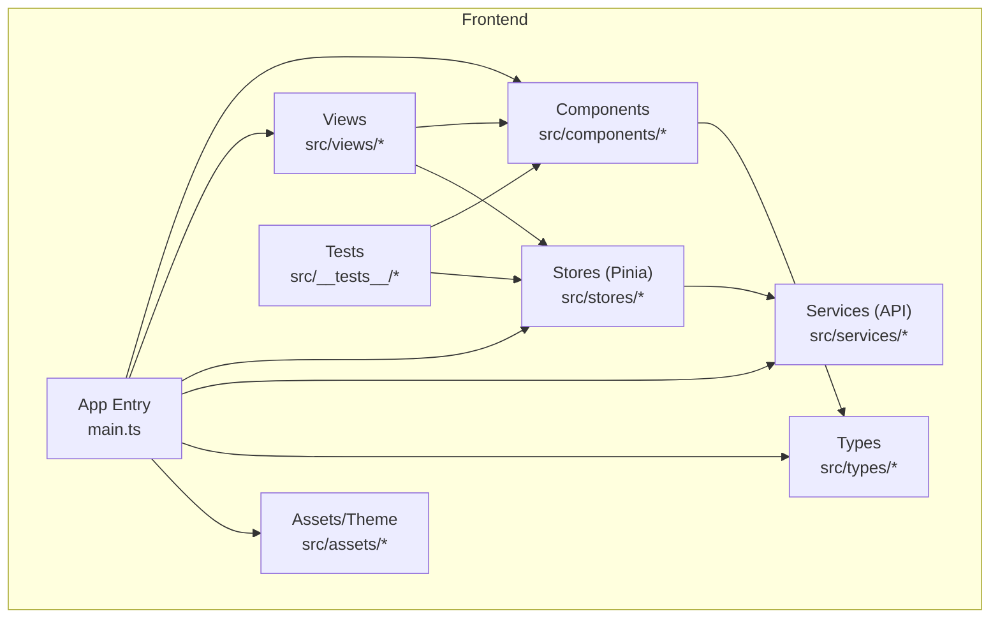
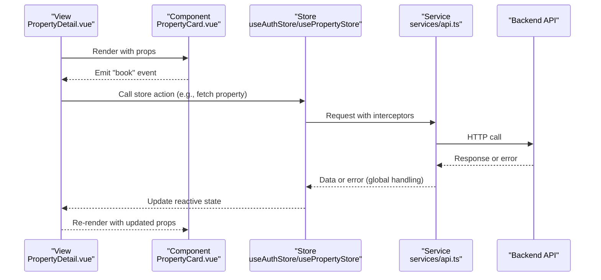
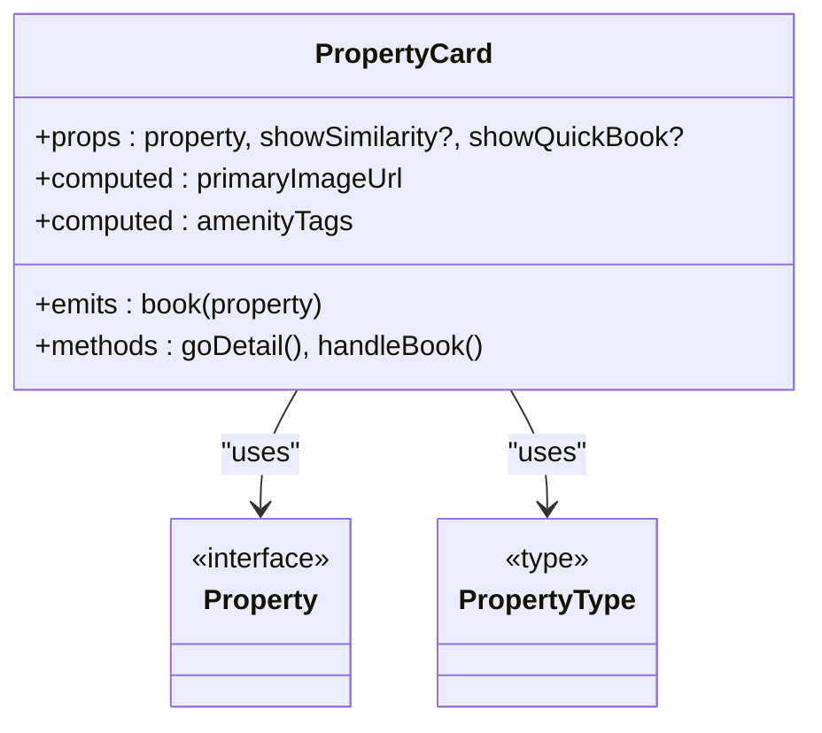
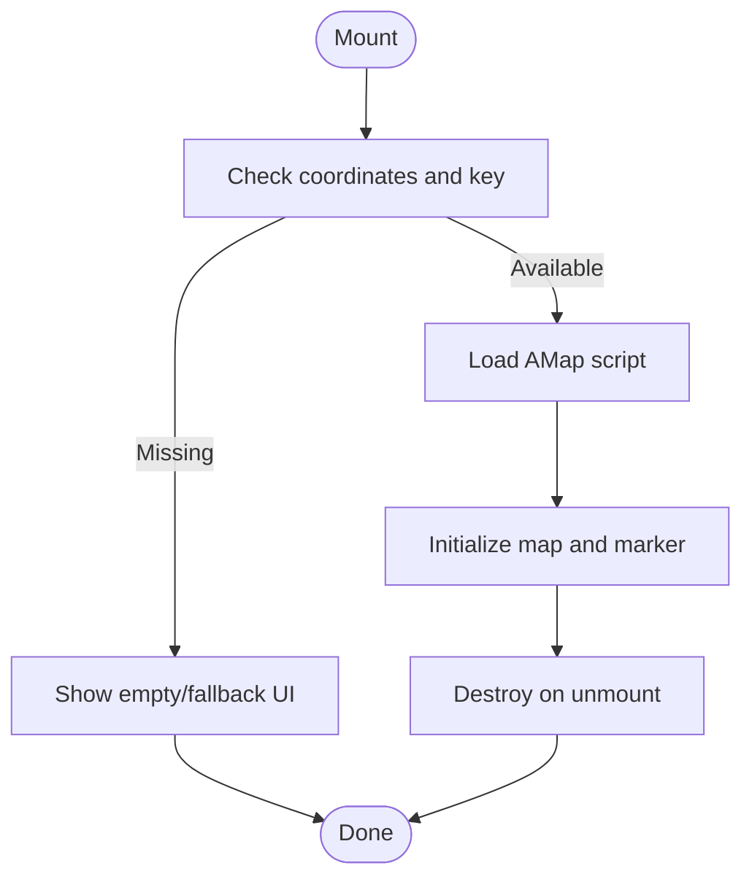
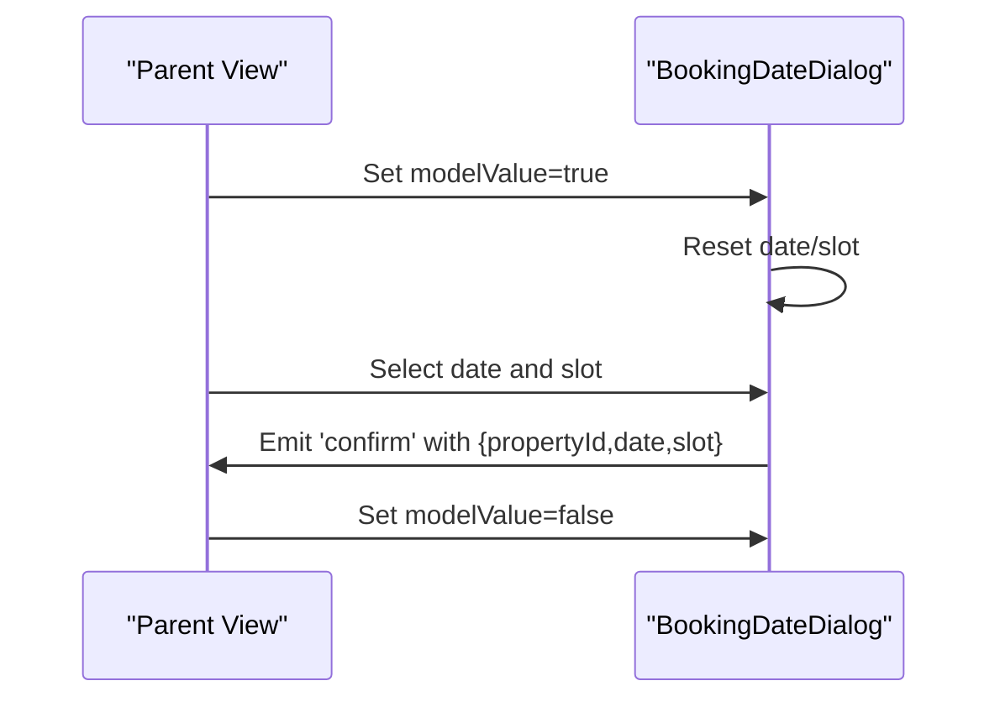
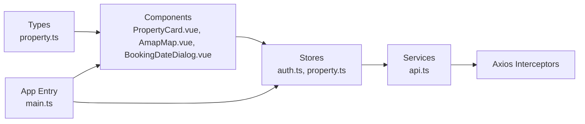

# Component Development Patterns & Guidelines

<cite>
**Referenced Files in This Document**
- [PropertyCard.vue](file://frontend/src/components/PropertyCard.vue)
- [AmapMap.vue](file://frontend/src/components/AmapMap.vue)
- [BookingDateDialog.vue](file://frontend/src/components/BookingDateDialog.vue)
- [GlobalFooter.vue](file://frontend/src/components/GlobalFooter.vue)
- [auth.ts](file://frontend/src/stores/auth.ts)
- [property.ts](file://frontend/src/stores/property.ts)
- [api.ts](file://frontend/src/services/api.ts)
- [main.ts](file://frontend/src/main.ts)
- [PropertyDetail.vue](file://frontend/src/views/PropertyDetail.vue)
- [uhomes-theme.css](file://frontend/src/assets/uhomes-theme.css)
- [property.ts (types)](file://frontend/src/types/property.ts)
- [PropertyCard.test.ts](file://frontend/src/__tests__/PropertyCard.test.ts)
- [auth.test.ts](file://frontend/src/__tests__//stores/auth.test.ts)
</cite>

## Table of Contents
1. Introduction
2. Project Structure
3. Core Components
4. Architecture Overview
5. Detailed Component Analysis
6. Dependency Analysis
7. Performance Considerations
8. Accessibility Guidelines
9. Testing Patterns
10. Documentation Standards and Naming Conventions
11. Conclusion

## Introduction
This document provides comprehensive guidelines for developing new Vue 3 components that follow the established patterns in this project. It covers component structure, script setup conventions, prop definitions with TypeScript, event emission, slot usage, state management with Pinia, error handling, loading states, testing, performance optimization, accessibility, documentation standards, naming conventions, and code organization.

## Project Structure
The frontend is organized by feature and layer:
- Components under src/components
- Views under src/views
- Stores under src/stores
- Services under src/services
- Types under src/types
- Assets under src/assets
- Tests under src/__tests__

[No sources needed since this diagram shows conceptual workflow, not actual code structure]

## Core Components
Key reusable components demonstrate the project’s patterns:
- PropertyCard: Displays property data with computed image URL and amenity tags; emits events for actions like booking.
- AmapMap: Integrates external map library with dynamic script loading, lifecycle management, and fallbacks.
- BookingDateDialog: Encapsulates date/time selection with v-model binding and validation logic.
- GlobalFooter: Static layout component using scoped styles and design tokens.

These components illustrate:
- <script setup lang="ts"> with defineProps and defineEmits
- Computed values for derived state
- Scoped CSS with design tokens
- Event-driven communication with parent views

**Section sources**
- [PropertyCard.vue:1-318](file://frontend/src/components/PropertyCard.vue#L1-L318)
- [AmapMap.vue:1-198](file://frontend/src/components/AmapMap.vue#L1-L198)
- [BookingDateDialog.vue:1-305](file://frontend/src/components/BookingDateDialog.vue#L1-L305)
- [GlobalFooter.vue:1-79](file://frontend/src/components/GlobalFooter.vue#L1-L79)

## Architecture Overview
High-level architecture for a typical view-to-component flow:
- View composes components and manages store interactions
- Components receive props and emit events
- Stores encapsulate state and API calls via services
- Services centralize HTTP requests and global error handling

**Diagram sources**
- [PropertyDetail.vue:1-200](file://frontend/src/views/PropertyDetail.vue#L1-L200)
- [PropertyCard.vue:1-318](file://frontend/src/components/PropertyCard.vue#L1-L318)
- [auth.ts:1-101](file://frontend/src/stores/auth.ts#L1-L101)
- [property.ts:1-136](file://frontend/src/stores/property.ts#L1-L136)
- [api.ts:1-56](file://frontend/src/services/api.ts#L1-L56)

**Section sources**
- [main.ts:1-22](file://frontend/src/main.ts#L1-L22)
- [api.ts:1-56](file://frontend/src/services/api.ts#L1-L56)

## Detailed Component Analysis

### PropertyCard Component
Responsibilities:
- Display property details including title, price, district, amenities, and images
- Compute primary image URL and amenity tags from properties
- Navigate to detail page and emit booking events

Patterns:
- Props defined with TypeScript inline types
- Emits typed with defineEmits generic
- Computed properties for derived UI data
- Router integration for navigation
- Scoped CSS using design tokens

**Diagram sources**
- [PropertyCard.vue:70-163](file://frontend/src/components/PropertyCard.vue#L70-L163)
- [property.ts (types):1-95](file://frontend/src/types/property.ts#L1-L95)

**Section sources**
- [PropertyCard.vue:1-318](file://frontend/src/components/PropertyCard.vue#L1-L318)
- [property.ts (types):1-95](file://frontend/src/types/property.ts#L1-L95)

### AmapMap Component
Responsibilities:
- Dynamically load external map script
- Initialize map instance and marker when coordinates are available
- Provide fallback UI when no coordinates or missing key
- Clean up resources on unmount

Patterns:
- withDefaults for optional props
- Lifecycle hooks: onMounted, onBeforeUnmount
- Watchers for reactive initialization
- External script injection with error handling
- Scoped CSS for container and empty states

**Diagram sources**
- [AmapMap.vue:29-140](file://frontend/src/components/AmapMap.vue#L29-L140)

**Section sources**
- [AmapMap.vue:1-198](file://frontend/src/components/AmapMap.vue#L1-L198)

### BookingDateDialog Component
Responsibilities:
- Manage dialog visibility via v-model binding
- Validate selected date and time slot
- Emit confirmation with structured payload

Patterns:
- v-model implementation with computed getter/setter
- Local refs for internal state
- Validation computed for confirm button enablement
- Watch to reset state on open

**Diagram sources**
- [BookingDateDialog.vue:71-178](file://frontend/src/components/BookingDateDialog.vue#L71-L178)

**Section sources**
- [BookingDateDialog.vue:1-305](file://frontend/src/components/BookingDateDialog.vue#L1-L305)

### GlobalFooter Component
Responsibilities:
- Present static footer content
- Use scoped styles and design tokens

Patterns:
- Minimal script setup
- Semantic HTML structure
- Consistent spacing and typography via CSS variables

**Section sources**
- [GlobalFooter.vue:1-79](file://frontend/src/components/GlobalFooter.vue#L1-L79)

## Dependency Analysis
Key dependencies and relationships:
- Components depend on types for prop contracts
- Stores depend on services for API calls
- Services use axios with interceptors for auth and error handling
- App entry initializes Pinia, router, Element Plus, and icons

**Diagram sources**
- [property.ts (types):1-95](file://frontend/src/types/property.ts#L1-L95)
- [PropertyCard.vue:1-318](file://frontend/src/components/PropertyCard.vue#L1-L318)
- [AmapMap.vue:1-198](file://frontend/src/components/AmapMap.vue#L1-L198)
- [BookingDateDialog.vue:1-305](file://frontend/src/components/BookingDateDialog.vue#L1-L305)
- [auth.ts:1-101](file://frontend/src/stores/auth.ts#L1-L101)
- [property.ts:1-136](file://frontend/src/stores/property.ts#L1-L136)
- [api.ts:1-56](file://frontend/src/services/api.ts#L1-L56)
- [main.ts:1-22](file://frontend/src/main.ts#L1-L22)

**Section sources**
- [main.ts:1-22](file://frontend/src/main.ts#L1-L22)
- [api.ts:1-56](file://frontend/src/services/api.ts#L1-L56)

## Performance Considerations
Guidelines based on existing patterns:
- Prefer computed properties for derived data to avoid unnecessary recalculations
- Use watch with immediate option for side effects tied to props
- Leverage lazy loading for heavy integrations (e.g., dynamic script loading)
- Keep templates minimal and declarative; offload logic to computed/methods
- Avoid deep watchers unless necessary; prefer shallow watchers or specific keys
- Consider v-memo for expensive lists if applicable (not used in current components but recommended for large lists)

Examples in codebase:
- Computed primary image URL and amenity tags in PropertyCard
- Computed address resolution and coordinate checks in AmapMap
- Computed canConfirm in BookingDateDialog

**Section sources**
- [PropertyCard.vue:94-154](file://frontend/src/components/PropertyCard.vue#L94-L154)
- [AmapMap.vue:54-64](file://frontend/src/components/AmapMap.vue#L54-L64)
- [BookingDateDialog.vue:124-126](file://frontend/src/components/BookingDateDialog.vue#L124-L126)

## Accessibility Guidelines
Recommendations aligned with current practices:
- Ensure all interactive elements have appropriate roles and labels
- Use semantic HTML (header, footer, section) where possible
- Provide alt text for images and meaningful titles for links
- Maintain keyboard navigability for custom controls (e.g., calendar days, time slots)
- Use aria attributes for dynamic content updates and dialogs
- Respect focus management within dialogs and modals

Current examples:
- Images include alt attributes
- Links provide descriptive text and target="_blank" with visual indicators
- Dialog uses accessible title and close behavior

**Section sources**
- [PropertyCard.vue:5-14](file://frontend/src/components/PropertyCard.vue#L5-L14)
- [AmapMap.vue:22-25](file://frontend/src/components/AmapMap.vue#L22-L25)
- [BookingDateDialog.vue:2-8](file://frontend/src/components/BookingDateDialog.vue#L2-L8)

## Testing Patterns
Unit tests demonstrate:
- Mounting components with Element Plus plugin
- Mocking external dependencies (router, services)
- Asserting rendered output and user interactions
- Testing store initialization and persistence

Guidelines:
- Use Vitest and @vue/test-utils
- Mock third-party modules at module level
- Create helper functions to build wrappers with consistent props
- Test both happy paths and edge cases (missing images, disabled features)

Examples in codebase:
- PropertyCard tests cover rendering, similarity badge, area display
- Auth store tests validate login flow, localStorage sync, role flags

**Section sources**
- [PropertyCard.test.ts:1-80](file://frontend/src/__tests__/PropertyCard.test.ts#L1-L80)
- [auth.test.ts:1-86](file://frontend/src/__tests__/stores/auth.test.ts#L1-L86)

## Documentation Standards and Naming Conventions
Standards observed:
- File names use PascalCase for components and kebab-case for assets
- TypeScript interfaces and types are centralized under src/types
- Props and emits are explicitly typed in components
- Scoped CSS leverages CSS variables from theme file for consistency
- Comments explain complex logic (e.g., computed interception for calendar)

Naming conventions:
- Component files: PascalCase (e.g., PropertyCard.vue)
- Store files: camelCase with verb nouns (e.g., auth.ts, property.ts)
- Service files: camelCase describing domain (e.g., api.ts, property.ts)
- Type files: camelCase with clear domain scope (e.g., property.ts)

Code organization principles:
- Single responsibility per component
- Clear separation between presentation (components), state (stores), and data access (services)
- Centralized configuration and theme variables

**Section sources**
- [uhomes-theme.css:1-149](file://frontend/src/assets/uhomes-theme.css#L1-L149)
- [property.ts (types):1-95](file://frontend/src/types/property.ts#L1-L95)
- [PropertyCard.vue:70-84](file://frontend/src/components/PropertyCard.vue#L70-L84)
- [BookingDateDialog.vue:71-84](file://frontend/src/components/BookingDateDialog.vue#L71-L84)

## Conclusion
By following these patterns—typed props/emits, computed-driven UI, scoped styling with design tokens, Pinia-based state management, robust error handling, and thorough testing—you can develop consistent, maintainable, and performant Vue 3 components that integrate seamlessly with the existing application architecture.