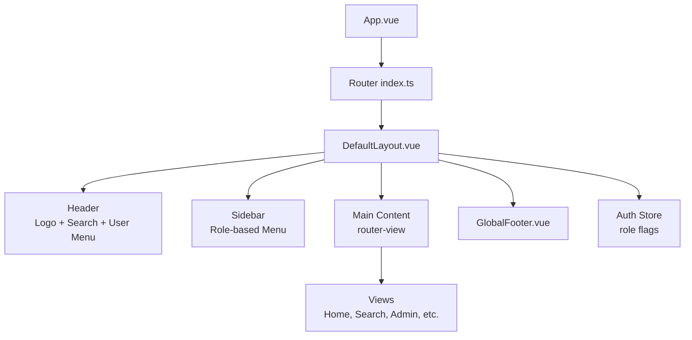
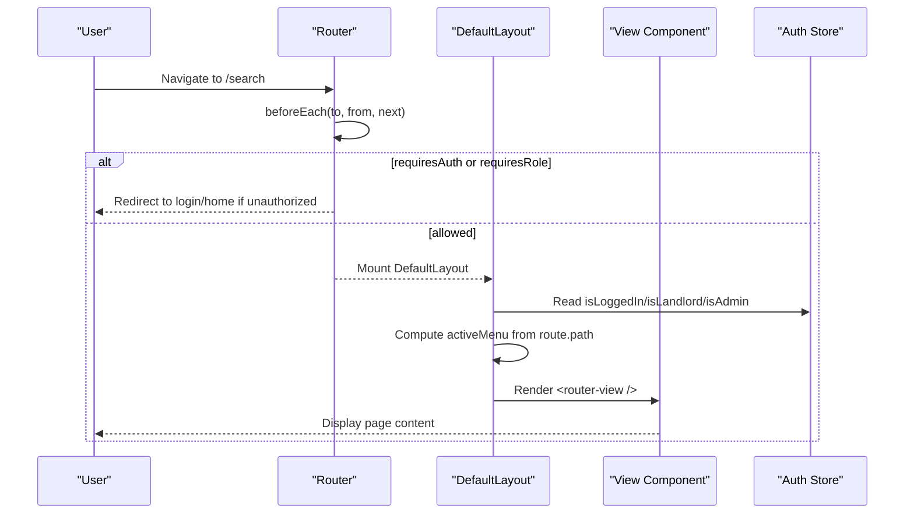
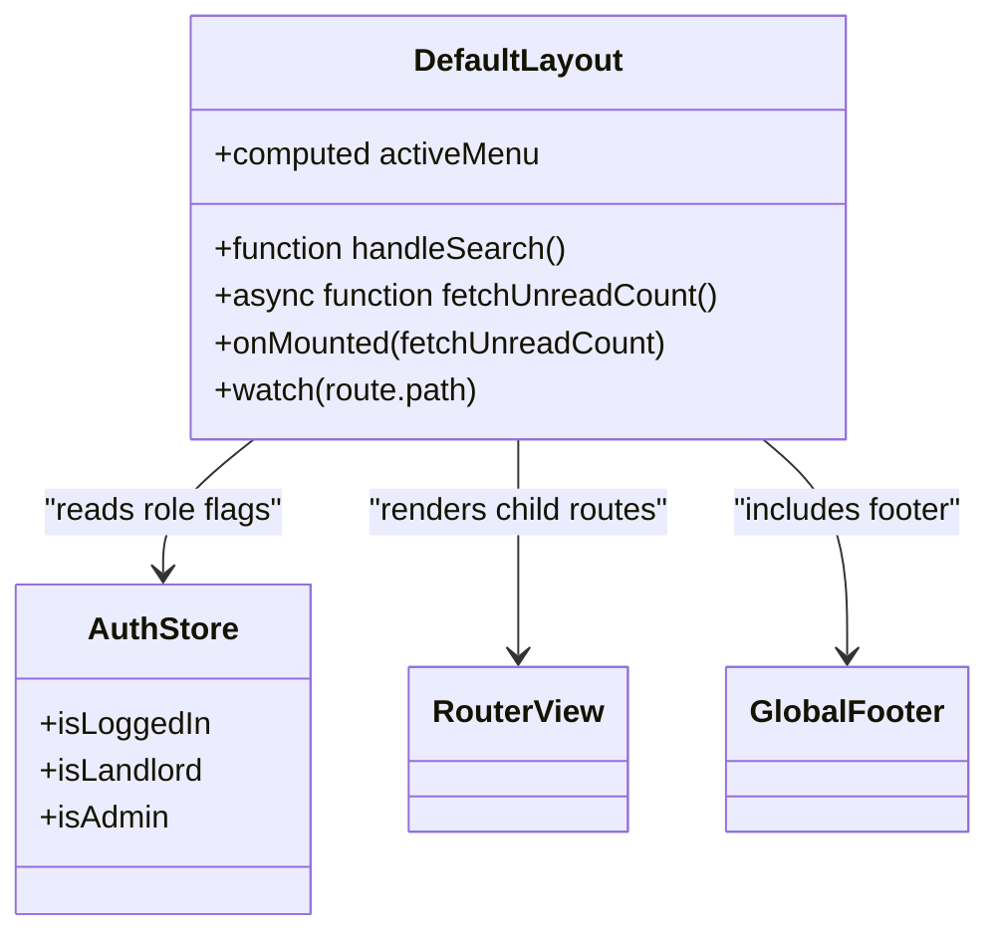
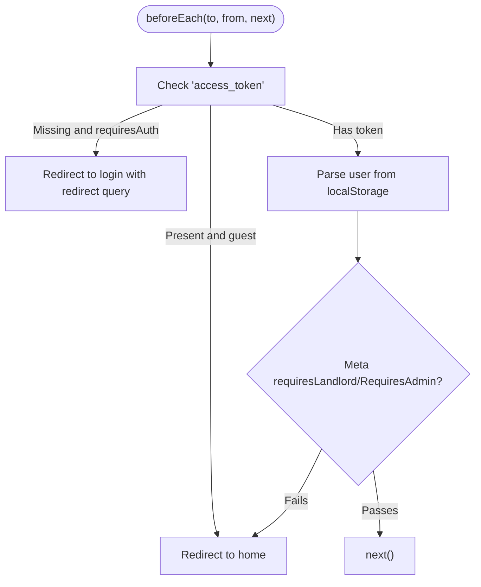
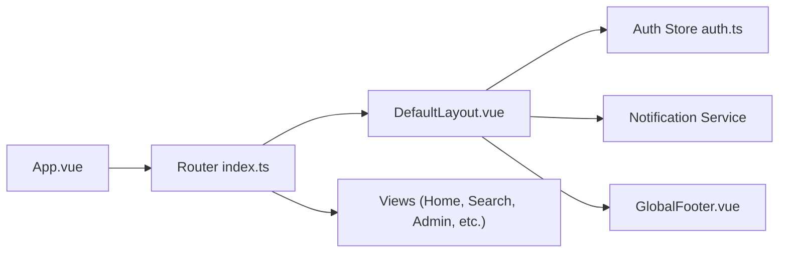

# Layout System & Navigation

<cite>
**Referenced Files in This Document**
- [DefaultLayout.vue](file://frontend/src/layouts/DefaultLayout.vue)
- [index.ts](file://frontend/src/router/index.ts)
- [App.vue](file://frontend/src/App.vue)
- [GlobalFooter.vue](file://frontend/src/components/GlobalFooter.vue)
- [auth.ts](file://frontend/src/stores/auth.ts)
- [Home.vue](file://frontend/src/views/Home.vue)
- [PropertyDetail.vue](file://frontend/src/views/PropertyDetail.vue)
- [AiSearch.vue](file://frontend/src/views/AiSearch.vue)
</cite>

## Table of Contents
1. [Introduction](#introduction)
2. [Project Structure](#project-structure)
3. [Core Components](#core-components)
4. [Architecture Overview](#architecture-overview)
5. [Detailed Component Analysis](#detailed-component-analysis)
6. [Dependency Analysis](#dependency-analysis)
7. [Performance Considerations](#performance-considerations)
8. [Troubleshooting Guide](#troubleshooting-guide)
9. [Conclusion](#conclusion)

## Introduction
This document explains the Vue 3 layout system and navigation architecture for the rental housing application. It focuses on the DefaultLayout component structure (header, sidebar, main content area, footer), nested layouts per user role (tenant, landlord, admin), routing configuration with guards, lazy loading, and dynamic routes. It also covers active menu state management, breadcrumb usage, mobile-responsive adaptations, performance optimization strategies, CSS Grid/Flexbox usage, and accessibility considerations for navigation elements.

## Project Structure
The frontend organizes layout, routing, and views under dedicated directories:
- Layouts: DefaultLayout defines the global shell with header, sidebar, main content, and footer.
- Router: Centralized route definitions with meta-based guards and lazy-loaded components.
- Views: Role-specific pages and shared pages like Home and PropertyDetail.
- Stores: Auth store provides current user and role flags used by layout and guards.
- Global styles: App.vue sets theme tokens and Element Plus overrides.

**Diagram sources**
- [App.vue:1-10](file://frontend/src/App.vue#L1-L10)
- [index.ts:1-10](file://frontend/src/router/index.ts#L1-L10)
- [DefaultLayout.vue:1-20](file://frontend/src/layouts/DefaultLayout.vue#L1-L20)
- [GlobalFooter.vue:1-20](file://frontend/src/components/GlobalFooter.vue#L1-L20)
- [auth.ts:1-20](file://frontend/src/stores/auth.ts#L1-L20)

**Section sources**
- [App.vue:1-10](file://frontend/src/App.vue#L1-L10)
- [index.ts:1-10](file://frontend/src/router/index.ts#L1-L10)
- [DefaultLayout.vue:1-20](file://frontend/src/layouts/DefaultLayout.vue#L1-L20)
- [GlobalFooter.vue:1-20](file://frontend/src/components/GlobalFooter.vue#L1-L20)
- [auth.ts:1-20](file://frontend/src/stores/auth.ts#L1-L20)

## Core Components
- DefaultLayout: Provides a sticky header with search and user controls; a responsive sidebar with role-based menus; a scrollable main content area rendering child routes; and a persistent footer.
- Router: Defines nested routes under DefaultLayout, uses lazy imports for code splitting, and applies meta flags for authentication and role checks.
- Auth Store: Exposes computed flags isLoggedIn, isLandlord, isAdmin to drive UI and guard logic.
- GlobalFooter: Shared footer rendered within the layout’s main area.

Key responsibilities:
- Header: Branding, global search, unread notifications badge, user dropdown with role-aware actions.
- Sidebar: Tenant-only items (AI search, search, map, bookings, profile); Landlord/Admin workspace and property management; Admin-only sub-menu.
- Main: Renders view components via router-view and includes GlobalFooter.
- Footer: Service links and legal info.

**Section sources**
- [DefaultLayout.vue:1-170](file://frontend/src/layouts/DefaultLayout.vue#L1-L170)
- [index.ts:5-175](file://frontend/src/router/index.ts#L5-L175)
- [auth.ts:8-20](file://frontend/src/stores/auth.ts#L8-L20)
- [GlobalFooter.vue:1-26](file://frontend/src/components/GlobalFooter.vue#L1-L26)

## Architecture Overview
The application uses a single root App that renders the router outlet. The router mounts DefaultLayout for authenticated sections and guest pages separately. DefaultLayout composes header/sidebar/main/footer and delegates page rendering to child routes. Guards enforce access based on token and role.

**Diagram sources**
- [index.ts:177-212](file://frontend/src/router/index.ts#L177-L212)
- [DefaultLayout.vue:171-225](file://frontend/src/layouts/DefaultLayout.vue#L171-L225)
- [auth.ts:8-20](file://frontend/src/stores/auth.ts#L8-L20)

## Detailed Component Analysis

### DefaultLayout Component
Structure:
- Header: Sticky top bar with logo, global search input, notification badge, and user dropdown. Role tags indicate tenant/landlord/admin.
- Sidebar: Left navigation using an Element Plus menu bound to router paths. Conditional blocks render different items per role.
- Main: Scrollable content area with router-view and GlobalFooter at the bottom.
- Active menu: Computed from route path to highlight current section.

Navigation behavior:
- Global search triggers navigation to the search route with query parameters.
- Unread notification count refreshes on mount and route changes.
- Dropdown exposes role-specific actions (profile, bookings, workspace, property management, admin).

Accessibility highlights:
- Uses semantic container components and standard buttons/icons.
- Keyboard-friendly inputs and dropdowns provided by Element Plus.
- Consider adding aria-labels to icon-only buttons and ensuring focus order is logical.

Mobile responsiveness:
- The layout relies on Flexbox for header/body composition.
- Sidebar width is fixed; consider collapsing to a drawer on small screens and toggling via a header button.
- Ensure touch targets meet minimum size guidelines.

**Diagram sources**
- [DefaultLayout.vue:171-225](file://frontend/src/layouts/DefaultLayout.vue#L171-L225)
- [auth.ts:8-20](file://frontend/src/stores/auth.ts#L8-L20)
- [GlobalFooter.vue:1-26](file://frontend/src/components/GlobalFooter.vue#L1-L26)

**Section sources**
- [DefaultLayout.vue:1-170](file://frontend/src/layouts/DefaultLayout.vue#L1-L170)
- [DefaultLayout.vue:171-225](file://frontend/src/layouts/DefaultLayout.vue#L171-L225)
- [DefaultLayout.vue:227-372](file://frontend/src/layouts/DefaultLayout.vue#L227-L372)

### Routing Configuration and Guards
Features:
- Nested routes under DefaultLayout for authenticated areas.
- Lazy loading via dynamic imports for all child routes.
- Dynamic routes such as property/:id and booking/payment/:id.
- Meta flags:
  - requiresAuth: Requires valid token.
  - requiresLandlord: Requires landlord or admin role.
  - requiresAdmin: Requires admin role.
  - guest: Redirects to home if already logged in.

Guard flow:
- Reads token and user from localStorage.
- Enforces guest-only vs auth-required routes.
- Enforces role-based access for landlord/admin routes.

**Diagram sources**
- [index.ts:182-209](file://frontend/src/router/index.ts#L182-L209)

**Section sources**
- [index.ts:5-175](file://frontend/src/router/index.ts#L5-L175)
- [index.ts:177-212](file://frontend/src/router/index.ts#L177-L212)

### Role-Based Navigation Patterns
- Tenant: AI search, search, map, my bookings, profile.
- Landlord/Admin: Workspace, property management, create/edit properties, bookings management, notifications.
- Admin only: System management submenu (dashboard, users, properties, import, logs, embeddings).

Implementation:
- Conditional template blocks in DefaultLayout sidebar and header dropdown use auth store flags.
- Route-level guards prevent unauthorized access even if URL is typed directly.

**Section sources**
- [DefaultLayout.vue:86-160](file://frontend/src/layouts/DefaultLayout.vue#L86-L160)
- [auth.ts:13-16](file://frontend/src/stores/auth.ts#L13-L16)
- [index.ts:54-160](file://frontend/src/router/index.ts#L54-L160)

### Breadcrumb Navigation and Active State
- Breadcrumbs: A back action is present in PropertyDetail; breadcrumbs can be implemented using a reusable component driven by route hierarchy.
- Active state: DefaultLayout computes activeMenu based on route.path to highlight the correct sidebar item.

Recommendation:
- Create a Breadcrumb component that maps route names to labels and supports dynamic segments (e.g., property detail).
- Keep activeMenu computation centralized and reuse it across header and sidebar.

**Section sources**
- [PropertyDetail.vue:1-20](file://frontend/src/views/PropertyDetail.vue#L1-L20)
- [DefaultLayout.vue:189-201](file://frontend/src/layouts/DefaultLayout.vue#L189-L201)

### Mobile-Responsive Layout Adaptations
- Current layout uses Flexbox for header/body and a fixed-width sidebar.
- Responsive patterns exist in some views (e.g., AiSearch media queries).
- Recommendations:
  - Collapse sidebar into a slide-out drawer on small screens.
  - Use CSS Grid for the main content grid where appropriate.
  - Ensure header search wraps gracefully and user menu remains accessible.

**Section sources**
- [AiSearch.vue:577-593](file://frontend/src/views/AiSearch.vue#L577-L593)
- [DefaultLayout.vue:227-372](file://frontend/src/layouts/DefaultLayout.vue#L227-L372)

## Dependency Analysis
High-level dependencies:
- App.vue renders the router outlet.
- Router mounts DefaultLayout and lazy-loads views.
- DefaultLayout depends on Auth Store for role flags and Notification service for unread counts.
- Views depend on stores and services for data and actions.

**Diagram sources**
- [App.vue:1-10](file://frontend/src/App.vue#L1-L10)
- [index.ts:1-10](file://frontend/src/router/index.ts#L1-L10)
- [DefaultLayout.vue:171-185](file://frontend/src/layouts/DefaultLayout.vue#L171-L185)
- [auth.ts:1-10](file://frontend/src/stores/auth.ts#L1-L10)
- [GlobalFooter.vue:1-20](file://frontend/src/components/GlobalFooter.vue#L1-L20)

**Section sources**
- [App.vue:1-10](file://frontend/src/App.vue#L1-L10)
- [index.ts:1-10](file://frontend/src/router/index.ts#L1-L10)
- [DefaultLayout.vue:171-185](file://frontend/src/layouts/DefaultLayout.vue#L171-L185)
- [auth.ts:1-10](file://frontend/src/stores/auth.ts#L1-L10)
- [GlobalFooter.vue:1-20](file://frontend/src/components/GlobalFooter.vue#L1-L20)

## Performance Considerations
- Code splitting: All child routes are lazy-loaded via dynamic imports, reducing initial bundle size.
- Route-level guards run once per navigation; keep them lightweight.
- Avoid heavy computations in reactive getters; prefer computed values and memoization.
- Images and maps: Use lazy loading and optimized assets; defer non-critical integrations until needed.
- CSS: Prefer Flexbox/Grid for layout; avoid expensive animations; leverage CSS variables for consistent theming.
- Notifications polling: Debounce or throttle unread count updates; consider WebSocket for real-time updates.

[No sources needed since this section provides general guidance]

## Troubleshooting Guide
Common issues and resolutions:
- Unauthorized redirects: If a protected route redirects unexpectedly, verify token presence and role flags in localStorage and ensure the route meta flags match intended access.
- Active menu mismatch: If sidebar highlighting is incorrect, review the activeMenu computation logic and ensure route paths align with menu indices.
- Notification badge not updating: Confirm the unread count fetch runs on mount and route change; check error handling to avoid silent failures.
- Mobile usability: If sidebar overlaps content on small screens, implement a collapsible drawer and adjust header interactions.

**Section sources**
- [index.ts:182-209](file://frontend/src/router/index.ts#L182-L209)
- [DefaultLayout.vue:189-225](file://frontend/src/layouts/DefaultLayout.vue#L189-L225)

## Conclusion
The layout and navigation system centers around a flexible DefaultLayout with role-aware menus, robust route guards, and lazy-loaded views. By refining active state logic, implementing breadcrumbs, enhancing mobile responsiveness, and following performance best practices, the system delivers a scalable foundation for tenant, landlord, and admin experiences while maintaining accessibility and maintainability.