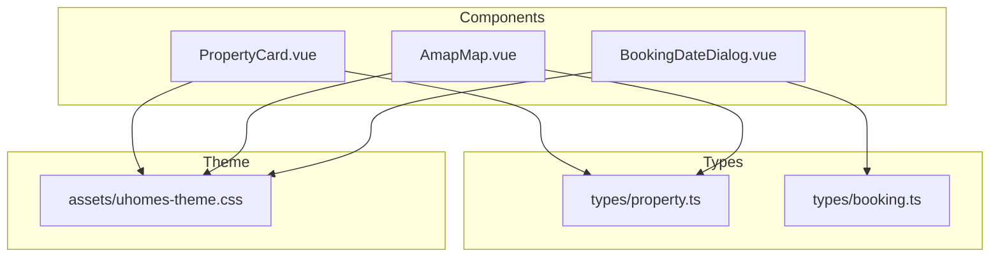
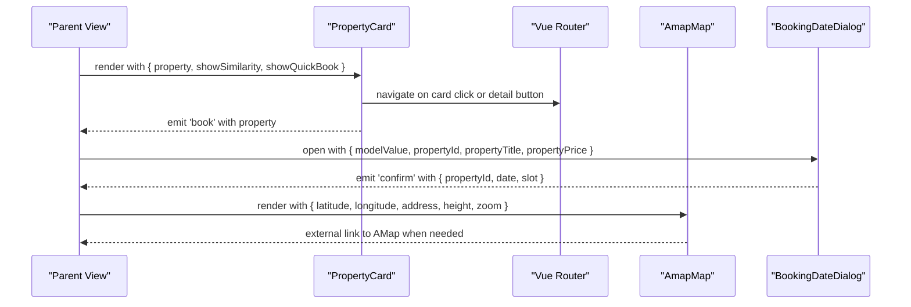
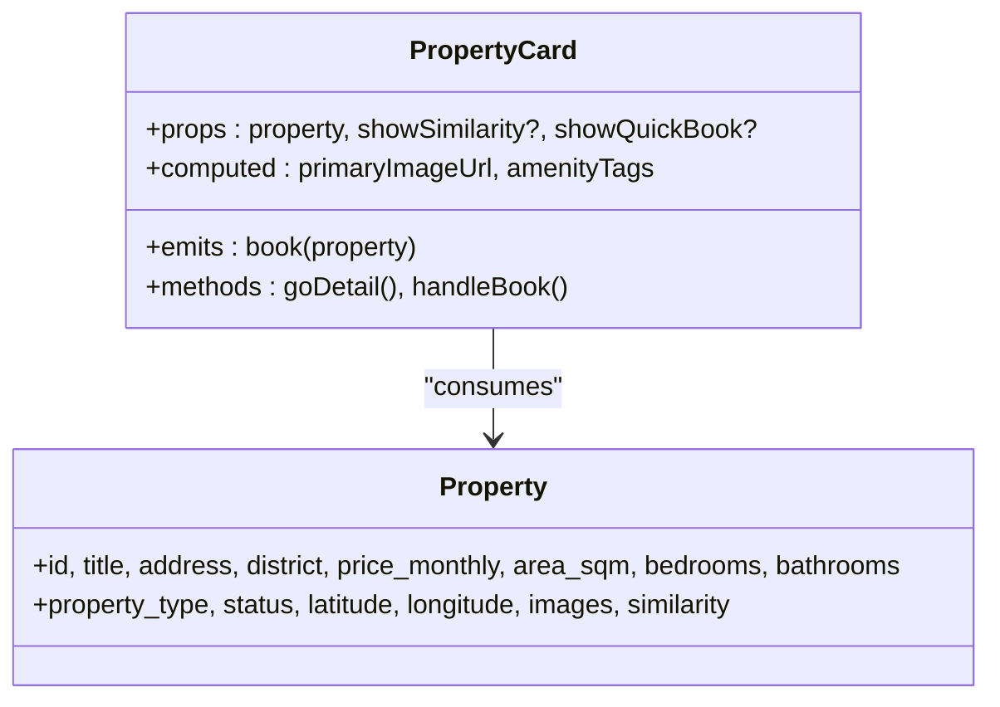
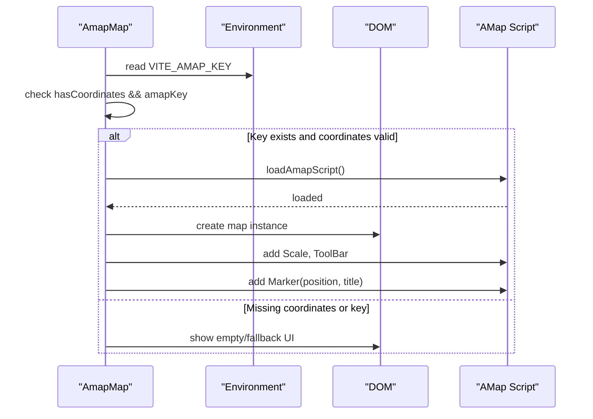
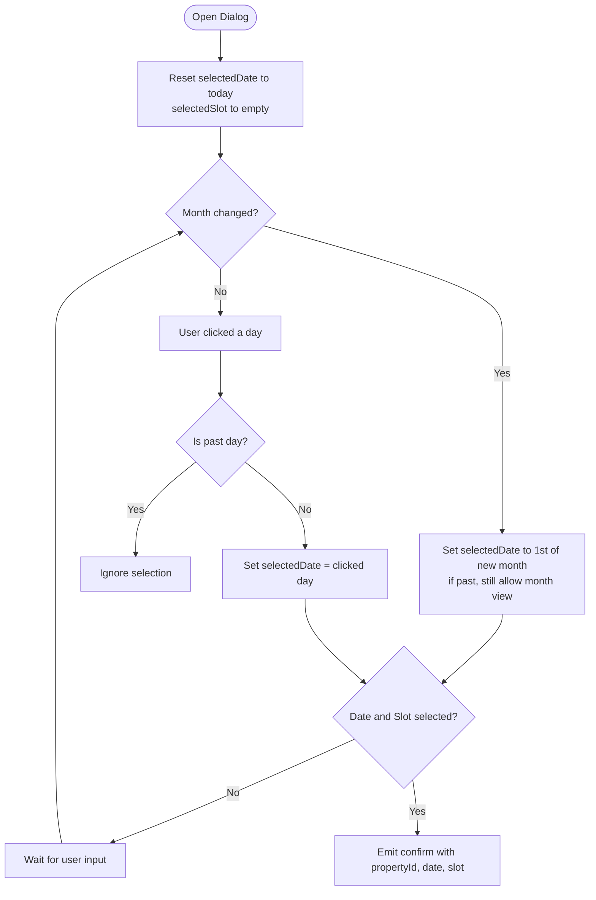
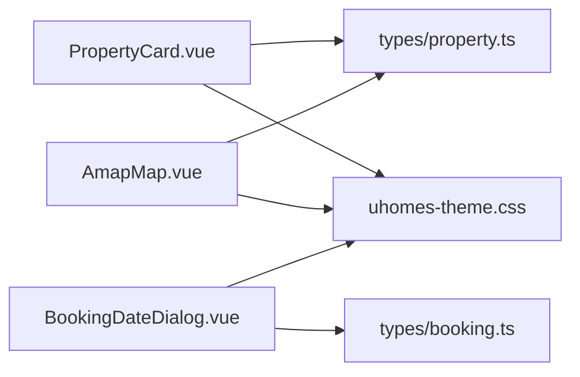

# Reusable UI Components

<cite>
**Referenced Files in This Document**
- [PropertyCard.vue](file://frontend/src/components/PropertyCard.vue)
- [AmapMap.vue](file://frontend/src/components/AmapMap.vue)
- [BookingDateDialog.vue](file://frontend/src/components/BookingDateDialog.vue)
- [property.ts](file://frontend/src/types/property.ts)
- [booking.ts](file://frontend/src/types/booking.ts)
- [uhomes-theme.css](file://frontend/src/assets/uhomes-theme.css)
</cite>

## Table of Contents
1. Introduction
2. Project Structure
3. Core Components
4. Architecture Overview
5. Detailed Component Analysis
6. Dependency Analysis
7. Performance Considerations
8. Troubleshooting Guide
9. Conclusion

## Introduction
This document describes the reusable UI components system focused on three core Vue 3 components: PropertyCard, AmapMap, and BookingDateDialog. It explains their props, events, computed properties, styling patterns, TypeScript types, accessibility considerations, responsive behavior, composition patterns, and integration with Element Plus. Usage examples and customization options are provided to help integrate these components into views and pages consistently.

## Project Structure
The components live under frontend/src/components and rely on shared type definitions in frontend/src/types and global theme variables in frontend/src/assets. The components use Element Plus for UI primitives (icons, tags, buttons, dialogs, calendar).

**Diagram sources**
- [PropertyCard.vue](file://frontend/src/components/PropertyCard.vue)
- [AmapMap.vue](file://frontend/src/components/AmapMap.vue)
- [BookingDateDialog.vue](file://frontend/src/components/BookingDateDialog.vue)
- [property.ts](file://frontend/src/types/property.ts)
- [booking.ts](file://frontend/src/types/booking.ts)
- [uhomes-theme.css](file://frontend/src/assets/uhomes-theme.css)

**Section sources**
- [PropertyCard.vue](file://frontend/src/components/PropertyCard.vue)
- [AmapMap.vue](file://frontend/src/components/AmapMap.vue)
- [BookingDateDialog.vue](file://frontend/src/components/BookingDateDialog.vue)
- [property.ts](file://frontend/src/types/property.ts)
- [booking.ts](file://frontend/src/types/booking.ts)
- [uhomes-theme.css](file://frontend/src/assets/uhomes-theme.css)

## Core Components
- PropertyCard: Displays a property listing with image, title, tags, amenities, address, price, and actions. Supports optional similarity badge and quick booking action. Emits a book event for parent handling.
- AmapMap: Renders an AMap-based map with marker and controls when coordinates and API key are available; otherwise shows fallback states and an external link.
- BookingDateDialog: A dialog for selecting a viewing date and time slot, with validation rules and confirmation emission.

Key integration points:
- Uses Element Plus icons, tags, buttons, dialog, and calendar.
- Relies on CSS custom properties from uhomes-theme.css for consistent theming.
- Strongly typed via TypeScript interfaces in property.ts and booking.ts.

**Section sources**
- [PropertyCard.vue](file://frontend/src/components/PropertyCard.vue)
- [AmapMap.vue](file://frontend/src/components/AmapMap.vue)
- [BookingDateDialog.vue](file://frontend/src/components/BookingDateDialog.vue)
- [property.ts](file://frontend/src/types/property.ts)
- [booking.ts](file://frontend/src/types/booking.ts)
- [uhomes-theme.css](file://frontend/src/assets/uhomes-theme.css)

## Architecture Overview
High-level component interactions and data flow:

**Diagram sources**
- [PropertyCard.vue](file://frontend/src/components/PropertyCard.vue)
- [AmapMap.vue](file://frontend/src/components/AmapMap.vue)
- [BookingDateDialog.vue](file://frontend/src/components/BookingDateDialog.vue)

## Detailed Component Analysis

### PropertyCard
Purpose:
- Present property details in a compact, interactive card.
- Provide quick navigation and optional booking trigger.

Props:
- property: Property | PropertySearchResult
- showSimilarity?: boolean
- showQuickBook?: boolean

Events:
- book(property): Emitted when quick booking is triggered.

Computed Properties:
- primaryImageUrl: Resolves the primary image URL from images array; falls back to first image if none marked primary.
- amenityTags: Generates smart tags based on district, property_type, bedrooms, price, and description keywords.

Styling Patterns:
- Uses CSS custom properties for colors, radius, shadows.
- Hover effects and transitions for interactivity.
- Responsive-friendly layout using flexbox and wrapping tags.

Accessibility:
- Image alt text bound to property.title.
- Buttons have clear labels and stop propagation to avoid unintended card clicks.

Integration Notes:
- Uses Element Plus icons and tags.
- Navigates via vue-router to /property/:id.

Usage Example:
- Render within a grid/list view with v-for over properties.
- Bind showSimilarity for search results and showQuickBook where appropriate.
- Listen to @book to open BookingDateDialog or handle booking logic.

Customization Options:
- Toggle similarity badge visibility.
- Toggle quick booking button visibility.
- Extend amenity tag generation by modifying computed logic.

**Section sources**
- [PropertyCard.vue](file://frontend/src/components/PropertyCard.vue)
- [property.ts](file://frontend/src/types/property.ts)
- [uhomes-theme.css](file://frontend/src/assets/uhomes-theme.css)

#### Class-like Relationships (Conceptual)

**Diagram sources**
- [PropertyCard.vue](file://frontend/src/components/PropertyCard.vue)
- [property.ts](file://frontend/src/types/property.ts)

### AmapMap
Purpose:
- Display geographic location on AMap with marker and controls.
- Gracefully degrade when coordinates or API key are missing.

Props:
- latitude: number | null | undefined
- longitude: number | null | undefined
- address?: string | null
- height?: string
- zoom?: number

Computed Properties:
- resolvedAddress: Trimmed address or empty string.
- hasCoordinates: True when both latitude and longitude are finite numbers.
- formattedLatitude/formattedLongitude: Formatted to fixed decimals.
- amapMarkerUrl: External AMap link with position and name.

Lifecycle and Initialization:
- Dynamically loads AMap script if not present.
- Initializes map instance with Scale and ToolBar controls and adds a Marker.
- Watches coordinate/key changes and reinitializes safely.
- Destroys map instance on unmount.

Fallbacks:
- Shows empty state when no coordinates.
- Shows message and external link when API key is missing.

Integration Notes:
- Uses Element Plus empty state and tags.
- Height can be customized via prop.

Usage Example:
- Pass property.latitude, property.longitude, and property.address.
- Optionally set height and zoom for different contexts.

Customization Options:
- Adjust default height and zoom.
- Customize external link behavior if needed.

**Section sources**
- [AmapMap.vue](file://frontend/src/components/AmapMap.vue)
- [property.ts](file://frontend/src/types/property.ts)
- [uhomes-theme.css](file://frontend/src/assets/uhomes-theme.css)

#### Sequence Diagram: Map Initialization

**Diagram sources**
- [AmapMap.vue](file://frontend/src/components/AmapMap.vue)

### BookingDateDialog
Purpose:
- Collect viewing date and time slot with validation and confirmation.

Props:
- modelValue: boolean
- propertyId: number
- propertyTitle?: string
- propertyPrice?: number

Emits:
- update:modelValue(v: boolean)
- confirm(data: { propertyId: number; date: string; slot: string })

State and Validation:
- selectedDate: Ref-backed Date with computed setter that allows month navigation but prevents past-day selection within the same month.
- selectedSlot: Selected time slot value.
- submitting: Loading indicator during confirmation.
- canConfirm: Computed true when both date and slot are selected.

Time Slots:
- morning, afternoon, evening with labels and time ranges.

Workflow:
- On confirm, validates non-past date and presence of slot, then emits confirm payload.
- Resets internal state when dialog opens.

Integration Notes:
- Uses Element Plus dialog and calendar.
- Styling uses theme variables for consistency.

Usage Example:
- Open dialog from PropertyCard's book event.
- Handle confirm to proceed to booking creation or scheduling.

Customization Options:
- Add more time slots or adjust labels/times.
- Extend validation rules (e.g., business hours, blocked dates).

**Section sources**
- [BookingDateDialog.vue](file://frontend/src/components/BookingDateDialog.vue)
- [booking.ts](file://frontend/src/types/booking.ts)
- [uhomes-theme.css](file://frontend/src/assets/uhomes-theme.css)

#### Flowchart: Date Selection Logic

**Diagram sources**
- [BookingDateDialog.vue](file://frontend/src/components/BookingDateDialog.vue)

## Dependency Analysis
Component dependencies and relationships:

**Diagram sources**
- [PropertyCard.vue](file://frontend/src/components/PropertyCard.vue)
- [AmapMap.vue](file://frontend/src/components/AmapMap.vue)
- [BookingDateDialog.vue](file://frontend/src/components/BookingDateDialog.vue)
- [property.ts](file://frontend/src/types/property.ts)
- [booking.ts](file://frontend/src/types/booking.ts)
- [uhomes-theme.css](file://frontend/src/assets/uhomes-theme.css)

**Section sources**
- [PropertyCard.vue](file://frontend/src/components/PropertyCard.vue)
- [AmapMap.vue](file://frontend/src/components/AmapMap.vue)
- [BookingDateDialog.vue](file://frontend/src/components/BookingDateDialog.vue)
- [property.ts](file://frontend/src/types/property.ts)
- [booking.ts](file://frontend/src/types/booking.ts)
- [uhomes-theme.css](file://frontend/src/assets/uhomes-theme.css)

## Performance Considerations
- PropertyCard:
  - Computed primaryImageUrl avoids repeated image lookups.
  - amenityTags computation is lightweight; consider memoization if list grows significantly.
- AmapMap:
  - Dynamic script loading ensures minimal initial bundle size.
  - Map instance destroyed on unmount to prevent memory leaks.
  - Watchers reinitialize only when necessary (coordinates or key change).
- BookingDateDialog:
  - Minimal reactive state; confirm path includes short simulated delay for UX.
  - Avoid heavy computations inside watchers.

[No sources needed since this section provides general guidance]

## Troubleshooting Guide
Common issues and resolutions:
- PropertyCard image not showing:
  - Ensure property.images exists and contains at least one entry; primaryImageUrl falls back to first image if none marked primary.
  - Verify backend upload paths match expected format.
- AmapMap not rendering:
  - Check VITE_AMAP_KEY environment variable is configured.
  - Validate latitude and longitude are finite numbers.
  - Inspect network tab for AMap script loading errors.
- BookingDateDialog validation:
  - Past days cannot be selected; ensure current date logic aligns with timezone expectations.
  - Confirm requires both date and slot; verify canComputed reflects selections.

**Section sources**
- [PropertyCard.vue](file://frontend/src/components/PropertyCard.vue)
- [AmapMap.vue](file://frontend/src/components/AmapMap.vue)
- [BookingDateDialog.vue](file://frontend/src/components/BookingDateDialog.vue)

## Conclusion
These three components provide a cohesive foundation for property display, geographic visualization, and booking scheduling workflows. They leverage Element Plus for UI primitives, adhere to strong TypeScript typing, and follow consistent styling patterns through theme variables. By composing these components thoughtfully, you can build responsive, accessible, and maintainable rental housing interfaces.

[No sources needed since this section summarizes without analyzing specific files]