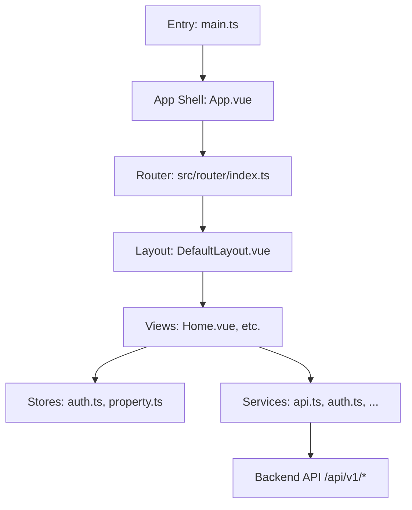
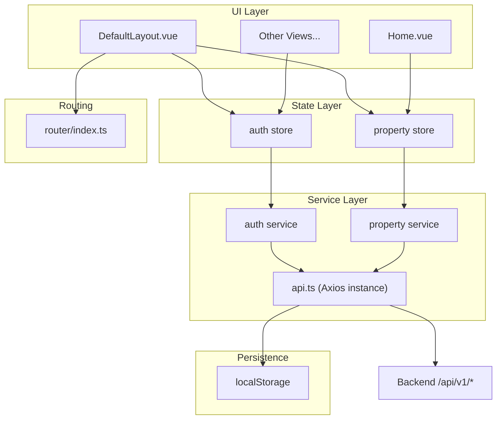
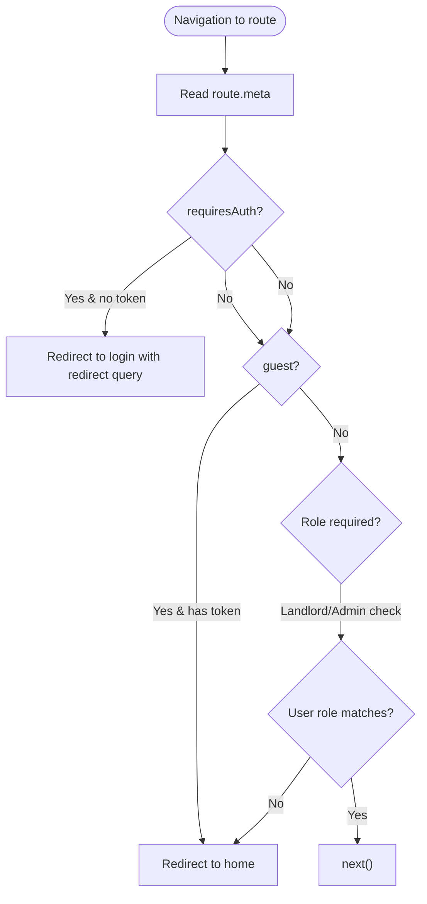
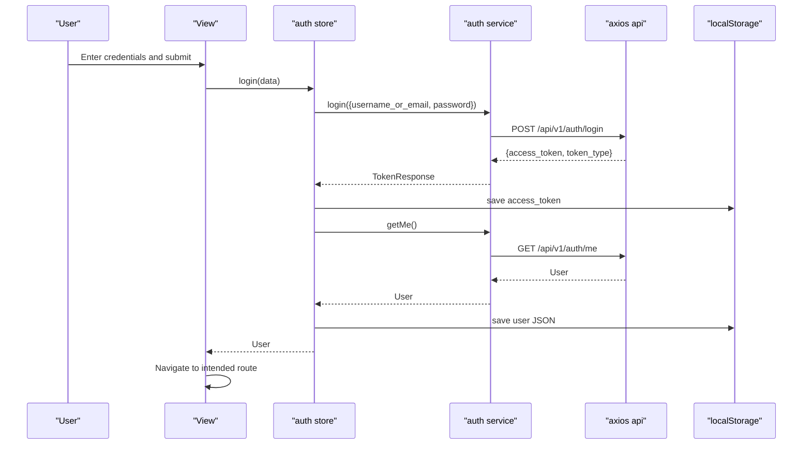
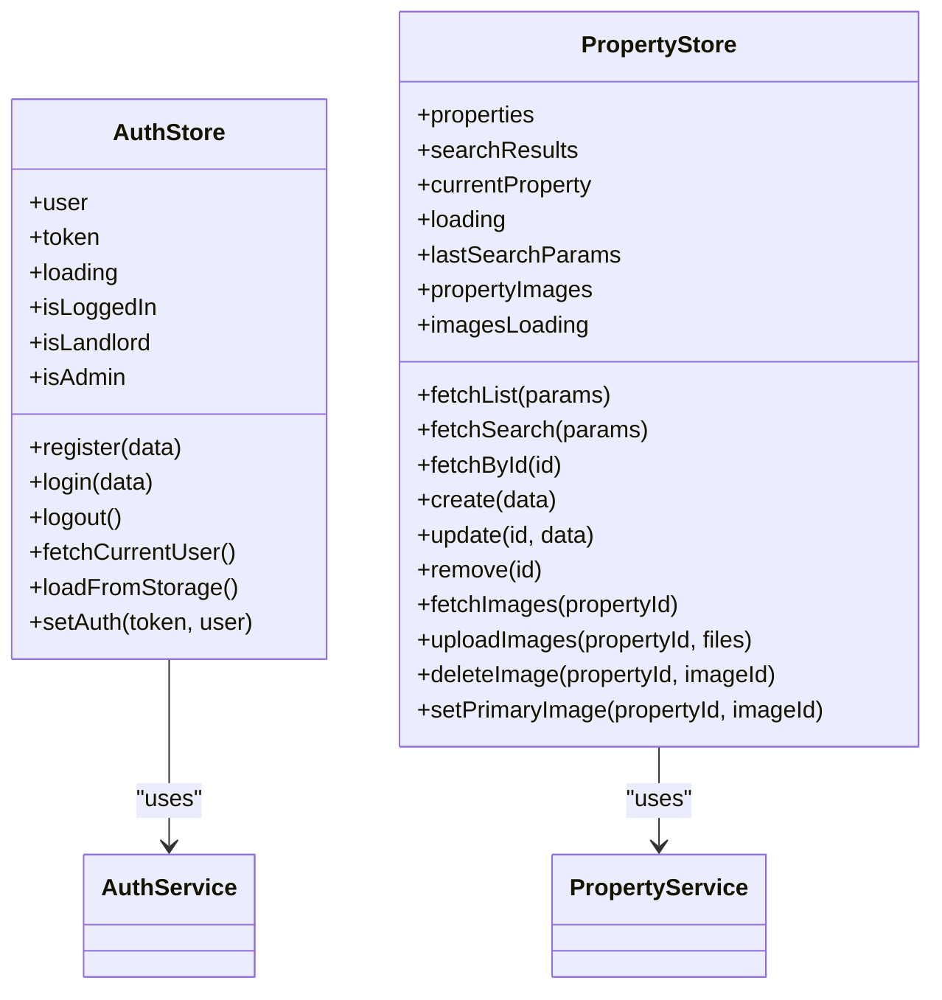
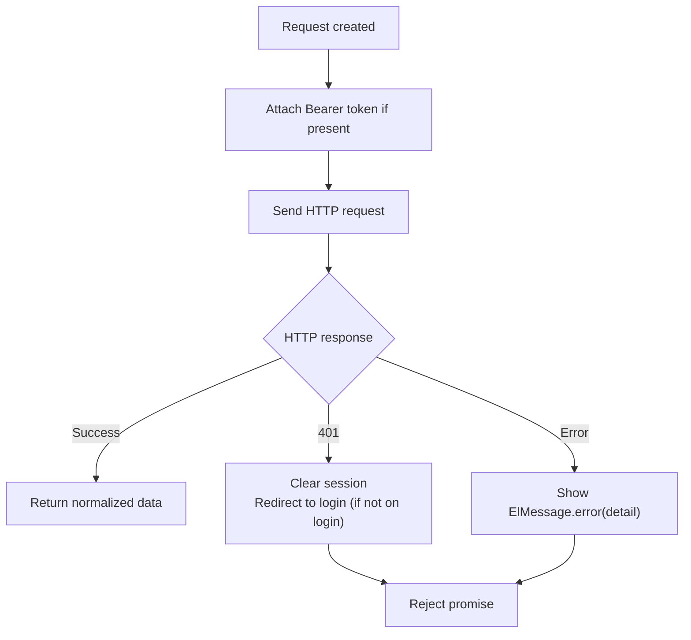
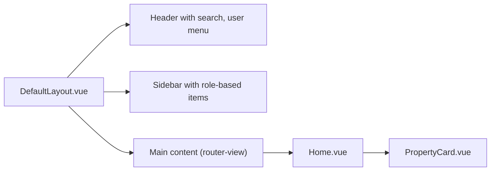
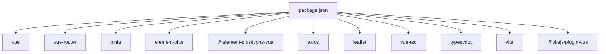

# Frontend Architecture

<cite>
**Referenced Files in This Document**
- [main.ts](file://frontend/src/main.ts)
- [App.vue](file://frontend/src/App.vue)
- [index.ts](file://frontend/src/router/index.ts)
- [DefaultLayout.vue](file://frontend/src/layouts/DefaultLayout.vue)
- [Home.vue](file://frontend/src/views/Home.vue)
- [PropertyCard.vue](file://frontend/src/components/PropertyCard.vue)
- [api.ts](file://frontend/src/services/api.ts)
- [auth.ts](file://frontend/src/services/auth.ts)
- [auth.ts](file://frontend/src/stores/auth.ts)
- [property.ts](file://frontend/src/stores/property.ts)
- [vite.config.ts](file://frontend/vite.config.ts)
- [package.json](file://frontend/package.json)
- [tsconfig.json](file://frontend/tsconfig.json)
</cite>

## Table of Contents
1. Introduction
2. Project Structure
3. Core Components
4. Architecture Overview
5. Detailed Component Analysis
6. Dependency Analysis
7. Performance Considerations
8. Troubleshooting Guide
9. Conclusion
10. Appendices

## Introduction
This document describes the architecture of the Vue 3 + TypeScript frontend application. It covers the single-page application (SPA) design, component hierarchy, state management with Pinia, routing and navigation guards, service layer for API communication, authentication flow with JWT, build configuration with Vite, responsive and accessibility considerations, development workflow, testing strategies, debugging techniques, and common patterns such as form handling, data fetching, and state synchronization.

## Project Structure
The frontend is organized by feature and layer:
- Entry point initializes Vue app, Pinia, router, and UI library.
- Router defines routes with lazy-loaded components and role-based guards.
- Layouts provide a consistent shell with header, sidebar, and main content area.
- Views implement page-level logic and orchestrate stores and services.
- Services encapsulate HTTP calls and error handling.
- Stores manage global state with Pinia and persist session to localStorage.
- Types define shared interfaces aligned with backend schemas.
- Build tooling uses Vite with TypeScript and Element Plus.

**Diagram sources**
- [main.ts](file://frontend/src/main.ts)
- [App.vue](file://frontend/src/App.vue)
- [index.ts](file://frontend/src/router/index.ts)
- [DefaultLayout.vue](file://frontend/src/layouts/DefaultLayout.vue)
- [Home.vue](file://frontend/src/views/Home.vue)
- [api.ts](file://frontend/src/services/api.ts)
- [auth.ts](file://frontend/src/services/auth.ts)
- [auth.ts](file://frontend/src/stores/auth.ts)
- [property.ts](file://frontend/src/stores/property.ts)

**Section sources**
- [main.ts](file://frontend/src/main.ts)
- [App.vue](file://frontend/src/App.vue)
- [index.ts](file://frontend/src/router/index.ts)
- [DefaultLayout.vue](file://frontend/src/layouts/DefaultLayout.vue)
- [Home.vue](file://frontend/src/views/Home.vue)
- [api.ts](file://frontend/src/services/api.ts)
- [auth.ts](file://frontend/src/services/auth.ts)
- [auth.ts](file://frontend/src/stores/auth.ts)
- [property.ts](file://frontend/src/stores/property.ts)

## Core Components
- Application bootstrap: creates Vue app, mounts Pinia, registers router, configures Element Plus with Chinese locale, and globally registers icons.
- Root component: renders router-view and applies global CSS variables and theme overrides for Element Plus.
- Layout: provides sticky header with search, user menu, notifications badge, and role-aware sidebar; renders page content via router-view and footer.
- Views: example home page integrates AI search UX, region quick links, featured listings, and booking dialog integration.
- Reusable components: PropertyCard displays property details, computed amenity tags, and actions like view detail or quick book.

Key responsibilities:
- Routing and navigation guards enforce authentication and roles.
- Service layer centralizes HTTP requests, token injection, and error display.
- Stores encapsulate business logic, loading states, and persistence.

**Section sources**
- [main.ts](file://frontend/src/main.ts)
- [App.vue](file://frontend/src/App.vue)
- [DefaultLayout.vue](file://frontend/src/layouts/DefaultLayout.vue)
- [Home.vue](file://frontend/src/views/Home.vue)
- [PropertyCard.vue](file://frontend/src/components/PropertyCard.vue)

## Architecture Overview
High-level SPA architecture:
- Vue 3 Composition API with <script setup>.
- Pinia for reactive state across views.
- Vue Router with lazy loading and meta-based guards.
- Axios-based service layer with interceptors for auth and errors.
- Element Plus UI system with custom theme tokens.

**Diagram sources**
- [DefaultLayout.vue](file://frontend/src/layouts/DefaultLayout.vue)
- [Home.vue](file://frontend/src/views/Home.vue)
- [auth.ts](file://frontend/src/stores/auth.ts)
- [property.ts](file://frontend/src/stores/property.ts)
- [api.ts](file://frontend/src/services/api.ts)
- [auth.ts](file://frontend/src/services/auth.ts)
- [index.ts](file://frontend/src/router/index.ts)

## Detailed Component Analysis

### Routing and Navigation Guards
- Route definitions use lazy imports for code splitting.
- Meta flags control access: requiresAuth, guest, requiresLandlord, requiresAdmin.
- beforeEach guard reads token and user from localStorage, enforces redirects based on meta flags and user role.

**Diagram sources**
- [index.ts](file://frontend/src/router/index.ts)

**Section sources**
- [index.ts](file://frontend/src/router/index.ts)

### Authentication Flow and Session Persistence
- Login flow: store calls auth service to obtain token, then fetches current user profile and persists both token and user object to localStorage.
- Interceptors attach Authorization header automatically when token exists.
- On 401 responses, unauthorized users are redirected to login unless already on login page; error messages are shown via UI feedback.
- Store exposes computed helpers for isLoggedIn, isLandlord, isAdmin used by layout and guards.

**Diagram sources**
- [auth.ts](file://frontend/src/stores/auth.ts)
- [auth.ts](file://frontend/src/services/auth.ts)
- [api.ts](file://frontend/src/services/api.ts)

**Section sources**
- [auth.ts](file://frontend/src/stores/auth.ts)
- [auth.ts](file://frontend/src/services/auth.ts)
- [api.ts](file://frontend/src/services/api.ts)

### State Management with Pinia
- Auth store: manages token, user, loading, and provides login/register/logout/fetchCurrentUser methods. Persists session to localStorage and resets on invalid state.
- Property store: manages lists, search results, current item, images, and CRUD operations. Updates local caches after mutations.

**Diagram sources**
- [auth.ts](file://frontend/src/stores/auth.ts)
- [property.ts](file://frontend/src/stores/property.ts)

**Section sources**
- [auth.ts](file://frontend/src/stores/auth.ts)
- [property.ts](file://frontend/src/stores/property.ts)

### Service Layer and Error Handling
- Central axios instance sets baseURL, timeout, and default headers.
- Request interceptor injects Authorization header from localStorage.
- Response interceptor handles 401 by clearing session and redirecting (except during login), and shows user-friendly error messages for validation and server errors.

**Diagram sources**
- [api.ts](file://frontend/src/services/api.ts)

**Section sources**
- [api.ts](file://frontend/src/services/api.ts)

### Layout and Component Composition
- DefaultLayout composes header, sidebar, and main content. It adapts menus and badges based on auth state and roles.
- Global styles define brand colors, radii, shadows, and Element Plus overrides.
- Home view demonstrates composition of reusable components (e.g., PropertyCard), dialogs, and store usage.

**Diagram sources**
- [DefaultLayout.vue](file://frontend/src/layouts/DefaultLayout.vue)
- [Home.vue](file://frontend/src/views/Home.vue)
- [PropertyCard.vue](file://frontend/src/components/PropertyCard.vue)

**Section sources**
- [DefaultLayout.vue](file://frontend/src/layouts/DefaultLayout.vue)
- [App.vue](file://frontend/src/App.vue)
- [Home.vue](file://frontend/src/views/Home.vue)
- [PropertyCard.vue](file://frontend/src/components/PropertyCard.vue)

## Dependency Analysis
External dependencies and their roles:
- vue, vue-router, pinia: core runtime and state/routing.
- element-plus and icons: UI components and icon set.
- axios: HTTP client.
- leaflet and @types/leaflet: map integration (available).
- vite, @vitejs/plugin-vue, typescript, vue-tsc: build and type checking.

**Diagram sources**
- [package.json](file://frontend/package.json)

**Section sources**
- [package.json](file://frontend/package.json)

## Performance Considerations
- Lazy loading: Routes use dynamic imports to split bundles per page.
- Code organization: Feature-based folders reduce coupling and improve maintainability.
- UI performance: Element Plus components are widely optimized; avoid heavy computations in templates—use computed properties where applicable.
- Network: Centralized axios instance with timeouts and error handling reduces overhead and improves reliability.
- Assets: Use CDN or optimize images at source; consider lazy-loading images within components.

[No sources needed since this section provides general guidance]

## Troubleshooting Guide
Common issues and remedies:
- 401 Unauthorized: Ensure token exists in localStorage and is valid; verify that request interceptor attaches Authorization header. If 401 occurs outside login, the app clears session and redirects to login.
- Validation errors: Server returns structured detail; the response interceptor displays them via message notifications.
- CORS during development: The dev server proxies /api to the backend target; ensure proxy settings match your backend host/port.
- Type errors: Run type checks before build; ensure tsconfig paths and module resolution align with Vite alias.

**Section sources**
- [api.ts](file://frontend/src/services/api.ts)
- [vite.config.ts](file://frontend/vite.config.ts)
- [tsconfig.json](file://frontend/tsconfig.json)

## Conclusion
The frontend follows a clean separation of concerns: routing and guards control access, layouts compose UI shells, views orchestrate stores and services, and services encapsulate HTTP interactions with robust error handling. Pinia provides reactive state with persistence, while Vite enables fast builds and efficient code splitting. The architecture supports scalable growth through modular services, typed contracts, and consistent UI patterns.

[No sources needed since this section summarizes without analyzing specific files]

## Appendices

### Build Configuration and Development Workflow
- Vite config:
  - Alias @ points to src.
  - Dev server runs on port 5173 and proxies /api to backend.
- Scripts:
  - dev: start dev server.
  - build: type-check with vue-tsc then build.
  - preview: preview production build.
  - test/test:watch/test:coverage: run Vitest suite and coverage.
- TypeScript:
  - Strict mode enabled, ES2020 target, bundler module resolution, path mapping @/*.

**Section sources**
- [vite.config.ts](file://frontend/vite.config.ts)
- [package.json](file://frontend/package.json)
- [tsconfig.json](file://frontend/tsconfig.json)

### Responsive Design and Accessibility
- Responsive patterns:
  - Flexbox-based layout with sticky header and scrollable sidebar.
  - Search bar and cards adapt to container widths; media queries can be added as needed.
- Accessibility:
  - Use semantic HTML elements and keyboard-accessible controls.
  - Provide alt text for images and meaningful labels for inputs/buttons.
  - Ensure sufficient color contrast using provided theme tokens.

[No sources needed since this section provides general guidance]

### Cross-Browser Compatibility
- Modern browsers supported via ES2020 target and Vite’s built-in polyfills.
- Speech input features rely on browser APIs; gracefully degrade with user messaging when unsupported.

[No sources needed since this section provides general guidance]

### Testing Strategies
- Unit tests:
  - Place tests under src/__tests__ alongside modules.
  - Use Vitest for running tests and coverage.
- Recommended scope:
  - Store logic (auth, property).
  - Utility functions and computed logic in components.
  - Service-layer adapters for predictable mocking.

**Section sources**
- [package.json](file://frontend/package.json)

### Debugging Techniques
- Browser DevTools:
  - Network tab to inspect API requests/responses and headers.
  - Local Storage to verify persisted token/user.
- Logging:
  - Add temporary console logs in stores/services for tracing flows.
- Router:
  - Inspect route meta and navigation guards to confirm redirection logic.

[No sources needed since this section provides general guidance]

### Common Patterns Examples

#### Form Handling
- Pattern:
  - Bind form fields with v-model in views.
  - Validate locally before calling store methods.
  - Display server-side errors via global message notifications.
- References:
  - Layout header search input and button trigger navigation.
  - Home hero search input triggers AI search flow.

**Section sources**
- [DefaultLayout.vue](file://frontend/src/layouts/DefaultLayout.vue)
- [Home.vue](file://frontend/src/views/Home.vue)

#### Data Fetching
- Pattern:
  - View calls store method.
  - Store calls service method.
  - Service uses axios instance with interceptors.
  - Loading state managed in store; errors handled centrally.
- References:
  - Home view loads featured properties via property store.
  - Auth store fetches current user after login.

**Section sources**
- [Home.vue](file://frontend/src/views/Home.vue)
- [property.ts](file://frontend/src/stores/property.ts)
- [auth.ts](file://frontend/src/stores/auth.ts)
- [api.ts](file://frontend/src/services/api.ts)

#### State Synchronization
- Pattern:
  - Persist token and user to localStorage.
  - Initialize stores from storage on creation.
  - Update UI reactively via computed flags (isLoggedIn, isLandlord, isAdmin).
- References:
  - Auth store loadFromStorage and setAuth/clearAuth.
  - Layout uses computed flags to render role-specific UI.

**Section sources**
- [auth.ts](file://frontend/src/stores/auth.ts)
- [DefaultLayout.vue](file://frontend/src/layouts/DefaultLayout.vue)