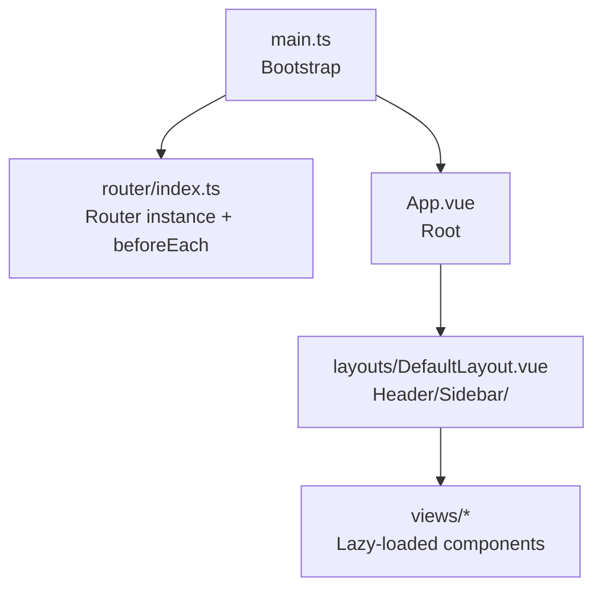
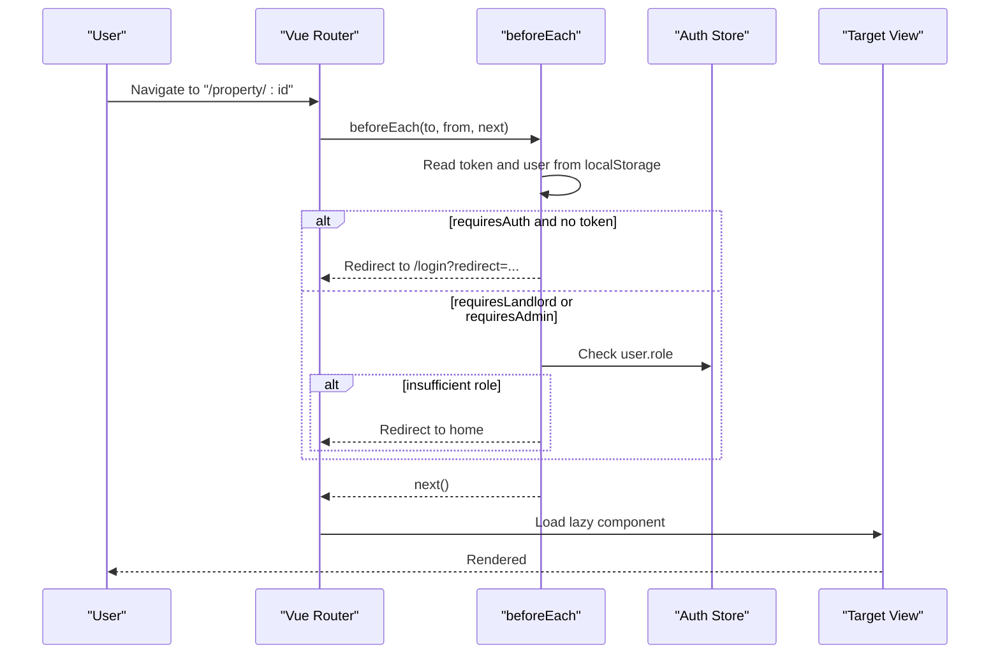
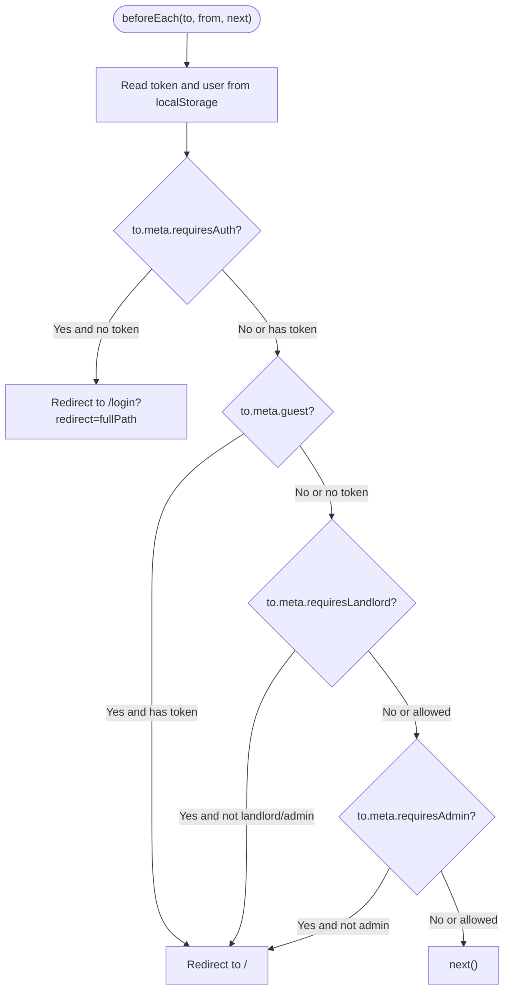
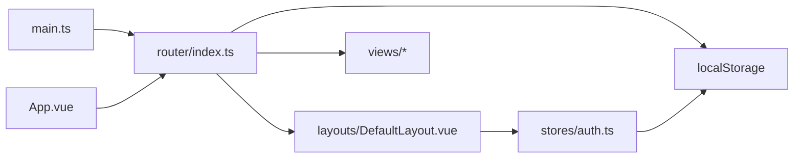

# Routing & Navigation Guards

<cite>
**Referenced Files in This Document**
- [index.ts](file://frontend/src/router/index.ts)
- [main.ts](file://frontend/src/main.ts)
- [App.vue](file://frontend/src/App.vue)
- [DefaultLayout.vue](file://frontend/src/layouts/DefaultLayout.vue)
- [auth.ts](file://frontend/src/stores/auth.ts)
- [Home.vue](file://frontend/src/views/Home.vue)
- [Login.vue](file://frontend/src/views/Login.vue)
- [AdminDashboard.vue](file://frontend/src/views/admin/AdminDashboard.vue)
</cite>

## Table of Contents
1. [Introduction](#introduction)
2. [Project Structure](#project-structure)
3. [Core Components](#core-components)
4. [Architecture Overview](#architecture-overview)
5. [Detailed Component Analysis](#detailed-component-analysis)
6. [Dependency Analysis](#dependency-analysis)
7. [Performance Considerations](#performance-considerations)
8. [Troubleshooting Guide](#troubleshooting-guide)
9. [Conclusion](#conclusion)

## Introduction
This document explains the Vue Router implementation and navigation system used by the frontend application. It covers route configuration (including nested routes, dynamic segments, lazy loading), navigation guards for authentication and role-based access control, meta fields usage, programmatic navigation patterns, transitions, and scroll behavior management. It also provides examples of protected routes, admin-only sections, and dynamic route generation based on user roles.

## Project Structure
The routing setup is centralized in a single router module and integrated into the app bootstrap. The root component renders the active view via a router outlet, while a default layout wraps most pages with header, sidebar, and main content areas.

**Diagram sources**
- [main.ts:10-14](file://frontend/src/main.ts#L10-L14)
- [index.ts:177-180](file://frontend/src/router/index.ts#L177-L180)
- [App.vue:1-3](file://frontend/src/App.vue#L1-L3)
- [DefaultLayout.vue:162-166](file://frontend/src/layouts/DefaultLayout.vue#L162-L166)

**Section sources**
- [main.ts:10-14](file://frontend/src/main.ts#L10-L14)
- [index.ts:177-180](file://frontend/src/router/index.ts#L177-L180)
- [App.vue:1-3](file://frontend/src/App.vue#L1-L3)
- [DefaultLayout.vue:162-166](file://frontend/src/layouts/DefaultLayout.vue#L162-L166)

## Core Components
- Router initialization and history mode are defined in the router module.
- Global navigation guards enforce authentication and role checks using meta flags.
- Layouts provide consistent UI and use programmatic navigation to move between views.
- Auth store persists tokens and user profile and exposes computed role flags used by both UI and guards.

Key responsibilities:
- Route definitions with nested structure under a shared layout.
- Lazy-loading of page components for code splitting.
- Dynamic route parameters for property details and payments.
- Guard logic that reads token and user from local storage and enforces permissions.

**Section sources**
- [index.ts:1-212](file://frontend/src/router/index.ts#L1-L212)
- [auth.ts:1-101](file://frontend/src/stores/auth.ts#L1-L101)
- [DefaultLayout.vue:171-225](file://frontend/src/layouts/DefaultLayout.vue#L171-L225)

## Architecture Overview
The router is created with HTML5 history mode and mounted during app bootstrap. A global before hook intercepts navigation to enforce access rules. Pages are loaded lazily via dynamic imports. The default layout composes header, sidebar, and a nested router-view for child routes.

**Diagram sources**
- [index.ts:177-212](file://frontend/src/router/index.ts#L177-L212)
- [auth.ts:13-16](file://frontend/src/stores/auth.ts#L13-L16)

## Detailed Component Analysis

### Route Configuration
- Nested routes: All public and authenticated pages are children of a DefaultLayout wrapper.
- Dynamic segments: Property detail and payment routes include path parameters.
- Lazy loading: Each route uses dynamic import for its component.
- Meta flags:
  - requiresAuth: Requires a valid token.
  - guest: Accessible only when not logged in.
  - requiresLandlord: Requires landlord or admin role.
  - requiresAdmin: Requires admin role.

Examples of protected routes:
- Profile and profile editing require authentication.
- Booking confirm and payment routes require authentication.
- Landlord workspace and booking management require landlord role.
- Admin dashboard and admin sub-routes require admin role.

Dynamic route examples:
- Property detail: path includes an id parameter.
- Payment routes: path includes an id parameter for pending deposit flows.

Guest-only routes:
- Login and register are marked as guest-only; if already authenticated, users are redirected to home.

**Section sources**
- [index.ts:5-175](file://frontend/src/router/index.ts#L5-L175)

### Navigation Guards
The global guard performs three checks in order:
1. Authentication: If a route has requiresAuth and there is no token, redirect to login with the original destination preserved in query.
2. Guest-only: If a route has guest and a token exists, redirect to home.
3. Role-based access:
   - requiresLandlord: Allow if user role is landlord or admin.
   - requiresAdmin: Allow only if user role is admin.

If all checks pass, navigation proceeds.

**Diagram sources**
- [index.ts:182-209](file://frontend/src/router/index.ts#L182-L209)

**Section sources**
- [index.ts:182-209](file://frontend/src/router/index.ts#L182-L209)

### Programmatic Navigation
Programmatic navigation is used throughout the app:
- Header and sidebar use router.push to navigate to profiles, bookings, admin, and workspace.
- Search and AI search compose query parameters and push to the search route.
- Home page navigates to property detail using a dynamic path string.
- Login flow reads a redirect query and navigates back after successful login.

Common patterns:
- Named route navigation with query objects.
- Path-based navigation with interpolated parameters.
- Conditional redirects after actions (e.g., booking confirmation).

**Section sources**
- [DefaultLayout.vue:32-81](file://frontend/src/layouts/DefaultLayout.vue#L32-L81)
- [DefaultLayout.vue:203-207](file://frontend/src/layouts/DefaultLayout.vue#L203-L207)
- [Home.vue:269-301](file://frontend/src/views/Home.vue#L269-L301)
- [Login.vue:98-104](file://frontend/src/views/Login.vue#L98-L104)

### Route Transitions
A simple CSS fade transition is defined globally for route changes. The App component includes CSS classes for enter/leave states, which can be applied to a Transition component wrapping the router-view to animate page switches.

Current state:
- Fade transition styles exist in the root component.
- No explicit Transition component is configured around router-view in the provided files.

Recommendation:
- Wrap the router-view with a Transition component using the existing CSS classes to enable smooth page transitions.

**Section sources**
- [App.vue:135-144](file://frontend/src/App.vue#L135-L144)

### Scroll Behavior Management
There is no custom scrollBehavior function defined in the router configuration. As a result, default browser scroll behavior applies on navigation.

Recommendation:
- Add a scrollBehavior function to the router to implement top-of-page scrolling on navigation or restore previous scroll positions per route.

**Section sources**
- [index.ts:177-180](file://frontend/src/router/index.ts#L177-L180)

### Protected Routes Examples
- Tenant profile and edit: require authentication.
- Booking confirm and payment: require authentication.
- Landlord workspace and booking management: require landlord role.
- Admin dashboard and admin sub-routes: require admin role.

These are enforced by the global guard using meta flags.

**Section sources**
- [index.ts:36-160](file://frontend/src/router/index.ts#L36-L160)
- [index.ts:192-206](file://frontend/src/router/index.ts#L192-L206)

### Admin-Only Sections
Admin routes are grouped under a common prefix and guarded by requiresAdmin. The sidebar conditionally shows admin menu items based on the current user’s role.

Example admin routes:
- Dashboard, users, properties, logs, embeddings, import.

**Section sources**
- [index.ts:120-160](file://frontend/src/router/index.ts#L120-L160)
- [DefaultLayout.vue:144-158](file://frontend/src/layouts/DefaultLayout.vue#L144-L158)

### Dynamic Route Generation Based on Roles
While routes are statically declared, their visibility and accessibility are dynamically controlled:
- Sidebar menu items are shown/hidden based on auth store flags.
- Guards prevent unauthorized access at the route level.

This approach avoids runtime route registration and keeps the route table declarative while enforcing role-based access consistently.

**Section sources**
- [DefaultLayout.vue:96-158](file://frontend/src/layouts/DefaultLayout.vue#L96-L158)
- [index.ts:199-206](file://frontend/src/router/index.ts#L199-L206)

## Dependency Analysis
The router depends on:
- Vue Router v4 for routing primitives and history mode.
- Local storage for token and user persistence.
- Auth store for derived role flags used in UI and guards.

**Diagram sources**
- [index.ts:177-212](file://frontend/src/router/index.ts#L177-L212)
- [main.ts:10-14](file://frontend/src/main.ts#L10-L14)
- [App.vue:1-3](file://frontend/src/App.vue#L1-L3)
- [auth.ts:17-29](file://frontend/src/stores/auth.ts#L17-L29)
- [DefaultLayout.vue:171-184](file://frontend/src/layouts/DefaultLayout.vue#L171-L184)

**Section sources**
- [package.json:22](file://frontend/package.json#L22)
- [index.ts:177-212](file://frontend/src/router/index.ts#L177-L212)
- [auth.ts:17-29](file://frontend/src/stores/auth.ts#L17-L29)

## Performance Considerations
- Lazy loading: All route components are imported dynamically, enabling code splitting and reducing initial bundle size.
- Avoid heavy computations in guards: The guard reads from localStorage and performs minimal checks, keeping navigation snappy.
- Consider adding scrollBehavior to avoid unnecessary reflows and improve perceived performance.
- Consider caching user data in Pinia to reduce redundant API calls when refreshing routes.

[No sources needed since this section provides general guidance]

## Troubleshooting Guide
Common issues and resolutions:
- Redirect loops on protected routes: Ensure the target route does not have conflicting meta flags (e.g., requiresAuth vs guest) and that the redirect destination is accessible to the current role.
- Missing token or malformed user object: The guard parses user JSON safely; invalid data should be cleared to prevent repeated failures.
- Unauthorized access to admin or landlord routes: Verify the user’s role matches the required meta flag and that the sidebar reflects the correct permissions.
- Unexpected scroll position after navigation: Implement a scrollBehavior function to reset or restore scroll positions.

**Section sources**
- [index.ts:182-209](file://frontend/src/router/index.ts#L182-L209)
- [auth.ts:31-42](file://frontend/src/stores/auth.ts#L31-L42)

## Conclusion
The routing system is declarative, secure, and optimized for performance through lazy loading. Global guards enforce authentication and role-based access using meta flags, while the layout and stores provide consistent UI and state. Enhancements such as explicit route transitions and scroll behavior can further improve user experience.