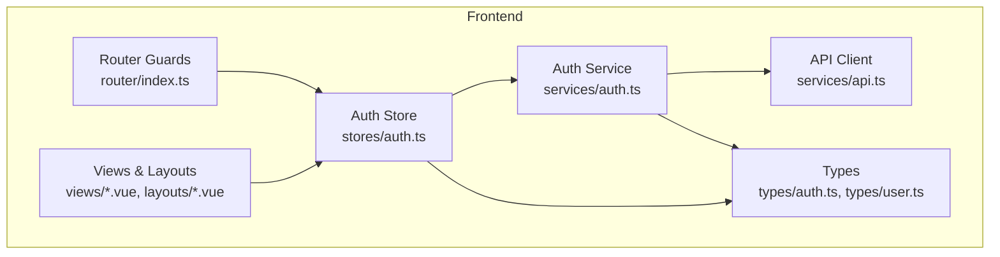
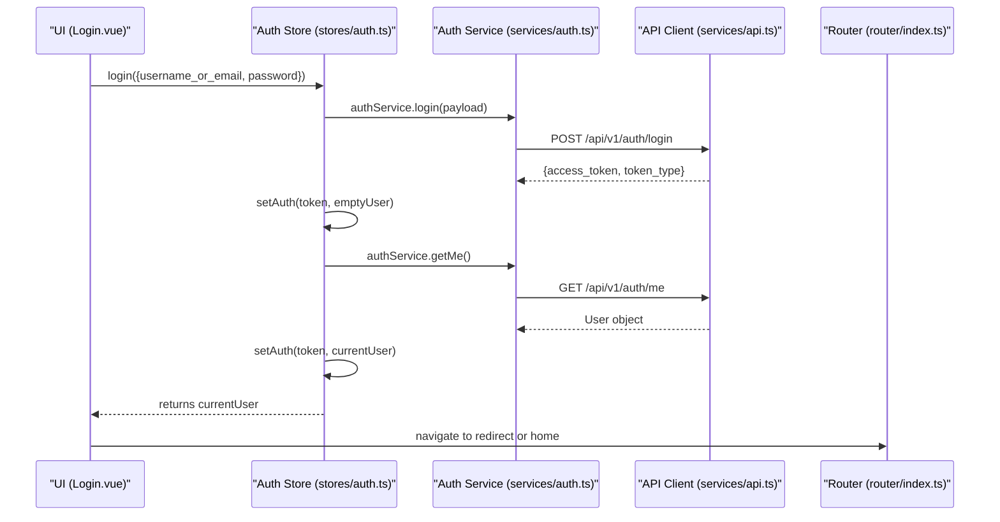
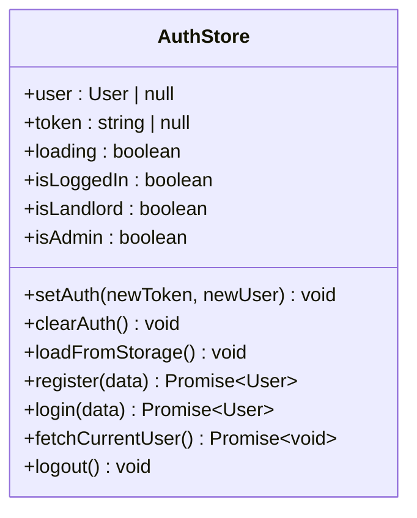
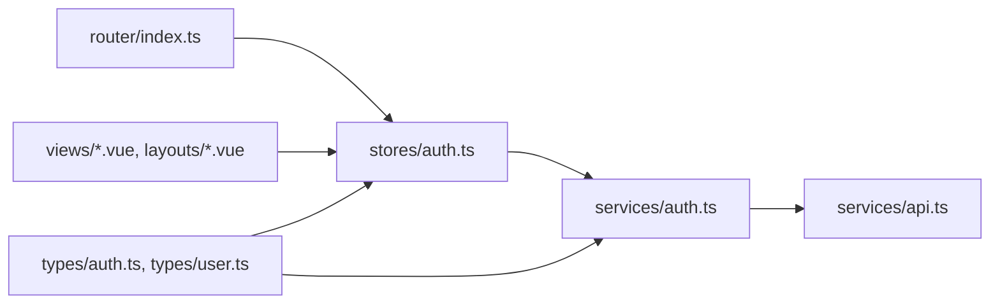
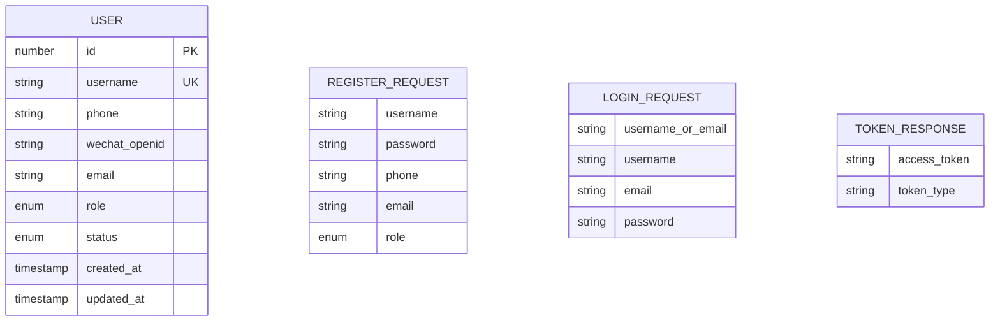

# Authentication Store

<cite>
**Referenced Files in This Document**
- [auth.ts](file://frontend/src/stores/auth.ts)
- [auth.ts](file://frontend/src/services/auth.ts)
- [api.ts](file://frontend/src/services/api.ts)
- [index.ts](file://frontend/src/router/index.ts)
- [auth.ts](file://frontend/src/types/auth.ts)
- [user.ts](file://frontend/src/types/user.ts)
- [Login.vue](file://frontend/src/views/Login.vue)
- [Register.vue](file://frontend/src/views/Register.vue)
- [DefaultLayout.vue](file://frontend/src/layouts/DefaultLayout.vue)
- [auth.test.ts](file://frontend/src/__tests__/stores/auth.test.ts)
</cite>

## Table of Contents
1. [Introduction](#introduction)
2. [Project Structure](#project-structure)
3. [Core Components](#core-components)
4. [Architecture Overview](#architecture-overview)
5. [Detailed Component Analysis](#detailed-component-analysis)
6. [Dependency Analysis](#dependency-analysis)
7. [Performance Considerations](#performance-considerations)
8. [Troubleshooting Guide](#troubleshooting-guide)
9. [Conclusion](#conclusion)
10. [Appendices](#appendices)

## Introduction
This document explains the frontend authentication store implementation and how it integrates with services, routing, and UI components to provide a complete authentication flow. It covers reactive state (user, token, loading), computed role checks (isLoggedIn, isLandlord, isAdmin), actions (register, login, logout, fetchCurrentUser, loadFromStorage), JWT token management via localStorage, automatic session restoration, and examples of usage across views and navigation guards for protected routes.

## Project Structure
The authentication feature spans several modules:
- Store: central reactive state and actions
- Services: HTTP client configuration and auth API calls
- Types: request/response schemas and user model
- Router: global navigation guards for protected routes
- Views/Layouts: UI integration and user flows

**Diagram sources**
- [auth.ts:1-101](file://frontend/src/stores/auth.ts#L1-L101)
- [auth.ts:1-22](file://frontend/src/services/auth.ts#L1-L22)
- [api.ts:1-56](file://frontend/src/services/api.ts#L1-L56)
- [index.ts:1-212](file://frontend/src/router/index.ts#L1-L212)
- [auth.ts:1-23](file://frontend/src/types/auth.ts#L1-L23)
- [user.ts:1-24](file://frontend/src/types/user.ts#L1-L24)

**Section sources**
- [auth.ts:1-101](file://frontend/src/stores/auth.ts#L1-L101)
- [auth.ts:1-22](file://frontend/src/services/auth.ts#L1-L22)
- [api.ts:1-56](file://frontend/src/services/api.ts#L1-L56)
- [index.ts:1-212](file://frontend/src/router/index.ts#L1-L212)
- [auth.ts:1-23](file://frontend/src/types/auth.ts#L1-L23)
- [user.ts:1-24](file://frontend/src/types/user.ts#L1-L24)

## Core Components
- Auth Store (Pinia): Holds reactive state (user, token, loading), computed flags (isLoggedIn, isLandlord, isAdmin), and actions (register, login, logout, fetchCurrentUser, loadFromStorage). Persists token and user to localStorage and restores on initialization.
- Auth Service: Thin wrapper over axios endpoints for register, login, and getMe.
- API Client: Axios instance with base URL, timeout, and interceptors that attach Authorization headers and handle 401 errors globally.
- Router Guards: Global beforeEach hook enforces requiresAuth, guest, requiresLandlord, and requiresAdmin route metadata.
- Types: Request/response interfaces and User model used by store and services.

Key responsibilities:
- State synchronization between Pinia and localStorage
- Role-based computed properties
- Centralized error handling via service interceptors
- Navigation protection based on roles

**Section sources**
- [auth.ts:1-101](file://frontend/src/stores/auth.ts#L1-L101)
- [auth.ts:1-22](file://frontend/src/services/auth.ts#L1-L22)
- [api.ts:1-56](file://frontend/src/services/api.ts#L1-L56)
- [index.ts:177-212](file://frontend/src/router/index.ts#L177-L212)
- [auth.ts:1-23](file://frontend/src/types/auth.ts#L1-L23)
- [user.ts:1-24](file://frontend/src/types/user.ts#L1-L24)

## Architecture Overview
The authentication architecture follows a layered approach:
- UI layers call store actions
- Store delegates to service methods
- Service uses an axios client with interceptors
- Router guards enforce access control using localStorage and route meta

**Diagram sources**
- [auth.ts:54-66](file://frontend/src/stores/auth.ts#L54-L66)
- [auth.ts:10-21](file://frontend/src/services/auth.ts#L10-L21)
- [api.ts:12-22](file://frontend/src/services/api.ts#L12-L22)
- [index.ts:182-209](file://frontend/src/router/index.ts#L182-L209)

## Detailed Component Analysis

### Auth Store (Pinia)
Reactive state:
- user: current user profile (nullable)
- token: JWT access token (nullable)
- loading: async operation indicator

Computed properties:
- isLoggedIn: true when token exists
- isLandlord: true if user role is landlord or admin
- isAdmin: true if user role is admin

Actions:
- setAuth(newToken, newUser): updates state and persists to localStorage
- clearAuth(): resets state and removes persisted data
- loadFromStorage(): restores token and user from localStorage; handles corrupt JSON gracefully
- register(data): calls backend registration and returns created user
- login(data): authenticates, sets initial token, fetches full user profile, then updates state
- fetchCurrentUser(): refreshes user profile and syncs localStorage; clears auth on failure
- logout(): clears auth and navigates to login page

Initialization:
- Automatically loads persisted session on store creation

Error handling:
- Uses try/finally to reset loading state
- Relies on API interceptor for 401 handling and user feedback

Persistence:
- Stores access_token and user JSON in localStorage
- Restores on store init and after successful operations

Role-based access control:
- Computed flags drive UI visibility and router guard decisions

Usage examples:
- Login view binds form submission to store.login and shows success message before navigation
- Register view validates input, calls store.register, and redirects to login
- Default layout reads isLoggedIn, isAdmin, isLandlord to render menus and badges

**Section sources**
- [auth.ts:8-101](file://frontend/src/stores/auth.ts#L8-L101)
- [Login.vue:88-104](file://frontend/src/views/Login.vue#L88-L104)
- [Register.vue:85-114](file://frontend/src/views/Register.vue#L85-L114)
- [DefaultLayout.vue:26-82](file://frontend/src/layouts/DefaultLayout.vue#L26-L82)

#### Class-like Diagram of Auth Store

**Diagram sources**
- [auth.ts:8-101](file://frontend/src/stores/auth.ts#L8-L101)

### Auth Service and API Client
Service methods:
- register(RegisterRequest): POST /auth/register
- login(LoginRequest): POST /auth/login with normalized username/email field
- getMe(): GET /auth/me

API client behavior:
- Base URL: /api/v1
- Timeout: 10 seconds
- Request interceptor: attaches Authorization header with Bearer token from localStorage
- Response interceptor:
  - On 401: clears localStorage tokens and redirects to /login unless already on login page; displays error detail
  - On other errors: extracts detail (string or array) and shows messages

Type contracts:
- RegisterRequest, LoginRequest, TokenResponse define payloads
- User defines profile shape including role and status

**Section sources**
- [auth.ts:1-22](file://frontend/src/services/auth.ts#L1-L22)
- [api.ts:1-56](file://frontend/src/services/api.ts#L1-L56)
- [auth.ts:1-23](file://frontend/src/types/auth.ts#L1-L23)
- [user.ts:1-24](file://frontend/src/types/user.ts#L1-L24)

### Router Guards and Protected Routes
Route metadata:
- requiresAuth: must be logged in
- guest: only accessible when not logged in
- requiresLandlord: user role must be landlord or admin
- requiresAdmin: user role must be admin

Guard logic:
- Reads access_token and user from localStorage
- Redirects unauthenticated users to login with redirect query
- Redirects authenticated users away from guest-only pages
- Enforces landlord/admin roles per route

Integration with store:
- While guards read directly from localStorage, the store maintains synchronized state and provides computed flags for UI rendering

**Section sources**
- [index.ts:177-212](file://frontend/src/router/index.ts#L177-L212)

### UI Integration Examples
- Login.vue:
  - Validates form fields
  - Calls store.login with normalized payload
  - Shows success message and navigates to redirect or home
- Register.vue:
  - Validates inputs including password confirmation
  - Calls store.register and navigates to login
- DefaultLayout.vue:
  - Displays role tags and menu items based on isLoggedIn, isLandlord, isAdmin
  - Provides logout action that triggers store.logout

**Section sources**
- [Login.vue:88-104](file://frontend/src/views/Login.vue#L88-L104)
- [Register.vue:85-114](file://frontend/src/views/Register.vue#L85-L114)
- [DefaultLayout.vue:26-82](file://frontend/src/layouts/DefaultLayout.vue#L26-L82)

## Dependency Analysis

**Diagram sources**
- [auth.ts:1-101](file://frontend/src/stores/auth.ts#L1-L101)
- [auth.ts:1-22](file://frontend/src/services/auth.ts#L1-L22)
- [api.ts:1-56](file://frontend/src/services/api.ts#L1-L56)
- [index.ts:177-212](file://frontend/src/router/index.ts#L177-L212)
- [auth.ts:1-23](file://frontend/src/types/auth.ts#L1-L23)
- [user.ts:1-24](file://frontend/src/types/user.ts#L1-L24)

Observations:
- Cohesion: The store encapsulates all auth-related state and actions
- Coupling: Store depends on service layer; service depends on API client; router guards depend on localStorage and route meta
- External dependencies: axios for HTTP, Element Plus for UI messaging, Vue Router for navigation

Potential circular dependencies:
- None detected among core files

External integration points:
- Backend auth endpoints (/api/v1/auth/*)
- Local storage for persistence
- Vue Router for navigation guards

**Section sources**
- [auth.ts:1-101](file://frontend/src/stores/auth.ts#L1-L101)
- [auth.ts:1-22](file://frontend/src/services/auth.ts#L1-L22)
- [api.ts:1-56](file://frontend/src/services/api.ts#L1-L56)
- [index.ts:177-212](file://frontend/src/router/index.ts#L177-L212)

## Performance Considerations
- Minimal reactivity overhead: Only three refs and three computed values are exposed
- Efficient persistence: localStorage writes occur only on state changes (setAuth, loadFromStorage, fetchCurrentUser)
- Interceptor-level error handling avoids repeated try/catch blocks in components
- Lazy route components reduce initial bundle size

[No sources needed since this section provides general guidance]

## Troubleshooting Guide
Common issues and strategies:
- Corrupt localStorage user JSON:
  - loadFromStorage catches parse errors and clears auth to prevent inconsistent state
- 401 Unauthorized responses:
  - API interceptor clears tokens and redirects to login unless already on login page; displays server-provided error details
- Inconsistent UI vs. router state:
  - Ensure store is initialized early and that components use store.computed flags rather than direct localStorage reads
- Registration failures:
  - Register view surfaces backend detail messages; ensure proper validation before calling store.register

Verification via tests:
- Initial state assertions
- Storage restoration and corruption handling
- Logout clearing state
- Role-based computed flags correctness
- setAuth persistence behavior

**Section sources**
- [auth.ts:31-42](file://frontend/src/stores/auth.ts#L31-L42)
- [api.ts:24-54](file://frontend/src/services/api.ts#L24-L54)
- [auth.test.ts:24-86](file://frontend/src/__tests__/stores/auth.test.ts#L24-L86)

## Conclusion
The authentication store provides a clean, reactive interface for managing user sessions, roles, and UI state. It integrates tightly with the API client for secure requests and with the router for protecting routes. Role-based computed properties simplify conditional UI rendering, while centralized error handling improves user experience. The design balances simplicity and robustness, making it straightforward to extend with additional auth features such as token refresh or multi-factor authentication.

[No sources needed since this section summarizes without analyzing specific files]

## Appendices

### Data Models

**Diagram sources**
- [user.ts:1-24](file://frontend/src/types/user.ts#L1-L24)
- [auth.ts:1-23](file://frontend/src/types/auth.ts#L1-L23)