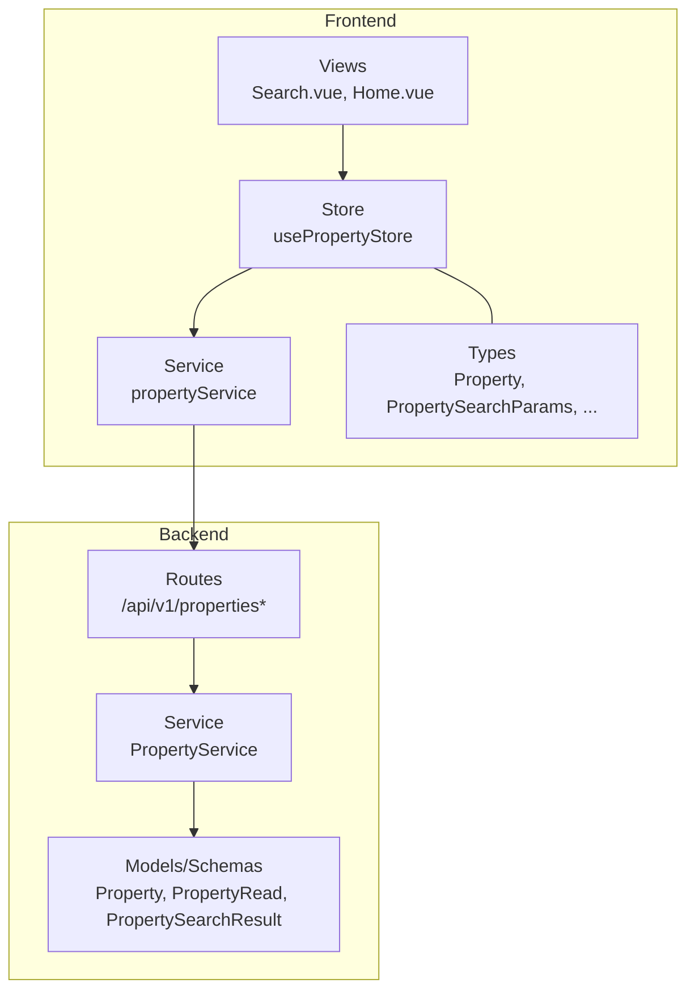
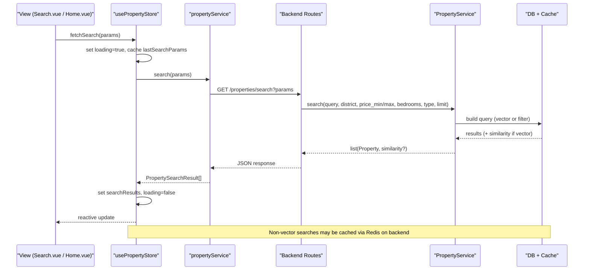
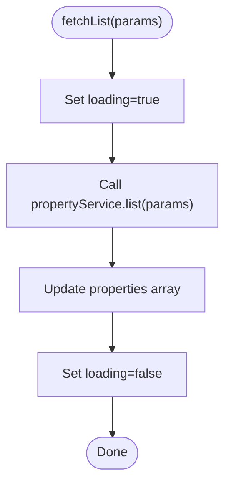
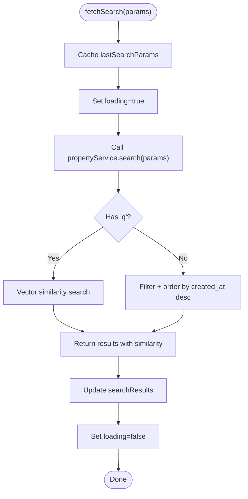
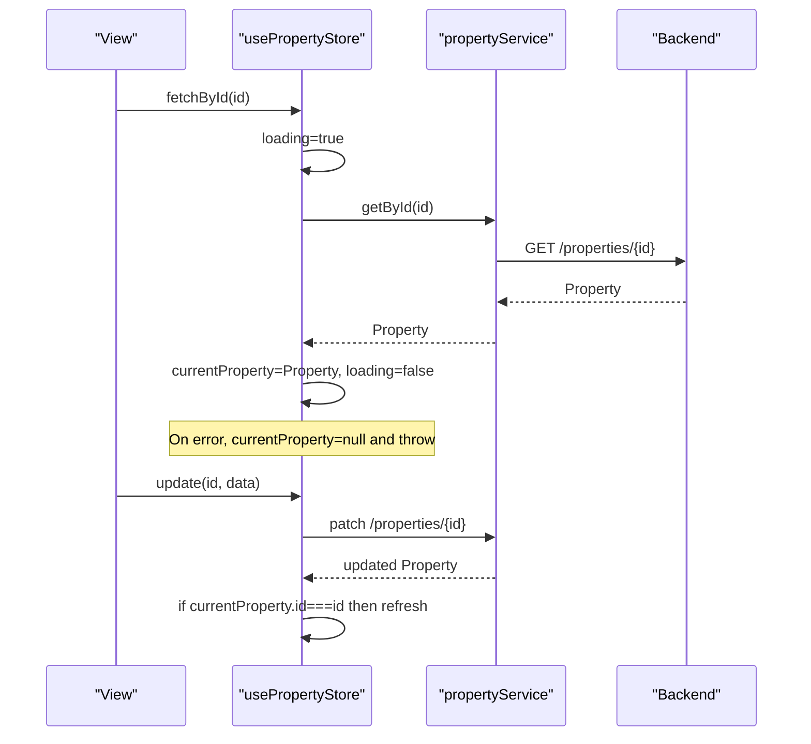
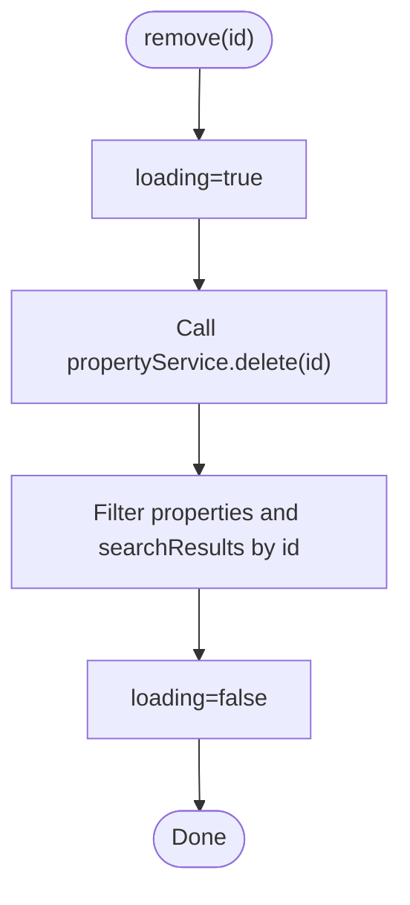
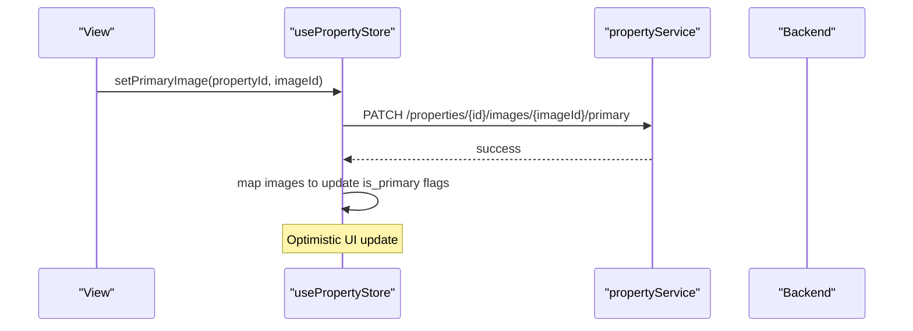
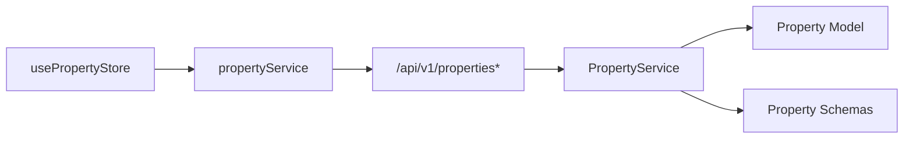

# Property Store

<cite>
**Referenced Files in This Document**
- [property.ts](file://frontend/src/stores/property.ts)
- [property.ts](file://frontend/src/services/property.ts)
- [property.ts](file://frontend/src/types/property.ts)
- [properties.py](file://backend/app/api/v1/routes/properties.py)
- [property_service.py](file://backend/app/services/property_service.py)
- [property.py](file://backend/app/models/property.py)
- [property.py](file://backend/app/schemas/property.py)
- [Search.vue](file://frontend/src/views/Search.vue)
- [Home.vue](file://frontend/src/views/Home.vue)
- [property.test.ts](file://frontend/src/__tests__/stores/property.test.ts)
</cite>

## Table of Contents
1. [Introduction](#introduction)
2. [Project Structure](#project-structure)
3. [Core Components](#core-components)
4. [Architecture Overview](#architecture-overview)
5. [Detailed Component Analysis](#detailed-component-analysis)
6. [Dependency Analysis](#dependency-analysis)
7. [Performance Considerations](#performance-considerations)
8. [Troubleshooting Guide](#troubleshooting-guide)
9. [Conclusion](#conclusion)

## Introduction
This document explains the frontend property store implementation and its integration with the backend property API. It covers state management for listings, search results, filtering options, reactive properties for current selection and loading states, actions for fetching and mutating data, image management, and error handling patterns. It also clarifies how complex property data structures are handled, how search is implemented (including semantic search), and how the store synchronizes with backend data.

## Project Structure
The property feature spans three main layers:
- Frontend store: central state and actions
- Frontend service: HTTP calls to backend endpoints
- Backend API and service: REST endpoints, business logic, caching, and database access

**Diagram sources**
- [property.ts:1-136](file://frontend/src/stores/property.ts#L1-L136)
- [property.ts:1-86](file://frontend/src/services/property.ts#L1-L86)
- [property.ts:1-95](file://frontend/src/types/property.ts#L1-L95)
- [properties.py:1-162](file://backend/app/api/v1/routes/properties.py#L1-L162)
- [property_service.py:1-239](file://backend/app/services/property_service.py#L1-L239)
- [property.py:1-86](file://backend/app/models/property.py#L1-L86)
- [property.py:1-79](file://backend/app/schemas/property.py#L1-L79)

**Section sources**
- [property.ts:1-136](file://frontend/src/stores/property.ts#L1-L136)
- [property.ts:1-86](file://frontend/src/services/property.ts#L1-L86)
- [property.ts:1-95](file://frontend/src/types/property.ts#L1-L95)
- [properties.py:1-162](file://backend/app/api/v1/routes/properties.py#L1-L162)
- [property_service.py:1-239](file://backend/app/services/property_service.py#L1-L239)
- [property.py:1-86](file://backend/app/models/property.py#L1-L86)
- [property.py:1-79](file://backend/app/schemas/property.py#L1-L79)

## Core Components
- Reactive state:
  - properties: array of Property objects for listing pages
  - searchResults: array of PropertySearchResult for search pages
  - currentProperty: single selected property detail
  - loading: global loading flag for property operations
  - lastSearchParams: cached search parameters
  - propertyImages: images for a specific property
  - imagesLoading: loading flag for image operations
- Actions:
  - fetchList(params): list properties with pagination and filters
  - fetchSearch(params): perform search with optional natural language query
  - fetchById(id): load a single property by id
  - create(data): create a new property
  - update(id, data): update an existing property and refresh currentProperty if needed
  - remove(id): delete a property and remove from local arrays
  - Image management: fetchImages, uploadImages, deleteImage, setPrimaryImage

Key behaviors:
- Loading flags wrap async operations to provide UI feedback
- Search results include similarity scores when using semantic search
- Images are managed per property with optimistic updates after server confirmation
- Removals are applied locally immediately after successful deletion

**Section sources**
- [property.ts:6-136](file://frontend/src/stores/property.ts#L6-L136)
- [property.ts:28-86](file://frontend/src/services/property.ts#L28-L86)
- [property.ts:1-95](file://frontend/src/types/property.ts#L1-L95)

## Architecture Overview
End-to-end flow for common operations:

**Diagram sources**
- [property.ts:26-34](file://frontend/src/stores/property.ts#L26-L34)
- [property.ts:33-35](file://frontend/src/services/property.ts#L33-L35)
- [properties.py:36-91](file://backend/app/api/v1/routes/properties.py#L36-L91)
- [property_service.py:91-195](file://backend/app/services/property_service.py#L91-L195)

## Detailed Component Analysis

### Store State and Reactive Properties
- properties: ref<Property[]>
- searchResults: ref<PropertySearchResult[]>
- currentProperty: ref<Property | null>
- loading: ref<boolean>
- lastSearchParams: ref<PropertySearchParams>
- propertyImages: ref<PropertyImage[]>
- imagesLoading: ref<boolean>

These refs are reactive and consumed by views via Pinia’s storeToRefs.

**Section sources**
- [property.ts:6-16](file://frontend/src/stores/property.ts#L6-L16)

### Listing and Pagination
- fetchList(params?): loads paginated properties with skip/limit and optional district/status filters
- The backend supports skip, limit, district, and status aliasing
- Views typically call fetchList on mount to populate initial listings

**Diagram sources**
- [property.ts:17-24](file://frontend/src/stores/property.ts#L17-L24)
- [property.ts:29-31](file://frontend/src/services/property.ts#L29-L31)
- [properties.py:94-107](file://backend/app/api/v1/routes/properties.py#L94-L107)

**Section sources**
- [property.ts:17-24](file://frontend/src/stores/property.ts#L17-L24)
- [property.ts:29-31](file://frontend/src/services/property.ts#L29-L31)
- [properties.py:94-107](file://backend/app/api/v1/routes/properties.py#L94-L107)
- [Home.vue:310-312](file://frontend/src/views/Home.vue#L310-L312)

### Search and Filtering
- fetchSearch(params): stores lastSearchParams, sets loading, calls propertyService.search, updates searchResults
- Supports natural language query q and structured filters: district, price_min/max, bedrooms, property_type, limit
- Backend performs pgvector-based similarity search when q is provided; otherwise applies filters and orders by created_at desc
- Non-vector searches are cached via Redis on the backend

**Diagram sources**
- [property.ts:26-34](file://frontend/src/stores/property.ts#L26-L34)
- [property.ts:33-35](file://frontend/src/services/property.ts#L33-L35)
- [properties.py:36-91](file://backend/app/api/v1/routes/properties.py#L36-L91)
- [property_service.py:91-195](file://backend/app/services/property_service.py#L91-L195)

**Section sources**
- [property.ts:26-34](file://frontend/src/stores/property.ts#L26-L34)
- [property.ts:33-35](file://frontend/src/services/property.ts#L33-L35)
- [properties.py:36-91](file://backend/app/api/v1/routes/properties.py#L36-L91)
- [property_service.py:91-195](file://backend/app/services/property_service.py#L91-L195)
- [Search.vue:319-338](file://frontend/src/views/Search.vue#L319-L338)

### Current Property Selection and Detail Loading
- fetchById(id): sets loading, loads a single property into currentProperty, clears it on failure
- update(id, data): updates the property and refreshes currentProperty if it matches the updated id

**Diagram sources**
- [property.ts:36-69](file://frontend/src/stores/property.ts#L36-L69)
- [property.ts:37-47](file://frontend/src/services/property.ts#L37-L47)
- [properties.py:110-141](file://backend/app/api/v1/routes/properties.py#L110-L141)

**Section sources**
- [property.ts:36-69](file://frontend/src/stores/property.ts#L36-L69)
- [property.ts:37-47](file://frontend/src/services/property.ts#L37-L47)
- [properties.py:110-141](file://backend/app/api/v1/routes/properties.py#L110-L141)

### Property CRUD Operations
- create(data): posts a new property and returns the created object
- update(id, data): patches an existing property and refreshes currentProperty if needed
- remove(id): deletes a property and removes it from both properties and searchResults arrays

Optimistic behavior:
- For removals, the store filters out the deleted item from local arrays immediately after successful server deletion
- For primary image changes, the store updates is_primary flags locally after server confirmation

**Diagram sources**
- [property.ts:105-114](file://frontend/src/stores/property.ts#L105-L114)
- [property.ts:57-59](file://frontend/src/services/property.ts#L57-L59)
- [properties.py:144-162](file://backend/app/api/v1/routes/properties.py#L144-L162)

**Section sources**
- [property.ts:48-69](file://frontend/src/stores/property.ts#L48-L69)
- [property.ts:105-114](file://frontend/src/stores/property.ts#L105-L114)
- [property.ts:41-47](file://frontend/src/services/property.ts#L41-L47)
- [property.ts:57-59](file://frontend/src/services/property.ts#L57-L59)
- [properties.py:16-33](file://backend/app/api/v1/routes/properties.py#L16-L33)
- [properties.py:121-141](file://backend/app/api/v1/routes/properties.py#L121-L141)
- [properties.py:144-162](file://backend/app/api/v1/routes/properties.py#L144-L162)

### Image Management
- fetchImages(propertyId): loads images for a property
- uploadImages(propertyId, files): uploads images and refreshes the image list
- deleteImage(propertyId, imageId): deletes an image and removes it from local array
- setPrimaryImage(propertyId, imageId): marks an image as primary and updates local flags

Optimistic updates:
- After setPrimaryImage, the store maps over images to flip is_primary flags without waiting for a full reload
- After deleteImage, the store filters out the deleted image from the local array

**Diagram sources**
- [property.ts:97-103](file://frontend/src/stores/property.ts#L97-L103)
- [property.ts:78-80](file://frontend/src/services/property.ts#L78-L80)
- [properties.py:121-141](file://backend/app/api/v1/routes/properties.py#L121-L141)

**Section sources**
- [property.ts:72-103](file://frontend/src/stores/property.ts#L72-L103)
- [property.ts:62-80](file://frontend/src/services/property.ts#L62-L80)

### Data Models and Types
- Property: core entity fields including identifiers, location, pricing, attributes, timestamps, and optional images
- PropertyCreate/PropertyUpdate: input schemas for mutations
- PropertySearchResult: extends Property with similarity score
- PropertySearchParams: search parameters including natural language query and filters
- PropertyImage: image metadata and ordering

Notes:
- Backend schema adds computed primary_image_url based on images
- Backend model includes enums for property_type and property_status, plus constraints and indexes

**Section sources**
- [property.ts:1-95](file://frontend/src/types/property.ts#L1-L95)
- [property.py:11-79](file://backend/app/schemas/property.py#L11-L79)
- [property.py:24-86](file://backend/app/models/property.py#L24-L86)

### Integration Points and Usage Examples
- Search page composes filters, maps country/overseas_area to district, and triggers fetchSearch
- Home page initializes by calling fetchList with a small limit to show featured items

Examples:
- Search view builds params and calls propertyStore.fetchSearch(params)
- Home view calls propertyStore.fetchList({ limit: 6 }) on mount

**Section sources**
- [Search.vue:319-338](file://frontend/src/views/Search.vue#L319-L338)
- [Home.vue:310-312](file://frontend/src/views/Home.vue#L310-L312)

## Dependency Analysis
The store depends on the service layer, which wraps HTTP requests to backend routes. The backend routes depend on services and models/schemas.

**Diagram sources**
- [property.ts:1-136](file://frontend/src/stores/property.ts#L1-L136)
- [property.ts:1-86](file://frontend/src/services/property.ts#L1-L86)
- [properties.py:1-162](file://backend/app/api/v1/routes/properties.py#L1-L162)
- [property_service.py:1-239](file://backend/app/services/property_service.py#L1-L239)
- [property.py:1-86](file://backend/app/models/property.py#L1-L86)
- [property.py:1-79](file://backend/app/schemas/property.py#L1-L79)

**Section sources**
- [property.ts:1-136](file://frontend/src/stores/property.ts#L1-L136)
- [property.ts:1-86](file://frontend/src/services/property.ts#L1-L86)
- [properties.py:1-162](file://backend/app/api/v1/routes/properties.py#L1-L162)
- [property_service.py:1-239](file://backend/app/services/property_service.py#L1-L239)

## Performance Considerations
- Backend caching: non-vector search queries are cached via Redis with a TTL, improving performance for repeated filter-based searches
- Vector search: uses pgvector similarity for natural language queries; consider limiting result size and avoiding excessive concurrent queries
- Frontend loading flags: prevent redundant UI flicker and allow user feedback during network operations
- Local optimizations: immediate local updates for deletions and primary image changes reduce perceived latency

[No sources needed since this section provides general guidance]

## Troubleshooting Guide
Common issues and patterns:
- Network errors:
  - fetchById throws an error and resets currentProperty to null; ensure callers handle rejection and display user-friendly messages
- Validation errors:
  - Backend enforces field constraints and ownership checks; expect 4xx responses for invalid inputs or unauthorized actions
- Image operations:
  - Ensure Content-Type multipart/form-data is used for uploads; verify file sizes and supported formats
- Search parameter mapping:
  - Frontend maps country/overseas_area to district before sending; confirm correct mapping when debugging unexpected results

Relevant tests:
- Unit tests cover initialization, listing, search, creation, update, removal, and image operations

**Section sources**
- [property.ts:36-46](file://frontend/src/stores/property.ts#L36-L46)
- [property.ts:66-72](file://frontend/src/services/property.ts#L66-L72)
- [property.test.ts:49-126](file://frontend/src/__tests__/stores/property.test.ts#L49-L126)

## Conclusion
The property store provides a clear, reactive interface for managing property listings, search results, and images while integrating seamlessly with the backend API. It balances UX responsiveness through optimistic updates and robust error handling. The backend complements this with efficient search (including vector similarity), caching, and strong validation. Together, they deliver a scalable and maintainable solution for property discovery and management.