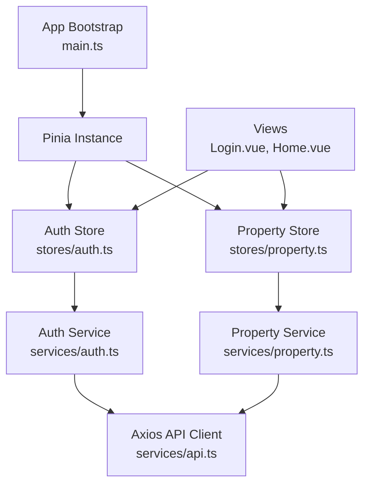
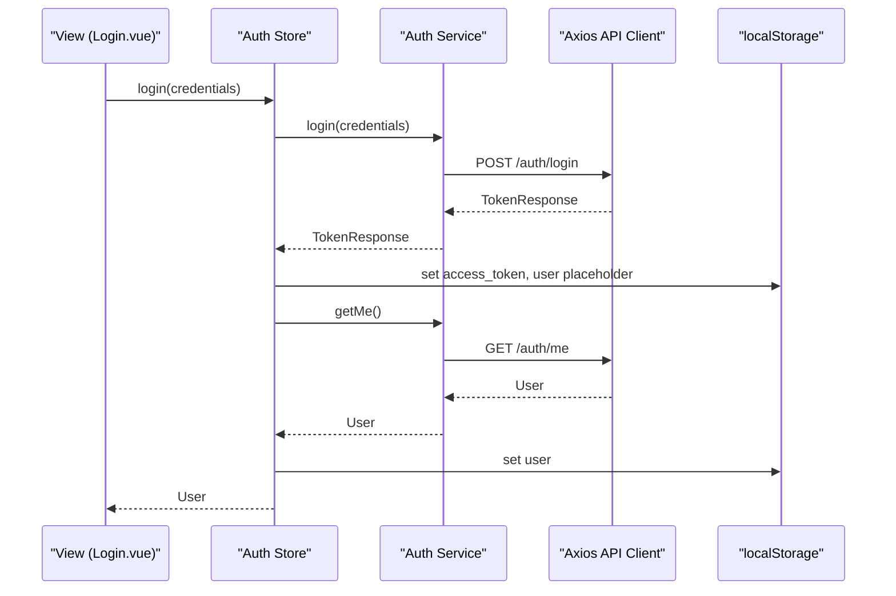
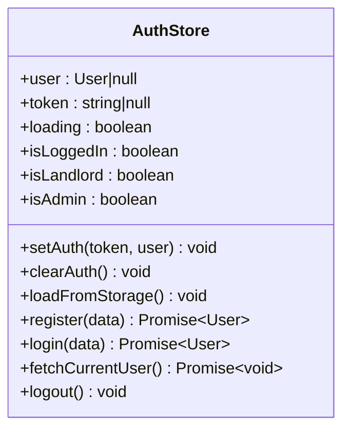
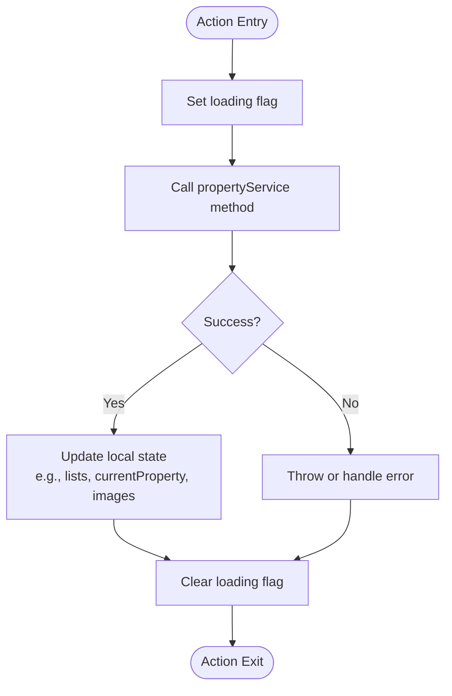
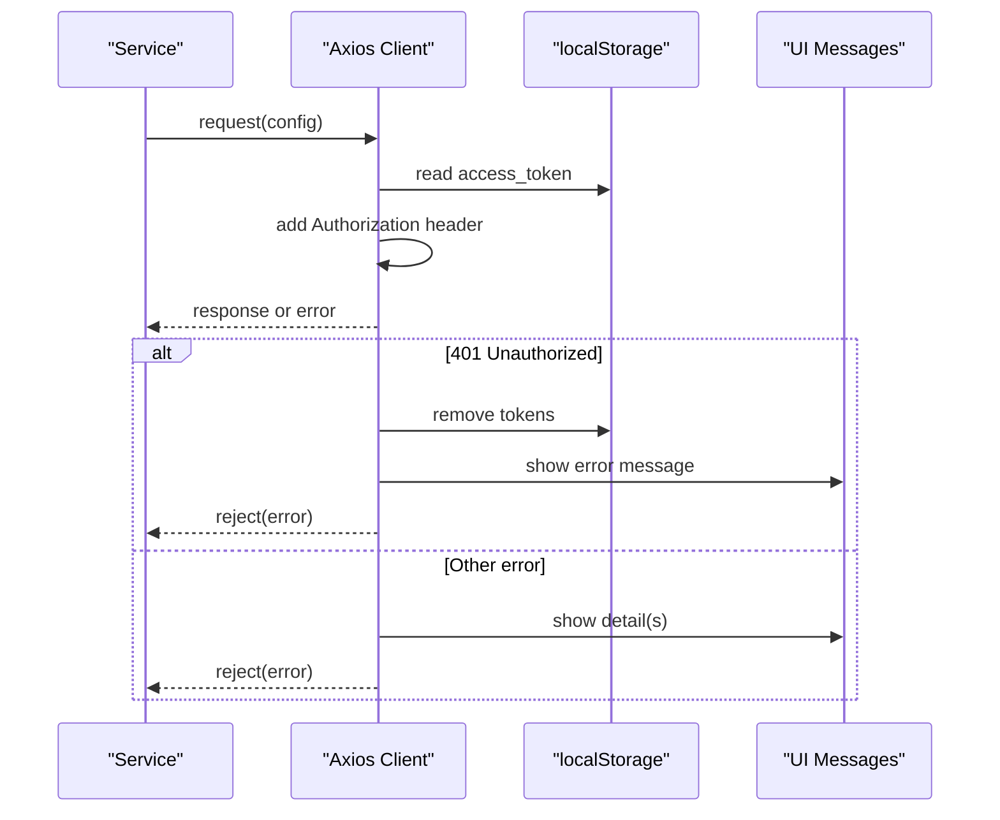
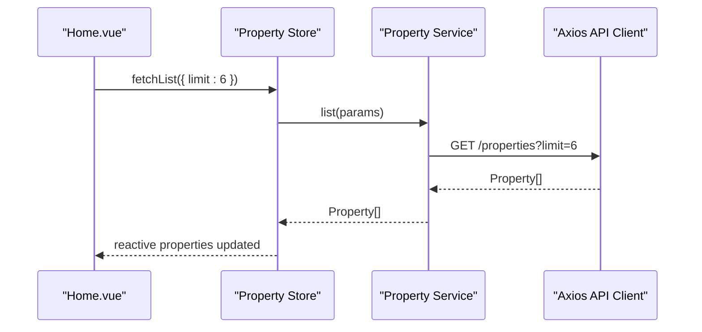
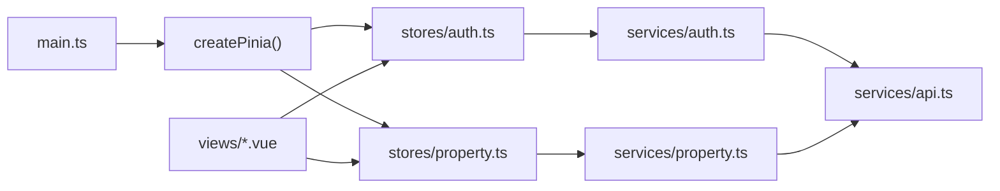

# State Management with Pinia

<cite>
**Referenced Files in This Document**
- [main.ts](file://frontend/src/main.ts)
- [auth.ts](file://frontend/src/stores/auth.ts)
- [property.ts](file://frontend/src/stores/property.ts)
- [api.ts](file://frontend/src/services/api.ts)
- [auth.ts](file://frontend/src/services/auth.ts)
- [property.ts](file://frontend/src/services/property.ts)
- [auth.ts](file://frontend/src/types/auth.ts)
- [user.ts](file://frontend/src/types/user.ts)
- [property.ts](file://frontend/src/types/property.ts)
- [Login.vue](file://frontend/src/views/Login.vue)
- [Home.vue](file://frontend/src/views/Home.vue)
- [auth.test.ts](file://frontend/src/__tests__/stores/auth.test.ts)
- [property.test.ts](file://frontend/src/__tests__/stores/property.test.ts)
- [package.json](file://frontend/package.json)
</cite>

## Table of Contents
1. Introduction
2. Project Structure
3. Core Components
4. Architecture Overview
5. Detailed Component Analysis
6. Dependency Analysis
7. Performance Considerations
8. Troubleshooting Guide
9. Conclusion
10. Appendices

## Introduction
This document explains the Pinia-based state management implementation for the frontend, focusing on:
- Store architecture for authentication and property data
- Reactive state patterns, actions, and getters
- Integration with API services for data synchronization
- Error handling and optimistic updates
- State persistence strategies
- Debugging with Vue DevTools
- Performance optimization for large datasets
- Store composition techniques, modular design, and testing strategies

## Project Structure
The frontend uses a feature-oriented structure with dedicated stores, services, types, and views. Pinia is initialized at application bootstrap and used across components via composable store functions.

**Diagram sources**
- [main.ts:10-14](file://frontend/src/main.ts#L10-L14)
- [auth.ts](file://frontend/src/stores/auth.ts)
- [property.ts](file://frontend/src/stores/property.ts)
- [auth.ts](file://frontend/src/services/auth.ts)
- [property.ts](file://frontend/src/services/property.ts)
- [api.ts](file://frontend/src/services/api.ts)
- [Login.vue](file://frontend/src/views/Login.vue)
- [Home.vue](file://frontend/src/views/Home.vue)

**Section sources**
- [main.ts:10-14](file://frontend/src/main.ts#L10-L14)
- [package.json:14-23](file://frontend/package.json#L14-L23)

## Core Components
- Auth Store: Manages user identity, token, loading state, computed roles, and persistence to localStorage. Provides login, register, logout, and current user fetching.
- Property Store: Manages lists, search results, current property detail, images, and CRUD operations. Keeps last search params and image loading state.

Key reactive patterns:
- Refs for mutable state (e.g., user, token, properties, loading flags)
- Computed values for derived state (e.g., isLoggedIn, isLandlord, isAdmin)
- Actions encapsulating async operations and side effects
- Local storage synchronization for persistence

**Section sources**
- [auth.ts](file://frontend/src/stores/auth.ts)
- [property.ts](file://frontend/src/stores/property.ts)

## Architecture Overview
The stores call service modules which use an Axios client configured with interceptors for authorization and error handling. Views consume stores using the standard Pinia composables.

**Diagram sources**
- [Login.vue:88-104](file://frontend/src/views/Login.vue#L88-L104)
- [auth.ts](file://frontend/src/stores/auth.ts)
- [auth.ts](file://frontend/src/services/auth.ts)
- [api.ts](file://frontend/src/services/api.ts)

## Detailed Component Analysis

### Auth Store
Responsibilities:
- Maintain user and token state
- Persist and restore session from localStorage
- Provide computed role checks
- Orchestrate login/register/logout flows and profile refresh

Reactive state:
- user: ref<User | null>
- token: ref<string | null>
- loading: ref<boolean>

Computed:
- isLoggedIn: boolean
- isLandlord: boolean
- isAdmin: boolean

Actions:
- setAuth(token, user): persists token and user
- clearAuth(): resets state and clears storage
- loadFromStorage(): hydrates state from localStorage
- register(data): calls authService.register
- login(data): calls authService.login then fetches profile and sets auth
- fetchCurrentUser(): refreshes user profile and persists
- logout(): clears auth and navigates to login

Error handling:
- On invalid stored user JSON, clears auth
- On failed profile fetch, clears auth

Persistence strategy:
- Stores access_token and user JSON in localStorage
- Hydrates on store creation

Integration points:
- authService for HTTP calls
- router for navigation after logout

**Diagram sources**
- [auth.ts](file://frontend/src/stores/auth.ts)

**Section sources**
- [auth.ts](file://frontend/src/stores/auth.ts)
- [auth.ts](file://frontend/src/services/auth.ts)
- [api.ts](file://frontend/src/services/api.ts)
- [auth.ts](file://frontend/src/types/auth.ts)
- [user.ts](file://frontend/src/types/user.ts)

### Property Store
Responsibilities:
- Manage property list, search results, and current property detail
- Handle property CRUD operations
- Manage property images lifecycle (list, upload, delete, set primary)
- Track loading states and last search parameters

Reactive state:
- properties: ref<Property[]>
- searchResults: ref<PropertySearchResult[]>
- currentProperty: ref<Property|null>
- loading: ref<boolean>
- lastSearchParams: ref<PropertySearchParams>
- propertyImages: ref<PropertyImage[]>
- imagesLoading: ref<boolean>

Actions:
- fetchList(params?): loads paginated or filtered list
- fetchSearch(params): performs search and caches params
- fetchById(id): loads single property detail
- create(data): creates a new property
- update(id, data): updates and refreshes currentProperty if same id
- remove(id): deletes and removes from local arrays
- fetchImages(propertyId): loads images
- uploadImages(propertyId, files): uploads and refreshes images
- deleteImage(propertyId, imageId): deletes and filters locally
- setPrimaryImage(propertyId, imageId): marks primary locally

Optimistic updates:
- deleteImage and setPrimaryImage mutate local arrays immediately after successful server calls

Integration points:
- propertyService for HTTP calls
- Types ensure payload/response contracts

**Diagram sources**
- [property.ts](file://frontend/src/stores/property.ts)

**Section sources**
- [property.ts](file://frontend/src/stores/property.ts)
- [property.ts](file://frontend/src/services/property.ts)
- [property.ts](file://frontend/src/types/property.ts)

### API Client and Interceptors
The Axios client configures base URL, timeout, and headers. Interceptors:
- Request: attach Authorization header from localStorage when present
- Response: handle 401 by clearing tokens and redirecting to login; display user-friendly messages for validation errors

**Diagram sources**
- [api.ts](file://frontend/src/services/api.ts)

**Section sources**
- [api.ts](file://frontend/src/services/api.ts)

### View Integration Examples
- Login view triggers auth store login action and handles success/error flow
- Home view consumes property store via storeToRefs and triggers initial data fetch

**Diagram sources**
- [Home.vue:310-312](file://frontend/src/views/Home.vue#L310-L312)
- [property.ts](file://frontend/src/stores/property.ts)
- [property.ts](file://frontend/src/services/property.ts)
- [api.ts](file://frontend/src/services/api.ts)

**Section sources**
- [Login.vue:88-104](file://frontend/src/views/Login.vue#L88-L104)
- [Home.vue:169-176](file://frontend/src/views/Home.vue#L169-L176)
- [Home.vue:310-312](file://frontend/src/views/Home.vue#L310-L312)

## Dependency Analysis
High-level dependencies between core modules:

**Diagram sources**
- [main.ts:10-14](file://frontend/src/main.ts#L10-L14)
- [auth.ts](file://frontend/src/stores/auth.ts)
- [property.ts](file://frontend/src/stores/property.ts)
- [auth.ts](file://frontend/src/services/auth.ts)
- [property.ts](file://frontend/src/services/property.ts)
- [api.ts](file://frontend/src/services/api.ts)

**Section sources**
- [main.ts:10-14](file://frontend/src/main.ts#L10-L14)
- [package.json:14-23](file://frontend/package.json#L14-L23)

## Performance Considerations
- Pagination and limits: Use skip/limit parameters in fetchList to avoid loading entire datasets.
- Debounced search: For natural language queries, debounce input to reduce network requests.
- Selective reactivity: Use storeToRefs to expose only needed refs in components to minimize re-renders.
- Image handling: Keep images separate from main lists; lazy-load images and consider thumbnails.
- Avoid unnecessary recomputation: Prefer computed properties for derived data and keep heavy computations out of render paths.
- Batched updates: When performing multiple mutations, group them to reduce reactivity churn.

[No sources needed since this section provides general guidance]

## Troubleshooting Guide
Common issues and resolutions:
- 401 Unauthorized: The API interceptor clears tokens and redirects to login. Ensure tokens are persisted correctly and not expired unexpectedly.
- Corrupt localStorage: If user JSON is invalid, the auth store clears auth state. Validate stored data and provide recovery flows.
- Network timeouts: Axios default timeout is set; adjust based on backend performance and retry policies.
- Validation errors: Backend returns structured details; the interceptor displays messages. Inspect payloads to fix form inputs.

**Section sources**
- [api.ts](file://frontend/src/services/api.ts)
- [auth.ts](file://frontend/src/stores/auth.ts)

## Conclusion
The Pinia implementation cleanly separates concerns:
- Stores encapsulate domain logic and side effects
- Services abstract HTTP interactions
- Types enforce contracts
- Interceptors centralize auth and error handling
This design supports scalability, testability, and maintainability while enabling effective debugging and performance tuning.

[No sources needed since this section summarizes without analyzing specific files]

## Appendices

### Store Composition Techniques
- Compose multiple stores within a component by calling their respective useXxxStore functions.
- Use storeToRefs to expose selected reactive fields to templates.
- Create shared utilities that orchestrate cross-store workflows (e.g., post-login initialization).

[No sources needed since this section doesn't analyze specific files]

### Modular Store Design
- Keep each store focused on a single domain (auth, property).
- Centralize API calls in services to keep stores thin.
- Share common types and utilities under types/ and utils/.

[No sources needed since this section doesn't analyze specific files]

### Testing Strategies
- Unit tests for stores mock services and router, assert state transitions and side effects.
- Use setActivePinia and createPinia per test to isolate instances.
- Mock localStorage to verify persistence behavior.
- Assert computed values for role checks and login status.

**Section sources**
- [auth.test.ts](file://frontend/src/__tests__/stores/auth.test.ts)
- [property.test.ts](file://frontend/src/__tests__/stores/property.test.ts)

### Debugging with Vue DevTools
- Enable Pinia plugin in Vue DevTools to inspect store state, actions, and time-travel debugging.
- Log key actions during development to trace state changes.
- Use browser devtools to inspect localStorage contents for persistence verification.

[No sources needed since this section provides general guidance]