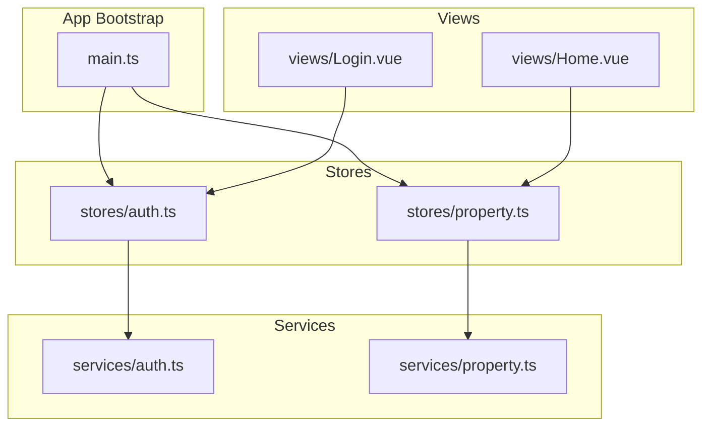
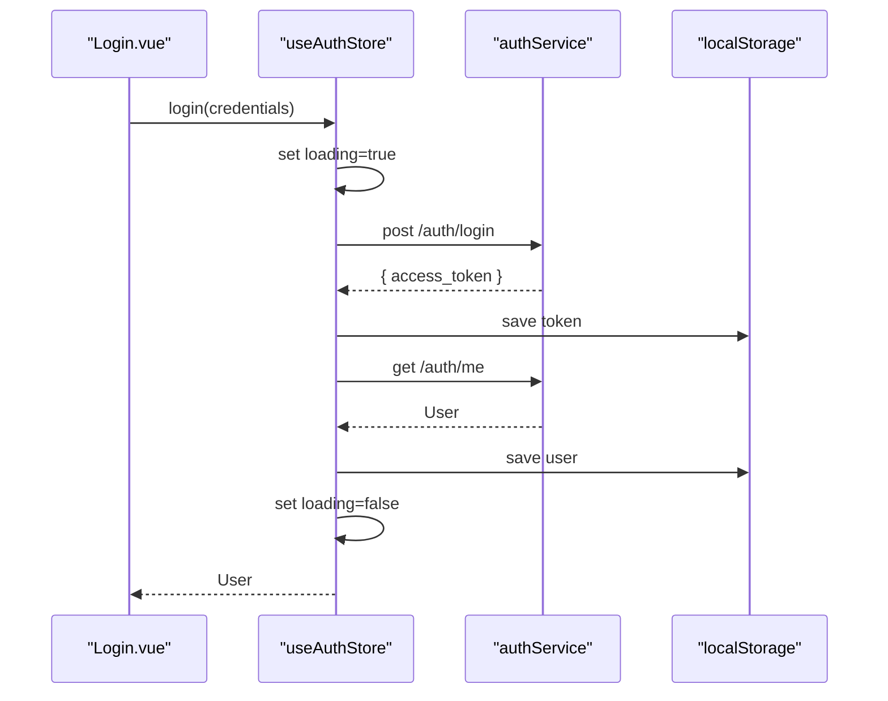
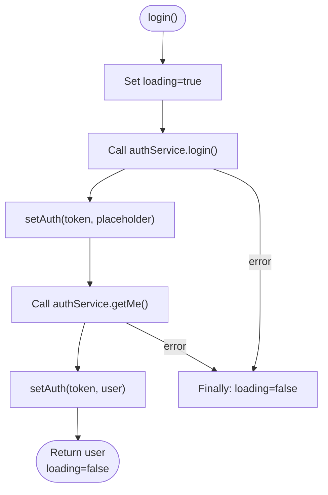
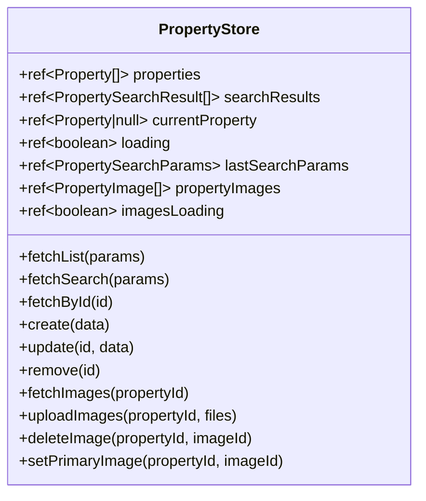
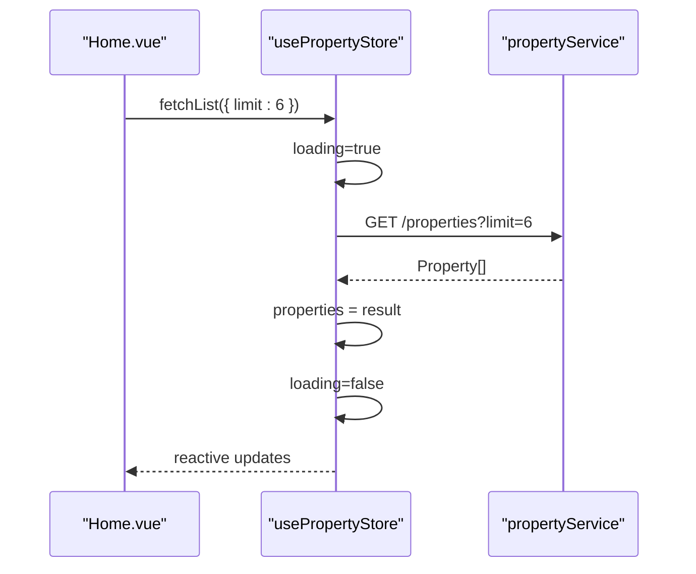
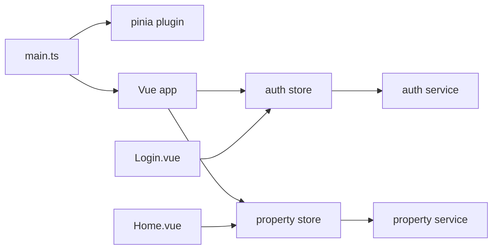

# State Patterns & Best Practices

<cite>
**Referenced Files in This Document**
- [main.ts](file://frontend/src/main.ts)
- [auth.ts](file://frontend/src/stores/auth.ts)
- [property.ts](file://frontend/src/stores/property.ts)
- [auth.test.ts](file://frontend/src/__tests__/stores/auth.test.ts)
- [property.test.ts](file://frontend/src/__tests__/stores/property.test.ts)
- [auth.ts](file://frontend/src/services/auth.ts)
- [property.ts](file://frontend/src/services/property.ts)
- [Login.vue](file://frontend/src/views/Login.vue)
- [Home.vue](file://frontend/src/views/Home.vue)
- [package.json](file://frontend/package.json)
</cite>

## Table of Contents
1. Introduction
2. Project Structure
3. Core Components
4. Architecture Overview
5. Detailed Component Analysis
6. Dependency Analysis
7. Performance Considerations
8. Troubleshooting Guide
9. Conclusion

## Introduction
This document explains the Pinia state management patterns and best practices used in the project’s frontend. It covers reactive state design, action composition, computed getters, store modularization, persistence with localStorage, error handling, performance optimization (lazy loading, normalization, efficient reactivity), debugging with Vue DevTools, testing strategies for stateful components, anti-patterns to avoid, store composition, dependency injection between stores, and consistent state update patterns.

## Project Structure
The frontend uses a feature-based organization:
- Stores encapsulate domain state and actions (e.g., authentication, properties).
- Services abstract HTTP calls via Axios.
- Views consume stores using Composition API and Pinia helpers.
- Tests mock services and assert store behavior.

**Diagram sources**
- [main.ts:10-14](file://frontend/src/main.ts#L10-L14)
- [auth.ts](file://frontend/src/stores/auth.ts)
- [property.ts](file://frontend/src/stores/property.ts)
- [auth.ts](file://frontend/src/services/auth.ts)
- [property.ts](file://frontend/src/services/property.ts)
- [Login.vue](file://frontend/src/views/Login.vue)
- [Home.vue](file://frontend/src/views/Home.vue)

**Section sources**
- [main.ts:10-14](file://frontend/src/main.ts#L10-L14)
- [package.json:14-23](file://frontend/package.json#L14-L23)

## Core Components
- Authentication store: manages user identity, token, loading flags, computed roles, and persistence.
- Property store: manages lists, search results, current item, images, and CRUD operations.
- Services: thin wrappers around Axios endpoints with typed requests/responses.
- Views: compose store refs and call store actions; handle UI-side concerns like routing and messages.

Key patterns observed:
- Functional store definitions with ref/computed.
- Actions wrap async service calls with try/finally for loading states.
- LocalStorage persistence for auth tokens and user profiles.
- Computed getters for derived UI state (e.g., isLoggedIn, isLandlord, isAdmin).
- StoreToRefs usage in views to bind reactive state without destructuring pitfalls.

**Section sources**
- [auth.ts](file://frontend/src/stores/auth.ts)
- [property.ts](file://frontend/src/stores/property.ts)
- [auth.ts](file://frontend/src/services/auth.ts)
- [property.ts](file://frontend/src/services/property.ts)
- [Login.vue](file://frontend/src/views/Login.vue)
- [Home.vue](file://frontend/src/views/Home.vue)

## Architecture Overview
Pinia is initialized once at app bootstrap. Stores are singletons per application instance. Views import store factories and use storeToRefs to expose reactive state. Services centralize network logic and types.

**Diagram sources**
- [Login.vue:88-104](file://frontend/src/views/Login.vue#L88-L104)
- [auth.ts](file://frontend/src/stores/auth.ts)
- [auth.ts](file://frontend/src/services/auth.ts)

## Detailed Component Analysis

### Authentication Store
Responsibilities:
- Maintain user, token, and loading state.
- Provide computed flags for authorization checks.
- Persist and restore session from localStorage.
- Expose actions for register, login, logout, and fetching current user.

Reactive state design:
- Use ref for primitive/state fields.
- Use computed for derived booleans based on role or token presence.

Action composition:
- login composes multiple service calls and persists intermediate/final state.
- fetchCurrentUser refreshes profile and syncs storage.

Persistence:
- setAuth writes token and user to localStorage.
- loadFromStorage restores on store creation.

Error handling:
- try/finally ensures loading resets.
- Corrupt localStorage handled by clearing auth on parse errors.

**Diagram sources**
- [auth.ts](file://frontend/src/stores/auth.ts)

**Section sources**
- [auth.ts](file://frontend/src/stores/auth.ts)
- [auth.ts](file://frontend/src/services/auth.ts)
- [auth.test.ts](file://frontend/src/__tests__/stores/auth.test.ts)

### Property Store
Responsibilities:
- Manage collections (properties, searchResults), current item, and image assets.
- Provide CRUD and search actions.
- Keep lastSearchParams for potential caching or replay.

Reactive state design:
- Arrays and objects wrapped in ref for reactivity.
- Separate loading flags for general operations and image operations.

Action composition:
- fetchList/fetchSearch/fetchById orchestrate service calls and update local arrays.
- update synchronizes currentProperty if it matches the updated id.
- remove filters both list and search results to keep them consistent.

Image management:
- fetchImages/uploadImages manage a dedicated array and loading flag.
- deleteImage/setPrimaryImage mutate local arrays efficiently.

**Diagram sources**
- [property.ts](file://frontend/src/stores/property.ts)

**Section sources**
- [property.ts](file://frontend/src/stores/property.ts)
- [property.ts](file://frontend/src/services/property.ts)
- [property.test.ts](file://frontend/src/__tests__/stores/property.test.ts)

### View Integration Patterns
- Login view calls store.login and navigates on success.
- Home view uses storeToRefs to bind properties and loading, then triggers fetchList on mount.

**Diagram sources**
- [Home.vue:310-312](file://frontend/src/views/Home.vue#L310-L312)
- [property.ts](file://frontend/src/stores/property.ts)
- [property.ts](file://frontend/src/services/property.ts)

**Section sources**
- [Login.vue:88-104](file://frontend/src/views/Login.vue#L88-L104)
- [Home.vue:164-176](file://frontend/src/views/Home.vue#L164-L176)
- [Home.vue:310-312](file://frontend/src/views/Home.vue#L310-L312)

## Dependency Analysis
- App bootstraps Pinia once and mounts the app.
- Stores depend on services for I/O.
- Views depend on stores for state and side effects.
- No circular dependencies observed among these modules.

**Diagram sources**
- [main.ts:10-14](file://frontend/src/main.ts#L10-L14)
- [auth.ts](file://frontend/src/stores/auth.ts)
- [property.ts](file://frontend/src/stores/property.ts)
- [auth.ts](file://frontend/src/services/auth.ts)
- [property.ts](file://frontend/src/services/property.ts)
- [Login.vue](file://frontend/src/views/Login.vue)
- [Home.vue](file://frontend/src/views/Home.vue)

**Section sources**
- [main.ts:10-14](file://frontend/src/main.ts#L10-L14)
- [package.json:14-23](file://frontend/package.json#L14-L23)

## Performance Considerations
- Lazy loading:
  - Load only needed slices (e.g., limit in Home.vue) to reduce payload size.
  - Defer heavy computations to computed getters to avoid redundant work.
- State normalization:
  - Consider normalizing large collections into entity maps keyed by id to improve update locality and reduce duplication.
- Efficient reactivity:
  - Prefer replacing entire arrays/objects when they change significantly rather than mutating deeply nested structures.
  - Use separate loading flags for independent operations (as seen with imagesLoading).
- Caching:
  - Cache lastSearchParams to support quick re-execution or optimistic UI.
- Network efficiency:
  - Batch or debounce repeated searches if needed.
  - Use pagination/skip-limit patterns for large datasets.

[No sources needed since this section provides general guidance]

## Troubleshooting Guide
- Debugging with Vue DevTools:
  - Inspect store instances, state snapshots, and actions invoked.
  - Verify that computed getters reflect expected derived values.
- Common issues:
  - Corrupted localStorage entries: ensure try/catch around JSON.parse and fallback to clearAuth.
  - Loading states not resetting: confirm finally blocks in all async actions.
  - Inconsistent lists after mutations: verify that remove/update also touch related arrays (e.g., searchResults).
- Testing strategies:
  - Create a fresh Pinia instance per test and clear localStorage before each case.
  - Mock services to isolate store logic.
  - Assert both state changes and side effects (e.g., localStorage writes).

**Section sources**
- [auth.test.ts](file://frontend/src/__tests__/stores/auth.test.ts)
- [property.test.ts](file://frontend/src/__tests__/stores/property.test.ts)

## Conclusion
The project demonstrates clean, maintainable Pinia patterns: functional stores, explicit loading states, composed async actions, computed getters for derived state, and robust localStorage persistence. The tests validate core behaviors and edge cases. By adopting normalization, lazy loading, and careful mutation strategies, the application can scale while keeping reactivity efficient and predictable.