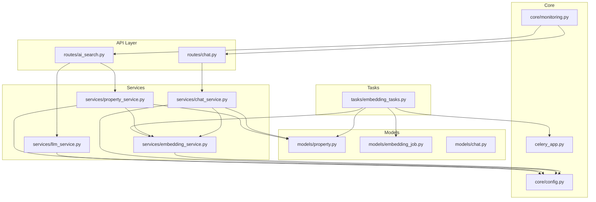
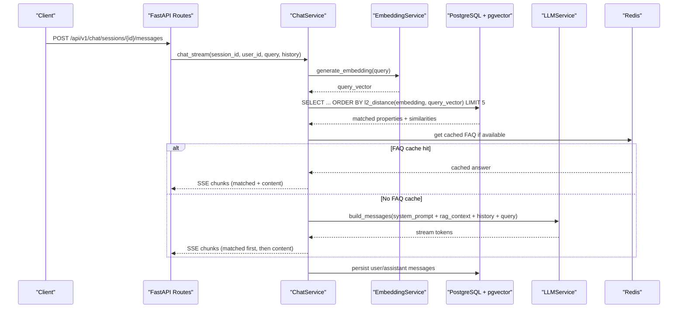
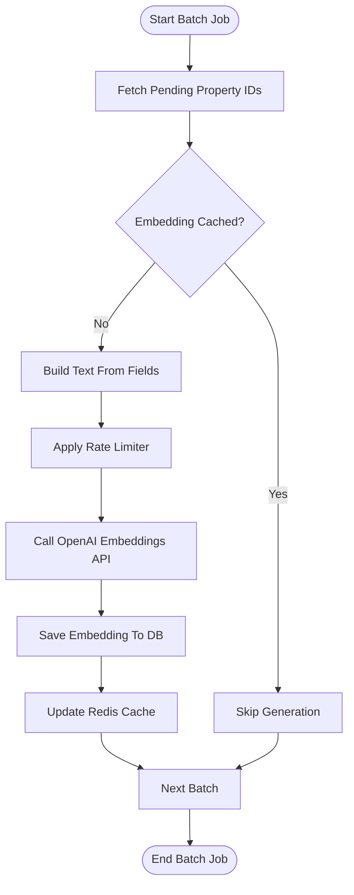
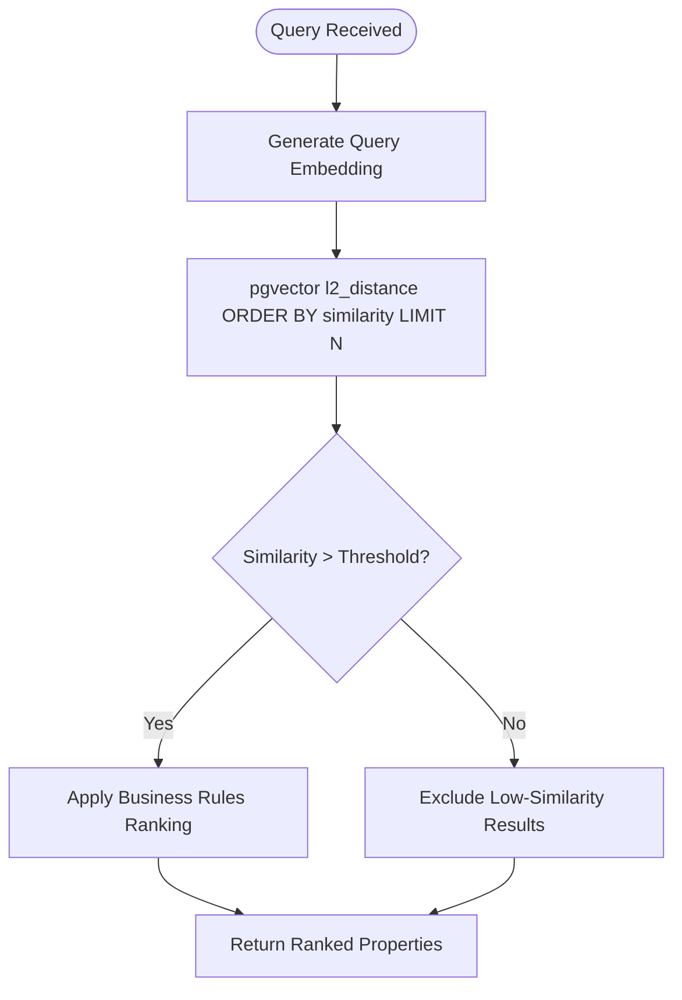
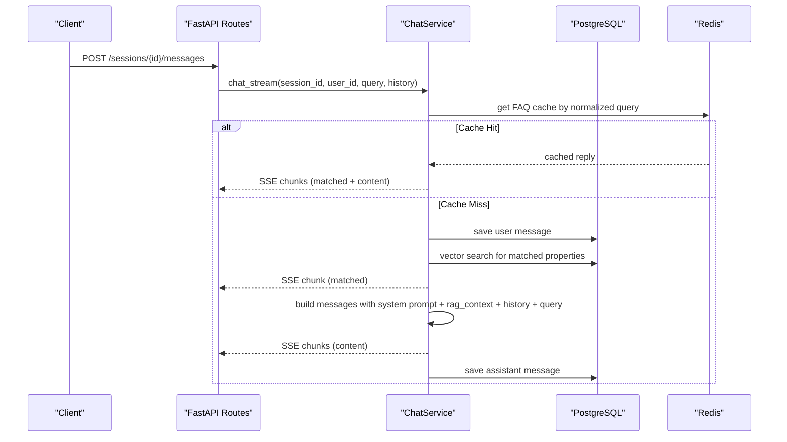
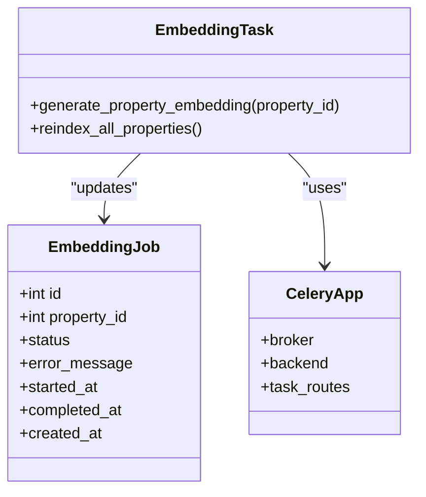
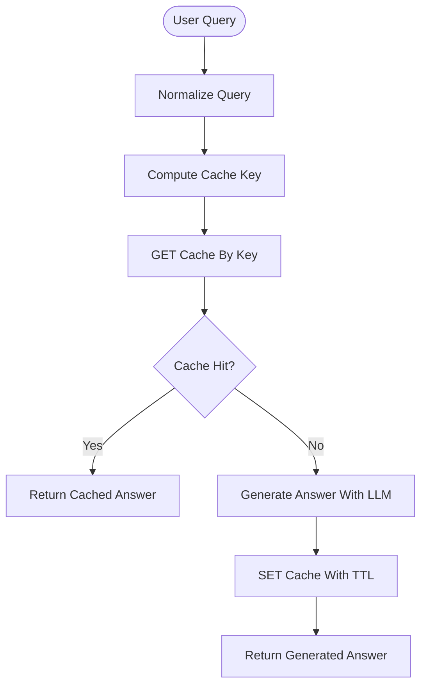
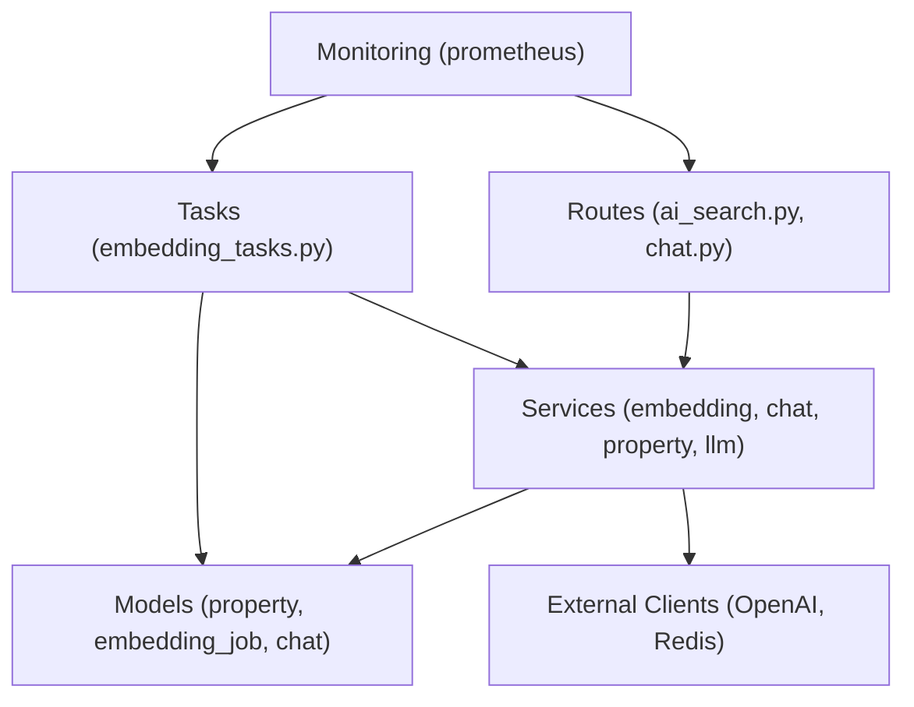

# AI Service Optimization

<cite>
**Referenced Files in This Document**
- [embedding_service.py](file://backend/app/services/embedding_service.py)
- [chat_service.py](file://backend/app/services/chat_service.py)
- [ai_search.py](file://backend/app/api/v1/routes/ai_search.py)
- [chat.py](file://backend/app/api/v1/routes/chat.py)
- [embedding_tasks.py](file://backend/app/tasks/embedding_tasks.py)
- [property_service.py](file://backend/app/services/property_service.py)
- [celery_app.py](file://backend/app/celery_app.py)
- [config.py](file://backend/app/core/config.py)
- [monitoring.py](file://backend/app/core/monitoring.py)
- [llm_service.py](file://backend/app/services/llm_service.py)
- [property.py](file://backend/app/models/property.py)
- [embedding_job.py](file://backend/app/models/embedding_job.py)
- [chat.py (models)](file://backend/app/models/chat.py)
- [ai_search.py (schemas)](file://backend/app/schemas/ai_search.py)
</cite>

## Table of Contents
1. [Introduction](#introduction)
2. [Project Structure](#project-structure)
3. [Core Components](#core-components)
4. [Architecture Overview](#architecture-overview)
5. [Detailed Component Analysis](#detailed-component-analysis)
6. [Dependency Analysis](#dependency-analysis)
7. [Performance Considerations](#performance-considerations)
8. [Troubleshooting Guide](#troubleshooting-guide)
9. [Conclusion](#conclusion)
10. [Appendices](#appendices)

## Introduction
This document provides comprehensive optimization strategies for AI services in the Rental Housing Structure platform. It focuses on:
- Embedding generation optimization with batch processing, caching, and rate limiting for OpenAI API calls
- Vector search optimization using pgvector query tuning, similarity thresholds, and ranking algorithms
- Chat assistant optimization including context window management, response streaming, and conversation history caching
- Background task optimization for embedding generation jobs, worker scaling, and queue prioritization
- Intelligent caching for frequently asked questions, prompt engineering improvements, and monitoring AI service costs and performance
- Fallback mechanisms and graceful degradation when AI services are unavailable, plus cost optimization techniques

## Project Structure
The AI-related backend components are organized into services, routes, tasks, models, schemas, and core utilities:
- Services: embedding_service.py, chat_service.py, property_service.py, llm_service.py
- Routes: ai_search.py, chat.py
- Tasks: embedding_tasks.py
- Models: property.py, embedding_job.py, chat.py (models)
- Schemas: ai_search.py (schemas)
- Core: config.py, monitoring.py, celery_app.py

**Diagram sources**
- [ai_search.py:1-160](file://backend/app/api/v1/routes/ai_search.py#L1-L160)
- [chat.py:1-143](file://backend/app/api/v1/routes/chat.py#L1-L143)
- [embedding_service.py:1-32](file://backend/app/services/embedding_service.py#L1-L32)
- [chat_service.py:1-302](file://backend/app/services/chat_service.py#L1-L302)
- [property_service.py:1-239](file://backend/app/services/property_service.py#L1-L239)
- [llm_service.py:1-209](file://backend/app/services/llm_service.py#L1-L209)
- [embedding_tasks.py:1-112](file://backend/app/tasks/embedding_tasks.py#L1-L112)
- [property.py:1-86](file://backend/app/models/property.py#L1-L86)
- [embedding_job.py:1-35](file://backend/app/models/embedding_job.py#L1-L35)
- [chat.py (models):1-62](file://backend/app/models/chat.py#L1-L62)
- [config.py:1-167](file://backend/app/core/config.py#L1-L167)
- [monitoring.py:1-227](file://backend/app/core/monitoring.py#L1-L227)
- [celery_app.py:1-31](file://backend/app/celery_app.py#L1-L31)

**Section sources**
- [ai_search.py:1-160](file://backend/app/api/v1/routes/ai_search.py#L1-L160)
- [chat.py:1-143](file://backend/app/api/v1/routes/chat.py#L1-L143)
- [embedding_service.py:1-32](file://backend/app/services/embedding_service.py#L1-L32)
- [chat_service.py:1-302](file://backend/app/services/chat_service.py#L1-L302)
- [property_service.py:1-239](file://backend/app/services/property_service.py#L1-L239)
- [llm_service.py:1-209](file://backend/app/services/llm_service.py#L1-L209)
- [embedding_tasks.py:1-112](file://backend/app/tasks/embedding_tasks.py#L1-L112)
- [property.py:1-86](file://backend/app/models/property.py#L1-L86)
- [embedding_job.py:1-35](file://backend/app/models/embedding_job.py#L1-L35)
- [chat.py (models):1-62](file://backend/app/models/chat.py#L1-L62)
- [config.py:1-167](file://backend/app/core/config.py#L1-L167)
- [monitoring.py:1-227](file://backend/app/core/monitoring.py#L1-L227)
- [celery_app.py:1-31](file://backend/app/celery_app.py#L1-L31)

## Core Components
- EmbeddingService: Generates embeddings via OpenAI async client; builds property text from title, description, address, district, and type.
- ChatService: Manages sessions and messages; builds RAG context by embedding queries and performing vector similarity search; supports non-streaming and streaming responses.
- PropertyService: Unified search with optional vector similarity; caches non-vector results in Redis; dispatches embedding tasks asynchronously.
- LLMService: Unified provider abstraction (DeepSeek primary, OpenAI fallback); parses natural language queries and generates summaries.
- Celery Tasks: Asynchronous embedding generation with job tracking and retries.
- Monitoring: Prometheus metrics for HTTP requests, Celery tasks, and DB pool status.

**Section sources**
- [embedding_service.py:1-32](file://backend/app/services/embedding_service.py#L1-L32)
- [chat_service.py:1-302](file://backend/app/services/chat_service.py#L1-L302)
- [property_service.py:1-239](file://backend/app/services/property_service.py#L1-L239)
- [llm_service.py:1-209](file://backend/app/services/llm_service.py#L1-L209)
- [embedding_tasks.py:1-112](file://backend/app/tasks/embedding_tasks.py#L1-L112)
- [monitoring.py:1-227](file://backend/app/core/monitoring.py#L1-L227)

## Architecture Overview
The system integrates multiple AI services:
- Embeddings: OpenAI embeddings for properties and queries
- Vector Search: pgvector l2_distance similarity over Property.embedding
- Chat Assistant: RAG pipeline combining vector search results with LLM prompts
- Background Jobs: Celery workers process embedding generation with retries and job state tracking
- Monitoring: Prometheus metrics capture request latency, task durations, and DB pool usage

**Diagram sources**
- [chat.py:106-130](file://backend/app/api/v1/routes/chat.py#L106-L130)
- [chat_service.py:171-302](file://backend/app/services/chat_service.py#L171-L302)
- [embedding_service.py:17-32](file://backend/app/services/embedding_service.py#L17-L32)
- [property.py:78-78](file://backend/app/models/property.py#L78-L78)
- [monitoring.py:126-176](file://backend/app/core/monitoring.py#L126-L176)

## Detailed Component Analysis

### Embedding Generation Optimization
Optimization strategies:
- Batch Processing:
  - Implement a batch generator that aggregates pending property IDs and processes them in batches to reduce API overhead.
  - Use asynchronous concurrency with bounded semaphore to control parallelism per worker.
- Caching Generated Embeddings:
  - Store embeddings in Redis keyed by property ID and last updated timestamp to avoid redundant generation.
  - Invalidate cache on property updates or reindex triggers.
- Rate Limiting for OpenAI API Calls:
  - Add token bucket or sliding window limiter around EmbeddingService.generate_embedding to respect provider quotas.
  - Expose configuration via settings for max requests per window and backoff strategy.

Implementation references:
- EmbeddingService uses AsyncOpenAI and constructs property text fields.
- PropertyService dispatches embedding tasks asynchronously after create/update.
- Celery tasks track job states and retry with exponential backoff.

**Diagram sources**
- [embedding_service.py:6-32](file://backend/app/services/embedding_service.py#L6-L32)
- [property_service.py:225-239](file://backend/app/services/property_service.py#L225-L239)
- [embedding_tasks.py:16-80](file://backend/app/tasks/embedding_tasks.py#L16-L80)
- [config.py:46-57](file://backend/app/core/config.py#L46-L57)

**Section sources**
- [embedding_service.py:1-32](file://backend/app/services/embedding_service.py#L1-L32)
- [property_service.py:225-239](file://backend/app/services/property_service.py#L225-L239)
- [embedding_tasks.py:1-112](file://backend/app/tasks/embedding_tasks.py#L1-L112)
- [config.py:46-57](file://backend/app/core/config.py#L46-L57)

### Vector Search Optimization
Optimization strategies:
- Query Tuning:
  - Ensure Property.embedding is indexed with pgvector IVFFlat or HNSW index for faster similarity search.
  - Tune list number or m/ef_construction parameters based on dataset size and latency targets.
- Similarity Threshold Configuration:
  - Apply a threshold filter on l2_distance to exclude low-similarity matches before returning results.
  - Normalize distances or convert to cosine similarity depending on model characteristics.
- Result Ranking Algorithms:
  - Combine similarity score with business rules (e.g., price relevance, recency, availability).
  - Weighted scoring: alpha * similarity + beta * freshness + gamma * popularity.

Implementation references:
- ChatService performs l2_distance ordering and limits top matches.
- PropertyService optionally uses vector similarity for query-based searches.

**Diagram sources**
- [chat_service.py:87-142](file://backend/app/services/chat_service.py#L87-L142)
- [property_service.py:135-168](file://backend/app/services/property_service.py#L135-L168)
- [property.py:78-78](file://backend/app/models/property.py#L78-L78)

**Section sources**
- [chat_service.py:87-142](file://backend/app/services/chat_service.py#L87-L142)
- [property_service.py:135-168](file://backend/app/services/property_service.py#L135-L168)
- [property.py:78-78](file://backend/app/models/property.py#L78-L78)

### Chat Assistant Optimization
Optimization strategies:
- Context Window Management:
  - Truncate or summarize long histories to fit within model token limits.
  - Maintain only recent turns and compress older messages into summaries.
- Response Streaming Implementation:
  - Use SSE to stream matched properties first, then content chunks for better UX.
  - Persist user message before streaming to ensure durability.
- Conversation History Caching:
  - Cache session metadata and recent messages in Redis with TTL to speed up repeated reads.
  - Provide FAQ caching keyed by normalized query to return instant answers when possible.

Implementation references:
- ChatService implements both non-streaming and streaming endpoints.
- Streaming yields matched properties, then content chunks, and finally done markers.
- Non-streaming persists both user and assistant messages atomically.

**Diagram sources**
- [chat.py:106-130](file://backend/app/api/v1/routes/chat.py#L106-L130)
- [chat_service.py:227-302](file://backend/app/services/chat_service.py#L227-L302)
- [chat.py (models):23-62](file://backend/app/models/chat.py#L23-L62)

**Section sources**
- [chat.py:106-130](file://backend/app/api/v1/routes/chat.py#L106-L130)
- [chat_service.py:171-302](file://backend/app/services/chat_service.py#L171-L302)
- [chat.py (models):23-62](file://backend/app/models/chat.py#L23-L62)

### Background Task Optimization
Optimization strategies:
- Worker Scaling Strategies:
  - Scale Celery workers horizontally based on queue depth and CPU utilization.
  - Separate queues for embedding and import tasks to isolate workloads.
- Job Queue Prioritization:
  - Assign higher priority to fresh property updates and lower priority to bulk reindex operations.
  - Use Celery priorities or separate queues with different consumer counts.
- Reliability and Observability:
  - Track job lifecycle states (pending, processing, completed, failed) with timestamps.
  - Integrate Prometheus metrics for task duration and success rates.

Implementation references:
- Celery app configures broker/backend via Redis and routes tasks to specific queues.
- Embedding tasks use autoretry and backoff, updating job statuses and error messages.

**Diagram sources**
- [embedding_tasks.py:16-112](file://backend/app/tasks/embedding_tasks.py#L16-L112)
- [embedding_job.py:10-35](file://backend/app/models/embedding_job.py#L10-L35)
- [celery_app.py:9-31](file://backend/app/celery_app.py#L9-L31)

**Section sources**
- [embedding_tasks.py:1-112](file://backend/app/tasks/embedding_tasks.py#L1-L112)
- [embedding_job.py:1-35](file://backend/app/models/embedding_job.py#L1-L35)
- [celery_app.py:1-31](file://backend/app/celery_app.py#L1-L31)

### Intelligent Caching for FAQs
Optimization strategies:
- Normalize user queries (lowercase, strip punctuation) to compute stable keys.
- Cache LLM-generated answers with TTL; invalidate on knowledge base updates.
- Serve cached replies immediately while background job regenerates stale entries.

Implementation references:
- PropertyService demonstrates Redis caching patterns for search results.
- ChatService can integrate similar caching for frequent queries.

[No sources needed since this diagram shows conceptual workflow, not actual code structure]

### Prompt Engineering Optimization
Optimization strategies:
- System Prompts:
  - Define clear constraints and output formats to improve parsing reliability.
  - Include examples and guardrails against hallucination.
- Temperature and Max Tokens:
  - Lower temperature for deterministic outputs (parsing), moderate for creative summaries.
  - Cap max tokens to control cost and latency.
- Provider Fallbacks:
  - Prefer cost-effective providers (DeepSeek) with OpenAI fallback for resilience.

Implementation references:
- LLMService defines parse and summary prompts and manages provider selection.
- Routes handle exceptions and degrade gracefully when LLM is unavailable.

**Section sources**
- [llm_service.py:18-61](file://backend/app/services/llm_service.py#L18-L61)
- [llm_service.py:106-198](file://backend/app/services/llm_service.py#L106-L198)
- [ai_search.py:80-160](file://backend/app/api/v1/routes/ai_search.py#L80-L160)

### Monitoring AI Service Costs and Performance
Optimization strategies:
- Metrics Collection:
  - Track request counts, latencies, and in-flight requests via Prometheus middleware.
  - Monitor Celery task durations and success/failure rates.
- Cost Estimation:
  - Log token usage and provider costs per request; aggregate daily totals.
  - Alert on spikes in usage or errors.

Implementation references:
- Monitoring module exposes /metrics endpoint and installs Celery signal handlers.
- Configurable environment variables allow toggling eager mode for testing.

**Section sources**
- [monitoring.py:126-227](file://backend/app/core/monitoring.py#L126-L227)
- [celery_app.py:20-31](file://backend/app/celery_app.py#L20-L31)

### Fallback Mechanisms and Graceful Degradation
Optimization strategies:
- LLM Fallback:
  - If primary provider fails or is unconfigured, switch to secondary provider.
  - Return structured defaults when no provider is available.
- Search Fallback:
  - When vector search is unavailable, fall back to keyword filters and sorting by recency.
- Error Handling:
  - Convert runtime errors to appropriate HTTP status codes (502/503).
  - Log detailed errors for diagnostics without exposing sensitive info.

Implementation references:
- LLMService selects client/provider dynamically and raises RuntimeError if none configured.
- AI search route catches exceptions and returns degraded summaries.

**Section sources**
- [llm_service.py:91-99](file://backend/app/services/llm_service.py#L91-L99)
- [ai_search.py:80-160](file://backend/app/api/v1/routes/ai_search.py#L80-L160)

### Cost Optimization Techniques
Optimization strategies:
- Model Selection:
  - Use smaller embedding models and cheaper chat models where quality permits.
  - Configure model names via settings to adapt to budget changes.
- Request Batching:
  - Aggregate embedding requests to reduce overhead and API calls.
- Caching:
  - Cache embeddings and search results to minimize repeated computations.
- Rate Limiting:
  - Enforce provider quotas to avoid throttling and unexpected charges.

Implementation references:
- Settings include OpenAI and DeepSeek model configurations.
- PropertyService caches non-vector search results with TTL.

**Section sources**
- [config.py:46-70](file://backend/app/core/config.py#L46-L70)
- [property_service.py:102-195](file://backend/app/services/property_service.py#L102-L195)

## Dependency Analysis
Component relationships and coupling:
- Routes depend on services for business logic.
- Services depend on models and external clients (OpenAI, Redis).
- Tasks depend on services and models, orchestrated by Celery.
- Monitoring integrates at HTTP and Celery levels.

**Diagram sources**
- [ai_search.py:1-160](file://backend/app/api/v1/routes/ai_search.py#L1-L160)
- [chat.py:1-143](file://backend/app/api/v1/routes/chat.py#L1-L143)
- [embedding_service.py:1-32](file://backend/app/services/embedding_service.py#L1-L32)
- [chat_service.py:1-302](file://backend/app/services/chat_service.py#L1-L302)
- [property_service.py:1-239](file://backend/app/services/property_service.py#L1-L239)
- [llm_service.py:1-209](file://backend/app/services/llm_service.py#L1-L209)
- [embedding_tasks.py:1-112](file://backend/app/tasks/embedding_tasks.py#L1-L112)
- [property.py:1-86](file://backend/app/models/property.py#L1-L86)
- [embedding_job.py:1-35](file://backend/app/models/embedding_job.py#L1-L35)
- [chat.py (models):1-62](file://backend/app/models/chat.py#L1-L62)
- [monitoring.py:1-227](file://backend/app/core/monitoring.py#L1-L227)

**Section sources**
- [ai_search.py:1-160](file://backend/app/api/v1/routes/ai_search.py#L1-L160)
- [chat.py:1-143](file://backend/app/api/v1/routes/chat.py#L1-L143)
- [embedding_service.py:1-32](file://backend/app/services/embedding_service.py#L1-L32)
- [chat_service.py:1-302](file://backend/app/services/chat_service.py#L1-L302)
- [property_service.py:1-239](file://backend/app/services/property_service.py#L1-L239)
- [llm_service.py:1-209](file://backend/app/services/llm_service.py#L1-L209)
- [embedding_tasks.py:1-112](file://backend/app/tasks/embedding_tasks.py#L1-L112)
- [property.py:1-86](file://backend/app/models/property.py#L1-L86)
- [embedding_job.py:1-35](file://backend/app/models/embedding_job.py#L1-L35)
- [chat.py (models):1-62](file://backend/app/models/chat.py#L1-L62)
- [monitoring.py:1-227](file://backend/app/core/monitoring.py#L1-L227)

## Performance Considerations
- Indexing:
  - Create pgvector indexes tuned for workload characteristics.
- Concurrency:
  - Use async clients and bounded semaphores to prevent resource exhaustion.
- Caching:
  - Employ short TTLs for dynamic data and longer TTLs for static references.
- Streaming:
  - Stream large responses to reduce perceived latency and memory usage.
- Backpressure:
  - Implement rate limiters and circuit breakers to protect downstream services.

[No sources needed since this section provides general guidance]

## Troubleshooting Guide
Common issues and resolutions:
- LLM Unavailable:
  - Verify API keys and base URLs in settings; check fallback provider configuration.
  - Inspect logs for RuntimeError indicating missing provider configuration.
- Vector Search Failures:
  - Ensure pgvector extension is enabled and indexes exist.
  - Validate embedding dimensions match model output.
- Celery Task Failures:
  - Check job status and error messages in database.
  - Review worker logs and broker connectivity.
- Redis Connectivity:
  - Confirm Redis URL and network access; handle connection failures gracefully.

**Section sources**
- [llm_service.py:91-99](file://backend/app/services/llm_service.py#L91-L99)
- [embedding_tasks.py:70-76](file://backend/app/tasks/embedding_tasks.py#L70-L76)
- [monitoring.py:126-176](file://backend/app/core/monitoring.py#L126-L176)

## Conclusion
By implementing batch processing, caching, rate limiting, vector search tuning, streaming responses, robust background tasks, and comprehensive monitoring, the platform can achieve high performance, reliability, and cost efficiency for its AI services. Graceful degradation ensures continuity even when external services are unavailable.

[No sources needed since this section summarizes without analyzing specific files]

## Appendices
- Configuration Keys:
  - OPENAI_API_KEY, OPENAI_EMBEDDING_MODEL, OPENAI_CHAT_MODEL
  - DEEPSEEK_API_KEY, DEEPSEEK_CHAT_MODEL, DEEPSEEK_BASE_URL
  - REDIS_URL, DATABASE_URL
- Schema Definitions:
  - AiSearchRequest, AiSearchResponse, ParseRequest, ParseResponse

**Section sources**
- [config.py:46-70](file://backend/app/core/config.py#L46-L70)
- [ai_search.py (schemas):37-74](file://backend/app/schemas/ai_search.py#L37-L74)