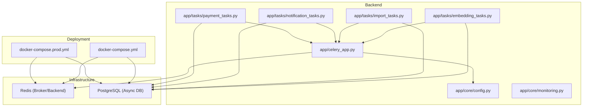
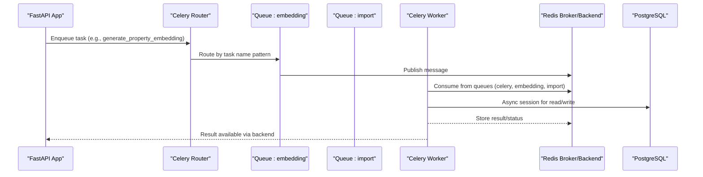
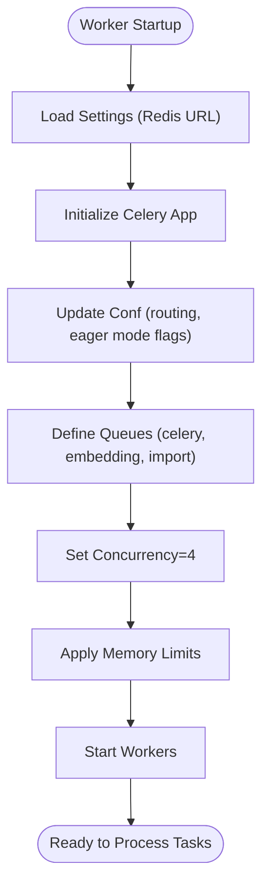
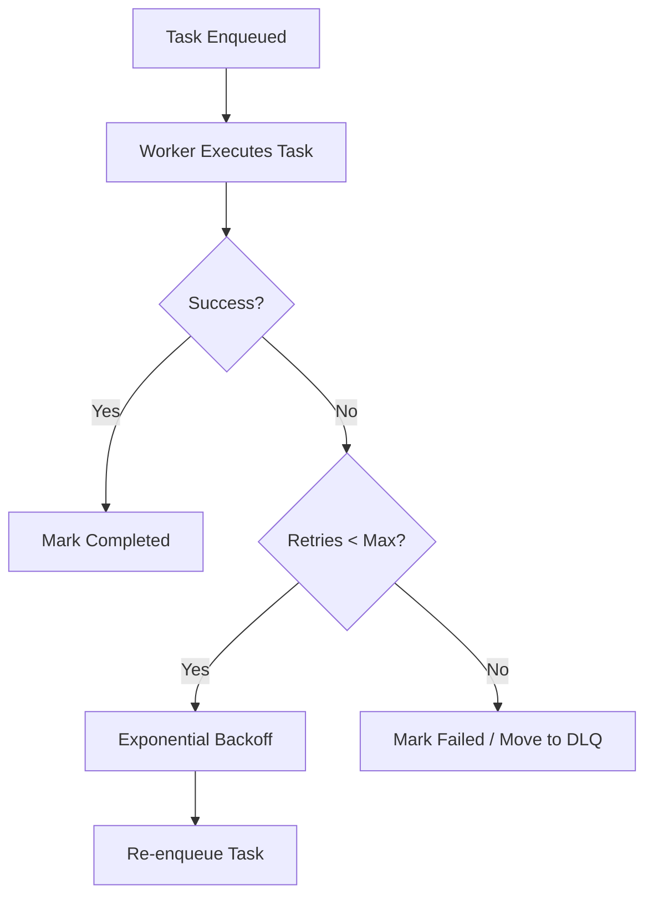
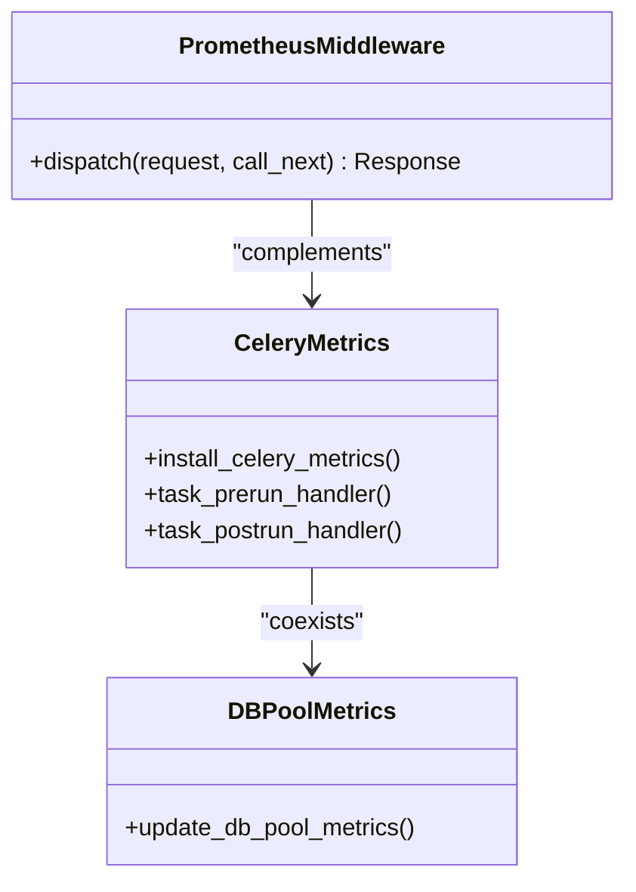
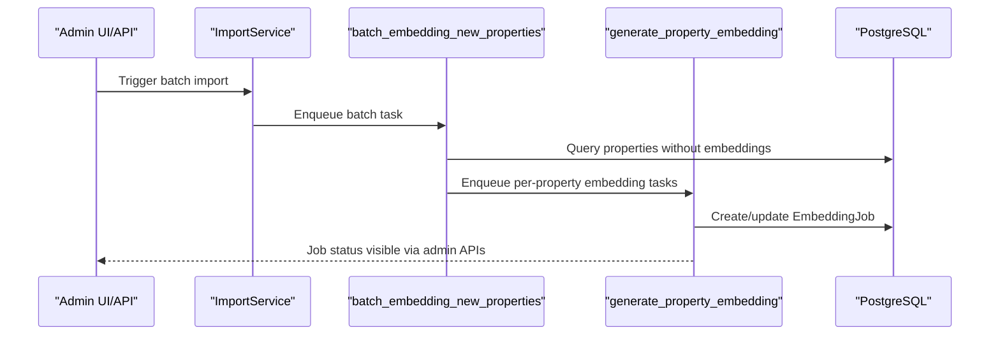
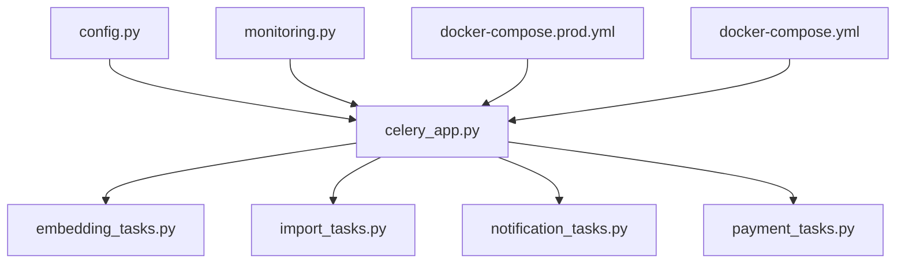

# Background Task Optimization

<cite>
**Referenced Files in This Document**
- [celery_app.py](file://backend/app/celery_app.py)
- [embedding_tasks.py](file://backend/app/tasks/embedding_tasks.py)
- [import_tasks.py](file://backend/app/tasks/import_tasks.py)
- [notification_tasks.py](file://backend/app/tasks/notification_tasks.py)
- [payment_tasks.py](file://backend/app/tasks/payment_tasks.py)
- [config.py](file://backend/app/core/config.py)
- [monitoring.py](file://backend/app/core/monitoring.py)
- [docker-compose.prod.yml](file://docker-compose.prod.yml)
- [docker-compose.yml](file://docker-compose.yml)
- [health.py](file://backend/app/api/v1/routes/health.py)
- [imports.py](file://backend/app/api/v1/routes/imports.py)
</cite>

## Table of Contents
1. [Introduction](#introduction)
2. [Project Structure](#project-structure)
3. [Core Components](#core-components)
4. [Architecture Overview](#architecture-overview)
5. [Detailed Component Analysis](#detailed-component-analysis)
6. [Dependency Analysis](#dependency-analysis)
7. [Performance Considerations](#performance-considerations)
8. [Troubleshooting Guide](#troubleshooting-guide)
9. [Conclusion](#conclusion)
10. [Appendices](#appendices)

## Introduction
This document provides a comprehensive guide to optimizing background task processing using Celery in the Rental Housing Structure platform. It covers worker configuration, concurrency and memory limits, process scaling strategies, queue routing, retry mechanisms with exponential backoff, monitoring metrics, and operational best practices for long-running tasks such as data imports, embedding generation batches, and notification dispatch. It also addresses idempotency, duplicate prevention, graceful shutdowns, memory leak detection, worker restart strategies, and performance profiling.

## Project Structure
The backend organizes Celery-related code into:
- Application-level Celery app and configuration
- Task modules for embeddings, imports, notifications, and payments
- Monitoring utilities for Prometheus metrics
- Docker Compose definitions for development and production workers
- Configuration settings for Redis and database connections

**Diagram sources**
- [celery_app.py:1-31](file://backend/app/celery_app.py#L1-L31)
- [embedding_tasks.py:1-112](file://backend/app/tasks/embedding_tasks.py#L1-L112)
- [import_tasks.py:1-44](file://backend/app/tasks/import_tasks.py#L1-L44)
- [notification_tasks.py:1-217](file://backend/app/tasks/notification_tasks.py#L1-L217)
- [payment_tasks.py:1-241](file://backend/app/tasks/payment_tasks.py#L1-L241)
- [config.py:1-167](file://backend/app/core/config.py#L1-L167)
- [monitoring.py:1-227](file://backend/app/core/monitoring.py#L1-L227)
- [docker-compose.yml:1-53](file://docker-compose.yml#L1-L53)
- [docker-compose.prod.yml:100-137](file://docker-compose.prod.yml#L100-L137)

**Section sources**
- [celery_app.py:1-31](file://backend/app/celery_app.py#L1-L31)
- [config.py:1-167](file://backend/app/core/config.py#L1-L167)
- [docker-compose.yml:1-53](file://docker-compose.yml#L1-L53)
- [docker-compose.prod.yml:100-137](file://docker-compose.prod.yml#L100-L137)

## Core Components
- Celery application initialization and routing:
  - Broker and result backend configured via Redis URL from settings.
  - JSON serialization and timezone enabled.
  - Task routing maps specific task modules to dedicated queues.
- Worker deployment:
  - Production worker runs with explicit concurrency and multi-queue consumption.
  - Memory limits and logging options are defined at container level.
- Task modules:
  - Embedding tasks for single property and batch reindexing.
  - Import tasks for batch embedding new properties.
  - Notification tasks for WeChat template messages, SMS, and email.
  - Payment tasks for periodic sync and cleanup.
- Monitoring:
  - Prometheus middleware for HTTP metrics.
  - Celery signal handlers for task count and latency.
  - Database pool gauges for connection usage.

**Section sources**
- [celery_app.py:1-31](file://backend/app/celery_app.py#L1-L31)
- [docker-compose.prod.yml:100-137](file://docker-compose.prod.yml#L100-L137)
- [embedding_tasks.py:1-112](file://backend/app/tasks/embedding_tasks.py#L1-L112)
- [import_tasks.py:1-44](file://backend/app/tasks/import_tasks.py#L1-L44)
- [notification_tasks.py:1-217](file://backend/app/tasks/notification_tasks.py#L1-L217)
- [payment_tasks.py:1-241](file://backend/app/tasks/payment_tasks.py#L1-L241)
- [monitoring.py:1-227](file://backend/app/core/monitoring.py#L1-L227)

## Architecture Overview
The system uses Redis as both broker and result backend. Tasks are routed to named queues based on their module path. Workers consume multiple queues concurrently. Metrics are collected via Prometheus signals attached to Celery lifecycle events.

**Diagram sources**
- [celery_app.py:20-30](file://backend/app/celery_app.py#L20-L30)
- [embedding_tasks.py:16-81](file://backend/app/tasks/embedding_tasks.py#L16-L81)
- [import_tasks.py:13-44](file://backend/app/tasks/import_tasks.py#L13-L44)
- [docker-compose.prod.yml:114-118](file://docker-compose.prod.yml#L114-L118)

## Detailed Component Analysis

### Celery Worker Configuration and Scaling
- Broker and backend:
  - Both set to Redis URL from settings.
  - JSON serializer used for tasks and results.
- Routing:
  - Tasks under embedding and import modules are routed to dedicated queues.
- Worker command:
  - Concurrency set to 4.
  - Queues consumed include default celery, embedding, and import.
- Resource limits:
  - Container memory limit and reservation defined.
  - Logging driver and rotation configured.

**Diagram sources**
- [celery_app.py:9-30](file://backend/app/celery_app.py#L9-L30)
- [docker-compose.prod.yml:114-137](file://docker-compose.prod.yml#L114-L137)

**Section sources**
- [celery_app.py:1-31](file://backend/app/celery_app.py#L1-L31)
- [docker-compose.prod.yml:100-137](file://docker-compose.prod.yml#L100-L137)

### Task Queuing Optimization: Priority, Routing, and Load Balancing
- Current routing:
  - Module-based routing assigns embedding and import tasks to separate queues.
- Priority queues:
  - Not explicitly implemented; can be added by defining priority-aware queues and adjusting worker consumption order.
- Load balancing:
  - Multiple workers consuming the same queues distribute load automatically.
  - Separate queues isolate heavy workloads (embedding/import) from general tasks.

Recommendations:
- Introduce high-priority queues for time-sensitive tasks (e.g., payment confirmations).
- Use multiple worker processes per queue to scale throughput.
- Monitor queue lengths and adjust concurrency accordingly.

**Section sources**
- [celery_app.py:26-29](file://backend/app/celery_app.py#L26-L29)
- [docker-compose.prod.yml:114-118](file://docker-compose.prod.yml#L114-L118)

### Retry Mechanisms, Exponential Backoff, and Dead Letter Handling
- Autoretry and backoff:
  - Most tasks declare autoretry for exceptions with retry_backoff enabled and max_retries set.
- Dead letter handling:
  - No explicit dead letter queue is configured; failed tasks after retries will remain in failed state in the result backend.
- Recommendations:
  - Configure a dedicated dead letter queue and route permanently failed tasks there.
  - Implement periodic inspection and alerting for dead-lettered tasks.

**Diagram sources**
- [embedding_tasks.py:16-21](file://backend/app/tasks/embedding_tasks.py#L16-L21)
- [notification_tasks.py:53-58](file://backend/app/tasks/notification_tasks.py#L53-L58)
- [payment_tasks.py:80-85](file://backend/app/tasks/payment_tasks.py#L80-L85)

**Section sources**
- [embedding_tasks.py:16-21](file://backend/app/tasks/embedding_tasks.py#L16-L21)
- [notification_tasks.py:53-58](file://backend/app/tasks/notification_tasks.py#L53-L58)
- [payment_tasks.py:80-85](file://backend/app/tasks/payment_tasks.py#L80-L85)

### Monitoring Task Execution Times, Resource Utilization, and Worker Health
- Prometheus integration:
  - HTTP request counters, histograms, and in-flight gauges.
  - Celery task counters and latency histograms via signal handlers.
  - Database pool size, overflow, and checked-out gauges.
- Metrics endpoint:
  - /metrics exposed for scraping.
- Health check:
  - Simple health endpoint returns status.

**Diagram sources**
- [monitoring.py:126-175](file://backend/app/core/monitoring.py#L126-L175)
- [monitoring.py:183-208](file://backend/app/core/monitoring.py#L183-L208)
- [monitoring.py:216-227](file://backend/app/core/monitoring.py#L216-L227)
- [health.py:6-8](file://backend/app/api/v1/routes/health.py#L6-L8)

**Section sources**
- [monitoring.py:1-227](file://backend/app/core/monitoring.py#L1-L227)
- [health.py:1-9](file://backend/app/api/v1/routes/health.py#L1-L9)

### Optimizing Long-Running Tasks
- Data import operations:
  - Import tasks orchestrate batch processing and provide retry endpoints for failed records.
  - Admin APIs expose task details and retry functionality.
- Embedding generation batches:
  - Batch task queries properties without embeddings and enqueues individual embedding tasks.
  - Individual embedding task creates job records, updates statuses, and handles errors.
- Notification dispatch:
  - Unified service dispatches SMS/email tasks asynchronously.
  - Each channel has dedicated tasks with retries and skip logic when credentials or user fields are missing.

**Diagram sources**
- [import_tasks.py:13-44](file://backend/app/tasks/import_tasks.py#L13-L44)
- [embedding_tasks.py:16-81](file://backend/app/tasks/embedding_tasks.py#L16-L81)
- [imports.py:121-193](file://backend/app/api/v1/routes/imports.py#L121-L193)

**Section sources**
- [import_tasks.py:1-44](file://backend/app/tasks/import_tasks.py#L1-L44)
- [embedding_tasks.py:1-112](file://backend/app/tasks/embedding_tasks.py#L1-L112)
- [imports.py:121-193](file://backend/app/api/v1/routes/imports.py#L121-L193)

### Idempotency, Duplicate Prevention, and Graceful Shutdown
- Idempotency:
  - Embedding jobs use unique job records and status transitions to avoid duplicate processing.
  - Notification tasks skip sending if required identifiers are missing.
- Duplicate prevention:
  - Ensure callers deduplicate before enqueueing (e.g., check existing pending jobs).
- Graceful shutdown:
  - Use Celery’s graceful shutdown signals to finish in-progress tasks.
  - Combine with container stop timeouts to allow clean exits.

Best practices:
- Use unique task IDs where applicable.
- Persist job states and guard against reprocessing.
- Implement prestop hooks to drain queues gracefully.

[No sources needed since this section provides general guidance]

### Memory Leak Detection, Worker Restart Strategies, and Performance Profiling
- Memory leak detection:
  - Monitor container memory usage and worker RSS over time.
  - Use periodic worker restarts to mitigate leaks.
- Worker restart strategies:
  - Configure auto-restart policies in orchestrators.
  - Limit max-tasks-per-child to recycle workers after N tasks.
- Performance profiling:
  - Use Celery’s built-in profiling and integrate with APM tools.
  - Analyze Prometheus histograms for task durations and identify hotspots.

[No sources needed since this section provides general guidance]

## Dependency Analysis
Key dependencies and relationships:
- Celery app depends on configuration for Redis URLs and routing.
- Task modules depend on async database sessions and external services.
- Monitoring integrates with FastAPI and Celery signals.
- Deployment defines worker commands, concurrency, and resource constraints.

**Diagram sources**
- [config.py:1-167](file://backend/app/core/config.py#L1-L167)
- [celery_app.py:1-31](file://backend/app/celery_app.py#L1-L31)
- [embedding_tasks.py:1-112](file://backend/app/tasks/embedding_tasks.py#L1-L112)
- [import_tasks.py:1-44](file://backend/app/tasks/import_tasks.py#L1-L44)
- [notification_tasks.py:1-217](file://backend/app/tasks/notification_tasks.py#L1-L217)
- [payment_tasks.py:1-241](file://backend/app/tasks/payment_tasks.py#L1-L241)
- [monitoring.py:1-227](file://backend/app/core/monitoring.py#L1-L227)
- [docker-compose.prod.yml:100-137](file://docker-compose.prod.yml#L100-L137)
- [docker-compose.yml:1-53](file://docker-compose.yml#L1-L53)

**Section sources**
- [config.py:1-167](file://backend/app/core/config.py#L1-L167)
- [celery_app.py:1-31](file://backend/app/celery_app.py#L1-L31)
- [monitoring.py:1-227](file://backend/app/core/monitoring.py#L1-L227)
- [docker-compose.prod.yml:100-137](file://docker-compose.prod.yml#L100-L137)
- [docker-compose.yml:1-53](file://docker-compose.yml#L1-L53)

## Performance Considerations
- Concurrency tuning:
  - Adjust --concurrency based on CPU cores and task characteristics.
  - For I/O-bound tasks (async DB calls), higher concurrency may improve throughput.
- Queue isolation:
  - Keep heavy embedding/import tasks on dedicated queues to prevent contention.
- Memory limits:
  - Set appropriate container memory reservations and limits.
  - Monitor worker memory growth and implement recycling policies.
- Database pool sizing:
  - Align async engine pool size with concurrency to avoid saturation.
- External service rate limits:
  - Respect provider quotas and implement backoff strategies.

[No sources needed since this section provides general guidance]

## Troubleshooting Guide
Common issues and resolutions:
- Broker connectivity:
  - Verify Redis URL and network reachability.
  - Check worker logs for connection timeouts.
- Task failures:
  - Inspect error messages stored in job records.
  - Use admin APIs to retry failed import tasks.
- Metrics not available:
  - Ensure prometheus-client is installed and /metrics endpoint is mounted.
- Health checks:
  - Confirm /health endpoint responds with ok.

Operational tips:
- Enable structured logging and rotate logs.
- Set up alerts for high queue lengths and task latency spikes.
- Periodically review dead-lettered tasks and fix root causes.

**Section sources**
- [imports.py:121-193](file://backend/app/api/v1/routes/imports.py#L121-L193)
- [monitoring.py:167-175](file://backend/app/core/monitoring.py#L167-L175)
- [health.py:6-8](file://backend/app/api/v1/routes/health.py#L6-L8)

## Conclusion
The platform’s Celery setup provides a solid foundation for scalable background processing with clear separation of concerns through queue routing and robust retry mechanisms. By adopting priority queues, implementing dead letter handling, and leveraging Prometheus metrics, operators can achieve predictable performance and reliable task execution. Continuous monitoring, careful concurrency tuning, and disciplined idempotency practices will ensure long-term stability and efficiency.

[No sources needed since this section summarizes without analyzing specific files]

## Appendices
- Environment variables:
  - REDIS_URL, DATABASE_URL, and related settings drive broker/backend and DB connections.
- Deployment notes:
  - Development and production compose files define services, health checks, and worker commands.

**Section sources**
- [config.py:14-24](file://backend/app/core/config.py#L14-L24)
- [docker-compose.yml:29-46](file://docker-compose.yml#L29-L46)
- [docker-compose.prod.yml:100-137](file://docker-compose.prod.yml#L100-L137)