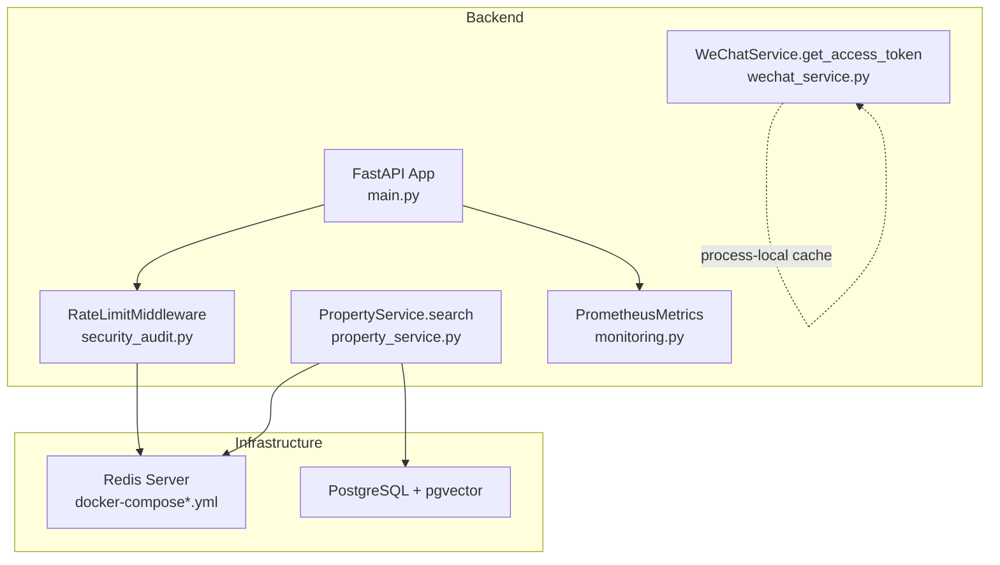
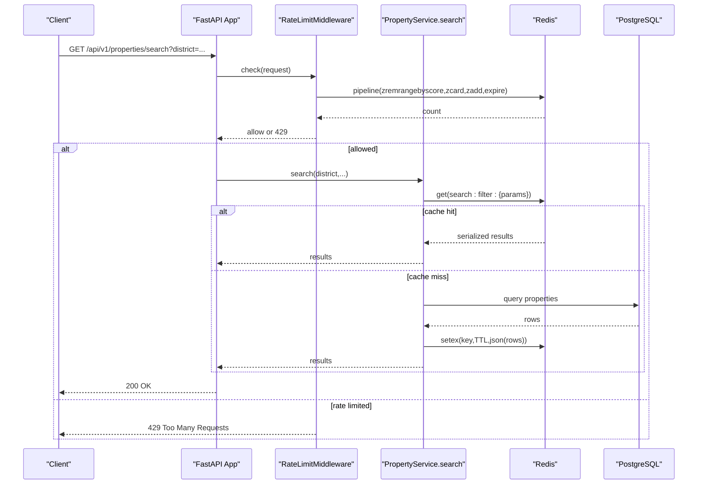
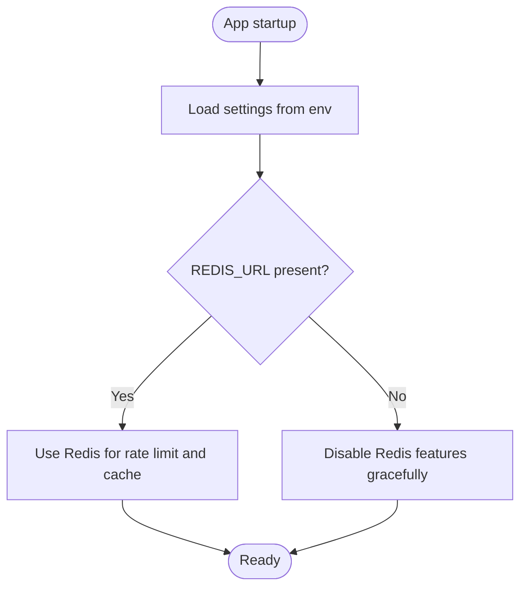
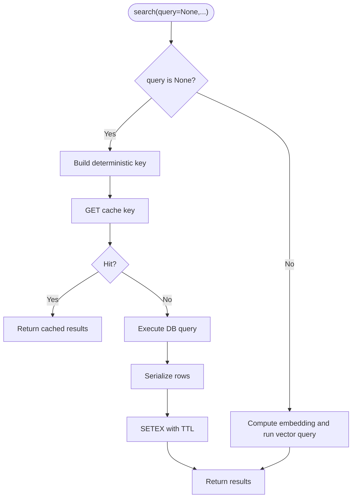
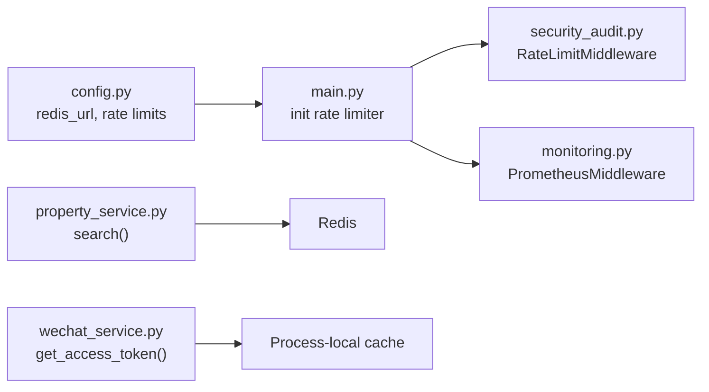

# Caching Strategies & Redis Usage

<cite>
**Referenced Files in This Document**
- [config.py](file://backend/app/core/config.py)
- [main.py](file://backend/app/main.py)
- [security_audit.py](file://backend/app/core/security_audit.py)
- [property_service.py](file://backend/app/services/property_service.py)
- [wechat_service.py](file://backend/app/services/wechat_service.py)
- [monitoring.py](file://backend/app/core/monitoring.py)
- [docker-compose.yml](file://docker-compose.yml)
- [docker-compose.prod.yml](file://docker-compose.prod.yml)
- [nginx.conf](file://frontend/nginx/nginx.conf)
</cite>

## Table of Contents
1. [Introduction](#introduction)
2. [Project Structure](#project-structure)
3. [Core Components](#core-components)
4. [Architecture Overview](#architecture-overview)
5. [Detailed Component Analysis](#detailed-component-analysis)
6. [Dependency Analysis](#dependency-analysis)
7. [Performance Considerations](#performance-considerations)
8. [Troubleshooting Guide](#troubleshooting-guide)
9. [Conclusion](#conclusion)
10. [Appendices](#appendices)

## Introduction
This document explains the caching strategies and Redis usage across the Rental Housing Structure platform. It covers configuration for development and production, connection handling, memory management, API response caching patterns (including property listings and search), embedding vector caching considerations, authentication token caching, session management, cache invalidation, TTL configuration, cache warming techniques, distributed caching for multi-instance deployments, monitoring and metrics collection, troubleshooting, consistency patterns, fallback mechanisms when Redis is unavailable, and performance impact measurement.

## Project Structure
Caching-related code spans configuration, application bootstrap, middleware, services, and deployment definitions:
- Configuration defines Redis URL and rate limiting parameters.
- Application bootstrap wires Prometheus metrics and a Redis-backed rate limiter.
- Property service implements read-through caching for non-vector search queries with TTL.
- WeChat service caches an external access token in process memory.
- Docker Compose files define Redis containers and memory policies.
- Nginx configures static asset caching and exposes /metrics.

**Diagram sources**
- [main.py:41-57](file://backend/app/main.py#L41-L57)
- [security_audit.py:49-94](file://backend/app/core/security_audit.py#L49-L94)
- [property_service.py:91-195](file://backend/app/services/property_service.py#L91-L195)
- [wechat_service.py:67-88](file://backend/app/services/wechat_service.py#L67-L88)
- [monitoring.py:126-175](file://backend/app/core/monitoring.py#L126-L175)
- [docker-compose.yml:29-46](file://docker-compose.yml#L29-L46)
- [docker-compose.prod.yml:36-63](file://docker-compose.prod.yml#L36-L63)

**Section sources**
- [config.py:24-31](file://backend/app/core/config.py#L24-L31)
- [main.py:41-57](file://backend/app/main.py#L41-L57)
- [property_service.py:22-41](file://backend/app/services/property_service.py#L22-L41)
- [docker-compose.yml:29-46](file://docker-compose.yml#L29-L46)
- [docker-compose.prod.yml:36-63](file://docker-compose.prod.yml#L36-L63)

## Core Components
- Settings and environment variables:
  - Redis URL and rate limiting windows are configured via settings.
- Rate limiting middleware:
  - Uses Redis sorted sets to track requests per client IP and endpoint prefix; enforces limits and returns 429 when exceeded.
- Property search caching:
  - For non-vector searches, results are cached in Redis with a deterministic key and TTL. Vector searches bypass cache due to dynamic embeddings.
- WeChat access token caching:
  - Process-local cache avoids repeated calls to WeChat’s token endpoint within its validity window.
- Metrics and observability:
  - Prometheus middleware collects request counts and latency; /metrics endpoint exposed.

**Section sources**
- [config.py:24-31](file://backend/app/core/config.py#L24-L31)
- [security_audit.py:49-94](file://backend/app/core/security_audit.py#L49-L94)
- [property_service.py:91-195](file://backend/app/services/property_service.py#L91-L195)
- [wechat_service.py:67-88](file://backend/app/services/wechat_service.py#L67-L88)
- [monitoring.py:126-175](file://backend/app/core/monitoring.py#L126-L175)

## Architecture Overview
The system integrates Redis for distributed rate limiting and read-through caching of query results. The FastAPI app initializes Prometheus metrics and conditionally enables Redis-based rate limiting. Property search uses a cache-first strategy for filter-only queries, while vector similarity searches compute embeddings on demand.

**Diagram sources**
- [main.py:41-57](file://backend/app/main.py#L41-L57)
- [security_audit.py:66-94](file://backend/app/core/security_audit.py#L66-L94)
- [property_service.py:102-195](file://backend/app/services/property_service.py#L102-L195)

## Detailed Component Analysis

### Redis Configuration and Environment Setup
- Development:
  - Redis container runs without password, with append-only persistence and LRU eviction policy.
- Production:
  - Redis container requires a password, enables AOF persistence, sets maxmemory and allkeys-lru eviction.
- Application settings:
  - redis_url is provided via environment variable and consumed by both rate limiter and property service.

**Diagram sources**
- [config.py:24-31](file://backend/app/core/config.py#L24-L31)
- [docker-compose.yml:29-46](file://docker-compose.yml#L29-L46)
- [docker-compose.prod.yml:36-63](file://docker-compose.prod.yml#L36-L63)

**Section sources**
- [config.py:24-31](file://backend/app/core/config.py#L24-L31)
- [docker-compose.yml:29-46](file://docker-compose.yml#L29-L46)
- [docker-compose.prod.yml:36-63](file://docker-compose.prod.yml#L36-L63)

### Connection Handling and Pooling
- Rate limiter:
  - Creates a single async Redis client at app startup and reuses it across requests.
- Property service:
  - Lazily imports and creates a short-lived Redis client per search call, then closes it after use.
- Implications:
  - Short-lived clients avoid long-held connections but incur connect overhead per call. A shared connection pool would reduce overhead in high-throughput scenarios.

**Section sources**
- [main.py:45-57](file://backend/app/main.py#L45-L57)
- [property_service.py:31-41](file://backend/app/services/property_service.py#L31-L41)

### Memory Management and Eviction
- Redis memory policy:
  - allkeys-lru evicts least recently used keys when maxmemory is reached.
- Maxmemory:
  - Set to 256MB in both dev and prod compose files.
- Persistence:
  - Append-only file enabled with everysec fsync for durability.

**Section sources**
- [docker-compose.yml:36-46](file://docker-compose.yml#L36-L46)
- [docker-compose.prod.yml:42-48](file://docker-compose.prod.yml#L42-L48)

### API Response Caching Patterns
- Non-vector search (filter-only):
  - Deterministic cache key built from normalized parameters.
  - Read-through: if cache miss, query DB, serialize results, write to Redis with TTL.
  - TTL: 300 seconds for search results.
- Vector search:
  - Skips cache because embeddings depend on dynamic query vectors.
- Serialization:
  - Results serialized to JSON; Decimal values converted to strings for safe serialization.

**Diagram sources**
- [property_service.py:102-195](file://backend/app/services/property_service.py#L102-L195)

**Section sources**
- [property_service.py:22-28](file://backend/app/services/property_service.py#L22-L28)
- [property_service.py:102-195](file://backend/app/services/property_service.py#L102-L195)

### Embedding Vector Caching Strategy
- Current behavior:
  - Vector similarity searches do not cache results.
- Recommended approach:
  - Cache embedding vectors keyed by normalized text input with a longer TTL and versioning to handle model changes.
  - Optionally cache final search results for identical queries with stable filters, using composite keys that include query hash and filter signature.

[No sources needed since this section provides general guidance]

### Authentication Token Caching
- WeChat access token:
  - Cached in process memory with expiration time; subsequent calls reuse the token until near-expiration.
- Limitations:
  - Not shared across processes or instances; consider moving to Redis for multi-instance deployments.

**Section sources**
- [wechat_service.py:31-32](file://backend/app/services/wechat_service.py#L31-L32)
- [wechat_service.py:67-88](file://backend/app/services/wechat_service.py#L67-L88)

### Session Management
- Chat sessions:
  - Stored in database; streaming responses disable proxy buffering and caching headers.
- JWT tokens:
  - Stateless access tokens; refresh tokens supported server-side. No explicit Redis-backed session store is implemented.

**Section sources**
- [chat.py:122-130](file://backend/app/api/v1/routes/chat.py#L122-L130)
- [auth.py:63-71](file://backend/app/api/v1/routes/auth.py#L63-L71)

### Cache Invalidation Strategies
- Time-based invalidation:
  - Search results use a fixed TTL of 300 seconds.
- Event-driven invalidation:
  - On property updates/deletes, invalidate related search keys by pattern deletion or maintain a mapping index of affected keys.
- Versioned keys:
  - Include schema/model version in cache keys to force invalidation on data contract changes.

**Section sources**
- [property_service.py:22](file://backend/app/services/property_service.py#L22)
- [property_service.py:197-214](file://backend/app/services/property_service.py#L197-L214)

### TTL Configuration
- Search result TTL:
  - 300 seconds for filter-only queries.
- Rate limit window:
  - Configurable via settings; default window and request count defined in settings.

**Section sources**
- [property_service.py:22](file://backend/app/services/property_service.py#L22)
- [config.py:154-161](file://backend/app/core/config.py#L154-L161)

### Cache Warming Techniques
- Pre-warm popular filters:
  - Periodically execute common filter combinations and populate cache entries during off-peak hours.
- Seed endpoints:
  - Admin task to warm cache for top districts and price ranges.

[No sources needed since this section provides general guidance]

### Distributed Caching for Multi-Instance Deployments
- Shared Redis:
  - All instances point to the same Redis instance for consistent rate limiting and search result caching.
- Process-local caches:
  - WeChat token cache is per-process; migrate to Redis for cross-instance sharing.

**Section sources**
- [docker-compose.prod.yml:36-63](file://docker-compose.prod.yml#L36-L63)
- [wechat_service.py:31-32](file://backend/app/services/wechat_service.py#L31-L32)

### Cache Monitoring and Metrics Collection
- Prometheus middleware:
  - Tracks request counts, latencies, and in-flight requests.
- /metrics endpoint:
  - Exposed and proxied by Nginx with internal access restrictions.
- Database pool metrics:
  - Gauges for pool size, overflow, and checked-out connections.

**Section sources**
- [monitoring.py:126-175](file://backend/app/core/monitoring.py#L126-L175)
- [nginx.conf:57-67](file://frontend/nginx/nginx.conf#L57-L67)

### Troubleshooting Cache-Related Issues
- Redis connectivity:
  - Property service logs debug messages when Redis is unavailable and continues without cache.
- Rate limiting:
  - When exceeded, returns 429 with Retry-After header; verify Redis availability and thresholds.
- Memory pressure:
  - If maxmemory is reached, LRU eviction may drop hot keys; monitor Redis memory and adjust maxmemory/policies.

**Section sources**
- [property_service.py:31-41](file://backend/app/services/property_service.py#L31-L41)
- [security_audit.py:81-94](file://backend/app/core/security_audit.py#L81-L94)
- [docker-compose.prod.yml:42-48](file://docker-compose.prod.yml#L42-L48)

### Consistency Patterns and Fallbacks
- Cache-first with graceful degradation:
  - If Redis fails, operations continue without cache; eventual consistency ensured by TTL.
- Write path:
  - Updates trigger background tasks (e.g., POI generation, embedding jobs); consider adding explicit cache invalidation on writes.

**Section sources**
- [property_service.py:114-132](file://backend/app/services/property_service.py#L114-L132)
- [property_service.py:225-239](file://backend/app/services/property_service.py#L225-L239)

### Performance Impact Measurement
- Use Prometheus metrics to measure:
  - Request latency before and after enabling cache.
  - Error rates and 429 responses under load.
- Redis metrics:
  - Track hits/misses, memory usage, and eviction events via Redis INFO and external exporters.

**Section sources**
- [monitoring.py:74-118](file://backend/app/core/monitoring.py#L74-L118)
- [nginx.conf:57-67](file://frontend/nginx/nginx.conf#L57-L67)

## Dependency Analysis

**Diagram sources**
- [config.py:24-31](file://backend/app/core/config.py#L24-L31)
- [main.py:41-57](file://backend/app/main.py#L41-L57)
- [security_audit.py:49-94](file://backend/app/core/security_audit.py#L49-L94)
- [monitoring.py:126-175](file://backend/app/core/monitoring.py#L126-L175)
- [property_service.py:91-195](file://backend/app/services/property_service.py#L91-L195)
- [wechat_service.py:67-88](file://backend/app/services/wechat_service.py#L67-L88)

**Section sources**
- [config.py:24-31](file://backend/app/core/config.py#L24-L31)
- [main.py:41-57](file://backend/app/main.py#L41-L57)
- [security_audit.py:49-94](file://backend/app/core/security_audit.py#L49-L94)
- [monitoring.py:126-175](file://backend/app/core/monitoring.py#L126-L175)
- [property_service.py:91-195](file://backend/app/services/property_service.py#L91-L195)
- [wechat_service.py:67-88](file://backend/app/services/wechat_service.py#L67-L88)

## Performance Considerations
- Connection pooling:
  - Consider a shared async Redis client with connection pooling to reduce per-call overhead in property search.
- Key design:
  - Ensure deterministic keys and normalize parameter types to avoid cache fragmentation.
- TTL tuning:
  - Adjust TTL based on data volatility and query frequency; shorter TTL for frequently updated entities.
- Eviction policy:
  - allkeys-lru is suitable for ephemeral caches; ensure maxmemory aligns with workload.
- External API caching:
  - Move WeChat token cache to Redis for multi-instance environments to prevent redundant token fetches.

[No sources needed since this section provides general guidance]

## Troubleshooting Guide
- Symptoms:
  - Increased latency or errors when Redis is down.
  - Unexpected 429 responses indicating rate limiting.
  - High memory usage or frequent evictions in Redis.
- Actions:
  - Verify Redis connectivity and credentials.
  - Inspect rate limit thresholds and window settings.
  - Monitor Redis memory and eviction stats; adjust maxmemory and policies.
  - Review cache keys and TTLs for correctness.

**Section sources**
- [property_service.py:31-41](file://backend/app/services/property_service.py#L31-L41)
- [security_audit.py:81-94](file://backend/app/core/security_audit.py#L81-L94)
- [docker-compose.prod.yml:42-48](file://docker-compose.prod.yml#L42-L48)

## Conclusion
The platform leverages Redis for distributed rate limiting and read-through caching of non-vector search results, with robust fallbacks when Redis is unavailable. Process-local caching is used for WeChat tokens, which should be migrated to Redis for multi-instance deployments. Prometheus metrics provide visibility into request performance, complementing Redis operational metrics. Proper key design, TTL tuning, and cache invalidation strategies will improve consistency and performance.

## Appendices
- Static asset caching:
  - Nginx serves frontend assets with long-lived cache headers and restricts /metrics access to internal networks.

**Section sources**
- [nginx.conf:69-87](file://frontend/nginx/nginx.conf#L69-L87)