# Database & Query Optimization

<cite>
**Referenced Files in This Document**
- [indexes.py](file://backend/app/db/indexes.py)
- [session.py](file://backend/app/db/session.py)
- [config.py](file://backend/app/core/config.py)
- [monitoring.py](file://backend/app/core/monitoring.py)
- [00-enable-vector.sql](file://docker/pg-init/00-enable-vector.sql)
- [20260620_0002_pgvector_embedding.py](file://backend/alembic/versions/20260620_0002_pgvector_embedding.py)
- [property.py](file://backend/app/models/property.py)
- [booking.py](file://backend/app/models/booking.py)
- [property_service.py](file://backend/app/services/property_service.py)
- [embedding_service.py](file://backend/app/services/embedding_service.py)
- [ai_search.py](file://backend/app/api/v1/routes/ai_search.py)
- [embedding_tasks.py](file://backend/app/tasks/embedding_tasks.py)
- [docker-compose.yml](file://docker-compose.yml)
</cite>

## Table of Contents
1. [Introduction](#introduction)
2. [Project Structure](#project-structure)
3. [Core Components](#core-components)
4. [Architecture Overview](#architecture-overview)
5. [Detailed Component Analysis](#detailed-component-analysis)
6. [Dependency Analysis](#dependency-analysis)
7. [Performance Considerations](#performance-considerations)
8. [Troubleshooting Guide](#troubleshooting-guide)
9. [Conclusion](#conclusion)
10. [Appendices](#appendices)

## Introduction
This document provides comprehensive database and query optimization strategies for the Rental Housing Structure platform, focusing on:
- pgvector index optimization with IVFFlat configuration and adaptive lists tuning based on row counts
- Vector similarity search performance using L2 distance
- Composite indexes for high-frequency queries (bookings by tenant_id, landlord_id, property_id with status filtering)
- Connection pooling configuration and monitoring
- Query execution plan analysis using EXPLAIN ANALYZE
- Performance monitoring tools and metrics
- Optimizing semantic search queries, property filtering operations, and booking management queries
- Memory usage optimization, result caching at the application level, and batch operation optimization for bulk data processing

## Project Structure
The backend organizes database-related logic across models, services, tasks, migrations, and utilities:
- Models define schema and basic indexes
- Services implement business logic including vector search and caching
- Tasks handle asynchronous embedding generation and reindexing
- Index utilities provide IVFFFlat creation and composite index management
- Migrations set up pgvector extension and initial indexes
- Configuration defines database URLs and runtime settings
- Monitoring exposes pool metrics for observability

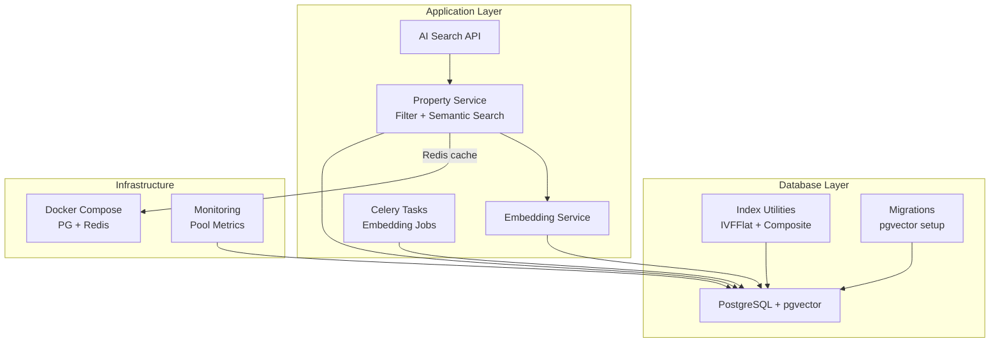

**Diagram sources**
- [ai_search.py:98-160](file://backend/app/api/v1/routes/ai_search.py#L98-L160)
- [property_service.py:91-195](file://backend/app/services/property_service.py#L91-L195)
- [embedding_service.py:17-32](file://backend/app/services/embedding_service.py#L17-L32)
- [embedding_tasks.py:16-80](file://backend/app/tasks/embedding_tasks.py#L16-L80)
- [indexes.py:16-88](file://backend/app/db/indexes.py#L16-L88)
- [20260620_0002_pgvector_embedding.py:21-35](file://backend/alembic/versions/20260620_0002_pgvector_embedding.py#L21-L35)
- [docker-compose.yml:8-28](file://docker-compose.yml#L8-L28)
- [monitoring.py:216-226](file://backend/app/core/monitoring.py#L216-L226)

**Section sources**
- [property.py:38-86](file://backend/app/models/property.py#L38-L86)
- [booking.py:18-47](file://backend/app/models/booking.py#L18-L47)
- [indexes.py:16-88](file://backend/app/db/indexes.py#L16-L88)
- [session.py:1-14](file://backend/app/db/session.py#L1-L14)
- [config.py:15-22](file://backend/app/core/config.py#L15-L22)
- [docker-compose.yml:8-28](file://docker-compose.yml#L8-L28)

## Core Components
- pgvector integration via a custom TypeDecorator to store 1536-dim vectors in PostgreSQL
- IVFFlat index creation with adaptive lists parameter based on row count
- Composite indexes for bookings to optimize frequent filters by tenant_id, landlord_id, property_id with status
- Property service implements both filter-based and semantic search with optional Redis caching
- Embedding service generates embeddings via OpenAI client
- Celery tasks asynchronously generate embeddings and reindex properties
- Index utilities include EXPLAIN ANALYZE helpers and performance checks
- Monitoring exposes async engine pool metrics

**Section sources**
- [property.py:12-22](file://backend/app/models/property.py#L12-L22)
- [indexes.py:16-48](file://backend/app/db/indexes.py#L16-L48)
- [indexes.py:51-82](file://backend/app/db/indexes.py#L51-L82)
- [property_service.py:91-195](file://backend/app/services/property_service.py#L91-L195)
- [embedding_service.py:17-32](file://backend/app/services/embedding_service.py#L17-L32)
- [embedding_tasks.py:16-80](file://backend/app/tasks/embedding_tasks.py#L16-L80)
- [indexes.py:91-117](file://backend/app/db/indexes.py#L91-L117)
- [monitoring.py:216-226](file://backend/app/core/monitoring.py#L216-L226)

## Architecture Overview
The system integrates PostgreSQL with pgvector for semantic search, uses Redis for caching non-vector results, and Celery for background embedding jobs. The AI search API orchestrates natural language parsing, vector search, and summary generation.

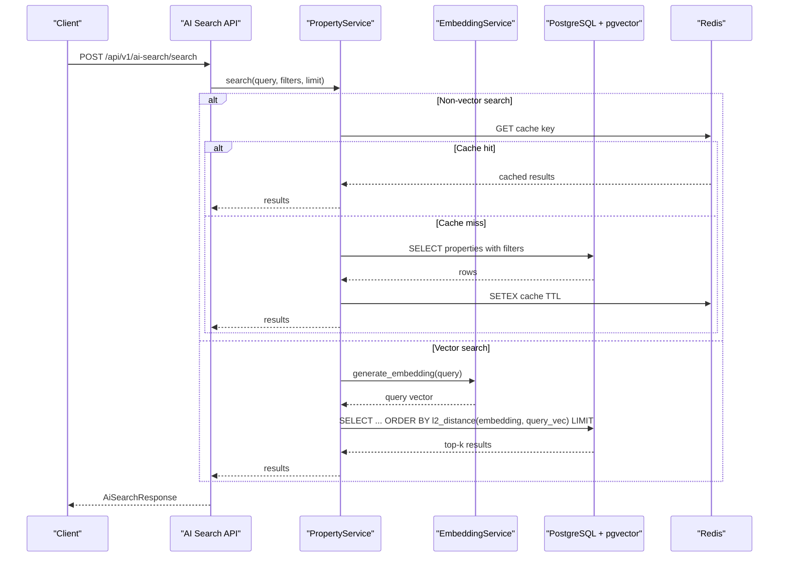

**Diagram sources**
- [ai_search.py:98-160](file://backend/app/api/v1/routes/ai_search.py#L98-L160)
- [property_service.py:91-195](file://backend/app/services/property_service.py#L91-L195)
- [embedding_service.py:17-32](file://backend/app/services/embedding_service.py#L17-L32)

## Detailed Component Analysis

### pgvector Index Optimization (IVFFlat)
- Adaptive lists parameter: computed as sqrt(row_count), capped to at least 1; if fewer than 1000 rows, exact scan is preferred and IVFFlat index is skipped
- Existing index detection avoids recreation
- Uses L2 operator class for similarity ordering
- Migration also creates an initial IVFFlat index with fixed lists value for bootstrap

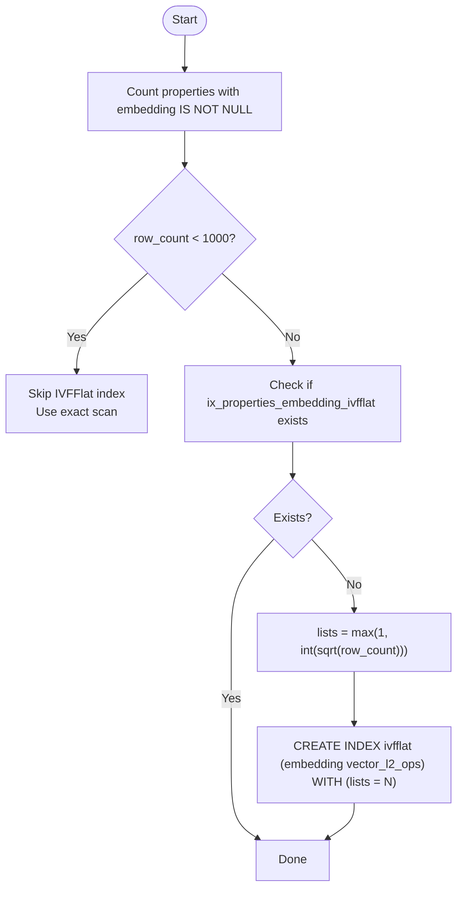

**Diagram sources**
- [indexes.py:16-48](file://backend/app/db/indexes.py#L16-L48)
- [20260620_0002_pgvector_embedding.py:21-35](file://backend/alembic/versions/20260620_0002_pgvector_embedding.py#L21-L35)

**Section sources**
- [indexes.py:16-48](file://backend/app/db/indexes.py#L16-L48)
- [20260620_0002_pgvector_embedding.py:21-35](file://backend/alembic/versions/20260620_0002_pgvector_embedding.py#L21-L35)
- [00-enable-vector.sql:1-3](file://docker/pg-init/00-enable-vector.sql#L1-L3)

### Composite Indexes for Booking Queries
- Composite indexes created for common access patterns:
  - (tenant_id, status)
  - (landlord_id, status)
  - (property_id, status)
- Idempotent creation checks existing indexes before creating new ones

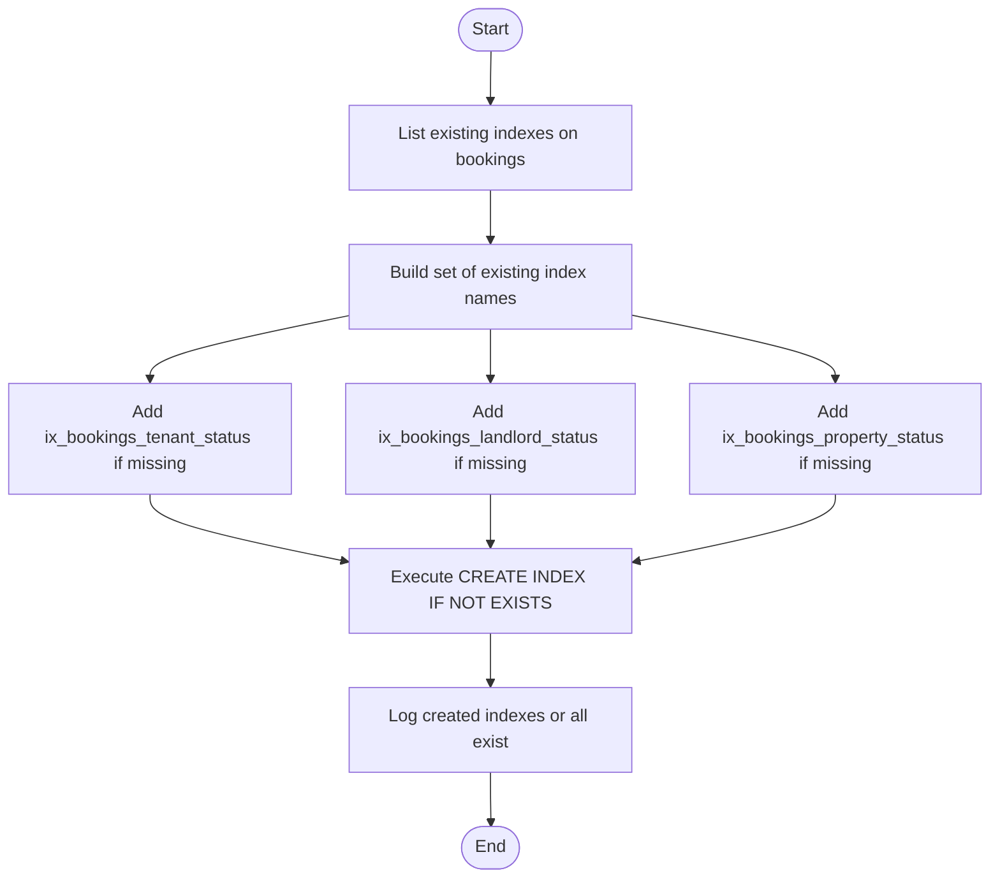

**Diagram sources**
- [indexes.py:51-82](file://backend/app/db/indexes.py#L51-L82)

**Section sources**
- [indexes.py:51-82](file://backend/app/db/indexes.py#L51-L82)
- [booking.py:18-47](file://backend/app/models/booking.py#L18-L47)

### Connection Pooling Configuration and Monitoring
- Async engine created from DATABASE_URL with echo controlled by debug flag
- Session maker configured with expire_on_commit=False
- Pool metrics exposed via monitoring utility that reads size, overflow, and checkedout counts

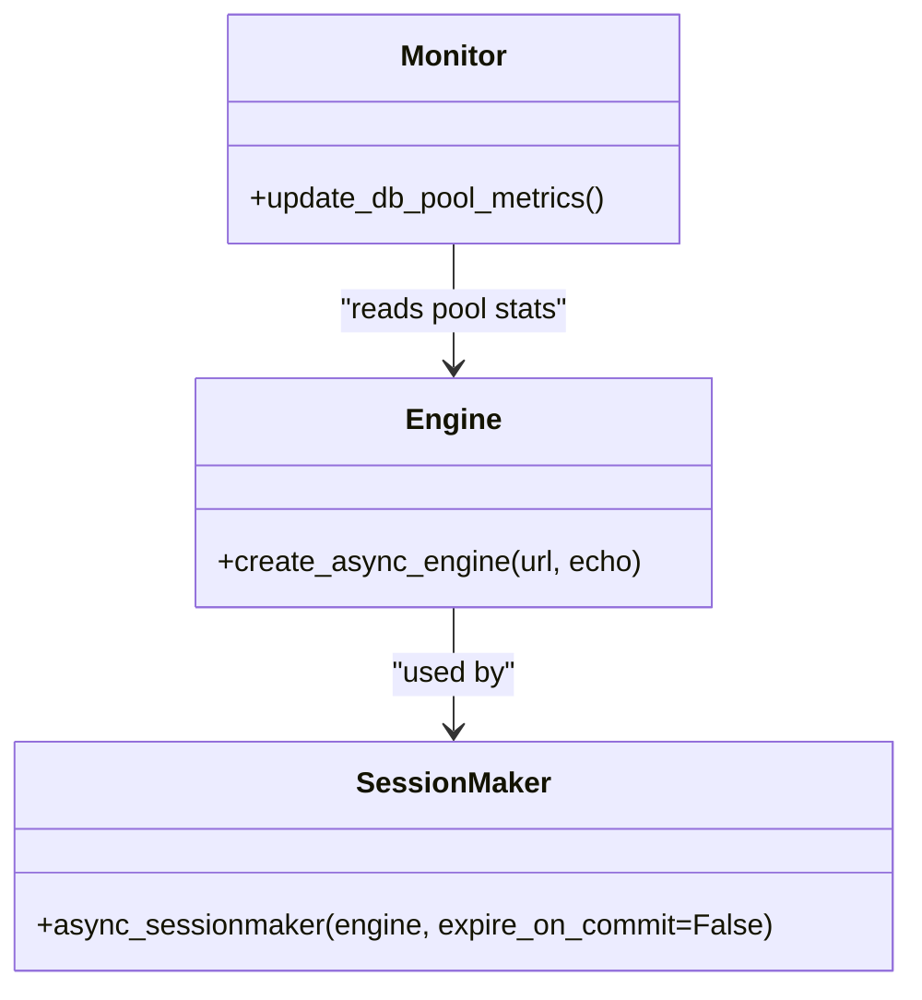

**Diagram sources**
- [session.py:1-14](file://backend/app/db/session.py#L1-L14)
- [monitoring.py:216-226](file://backend/app/core/monitoring.py#L216-L226)
- [config.py:15-22](file://backend/app/core/config.py#L15-L22)

**Section sources**
- [session.py:1-14](file://backend/app/db/session.py#L1-L14)
- [config.py:15-22](file://backend/app/core/config.py#L15-L22)
- [monitoring.py:216-226](file://backend/app/core/monitoring.py#L216-L226)

### Query Execution Plan Analysis (EXPLAIN ANALYZE)
- Utility runs EXPLAIN ANALYZE on provided SQL strings and logs each line
- Helper function executes predefined sample queries for quick diagnostics
- Note: Parameterized queries are not supported directly in EXPLAIN ANALYZE; approximate values are used for logging

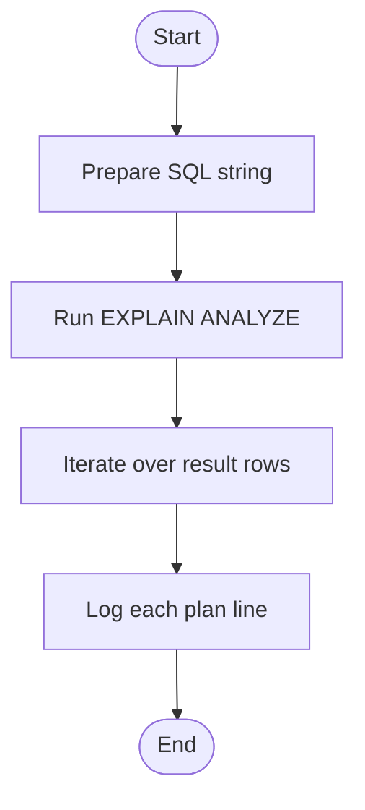

**Diagram sources**
- [indexes.py:91-117](file://backend/app/db/indexes.py#L91-L117)

**Section sources**
- [indexes.py:91-117](file://backend/app/db/indexes.py#L91-L117)

### Semantic Search Optimization
- Non-vector searches are cached in Redis with deterministic keys and TTL
- Vector search builds a query vector via EmbeddingService and orders by L2 distance
- Filters (district, price range, bedrooms, property_type) are applied after building base select
- AI Search API composes user query parts and delegates to PropertyService.search

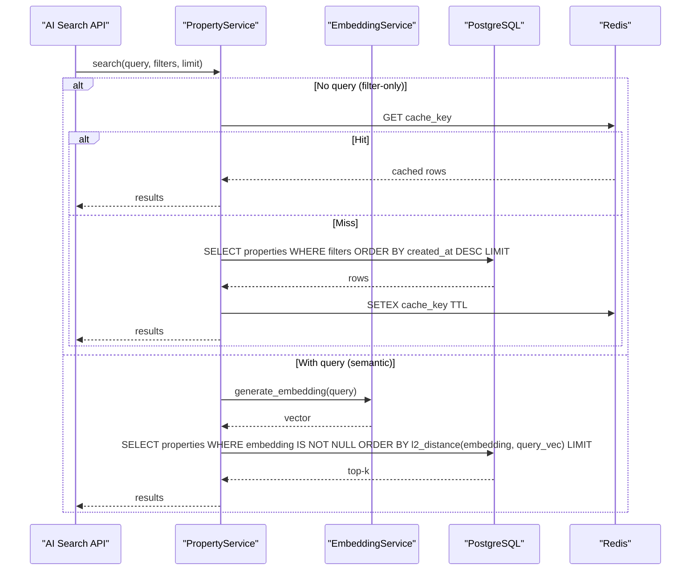

**Diagram sources**
- [property_service.py:91-195](file://backend/app/services/property_service.py#L91-L195)
- [ai_search.py:98-160](file://backend/app/api/v1/routes/ai_search.py#L98-L160)
- [embedding_service.py:17-32](file://backend/app/services/embedding_service.py#L17-L32)

**Section sources**
- [property_service.py:91-195](file://backend/app/services/property_service.py#L91-L195)
- [ai_search.py:98-160](file://backend/app/api/v1/routes/ai_search.py#L98-L160)
- [embedding_service.py:17-32](file://backend/app/services/embedding_service.py#L17-L32)

### Property Filtering Operations
- District and status combined index supports efficient filtering
- Additional filters (price_min/max, bedrooms, property_type) are applied in-memory after base selection
- Caching improves repeated identical filter queries

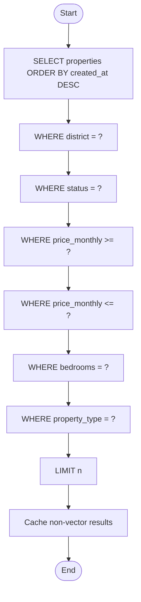

**Diagram sources**
- [property_service.py:91-195](file://backend/app/services/property_service.py#L91-L195)
- [property.py:45-46](file://backend/app/models/property.py#L45-L46)

**Section sources**
- [property_service.py:91-195](file://backend/app/services/property_service.py#L91-L195)
- [property.py:45-46](file://backend/app/models/property.py#L45-L46)

### Booking Management Queries
- Duplicate pending booking check ensures uniqueness per tenant and property
- Listing endpoints order by created_at descending
- Composite indexes support tenant/landlord/property + status filtering

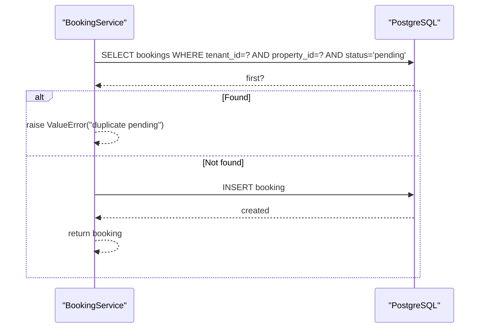

**Diagram sources**
- [booking_service.py:15-79](file://backend/app/services/booking_service.py#L15-L79)
- [indexes.py:51-82](file://backend/app/db/indexes.py#L51-L82)

**Section sources**
- [booking_service.py:15-79](file://backend/app/services/booking_service.py#L15-L79)
- [indexes.py:51-82](file://backend/app/db/indexes.py#L51-L82)

### Batch Operation Optimization (Embeddings)
- Celery task enqueues embedding generation for properties without embeddings
- Task lifecycle tracks job status (pending, processing, completed, failed) with timestamps and error messages
- Reindex task scans for missing embeddings and dispatches individual jobs

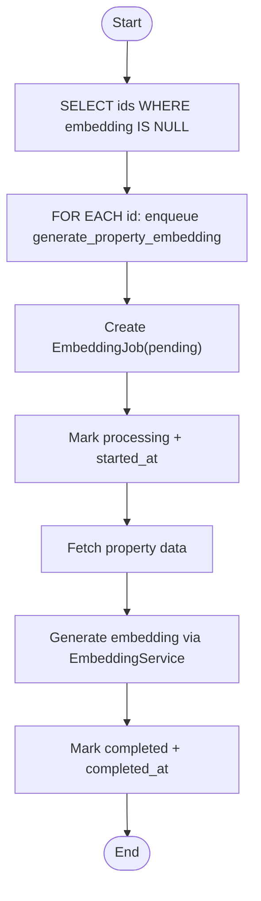

**Diagram sources**
- [embedding_tasks.py:83-111](file://backend/app/tasks/embedding_tasks.py#L83-L111)
- [embedding_tasks.py:16-80](file://backend/app/tasks/embedding_tasks.py#L16-L80)

**Section sources**
- [embedding_tasks.py:16-80](file://backend/app/tasks/embedding_tasks.py#L16-L80)
- [embedding_tasks.py:83-111](file://backend/app/tasks/embedding_tasks.py#L83-L111)

## Dependency Analysis
Key dependencies and relationships:
- Property model depends on pgvector type decorator and includes district+status index
- Booking model defines foreign keys and status enum; composite indexes added by utilities
- Property service depends on EmbeddingService and Redis for caching
- AI Search API depends on PropertyService and LLM service for parsing and summarization
- Index utilities depend on SQLAlchemy text and async session
- Docker Compose provisions PostgreSQL with pgvector and Redis

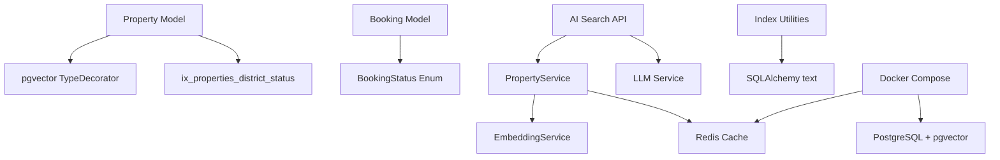

**Diagram sources**
- [property.py:12-22](file://backend/app/models/property.py#L12-L22)
- [property.py:45-46](file://backend/app/models/property.py#L45-L46)
- [booking.py:10-16](file://backend/app/models/booking.py#L10-L16)
- [property_service.py:91-195](file://backend/app/services/property_service.py#L91-L195)
- [ai_search.py:98-160](file://backend/app/api/v1/routes/ai_search.py#L98-L160)
- [indexes.py:16-48](file://backend/app/db/indexes.py#L16-L48)
- [docker-compose.yml:8-28](file://docker-compose.yml#L8-L28)

**Section sources**
- [property.py:12-22](file://backend/app/models/property.py#L12-L22)
- [booking.py:10-16](file://backend/app/models/booking.py#L10-L16)
- [property_service.py:91-195](file://backend/app/services/property_service.py#L91-L195)
- [ai_search.py:98-160](file://backend/app/api/v1/routes/ai_search.py#L98-L160)
- [indexes.py:16-48](file://backend/app/db/indexes.py#L16-L48)
- [docker-compose.yml:8-28](file://docker-compose.yml#L8-L28)

## Performance Considerations
- IVFFLat lists tuning: Use adaptive lists based on sqrt(row_count); avoid index creation when row_count < 1000 to prefer exact scans
- Composite indexes: Ensure tenant_id, landlord_id, property_id + status combinations are indexed for frequent filters
- Caching: Cache non-vector search results with deterministic keys and TTL to reduce DB load
- Vector search: Order by L2 distance and limit results to minimize overhead; ensure embedding column is populated
- Connection pooling: Monitor pool size, overflow, and checked-out connections; adjust pool parameters if needed
- EXPLAIN ANALYZE: Use utilities to analyze query plans and identify bottlenecks
- Batch operations: Use Celery tasks to process embeddings in batches and track job states

[No sources needed since this section provides general guidance]

## Troubleshooting Guide
- Missing pgvector extension: Ensure docker init script enables vector extension
- IVFFlat index not used: Verify row count threshold and index existence; consider adjusting lists parameter
- Slow booking queries: Confirm composite indexes exist and match query predicates
- High memory usage: Reduce result sets, use pagination, and monitor pool metrics
- Redis cache misses: Validate cache key construction and TTL; inspect Redis availability
- Embedding failures: Check job status and error messages; verify OpenAI API configuration

**Section sources**
- [00-enable-vector.sql:1-3](file://docker/pg-init/00-enable-vector.sql#L1-L3)
- [indexes.py:16-48](file://backend/app/db/indexes.py#L16-L48)
- [indexes.py:51-82](file://backend/app/db/indexes.py#L51-L82)
- [monitoring.py:216-226](file://backend/app/core/monitoring.py#L216-L226)
- [embedding_tasks.py:16-80](file://backend/app/tasks/embedding_tasks.py#L16-L80)

## Conclusion
By combining adaptive IVFFlat indexing, targeted composite indexes, application-level caching, and robust monitoring, the platform achieves efficient semantic search and fast booking management. Continuous analysis with EXPLAIN ANALYZE and careful tuning of lists and pool parameters will sustain performance as data grows.

[No sources needed since this section summarizes without analyzing specific files]

## Appendices
- Example queries for EXPLAIN ANALYZE can be run via the provided utility functions
- Docker Compose configures PostgreSQL with pgvector and Redis with persistence and memory policies

**Section sources**
- [indexes.py:100-117](file://backend/app/db/indexes.py#L100-L117)
- [docker-compose.yml:29-46](file://docker-compose.yml#L29-L46)