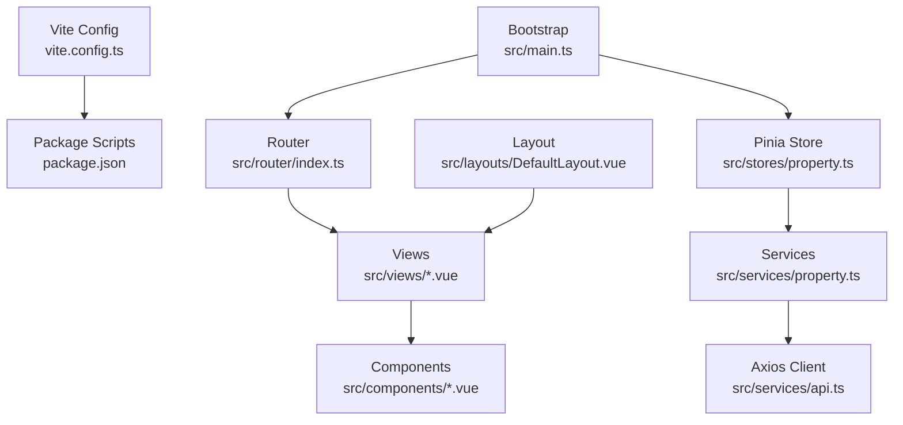
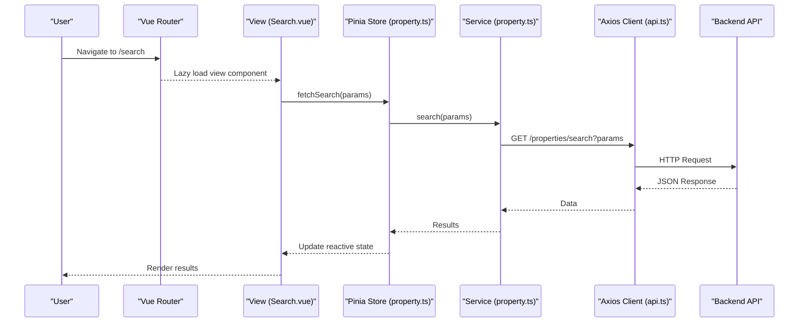
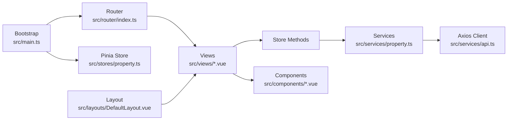
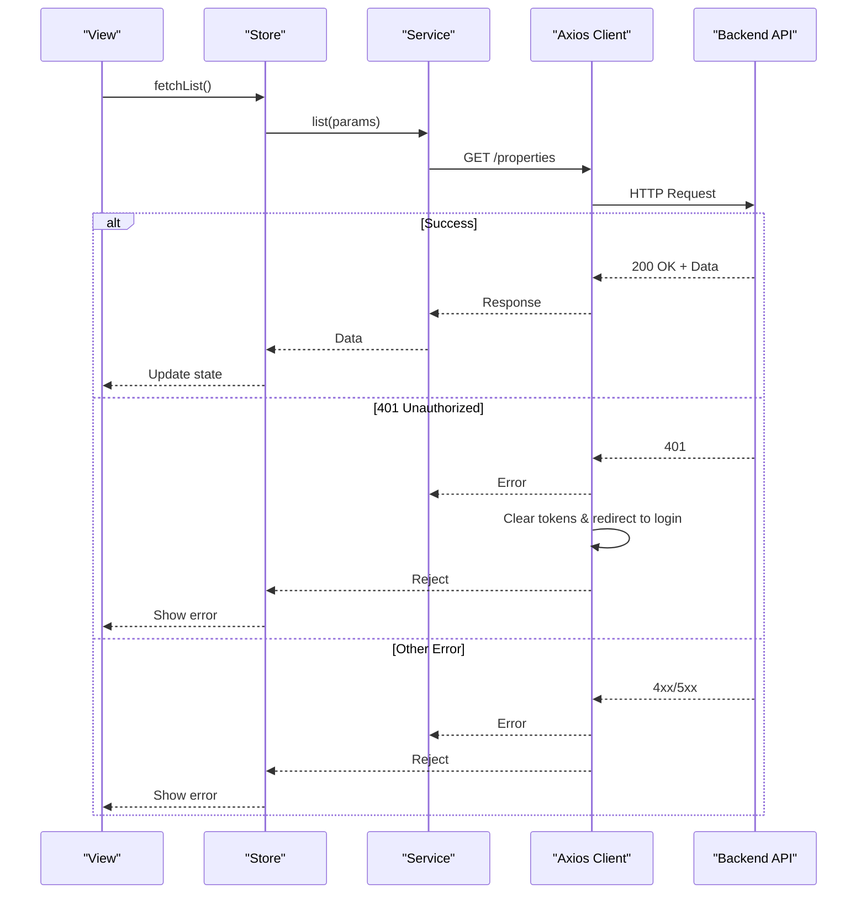

# Frontend Performance Tuning

<cite>
**Referenced Files in This Document**
- [vite.config.ts](file://frontend/vite.config.ts)
- [package.json](file://frontend/package.json)
- [main.ts](file://frontend/src/main.ts)
- [App.vue](file://frontend/src/App.vue)
- [index.ts](file://frontend/src/router/index.ts)
- [api.ts](file://frontend/src/services/api.ts)
- [property.ts](file://frontend/src/stores/property.ts)
- [property.ts](file://frontend/src/services/property.ts)
- [Search.vue](file://frontend/src/views/Search.vue)
- [Home.vue](file://frontend/src/views/Home.vue)
- [AmapMap.vue](file://frontend/src/components/AmapMap.vue)
- [DefaultLayout.vue](file://frontend/src/layouts/DefaultLayout.vue)
</cite>

## Table of Contents
1. Introduction
2. Project Structure
3. Core Components
4. Architecture Overview
5. Detailed Component Analysis
6. Dependency Analysis
7. Performance Considerations
8. Troubleshooting Guide
9. Conclusion
10. Appendices

## Introduction
This document provides a comprehensive guide to frontend performance optimization for the Vue 3 + TypeScript application. It covers build-time optimizations with Vite, runtime strategies such as code splitting and lazy loading, component-level improvements including virtualization and image handling, state management best practices with Pinia, network request enhancements (deduplication, caching, retries), monitoring and diagnostics, mobile considerations, progressive loading patterns, and offline capability planning. The guidance is grounded in the existing codebase and highlights where current implementations already follow best practices and where targeted improvements can be applied.

## Project Structure
The frontend is organized by feature and layer:
- Build and tooling: Vite configuration and package scripts
- Application bootstrap: app initialization, router, Pinia, UI library setup
- Routing: route definitions with dynamic imports for code splitting
- State: Pinia stores for domain data (e.g., properties)
- Services: Axios-based API clients with interceptors for auth and error handling
- Views: Feature pages using store methods and components
- Components: Reusable UI pieces and heavy third-party integrations (e.g., map)
- Layouts: Shell layout with navigation and global search

**Diagram sources**
- [vite.config.ts:1-22](file://frontend/vite.config.ts#L1-L22)
- [package.json:1-31](file://frontend/package.json#L1-L31)
- [main.ts:1-22](file://frontend/src/main.ts#L1-L22)
- [index.ts:1-212](file://frontend/src/router/index.ts#L1-L212)
- [property.ts:1-136](file://frontend/src/stores/property.ts#L1-L136)
- [property.ts:1-86](file://frontend/src/services/property.ts#L1-L86)
- [api.ts:1-56](file://frontend/src/services/api.ts#L1-L56)
- [Search.vue:1-495](file://frontend/src/views/Search.vue#L1-L495)
- [Home.vue:1-719](file://frontend/src/views/Home.vue#L1-L719)
- [AmapMap.vue:1-198](file://frontend/src/components/AmapMap.vue#L1-L198)
- [DefaultLayout.vue:1-372](file://frontend/src/layouts/DefaultLayout.vue#L1-L372)

**Section sources**
- [vite.config.ts:1-22](file://frontend/vite.config.ts#L1-L22)
- [package.json:1-31](file://frontend/package.json#L1-L31)
- [main.ts:1-22](file://frontend/src/main.ts#L1-L22)
- [index.ts:1-212](file://frontend/src/router/index.ts#L1-L212)

## Core Components
Key building blocks that influence performance:
- Router with dynamic imports for route-level code splitting
- Axios client with request/response interceptors for auth and centralized error handling
- Pinia store encapsulating property data and operations
- Views orchestrating data fetching and rendering
- Heavy component integration (map) loaded on demand

Performance-relevant observations:
- Route-level lazy loading is already implemented via dynamic imports, reducing initial bundle size.
- Axios base URL and timeout are configured centrally; token injection and error UX are handled in interceptors.
- Store methods manage loading states and local data updates efficiently.

**Section sources**
- [index.ts:1-212](file://frontend/src/router/index.ts#L1-L212)
- [api.ts:1-56](file://frontend/src/services/api.ts#L1-L56)
- [property.ts:1-136](file://frontend/src/stores/property.ts#L1-L136)
- [Search.vue:1-495](file://frontend/src/views/Search.vue#L1-L495)
- [Home.vue:1-719](file://frontend/src/views/Home.vue#L1-L719)

## Architecture Overview
The application follows a layered architecture:
- Bootstrap initializes Vue app, Pinia, router, and UI framework
- Router defines routes with dynamic imports for code splitting
- Views call Pinia stores to fetch and display data
- Stores use services to make HTTP requests via Axios
- Heavy features like maps are lazily loaded when needed

**Diagram sources**
- [index.ts:1-212](file://frontend/src/router/index.ts#L1-L212)
- [Search.vue:1-495](file://frontend/src/views/Search.vue#L1-L495)
- [property.ts:1-136](file://frontend/src/stores/property.ts#L1-L136)
- [property.ts:1-86](file://frontend/src/services/property.ts#L1-L86)
- [api.ts:1-56](file://frontend/src/services/api.ts#L1-L56)

## Detailed Component Analysis

### Vite Build Configuration Optimizations
Current configuration includes plugin registration, alias resolution, dev server port, and proxy settings. To further optimize:
- Enable chunking and manual chunks for large libraries (e.g., Element Plus icons, Leaflet)
- Configure splitChunks to separate vendor and feature chunks
- Use Rollup options for minification and tree-shaking
- Add compression plugins for production builds
- Optimize asset handling (image formats, sizes, responsive images)

Recommended additions:
- Manual chunks for heavy dependencies
- Splitting by route and feature
- Asset pipeline improvements (e.g., image optimization, SVG sprites)
- Compression (gzip/brotli) at build time or CDN level

**Section sources**
- [vite.config.ts:1-22](file://frontend/vite.config.ts#L1-L22)
- [package.json:1-31](file://frontend/package.json#L1-L31)

### Code Splitting and Lazy Loading Strategies
- Route-level lazy loading is already implemented using dynamic imports across all routes.
- Additional opportunities:
  - Lazy-load heavy components (e.g., map integration) only when visible
  - Defer non-critical third-party scripts (e.g., analytics, chat widgets)
  - Use Suspense boundaries for async components to improve perceived performance

Implementation examples:
- Map component dynamically loads external script and initializes only when coordinates are available.

**Section sources**
- [index.ts:1-212](file://frontend/src/router/index.ts#L1-L212)
- [AmapMap.vue:1-198](file://frontend/src/components/AmapMap.vue#L1-L198)

### Bundle Size Reduction
- Avoid importing entire UI libraries; prefer selective imports where possible
- Tree-shake unused icons and components
- Remove unused locales and styles from Element Plus
- Analyze bundle with tools (e.g., vite-bundle-analyzer) to identify large modules
- Compress assets and leverage CDN caching

**Section sources**
- [main.ts:1-22](file://frontend/src/main.ts#L1-L22)
- [package.json:1-31](file://frontend/package.json#L1-L31)

### Component-Level Optimizations

#### Virtual Scrolling for Large Lists
- Current list rendering uses pagination and slicing for manageable DOM nodes.
- For very large datasets, consider implementing virtual scrolling to render only visible items.
- Benefits: reduced memory usage and faster reflows/repaints.

Recommendation:
- Integrate a virtual scroller library or implement windowing logic for lists exceeding hundreds of items.

**Section sources**
- [Search.vue:1-495](file://frontend/src/views/Search.vue#L1-L495)

#### Image Optimization with Lazy Loading
- Images are rendered conditionally with placeholders and computed primary image URLs.
- Enhancements:
  - Use native lazy loading attributes for offscreen images
  - Implement intersection observer-based lazy loading for complex scenarios
  - Serve optimized image formats (WebP/AVIF) and sizes via CDN
  - Provide srcset for responsive images

**Section sources**
- [PropertyCard.vue:1-318](file://frontend/src/components/PropertyCard.vue#L1-L318)
- [Home.vue:1-719](file://frontend/src/views/Home.vue#L1-L719)

#### Efficient Re-rendering Patterns
- Use computed properties for derived data to avoid unnecessary recalculations
- Keep component props minimal and stable
- Prefer v-memo or key-based diffing for lists
- Avoid deep watchers; watch specific fields instead

Example:
- Computed amenity tags derive from property attributes without extra watchers.

**Section sources**
- [PropertyCard.vue:1-318](file://frontend/src/components/PropertyCard.vue#L1-L318)

### State Management Optimization with Pinia
- Store methods encapsulate loading states and update local arrays efficiently.
- Best practices:
  - Normalize state to reduce duplication
  - Use getters for derived data
  - Debounce frequent updates (e.g., search input)
  - Avoid mutating large arrays frequently; prefer immutable updates

Observations:
- Search results and images are stored separately to scope updates.
- Loading flags prevent redundant UI flicker.

**Section sources**
- [property.ts:1-136](file://frontend/src/stores/property.ts#L1-L136)

### Network Request Optimization
- Centralized Axios client configures baseURL, timeout, and headers.
- Interceptors handle Authorization and error messages.
- Enhancements:
  - Request deduplication: cache in-flight requests to prevent duplicate calls
  - Response caching: cache GET responses with TTL and invalidation on mutations
  - Retry mechanisms: exponential backoff for transient errors
  - AbortController: cancel stale requests on navigation or new searches

Implementation suggestions:
- Wrap axios instance with a utility that tracks pending requests and caches responses
- Integrate retry logic in response interceptor for 5xx/network errors

**Section sources**
- [api.ts:1-56](file://frontend/src/services/api.ts#L1-L56)
- [property.ts:1-86](file://frontend/src/services/property.ts#L1-L86)

### Monitoring and Diagnostics
- Measure Core Web Vitals using browser APIs or lightweight libraries
- Track long tasks and layout shifts via Performance Observer
- Instrument network waterfall and resource timing
- Capture user interactions and errors for correlation

Practical steps:
- Add metrics collection in bootstrap
- Report to analytics backend or logging service
- Use Lighthouse CI for regression checks

[No sources needed since this section provides general guidance]

### Mobile Performance Considerations
- Reduce payload sizes and defer non-critical resources
- Use responsive images and adaptive layouts
- Minimize main thread work; offload heavy computations to web workers if necessary
- Optimize touch interactions and avoid jank during scroll

[No sources needed since this section provides general guidance]

### Progressive Loading Patterns
- Skeleton screens and placeholders for content areas
- Staggered loading of sections and images
- Preload critical resources and prefetch next-route assets

[No sources needed since this section provides general guidance]

### Offline Capability Implementation
- Plan for service worker integration to cache static assets and API responses
- Implement background sync for queued actions
- Graceful degradation when offline (fallback views, cached data)

[No sources needed since this section provides general guidance]

## Dependency Analysis
High-level dependency relationships among core modules:

**Diagram sources**
- [main.ts:1-22](file://frontend/src/main.ts#L1-L22)
- [index.ts:1-212](file://frontend/src/router/index.ts#L1-L212)
- [property.ts:1-136](file://frontend/src/stores/property.ts#L1-L136)
- [property.ts:1-86](file://frontend/src/services/property.ts#L1-L86)
- [api.ts:1-56](file://frontend/src/services/api.ts#L1-L56)
- [Search.vue:1-495](file://frontend/src/views/Search.vue#L1-L495)
- [Home.vue:1-719](file://frontend/src/views/Home.vue#L1-L719)
- [DefaultLayout.vue:1-372](file://frontend/src/layouts/DefaultLayout.vue#L1-L372)

**Section sources**
- [main.ts:1-22](file://frontend/src/main.ts#L1-L22)
- [index.ts:1-212](file://frontend/src/router/index.ts#L1-L212)
- [property.ts:1-136](file://frontend/src/stores/property.ts#L1-L136)
- [property.ts:1-86](file://frontend/src/services/property.ts#L1-L86)
- [api.ts:1-56](file://frontend/src/services/api.ts#L1-L56)
- [Search.vue:1-495](file://frontend/src/views/Search.vue#L1-L495)
- [Home.vue:1-719](file://frontend/src/views/Home.vue#L1-L719)
- [DefaultLayout.vue:1-372](file://frontend/src/layouts/DefaultLayout.vue#L1-L372)

## Performance Considerations
- Build-time:
  - Configure manual chunks and splitChunks for large libraries
  - Enable compression and asset optimization
- Runtime:
  - Leverage route-level code splitting and component lazy loading
  - Use virtual scrolling for large lists
  - Apply image lazy loading and responsive formats
  - Optimize reactivity with computed properties and minimal watchers
- State:
  - Normalize and memoize derived data
  - Debounce frequent updates
- Network:
  - Deduplicate in-flight requests
  - Cache GET responses with TTL and invalidation
  - Add retry with backoff for transient failures
- Monitoring:
  - Collect Core Web Vitals and performance metrics
  - Use Lighthouse CI and performance budgets

[No sources needed since this section provides general guidance]

## Troubleshooting Guide
Common issues and remedies:
- Authentication redirects causing loops:
  - Ensure 401 handling does not redirect on login page attempts
  - Clear tokens and navigate to login only when appropriate
- Excessive re-renders:
  - Check for deep watchers and large object references
  - Use computed properties and stable keys
- Slow initial load:
  - Verify route-level lazy loading is effective
  - Analyze bundle size and remove unused dependencies
- Map initialization failures:
  - Handle missing keys and fallback gracefully
  - Destroy instances on unmount to prevent leaks

**Section sources**
- [api.ts:1-56](file://frontend/src/services/api.ts#L1-L56)
- [AmapMap.vue:1-198](file://frontend/src/components/AmapMap.vue#L1-L198)

## Conclusion
The application already implements several strong performance foundations: route-level code splitting, centralized networking with interceptors, and careful component design with computed properties. Targeted enhancements—such as advanced Vite chunking, request deduplication and caching, virtual scrolling for large lists, and robust monitoring—will further improve load times, interactivity, and overall user experience. Adopting these strategies systematically will yield measurable gains across desktop and mobile environments.

[No sources needed since this section summarizes without analyzing specific files]

## Appendices

### Example: Network Request Flow with Error Handling

**Diagram sources**
- [property.ts:1-136](file://frontend/src/stores/property.ts#L1-L136)
- [property.ts:1-86](file://frontend/src/services/property.ts#L1-L86)
- [api.ts:1-56](file://frontend/src/services/api.ts#L1-L56)