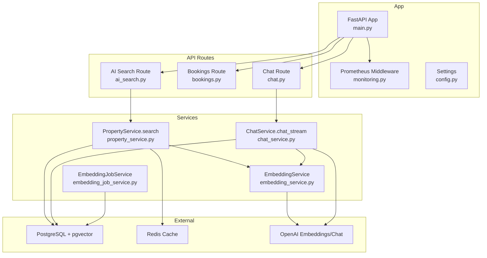
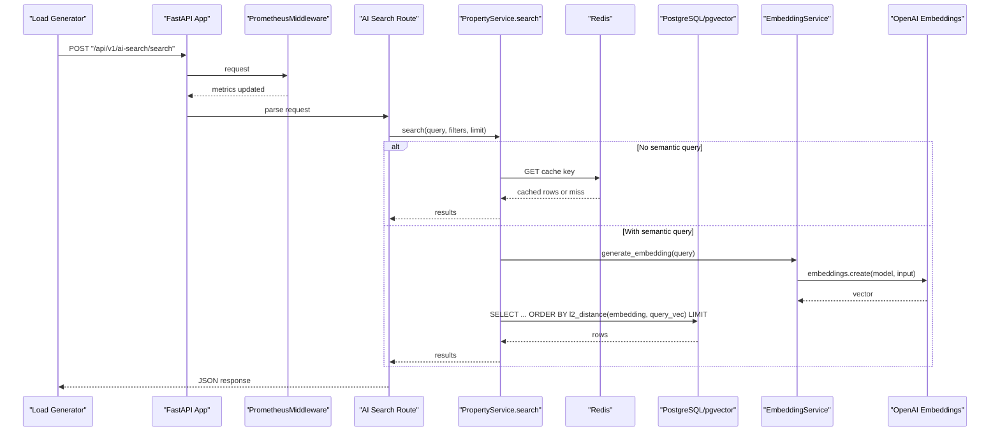
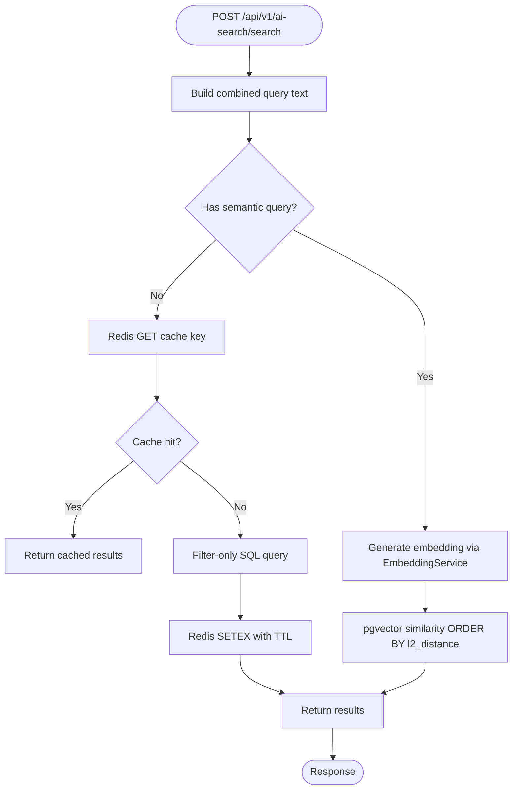
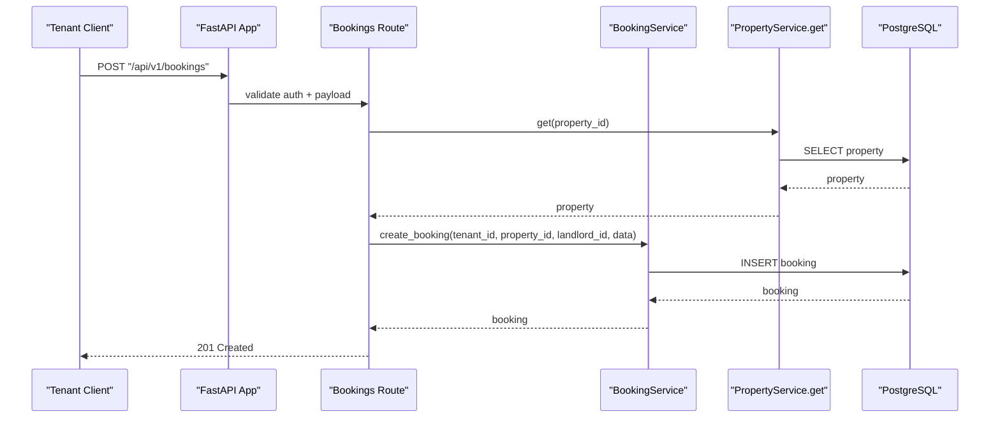
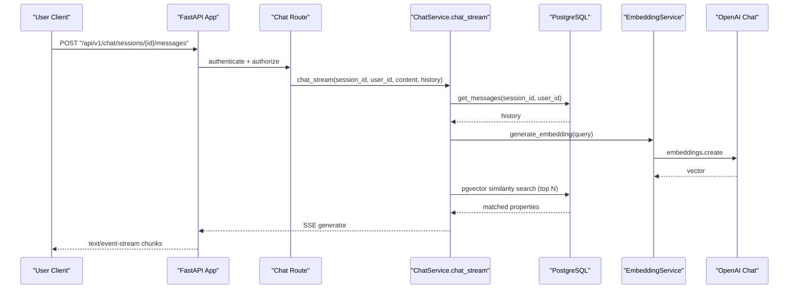
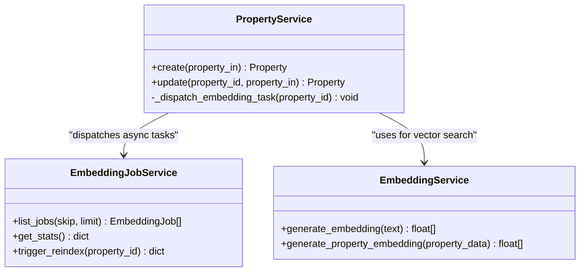
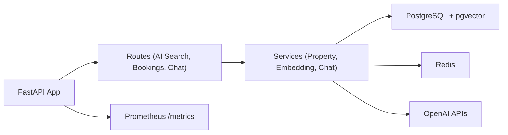

# Load Testing & Benchmarking

<cite>
**Referenced Files in This Document**
- [backend/app/main.py](file://backend/app/main.py)
- [backend/app/core/monitoring.py](file://backend/app/core/monitoring.py)
- [backend/app/core/config.py](file://backend/app/core/config.py)
- [backend/app/api/v1/routes/ai_search.py](file://backend/app/api/v1/routes/ai_search.py)
- [backend/app/api/v1/routes/bookings.py](file://backend/app/api/v1/routes/bookings.py)
- [backend/app/api/v1/routes/chat.py](file://backend/app/api/v1/routes/chat.py)
- [backend/app/services/property_service.py](file://backend/app/services/property_service.py)
- [backend/app/services/embedding_service.py](file://backend/app/services/embedding_service.py)
- [backend/app/services/chat_service.py](file://backend/app/services/chat_service.py)
- [backend/app/services/embedding_job_service.py](file://backend/app/services/embedding_job_service.py)
- [docker-compose.yml](file://docker-compose.yml)
- [backend/tests/conftest.py](file://backend/tests/conftest.py)
</cite>

## Table of Contents
1. Introduction
2. Project Structure
3. Core Components
4. Architecture Overview
5. Detailed Component Analysis
6. Dependency Analysis
7. Performance Considerations
8. Troubleshooting Guide
9. Conclusion
10. Appendices

## Introduction
This document defines load testing and benchmarking methodologies for the Rental Housing Structure platform. It focuses on simulating realistic user traffic across property search, booking operations, and AI chat interactions; measuring critical journeys such as semantic search performance, embedding generation throughput, and real-time chat response times; and establishing capacity planning, scalability, and stress testing procedures. It also provides guidance for automated test suites, CI/CD integration, regression gates, cloud-based strategies, cost optimization, and interpreting results to inform scaling decisions.

## Project Structure
The backend is a FastAPI application with:
- API routes for AI search, bookings, and chat
- Services for property search, embeddings, and chat RAG
- Prometheus metrics middleware and a /metrics endpoint
- Redis-backed caching for non-vector searches
- Celery task dispatch for asynchronous embedding generation
- Docker Compose services for PostgreSQL (with pgvector) and Redis

**Diagram sources**
- [backend/app/main.py:17-82](file://backend/app/main.py#L17-L82)
- [backend/app/core/monitoring.py:126-176](file://backend/app/core/monitoring.py#L126-L176)
- [backend/app/api/v1/routes/ai_search.py:80-160](file://backend/app/api/v1/routes/ai_search.py#L80-L160)
- [backend/app/api/v1/routes/bookings.py:14-112](file://backend/app/api/v1/routes/bookings.py#L14-L112)
- [backend/app/api/v1/routes/chat.py:47-143](file://backend/app/api/v1/routes/chat.py#L47-L143)
- [backend/app/services/property_service.py:91-195](file://backend/app/services/property_service.py#L91-L195)
- [backend/app/services/embedding_service.py:17-32](file://backend/app/services/embedding_service.py#L17-L32)
- [backend/app/services/chat_service.py:17-302](file://backend/app/services/chat_service.py#L17-302)
- [backend/app/services/embedding_job_service.py:7-54](file://backend/app/services/embedding_job_service.py#L7-54)

**Section sources**
- [backend/app/main.py:17-82](file://backend/app/main.py#L17-L82)
- [docker-compose.yml:9-53](file://docker-compose.yml#L9-L53)

## Core Components
Key components relevant to performance testing:
- FastAPI app with Prometheus middleware and optional rate limiting
- AI search route that performs semantic search and summary generation
- Bookings route for tenant/landlord flows
- Chat route with streaming responses and RAG context retrieval
- Property service with Redis cache for filter-only queries and vector search path
- Embedding service for OpenAI embeddings
- Chat service for RAG and streaming chat
- Embedding job service for reindexing tasks

Performance-critical paths:
- Semantic search: embedding generation + pgvector similarity query
- Non-vector search: Redis cache hit/miss behavior
- Streaming chat: SSE chunks from LLM after RAG context retrieval
- Booking creation/update/cancel: DB writes and authorization checks

**Section sources**
- [backend/app/core/monitoring.py:74-176](file://backend/app/core/monitoring.py#L74-L176)
- [backend/app/api/v1/routes/ai_search.py:80-160](file://backend/app/api/v1/routes/ai_search.py#L80-L160)
- [backend/app/api/v1/routes/bookings.py:14-112](file://backend/app/api/v1/routes/bookings.py#L14-L112)
- [backend/app/api/v1/routes/chat.py:106-143](file://backend/app/api/v1/routes/chat.py#L106-L143)
- [backend/app/services/property_service.py:91-195](file://backend/app/services/property_service.py#L91-L195)
- [backend/app/services/embedding_service.py:17-32](file://backend/app/services/embedding_service.py#L17-L32)
- [backend/app/services/chat_service.py:171-302](file://backend/app/services/chat_service.py#L171-302)
- [backend/app/services/embedding_job_service.py:21-54](file://backend/app/services/embedding_job_service.py#L21-L54)

## Architecture Overview
The system exposes REST endpoints under /api/v1. Requests are instrumented by Prometheus middleware and may be rate-limited via Redis. Property search can short-circuit through Redis when no semantic query is provided. Vector search uses pgvector similarity. Chat uses RAG to retrieve top properties and streams LLM responses.

**Diagram sources**
- [backend/app/main.py:41-66](file://backend/app/main.py#L41-L66)
- [backend/app/core/monitoring.py:126-176](file://backend/app/core/monitoring.py#L126-L176)
- [backend/app/api/v1/routes/ai_search.py:98-160](file://backend/app/api/v1/routes/ai_search.py#L98-L160)
- [backend/app/services/property_service.py:91-195](file://backend/app/services/property_service.py#L91-L195)
- [backend/app/services/embedding_service.py:17-32](file://backend/app/services/embedding_service.py#L17-L32)

## Detailed Component Analysis

### AI Search Journey
- Endpoints:
  - Parse natural language into structured parameters
  - Perform semantic search and return top results with an AI summary
- Critical metrics:
  - Latency per endpoint
  - LLM call latency and error rates
  - Database vector search latency
  - Cache hit ratio for non-vector queries

**Diagram sources**
- [backend/app/api/v1/routes/ai_search.py:98-160](file://backend/app/api/v1/routes/ai_search.py#L98-L160)
- [backend/app/services/property_service.py:91-195](file://backend/app/services/property_service.py#L91-L195)
- [backend/app/services/embedding_service.py:17-32](file://backend/app/services/embedding_service.py#L17-L32)

**Section sources**
- [backend/app/api/v1/routes/ai_search.py:80-160](file://backend/app/api/v1/routes/ai_search.py#L80-L160)
- [backend/app/services/property_service.py:91-195](file://backend/app/services/property_service.py#L91-L195)
- [backend/app/services/embedding_service.py:17-32](file://backend/app/services/embedding_service.py#L17-L32)

### Booking Operations
- Endpoints:
  - Create booking (tenant only)
  - List bookings (role-aware)
  - Get booking (authorization check)
  - Update status (landlord only)
  - Cancel booking (tenant only)
- Critical metrics:
  - Write latency and contention
  - Authorization overhead
  - Error rates for conflicts and forbidden access

**Diagram sources**
- [backend/app/api/v1/routes/bookings.py:14-41](file://backend/app/api/v1/routes/bookings.py#L14-L41)

**Section sources**
- [backend/app/api/v1/routes/bookings.py:14-112](file://backend/app/api/v1/routes/bookings.py#L14-L112)

### Real-time Chat Interactions
- Endpoints:
  - Create/list/delete sessions
  - Get messages
  - Send message (SSE stream)
- Critical metrics:
  - Time-to-first-byte (TTFB)
  - Chunk inter-arrival time
  - Full response latency
  - RAG retrieval latency and LLM streaming latency

**Diagram sources**
- [backend/app/api/v1/routes/chat.py:106-143](file://backend/app/api/v1/routes/chat.py#L106-L143)
- [backend/app/services/chat_service.py:227-302](file://backend/app/services/chat_service.py#L227-302)
- [backend/app/services/embedding_service.py:17-32](file://backend/app/services/embedding_service.py#L17-L32)

**Section sources**
- [backend/app/api/v1/routes/chat.py:47-143](file://backend/app/api/v1/routes/chat.py#L47-L143)
- [backend/app/services/chat_service.py:171-302](file://backend/app/services/chat_service.py#L171-302)

### Embedding Generation Throughput
- Service:
  - Async OpenAI client for embeddings
  - Batch triggers via Celery tasks (dispatched from property create/update)
- Metrics:
  - Embedding requests per second
  - External API latency and throttling errors
  - Task queue depth and processing time

**Diagram sources**
- [backend/app/services/embedding_service.py:17-32](file://backend/app/services/embedding_service.py#L17-L32)
- [backend/app/services/embedding_job_service.py:7-54](file://backend/app/services/embedding_job_service.py#L7-54)
- [backend/app/services/property_service.py:225-239](file://backend/app/services/property_service.py#L225-L239)

**Section sources**
- [backend/app/services/embedding_service.py:17-32](file://backend/app/services/embedding_service.py#L17-L32)
- [backend/app/services/embedding_job_service.py:21-54](file://backend/app/services/embedding_job_service.py#L21-L54)
- [backend/app/services/property_service.py:225-239](file://backend/app/services/property_service.py#L225-L239)

## Dependency Analysis
- Application-level dependencies:
  - FastAPI app includes routers and middleware
  - Prometheus middleware instruments all HTTP requests
  - Optional Redis-backed rate limiter
- Service-level dependencies:
  - PropertyService depends on Redis and PostgreSQL/pgvector
  - EmbeddingService depends on OpenAI embeddings API
  - ChatService depends on PostgreSQL/pgvector and OpenAI chat API
- Infrastructure dependencies:
  - PostgreSQL with pgvector extension
  - Redis for caching and rate limiting
  - Celery workers for background embedding jobs

**Diagram sources**
- [backend/app/main.py:41-71](file://backend/app/main.py#L41-L71)
- [backend/app/core/monitoring.py:167-176](file://backend/app/core/monitoring.py#L167-L176)
- [backend/app/services/property_service.py:91-195](file://backend/app/services/property_service.py#L91-L195)
- [backend/app/services/embedding_service.py:17-32](file://backend/app/services/embedding_service.py#L17-L32)
- [backend/app/services/chat_service.py:171-302](file://backend/app/services/chat_service.py#L171-302)

**Section sources**
- [backend/app/main.py:41-71](file://backend/app/main.py#L41-L71)
- [backend/app/core/monitoring.py:74-176](file://backend/app/core/monitoring.py#L74-L176)
- [backend/app/services/property_service.py:91-195](file://backend/app/services/property_service.py#L91-L195)
- [backend/app/services/embedding_service.py:17-32](file://backend/app/services/embedding_service.py#L17-L32)
- [backend/app/services/chat_service.py:171-302](file://backend/app/services/chat_service.py#L171-302)

## Performance Considerations
- Instrumentation and observability:
  - Use Prometheus middleware to collect request counts, latencies, and in-flight gauges
  - Expose /metrics endpoint for scraping
  - Track Celery task counters and histograms for background work
- Caching strategy:
  - Non-vector searches benefit from Redis cache hits; measure hit ratio and TTL effectiveness
  - Ensure cache keys are deterministic and consistent across parameter variations
- Vector search:
  - Embedding generation adds external API latency; consider batching and retries
  - pgvector similarity queries should leverage indexes; monitor query plans and latency
- Streaming chat:
  - Measure TTFB and chunk intervals; ensure server-side buffering is disabled for SSE
- Rate limiting:
  - Validate Redis-backed rate limiter behavior under burst loads
- Database pool:
  - Monitor pool size, overflow, and checked-out connections to avoid saturation

[No sources needed since this section provides general guidance]

## Troubleshooting Guide
Common issues and diagnostics:
- High latency on semantic search:
  - Check embedding service availability and quotas
  - Inspect pgvector query performance and index usage
  - Review Redis cache misses for filter-only queries
- Streaming chat stalls:
  - Verify SSE headers and keep-alive settings
  - Confirm LLM streaming responses and network stability
- Rate limiting false positives:
  - Validate Redis connectivity and token bucket state
- Celery task backlogs:
  - Monitor task counters and latency histograms
  - Scale worker instances and adjust concurrency

**Section sources**
- [backend/app/core/monitoring.py:126-176](file://backend/app/core/monitoring.py#L126-L176)
- [backend/app/services/property_service.py:91-195](file://backend/app/services/property_service.py#L91-L195)
- [backend/app/api/v1/routes/chat.py:122-130](file://backend/app/api/v1/routes/chat.py#L122-L130)

## Conclusion
By focusing on the identified critical paths—semantic search, booking transactions, and streaming chat—and leveraging built-in Prometheus metrics, Redis caching, and pgvector capabilities, teams can establish robust load tests and benchmarks. The recommended scenarios, automation patterns, and CI/CD integration will help detect regressions early and guide infrastructure scaling decisions based on measured performance characteristics.

[No sources needed since this section summarizes without analyzing specific files]

## Appendices

### Load Testing Tool Selection and Configuration
- Recommended tools:
  - k6 for scripting and distributed execution
  - Locust for Python-based scenarios and easy integration with existing codebases
  - Artillery for YAML-driven scenarios and cloud integrations
- Configuration tips:
  - Define realistic think times and pacing to mimic tenant/landlord/admin behaviors
  - Simulate concurrent users for each role with distinct request mixtures
  - Include warm-up phases and ramp-up periods to stabilize caches and pools
  - Capture Prometheus metrics during runs for correlation

[No sources needed since this section provides general guidance]

### Benchmarking Critical User Journeys
- Semantic search performance:
  - Measure P50/P95/P99 latency for both cached and vector paths
  - Track embedding generation latency and failure rates
- Embedding generation throughput:
  - Measure requests/sec and external API latency
  - Monitor Celery task queue depth and processing time
- Real-time chat response times:
  - Track TTFB, chunk inter-arrival time, and full response duration
  - Observe SSE connection stability under load

[No sources needed since this section provides general guidance]

### Role-Based Scenarios
- Tenants:
  - Frequent property searches (filter-only and semantic), view details, create/cancel bookings
- Landlords:
  - Manage properties, review and update booking statuses, respond to chat inquiries
- Admins:
  - System health checks, embedding reindexing, monitoring dashboards

[No sources needed since this section provides general guidance]

### Capacity Planning Guidelines
- Establish baseline SLOs:
  - Target latency thresholds for search, bookings, and chat
  - Define acceptable error rates and throughput targets
- Identify bottlenecks:
  - External API limits (embeddings/chat)
  - Database connection pool saturation
  - Redis memory and eviction policies
- Scale horizontally:
  - Add application replicas behind a load balancer
  - Increase database read replicas if necessary
  - Scale Celery workers for embedding tasks

[No sources needed since this section provides general guidance]

### Scalability Testing Approaches
- Linear scaling validation:
  - Double replicas and verify throughput doubles while latency remains stable
- Mixed workload testing:
  - Combine search, booking, and chat traffic to simulate production profiles
- Long-duration soak tests:
  - Run sustained loads to detect memory leaks and resource exhaustion

[No sources needed since this section provides general guidance]

### Stress Testing Procedures
- Gradual overload:
  - Ramp up beyond expected peak to find breaking points
- Failure injection:
  - Simulate Redis outages and LLM timeouts to validate graceful degradation
- Resource exhaustion:
  - Push DB pool and CPU to limits to observe auto-scaling triggers

[No sources needed since this section provides general guidance]

### Automated Performance Test Suites
- Example suite structure:
  - Unit-level micro-benchmarks for services (e.g., embedding generation)
  - Integration tests against local dev stack (PostgreSQL + Redis)
  - End-to-end load tests using k6/Locust targeting /api/v1 endpoints
- Data preparation:
  - Seed properties and users for repeatable runs
  - Pre-warm caches where appropriate

[No sources needed since this section provides general guidance]

### CI/CD Integration and Regression Gates
- Pipeline stages:
  - Build and deploy ephemeral environment
  - Run smoke tests and unit tests
  - Execute performance benchmarks and compare against baselines
- Gate criteria:
  - Reject merges if P95 latency exceeds threshold
  - Fail if error rates increase beyond acceptable bounds
  - Require throughput to meet minimum targets

[No sources needed since this section provides general guidance]

### Cloud-Based Load Testing Strategies
- Managed services:
  - Use cloud-native load generators (e.g., AWS Distributed Load Testing, Azure Load Testing)
- Cost optimization:
  - Schedule tests off-peak
  - Use spot/preemptible instances for load generators
  - Limit test duration and scope to critical paths

[No sources needed since this section provides general guidance]

### Interpreting Results for Scaling Decisions
- Correlate metrics:
  - Map latency spikes to DB pool utilization and Redis cache misses
  - Attribute LLM-related delays to external API constraints
- Actionable insights:
  - Tune cache TTLs and key design
  - Adjust DB pool sizes and connection limits
  - Scale application replicas and workers based on observed saturation

[No sources needed since this section provides general guidance]