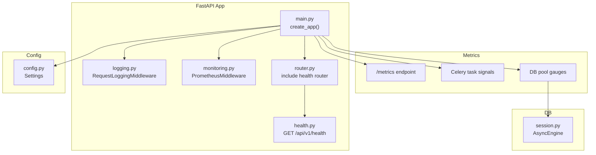
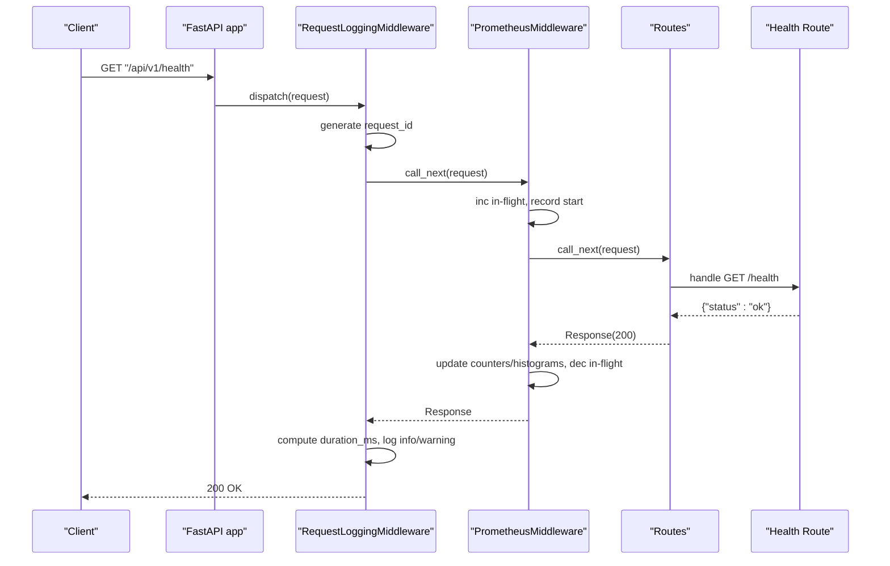
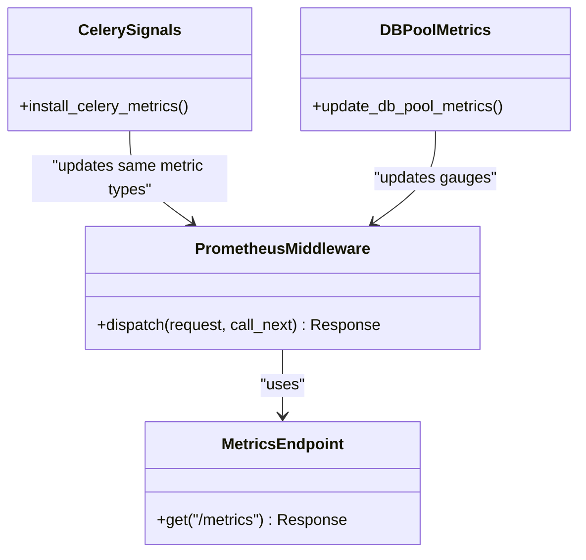
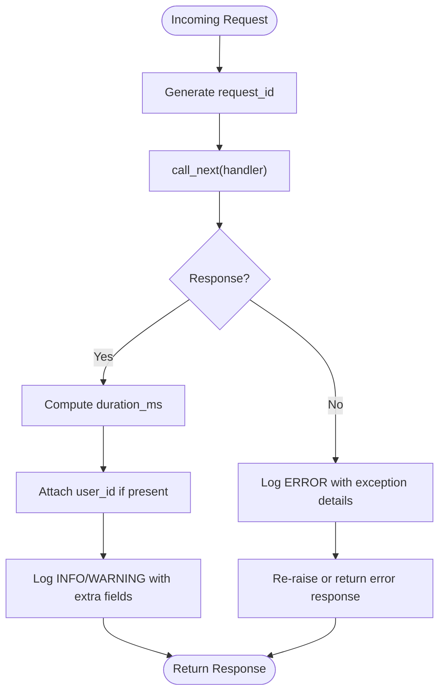
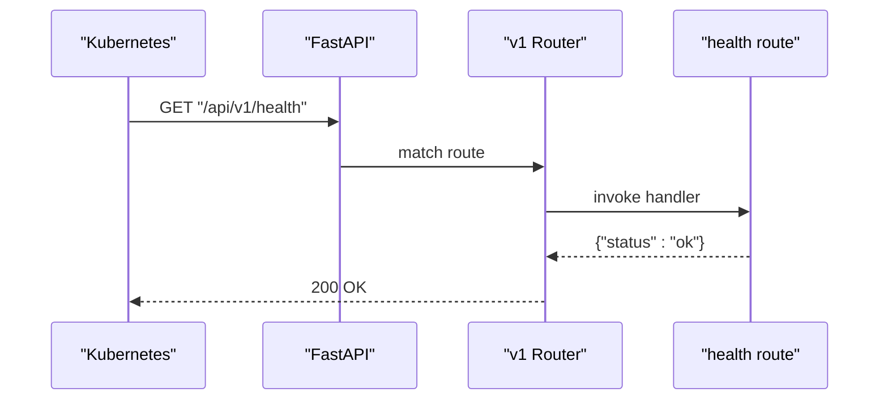
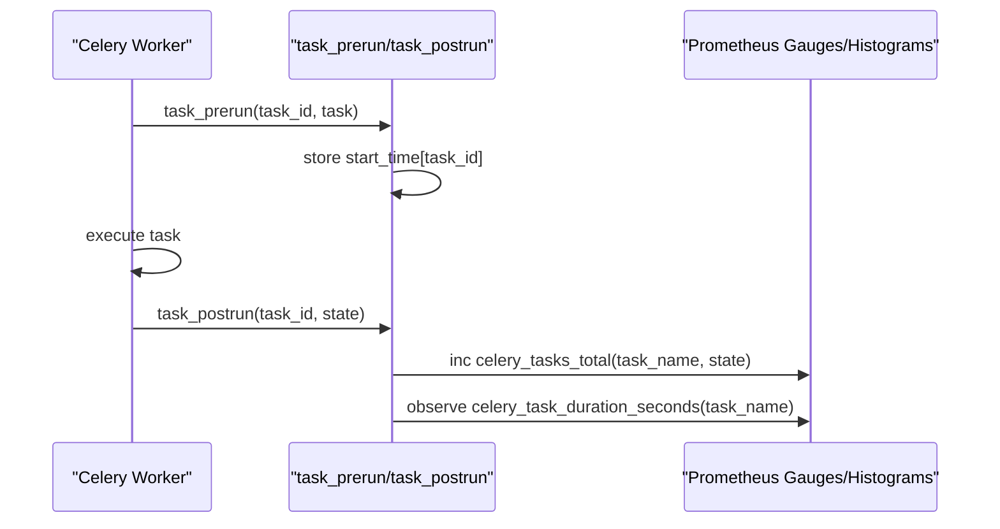
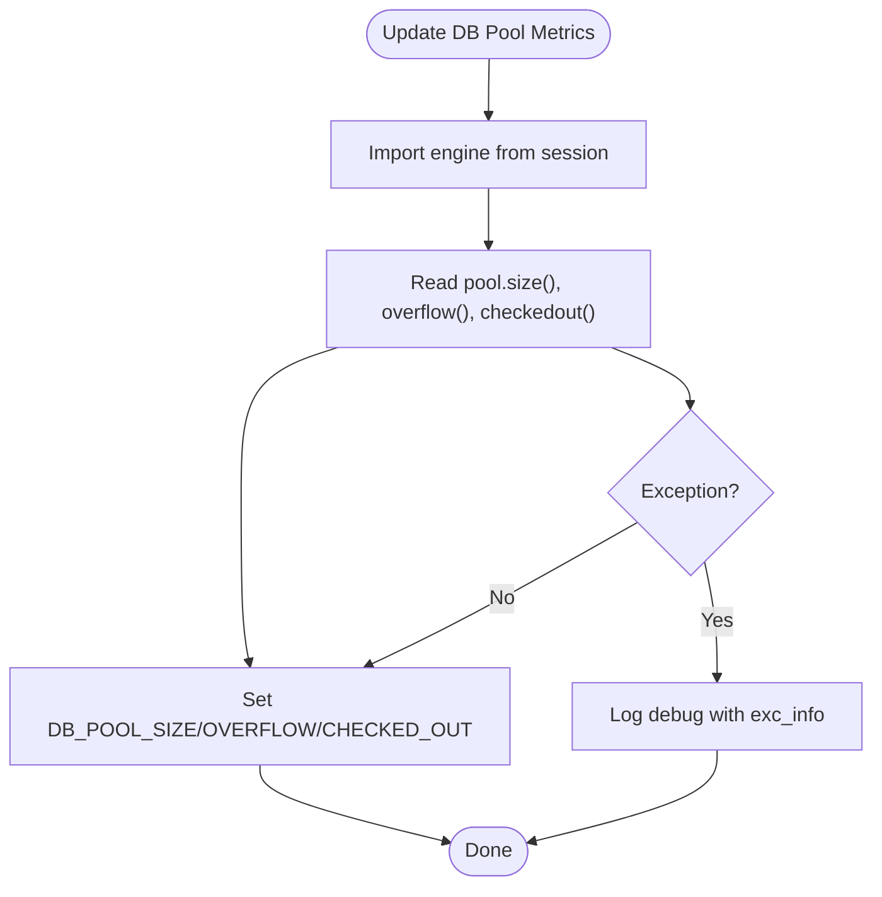
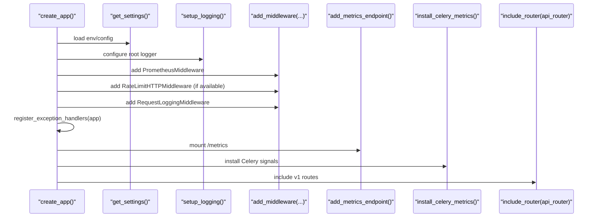
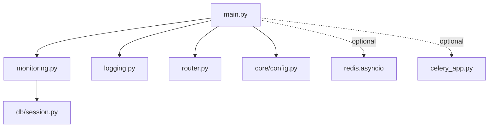

# Monitoring & Profiling Tools

<cite>
**Referenced Files in This Document**
- [main.py](file://backend/app/main.py)
- [monitoring.py](file://backend/app/core/monitoring.py)
- [logging.py](file://backend/app/core/logging.py)
- [config.py](file://backend/app/core/config.py)
- [health.py](file://backend/app/api/v1/routes/health.py)
- [router.py](file://backend/app/api/v1/router.py)
- [session.py](file://backend/app/db/session.py)
- [celery_app.py](file://backend/app/celery_app.py)
- [test_health.py](file://backend/tests/test_health.py)
</cite>

## Table of Contents
1. [Introduction](#introduction)
2. [Project Structure](#project-structure)
3. [Core Components](#core-components)
4. [Architecture Overview](#architecture-overview)
5. [Detailed Component Analysis](#detailed-component-analysis)
6. [Dependency Analysis](#dependency-analysis)
7. [Performance Considerations](#performance-considerations)
8. [Troubleshooting Guide](#troubleshooting-guide)
9. [Conclusion](#conclusion)
10. [Appendices](#appendices)

## Introduction
This document explains the monitoring and profiling implementation for the Rental Housing Structure platform. It covers:
- Prometheus metrics collection for HTTP requests, Celery tasks, and database pool usage
- Structured logging with correlation IDs and sensitive data masking
- Health check endpoints for service availability and readiness probes
- APM and distributed tracing guidance
- Alerting rules and dashboard creation examples
- Log analysis techniques, performance regression detection, and capacity planning

The goal is to provide a clear, actionable guide for operators and developers to observe, diagnose, and improve system performance.

## Project Structure
Monitoring and logging are implemented as reusable components integrated into the FastAPI application lifecycle. Key integration points include middleware registration, metrics endpoint mounting, Celery signal installation, and health route exposure.

**Diagram sources**
- [main.py:17-78](file://backend/app/main.py#L17-L78)
- [monitoring.py:126-176](file://backend/app/core/monitoring.py#L126-L176)
- [logging.py:124-168](file://backend/app/core/logging.py#L124-L168)
- [health.py:6-8](file://backend/app/api/v1/routes/health.py#L6-L8)
- [router.py:6](file://backend/app/api/v1/router.py#L6)
- [session.py:8-9](file://backend/app/db/session.py#L8-L9)
- [config.py:7-167](file://backend/app/core/config.py#L7-L167)

**Section sources**
- [main.py:17-78](file://backend/app/main.py#L17-L78)
- [monitoring.py:126-176](file://backend/app/core/monitoring.py#L126-L176)
- [logging.py:124-168](file://backend/app/core/logging.py#L124-L168)
- [health.py:6-8](file://backend/app/api/v1/routes/health.py#L6-L8)
- [router.py:6](file://backend/app/api/v1/router.py#L6)
- [session.py:8-9](file://backend/app/db/session.py#L8-L9)
- [config.py:7-167](file://backend/app/core/config.py#L7-L167)

## Core Components
- Prometheus metrics: HTTP request counters, latency histograms, in-flight gauge; Celery task counters and latency histograms; DB pool gauges (size, overflow, checked out).
- Structured logging: JSON formatter for production, colored console for development; request/response logging with correlation IDs; global exception handlers; sensitive field masking.
- Health checks: Simple GET endpoint returning status ok; mounted under API v1 prefix.
- Application wiring: Middleware order, metrics endpoint, Celery metrics installation, and dependency configuration via settings.

**Section sources**
- [monitoring.py:74-127](file://backend/app/core/monitoring.py#L74-L127)
- [monitoring.py:126-176](file://backend/app/core/monitoring.py#L126-L176)
- [monitoring.py:183-208](file://backend/app/core/monitoring.py#L183-L208)
- [monitoring.py:216-227](file://backend/app/core/monitoring.py#L216-L227)
- [logging.py:33-54](file://backend/app/core/logging.py#L33-L54)
- [logging.py:77-101](file://backend/app/core/logging.py#L77-L101)
- [logging.py:103-121](file://backend/app/core/logging.py#L103-L121)
- [logging.py:124-168](file://backend/app/core/logging.py#L124-L168)
- [logging.py:170-231](file://backend/app/core/logging.py#L170-L231)
- [health.py:6-8](file://backend/app/api/v1/routes/health.py#L6-L8)
- [router.py:6](file://backend/app/api/v1/router.py#L6)
- [main.py:41-70](file://backend/app/main.py#L41-L70)
- [config.py:7-167](file://backend/app/core/config.py#L7-L167)

## Architecture Overview
The application integrates observability at startup:
- Logging setup configures formatters and levels based on environment.
- Prometheus middleware wraps all requests to collect counts, latency, and in-flight metrics.
- Request logging middleware adds correlation IDs and logs method, path, status, duration, and user context.
- Global exception handlers standardize error responses and log errors with correlation IDs.
- Metrics endpoint exposes Prometheus text format.
- Celery metrics hooks instrument background tasks.
- Health endpoint provides a simple readiness probe.

**Diagram sources**
- [main.py:41-70](file://backend/app/main.py#L41-L70)
- [logging.py:124-168](file://backend/app/core/logging.py#L124-L168)
- [monitoring.py:126-176](file://backend/app/core/monitoring.py#L126-L176)
- [health.py:6-8](file://backend/app/api/v1/routes/health.py#L6-L8)
- [router.py:6](file://backend/app/api/v1/router.py#L6)

## Detailed Component Analysis

### Prometheus Metrics Collection
- HTTP metrics: total requests by method/endpoint/status_code, latency histogram by method/endpoint, in-flight gauge.
- Celery metrics: task count by task_name/status, task duration histogram by task_name.
- Database pool metrics: pool size, overflow, and checked-out connections.
- Optional prometheus-client: graceful no-op fallback when not installed.

**Diagram sources**
- [monitoring.py:126-176](file://backend/app/core/monitoring.py#L126-L176)
- [monitoring.py:183-208](file://backend/app/core/monitoring.py#L183-L208)
- [monitoring.py:216-227](file://backend/app/core/monitoring.py#L216-L227)

**Section sources**
- [monitoring.py:74-127](file://backend/app/core/monitoring.py#L74-L127)
- [monitoring.py:126-176](file://backend/app/core/monitoring.py#L126-L176)
- [monitoring.py:183-208](file://backend/app/core/monitoring.py#L183-L208)
- [monitoring.py:216-227](file://backend/app/core/monitoring.py#L216-L227)

### Structured Logging and Correlation IDs
- Formatters: JSON for production, colored console for development.
- Request logging: generates UUID correlation ID, records method, path, status code, duration_ms, client IP, and optional user_id.
- Sensitive data masking: recursive mask for known fields and regex patterns for phone/email.
- Exception handling: standardized error responses and structured error logs with correlation IDs.

**Diagram sources**
- [logging.py:124-168](file://backend/app/core/logging.py#L124-L168)
- [logging.py:170-231](file://backend/app/core/logging.py#L170-L231)
- [logging.py:103-121](file://backend/app/core/logging.py#L103-L121)

**Section sources**
- [logging.py:33-54](file://backend/app/core/logging.py#L33-L54)
- [logging.py:77-101](file://backend/app/core/logging.py#L77-L101)
- [logging.py:103-121](file://backend/app/core/logging.py#L103-L121)
- [logging.py:124-168](file://backend/app/core/logging.py#L124-L168)
- [logging.py:170-231](file://backend/app/core/logging.py#L170-L231)

### Health Check Endpoints
- Endpoint: GET /api/v1/health returns {"status": "ok"}.
- Integration: included via API router under v1 prefix.
- Testing: unit test asserts 200 and expected payload.

**Diagram sources**
- [health.py:6-8](file://backend/app/api/v1/routes/health.py#L6-L8)
- [router.py:6](file://backend/app/api/v1/router.py#L6)
- [test_health.py:6-10](file://backend/tests/test_health.py#L6-L10)

**Section sources**
- [health.py:6-8](file://backend/app/api/v1/routes/health.py#L6-L8)
- [router.py:6](file://backend/app/api/v1/router.py#L6)
- [test_health.py:6-10](file://backend/tests/test_health.py#L6-L10)

### Celery Task Metrics
- Signals: prerun stores start time per task_id; postrun increments counter and observes duration histogram.
- Configuration: Celery app configured with Redis broker/backend and task routing.

**Diagram sources**
- [monitoring.py:183-208](file://backend/app/core/monitoring.py#L183-L208)
- [celery_app.py:9-30](file://backend/app/celery_app.py#L9-L30)

**Section sources**
- [monitoring.py:183-208](file://backend/app/core/monitoring.py#L183-L208)
- [celery_app.py:9-30](file://backend/app/celery_app.py#L9-L30)

### Database Pool Monitoring
- Gauges: pool size, overflow, checked-out connections updated from async engine pool.
- Access: reads engine.pool attributes; safe fallback on exceptions.

**Diagram sources**
- [monitoring.py:216-227](file://backend/app/core/monitoring.py#L216-L227)
- [session.py:8-9](file://backend/app/db/session.py#L8-L9)

**Section sources**
- [monitoring.py:216-227](file://backend/app/core/monitoring.py#L216-L227)
- [session.py:8-9](file://backend/app/db/session.py#L8-L9)

### Application Wiring and Startup Order
- Middleware order: Prometheus first, then rate limiting (optional), then request logging last to capture full lifecycle.
- Exceptions: global handlers registered after middleware.
- Metrics: /metrics endpoint mounted; Celery metrics installed.

**Diagram sources**
- [main.py:17-78](file://backend/app/main.py#L17-L78)
- [monitoring.py:166-176](file://backend/app/core/monitoring.py#L166-L176)
- [monitoring.py:183-208](file://backend/app/core/monitoring.py#L183-L208)
- [logging.py:77-101](file://backend/app/core/logging.py#L77-L101)

**Section sources**
- [main.py:17-78](file://backend/app/main.py#L17-L78)

## Dependency Analysis
- External dependencies:
  - prometheus-client: optional; graceful no-op fallback ensures runtime stability without it.
  - redis: optional for rate limiting; wrapped in try/except to avoid startup failures.
  - celery: optional for background tasks; metrics installation guarded by import.
- Internal coupling:
  - main.py orchestrates middleware, metrics, logging, and routers.
  - monitoring.py depends on db.session.engine for pool metrics.
  - logging.py uses settings to determine environment and log verbosity.

**Diagram sources**
- [main.py:17-78](file://backend/app/main.py#L17-L78)
- [monitoring.py:216-227](file://backend/app/core/monitoring.py#L216-L227)
- [session.py:8-9](file://backend/app/db/session.py#L8-L9)
- [config.py:7-167](file://backend/app/core/config.py#L7-L167)
- [celery_app.py:9-30](file://backend/app/celery_app.py#L9-L30)

**Section sources**
- [main.py:17-78](file://backend/app/main.py#L17-L78)
- [monitoring.py:216-227](file://backend/app/core/monitoring.py#L216-L227)
- [session.py:8-9](file://backend/app/db/session.py#L8-L9)
- [config.py:7-167](file://backend/app/core/config.py#L7-L167)
- [celery_app.py:9-30](file://backend/app/celery_app.py#L9-L30)

## Performance Considerations
- Metric cardinality:
  - Avoid high-cardinality labels such as raw user IDs or dynamic paths. Use stable endpoint templates.
  - Current labels: method, endpoint, status_code for HTTP; task_name for Celery.
- Histogram buckets:
  - HTTP latency buckets cover typical web request ranges; adjust if tail latencies exceed 10s.
  - Celery task buckets span up to 120s; extend if long-running jobs exist.
- In-flight gauge:
  - Useful for detecting concurrency spikes; correlate with queue depths and worker autoscaling.
- DB pool gauges:
  - Monitor checked-out vs size to detect connection leaks or insufficient pool sizing.
- Logging overhead:
  - JSON formatting is efficient; ensure structured fields do not include large payloads.
  - Masking runs recursively; limit depth to prevent excessive CPU usage on large objects.

[No sources needed since this section provides general guidance]

## Troubleshooting Guide
- Missing prometheus-client:
  - Symptoms: /metrics returns a placeholder text; counters/histograms are no-ops.
  - Action: Install prometheus-client and restart the service.
- No Celery metrics:
  - Symptoms: No celery_tasks_total or celery_task_duration_seconds.
  - Action: Ensure Celery workers are running and metrics installation is invoked at startup.
- Health endpoint failing:
  - Symptoms: Non-200 status or missing payload.
  - Action: Verify router inclusion and route path; run tests to assert behavior.
- High 5xx rates:
  - Symptoms: Increased REQUEST_COUNT with status_code=500.
  - Action: Inspect structured logs filtered by request_id; review global exception handler outputs.
- Slow requests:
  - Symptoms: Elevated p95/p99 on app_request_duration_seconds.
  - Action: Correlate with DB pool metrics and Celery task durations; identify hotspots.

**Section sources**
- [monitoring.py:23-67](file://backend/app/core/monitoring.py#L23-L67)
- [monitoring.py:183-208](file://backend/app/core/monitoring.py#L183-L208)
- [test_health.py:6-10](file://backend/tests/test_health.py#L6-L10)
- [logging.py:170-231](file://backend/app/core/logging.py#L170-L231)

## Conclusion
The platform implements robust observability through Prometheus metrics, structured logging with correlation IDs, and basic health checks. The design is resilient to missing optional dependencies and integrates cleanly into the FastAPI lifecycle. Operators can build dashboards and alerts around HTTP latency, error rates, Celery task performance, and DB pool utilization. For advanced use cases, consider adding APM and distributed tracing to correlate traces with metrics and logs.

[No sources needed since this section summarizes without analyzing specific files]

## Appendices

### APM and Distributed Tracing Setup (Guidance)
- Integrate an OpenTelemetry SDK with your FastAPI app to emit spans for HTTP handlers, DB calls, and external services.
- Propagate trace context via headers (e.g., W3C Trace Context) across HTTP boundaries.
- Export traces to a backend (e.g., Jaeger, Zipkin, or managed APM) and correlate with Prometheus metrics using shared identifiers.
- Instrument AI service calls (OpenAI/DeepSeek) and third-party APIs to measure latency and failure rates.

[No sources needed since this section provides general guidance]

### Alerting Rules Examples (PromQL)
- High error rate:
  - sum(rate(app_requests_total{status_code=~"5.."}[5m])) / sum(rate(app_requests_total[5m])) > 0.05
- Latency SLO breach:
  - histogram_quantile(0.95, sum(rate(app_request_duration_seconds_bucket[5m])) by (le)) > 1.0
- Celery backlog pressure:
  - increase(celery_tasks_total{status="failure"}[10m]) > 100
- DB pool saturation:
  - db_pool_checked_out / db_pool_size > 0.9

[No sources needed since this section provides general guidance]

### Dashboard Creation (Key Panels)
- HTTP Requests:
  - Panel: Total requests by status_code over time
  - Panel: p50/p95/p99 latency by endpoint
- Celery Tasks:
  - Panel: Task success/failure rates by task_name
  - Panel: Task duration percentiles by task_name
- Database Pool:
  - Panel: Pool size, overflow, and checked-out over time
- Errors:
  - Panel: 5xx rate and top error messages (from logs)

[No sources needed since this section provides general guidance]

### Incident Response Workflow
- Detect: Alerts fire on error rate or latency thresholds.
- Triage: Use correlation_id from logs to reconstruct request flow.
- Investigate: Cross-check metrics (latency, DB pool, Celery durations) and traces if available.
- Resolve: Apply fixes (scale workers, tune DB pool, patch slow queries).
- Validate: Confirm metrics return to baseline and alerts clear.

[No sources needed since this section provides general guidance]

### Log Analysis Techniques
- Filter by request_id to follow a single request across services.
- Aggregate by endpoint and status_code to spot regressions.
- Search masked sensitive fields to verify compliance.
- Use structured fields (duration_ms, user_id) for fast slicing and dicing.

[No sources needed since this section provides general guidance]

### Capacity Planning Based on Monitoring Data
- Scale horizontally when in-flight requests consistently approach limits.
- Tune DB pool size based on checked-out vs size trends.
- Right-size Celery workers based on task duration percentiles and queue depth.
- Plan storage and I/O capacity based on upload and image processing workloads.

[No sources needed since this section provides general guidance]