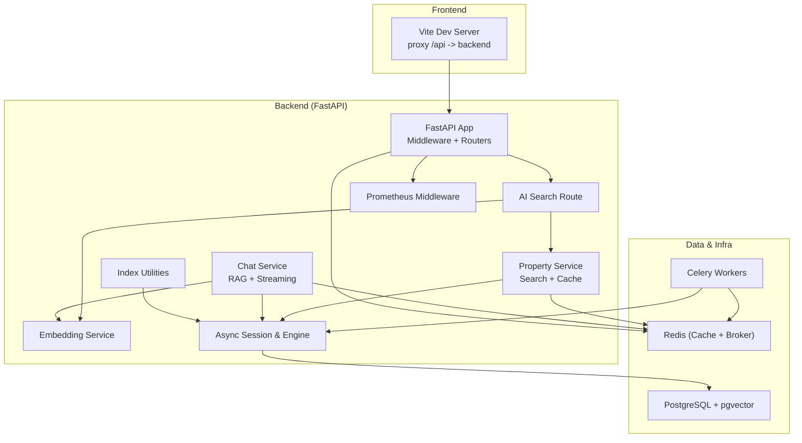
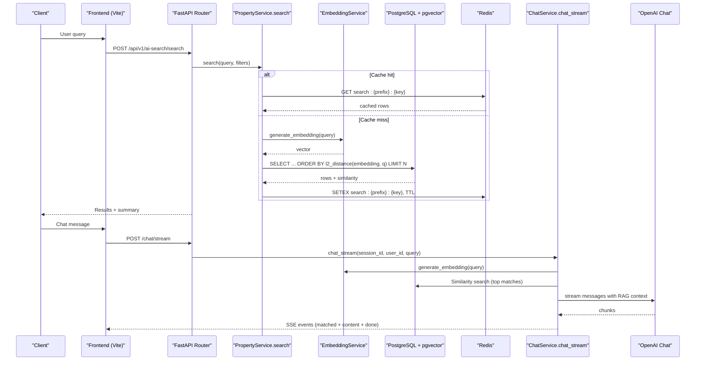
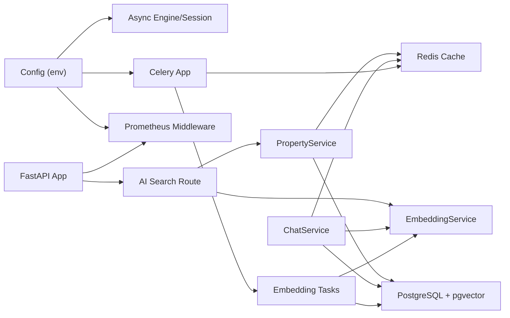

# Performance Optimization

<cite>
**Referenced Files in This Document**
- [backend/app/core/config.py](file://backend/app/core/config.py)
- [backend/app/db/session.py](file://backend/app/db/session.py)
- [backend/app/db/indexes.py](file://backend/app/db/indexes.py)
- [backend/app/models/property.py](file://backend/app/models/property.py)
- [backend/app/services/embedding_service.py](file://backend/app/services/embedding_service.py)
- [backend/app/services/chat_service.py](file://backend/app/services/chat_service.py)
- [backend/app/services/property_service.py](file://backend/app/services/property_service.py)
- [backend/app/api/v1/routes/ai_search.py](file://backend/app/api/v1/routes/ai_search.py)
- [backend/app/tasks/embedding_tasks.py](file://backend/app/tasks/embedding_tasks.py)
- [backend/app/celery_app.py](file://backend/app/celery_app.py)
- [backend/app/main.py](file://backend/app/main.py)
- [backend/app/core/monitoring.py](file://backend/app/core/monitoring.py)
- [docker-compose.yml](file://docker-compose.yml)
- [frontend/vite.config.ts](file://frontend/vite.config.ts)
- [frontend/src/services/aiSearch.ts](file://frontend/src/services/aiSearch.ts)
</cite>

## Table of Contents
1. [Introduction](#introduction)
2. [Project Structure](#project-structure)
3. [Core Components](#core-components)
4. [Architecture Overview](#architecture-overview)
5. [Detailed Component Analysis](#detailed-component-analysis)
6. [Dependency Analysis](#dependency-analysis)
7. [Performance Considerations](#performance-considerations)
8. [Troubleshooting Guide](#troubleshooting-guide)
9. [Conclusion](#conclusion)
10. [Appendices](#appendices)

## Introduction
This document provides a comprehensive performance optimization guide for the Rental Housing Structure platform across database, caching, API, AI services, background tasks, frontend build, and monitoring. It focuses on practical strategies grounded in the codebase: pgvector index tuning, query optimization, connection pooling configuration, Redis-backed caching, embedding vector caching, streaming chat responses, Celery task routing, Prometheus metrics, and Vite development server proxying. Where applicable, it includes diagrams mapping to actual source files and references to specific implementation locations.

## Project Structure
The backend is a FastAPI application with SQLAlchemy async engine, pgvector-enabled PostgreSQL, Redis for caching and Celery broker, Celery workers for background jobs, and Prometheus metrics. The frontend uses Vite with Vue and proxies API calls during development.

**Diagram sources**
- [backend/app/main.py:1-82](file://backend/app/main.py#L1-L82)
- [backend/app/api/v1/routes/ai_search.py:1-160](file://backend/app/api/v1/routes/ai_search.py#L1-L160)
- [backend/app/services/chat_service.py:1-302](file://backend/app/services/chat_service.py#L1-L302)
- [backend/app/services/property_service.py:1-205](file://backend/app/services/property_service.py#L1-L205)
- [backend/app/services/embedding_service.py:1-32](file://backend/app/services/embedding_service.py#L1-L32)
- [backend/app/db/session.py:1-14](file://backend/app/db/session.py#L1-L14)
- [backend/app/db/indexes.py:1-118](file://backend/app/db/indexes.py#L1-L118)
- [backend/app/core/monitoring.py:1-227](file://backend/app/core/monitoring.py#L1-L227)
- [docker-compose.yml:1-53](file://docker-compose.yml#L1-L53)

**Section sources**
- [backend/app/main.py:1-82](file://backend/app/main.py#L1-L82)
- [docker-compose.yml:1-53](file://docker-compose.yml#L1-L53)

## Core Components
- Database layer: Async SQLAlchemy engine and session maker; pgvector column type; index utilities for IVFFlat and composite indexes.
- Caching: Redis-backed search result cache with TTL and key normalization.
- AI services: Embedding generation via OpenAI; chat service with RAG context building and SSE streaming.
- Background tasks: Celery app configured with Redis broker/backend and task routing; embedding job lifecycle.
- Monitoring: Prometheus middleware for HTTP metrics and Celery task metrics; optional no-op fallbacks.
- Frontend: Vite dev server proxying API requests; TypeScript services for AI search.

Key configuration and runtime settings are centralized and environment-driven.

**Section sources**
- [backend/app/db/session.py:1-14](file://backend/app/db/session.py#L1-L14)
- [backend/app/db/indexes.py:1-118](file://backend/app/db/indexes.py#L1-L118)
- [backend/app/services/property_service.py:1-205](file://backend/app/services/property_service.py#L1-L205)
- [backend/app/services/embedding_service.py:1-32](file://backend/app/services/embedding_service.py#L1-L32)
- [backend/app/services/chat_service.py:1-302](file://backend/app/services/chat_service.py#L1-L302)
- [backend/app/celery_app.py:1-31](file://backend/app/celery_app.py#L1-L31)
- [backend/app/tasks/embedding_tasks.py:1-112](file://backend/app/tasks/embedding_tasks.py#L1-L112)
- [backend/app/core/monitoring.py:1-227](file://backend/app/core/monitoring.py#L1-L227)
- [frontend/vite.config.ts:1-22](file://frontend/vite.config.ts#L1-L22)
- [frontend/src/services/aiSearch.ts:1-66](file://frontend/src/services/aiSearch.ts#L1-L66)

## Architecture Overview
The system integrates AI-powered semantic search and chat with relational data. Vector similarity queries leverage pgvector with IVFFlat indexing when dataset size warrants it. Redis caches frequent search results and acts as Celery broker/backend. Prometheus exposes request latency, counts, and in-flight gauges, plus Celery task metrics.

**Diagram sources**
- [backend/app/api/v1/routes/ai_search.py:1-160](file://backend/app/api/v1/routes/ai_search.py#L1-L160)
- [backend/app/services/property_service.py:1-205](file://backend/app/services/property_service.py#L1-L205)
- [backend/app/services/embedding_service.py:1-32](file://backend/app/services/embedding_service.py#L1-L32)
- [backend/app/services/chat_service.py:1-302](file://backend/app/services/chat_service.py#L1-L302)
- [docker-compose.yml:1-53](file://docker-compose.yml#L1-L53)

## Detailed Component Analysis

### Database Optimization (pgvector, indexes, queries, pooling)
- pgvector column type and table-level constraints are defined on Property. A composite index exists for district+status.
- IVFFlat index creation is adaptive: if fewer than 1000 embeddings exist, exact scan is preferred; otherwise an IVFFlat index is created with lists ≈ sqrt(row_count).
- Composite indexes for bookings improve tenant/landlord/status queries.
- EXPLAIN ANALYZE helpers allow inspecting execution plans for common queries.
- Connection pooling: async engine is created from DATABASE_URL; pool sizing should be tuned based on concurrency and workload.

Recommendations:
- Ensure IVFFlat index is created after bulk inserts or reindex runs.
- Tune IVFFlat lists parameter periodically as data grows.
- Add additional composite indexes for hot query patterns observed in production.
- Configure pool_size, max_overflow, and pool_recycle in create_async_engine to match expected concurrency.

**Section sources**
- [backend/app/models/property.py:1-86](file://backend/app/models/property.py#L1-L86)
- [backend/app/db/indexes.py:1-118](file://backend/app/db/indexes.py#L1-L118)
- [backend/app/db/session.py:1-14](file://backend/app/db/session.py#L1-L14)

### Query Optimization and Caching (Redis)
- PropertyService implements a Redis-backed cache for search results using deterministic keys and a fixed TTL.
- On cache miss, it performs vector similarity search and writes results back to Redis.
- Key format normalizes parameters to ensure consistent hits.

Optimization tips:
- Adjust CACHE_TTL_SECONDS based on data freshness requirements.
- Consider per-user or per-session cache prefixes if needed.
- Monitor cache hit ratio via metrics or logs.

**Section sources**
- [backend/app/services/property_service.py:1-205](file://backend/app/services/property_service.py#L1-L205)

### AI Service Optimization (embeddings, vector search, streaming)
- EmbeddingService wraps AsyncOpenAI to generate embeddings for property text and queries.
- ChatService builds RAG context by generating a query embedding and performing top-N similarity search, then streams OpenAI chat completions via SSE.
- Non-streaming chat returns full response; streaming yields matched properties first, then content chunks, then completion markers.

Optimization tips:
- Batch embedding generation via Celery tasks to avoid blocking API calls.
- Limit top-N used in RAG to balance context size and latency.
- Use streaming for chat to reduce perceived latency.

**Section sources**
- [backend/app/services/embedding_service.py:1-32](file://backend/app/services/embedding_service.py#L1-L32)
- [backend/app/services/chat_service.py:1-302](file://backend/app/services/chat_service.py#L1-L302)

### Background Task Optimization (Celery, queues, retries)
- Celery app uses Redis as broker/backend and routes embedding/import tasks to dedicated queues.
- Embedding tasks manage job lifecycle (pending → processing → completed/failed), with auto-retry and backoff.
- Reindex task enqueues missing embeddings for all properties.

Optimization tips:
- Scale worker processes per queue to handle bursts (e.g., more embedding workers during ingestion).
- Tune retry_backoff and max_retries for resilience without excessive load.
- Monitor task durations and failure rates via Prometheus signals.

**Section sources**
- [backend/app/celery_app.py:1-31](file://backend/app/celery_app.py#L1-L31)
- [backend/app/tasks/embedding_tasks.py:1-112](file://backend/app/tasks/embedding_tasks.py#L1-L112)

### API Response Caching and Rate Limiting
- Search results are cached in Redis with TTL.
- Rate limiting middleware uses Redis sorted sets to enforce per-IP/per-prefix limits; disabled in debug mode.

Optimization tips:
- Combine rate limiting with caching to protect downstream services.
- Expose cache hit/miss counters for observability.

**Section sources**
- [backend/app/services/property_service.py:1-205](file://backend/app/services/property_service.py#L1-L205)
- [backend/app/core/security_audit.py:49-81](file://backend/app/core/security_audit.py#L49-L81)
- [backend/app/main.py:1-82](file://backend/app/main.py#L1-L82)

### Frontend Performance (Vite dev proxy, bundle considerations)
- Vite config defines alias and dev server proxy for /api to backend.
- For production, enable code splitting, lazy loading, image optimization, and minification through Vite plugins and build options.

Optimization tips:
- Use dynamic imports for heavy views (e.g., map, admin pages).
- Optimize images (WebP/AVIF), use responsive sizes, and lazy-load offscreen assets.
- Analyze bundle size with Vite’s built-in analyzer plugin.

**Section sources**
- [frontend/vite.config.ts:1-22](file://frontend/vite.config.ts#L1-L22)
- [frontend/src/services/aiSearch.ts:1-66](file://frontend/src/services/aiSearch.ts#L1-L66)

### Monitoring and Profiling (Prometheus, metrics endpoints)
- PrometheusMiddleware records request count, latency, and in-flight requests.
- Celery signal handlers track task count and duration.
- DB pool gauges expose pool size, overflow, and checked-out connections.
- /metrics endpoint serves Prometheus text format.

Operational guidance:
- Scrape /metrics with Prometheus and visualize latency percentiles, error rates, and pool saturation.
- Alert on high pool overflow or long-tail latencies.

**Section sources**
- [backend/app/core/monitoring.py:1-227](file://backend/app/core/monitoring.py#L1-L227)
- [backend/app/main.py:1-82](file://backend/app/main.py#L1-L82)

## Dependency Analysis
High-level dependencies among core components:

**Diagram sources**
- [backend/app/core/config.py:1-167](file://backend/app/core/config.py#L1-L167)
- [backend/app/db/session.py:1-14](file://backend/app/db/session.py#L1-L14)
- [backend/app/celery_app.py:1-31](file://backend/app/celery_app.py#L1-L31)
- [backend/app/main.py:1-82](file://backend/app/main.py#L1-L82)
- [backend/app/api/v1/routes/ai_search.py:1-160](file://backend/app/api/v1/routes/ai_search.py#L1-L160)
- [backend/app/services/property_service.py:1-205](file://backend/app/services/property_service.py#L1-L205)
- [backend/app/services/embedding_service.py:1-32](file://backend/app/services/embedding_service.py#L1-L32)
- [backend/app/services/chat_service.py:1-302](file://backend/app/services/chat_service.py#L1-L302)
- [backend/app/tasks/embedding_tasks.py:1-112](file://backend/app/tasks/embedding_tasks.py#L1-L112)

**Section sources**
- [backend/app/core/config.py:1-167](file://backend/app/core/config.py#L1-L167)
- [backend/app/main.py:1-82](file://backend/app/main.py#L1-L82)

## Performance Considerations
- Database
  - Create and maintain IVFFlat indexes for embeddings; re-evaluate lists parameter as row counts grow.
  - Add composite indexes for frequently filtered columns (district, status, tenant/landlord IDs).
  - Tune connection pool parameters (pool_size, max_overflow, pool_recycle) based on concurrency and DB capacity.
- Caching
  - Use Redis for search results with appropriate TTL; consider invalidation on updates.
  - Cache embedding vectors for repeated queries where feasible.
- AI Services
  - Prefer streaming chat to reduce time-to-first-byte.
  - Batch embedding generation via Celery; limit RAG context size.
- Background Tasks
  - Separate queues for CPU-bound vs I/O-bound workloads; scale workers accordingly.
  - Implement idempotency and deduplication for reindex operations.
- Frontend
  - Enable code splitting and lazy loading for large features.
  - Optimize images and fonts; leverage browser caching headers.
- Monitoring
  - Track p50/p95/p99 latencies, error rates, DB pool utilization, and cache hit ratios.
  - Set alerts for anomalies in task durations and pool overflow.

[No sources needed since this section provides general guidance]

## Troubleshooting Guide
Common issues and diagnostics:
- Slow vector searches
  - Verify IVFFlat index exists and lists parameter is reasonable for dataset size.
  - Run EXPLAIN ANALYZE on similarity queries to confirm index usage.
- High DB pool pressure
  - Inspect pool size, overflow, and checked-out gauges; adjust pool parameters.
- Frequent cache misses
  - Validate cache key normalization and TTL; check Redis connectivity.
- Chat latency spikes
  - Confirm streaming path is used; measure OpenAI response chunk timing.
- Worker bottlenecks
  - Review Celery task histograms and queue lengths; scale workers per queue.

**Section sources**
- [backend/app/db/indexes.py:91-118](file://backend/app/db/indexes.py#L91-L118)
- [backend/app/core/monitoring.py:105-127](file://backend/app/core/monitoring.py#L105-L127)
- [backend/app/services/property_service.py:171-195](file://backend/app/services/property_service.py#L171-L195)
- [backend/app/services/chat_service.py:227-302](file://backend/app/services/chat_service.py#L227-L302)
- [backend/app/tasks/embedding_tasks.py:16-81](file://backend/app/tasks/embedding_tasks.py#L16-L81)

## Conclusion
By combining targeted database indexing, Redis caching, streaming AI responses, resilient background processing, and robust monitoring, the platform can achieve low-latency, scalable performance. Continuously monitor metrics, tune indexes and pools as data grows, and iterate on caching and task scaling to meet evolving demand.

[No sources needed since this section summarizes without analyzing specific files]

## Appendices

### Configuration Reference (selected)
- Database URL and Alembic URL
- Redis URL
- OpenAI model names and keys
- DeepSeek LLM base URL and model
- AMap geocode and nearby endpoints and timeouts
- Upload limits and allowed types
- WeChat integration fields
- SMS provider settings
- SMTP settings
- Rate limiting defaults

**Section sources**
- [backend/app/core/config.py:1-167](file://backend/app/core/config.py#L1-L167)

### Docker Compose Notes
- PostgreSQL image includes pgvector extension; healthcheck enabled.
- Redis configured with persistence and memory policy suitable for caching/broker.

**Section sources**
- [docker-compose.yml:1-53](file://docker-compose.yml#L1-L53)