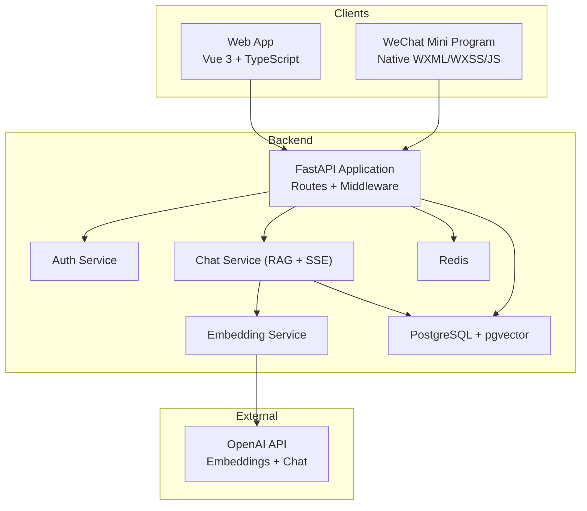
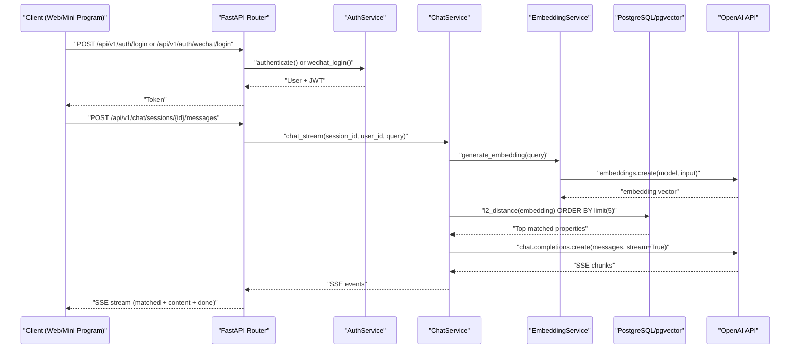
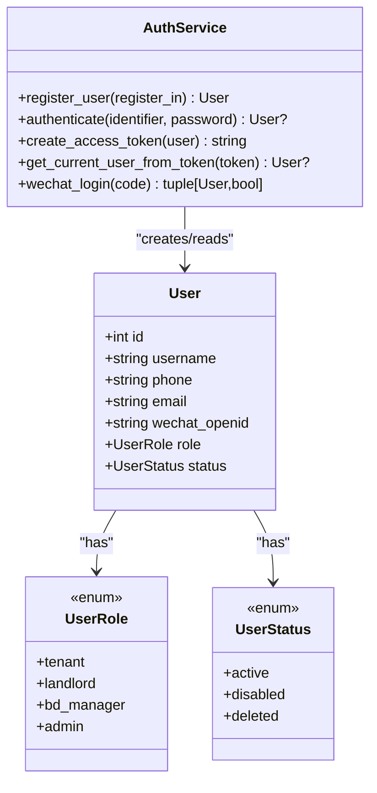
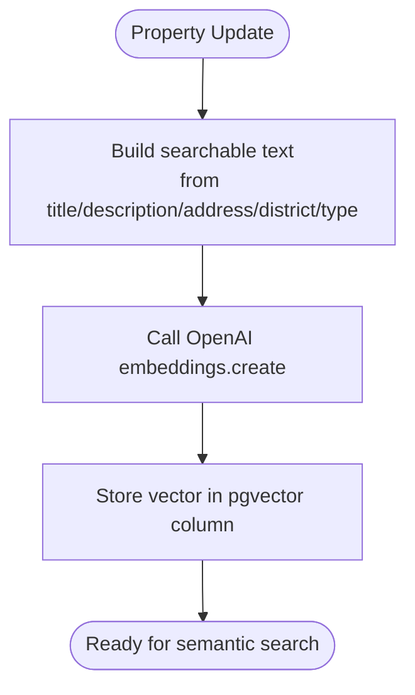
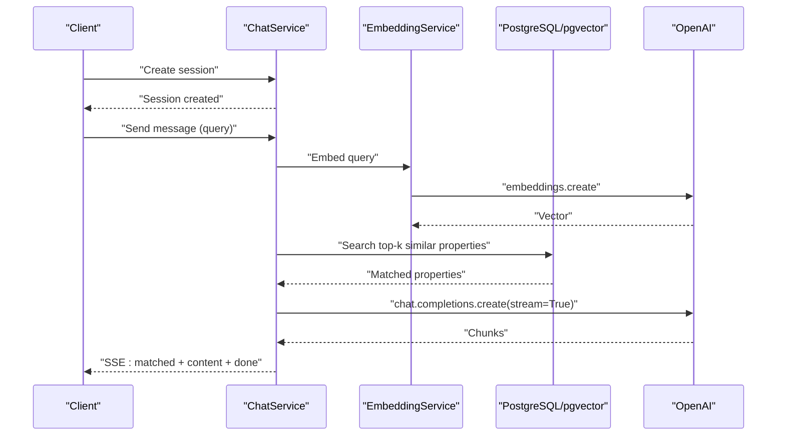
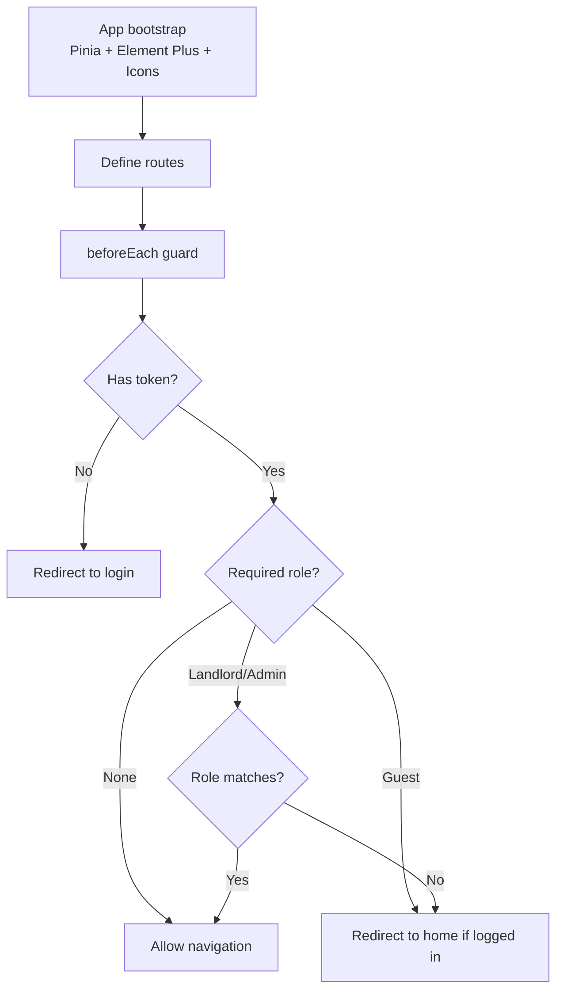
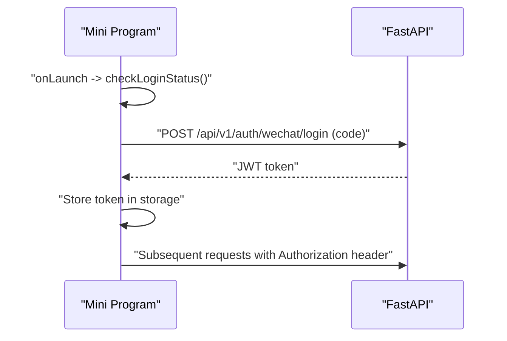
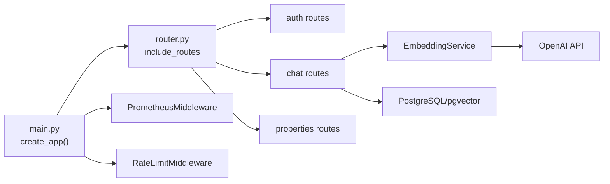

# Project Overview

<cite>
**Referenced Files in This Document**
- [README.md](file://README.md)
- [DEPLOYMENT.md](file://DEPLOYMENT.md)
- [backend/app/main.py](file://backend/app/main.py)
- [backend/app/api/v1/router.py](file://backend/app/api/v1/router.py)
- [backend/app/models/user.py](file://backend/app/models/user.py)
- [backend/app/models/property.py](file://backend/app/models/property.py)
- [backend/app/services/auth_service.py](file://backend/app/services/auth_service.py)
- [backend/app/services/embedding_service.py](file://backend/app/services/embedding_service.py)
- [backend/app/services/chat_service.py](file://backend/app/services/chat_service.py)
- [frontend/src/main.ts](file://frontend/src/main.ts)
- [frontend/src/router/index.ts](file://frontend/src/router/index.ts)
- [wechat-miniprogram/app.js](file://wechat-miniprogram/app.js)
- [wechat-miniprogram/app.config.js](file://wechat-miniprogram/app.config.js)
- [docker-compose.yml](file://docker-compose.yml)
</cite>

## Table of Contents
1. [Introduction](#introduction)
2. [Project Structure](#project-structure)
3. [Core Components](#core-components)
4. [Architecture Overview](#architecture-overview)
5. [Detailed Component Analysis](#detailed-component-analysis)
6. [Dependency Analysis](#dependency-analysis)
7. [Performance Considerations](#performance-considerations)
8. [Troubleshooting Guide](#troubleshooting-guide)
9. [Conclusion](#conclusion)

## Introduction
Rental Housing Structure is an intelligent rental housing matching platform that connects tenants with suitable properties through AI-powered semantic search, a conversational LLM chat assistant, and a WeChat Mini Program for mobile access. The system provides role-based experiences for tenants, landlords, BD managers, and administrators, enabling property discovery, booking workflows, contract management, payments, notifications, and administrative oversight.

The project is at Phase 10 — Polish & Deployment, indicating completion of all prior phases including core backend, semantic search, AI chat, data import, admin dashboard, WeChat Mini Program, and production deployment readiness.

Target audience:
- Tenants: discover properties via keyword, map, and natural language search; book and pay; chat with an AI assistant.
- Landlords: create and manage listings, handle bookings, view contracts and payments.
- BD managers: coordinate operations and monitor performance.
- Administrators: moderate content, manage users, audit logs, embeddings, and system health.

**Section sources**
- [README.md:1-21](file://README.md#L1-L21)

## Project Structure
The repository follows a multi-service architecture:
- Backend (FastAPI): REST API, authentication, business logic, async tasks, pgvector integration, OpenAI integrations.
- Frontend (Vue 3 + TypeScript): SPA with routing, state management, Element Plus UI, and API clients.
- WeChat Mini Program: Native mobile app integrated with the same API surface.
- Infrastructure: Docker Compose for dev/prod, Nginx for reverse proxy, Prometheus metrics, Redis for rate limiting and caching.

**Diagram sources**
- [backend/app/main.py:17-78](file://backend/app/main.py#L17-L78)
- [backend/app/api/v1/router.py:1-23](file://backend/app/api/v1/router.py#L1-L23)
- [backend/app/services/chat_service.py:17-302](file://backend/app/services/chat_service.py#L17-L302)
- [backend/app/services/embedding_service.py:17-32](file://backend/app/services/embedding_service.py#L17-L32)
- [docker-compose.yml:8-53](file://docker-compose.yml#L8-L53)

**Section sources**
- [README.md:22-62](file://README.md#L22-L62)
- [docker-compose.yml:8-53](file://docker-compose.yml#L8-L53)

## Core Components
- FastAPI application entrypoint configures middleware (CORS, Prometheus, rate limiting), mounts static uploads, registers routers, and exposes metrics and health endpoints.
- API router aggregates feature modules: auth, users, properties, images, bookings, notifications, chat, admin, imports, wechat, ai-search, geocoding, contracts, payments, pois, map.
- Data models define roles (tenant, landlord, bd_manager, admin), user lifecycle, and property schema with vector embedding support via pgvector.
- Services implement business logic:
  - Authentication: registration, login, JWT issuance, WeChat code-to-openid flow.
  - Embedding: text construction and OpenAI embedding generation for semantic search.
  - Chat: session management, RAG context building using pgvector similarity, streaming responses via Server-Sent Events.
- Frontend bootstrap initializes Vue app, Pinia, Element Plus, and global icons; router enforces guest/auth/role guards.
- WeChat Mini Program maintains login status and base URL configuration per environment.

**Section sources**
- [backend/app/main.py:17-78](file://backend/app/main.py#L17-L78)
- [backend/app/api/v1/router.py:1-23](file://backend/app/api/v1/router.py#L1-L23)
- [backend/app/models/user.py:11-48](file://backend/app/models/user.py#L11-L48)
- [backend/app/models/property.py:12-86](file://backend/app/models/property.py#L12-L86)
- [backend/app/services/auth_service.py:14-77](file://backend/app/services/auth_service.py#L14-L77)
- [backend/app/services/embedding_service.py:17-32](file://backend/app/services/embedding_service.py#L17-L32)
- [backend/app/services/chat_service.py:17-302](file://backend/app/services/chat_service.py#L17-L302)
- [frontend/src/main.ts:1-22](file://frontend/src/main.ts#L1-L22)
- [frontend/src/router/index.ts:177-212](file://frontend/src/router/index.ts#L177-L212)
- [wechat-miniprogram/app.js:1-21](file://wechat-miniprogram/app.js#L1-L21)
- [wechat-miniprogram/app.config.js:1-16](file://wechat-miniprogram/app.config.js#L1-L16)

## Architecture Overview
High-level interaction across web, mobile, and API:
- Clients call /api/v1 endpoints for authentication, property search, chat, bookings, payments, and admin functions.
- Backend orchestrates services, persists to PostgreSQL (with pgvector for embeddings), uses Redis for rate limiting and caching, and integrates with OpenAI for embeddings and chat completions.
- Frontend and Mini Program consume the same API surface, ensuring consistent UX across platforms.

**Diagram sources**
- [backend/app/api/v1/router.py:1-23](file://backend/app/api/v1/router.py#L1-L23)
- [backend/app/services/auth_service.py:53-77](file://backend/app/services/auth_service.py#L53-L77)
- [backend/app/services/chat_service.py:227-302](file://backend/app/services/chat_service.py#L227-L302)
- [backend/app/services/embedding_service.py:23-32](file://backend/app/services/embedding_service.py#L23-L32)

## Detailed Component Analysis

### Authentication and Roles
- User model supports roles: tenant, landlord, bd_manager, admin; statuses: active, disabled, deleted.
- AuthService handles password-based login, token creation/validation, and WeChat Mini Program login by exchanging code for openid and auto-creating tenant users when needed.
- Frontend router guards enforce requiresAuth, requiresLandlord, requiresAdmin based on stored user role.

**Diagram sources**
- [backend/app/models/user.py:11-48](file://backend/app/models/user.py#L11-L48)
- [backend/app/services/auth_service.py:14-77](file://backend/app/services/auth_service.py#L14-L77)
- [frontend/src/router/index.ts:182-209](file://frontend/src/router/index.ts#L182-L209)

**Section sources**
- [backend/app/models/user.py:11-48](file://backend/app/models/user.py#L11-L48)
- [backend/app/services/auth_service.py:14-77](file://backend/app/services/auth_service.py#L14-L77)
- [frontend/src/router/index.ts:182-209](file://frontend/src/router/index.ts#L182-L209)

### Property Model and Vector Search
- Property model includes metadata (title, description, address, district, price, area, rooms, type, status, geo coordinates) and a vector embedding column backed by pgvector.
- EmbeddingService composes searchable text from property fields and calls OpenAI embeddings to generate vectors.

**Diagram sources**
- [backend/app/models/property.py:38-86](file://backend/app/models/property.py#L38-L86)
- [backend/app/services/embedding_service.py:6-32](file://backend/app/services/embedding_service.py#L6-L32)

**Section sources**
- [backend/app/models/property.py:38-86](file://backend/app/models/property.py#L38-L86)
- [backend/app/services/embedding_service.py:17-32](file://backend/app/services/embedding_service.py#L17-L32)

### AI Chat with RAG and Streaming
- ChatService manages sessions and messages, builds RAG context by embedding queries and retrieving top similar properties via pgvector l2_distance, then streams OpenAI chat completions back to clients as SSE events.
- System prompt guides the assistant to reference matched properties and guide users when no matches are found.

**Diagram sources**
- [backend/app/services/chat_service.py:85-143](file://backend/app/services/chat_service.py#L85-L143)
- [backend/app/services/chat_service.py:171-226](file://backend/app/services/chat_service.py#L171-L226)
- [backend/app/services/chat_service.py:227-302](file://backend/app/services/chat_service.py#L227-L302)
- [backend/app/services/embedding_service.py:23-32](file://backend/app/services/embedding_service.py#L23-L32)

**Section sources**
- [backend/app/services/chat_service.py:17-302](file://backend/app/services/chat_service.py#L17-L302)

### Frontend Bootstrap and Routing Guards
- Vue app initializes Pinia, Element Plus (Chinese locale), and globally registers icons.
- Router defines public and protected routes, with guards enforcing authentication and role-based access (guest, requiresAuth, requiresLandlord, requiresAdmin).

**Diagram sources**
- [frontend/src/main.ts:1-22](file://frontend/src/main.ts#L1-L22)
- [frontend/src/router/index.ts:177-212](file://frontend/src/router/index.ts#L177-L212)

**Section sources**
- [frontend/src/main.ts:1-22](file://frontend/src/main.ts#L1-L22)
- [frontend/src/router/index.ts:177-212](file://frontend/src/router/index.ts#L177-L212)

### WeChat Mini Program Integration
- Mini Program checks login status on launch and stores access token locally.
- Environment configuration separates development and production base URLs for API and WebSocket endpoints.

**Diagram sources**
- [wechat-miniprogram/app.js:1-21](file://wechat-miniprogram/app.js#L1-L21)
- [wechat-miniprogram/app.config.js:1-16](file://wechat-miniprogram/app.config.js#L1-L16)
- [backend/app/services/auth_service.py:53-77](file://backend/app/services/auth_service.py#L53-L77)

**Section sources**
- [wechat-miniprogram/app.js:1-21](file://wechat-miniprogram/app.js#L1-L21)
- [wechat-miniprogram/app.config.js:1-16](file://wechat-miniprogram/app.config.js#L1-L16)

## Dependency Analysis
- Backend application wiring:
  - Main creates app, adds CORS, Prometheus, rate limiting, logging, exception handlers, metrics, Celery signals, includes v1 router, mounts uploads.
  - Router aggregates feature modules under /api/v1.
- External dependencies:
  - PostgreSQL with pgvector for vector similarity.
  - Redis for rate limiting and potential caching.
  - OpenAI for embeddings and chat completions.
- Frontend depends on Vue ecosystem and Element Plus; Mini Program depends on native APIs and configured baseUrl.

**Diagram sources**
- [backend/app/main.py:17-78](file://backend/app/main.py#L17-L78)
- [backend/app/api/v1/router.py:1-23](file://backend/app/api/v1/router.py#L1-L23)
- [backend/app/services/chat_service.py:85-143](file://backend/app/services/chat_service.py#L85-L143)
- [backend/app/services/embedding_service.py:17-32](file://backend/app/services/embedding_service.py#L17-L32)

**Section sources**
- [backend/app/main.py:17-78](file://backend/app/main.py#L17-L78)
- [backend/app/api/v1/router.py:1-23](file://backend/app/api/v1/router.py#L1-L23)

## Performance Considerations
- Use pgvector HNSW/IVFFlat indexes for fast similarity searches; ensure embeddings are generated and updated for available properties.
- Stream chat responses via SSE to reduce perceived latency and improve UX.
- Enable Redis-backed rate limiting to protect endpoints and maintain stability under load.
- Monitor Prometheus metrics (/metrics) for request counts, latency, Celery task throughput, and database pool utilization.
- Scale horizontally by increasing backend and worker replicas as needed.

[No sources needed since this section provides general guidance]

## Troubleshooting Guide
- Health and metrics:
  - Verify service health at /api/v1/health and inspect metrics at /metrics.
- Database connectivity:
  - Ensure PostgreSQL is ready and pgvector extension enabled; use docker compose exec commands to validate.
- Redis issues:
  - Confirm Redis ping and memory policies; review logs for connection errors.
- Celery tasks:
  - Inspect worker logs for stuck or failed jobs; restart workers if necessary.
- SSL/HTTPS:
  - Follow Let’s Encrypt steps and ensure certificate paths are mounted correctly.
- Backups:
  - Schedule regular pg_dump backups and test restore procedures.

**Section sources**
- [DEPLOYMENT.md:86-134](file://DEPLOYMENT.md#L86-L134)

## Conclusion
Rental Housing Structure delivers a complete, production-ready rental housing platform integrating AI-driven semantic search and conversational assistance across web and mobile channels. With robust backend services, secure authentication, scalable infrastructure, and comprehensive admin tools, it serves tenants, landlords, BD managers, and administrators effectively. The current Phase 10 status reflects full feature completion and operational readiness, supported by CI/CD, monitoring, and security hardening.

[No sources needed since this section summarizes without analyzing specific files]