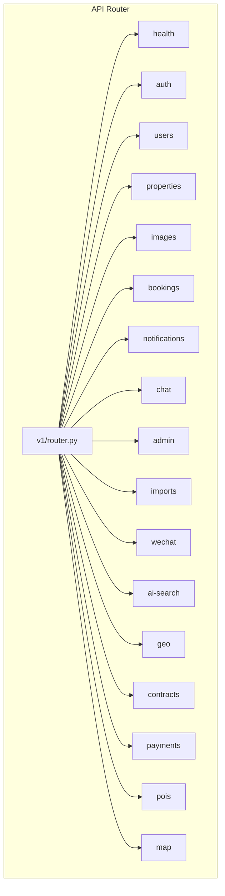
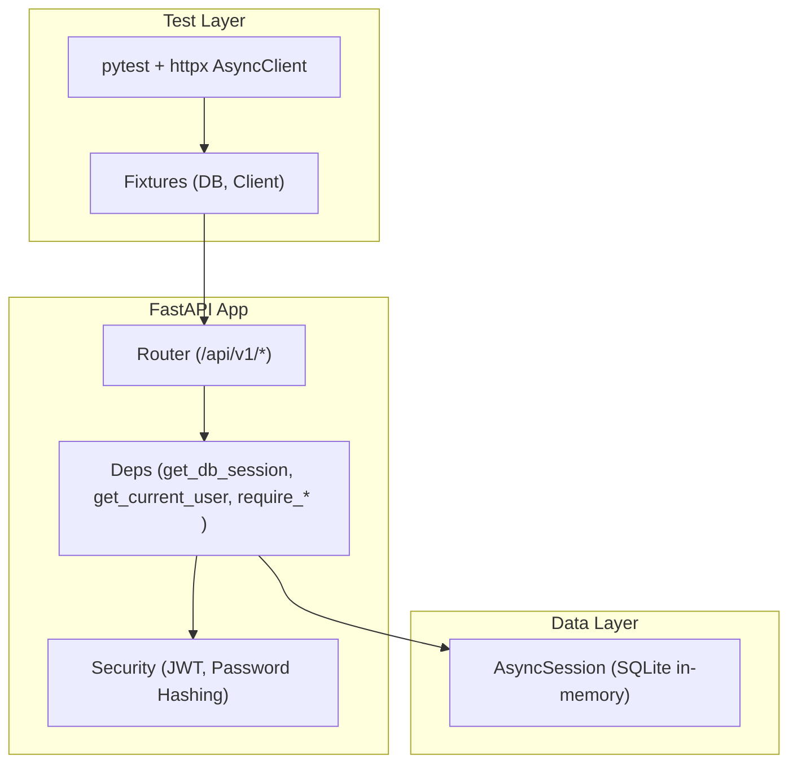
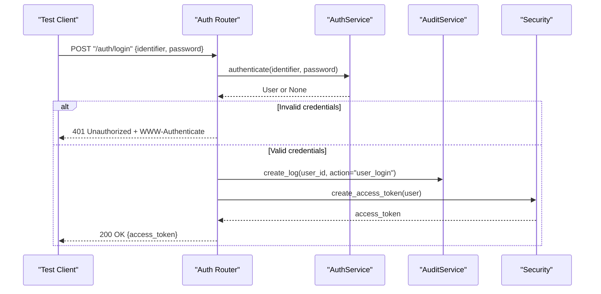
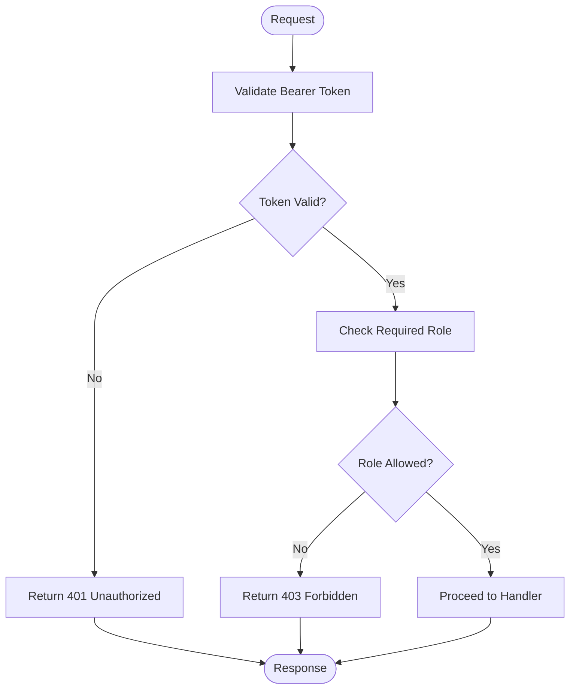
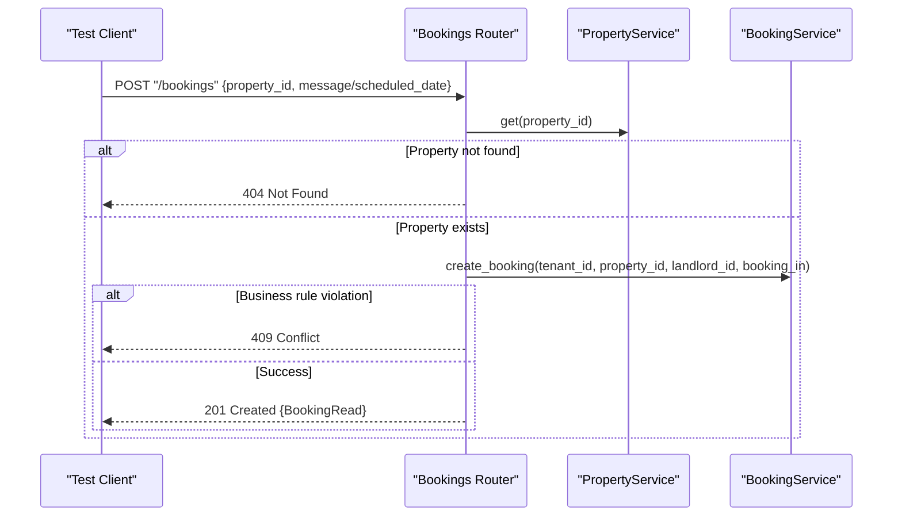
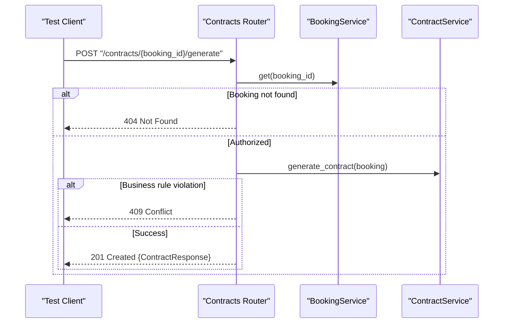
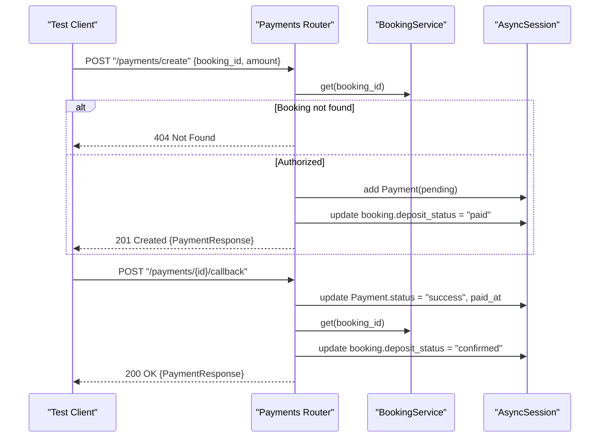
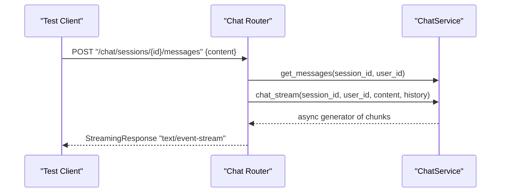
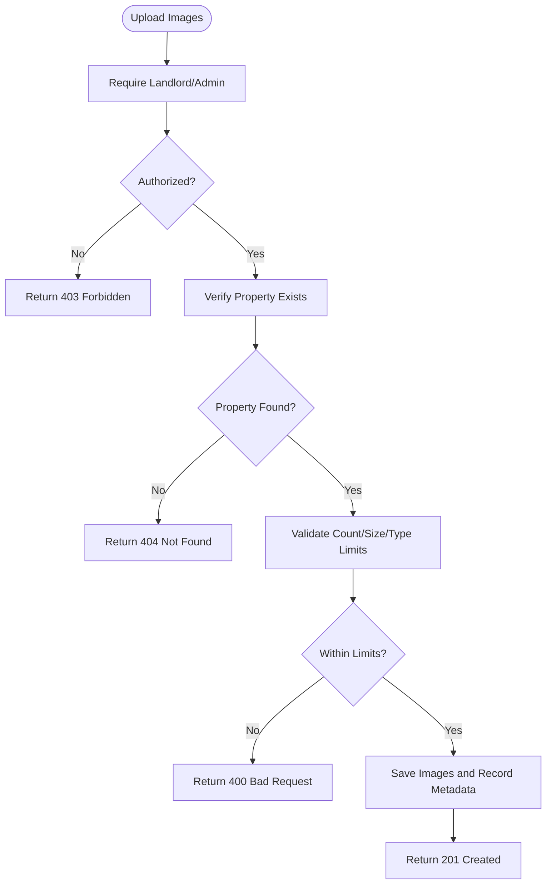
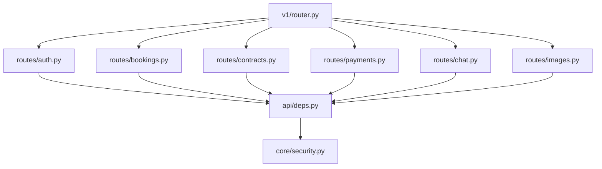

# API Endpoint Testing

<cite>
**Referenced Files in This Document**
- [conftest.py](file://backend/tests/conftest.py)
- [router.py](file://backend/app/api/v1/router.py)
- [deps.py](file://backend/app/api/deps.py)
- [security.py](file://backend/app/core/security.py)
- [auth.py](file://backend/app/api/v1/routes/auth.py)
- [bookings.py](file://backend/app/api/v1/routes/bookings.py)
- [contracts.py](file://backend/app/api/v1/routes/contracts.py)
- [payments.py](file://backend/app/api/v1/routes/payments.py)
- [chat.py](file://backend/app/api/v1/routes/chat.py)
- [images.py](file://backend/app/api/v1/routes/images.py)
- [pytest.ini](file://backend/pytest.ini)
</cite>

## Table of Contents
1. [Introduction](#introduction)
2. [Project Structure](#project-structure)
3. [Core Components](#core-components)
4. [Architecture Overview](#architecture-overview)
5. [Detailed Component Analysis](#detailed-component-analysis)
6. [Dependency Analysis](#dependency-analysis)
7. [Performance Considerations](#performance-considerations)
8. [Troubleshooting Guide](#troubleshooting-guide)
9. [Conclusion](#conclusion)
10. [Appendices](#appendices)

## Introduction
This document provides comprehensive guidance for testing all backend API endpoints across the application. It covers RESTful CRUD operations, authentication and authorization flows, request/response validation, status code verification, error handling, complex workflows (booking creation, contract signing, payment processing), file upload and image processing, real-time chat streaming, rate limiting strategies, input validation, and security vulnerability testing. The goal is to equip testers and developers with a robust strategy to ensure correctness, reliability, and security of the APIs.

## Project Structure
The backend exposes versioned REST APIs under /api/v1, organized by feature modules. A central router aggregates route modules for health, auth, users, properties, images, bookings, notifications, chat, admin, imports, WeChat integration, AI search, geocoding, contracts, payments, POIs, and map routes. Tests are configured using pytest with an in-memory SQLite database and dependency overrides for FastAPI’s dependency injection.

**Diagram sources**
- [router.py:1-23](file://backend/app/api/v1/router.py#L1-L23)

**Section sources**
- [router.py:1-23](file://backend/app/api/v1/router.py#L1-L23)
- [pytest.ini:1-5](file://backend/pytest.ini#L1-L5)

## Core Components
- Test configuration and fixtures:
  - In-memory async SQLite engine and session factory for isolation.
  - Dependency override to inject test DB sessions into FastAPI.
  - Async HTTP client setup via httpx ASGITransport.
  - Optional markers for pgvector tests.
- Authentication and authorization:
  - JWT-based access tokens with configurable expiration.
  - Role-based dependencies for tenant, landlord, and admin.
- Feature routes:
  - Auth: register, login, refresh token, current user.
  - Bookings: create, list, get, update status, cancel.
  - Contracts: generate, get, sign, download.
  - Payments: create, callback, get.
  - Chat: sessions CRUD and streaming messages.
  - Images: multipart upload, delete, set primary, list.

**Section sources**
- [conftest.py:1-111](file://backend/tests/conftest.py#L1-L111)
- [deps.py:1-58](file://backend/app/api/deps.py#L1-L58)
- [security.py:1-34](file://backend/app/core/security.py#L1-L34)
- [auth.py:1-94](file://backend/app/api/v1/routes/auth.py#L1-L94)
- [bookings.py:1-112](file://backend/app/api/v1/routes/bookings.py#L1-L112)
- [contracts.py:1-88](file://backend/app/api/v1/routes/contracts.py#L1-L88)
- [payments.py:1-85](file://backend/app/api/v1/routes/payments.py#L1-L85)
- [chat.py:1-143](file://backend/app/api/v1/routes/chat.py#L1-L143)
- [images.py:1-151](file://backend/app/api/v1/routes/images.py#L1-L151)

## Architecture Overview
The testing architecture uses an in-process FastAPI app with a test database and httpx AsyncClient. Dependencies like DB sessions and user identity are overridden or provided via fixtures. Security utilities handle password hashing and JWT encoding/decoding. Routes enforce role-based access through FastAPI dependencies.

**Diagram sources**
- [conftest.py:1-111](file://backend/tests/conftest.py#L1-L111)
- [deps.py:1-58](file://backend/app/api/deps.py#L1-L58)
- [security.py:1-34](file://backend/app/core/security.py#L1-L34)
- [router.py:1-23](file://backend/app/api/v1/router.py#L1-L23)

## Detailed Component Analysis

### Authentication Endpoints
Endpoints:
- POST /api/v1/auth/register
- POST /api/v1/auth/login
- POST /api/v1/auth/refresh
- GET /api/v1/auth/me

Testing strategy:
- Register:
  - Validate 201 Created on success.
  - Validate 409 Conflict when username/email already exists.
  - Verify audit log creation side effect if applicable.
- Login:
  - Validate 200 OK with TokenResponse containing access_token.
  - Validate 401 Unauthorized for invalid credentials; verify WWW-Authenticate header presence.
  - Confirm audit log creation on successful login.
- Refresh:
  - Validate 200 OK with new access_token when valid refresh token provided.
  - Validate 401 Unauthorized for missing or invalid refresh token.
- Me:
  - Requires valid Bearer token; validate 200 OK with CurrentUserResponse.
  - Validate 401 Unauthorized for missing/invalid token.

Request/response validation:
- Use Pydantic schemas to assert response fields and types.
- Ensure required fields are enforced at the schema level.

Status codes and errors:
- 201 Created for registration.
- 200 OK for login/refresh/me.
- 401 Unauthorized for invalid credentials/tokens.
- 409 Conflict for duplicate registrations.

**Diagram sources**
- [auth.py:1-94](file://backend/app/api/v1/routes/auth.py#L1-L94)
- [deps.py:1-58](file://backend/app/api/deps.py#L1-L58)
- [security.py:1-34](file://backend/app/core/security.py#L1-L34)

**Section sources**
- [auth.py:1-94](file://backend/app/api/v1/routes/auth.py#L1-L94)
- [deps.py:1-58](file://backend/app/api/deps.py#L1-L58)
- [security.py:1-34](file://backend/app/core/security.py#L1-L34)

### Authorization and Role-Based Access Control
Role requirements:
- Tenant-only endpoints: require_tenant
- Landlord-only endpoints: require_landlord
- Admin-only endpoints: require_admin
- General authenticated endpoints: get_current_user

Testing strategy:
- For each protected endpoint:
  - Provide no token → expect 401 Unauthorized.
  - Provide token with wrong role → expect 403 Forbidden.
  - Provide token with correct role → expect success (200/201/204).
- Validate that admin can act as tenant/landlord where allowed.

**Diagram sources**
- [deps.py:1-58](file://backend/app/api/deps.py#L1-L58)

**Section sources**
- [deps.py:1-58](file://backend/app/api/deps.py#L1-L58)

### Booking Endpoints
Endpoints:
- POST /api/v1/bookings
- GET /api/v1/bookings
- GET /api/v1/bookings/{id}
- PATCH /api/v1/bookings/{id}/status
- PATCH /api/v1/bookings/{id}/cancel

Testing strategy:
- Create booking:
  - Validate 201 Created with BookingRead.
  - Validate 400 Bad Request if both message and scheduled_date are missing.
  - Validate 404 Not Found if property does not exist.
  - Validate 409 Conflict for business rule violations (e.g., availability).
  - Enforce tenant-only access.
- List bookings:
  - Landlord/admin sees landlord’s bookings; tenant sees tenant’s bookings.
- Get booking:
  - Validate 404 Not Found if booking does not exist.
  - Validate 403 Forbidden if user is neither tenant nor landlord nor admin.
- Update status:
  - Landlord-only; validate 400 Bad Request for invalid status values.
  - Validate 403 Forbidden if not landlord/admin.
- Cancel booking:
  - Tenant-only; validate 403 Forbidden if not tenant/admin.

**Diagram sources**
- [bookings.py:1-112](file://backend/app/api/v1/routes/bookings.py#L1-L112)

**Section sources**
- [bookings.py:1-112](file://backend/app/api/v1/routes/bookings.py#L1-L112)

### Contract Endpoints
Endpoints:
- POST /api/v1/contracts/{booking_id}/generate
- GET /api/v1/contracts/{contract_id}
- POST /api/v1/contracts/{contract_id}/sign
- GET /api/v1/contracts/{contract_id}/download

Testing strategy:
- Generate contract:
  - Validate 201 Created with ContractResponse.
  - Validate 404 Not Found if booking does not exist.
  - Validate 403 Forbidden if user not involved in booking and not admin.
  - Validate 409 Conflict if generation fails due to business rules.
- Get contract:
  - Validate 404 Not Found if contract does not exist.
  - Validate 403 Forbidden if user not authorized.
- Sign contract:
  - Tenant-only; validate 403 Forbidden if not tenant/admin.
  - Validate 409 Conflict if already signed.
- Download contract:
  - Returns plain text content; validate 404/403 as above.

**Diagram sources**
- [contracts.py:1-88](file://backend/app/api/v1/routes/contracts.py#L1-L88)

**Section sources**
- [contracts.py:1-88](file://backend/app/api/v1/routes/contracts.py#L1-L88)

### Payment Endpoints
Endpoints:
- POST /api/v1/payments/create
- POST /api/v1/payments/{payment_id}/callback
- GET /api/v1/payments/{payment_id}

Testing strategy:
- Create payment:
  - Tenant-only; validate 403 Forbidden if not tenant/admin.
  - Validate 404 Not Found if booking does not exist.
  - On success, verify deposit_status updated to paid and transaction_id recorded.
- Callback:
  - Simulate external payment provider callback; update payment status to success and paid_at timestamp.
  - Update booking deposit_status to confirmed.
- Get payment:
  - Owner-only or admin; validate 403 Forbidden otherwise.

**Diagram sources**
- [payments.py:1-85](file://backend/app/api/v1/routes/payments.py#L1-L85)

**Section sources**
- [payments.py:1-85](file://backend/app/api/v1/routes/payments.py#L1-L85)

### Chat Endpoints (Streaming)
Endpoints:
- POST /api/v1/chat/sessions
- GET /api/v1/chat/sessions
- GET /api/v1/chat/sessions/{session_id}/messages
- POST /api/v1/chat/sessions/{session_id}/messages
- DELETE /api/v1/chat/sessions/{session_id}

Testing strategy:
- Sessions CRUD:
  - Create session: validate 201 Created with SessionResponse.
  - List sessions: validate 200 OK with list of SessionResponse.
  - Delete session: validate 204 No Content or 404 Not Found.
- Messages:
  - Get messages: validate 200 OK with list of MessageResponse.
  - Send message: returns StreamingResponse with media_type "text/event-stream".
    - Assert headers include Cache-Control, Connection, X-Accel-Buffering.
    - Consume stream chunks and assert non-empty content.
- Authorization:
  - All endpoints require authenticated user; validate 401 Unauthorized without token.

**Diagram sources**
- [chat.py:1-143](file://backend/app/api/v1/routes/chat.py#L1-L143)

**Section sources**
- [chat.py:1-143](file://backend/app/api/v1/routes/chat.py#L1-L143)

### Image Upload and Management
Endpoints:
- POST /api/v1/properties/{property_id}/images
- DELETE /api/v1/properties/{property_id}/images/{image_id}
- PATCH /api/v1/properties/{property_id}/images/{image_id}/primary
- GET /api/v1/properties/{property_id}/images

Testing strategy:
- Upload images:
  - Landlord-only; validate 403 Forbidden if not landlord/admin.
  - Validate 404 Not Found if property does not exist.
  - Validate 400 Bad Request for unsupported file types or exceeding size limits.
  - Validate 400 Bad Request if total images exceed per-property limit.
  - On success, validate 201 Created with list of PropertyImageRead.
- Delete image:
  - Landlord-only; validate 404 Not Found if image does not exist.
- Set primary image:
  - Landlord-only; validate 404 Not Found if image does not exist.
- List images:
  - Public read for existing property; validate 404 Not Found if property does not exist.

**Diagram sources**
- [images.py:1-151](file://backend/app/api/v1/routes/images.py#L1-L151)

**Section sources**
- [images.py:1-151](file://backend/app/api/v1/routes/images.py#L1-L151)

### Health and Utility Endpoints
- Health check endpoints typically return 200 OK for readiness/liveness.
- Map and geocoding endpoints may depend on external services; consider mocking or skipping in unit tests.

[No sources needed since this section doesn't analyze specific files]

## Dependency Analysis
Key dependencies and relationships:
- Router aggregation defines all feature routes under /api/v1.
- Deps module provides DB session and user identity with role checks.
- Security module handles password hashing and JWT encode/decode.
- Tests override DB dependency and use in-memory SQLite for isolation.

**Diagram sources**
- [router.py:1-23](file://backend/app/api/v1/router.py#L1-L23)
- [deps.py:1-58](file://backend/app/api/deps.py#L1-L58)
- [security.py:1-34](file://backend/app/core/security.py#L1-L34)
- [auth.py:1-94](file://backend/app/api/v1/routes/auth.py#L1-L94)
- [bookings.py:1-112](file://backend/app/api/v1/routes/bookings.py#L1-L112)
- [contracts.py:1-88](file://backend/app/api/v1/routes/contracts.py#L1-L88)
- [payments.py:1-85](file://backend/app/api/v1/routes/payments.py#L1-L85)
- [chat.py:1-143](file://backend/app/api/v1/routes/chat.py#L1-L143)
- [images.py:1-151](file://backend/app/api/v1/routes/images.py#L1-L151)

**Section sources**
- [router.py:1-23](file://backend/app/api/v1/router.py#L1-L23)
- [deps.py:1-58](file://backend/app/api/deps.py#L1-L58)
- [security.py:1-34](file://backend/app/core/security.py#L1-L34)

## Performance Considerations
- Use in-memory SQLite for fast, isolated tests; avoid heavy IO-bound operations.
- Mock external services (AI, geocoding, payment providers) to reduce flakiness and latency.
- Stream responses should be consumed efficiently in tests; assert chunk counts rather than full payloads.
- Limit concurrent requests in rate-limiting tests to realistic levels; measure response times and error rates.

[No sources needed since this section provides general guidance]

## Troubleshooting Guide
Common issues and resolutions:
- Database connection failures:
  - Ensure async engine and session factory are correctly configured in tests.
  - Verify dependency override replaces production DB with test DB.
- Authentication failures:
  - Confirm tokens are generated with expected secret and algorithm.
  - Validate WWW-Authenticate header presence on 401 responses.
- File upload errors:
  - Check allowed types and size limits; ensure test files match constraints.
  - Validate per-property image count limits.
- Streaming response tests:
  - Ensure proper headers are present; consume stream fully to avoid hanging tests.
- Rate limiting:
  - If implemented, simulate bursts and verify throttling behavior; adjust thresholds for CI environments.

**Section sources**
- [conftest.py:1-111](file://backend/tests/conftest.py#L1-L111)
- [deps.py:1-58](file://backend/app/api/deps.py#L1-L58)
- [security.py:1-34](file://backend/app/core/security.py#L1-L34)
- [images.py:1-151](file://backend/app/api/v1/routes/images.py#L1-L151)
- [chat.py:1-143](file://backend/app/api/v1/routes/chat.py#L1-L143)

## Conclusion
By leveraging in-memory databases, dependency overrides, and structured fixtures, the test suite can comprehensively validate REST endpoints, authentication/authorization, complex workflows, file uploads, and streaming responses. Emphasize request/response validation, status code assertions, error handling scenarios, and security checks to ensure robust API quality.

[No sources needed since this section summarizes without analyzing specific files]

## Appendices

### Test Configuration Notes
- Pytest markers:
  - pgvector marker allows selective execution of PostgreSQL-specific tests.
- Environment variables:
  - Disable external calls during tests (e.g., OpenAI, AMap) and enable eager Celery tasks.

**Section sources**
- [pytest.ini:1-5](file://backend/pytest.ini#L1-L5)
- [conftest.py:1-111](file://backend/tests/conftest.py#L1-L111)