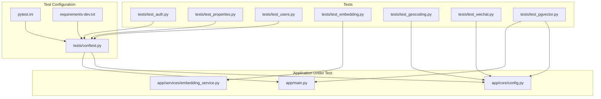
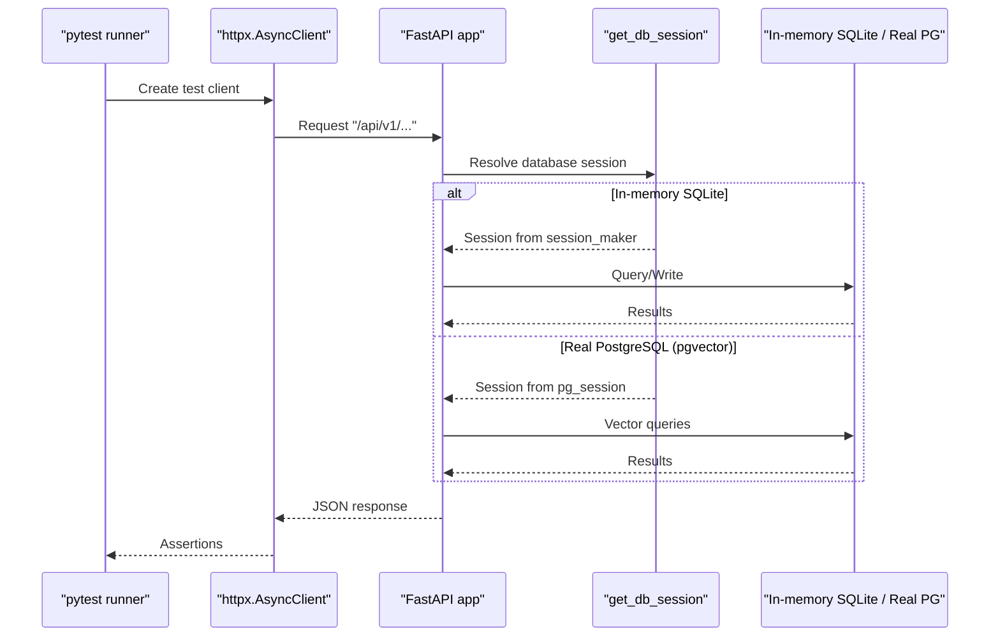
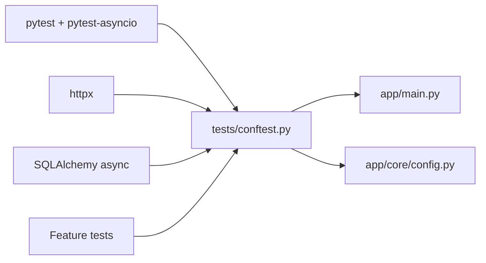

# Backend Testing with Pytest

<cite>
**Referenced Files in This Document**
- [pytest.ini](file://backend/pytest.ini)
- [conftest.py](file://backend/tests/conftest.py)
- [test_auth.py](file://backend/tests/test_auth.py)
- [test_properties.py](file://backend/tests/test_properties.py)
- [test_users.py](file://backend/tests/test_users.py)
- [test_embedding.py](file://backend/tests/test_embedding.py)
- [test_geocoding.py](file://backend/tests/test_geocoding.py)
- [test_wechat.py](file://backend/tests/test_wechat.py)
- [test_pgvector.py](file://backend/tests/test_pgvector.py)
- [main.py](file://backend/app/main.py)
- [embedding_service.py](file://backend/app/services/embedding_service.py)
- [config.py](file://backend/app/core/config.py)
- [requirements-dev.txt](file://backend/requirements-dev.txt)
</cite>

## Table of Contents
1. [Introduction](#introduction)
2. [Project Structure](#project-structure)
3. [Core Components](#core-components)
4. [Architecture Overview](#architecture-overview)
5. [Detailed Component Analysis](#detailed-component-analysis)
6. [Dependency Analysis](#dependency-analysis)
7. [Performance Considerations](#performance-considerations)
8. [Troubleshooting Guide](#troubleshooting-guide)
9. [Conclusion](#conclusion)

## Introduction
This document explains how backend testing is implemented using pytest for the Rental Housing Structure project. It covers pytest configuration, async test support, custom markers for PostgreSQL/pgvector tests, unit and integration testing strategies, mocking external services (OpenAI, AMap, WeChat), test data management patterns, authentication and authorization flows, error handling validation, and performance considerations for AI embedding generation and vector search operations.

## Project Structure
The testing setup centers around a small set of configuration files and focused test modules:
- pytest configuration defines async fixture loop scope and custom markers
- conftest provides shared fixtures for an in-memory SQLite database, an ASGI test client, and reusable payloads
- Feature-specific tests cover auth, properties, users, embeddings, geocoding, WeChat, and pgvector-enabled scenarios

**Diagram sources**
- [pytest.ini:1-5](file://backend/pytest.ini#L1-L5)
- [conftest.py:1-111](file://backend/tests/conftest.py#L1-L111)
- [requirements-dev.txt:1-6](file://backend/requirements-dev.txt#L1-L6)
- [main.py:1-82](file://backend/app/main.py#L1-L82)
- [config.py:1-167](file://backend/app/core/config.py#L1-L167)
- [embedding_service.py:1-32](file://backend/app/services/embedding_service.py#L1-L32)
- [test_auth.py:1-92](file://backend/tests/test_auth.py#L1-L92)
- [test_properties.py:1-78](file://backend/tests/test_properties.py#L1-L78)
- [test_users.py:1-231](file://backend/tests/test_users.py#L1-L231)
- [test_embedding.py:1-61](file://backend/tests/test_embedding.py#L1-L61)
- [test_geocoding.py:1-98](file://backend/tests/test_geocoding.py#L1-L98)
- [test_wechat.py:1-183](file://backend/tests/test_wechat.py#L1-L183)
- [test_pgvector.py:1-163](file://backend/tests/test_pgvector.py#L1-L163)

**Section sources**
- [pytest.ini:1-5](file://backend/pytest.ini#L1-L5)
- [conftest.py:1-111](file://backend/tests/conftest.py#L1-L111)
- [requirements-dev.txt:1-6](file://backend/requirements-dev.txt#L1-L6)

## Core Components
- Async test support: The pytest configuration sets asyncio_default_fixture_loop_scope to function, ensuring each async fixture runs within its own event loop scope. Tests use pytest.mark.asyncio to declare async behavior.
- Custom marker pgvector: A marker is registered to identify tests requiring a real PostgreSQL instance with the pgvector extension. These are skipped by default unless explicitly enabled via a command-line flag.
- Shared fixtures:
  - session_maker: Creates an in-memory SQLite engine, creates all tables, yields a session factory, then drops tables and disposes the engine.
  - client: Overrides the application’s database dependency with the in-memory session and exposes an httpx.AsyncClient for API calls.
  - Payloads: landlord_payload, landlord_register_payload, property_payload provide reusable request bodies.
- External service isolation: Environment variables for OpenAI and AMap keys are defaulted to empty strings; Celery eager mode is enabled so tasks run synchronously during tests.

Key implementation references:
- Async fixture loop scope and marker registration
- In-memory DB and ASGI client override
- Reusable payloads for auth and properties
- Skipping pgvector tests without explicit flag

**Section sources**
- [pytest.ini:1-5](file://backend/pytest.ini#L1-L5)
- [conftest.py:1-111](file://backend/tests/conftest.py#L1-L111)

## Architecture Overview
The test architecture uses FastAPI’s ASGI transport to drive requests against the application while swapping out dependencies like the database session. For features that require external APIs or specialized databases, tests either mock HTTP clients or connect to a real PostgreSQL with pgvector when explicitly requested.

**Diagram sources**
- [conftest.py:22-49](file://backend/tests/conftest.py#L22-L49)
- [test_pgvector.py:12-33](file://backend/tests/test_pgvector.py#L12-L33)
- [main.py:17-78](file://backend/app/main.py#L17-L78)

## Detailed Component Analysis

### Pytest Configuration and Async Support
- asyncio_default_fixture_loop_scope is set to function, which ensures each async fixture has a dedicated loop scope.
- Custom marker pgvector is declared to tag tests needing PostgreSQL with pgvector.
- Collection modification skips pgvector-tagged tests unless --run-pgvector is provided.

Practical implications:
- All async fixtures and tests run deterministically per function scope.
- pgvector tests are opt-in, keeping CI fast by default.

**Section sources**
- [pytest.ini:1-5](file://backend/pytest.ini#L1-L5)
- [conftest.py:87-111](file://backend/tests/conftest.py#L87-L111)

### Database Fixtures and Transaction Isolation
- An in-memory SQLite engine is created per test session, tables are created before yielding the session factory, and dropped afterward.
- The app’s get_db_session dependency is overridden to use this in-memory session, isolating tests from any persistent state.
- Note: The current fixtures do not wrap requests in a transactional rollback; they rely on dropping tables at the end of the session maker lifecycle. If transaction-based isolation is desired, consider wrapping each test in a transaction and rolling back after each test.

Operational notes:
- Use the shared client fixture to send requests against the app.
- Avoid relying on side effects across tests; each test should be self-contained.

**Section sources**
- [conftest.py:22-49](file://backend/tests/conftest.py#L22-L49)

### Authentication and Authorization Testing
- Registration and login flows assert correct status codes and token presence.
- Access control is validated by asserting 401 for unauthenticated access and 403 for insufficient roles.
- Profile endpoints verify that sensitive fields (e.g., password hashes) are never returned.

Patterns demonstrated:
- Register user, login, capture access_token, attach Authorization header for protected routes.
- Assert role-based permissions for listing users and updating profiles.

**Section sources**
- [test_auth.py:1-92](file://backend/tests/test_auth.py#L1-L92)
- [test_users.py:1-231](file://backend/tests/test_users.py#L1-L231)

### Properties and Data Validation
- Creating a property requires a valid landlord_id and proper authentication.
- Listing properties returns persisted entities.
- Invalid inputs result in validation errors (e.g., 422).

Best practices shown:
- Combine auth flow with resource creation to validate end-to-end workflows.
- Validate both success and failure paths.

**Section sources**
- [test_properties.py:1-78](file://backend/tests/test_properties.py#L1-L78)

### Unit Testing Services and Mocking External APIs
- EmbeddingService:
  - Uses unittest.mock.patch to replace AsyncOpenAI and its embeddings.create call.
  - Verifies output dimensionality and text composition logic.
- AMap Geocoding:
  - Patches httpx.AsyncClient.get to return controlled responses.
  - Validates coordinate parsing and formatted address extraction.
  - Ensures endpoint returns 503 when required key is missing.
- WeChat Service and Login:
  - Patches httpx.AsyncClient.get/post to simulate code2session, token retrieval, and template message sending.
  - Integration tests assert new vs existing user flows and error responses.

Mocking strategy highlights:
- Replace entire classes or methods under test to avoid network calls.
- Provide AsyncMock responses with json() and raise_for_status() to mimic httpx behavior.

**Section sources**
- [test_embedding.py:1-61](file://backend/tests/test_embedding.py#L1-L61)
- [embedding_service.py:1-32](file://backend/app/services/embedding_service.py#L1-L32)
- [test_geocoding.py:1-98](file://backend/tests/test_geocoding.py#L1-L98)
- [test_wechat.py:1-183](file://backend/tests/test_wechat.py#L1-L183)

### PostgreSQL/pgvector Integration Tests
- A separate fixture connects to the real PostgreSQL configured in settings and overrides the app’s database dependency.
- Tests are tagged with the pgvector marker and skipped unless --run-pgvector is passed.
- Covers semantic search, structured filters, POI generation, contract/payment endpoint existence, refresh token endpoint, and rate limiting behavior.

Execution guidance:
- Run with the explicit flag to enable pgvector tests.
- Ensure the database URL points to a PostgreSQL instance with the pgvector extension enabled.

**Section sources**
- [test_pgvector.py:1-163](file://backend/tests/test_pgvector.py#L1-L163)
- [config.py:15-22](file://backend/app/core/config.py#L15-L22)

### Test Data Management and Factory Patterns
- Current approach uses lightweight fixtures for payloads rather than full factory classes.
- Recommended enhancements:
  - Introduce factory functions or a library like factory_boy to create complex entities consistently.
  - Centralize seed data for common scenarios (e.g., landlords, tenants, sample properties).
  - Consider per-test seeding helpers to reduce duplication and improve readability.

[No sources needed since this section provides general guidance]

### Error Handling Validation
- Auth failures return 401 for invalid credentials or missing tokens.
- Missing API keys for external services yield 503 responses.
- Validation errors produce 422 for malformed or incomplete payloads.

Validation examples:
- Wrong password login returns 401.
- Unauthenticated access to protected endpoints returns 401.
- Geocoding without a configured key returns 503.

**Section sources**
- [test_auth.py:42-65](file://backend/tests/test_auth.py#L42-L65)
- [test_geocoding.py:88-98](file://backend/tests/test_geocoding.py#L88-L98)

## Dependency Analysis
The test suite depends on:
- pytest and pytest-asyncio for test execution and async support
- httpx for ASGI transport and client usage
- SQLAlchemy async engine/session for in-memory SQLite and optional real PostgreSQL connections
- Application components such as main app and config for dependency overrides and settings

**Diagram sources**
- [requirements-dev.txt:1-6](file://backend/requirements-dev.txt#L1-L6)
- [conftest.py:1-111](file://backend/tests/conftest.py#L1-L111)
- [main.py:1-82](file://backend/app/main.py#L1-L82)
- [config.py:1-167](file://backend/app/core/config.py#L1-L167)

**Section sources**
- [requirements-dev.txt:1-6](file://backend/requirements-dev.txt#L1-L6)
- [conftest.py:1-111](file://backend/tests/conftest.py#L1-L111)

## Performance Considerations
- Embedding generation:
  - Unit tests mock the OpenAI client to avoid latency and cost.
  - When measuring performance, consider timing generate_embedding and generate_property_embedding with realistic payloads and mocked I/O to isolate compute time.
- Vector search:
  - pgvector tests exercise semantic search and combined filters.
  - For performance profiling, measure query latency over representative datasets and ensure indexes exist for vector similarity searches.
- Rate limiting:
  - Health endpoint is verified to be unlimited; other endpoints may be rate-limited depending on middleware configuration.

Recommendations:
- Add benchmark-style tests for critical paths using pytest-benchmark if needed.
- Keep external calls mocked in unit tests; reserve real-service calls for integration suites with appropriate timeouts and retries.

[No sources needed since this section provides general guidance]

## Troubleshooting Guide
Common issues and resolutions:
- pgvector tests skipped unexpectedly:
  - Ensure you pass the --run-pgvector flag when running tests.
- External API calls failing in tests:
  - Verify environment variables are set to empty strings or mocked appropriately.
  - Confirm patches target the correct module paths (e.g., httpx.AsyncClient.get/post).
- Database state leaking between tests:
  - Rely on the in-memory SQLite fixture; avoid cross-test assumptions.
  - If switching to transactional isolation, ensure each test rolls back changes after completion.
- Missing API keys causing 503:
  - Configure required keys in settings or assert expected 503 behavior in tests.

**Section sources**
- [conftest.py:87-111](file://backend/tests/conftest.py#L87-L111)
- [test_geocoding.py:88-98](file://backend/tests/test_geocoding.py#L88-L98)

## Conclusion
The backend testing strategy combines robust async support, isolated in-memory databases, selective integration with PostgreSQL/pgvector, and comprehensive mocking of external services. Tests validate authentication, authorization, data validation, and error handling across multiple domains. By following the established patterns—using shared fixtures, targeted mocks, and explicit flags for heavy integrations—you can maintain fast, reliable, and scalable tests as the system evolves.