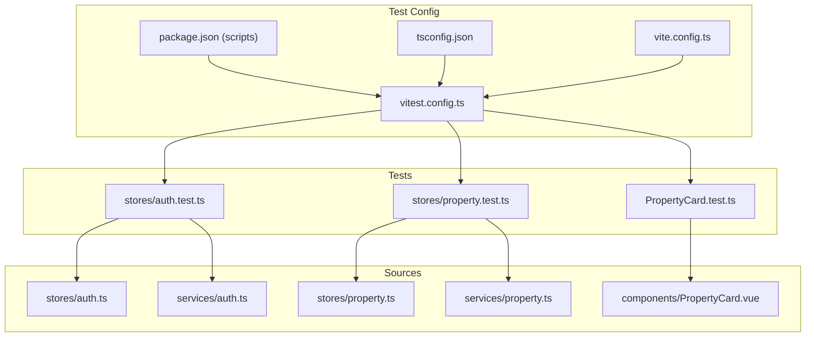
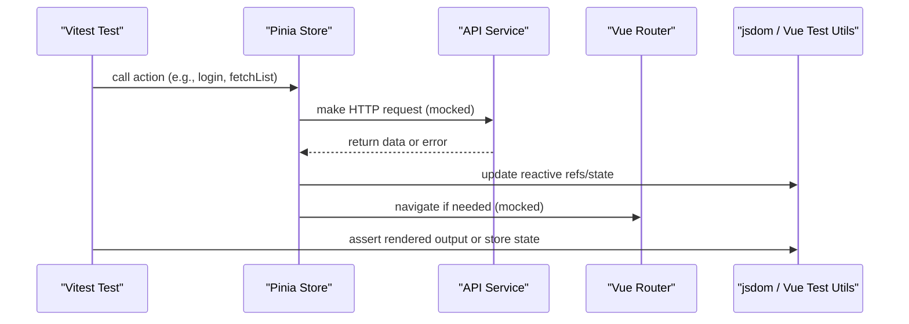
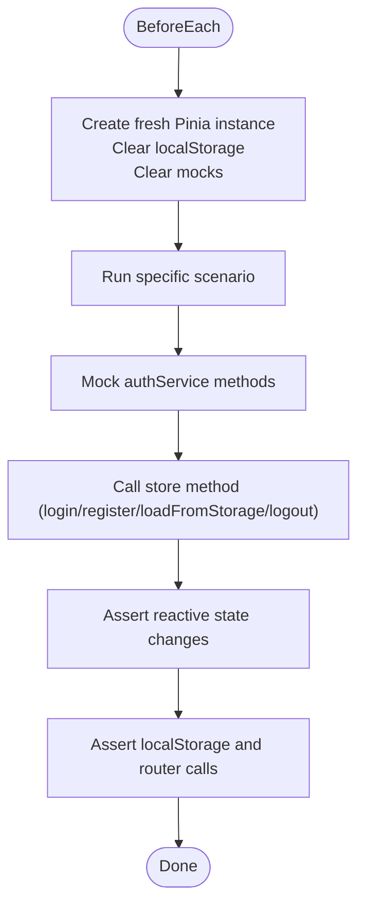
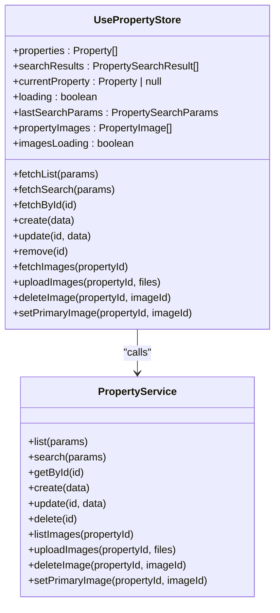
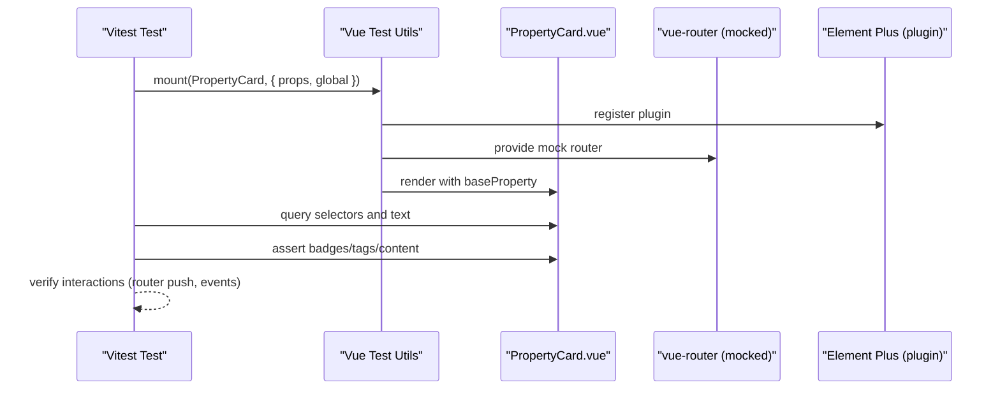
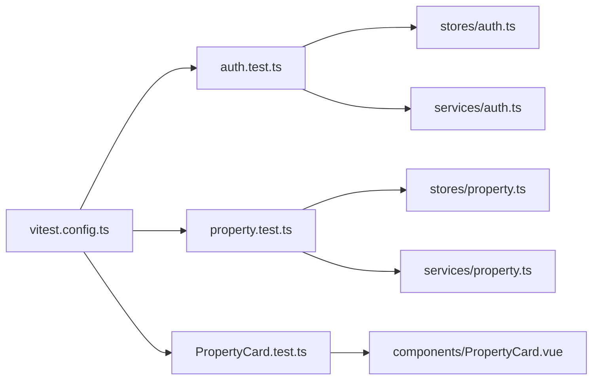

# Frontend Testing with Vitest

<cite>
**Referenced Files in This Document**
- [vitest.config.ts](file://frontend/vitest.config.ts)
- [package.json](file://frontend/package.json)
- [tsconfig.json](file://frontend/tsconfig.json)
- [vite.config.ts](file://frontend/vite.config.ts)
- [auth.test.ts](file://frontend/src/__tests__/stores/auth.test.ts)
- [property.test.ts](file://frontend/src/__tests__/stores/property.test.ts)
- [PropertyCard.test.ts](file://frontend/src/__tests__/PropertyCard.test.ts)
- [auth.ts](file://frontend/src/stores/auth.ts)
- [property.ts](file://frontend/src/stores/property.ts)
- [auth.ts](file://frontend/src/services/auth.ts)
- [property.ts](file://frontend/src/services/property.ts)
- [PropertyCard.vue](file://frontend/src/components/PropertyCard.vue)
</cite>

## Table of Contents
1. [Introduction](#introduction)
2. [Project Structure](#project-structure)
3. [Core Components](#core-components)
4. [Architecture Overview](#architecture-overview)
5. [Detailed Component Analysis](#detailed-component-analysis)
6. [Dependency Analysis](#dependency-analysis)
7. [Performance Considerations](#performance-considerations)
8. [Troubleshooting Guide](#troubleshooting-guide)
9. [Conclusion](#conclusion)
10. [Appendices](#appendices)

## Introduction
This document explains how the Vue 3 frontend is tested using Vitest, including configuration, TypeScript support, and testing strategies for Pinia stores, components, and API services. It covers unit tests for the auth store and property store with state mocking, component tests for PropertyCard, service-level HTTP mocking, and best practices for reactive state, computed properties, watchers, snapshot testing, and accessibility considerations.

## Project Structure
The frontend test setup centers around:
- A dedicated Vitest configuration that enables globals, jsdom environment, path aliases, and coverage.
- Existing tests under src/__tests__ covering stores and a reusable component.
- Service modules that encapsulate HTTP calls via Axios, which are mocked in tests.
- TypeScript configuration aligned with Vite and Vue.

**Diagram sources**
- [vitest.config.ts:1-22](file://frontend/vitest.config.ts#L1-L22)
- [package.json:1-31](file://frontend/package.json#L1-L31)
- [tsconfig.json:1-25](file://frontend/tsconfig.json#L1-L25)
- [vite.config.ts:1-22](file://frontend/vite.config.ts#L1-L22)
- [auth.test.ts:1-86](file://frontend/src/__tests__/stores/auth.test.ts#L1-L86)
- [property.test.ts:1-126](file://frontend/src/__tests__/stores/property.test.ts#L1-L126)
- [PropertyCard.test.ts:1-80](file://frontend/src/__tests__/PropertyCard.test.ts#L1-L80)
- [auth.ts:1-101](file://frontend/src/stores/auth.ts#L1-L101)
- [property.ts:1-136](file://frontend/src/stores/property.ts#L1-L136)
- [auth.ts:1-22](file://frontend/src/services/auth.ts#L1-L22)
- [property.ts:1-86](file://frontend/src/services/property.ts#L1-L86)
- [PropertyCard.vue:1-318](file://frontend/src/components/PropertyCard.vue#L1-L318)

**Section sources**
- [vitest.config.ts:1-22](file://frontend/vitest.config.ts#L1-L22)
- [package.json:1-31](file://frontend/package.json#L1-L31)
- [tsconfig.json:1-25](file://frontend/tsconfig.json#L1-L25)
- [vite.config.ts:1-22](file://frontend/vite.config.ts#L1-L22)

## Core Components
- Vitest configuration
  - Enables global test APIs, sets jsdom environment, configures path alias @ to src, and includes coverage for components, stores, and views.
- Package scripts
  - Provides commands to run tests, watch mode, and generate coverage.
- TypeScript integration
  - tsconfig aligns with Vite and Vue; paths map @ to src; tests are excluded from build-time checks but included in compilation for type safety.

Key implementation references:
- Test runner and environment: [vitest.config.ts:1-22](file://frontend/vitest.config.ts#L1-L22)
- Scripts: [package.json:1-31](file://frontend/package.json#L1-L31)
- Path alias alignment: [vite.config.ts:1-22](file://frontend/vite.config.ts#L1-L22), [tsconfig.json:1-25](file://frontend/tsconfig.json#L1-L25)

**Section sources**
- [vitest.config.ts:1-22](file://frontend/vitest.config.ts#L1-L22)
- [package.json:1-31](file://frontend/package.json#L1-L31)
- [tsconfig.json:1-25](file://frontend/tsconfig.json#L1-L25)
- [vite.config.ts:1-22](file://frontend/vite.config.ts#L1-L22)

## Architecture Overview
The testing architecture isolates external dependencies by mocking services and router interactions, then asserts on store state and component rendering.

**Diagram sources**
- [auth.test.ts:1-86](file://frontend/src/__tests__/stores/auth.test.ts#L1-L86)
- [property.test.ts:1-126](file://frontend/src/__tests__/stores/property.test.ts#L1-L126)
- [auth.ts:1-101](file://frontend/src/stores/auth.ts#L1-L101)
- [property.ts:1-136](file://frontend/src/stores/property.ts#L1-L136)
- [auth.ts:1-22](file://frontend/src/services/auth.ts#L1-L22)
- [property.ts:1-86](file://frontend/src/services/property.ts#L1-L86)

## Detailed Component Analysis

### Auth Store Unit Tests
Focus areas:
- Initial state assertions
- LocalStorage persistence and recovery
- Role-based computed flags
- Error handling for corrupt storage
- State updates and side effects

**Diagram sources**
- [auth.test.ts:1-86](file://frontend/src/__tests__/stores/auth.test.ts#L1-L86)
- [auth.ts:1-101](file://frontend/src/stores/auth.ts#L1-L101)
- [auth.ts:1-22](file://frontend/src/services/auth.ts#L1-L22)

**Section sources**
- [auth.test.ts:1-86](file://frontend/src/__tests__/stores/auth.test.ts#L1-L86)
- [auth.ts:1-101](file://frontend/src/stores/auth.ts#L1-L101)
- [auth.ts:1-22](file://frontend/src/services/auth.ts#L1-L22)

### Property Store Unit Tests
Focus areas:
- CRUD operations and list/search flows
- Current property synchronization after updates
- Image management (list, delete, set primary)
- Filtering arrays after deletions

**Diagram sources**
- [property.ts:1-136](file://frontend/src/stores/property.ts#L1-L136)
- [property.ts:1-86](file://frontend/src/services/property.ts#L1-L86)

**Section sources**
- [property.test.ts:1-126](file://frontend/src/__tests__/stores/property.test.ts#L1-L126)
- [property.ts:1-136](file://frontend/src/stores/property.ts#L1-L136)
- [property.ts:1-86](file://frontend/src/services/property.ts#L1-L86)

### PropertyCard Component Tests
Focus areas:
- Rendering title, price, district tag, bedroom/bathroom count
- Placeholder when no images
- Similarity badge visibility based on props
- Area display when available

**Diagram sources**
- [PropertyCard.test.ts:1-80](file://frontend/src/__tests__/PropertyCard.test.ts#L1-L80)
- [PropertyCard.vue:1-318](file://frontend/src/components/PropertyCard.vue#L1-L318)

**Section sources**
- [PropertyCard.test.ts:1-80](file://frontend/src/__tests__/PropertyCard.test.ts#L1-L80)
- [PropertyCard.vue:1-318](file://frontend/src/components/PropertyCard.vue#L1-L318)

### API Service Testing Strategy
- Services wrap Axios calls and transform responses. In tests, replace these modules with vi.mock to return controlled promises.
- For POST/GET/PATCH/DELETE endpoints, resolve with expected payloads or reject to simulate errors.
- Validate that stores handle loading states, success responses, and error branches correctly.

References:
- Auth service interface and endpoints: [auth.ts:1-22](file://frontend/src/services/auth.ts#L1-L22)
- Property service interface and endpoints: [property.ts:1-86](file://frontend/src/services/property.ts#L1-L86)

**Section sources**
- [auth.ts:1-22](file://frontend/src/services/auth.ts#L1-L22)
- [property.ts:1-86](file://frontend/src/services/property.ts#L1-L86)

### Testing Utilities and Patterns
- Environment and globals
  - jsdom environment and global test functions enabled in Vitest config.
- Path aliasing
  - Alias @ maps to src in both Vite and Vitest configs for consistent imports.
- Component mounting
  - Use Vue Test Utils mount with global plugins (e.g., Element Plus) and router mocks.
- Asynchronous operations
  - Await async store actions; use vi.fn().mockResolvedValue for service returns.
- Reactive state assertions
  - Read store refs directly after awaiting actions; assert computed values derived from state.

References:
- Vitest config: [vitest.config.ts:1-22](file://frontend/vitest.config.ts#L1-L22)
- Vite alias: [vite.config.ts:1-22](file://frontend/vite.config.ts#L1-L22)
- Component test utilities: [PropertyCard.test.ts:1-80](file://frontend/src/__tests__/PropertyCard.test.ts#L1-L80)

**Section sources**
- [vitest.config.ts:1-22](file://frontend/vitest.config.ts#L1-L22)
- [vite.config.ts:1-22](file://frontend/vite.config.ts#L1-L22)
- [PropertyCard.test.ts:1-80](file://frontend/src/__tests__/PropertyCard.test.ts#L1-L80)

### Best Practices for Reactivity, Computed Properties, and Watchers
- Always await async store methods before asserting state.
- Prefer direct ref access for assertions rather than relying on DOM snapshots for logic-heavy behavior.
- For computed properties, ensure inputs are stable and fully defined in test fixtures.
- If watchers are present, flush microtasks or use nextTick where necessary to ensure DOM updates complete before assertions.

[No sources needed since this section provides general guidance]

### Snapshot Testing for UI Components
- Snapshot tests can stabilize UI structure and content across changes.
- Recommended approach:
  - Render component with representative props.
  - Take a snapshot of wrapper.html or wrapper.element.
  - Update snapshots intentionally when UI changes are verified.
- Combine with targeted assertions for critical elements to reduce brittle snapshots.

[No sources needed since this section provides general guidance]

### Accessibility Testing Considerations
- Ensure images have meaningful alt attributes.
- Verify interactive elements are keyboard accessible and have appropriate roles.
- Use semantic HTML tags and labels for form controls.
- Consider adding axe-core or similar tools to detect common accessibility issues in future expansions.

[No sources needed since this section provides general guidance]

## Dependency Analysis
The following diagram shows how tests depend on source modules and their relationships.

**Diagram sources**
- [auth.test.ts:1-86](file://frontend/src/__tests__/stores/auth.test.ts#L1-L86)
- [property.test.ts:1-126](file://frontend/src/__tests__/stores/property.test.ts#L1-L126)
- [PropertyCard.test.ts:1-80](file://frontend/src/__tests__/PropertyCard.test.ts#L1-L80)
- [auth.ts:1-101](file://frontend/src/stores/auth.ts#L1-L101)
- [property.ts:1-136](file://frontend/src/stores/property.ts#L1-L136)
- [auth.ts:1-22](file://frontend/src/services/auth.ts#L1-L22)
- [property.ts:1-86](file://frontend/src/services/property.ts#L1-L86)
- [PropertyCard.vue:1-318](file://frontend/src/components/PropertyCard.vue#L1-L318)
- [vitest.config.ts:1-22](file://frontend/vitest.config.ts#L1-L22)

**Section sources**
- [auth.test.ts:1-86](file://frontend/src/__tests__/stores/auth.test.ts#L1-L86)
- [property.test.ts:1-126](file://frontend/src/__tests__/stores/property.test.ts#L1-L126)
- [PropertyCard.test.ts:1-80](file://frontend/src/__tests__/PropertyCard.test.ts#L1-L80)
- [auth.ts:1-101](file://frontend/src/stores/auth.ts#L1-L101)
- [property.ts:1-136](file://frontend/src/stores/property.ts#L1-L136)
- [auth.ts:1-22](file://frontend/src/services/auth.ts#L1-L22)
- [property.ts:1-86](file://frontend/src/services/property.ts#L1-L86)
- [PropertyCard.vue:1-318](file://frontend/src/components/PropertyCard.vue#L1-L318)
- [vitest.config.ts:1-22](file://frontend/vitest.config.ts#L1-L22)

## Performance Considerations
- Keep mocks minimal and focused on the behavior under test.
- Avoid heavy DOM trees in component tests; prefer shallow mounts only when necessary.
- Reuse shared fixtures for large datasets to speed up suites.
- Use selective include patterns in coverage to focus on business-critical code.

[No sources needed since this section provides general guidance]

## Troubleshooting Guide
Common issues and resolutions:
- Module resolution errors for @ alias
  - Ensure Vitest and Vite share the same alias configuration.
  - Reference: [vitest.config.ts:1-22](file://frontend/vitest.config.ts#L1-L22), [vite.config.ts:1-22](file://frontend/vite.config.ts#L1-L22)
- Missing jsdom globals
  - Confirm environment is set to jsdom in Vitest config.
  - Reference: [vitest.config.ts:1-22](file://frontend/vitest.config.ts#L1-L22)
- Router not available in component tests
  - Provide a mocked router via global mocks or local options in mount.
  - Reference: [PropertyCard.test.ts:1-80](file://frontend/src/__tests__/PropertyCard.test.ts#L1-L80)
- Unhandled promise rejections in async store methods
  - Ensure service mocks resolve/reject appropriately and await store actions in tests.
  - References: [auth.test.ts:1-86](file://frontend/src/__tests__/stores/auth.test.ts#L1-L86), [property.test.ts:1-126](file://frontend/src/__tests__/stores/property.test.ts#L1-L126)

**Section sources**
- [vitest.config.ts:1-22](file://frontend/vitest.config.ts#L1-L22)
- [vite.config.ts:1-22](file://frontend/vite.config.ts#L1-L22)
- [PropertyCard.test.ts:1-80](file://frontend/src/__tests__/PropertyCard.test.ts#L1-L80)
- [auth.test.ts:1-86](file://frontend/src/__tests__/stores/auth.test.ts#L1-L86)
- [property.test.ts:1-126](file://frontend/src/__tests__/stores/property.test.ts#L1-L126)

## Conclusion
The project’s Vitest setup provides a solid foundation for testing Vue 3 applications with TypeScript. The existing tests demonstrate effective strategies for mocking services, managing Pinia state, and validating component rendering. By extending these patterns—adding snapshot and accessibility checks, refining asynchronous handling, and maintaining clear separation between logic and UI—you can achieve robust, maintainable frontend tests.

[No sources needed since this section summarizes without analyzing specific files]

## Appendices

### Configuration Quick Reference
- Test runner and environment: [vitest.config.ts:1-22](file://frontend/vitest.config.ts#L1-L22)
- Scripts: [package.json:1-31](file://frontend/package.json#L1-L31)
- TypeScript paths: [tsconfig.json:1-25](file://frontend/tsconfig.json#L1-L25)
- Vite alias and dev server proxy: [vite.config.ts:1-22](file://frontend/vite.config.ts#L1-L22)

**Section sources**
- [vitest.config.ts:1-22](file://frontend/vitest.config.ts#L1-L22)
- [package.json:1-31](file://frontend/package.json#L1-L31)
- [tsconfig.json:1-25](file://frontend/tsconfig.json#L1-L25)
- [vite.config.ts:1-22](file://frontend/vite.config.ts#L1-L22)