# Integration & End-to-End Testing

<cite>
**Referenced Files in This Document**
- [backend/tests/conftest.py](file://backend/tests/conftest.py)
- [backend/pytest.ini](file://backend/pytest.ini)
- [backend/tests/test_health.py](file://backend/tests/test_health.py)
- [backend/tests/smoke_test_notifications.py](file://backend/tests/smoke_test_notifications.py)
- [backend/tests/test_auth.py](file://backend/tests/test_auth.py)
- [backend/tests/test_geocoding.py](file://backend/tests/test_geocoding.py)
- [backend/tests/test_embedding.py](file://backend/tests/test_embedding.py)
- [backend/tests/test_wechat.py](file://backend/tests/test_wechat.py)
- [backend/tests/test_pgvector.py](file://backend/tests/test_pgvector.py)
- [backend/tests/test_bookings.py](file://backend/tests/test_bookings.py)
- [frontend/src/__tests__/stores/auth.test.ts](file://frontend/src/__tests__/stores/auth.test.ts)
- [frontend/src/__tests__/PropertyCard.test.ts](file://frontend/src/__tests__/PropertyCard.test.ts)
- [backend/app/services/embedding_service.py](file://backend/app/services/embedding_service.py)
- [backend/app/services/geocoding_service.py](file://backend/app/services/geocoding_service.py)
- [backend/app/services/wechat_service.py](file://backend/app/services/wechat_service.py)
</cite>

## Table of Contents
1. Introduction
2. Project Structure
3. Core Components
4. Architecture Overview
5. Detailed Component Analysis
6. Dependency Analysis
7. Performance Considerations
8. Troubleshooting Guide
9. Conclusion

## Introduction
This document explains the integration and end-to-end testing strategies for the Rental Housing Structure project. It covers:
- Integration tests for external services (OpenAI embeddings, AMap geocoding, WeChat Mini Program authentication, email/SMS)
- End-to-end user workflows from property listing to booking completion
- Database integration testing with real PostgreSQL instances and pgvector search
- Background task processing with Celery workers and job queue behavior
- Smoke tests for system health checks and monitoring endpoints
- Multi-platform integrations across web frontend, mobile mini program, and backend services
- Strategies for concurrent operations, race conditions, and distributed behaviors

## Project Structure
The testing strategy is organized into:
- Backend unit and integration tests using pytest and httpx AsyncClient
- Frontend component and store tests using Vitest and Vue Test Utils
- Optional real-database tests marked for PostgreSQL with pgvector
- Standalone smoke test script for notification pipeline and Celery tasks

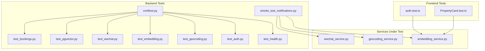

**Diagram sources**
- [backend/tests/conftest.py:1-111](file://backend/tests/conftest.py#L1-L111)
- [backend/tests/test_health.py:1-11](file://backend/tests/test_health.py#L1-L11)
- [backend/tests/test_auth.py:1-92](file://backend/tests/test_auth.py#L1-L92)
- [backend/tests/test_geocoding.py:1-98](file://backend/tests/test_geocoding.py#L1-L98)
- [backend/tests/test_embedding.py:1-61](file://backend/tests/test_embedding.py#L1-L61)
- [backend/tests/test_wechat.py:1-183](file://backend/tests/test_wechat.py#L1-L183)
- [backend/tests/test_pgvector.py:1-163](file://backend/tests/test_pgvector.py#L1-L163)
- [backend/tests/test_bookings.py:1-264](file://backend/tests/test_bookings.py#L1-L264)
- [backend/tests/smoke_test_notifications.py:1-180](file://backend/tests/smoke_test_notifications.py#L1-L180)
- [frontend/src/__tests__/stores/auth.test.ts:1-86](file://frontend/src/__tests__/stores/auth.test.ts#L1-L86)
- [frontend/src/__tests__/PropertyCard.test.ts:1-80](file://frontend/src/__tests__/PropertyCard.test.ts#L1-L80)
- [backend/app/services/embedding_service.py:1-32](file://backend/app/services/embedding_service.py#L1-L32)
- [backend/app/services/geocoding_service.py:1-145](file://backend/app/services/geocoding_service.py#L1-L145)
- [backend/app/services/wechat_service.py:1-146](file://backend/app/services/wechat_service.py#L1-L146)

**Section sources**
- [backend/tests/conftest.py:1-111](file://backend/tests/conftest.py#L1-L111)
- [backend/pytest.ini:1-5](file://backend/pytest.ini#L1-L5)

## Core Components
- Test configuration and fixtures:
  - In-memory SQLite engine and session factory override for fast isolation
  - HTTP client fixture using ASGITransport against the FastAPI app
  - Shared payloads for users and properties
  - Pytest markers and flags for optional real-database tests
- Health and smoke tests:
  - Health endpoint verification
  - Notification pipeline smoke tests covering SMS/email skip logic, channel metadata, Celery task registration, and config fields
- External service integration tests:
  - OpenAI embeddings mocked via patching AsyncOpenAI
  - AMap geocoding mocked via patching httpx.AsyncClient.get/post
  - WeChat login and template messaging mocked via patching httpx calls
- Database integration tests:
  - Real PostgreSQL connection when pgvector marker is enabled
  - Search by natural language and structured filters
  - POI generation and retrieval
  - Contract/payment endpoint existence checks
  - JWT refresh endpoint validation
  - Rate limiting sanity checks
- End-to-end workflow tests:
  - Full booking lifecycle including creation, duplicate prevention, approval/rejection, cancellation, and authorization enforcement
- Frontend tests:
  - Auth store state management and persistence
  - Property card rendering and UI behavior

**Section sources**
- [backend/tests/conftest.py:1-111](file://backend/tests/conftest.py#L1-L111)
- [backend/tests/test_health.py:1-11](file://backend/tests/test_health.py#L1-L11)
- [backend/tests/smoke_test_notifications.py:1-180](file://backend/tests/smoke_test_notifications.py#L1-L180)
- [backend/tests/test_geocoding.py:1-98](file://backend/tests/test_geocoding.py#L1-L98)
- [backend/tests/test_embedding.py:1-61](file://backend/tests/test_embedding.py#L1-L61)
- [backend/tests/test_wechat.py:1-183](file://backend/tests/test_wechat.py#L1-L183)
- [backend/tests/test_pgvector.py:1-163](file://backend/tests/test_pgvector.py#L1-L163)
- [backend/tests/test_bookings.py:1-264](file://backend/tests/test_bookings.py#L1-L264)
- [frontend/src/__tests__/stores/auth.test.ts:1-86](file://frontend/src/__tests__/stores/auth.test.ts#L1-L86)
- [frontend/src/__tests__/PropertyCard.test.ts:1-80](file://frontend/src/__tests__/PropertyCard.test.ts#L1-L80)

## Architecture Overview
The testing architecture isolates external dependencies through mocking or skips them gracefully when not configured. For features requiring a real database, optional markers enable execution against PostgreSQL with pgvector.

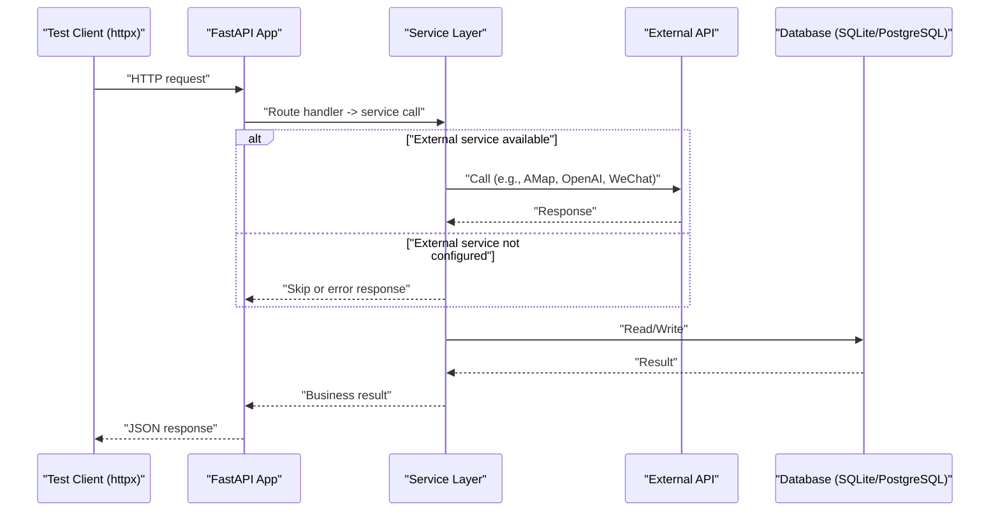

[No sources needed since this diagram shows conceptual workflow, not actual code structure]

## Detailed Component Analysis

### External Service Integration Testing

#### OpenAI Embeddings
- Strategy:
  - Patch AsyncOpenAI to return deterministic vectors and validate dimensionality and text composition logic.
  - Validate helper function that builds searchable text from property fields.
- Key assertions:
  - Vector length equals expected embedding dimension.
  - Text builder includes required fields and ignores None values.

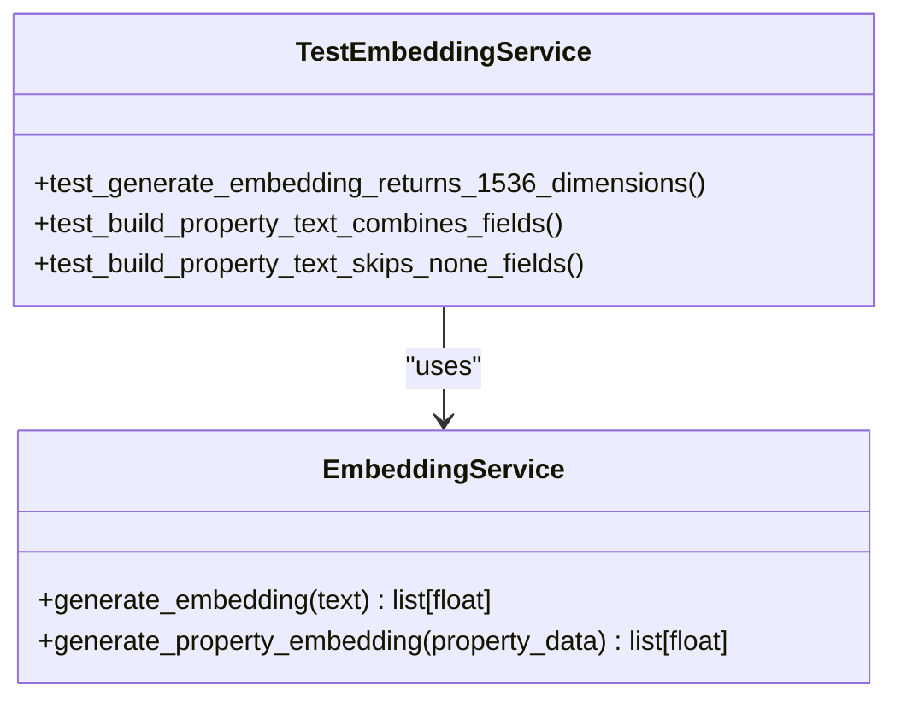

**Diagram sources**
- [backend/app/services/embedding_service.py:1-32](file://backend/app/services/embedding_service.py#L1-L32)
- [backend/tests/test_embedding.py:1-61](file://backend/tests/test_embedding.py#L1-L61)

**Section sources**
- [backend/tests/test_embedding.py:1-61](file://backend/tests/test_embedding.py#L1-L61)
- [backend/app/services/embedding_service.py:1-32](file://backend/app/services/embedding_service.py#L1-L32)

#### AMap Geocoding
- Strategy:
  - Mock httpx.AsyncClient.get responses to simulate successful and failing geocode results.
  - Assert service returns correct coordinates and formatted address; assert API returns 503 when key is missing.
- Key assertions:
  - Successful geocode yields latitude/longitude and formatted address.
  - Missing API key leads to appropriate error status.

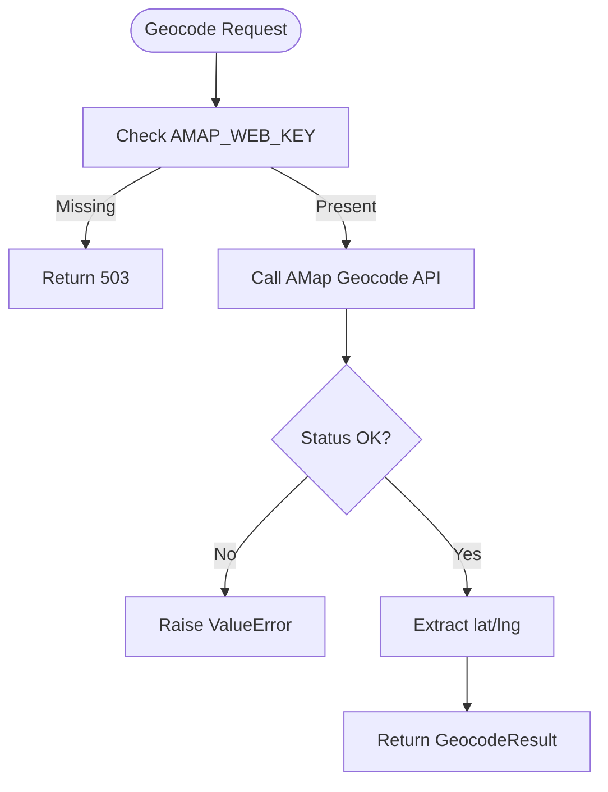

**Diagram sources**
- [backend/app/services/geocoding_service.py:1-145](file://backend/app/services/geocoding_service.py#L1-L145)
- [backend/tests/test_geocoding.py:1-98](file://backend/tests/test_geocoding.py#L1-L98)

**Section sources**
- [backend/tests/test_geocoding.py:1-98](file://backend/tests/test_geocoding.py#L1-L98)
- [backend/app/services/geocoding_service.py:1-145](file://backend/app/services/geocoding_service.py#L1-L145)

#### WeChat Mini Program Authentication
- Strategy:
  - Mock jscode2session, access token retrieval, and template message sending via httpx patches.
  - Verify new vs existing user flows and invalid code handling at both service and API layers.
- Key assertions:
  - New user login creates user and returns token with is_new_user flag.
  - Existing user login returns existing user data.
  - Invalid code returns 400.

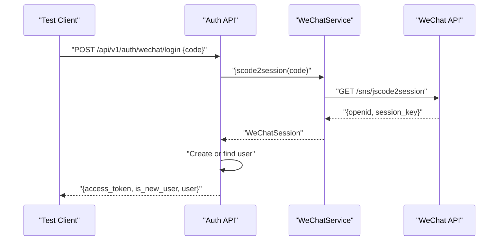

**Diagram sources**
- [backend/app/services/wechat_service.py:1-146](file://backend/app/services/wechat_service.py#L1-L146)
- [backend/tests/test_wechat.py:1-183](file://backend/tests/test_wechat.py#L1-L183)

**Section sources**
- [backend/tests/test_wechat.py:1-183](file://backend/tests/test_wechat.py#L1-L183)
- [backend/app/services/wechat_service.py:1-146](file://backend/app/services/wechat_service.py#L1-L146)

#### Email and SMS Services
- Strategy:
  - Smoke tests verify graceful skipping when credentials are absent or recipients are empty.
  - Ensure settings include all required fields for providers.
- Key assertions:
  - SMS/email send returns skipped status with reason when not configured or missing recipient.
  - Channel metadata completeness for notification types.
  - Celery tasks registered for notifications.

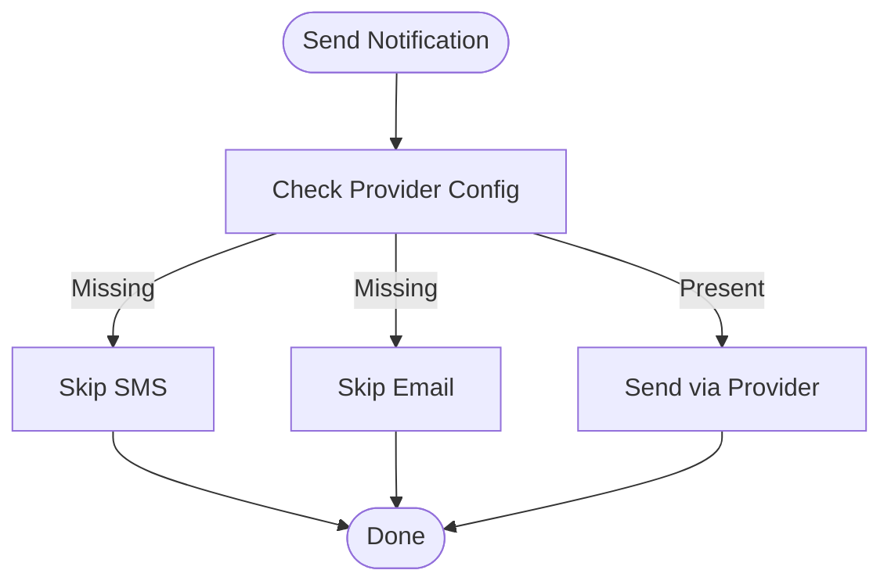

**Diagram sources**
- [backend/tests/smoke_test_notifications.py:1-180](file://backend/tests/smoke_test_notifications.py#L1-L180)

**Section sources**
- [backend/tests/smoke_test_notifications.py:1-180](file://backend/tests/smoke_test_notifications.py#L1-L180)

### End-to-End User Workflows

#### Booking Lifecycle
- Strategy:
  - Register landlord and tenant, create property, submit booking, enforce duplicate pending bookings, approve/reject/cancel, and ensure unauthenticated requests are rejected.
- Key assertions:
  - Creation returns 201 with correct fields and default status.
  - Duplicate pending booking returns 409.
  - Landlord can update status; tenant can cancel own booking.
  - Unauthenticated booking attempts return 401.

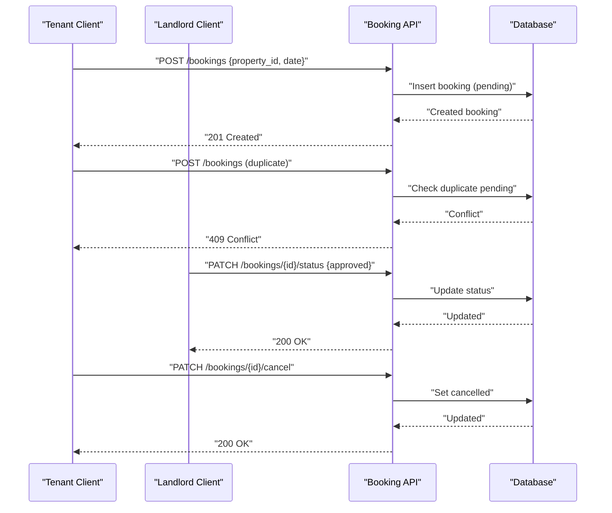

**Diagram sources**
- [backend/tests/test_bookings.py:1-264](file://backend/tests/test_bookings.py#L1-L264)

**Section sources**
- [backend/tests/test_bookings.py:1-264](file://backend/tests/test_bookings.py#L1-L264)

### Database Integration Testing

#### Real PostgreSQL with pgvector
- Strategy:
  - Use a dedicated fixture to connect to the real database URL and override dependency injection for sessions.
  - Run semantic search queries and structured filters; verify deposit/service fee fields exist on properties.
  - Generate and retrieve POIs; check contract/payment endpoints; validate JWT refresh endpoint; confirm health endpoint is not rate limited.
- Execution control:
  - Tests are marked with pgvector and skipped unless --run-pgvector is provided.

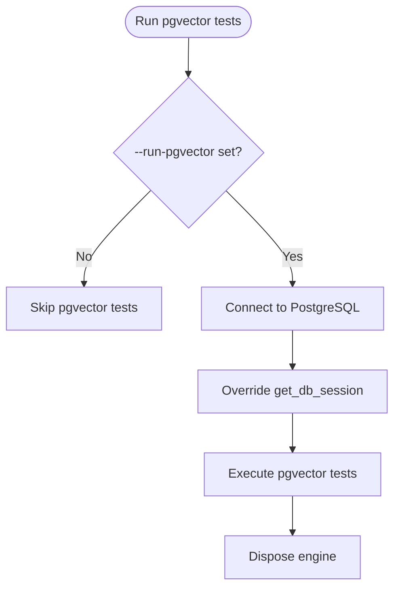

**Diagram sources**
- [backend/tests/test_pgvector.py:1-163](file://backend/tests/test_pgvector.py#L1-L163)
- [backend/tests/conftest.py:87-111](file://backend/tests/conftest.py#L87-L111)
- [backend/pytest.ini:1-5](file://backend/pytest.ini#L1-L5)

**Section sources**
- [backend/tests/test_pgvector.py:1-163](file://backend/tests/test_pgvector.py#L1-L163)
- [backend/tests/conftest.py:87-111](file://backend/tests/conftest.py#L87-L111)
- [backend/pytest.ini:1-5](file://backend/pytest.ini#L1-L5)

### Background Task Processing with Celery

- Strategy:
  - Eager mode ensures tasks execute synchronously during tests without Redis.
  - Smoke tests verify Celery task registration for notifications and mapping between booking statuses and notification types.
- Key assertions:
  - All expected task names are present in celery_app.tasks.
  - Notification channel metadata covers required types.
  - Settings include all SMS and email fields.

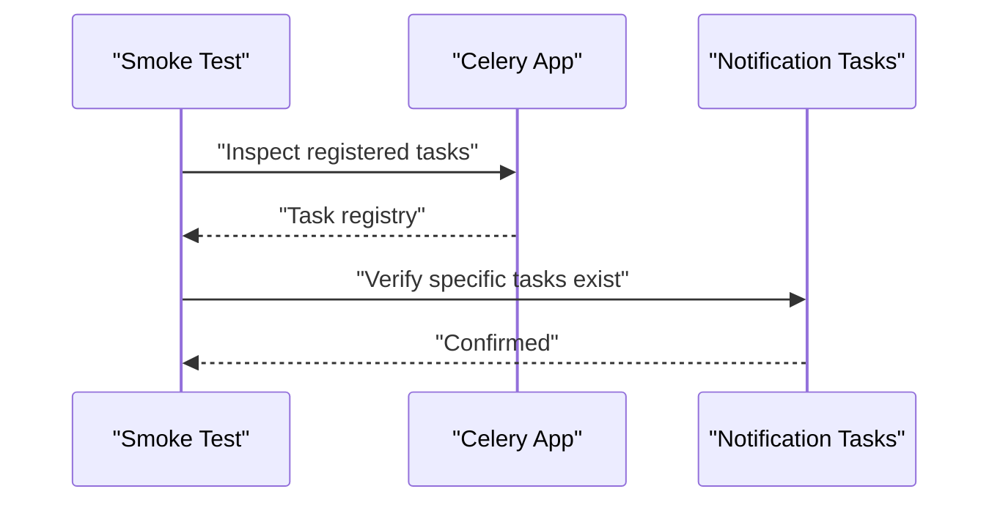

**Diagram sources**
- [backend/tests/smoke_test_notifications.py:91-108](file://backend/tests/smoke_test_notifications.py#L91-L108)
- [backend/tests/conftest.py:5-8](file://backend/tests/conftest.py#L5-L8)

**Section sources**
- [backend/tests/smoke_test_notifications.py:91-108](file://backend/tests/smoke_test_notifications.py#L91-L108)
- [backend/tests/conftest.py:5-8](file://backend/tests/conftest.py#L5-L8)

### Smoke Testing for Health and Monitoring

- Strategy:
  - Directly call the health endpoint and assert status and payload.
- Key assertions:
  - Status code 200 and JSON body indicates ok.

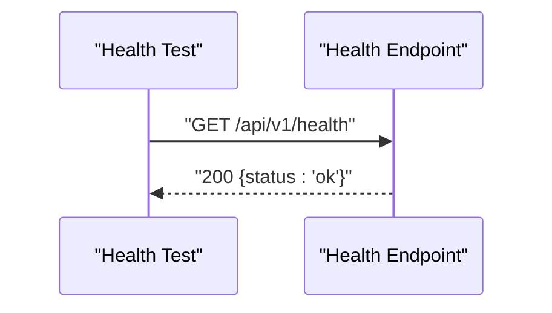

**Diagram sources**
- [backend/tests/test_health.py:1-11](file://backend/tests/test_health.py#L1-L11)

**Section sources**
- [backend/tests/test_health.py:1-11](file://backend/tests/test_health.py#L1-L11)

### Multi-Platform Integrations

#### Web Frontend
- Strategy:
  - Unit tests for Pinia auth store: initialization, localStorage persistence, logout, role helpers, corrupt storage handling, and state updates.
  - Component tests for PropertyCard: title, price, district tag, room counts, image placeholder, similarity display toggles, area rendering.
- Key assertions:
  - Store reflects correct logged-in state and persists tokens/user.
  - Component renders expected content based on props.

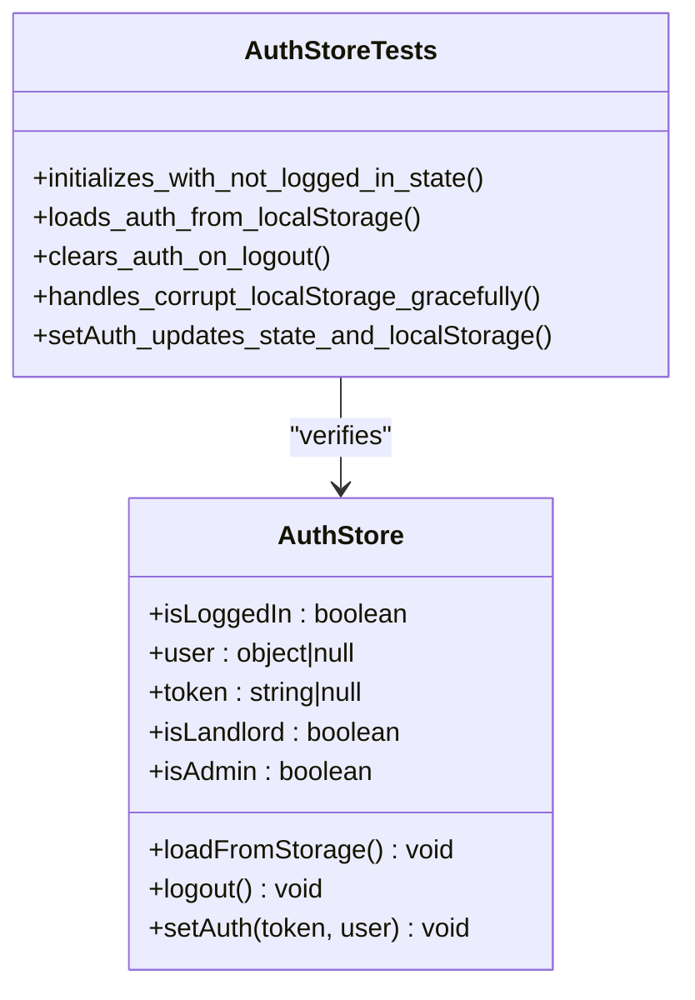

**Diagram sources**
- [frontend/src/__tests__/stores/auth.test.ts:1-86](file://frontend/src/__tests__/stores/auth.test.ts#L1-L86)

**Section sources**
- [frontend/src/__tests__/stores/auth.test.ts:1-86](file://frontend/src/__tests__/stores/auth.test.ts#L1-L86)
- [frontend/src/__tests__/PropertyCard.test.ts:1-80](file://frontend/src/__tests__/PropertyCard.test.ts#L1-L80)

#### Mobile Mini Program
- Strategy:
  - Backend-side tests cover WeChat login flow and template messages, which are consumed by the mini program.
  - The mini program relies on backend endpoints validated by these tests.
- Key assertions:
  - Login returns tokens and user info; invalid codes return errors.
  - Template message sending uses cached access token and returns success.

**Section sources**
- [backend/tests/test_wechat.py:1-183](file://backend/tests/test_wechat.py#L1-L183)
- [backend/app/services/wechat_service.py:1-146](file://backend/app/services/wechat_service.py#L1-L146)

### Concurrent Operations, Race Conditions, and Distributed Behaviors

- Concurrency and race conditions:
  - Duplicate pending booking prevention is enforced at the API/service layer and verified by sequential requests within tests.
  - Rate limiting middleware is checked to ensure health endpoint remains accessible under repeated calls.
- Distributed behaviors:
  - Celery eager mode simulates synchronous task execution for reliable testing without external brokers.
  - Graceful skip behavior for email/SMS when not configured avoids flaky failures in CI.

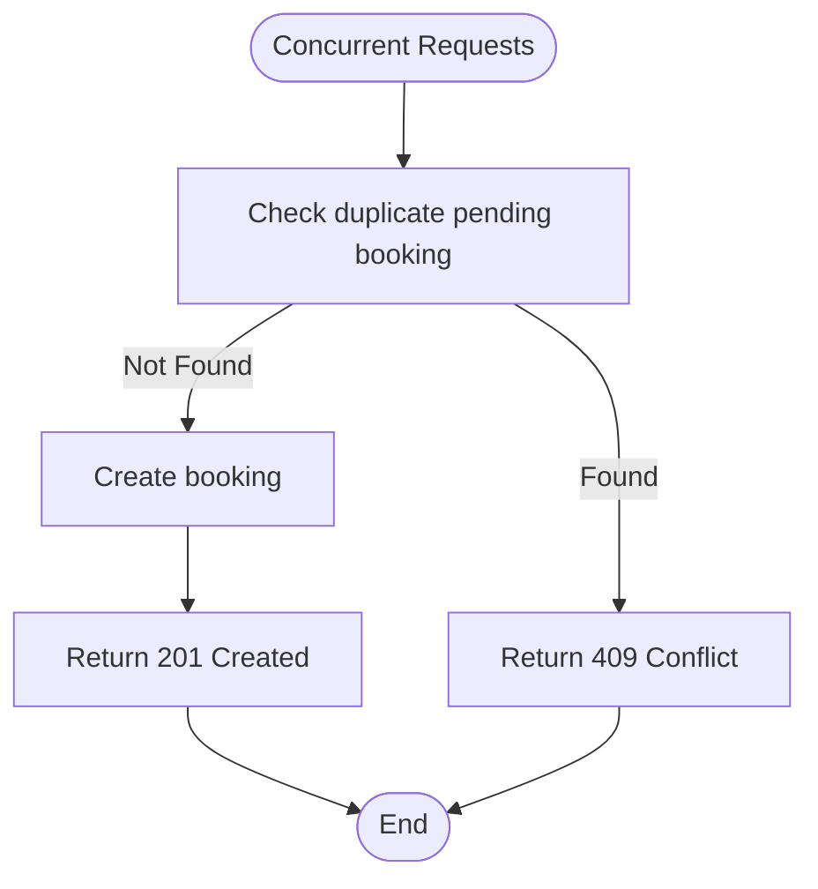

**Diagram sources**
- [backend/tests/test_bookings.py:68-118](file://backend/tests/test_bookings.py#L68-L118)
- [backend/tests/test_pgvector.py:154-163](file://backend/tests/test_pgvector.py#L154-L163)
- [backend/tests/conftest.py:5-8](file://backend/tests/conftest.py#L5-L8)

**Section sources**
- [backend/tests/test_bookings.py:68-118](file://backend/tests/test_bookings.py#L68-L118)
- [backend/tests/test_pgvector.py:154-163](file://backend/tests/test_pgvector.py#L154-L163)
- [backend/tests/conftest.py:5-8](file://backend/tests/conftest.py#L5-L8)

## Dependency Analysis
- Test configuration depends on:
  - SQLAlchemy async engine/session for in-memory SQLite
  - httpx AsyncClient with ASGITransport to invoke routes
  - Environment overrides to disable external calls and enable eager Celery
- Optional real-database tests depend on:
  - PostgreSQL with pgvector extension
  - Pytest markers and command-line flags to selectively run tests
- Frontend tests depend on:
  - Vitest and Vue Test Utils
  - Local mocks for router and services

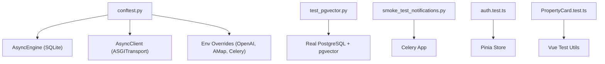

**Diagram sources**
- [backend/tests/conftest.py:1-111](file://backend/tests/conftest.py#L1-L111)
- [backend/tests/test_pgvector.py:1-163](file://backend/tests/test_pgvector.py#L1-L163)
- [backend/tests/smoke_test_notifications.py:1-180](file://backend/tests/smoke_test_notifications.py#L1-L180)
- [frontend/src/__tests__/stores/auth.test.ts:1-86](file://frontend/src/__tests__/stores/auth.test.ts#L1-L86)
- [frontend/src/__tests__/PropertyCard.test.ts:1-80](file://frontend/src/__tests__/PropertyCard.test.ts#L1-L80)

**Section sources**
- [backend/tests/conftest.py:1-111](file://backend/tests/conftest.py#L1-L111)
- [backend/pytest.ini:1-5](file://backend/pytest.ini#L1-L5)

## Performance Considerations
- Prefer in-memory SQLite for speed and isolation in most tests.
- Use mocking for external APIs to avoid network latency and flakiness.
- Enable pgvector tests only when necessary to reduce CI time.
- Keep smoke tests lightweight and focused on critical paths.

[No sources needed since this section provides general guidance]

## Troubleshooting Guide
- External service not configured:
  - SMS/email skip gracefully; ensure provider keys are set for integration runs.
- Geocoding failures:
  - Missing API key returns 503; invalid responses raise ValueError; verify key and timeout settings.
- WeChat login issues:
  - Invalid code returns 400; ensure appid/secret are correctly set in settings.
- Database connectivity:
  - For pgvector tests, ensure PostgreSQL is running and pgvector extension is enabled; use --run-pgvector flag.
- Celery tasks:
  - Confirm eager mode is enabled in tests; verify task registration in smoke tests.

**Section sources**
- [backend/tests/smoke_test_notifications.py:12-66](file://backend/tests/smoke_test_notifications.py#L12-L66)
- [backend/tests/test_geocoding.py:88-98](file://backend/tests/test_geocoding.py#L88-L98)
- [backend/tests/test_wechat.py:160-174](file://backend/tests/test_wechat.py#L160-L174)
- [backend/tests/test_pgvector.py:1-33](file://backend/tests/test_pgvector.py#L1-L33)
- [backend/tests/conftest.py:5-8](file://backend/tests/conftest.py#L5-L8)

## Conclusion
The testing strategy combines fast isolated unit/integration tests with selective real-database and smoke tests to validate critical paths. External services are mocked or skipped gracefully, while end-to-end flows like booking lifecycle and multi-platform integrations are thoroughly covered. Optional pgvector tests provide confidence in semantic search and related features when executed against a real PostgreSQL instance.

[No sources needed since this section summarizes without analyzing specific files]