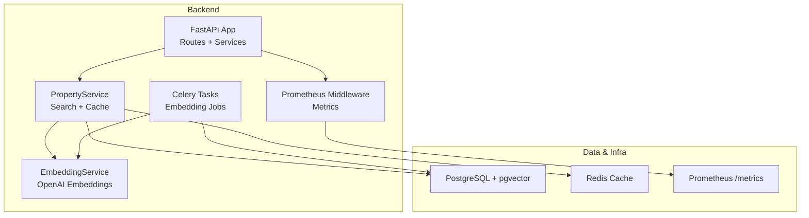
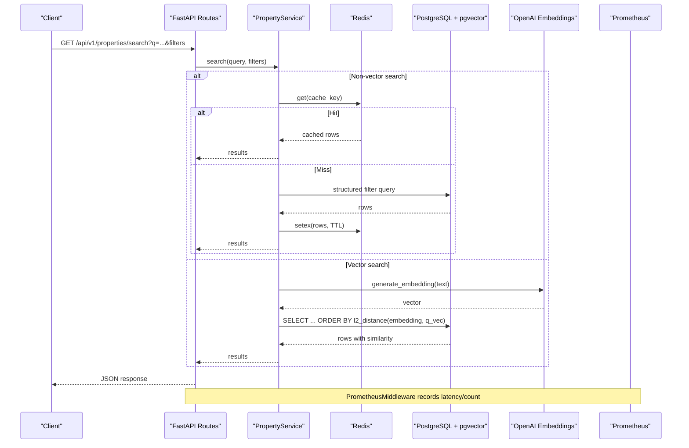
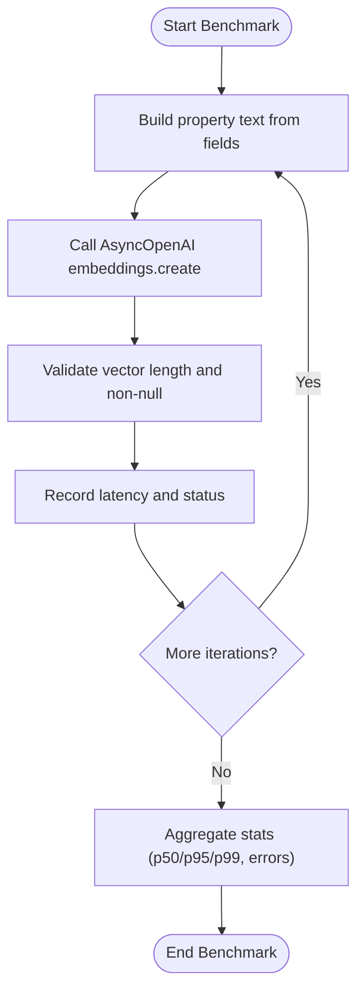
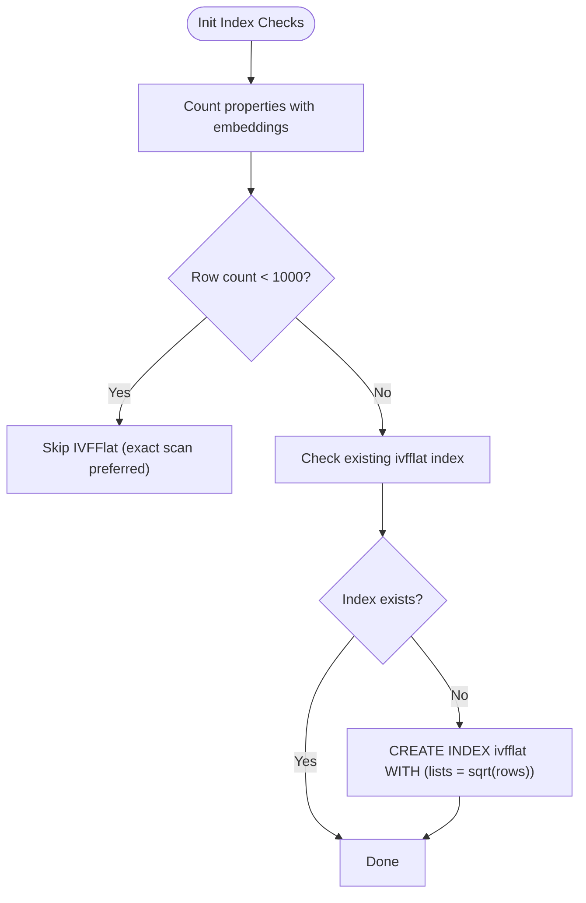
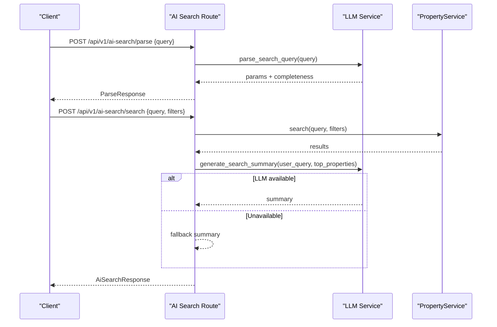
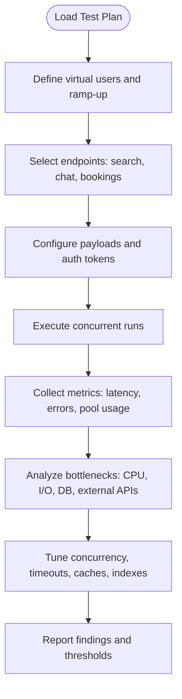
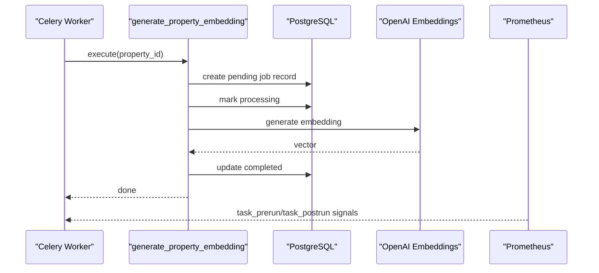
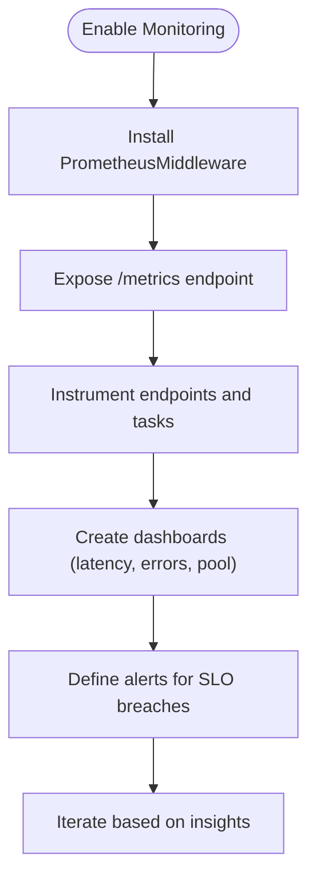
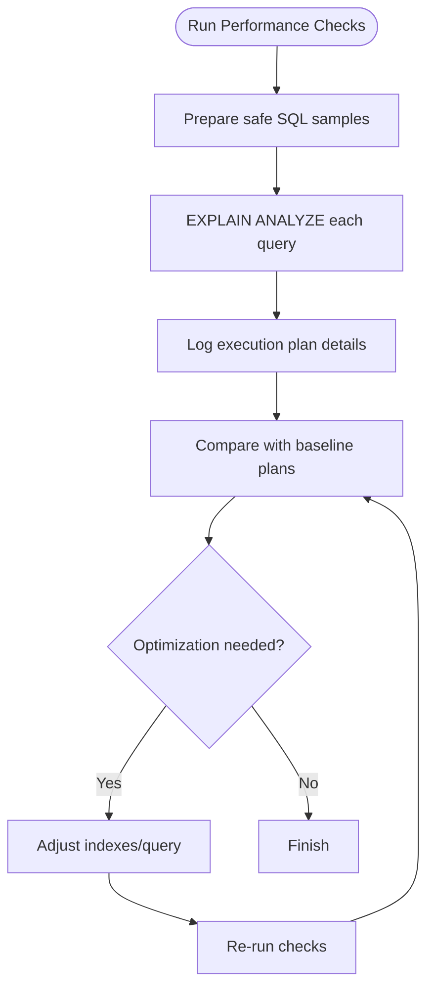
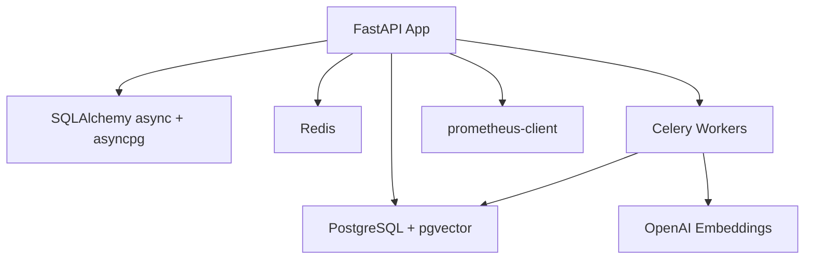

# Performance & Load Testing

<cite>
**Referenced Files in This Document**
- [embedding_service.py](file://backend/app/services/embedding_service.py)
- [ai_search.py](file://backend/app/api/v1/routes/ai_search.py)
- [property_service.py](file://backend/app/services/property_service.py)
- [indexes.py](file://backend/app/db/indexes.py)
- [session.py](file://backend/app/db/session.py)
- [monitoring.py](file://backend/app/core/monitoring.py)
- [config.py](file://backend/app/core/config.py)
- [embedding_tasks.py](file://backend/app/tasks/embedding_tasks.py)
- [properties.py](file://backend/app/api/v1/routes/properties.py)
- [test_pgvector.py](file://backend/tests/test_pgvector.py)
- [test_embedding.py](file://backend/tests/test_embedding.py)
- [test_search.py](file://backend/tests/test_search.py)
- [docker-compose.yml](file://docker-compose.yml)
- [requirements.txt](file://backend/requirements.txt)
</cite>

## Table of Contents
1. Introduction
2. Project Structure
3. Core Components
4. Architecture Overview
5. Detailed Component Analysis
6. Dependency Analysis
7. Performance Considerations
8. Troubleshooting Guide
9. Conclusion

## Introduction
This document defines performance and load testing strategies for the Rental Housing Structure project, focusing on:
- AI embedding generation benchmarking
- Vector similarity search performance with pgvector
- Natural language processing operations (query parsing and summary generation)
- High-concurrency scenarios for property search, chat interactions, and booking operations
- Stress testing for background task queues, database connection pooling, and memory usage
- Profiling techniques for Python services, database query optimization validation, and API response time monitoring
- pgvector index tuning and large dataset handling
- Monitoring integration for metrics collection, bottleneck identification, and capacity planning
- Caching effectiveness, CDN performance, and frontend loading optimization under various network conditions

## Project Structure
The backend is a FastAPI application using SQLAlchemy async, Celery for background tasks, Redis for caching, and PostgreSQL with pgvector for vector similarity search. Prometheus metrics are integrated via middleware. The development environment provisions Postgres and Redis via Docker Compose.

**Diagram sources**
- [ai_search.py:1-160](file://backend/app/api/v1/routes/ai_search.py#L1-L160)
- [property_service.py:1-239](file://backend/app/services/property_service.py#L1-L239)
- [embedding_service.py:1-32](file://backend/app/services/embedding_service.py#L1-L32)
- [embedding_tasks.py:1-112](file://backend/app/tasks/embedding_tasks.py#L1-L112)
- [monitoring.py:1-227](file://backend/app/core/monitoring.py#L1-L227)
- [indexes.py:1-118](file://backend/app/db/indexes.py#L1-L118)
- [docker-compose.yml:1-53](file://docker-compose.yml#L1-L53)

**Section sources**
- [docker-compose.yml:9-47](file://docker-compose.yml#L9-L47)
- [requirements.txt:1-23](file://backend/requirements.txt#L1-L23)

## Core Components
- Property search pipeline: REST endpoint -> PropertyService.search -> optional Redis cache -> SQL query with pgvector distance or structured filters -> result serialization.
- AI search pipeline: Parse natural language to structured parameters -> unified search -> top results -> LLM summary generation.
- Embedding generation: Async OpenAI client used by both service layer and Celery tasks; embeddings stored in pgvector column.
- Indexing utilities: IVFFlat index creation for embeddings and composite indexes for bookings.
- Monitoring: Prometheus middleware collects request counts, latency, in-flight requests; Celery signals track task metrics; DB pool gauges exposed.

Key implementation references:
- Search endpoints and routing: [properties.py:36-91](file://backend/app/api/v1/routes/properties.py#L36-L91), [ai_search.py:80-160](file://backend/app/api/v1/routes/ai_search.py#L80-L160)
- Search logic and caching: [property_service.py:91-195](file://backend/app/services/property_service.py#L91-L195)
- Embedding generation: [embedding_service.py:17-32](file://backend/app/services/embedding_service.py#L17-L32)
- Background embedding jobs: [embedding_tasks.py:16-80](file://backend/app/tasks/embedding_tasks.py#L16-L80)
- Index management: [indexes.py:16-88](file://backend/app/db/indexes.py#L16-L88)
- Metrics and monitoring: [monitoring.py:74-176](file://backend/app/core/monitoring.py#L74-L176)

**Section sources**
- [properties.py:36-91](file://backend/app/api/v1/routes/properties.py#L36-L91)
- [ai_search.py:80-160](file://backend/app/api/v1/routes/ai_search.py#L80-L160)
- [property_service.py:91-195](file://backend/app/services/property_service.py#L91-L195)
- [embedding_service.py:17-32](file://backend/app/services/embedding_service.py#L17-L32)
- [embedding_tasks.py:16-80](file://backend/app/tasks/embedding_tasks.py#L16-L80)
- [indexes.py:16-88](file://backend/app/db/indexes.py#L16-L88)
- [monitoring.py:74-176](file://backend/app/core/monitoring.py#L74-L176)

## Architecture Overview
End-to-end flows for key performance-sensitive operations:

**Diagram sources**
- [properties.py:36-91](file://backend/app/api/v1/routes/properties.py#L36-L91)
- [property_service.py:91-195](file://backend/app/services/property_service.py#L91-L195)
- [embedding_service.py:17-32](file://backend/app/services/embedding_service.py#L17-L32)
- [monitoring.py:126-176](file://backend/app/core/monitoring.py#L126-L176)

## Detailed Component Analysis

### AI Embedding Generation Benchmarking
Objectives:
- Measure latency and throughput of embedding calls per text payload.
- Validate dimensionality and consistency of returned vectors.
- Assess impact of model selection and input size.

Strategy:
- Use unit tests to assert output shape and content composition.
- Create synthetic payloads mimicking real property texts.
- Run repeated calls to compute p50/p95/p99 latency and error rates.
- Compare different models via configuration.

References:
- Embedding service and text assembly: [embedding_service.py:1-32](file://backend/app/services/embedding_service.py#L1-L32)
- Unit test coverage for dimensions and text building: [test_embedding.py:1-61](file://backend/tests/test_embedding.py#L1-L61)

**Diagram sources**
- [embedding_service.py:17-32](file://backend/app/services/embedding_service.py#L17-L32)
- [test_embedding.py:1-61](file://backend/tests/test_embedding.py#L1-L61)

**Section sources**
- [embedding_service.py:17-32](file://backend/app/services/embedding_service.py#L17-L32)
- [test_embedding.py:1-61](file://backend/tests/test_embedding.py#L1-L61)

### Vector Similarity Search Performance (pgvector)
Objectives:
- Ensure fast ANN queries with IVFFlat index tuned to dataset size.
- Validate exact scan fallback for small datasets.
- Confirm composite indexes improve common filtering patterns.

Strategy:
- Use provided index utilities to create/maintain indexes.
- Run EXPLAIN ANALYZE on representative queries.
- Compare recall vs latency across lists values.
- Test combined semantic + structured filters.

References:
- Index creation and adaptive lists parameter: [indexes.py:16-48](file://backend/app/db/indexes.py#L16-L48)
- Composite indexes for bookings: [indexes.py:51-82](file://backend/app/db/indexes.py#L51-L82)
- Query performance checks: [indexes.py:91-118](file://backend/app/db/indexes.py#L91-L118)
- Search implementation with l2_distance: [property_service.py:135-168](file://backend/app/services/property_service.py#L135-L168)

**Diagram sources**
- [indexes.py:16-48](file://backend/app/db/indexes.py#L16-L48)

**Section sources**
- [indexes.py:16-118](file://backend/app/db/indexes.py#L16-L118)
- [property_service.py:135-168](file://backend/app/services/property_service.py#L135-L168)

### Natural Language Processing Operations
Objectives:
- Measure parse latency and accuracy of structured parameter extraction.
- Evaluate summary generation latency and quality under load.
- Validate graceful degradation when LLMs are unavailable.

Strategy:
- Load-test /parse and /search endpoints with varied query complexity.
- Track LLM call success rate and fallback behavior.
- Monitor total request latency breakdown (parse, search, summarize).

References:
- Parse endpoint and error mapping: [ai_search.py:80-95](file://backend/app/api/v1/routes/ai_search.py#L80-L95)
- Unified search and summary generation: [ai_search.py:98-160](file://backend/app/api/v1/routes/ai_search.py#L98-L160)

**Diagram sources**
- [ai_search.py:80-160](file://backend/app/api/v1/routes/ai_search.py#L80-L160)

**Section sources**
- [ai_search.py:80-160](file://backend/app/api/v1/routes/ai_search.py#L80-L160)

### High-Concurrency Scenarios: Property Search, Chat, Bookings
Objectives:
- Validate sustained throughput and latency targets under concurrent load.
- Ensure correct behavior for read-heavy search and write-heavy bookings.
- Verify rate limiting and health endpoints remain responsive.

Strategy:
- Use HTTP clients to simulate concurrent users hitting search, chat, and booking endpoints.
- Apply realistic think times and payload sizes.
- Monitor server-side metrics and DB pool utilization.
- Include rate limit boundary cases and health checks.

References:
- Property search endpoint: [properties.py:36-91](file://backend/app/api/v1/routes/properties.py#L36-L91)
- Rate limiting config: [config.py:153-161](file://backend/app/core/config.py#L153-L161)
- Health endpoint tests: [test_pgvector.py:154-163](file://backend/tests/test_pgvector.py#L154-L163)

[No sources needed since this diagram shows conceptual workflow, not actual code structure]

**Section sources**
- [properties.py:36-91](file://backend/app/api/v1/routes/properties.py#L36-L91)
- [config.py:153-161](file://backend/app/core/config.py#L153-L161)
- [test_pgvector.py:154-163](file://backend/tests/test_pgvector.py#L154-L163)

### Stress Testing: Background Task Queues, DB Pooling, Memory
Objectives:
- Validate Celery task throughput and retry/backoff behavior.
- Ensure DB connection pool does not exhaust under burst loads.
- Monitor memory growth and GC behavior during long-running workloads.

Strategy:
- Enqueue bulk embedding jobs and monitor completion rates.
- Observe Celery task metrics (count, latency histograms).
- Track DB pool gauges (size, overflow, checked out).
- Profile Python process memory over time.

References:
- Celery embedding tasks and retries: [embedding_tasks.py:16-80](file://backend/app/tasks/embedding_tasks.py#L16-L80)
- Celery metrics installation: [monitoring.py:183-208](file://backend/app/core/monitoring.py#L183-L208)
- DB pool metrics polling: [monitoring.py:216-227](file://backend/app/core/monitoring.py#L216-L227)
- DB session engine setup: [session.py:1-14](file://backend/app/db/session.py#L1-L14)

**Diagram sources**
- [embedding_tasks.py:16-80](file://backend/app/tasks/embedding_tasks.py#L16-L80)
- [monitoring.py:183-208](file://backend/app/core/monitoring.py#L183-L208)

**Section sources**
- [embedding_tasks.py:16-112](file://backend/app/tasks/embedding_tasks.py#L16-L112)
- [monitoring.py:183-227](file://backend/app/core/monitoring.py#L183-L227)
- [session.py:1-14](file://backend/app/db/session.py#L1-L14)

### Profiling Techniques and API Response Time Monitoring
Objectives:
- Identify hotspots in Python code paths.
- Correlate API latency with DB and external service calls.
- Establish SLOs and alerting thresholds.

Strategy:
- Enable Prometheus middleware to collect per-endpoint latency histograms and counters.
- Use profiling tools (e.g., cProfile/py-spy) on critical routes.
- Integrate tracing around LLM calls and DB queries.
- Set up dashboards for p95/p99 latency and error rates.

References:
- Prometheus middleware and metrics endpoint: [monitoring.py:126-176](file://backend/app/core/monitoring.py#L126-L176)

**Diagram sources**
- [monitoring.py:126-176](file://backend/app/core/monitoring.py#L126-L176)

**Section sources**
- [monitoring.py:126-176](file://backend/app/core/monitoring.py#L126-L176)

### Database Query Optimization Validation
Objectives:
- Validate that indexes reduce execution time and cost.
- Ensure EXPLAIN ANALYZE plans use expected scans and joins.
- Periodically re-run performance checks after schema changes.

Strategy:
- Use provided performance check utilities to run EXPLAIN ANALYZE on common queries.
- Compare plans before/after index creation.
- Parameterize sample values carefully to avoid plan anomalies.

References:
- EXPLAIN ANALYZE helper and sample queries: [indexes.py:91-118](file://backend/app/db/indexes.py#L91-L118)

**Diagram sources**
- [indexes.py:91-118](file://backend/app/db/indexes.py#L91-L118)

**Section sources**
- [indexes.py:91-118](file://backend/app/db/indexes.py#L91-L118)

### pgvector Performance, Index Optimization, Large Dataset Handling
Objectives:
- Optimize IVFFlat lists parameter relative to row count.
- Validate recall/performance trade-offs at scale.
- Ensure fallback to exact scan for small datasets.

Strategy:
- Use index utility to auto-create IVFFlat index with lists ≈ sqrt(rows).
- For large datasets, experiment with multiple lists values and measure latency/recall.
- Monitor query plans to confirm index usage.

References:
- IVFFlat index creation and adaptive lists: [indexes.py:16-48](file://backend/app/db/indexes.py#L16-L48)

**Section sources**
- [indexes.py:16-48](file://backend/app/db/indexes.py#L16-L48)

### Monitoring Integration: Metrics Collection, Bottleneck Identification, Capacity Planning
Objectives:
- Centralize metrics for HTTP, Celery, and DB pools.
- Identify bottlenecks (CPU, I/O, external APIs).
- Plan capacity based on observed trends.

Strategy:
- Deploy Prometheus and scrape /metrics.
- Track request latency histograms, task durations, and pool gauges.
- Set alerts for high in-flight requests, pool overflow, and elevated error rates.

References:
- Metrics definitions and middleware: [monitoring.py:74-176](file://backend/app/core/monitoring.py#L74-L176)
- Celery signal handlers: [monitoring.py:183-208](file://backend/app/core/monitoring.py#L183-L208)
- DB pool metrics: [monitoring.py:216-227](file://backend/app/core/monitoring.py#L216-L227)

**Section sources**
- [monitoring.py:74-227](file://backend/app/core/monitoring.py#L74-L227)

### Caching Effectiveness, CDN Performance, Frontend Loading Optimization
Objectives:
- Measure Redis cache hit ratio and latency reduction for non-vector searches.
- Validate CDN caching for static assets and images.
- Optimize frontend bundle sizes and lazy-loading.

Strategy:
- Instrument cache hits/misses and compare response times.
- Configure appropriate TTLs and cache keys.
- Use browser dev tools and network throttling to assess performance under varying conditions.

References:
- Search caching logic and TTL: [property_service.py:22-41](file://backend/app/services/property_service.py#L22-L41), [property_service.py:102-133](file://backend/app/services/property_service.py#L102-L133), [property_service.py:170-194](file://backend/app/services/property_service.py#L170-L194)

**Section sources**
- [property_service.py:22-41](file://backend/app/services/property_service.py#L22-L41)
- [property_service.py:102-133](file://backend/app/services/property_service.py#L102-L133)
- [property_service.py:170-194](file://backend/app/services/property_service.py#L170-L194)

## Dependency Analysis
External dependencies relevant to performance:
- FastAPI, Uvicorn/Gunicorn for HTTP serving
- SQLAlchemy async with asyncpg driver
- Celery for background tasks
- pgvector for vector similarity
- OpenAI client for embeddings
- Redis for caching
- Prometheus client for metrics

**Diagram sources**
- [requirements.txt:1-23](file://backend/requirements.txt#L1-L23)
- [session.py:1-14](file://backend/app/db/session.py#L1-L14)
- [monitoring.py:23-67](file://backend/app/core/monitoring.py#L23-L67)

**Section sources**
- [requirements.txt:1-23](file://backend/requirements.txt#L1-L23)
- [session.py:1-14](file://backend/app/db/session.py#L1-L14)
- [monitoring.py:23-67](file://backend/app/core/monitoring.py#L23-L67)

## Performance Considerations
- Prefer non-vector search caching for deterministic filters to reduce DB load.
- Tune IVFFlat lists based on dataset size; validate plans with EXPLAIN ANALYZE.
- Limit page sizes and enforce upper bounds on limit parameters.
- Use async engines and connection pooling; monitor pool gauges.
- Implement retries/backoffs for external LLM calls; degrade gracefully.
- Keep Redis memory bounded and choose eviction policies suitable for workload.

[No sources needed since this section provides general guidance]

## Troubleshooting Guide
Common issues and diagnostics:
- Missing pgvector extension or indexes: verify initialization scripts and index creation routines.
- Slow vector searches: confirm IVFFlat index usage and lists parameter appropriateness.
- High DB pool exhaustion: inspect pool gauges and adjust pool size/timeout settings.
- LLM failures: ensure fallback summaries and proper error codes are returned.
- Cache misses or stale data: review TTLs and cache key determinism.

References:
- Index creation and performance checks: [indexes.py:16-118](file://backend/app/db/indexes.py#L16-L118)
- Prometheus metrics and DB pool gauges: [monitoring.py:105-176](file://backend/app/core/monitoring.py#L105-L176), [monitoring.py:216-227](file://backend/app/core/monitoring.py#L216-L227)
- Health endpoint availability: [test_pgvector.py:154-163](file://backend/tests/test_pgvector.py#L154-L163)

**Section sources**
- [indexes.py:16-118](file://backend/app/db/indexes.py#L16-L118)
- [monitoring.py:105-176](file://backend/app/core/monitoring.py#L105-L176)
- [monitoring.py:216-227](file://backend/app/core/monitoring.py#L216-L227)
- [test_pgvector.py:154-163](file://backend/tests/test_pgvector.py#L154-L163)

## Conclusion
By combining targeted benchmarks, load/stress tests, index tuning, and comprehensive monitoring, the project can maintain low-latency property search, reliable AI-powered features, and robust background processing under high concurrency. Continuous validation of query plans, cache effectiveness, and resource utilization ensures scalable performance as datasets grow.

[No sources needed since this section summarizes without analyzing specific files]