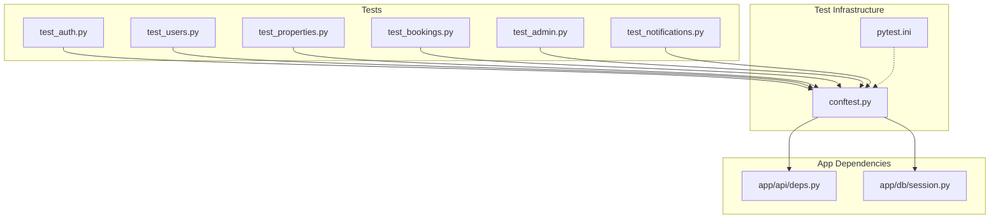
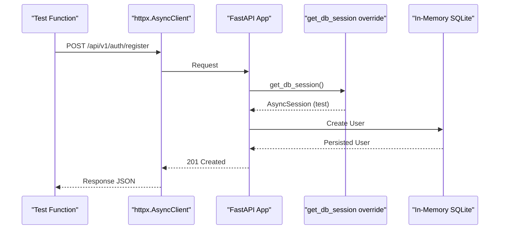
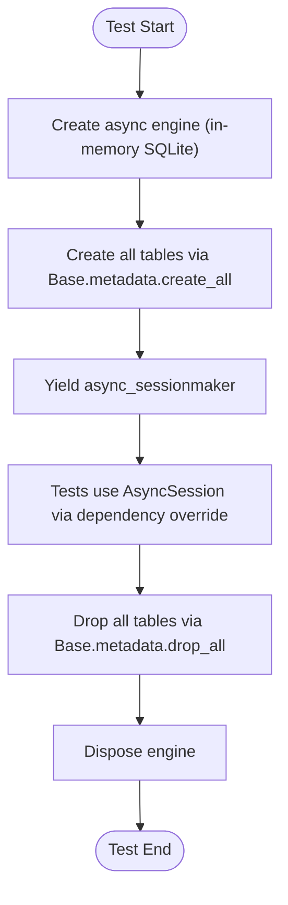
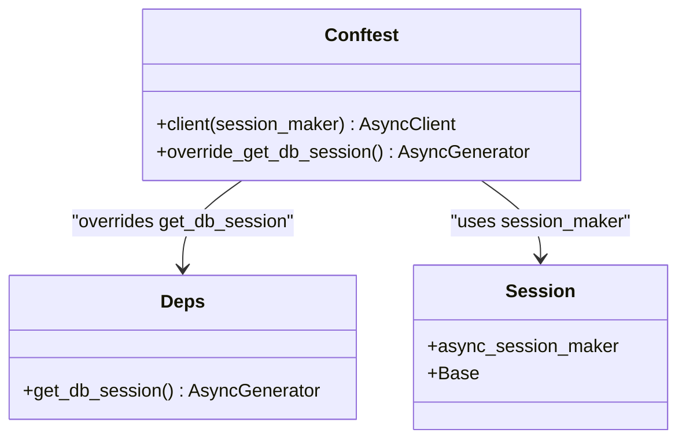
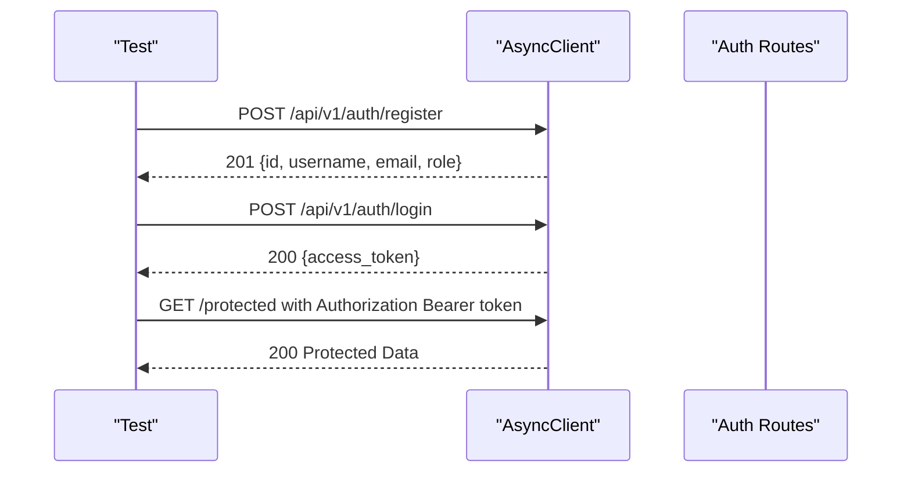
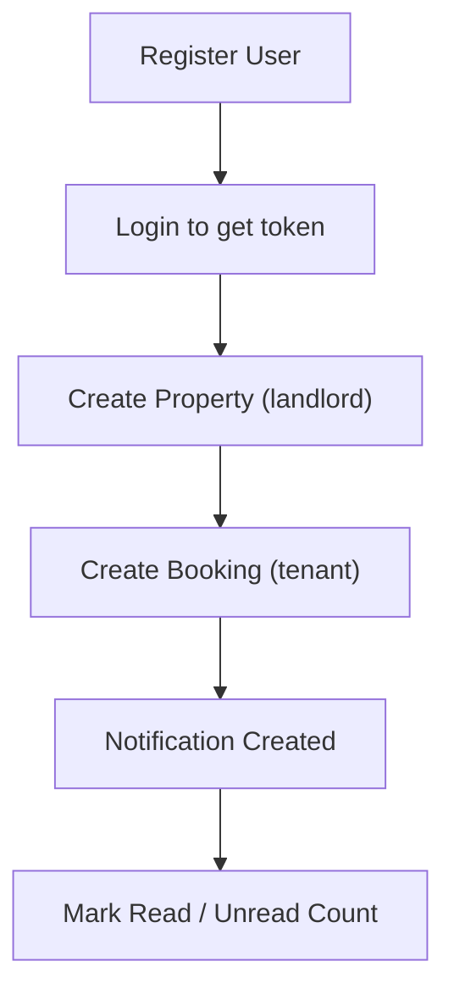
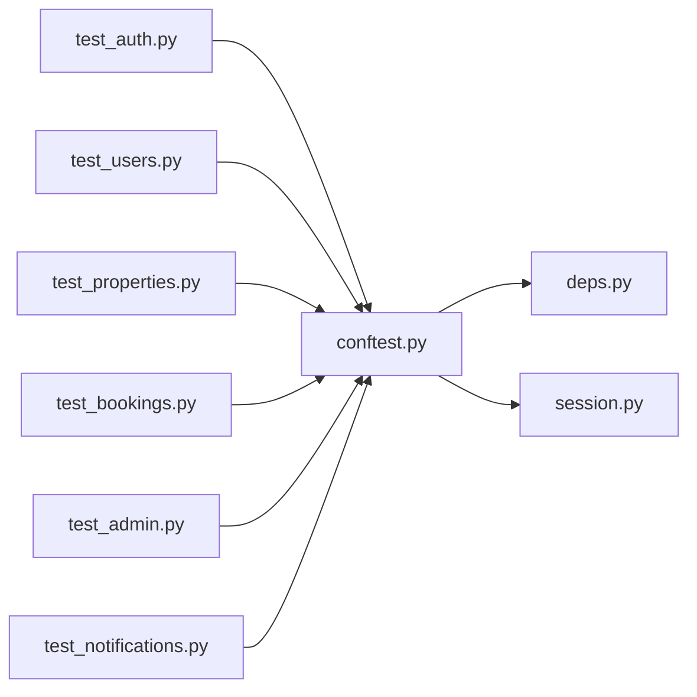

# Test Utilities & Fixtures

<cite>
**Referenced Files in This Document**
- [conftest.py](file://backend/tests/conftest.py)
- [pytest.ini](file://backend/pytest.ini)
- [deps.py](file://backend/app/api/deps.py)
- [session.py](file://backend/app/db/session.py)
- [test_auth.py](file://backend/tests/test_auth.py)
- [test_properties.py](file://backend/tests/test_properties.py)
- [test_bookings.py](file://backend/tests/test_bookings.py)
- [test_users.py](file://backend/tests/test_users.py)
- [test_admin.py](file://backend/tests/test_admin.py)
- [test_notifications.py](file://backend/tests/test_notifications.py)
</cite>

## Table of Contents
1. [Introduction](#introduction)
2. [Project Structure](#project-structure)
3. [Core Components](#core-components)
4. [Architecture Overview](#architecture-overview)
5. [Detailed Component Analysis](#detailed-component-analysis)
6. [Dependency Analysis](#dependency-analysis)
7. [Performance Considerations](#performance-considerations)
8. [Troubleshooting Guide](#troubleshooting-guide)
9. [Conclusion](#conclusion)

## Introduction
This document explains the test utilities, fixtures, and shared testing infrastructure for the backend of the Rental Housing Structure project. It focuses on:
- Global fixture configuration via conftest.py
- Database session management using an in-memory SQLite database with async SQLAlchemy
- Test client setup with dependency overrides to isolate tests from production services
- Fixture factories for creating realistic domain entities (users, properties, bookings)
- Authentication context helpers used across tests
- Permission testing strategies through role-based dependencies
- External service isolation and mock strategies
- Test data management, seeding patterns, and cleanup procedures
- Performance optimization techniques for slow tests and parallel execution
- Debugging utilities, logging configuration, and result analysis tips

## Project Structure
The testing layer is organized under backend/tests with a central conftest.py providing global fixtures and configuration. Tests are written as async functions using httpx.AsyncClient against FastAPI’s ASGI transport. The application’s dependency injection is overridden to use a test database session.

**Diagram sources**
- [conftest.py:1-111](file://backend/tests/conftest.py#L1-L111)
- [pytest.ini:1-5](file://backend/pytest.ini#L1-L5)
- [deps.py:1-58](file://backend/app/api/deps.py#L1-L58)
- [session.py:1-14](file://backend/app/db/session.py#L1-L14)

**Section sources**
- [conftest.py:1-111](file://backend/tests/conftest.py#L1-L111)
- [pytest.ini:1-5](file://backend/pytest.ini#L1-L5)

## Core Components
- Global environment isolation: external API keys and Celery settings are disabled by default to ensure tests run without external dependencies.
- Async database session factory: creates an in-memory SQLite engine, initializes tables, yields a session maker, and cleans up after tests.
- Test client: wraps the FastAPI app with ASGITransport and overrides get_db_session to inject the test session.
- Fixture payloads: landlord and property payloads provide consistent, realistic data for user and property creation flows.
- Custom markers and collection hooks: pgvector marker and --run-pgvector option allow selective execution of vector-dependent tests.

Key responsibilities:
- Isolation: each test runs against a fresh in-memory database and isolated HTTP client state.
- Determinism: fixtures provide stable inputs; cleanup ensures no cross-test contamination.
- Extensibility: new fixtures can be added in conftest.py and reused across modules.

**Section sources**
- [conftest.py:1-111](file://backend/tests/conftest.py#L1-L111)

## Architecture Overview
The test architecture leverages FastAPI’s dependency injection to swap out the production database session with a test session. The httpx.AsyncClient sends requests directly to the ASGI app, bypassing network overhead.

**Diagram sources**
- [conftest.py:37-49](file://backend/tests/conftest.py#L37-L49)
- [deps.py:14-16](file://backend/app/api/deps.py#L14-L16)
- [session.py:8-9](file://backend/app/db/session.py#L8-L9)

## Detailed Component Analysis

### Global Fixtures and Configuration (conftest.py)
- Environment isolation: sets empty API keys and enables eager Celery tasks to avoid background workers.
- Database lifecycle:
  - Creates an async engine pointing to an in-memory SQLite database.
  - Initializes all models via Base.metadata.create_all before yielding sessions.
  - Drops tables and disposes the engine after tests complete.
- Test client:
  - Overrides get_db_session to return a session from the test session maker.
  - Uses ASGITransport to call endpoints without starting a server process.
- Payload fixtures:
  - landlord_payload: minimal user attributes for admin-created users.
  - landlord_register_payload: full registration payload including password and role.
  - property_payload: realistic listing fields for property creation.
- Custom markers:
  - Adds pgvector marker and --run-pgvector CLI option.
  - Skips pgvector tests unless explicitly enabled.

Usage examples across tests:
- Authentication flows register and login using landlord_register_payload.
- Property creation uses property_payload combined with a landlord_id obtained from registration.
- Booking flows create tenants and landlords, then exercise booking lifecycle.

**Section sources**
- [conftest.py:1-111](file://backend/tests/conftest.py#L1-L111)

### Database Session Management
- Production session provider:
  - get_db_session yields an AsyncSession from async_session_maker.
- Test override:
  - conftest replaces get_db_session with a function that yields sessions from the test session maker.
- Engine and base:
  - async_session_maker and Base are defined in session.py.
  - In tests, a separate engine is created and metadata is created/dropped around test scope.

**Diagram sources**
- [conftest.py:22-34](file://backend/tests/conftest.py#L22-L34)
- [session.py:8-13](file://backend/app/db/session.py#L8-L13)

**Section sources**
- [conftest.py:22-49](file://backend/tests/conftest.py#L22-L49)
- [deps.py:14-16](file://backend/app/api/deps.py#L14-L16)
- [session.py:1-14](file://backend/app/db/session.py#L1-L14)

### Test Client and Dependency Injection
- The test client is configured once per test function due to asyncio_default_fixture_loop_scope = function.
- Dependency override ensures all routes receive the test database session.
- After each test, dependency_overrides are cleared to prevent leakage.

**Diagram sources**
- [conftest.py:37-49](file://backend/tests/conftest.py#L37-L49)
- [deps.py:14-16](file://backend/app/api/deps.py#L14-L16)
- [session.py:8-13](file://backend/app/db/session.py#L8-L13)

**Section sources**
- [conftest.py:37-49](file://backend/tests/conftest.py#L37-L49)
- [deps.py:14-16](file://backend/app/api/deps.py#L14-L16)

### Authentication Context Helpers
- Many tests follow a pattern:
  - Register a user with landlord_register_payload or tenant payload.
  - Login to obtain access_token.
  - Attach Authorization header for subsequent requests.
- A helper function register_and_login is defined in test_users.py to reduce duplication.

**Diagram sources**
- [test_auth.py:6-40](file://backend/tests/test_auth.py#L6-L40)
- [test_users.py:5-21](file://backend/tests/test_users.py#L5-L21)

**Section sources**
- [test_auth.py:1-92](file://backend/tests/test_auth.py#L1-L92)
- [test_users.py:1-231](file://backend/tests/test_users.py#L1-L231)

### Permission Testing Strategies
- Role-based dependencies enforce authorization:
  - require_landlord, require_tenant, require_admin raise HTTP exceptions when roles do not match.
- Tests assert correct status codes:
  - 401 for unauthenticated access.
  - 403 for insufficient roles.
  - 200/201 for authorized operations.

Examples:
- Admin-only endpoints return 403 for non-admin users.
- Tenant cannot list users; only admins can.
- Users cannot change their own role or status via profile update.

**Section sources**
- [deps.py:33-57](file://backend/app/api/deps.py#L33-L57)
- [test_admin.py:6-28](file://backend/tests/test_admin.py#L6-L28)
- [test_users.py:74-96](file://backend/tests/test_users.py#L74-L96)
- [test_users.py:172-196](file://backend/tests/test_users.py#L172-L196)

### Mock Strategies and Service Layer Isolation
- External services are isolated by:
  - Disabling OpenAI and map APIs via empty environment variables.
  - Enabling Celery eager mode so tasks execute synchronously within tests.
- No explicit mocking of services is present; instead, the test client exercises real services backed by the in-memory database.
- To further isolate, one could override additional dependencies (e.g., email or SMS services) using app.dependency_overrides similar to get_db_session.

**Section sources**
- [conftest.py:4-8](file://backend/tests/conftest.py#L4-L8)

### Test Data Management and Seeding Patterns
- Realistic data is provided via fixtures:
  - landlord_register_payload includes username, email, password, role.
  - property_payload includes title, description, address, district, pricing, area, bedrooms, bathrooms, type, status.
- Seeding strategy:
  - Tests create required entities inline (register user, create property) rather than pre-seeding.
  - This ensures deterministic states per test and avoids shared mutable state.
- Cleanup:
  - Database tables are dropped and engine disposed after each test session.

**Section sources**
- [conftest.py:52-84](file://backend/tests/conftest.py#L52-L84)
- [conftest.py:22-34](file://backend/tests/conftest.py#L22-L34)

### Assertion Libraries and Utilities
- Assertions rely on standard pytest assertions against httpx responses:
  - Status code checks.
  - JSON field validations.
  - Collection length checks.
- Helper functions:
  - register_and_login reduces boilerplate for authentication sequences.

**Section sources**
- [test_auth.py:6-40](file://backend/tests/test_auth.py#L6-L40)
- [test_users.py:5-21](file://backend/tests/test_users.py#L5-L21)

### Domain Entity Creation Flows
- Users:
  - Registration via POST /api/v1/auth/register with role-specific payloads.
  - Profile updates via PATCH /api/v1/users/me.
- Properties:
  - Created by authenticated landlords with property_payload plus landlord_id.
- Bookings:
  - Created by tenants for existing properties; duplicate pending bookings are rejected.
  - Landlords approve/reject bookings; tenants cancel bookings.
- Notifications:
  - Created automatically upon booking events; unread counts and read/unread transitions verified.

**Diagram sources**
- [test_bookings.py:6-66](file://backend/tests/test_bookings.py#L6-L66)
- [test_notifications.py:6-56](file://backend/tests/test_notifications.py#L6-L56)

**Section sources**
- [test_properties.py:1-78](file://backend/tests/test_properties.py#L1-L78)
- [test_bookings.py:1-264](file://backend/tests/test_bookings.py#L1-L264)
- [test_notifications.py:1-141](file://backend/tests/test_notifications.py#L1-L141)

## Dependency Analysis
The test suite depends on:
- conftest.py for fixtures and configuration.
- deps.py for dependency providers and role guards.
- session.py for database engine and session maker.
- Individual test files for scenario coverage.

**Diagram sources**
- [conftest.py:1-111](file://backend/tests/conftest.py#L1-L111)
- [deps.py:1-58](file://backend/app/api/deps.py#L1-L58)
- [session.py:1-14](file://backend/app/db/session.py#L1-L14)

**Section sources**
- [conftest.py:1-111](file://backend/tests/conftest.py#L1-L111)
- [deps.py:1-58](file://backend/app/api/deps.py#L1-L58)
- [session.py:1-14](file://backend/app/db/session.py#L1-L14)

## Performance Considerations
- In-memory SQLite:
  - Fast and isolated; ideal for unit/integration tests.
- Eager Celery:
  - Tasks run synchronously, avoiding worker startup overhead.
- Fixture scope:
  - asyncio_default_fixture_loop_scope = function ensures clean state per test.
- Parallel execution:
  - With in-memory databases, parallelization requires careful isolation (e.g., separate engines per worker). Current setup is optimized for sequential runs.
- Selective markers:
  - pgvector tests are skipped by default; enable with --run-pgvector to run slower vector-dependent tests.

[No sources needed since this section provides general guidance]

## Troubleshooting Guide
Common issues and resolutions:
- External API calls failing:
  - Ensure OPENAI_API_KEY and AMAP_WEB_KEY are empty in test environment.
- Background tasks interfering:
  - Confirm CELERY_TASK_ALWAYS_EAGER and CELERY_TASK_EAGER_PROPAGATES are set to true.
- Unexpected permission errors:
  - Verify tokens are attached correctly and roles match endpoint requirements.
- Database state leakage:
  - Check that dependency_overrides are cleared and tables are dropped after tests.

**Section sources**
- [conftest.py:4-8](file://backend/tests/conftest.py#L4-L8)
- [conftest.py:37-49](file://backend/tests/conftest.py#L37-L49)

## Conclusion
The test infrastructure provides a robust, isolated environment for validating the Rental Housing Structure backend. Centralized fixtures, dependency overrides, and realistic payloads enable comprehensive integration tests covering authentication, authorization, domain workflows, and side effects like notifications. The design prioritizes determinism and speed while remaining extensible for future enhancements such as additional mocks and parallel execution strategies.