# Testing Strategy

<cite>
**Referenced Files in This Document**
- [backend/pytest.ini](file://backend/pytest.ini)
- [backend/tests/conftest.py](file://backend/tests/conftest.py)
- [backend/tests/test_auth.py](file://backend/tests/test_auth.py)
- [backend/tests/test_properties.py](file://backend/tests/test_properties.py)
- [backend/tests/test_chat.py](file://backend/tests/test_chat.py)
- [backend/tests/test_embedding.py](file://backend/tests/test_embedding.py)
- [backend/tests/test_pgvector.py](file://backend/tests/test_pgvector.py)
- [frontend/vitest.config.ts](file://frontend/vitest.config.ts)
- [frontend/package.json](file://frontend/package.json)
- [frontend/src/__tests__/PropertyCard.test.ts](file://frontend/src/__tests__/PropertyCard.test.ts)
- [frontend/src/__tests__/stores/auth.test.ts](file://frontend/src/__tests__/stores/auth.test.ts)
- [frontend/src/__tests__/stores/property.test.ts](file://frontend/src/__tests__/stores/property.test.ts)
</cite>

## Table of Contents
1. [Introduction](#introduction)
2. [Project Structure](#project-structure)
3. [Core Components](#core-components)
4. [Architecture Overview](#architecture-overview)
5. [Detailed Component Analysis](#detailed-component-analysis)
6. [Dependency Analysis](#dependency-analysis)
7. [Performance Considerations](#performance-considerations)
8. [Troubleshooting Guide](#troubleshooting-guide)
9. [Conclusion](#conclusion)
10. [Appendices](#appendices)

## Introduction
This document describes the end-to-end testing strategy for the Rental Housing Structure project across backend and frontend layers. It explains how tests are organized, configured, and executed; how external dependencies are isolated; and how to write effective unit, integration, and end-to-end style tests. It also covers performance and load testing considerations, continuous integration guidance, coverage requirements, and best practices for debugging and maintenance.

## Project Structure
The repository includes:
- Backend tests under backend/tests using pytest with async support and an in-memory SQLite database by default. Optional PostgreSQL + pgvector tests are gated behind a flag.
- Frontend tests under frontend/src/__tests__ using Vitest with jsdom environment and Vue plugin enabled.

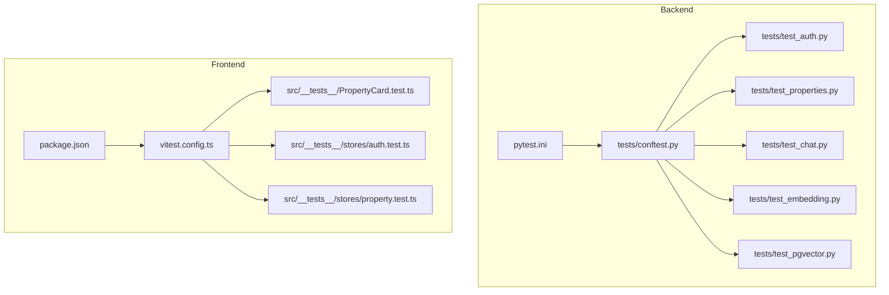

**Diagram sources**
- [backend/pytest.ini:1-5](file://backend/pytest.ini#L1-L5)
- [backend/tests/conftest.py:1-111](file://backend/tests/conftest.py#L1-L111)
- [backend/tests/test_auth.py:1-92](file://backend/tests/test_auth.py#L1-L92)
- [backend/tests/test_properties.py:1-78](file://backend/tests/test_properties.py#L1-L78)
- [backend/tests/test_chat.py:1-175](file://backend/tests/test_chat.py#L1-L175)
- [backend/tests/test_embedding.py:1-61](file://backend/tests/test_embedding.py#L1-L61)
- [backend/tests/test_pgvector.py:1-163](file://backend/tests/test_pgvector.py#L1-L163)
- [frontend/vitest.config.ts:1-22](file://frontend/vitest.config.ts#L1-L22)
- [frontend/package.json:1-31](file://frontend/package.json#L1-L31)
- [frontend/src/__tests__/PropertyCard.test.ts:1-80](file://frontend/src/__tests__/PropertyCard.test.ts#L1-L80)
- [frontend/src/__tests__/stores/auth.test.ts:1-86](file://frontend/src/__tests__/stores/auth.test.ts#L1-L86)
- [frontend/src/__tests__/stores/property.test.ts:1-126](file://frontend/src/__tests__/stores/property.test.ts#L1-L126)

**Section sources**
- [backend/pytest.ini:1-5](file://backend/pytest.ini#L1-L5)
- [backend/tests/conftest.py:1-111](file://backend/tests/conftest.py#L1-L111)
- [frontend/vitest.config.ts:1-22](file://frontend/vitest.config.ts#L1-L22)
- [frontend/package.json:1-31](file://frontend/package.json#L1-L31)

## Core Components
- Backend test runner configuration:
  - Asyncio fixture loop scope set to function.
  - Custom marker pgvector for optional real-db tests.
- Shared fixtures and overrides:
  - In-memory SQLite engine and session factory.
  - HTTP client with dependency override for DB session.
  - Reusable payloads for users and properties.
  - CLI option --run-pgvector to include pgvector tests.
- Frontend test runner configuration:
  - Vitest with jsdom environment and Vue plugin.
  - Alias @ -> src.
  - Coverage provider v8 with inclusion rules for components, stores, views.
  - Scripts for running tests and coverage.

Key responsibilities:
- Isolate external services (OpenAI, maps, Celery) via environment variables and mocks.
- Provide deterministic data through fixtures.
- Enable selective execution of expensive or environment-dependent tests.

**Section sources**
- [backend/pytest.ini:1-5](file://backend/pytest.ini#L1-L5)
- [backend/tests/conftest.py:1-111](file://backend/tests/conftest.py#L1-L111)
- [frontend/vitest.config.ts:1-22](file://frontend/vitest.config.ts#L1-L22)
- [frontend/package.json:1-31](file://frontend/package.json#L1-L31)

## Architecture Overview
The testing architecture separates concerns by layer and environment:
- Unit tests validate pure logic and service methods with mocked external clients.
- Integration tests exercise API endpoints against an in-memory database and overridden dependencies.
- Optional integration tests run against a real PostgreSQL with pgvector when explicitly requested.
- Frontend tests use jsdom to render Vue components and Pinia stores with mocked services.

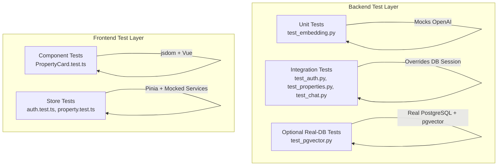

**Diagram sources**
- [backend/tests/test_embedding.py:1-61](file://backend/tests/test_embedding.py#L1-L61)
- [backend/tests/test_auth.py:1-92](file://backend/tests/test_auth.py#L1-L92)
- [backend/tests/test_properties.py:1-78](file://backend/tests/test_properties.py#L1-L78)
- [backend/tests/test_chat.py:1-175](file://backend/tests/test_chat.py#L1-L175)
- [backend/tests/test_pgvector.py:1-163](file://backend/tests/test_pgvector.py#L1-L163)
- [frontend/src/__tests__/PropertyCard.test.ts:1-80](file://frontend/src/__tests__/PropertyCard.test.ts#L1-L80)
- [frontend/src/__tests__/stores/auth.test.ts:1-86](file://frontend/src/__tests__/stores/auth.test.ts#L1-L86)
- [frontend/src/__tests__/stores/property.test.ts:1-126](file://frontend/src/__tests__/stores/property.test.ts#L1-L126)

## Detailed Component Analysis

### Backend: Pytest Configuration and Fixtures
- Asyncio fixture loop scope is set to function to ensure isolation per test.
- A custom marker pgvector gates tests requiring a real PostgreSQL instance with pgvector extension.
- The shared conftest sets environment variables to disable external calls and Celery broker usage during tests.
- An in-memory SQLite engine creates and drops tables per session lifecycle.
- The HTTP client overrides the application’s DB dependency to route queries to the test session.
- Reusable fixtures provide landlord registration payload and property payload.
- A pytest option --run-pgvector enables collection of pgvector-marked tests.

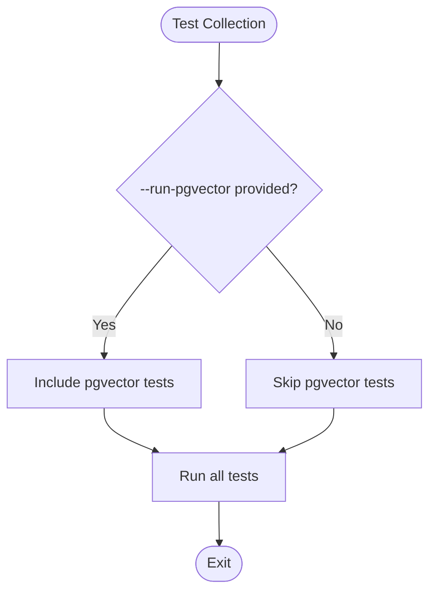

**Diagram sources**
- [backend/pytest.ini:1-5](file://backend/pytest.ini#L1-L5)
- [backend/tests/conftest.py:87-111](file://backend/tests/conftest.py#L87-L111)

**Section sources**
- [backend/pytest.ini:1-5](file://backend/pytest.ini#L1-L5)
- [backend/tests/conftest.py:1-111](file://backend/tests/conftest.py#L1-L111)

### Backend: Authentication Flow Tests
- Register endpoint returns created user without sensitive fields.
- Login endpoint returns bearer token on success and rejects wrong credentials.
- Protected endpoints return unauthorized without token and succeed with valid token.

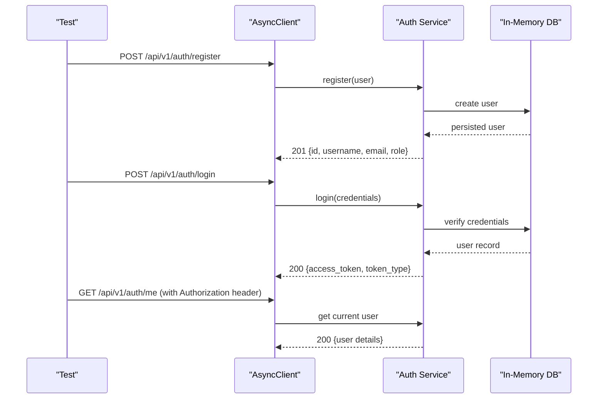

**Diagram sources**
- [backend/tests/test_auth.py:1-92](file://backend/tests/test_auth.py#L1-L92)
- [backend/tests/conftest.py:37-49](file://backend/tests/conftest.py#L37-L49)

**Section sources**
- [backend/tests/test_auth.py:1-92](file://backend/tests/test_auth.py#L1-L92)

### Backend: Property CRUD Tests
- Create property requires authenticated landlord and validates foreign key constraints.
- Listing properties returns created records.
- Unauthenticated requests are rejected.

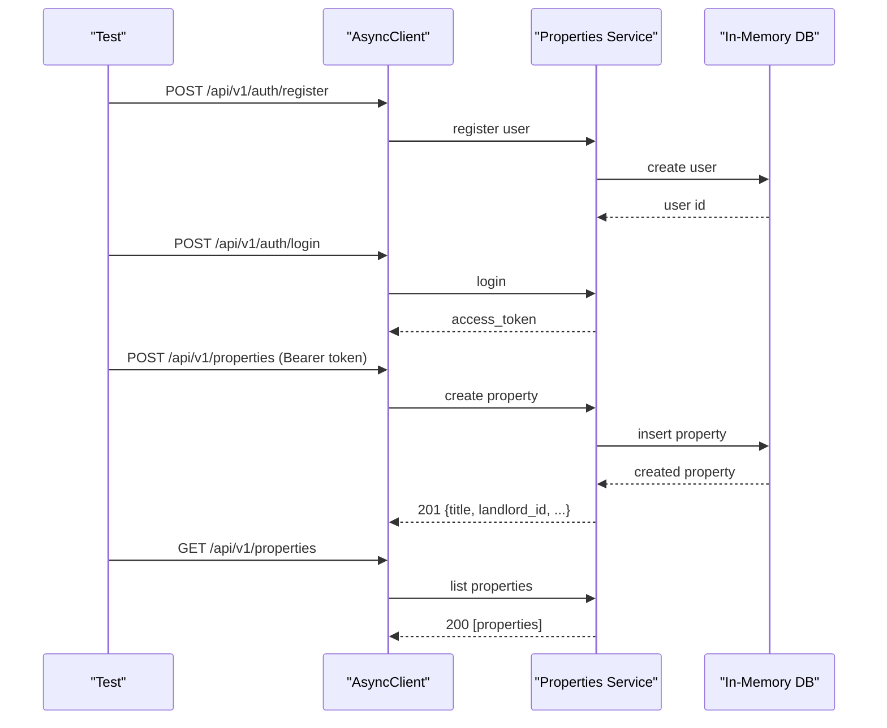

**Diagram sources**
- [backend/tests/test_properties.py:1-78](file://backend/tests/test_properties.py#L1-L78)
- [backend/tests/conftest.py:52-84](file://backend/tests/conftest.py#L52-L84)

**Section sources**
- [backend/tests/test_properties.py:1-78](file://backend/tests/test_properties.py#L1-L78)

### Backend: Chat Sessions Tests
- Create session returns active session with identifiers.
- List sessions returns multiple sessions.
- Get messages returns empty array for new sessions.
- Delete session removes it from listing.
- All chat endpoints require authentication.

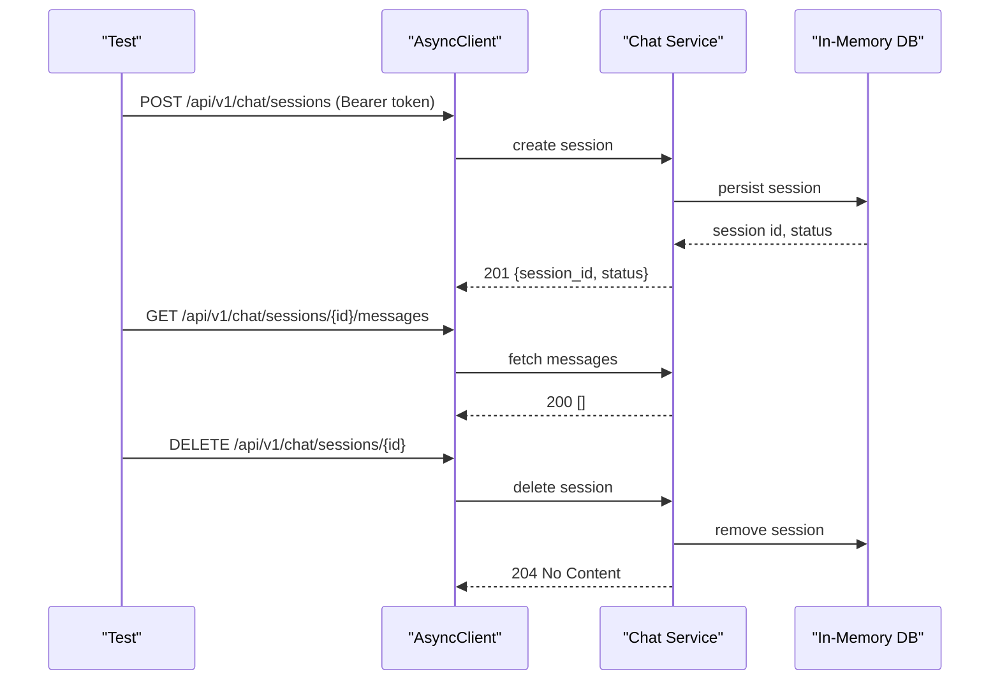

**Diagram sources**
- [backend/tests/test_chat.py:1-175](file://backend/tests/test_chat.py#L1-L175)

**Section sources**
- [backend/tests/test_chat.py:1-175](file://backend/tests/test_chat.py#L1-L175)

### Backend: Embedding Service Unit Tests
- Validates embedding dimensionality returned by the OpenAI client wrapper.
- Verifies text construction helper combines non-null fields and skips None values.
- Uses unittest.mock.AsyncMock and patch to isolate external AI client.

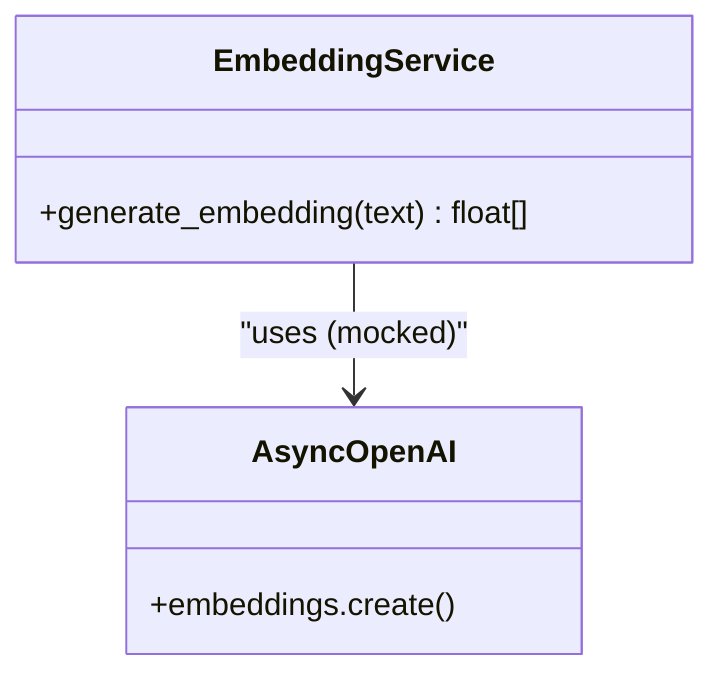

**Diagram sources**
- [backend/tests/test_embedding.py:1-61](file://backend/tests/test_embedding.py#L1-L61)

**Section sources**
- [backend/tests/test_embedding.py:1-61](file://backend/tests/test_embedding.py#L1-L61)

### Backend: Optional PostgreSQL + pgvector Tests
- Gated by pytest.mark.pgvector and --run-pgvector flag.
- Connects to real database URL from settings and overrides DB dependency.
- Exercises semantic search, POI generation, contracts/payments endpoints existence, JWT refresh, and rate limiting behavior.

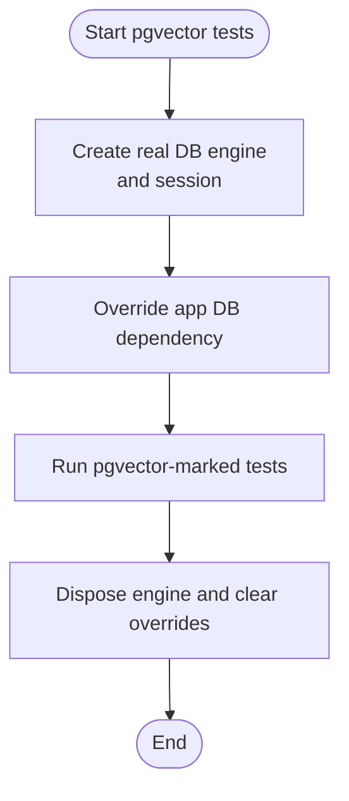

**Diagram sources**
- [backend/tests/test_pgvector.py:1-163](file://backend/tests/test_pgvector.py#L1-L163)
- [backend/tests/conftest.py:87-111](file://backend/tests/conftest.py#L87-L111)

**Section sources**
- [backend/tests/test_pgvector.py:1-163](file://backend/tests/test_pgvector.py#L1-L163)

### Frontend: Vitest Configuration and Scripts
- Environment: jsdom for DOM APIs.
- Vue plugin enabled for component rendering.
- Alias @ resolves to src.
- Coverage provider v8 includes components, stores, and views.
- Scripts: test, test:watch, test:coverage.

**Section sources**
- [frontend/vitest.config.ts:1-22](file://frontend/vitest.config.ts#L1-L22)
- [frontend/package.json:1-31](file://frontend/package.json#L1-L31)

### Frontend: PropertyCard Component Tests
- Mounts component with ElementPlus plugin and router mocks.
- Asserts rendered title, price, district tag, bedroom/bathroom count, image placeholder, similarity display toggles, and area.

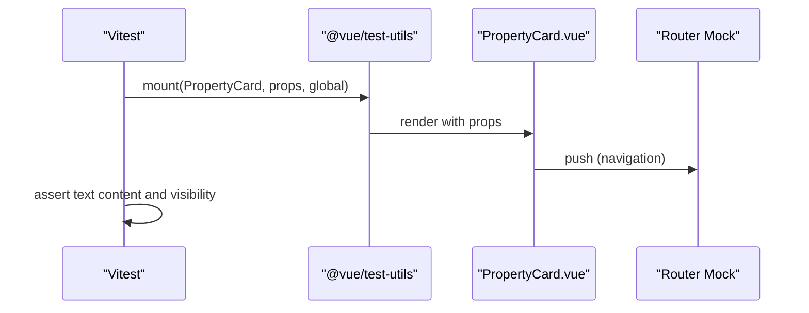

**Diagram sources**
- [frontend/src/__tests__/PropertyCard.test.ts:1-80](file://frontend/src/__tests__/PropertyCard.test.ts#L1-L80)

**Section sources**
- [frontend/src/__tests__/PropertyCard.test.ts:1-80](file://frontend/src/__tests__/PropertyCard.test.ts#L1-L80)

### Frontend: Auth Store Tests
- Initializes state correctly and loads from localStorage.
- Clears auth on logout.
- Role helpers (isLandlord, isAdmin) behave as expected.
- Handles corrupt localStorage gracefully.
- setAuth updates state and persists to localStorage.

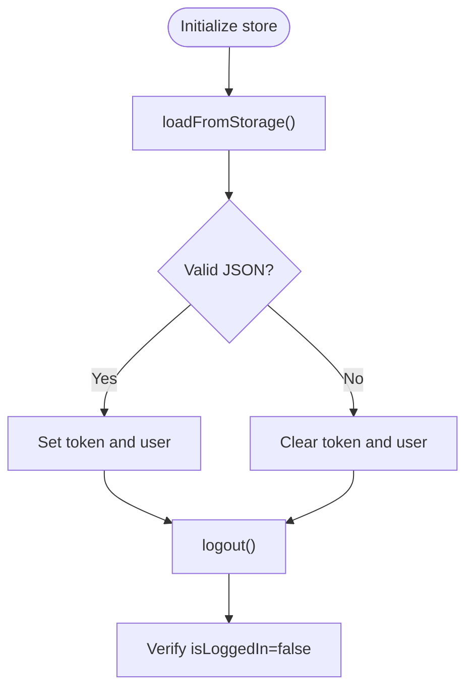

**Diagram sources**
- [frontend/src/__tests__/stores/auth.test.ts:1-86](file://frontend/src/__tests__/stores/auth.test.ts#L1-L86)

**Section sources**
- [frontend/src/__tests__/stores/auth.test.ts:1-86](file://frontend/src/__tests__/stores/auth.test.ts#L1-L86)

### Frontend: Property Store Tests
- Mocks propertyService methods to control responses.
- Verifies fetchList, fetchById, fetchSearch, create, update, remove, deleteImage, setPrimaryImage behaviors.
- Ensures local arrays and currentProperty are updated consistently.

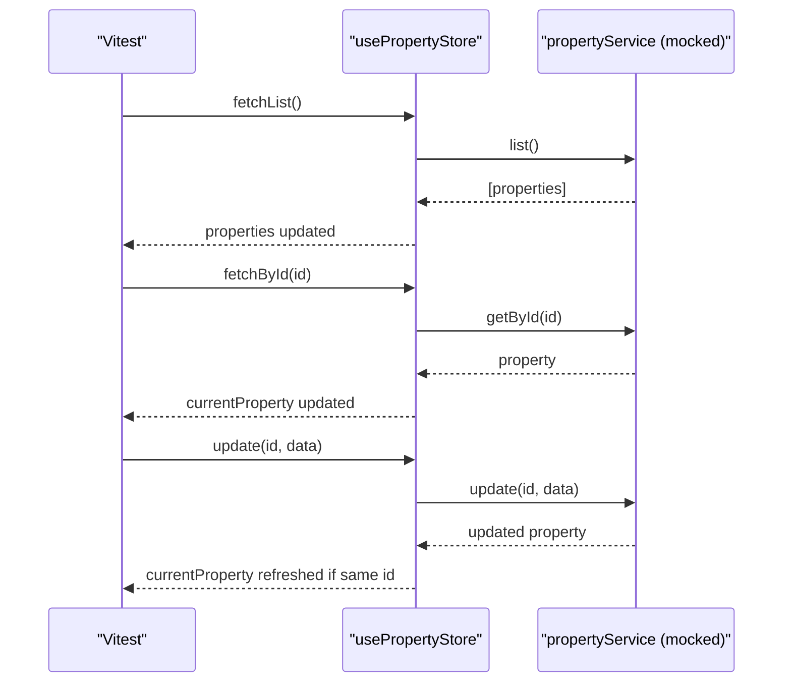

**Diagram sources**
- [frontend/src/__tests__/stores/property.test.ts:1-126](file://frontend/src/__tests__/stores/property.test.ts#L1-L126)

**Section sources**
- [frontend/src/__tests__/stores/property.test.ts:1-126](file://frontend/src/__tests__/stores/property.test.ts#L1-L126)

## Dependency Analysis
- Backend:
  - Tests depend on httpx AsyncClient and SQLAlchemy async engine/session.
  - Application dependency injection is overridden to inject test sessions.
  - External services disabled via environment variables; Celery tasks run eagerly.
- Frontend:
  - Tests depend on vitest, @vue/test-utils, element-plus, pinia, and vue-router mocks.
  - Service modules are mocked at import time to isolate UI/store logic.

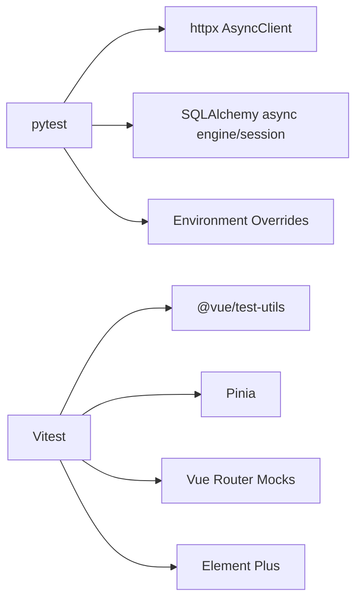

**Diagram sources**
- [backend/tests/conftest.py:1-111](file://backend/tests/conftest.py#L1-L111)
- [frontend/vitest.config.ts:1-22](file://frontend/vitest.config.ts#L1-L22)
- [frontend/src/__tests__/stores/auth.test.ts:1-86](file://frontend/src/__tests__/stores/auth.test.ts#L1-L86)
- [frontend/src/__tests__/stores/property.test.ts:1-126](file://frontend/src/__tests__/stores/property.test.ts#L1-L126)

**Section sources**
- [backend/tests/conftest.py:1-111](file://backend/tests/conftest.py#L1-L111)
- [frontend/vitest.config.ts:1-22](file://frontend/vitest.config.ts#L1-L22)

## Performance Considerations
- Prefer in-memory SQLite for fast feedback loops; reserve PostgreSQL + pgvector tests for explicit runs.
- Keep unit tests small and focused on single functions/classes to minimize runtime.
- For AI-related flows, mock embeddings and LLM calls to avoid latency and cost.
- When stress testing AI services:
  - Use separate environments and dedicated accounts.
  - Implement rate-limit aware clients and backoff strategies in tests.
  - Measure latency and error rates with metrics instrumentation around service calls.
- For background tasks:
  - Ensure Celery eager mode is enabled in tests to execute synchronously.
  - Validate task inputs/outputs and side effects deterministically.

[No sources needed since this section provides general guidance]

## Troubleshooting Guide
- Async fixture issues:
  - Ensure asyncio_default_fixture_loop_scope is set to function so each test gets its own event loop context.
- Database not found or schema mismatch:
  - Confirm Base.metadata.create_all runs before tests and drop_all after.
  - For pgvector tests, verify the database URL points to a running PostgreSQL with vector extension enabled.
- External API calls failing:
  - Verify environment variables are set to empty strings and that mocks are applied before calling services.
- Frontend component tests failing due to missing plugins:
  - Ensure ElementPlus is registered in global.plugins when mounting components.
- Router interactions:
  - Mock useRouter/useRoute or router.push to prevent navigation errors in tests.
- Coverage gaps:
  - Adjust vitest coverage.include patterns to capture additional files if needed.

**Section sources**
- [backend/pytest.ini:1-5](file://backend/pytest.ini#L1-L5)
- [backend/tests/conftest.py:22-34](file://backend/tests/conftest.py#L22-L34)
- [backend/tests/test_pgvector.py:12-32](file://backend/tests/test_pgvector.py#L12-L32)
- [frontend/src/__tests__/PropertyCard.test.ts:1-80](file://frontend/src/__tests__/PropertyCard.test.ts#L1-L80)
- [frontend/vitest.config.ts:16-19](file://frontend/vitest.config.ts#L16-L19)

## Conclusion
The project employs a layered testing strategy:
- Backend uses pytest with async support, in-memory databases, and dependency overrides for reliable integration tests.
- Optional real-database tests are gated behind a marker and CLI flag.
- Frontend leverages Vitest with jsdom and Vue plugin to test components and Pinia stores with mocked services.
- External dependencies are isolated via environment variables and mocks, ensuring fast and deterministic runs.
Adhering to these patterns yields maintainable, scalable tests across platforms and workflows.

[No sources needed since this section summarizes without analyzing specific files]

## Appendices

### Writing Effective Tests: Examples and Patterns
- Authentication flows:
  - Register then login to obtain a token; assert token presence and type; use token for protected endpoints; assert unauthorized without token.
  - See: [backend/tests/test_auth.py:1-92](file://backend/tests/test_auth.py#L1-L92)
- Property CRUD operations:
  - Create with valid landlord_id; assert creation response; list to verify persistence; assert validation failures for invalid references; assert unauthenticated rejection.
  - See: [backend/tests/test_properties.py:1-78](file://backend/tests/test_properties.py#L1-L78)
- AI chat interactions:
  - Create session; list sessions; fetch messages (empty); delete session; assert auth requirement across endpoints.
  - See: [backend/tests/test_chat.py:1-175](file://backend/tests/test_chat.py#L1-L175)
- Background tasks:
  - Ensure Celery eager mode is enabled; call task entry points directly or via API; assert synchronous completion and side effects.
  - See: [backend/tests/conftest.py:7-8](file://backend/tests/conftest.py#L7-L8)
- Frontend component tests:
  - Mount with required plugins; mock router; assert rendered content and conditional displays.
  - See: [frontend/src/__tests__/PropertyCard.test.ts:1-80](file://frontend/src/__tests__/PropertyCard.test.ts#L1-L80)
- Frontend store tests:
  - Mock services; initialize Pinia; assert state transitions and persistence to localStorage.
  - See: [frontend/src/__tests__/stores/auth.test.ts:1-86](file://frontend/src/__tests__/stores/auth.test.ts#L1-L86), [frontend/src/__tests__/stores/property.test.ts:1-126](file://frontend/src/__tests__/stores/property.test.ts#L1-L126)

### Test Organization and Utilities
- Shared fixtures:
  - User and property payloads reduce duplication and improve readability.
  - See: [backend/tests/conftest.py:52-84](file://backend/tests/conftest.py#L52-L84)
- Test data management:
  - Use fixtures for consistent inputs; prefer minimal datasets; reset state between tests via fresh sessions.
- Markers and flags:
  - Use markers to categorize tests (e.g., pgvector).
  - Use CLI options to selectively run subsets.
  - See: [backend/pytest.ini:1-5](file://backend/pytest.ini#L1-L5), [backend/tests/conftest.py:87-111](file://backend/tests/conftest.py#L87-L111)

### Continuous Integration and Quality Gates
- Recommended CI steps:
  - Install backend dev dependencies and run pytest.
  - Optionally run pgvector tests against a PostgreSQL service container with vector extension enabled.
  - Install frontend dependencies and run Vitest with coverage.
  - Fail pipeline if coverage thresholds are not met.
- Coverage configuration:
  - Backend: rely on pytest-cov if added later; currently no explicit coverage config in referenced files.
  - Frontend: v8 provider with include patterns for components, stores, and views.
  - See: [frontend/vitest.config.ts:16-19](file://frontend/vitest.config.ts#L16-L19)

[No sources needed since this section provides general guidance beyond referenced files]