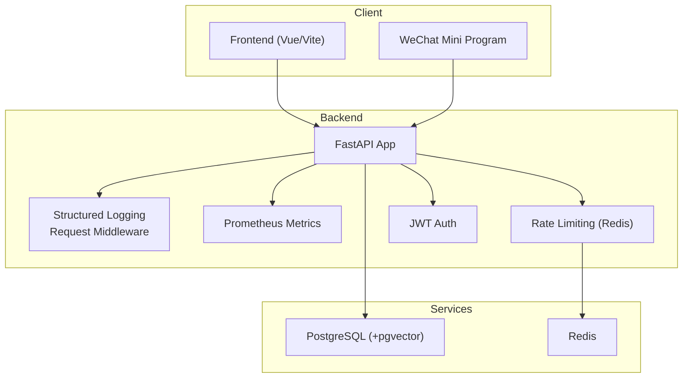
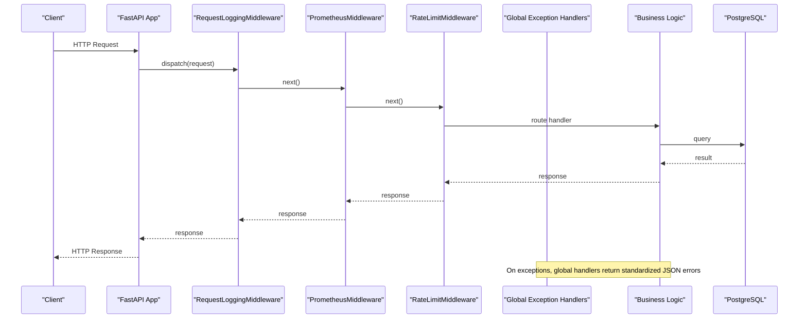
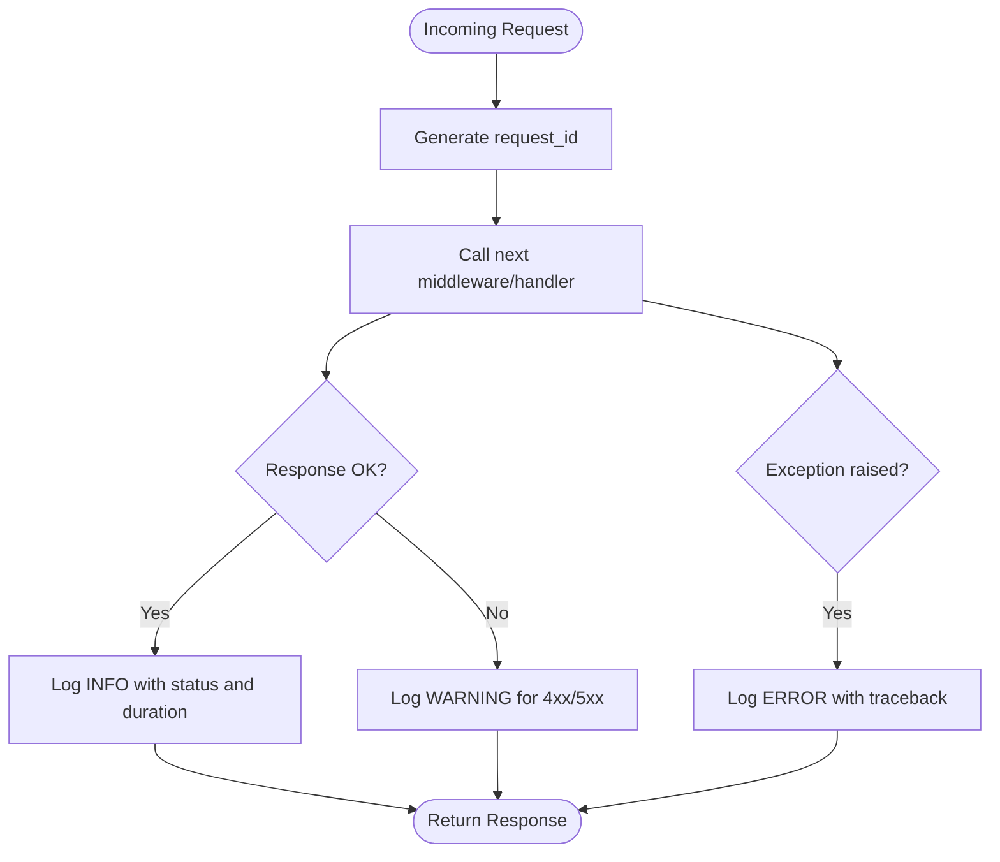
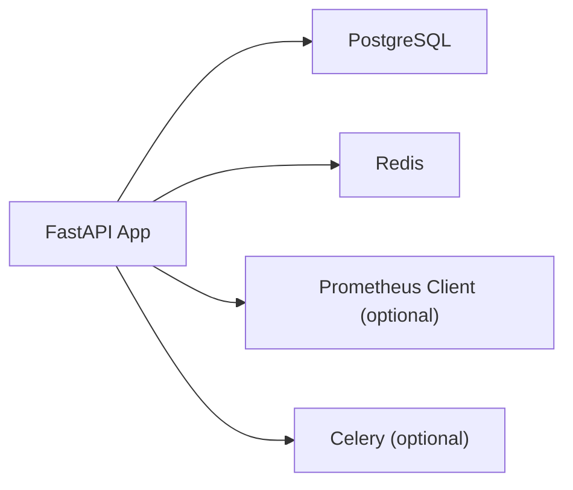

# Troubleshooting & FAQ

<cite>
**Referenced Files in This Document**
- [backend/app/core/logging.py](file://backend/app/core/logging.py)
- [backend/app/core/config.py](file://backend/app/core/config.py)
- [backend/app/api/v1/routes/health.py](file://backend/app/api/v1/routes/health.py)
- [backend/app/core/security.py](file://backend/app/core/security.py)
- [docker-compose.yml](file://docker-compose.yml)
- [backend/app/db/session.py](file://backend/app/db/session.py)
- [backend/app/main.py](file://backend/app/main.py)
- [DEPLOYMENT.md](file://DEPLOYMENT.md)
- [backend/Dockerfile](file://backend/Dockerfile)
- [frontend/package.json](file://frontend/package.json)
- [backend/app/core/monitoring.py](file://backend/app/core/monitoring.py)
- [backend/app/core/security_audit.py](file://backend/app/core/security_audit.py)
</cite>

## Table of Contents
1. Introduction
2. Project Structure
3. Core Components
4. Architecture Overview
5. Detailed Component Analysis
6. Dependency Analysis
7. Performance Considerations
8. Troubleshooting Guide
9. Conclusion
10. Appendices

## Introduction
This document provides comprehensive troubleshooting and frequently asked questions for the Rental Housing Structure platform. It focuses on resolving common setup issues (Docker, database connections, environment configuration), debugging backend API problems, frontend development issues, and WeChat Mini Program deployment challenges. It also explains log analysis strategies using structured JSON logging, error tracking, performance monitoring, and provides diagnostic commands, health checks, and dashboards to aid system troubleshooting. Finally, it covers performance troubleshooting, deployment-related issues, SSL certificate problems, reverse proxy misconfigurations, escalation procedures, and guidance for collecting diagnostics and reporting bugs effectively.

## Project Structure
The project is a multi-service application with:
- Backend: FastAPI application with structured logging, Prometheus metrics, rate limiting, JWT auth, and Celery task metrics integration.
- Database: PostgreSQL with pgvector extension; Redis for caching/rate limiting.
- Frontend: Vue 3 + Vite application with TypeScript and Element Plus.
- WeChat Mini Program: Native mini program components and pages.
- Deployment: Docker Compose for dev and production, Nginx for reverse proxy, Let’s Encrypt for SSL.

[No sources needed since this diagram shows conceptual workflow, not actual code structure]

## Core Components
- Structured logging and request middleware: Provides JSON logs in production and colored console logs in development, masks sensitive fields, and records per-request metadata including duration and status codes.
- Configuration management: Centralized settings loaded from environment variables with defaults for DB, Redis, CORS, AI services, AMap, uploads, WeChat, SMS, SMTP, and rate limiting.
- Health check endpoint: Simple readiness probe returning status ok.
- Security utilities: Password hashing, JWT creation/decoding, refresh token support, and rate limiting middleware backed by Redis.
- Monitoring: Prometheus middleware for HTTP metrics, Celery task metrics via signals, and optional DB pool gauges.
- Database session: Async SQLAlchemy engine and session factory configured from settings.
- Application bootstrap: Registers CORS, metrics, rate limiting, logging, exception handlers, mounts static uploads, and includes API routers.

**Section sources**
- [backend/app/core/logging.py:1-231](file://backend/app/core/logging.py#L1-L231)
- [backend/app/core/config.py:1-167](file://backend/app/core/config.py#L1-L167)
- [backend/app/api/v1/routes/health.py:1-9](file://backend/app/api/v1/routes/health.py#L1-L9)
- [backend/app/core/security.py:1-34](file://backend/app/core/security.py#L1-L34)
- [backend/app/core/security_audit.py:1-150](file://backend/app/core/security_audit.py#L1-L150)
- [backend/app/core/monitoring.py:1-227](file://backend/app/core/monitoring.py#L1-L227)
- [backend/app/db/session.py:1-14](file://backend/app/db/session.py#L1-L14)
- [backend/app/main.py:1-82](file://backend/app/main.py#L1-L82)

## Architecture Overview
The runtime architecture integrates middleware layers around the FastAPI app:
- RequestLoggingMiddleware captures request/response details and logs them with structured formats.
- PrometheusMiddleware collects latency and request counts.
- RateLimitMiddleware enforces per-client limits using Redis.
- Global exception handlers normalize errors into consistent JSON responses.
- The app mounts /metrics and /api/v1/health endpoints for observability.

**Diagram sources**
- [backend/app/main.py:1-82](file://backend/app/main.py#L1-L82)
- [backend/app/core/logging.py:124-167](file://backend/app/core/logging.py#L124-L167)
- [backend/app/core/monitoring.py:126-160](file://backend/app/core/monitoring.py#L126-L160)
- [backend/app/core/security_audit.py:49-95](file://backend/app/core/security_audit.py#L49-L95)
- [backend/app/core/logging.py:170-231](file://backend/app/core/logging.py#L170-L231)

## Detailed Component Analysis

### Logging and Error Handling
- Structured JSON formatter for production and colored console formatter for development.
- Sensitive field masking for phone numbers, emails, passwords, tokens, etc.
- Request logging middleware adds request_id, method, path, status_code, duration_ms, client, and user_id when available.
- Global exception handlers convert validation and HTTP exceptions into consistent JSON error payloads and log unhandled exceptions with stack traces.

**Diagram sources**
- [backend/app/core/logging.py:124-167](file://backend/app/core/logging.py#L124-L167)
- [backend/app/core/logging.py:170-231](file://backend/app/core/logging.py#L170-L231)

**Section sources**
- [backend/app/core/logging.py:1-231](file://backend/app/core/logging.py#L1-L231)

### Configuration Management
- Settings class loads environment variables with defaults for database URLs, Redis, auth keys, CORS, AI providers (OpenAI, DeepSeek), AMap, uploads, WeChat, SMS, SMTP, and rate limiting.
- Caching via lru_cache ensures single instance of settings across the app.

Common pitfalls:
- Missing or incorrect DATABASE_URL/ALEMBIC_DATABASE_URL causing connection failures.
- Wrong CORS_ORIGINS blocking frontend requests.
- Empty OPENAI_API_KEY/DEEPSEEK_API_KEY leading to service timeouts or authentication errors.
- Incorrect WECHAT_APPID/WECHAT_SECRET breaking Mini Program login flows.

**Section sources**
- [backend/app/core/config.py:1-167](file://backend/app/core/config.py#L1-L167)

### Health Check Endpoint
- GET /api/v1/health returns {"status": "ok"} for readiness probes and basic uptime verification.

Usage:
- Kubernetes liveness/readiness probes.
- Load balancer health checks.
- Quick smoke test after deployment.

**Section sources**
- [backend/app/api/v1/routes/health.py:1-9](file://backend/app/api/v1/routes/health.py#L1-L9)

### Security and Authentication
- Password hashing with bcrypt and JWT access/refresh tokens.
- Refresh token flow validates type and expiry, issuing new access and refresh tokens.
- Rate limiting middleware uses Redis to enforce per-client limits and returns 429 Too Many Requests when exceeded.

Common issues:
- Invalid or expired JWTs due to mismatched secret keys or algorithm settings.
- Refresh token misuse or wrong token type resulting in 401 Unauthorized.
- Rate limit triggers during high traffic or automated testing.

**Section sources**
- [backend/app/core/security.py:1-34](file://backend/app/core/security.py#L1-L34)
- [backend/app/core/security_audit.py:97-150](file://backend/app/core/security_audit.py#L97-L150)
- [backend/app/core/security_audit.py:49-95](file://backend/app/core/security_audit.py#L49-L95)

### Monitoring and Metrics
- PrometheusMiddleware tracks total requests, latency histograms, and in-flight requests.
- Celery metrics installed via signals to count tasks and measure durations.
- Optional DB pool gauges expose pool size, overflow, and checked-out connections.
- /metrics endpoint serves Prometheus text format.

Operational tips:
- Ensure prometheus-client is installed to enable metrics collection.
- Use Grafana to visualize request latency, error rates, and Celery task performance.
- Monitor DB pool metrics to detect connection exhaustion.

**Section sources**
- [backend/app/core/monitoring.py:1-227](file://backend/app/core/monitoring.py#L1-L227)
- [backend/app/main.py:41-66](file://backend/app/main.py#L41-L66)

### Database Session
- Async SQLAlchemy engine created from settings.database_url with echo enabled in debug mode.
- Session factory configured with expire_on_commit=False to avoid detached instance issues.

Troubleshooting:
- Verify DATABASE_URL points to correct host/port/user/password/database.
- Confirm pgvector extension is initialized via docker entrypoint scripts.
- Enable SQL echo in debug to inspect generated queries.

**Section sources**
- [backend/app/db/session.py:1-14](file://backend/app/db/session.py#L1-L14)
- [docker-compose.yml:10-27](file://docker-compose.yml#L10-L27)

### Application Bootstrap
- Registers CORS middleware, Prometheus middleware, rate limiting middleware, request logging middleware, and global exception handlers.
- Mounts /metrics and /api/v1/uploads static files.
- Includes API v1 router under configured prefix.

Common issues:
- CORS misconfiguration causing cross-origin errors in development/production.
- Rate limiting disabled in development/debug mode intentionally.
- Upload directory permissions preventing file writes.

**Section sources**
- [backend/app/main.py:17-82](file://backend/app/main.py#L17-L82)

## Dependency Analysis
Key runtime dependencies and their roles:
- PostgreSQL (+pgvector): Primary data store for relational data and vector embeddings.
- Redis: Used for rate limiting and potential caching.
- Prometheus client: Optional dependency for metrics; gracefully degrades if absent.
- Celery: Optional dependency for background tasks; metrics signals installed if present.

**Diagram sources**
- [backend/app/db/session.py:1-14](file://backend/app/db/session.py#L1-L14)
- [backend/app/core/security_audit.py:49-95](file://backend/app/core/security_audit.py#L49-L95)
- [backend/app/core/monitoring.py:1-68](file://backend/app/core/monitoring.py#L1-L68)
- [backend/app/core/monitoring.py:183-208](file://backend/app/core/monitoring.py#L183-L208)

**Section sources**
- [docker-compose.yml:1-53](file://docker-compose.yml#L1-L53)
- [backend/app/core/monitoring.py:1-68](file://backend/app/core/monitoring.py#L1-L68)
- [backend/app/core/security_audit.py:49-95](file://backend/app/core/security_audit.py#L49-L95)

## Performance Considerations
- Slow queries:
  - Enable SQL echo in debug mode to inspect queries.
  - Review indexes and use EXPLAIN ANALYZE for heavy queries.
  - Monitor DB pool metrics to detect contention.
- Memory leaks:
  - Watch process memory usage and GC behavior.
  - Inspect long-running tasks and streaming responses.
- Resource exhaustion:
  - Tune Gunicorn workers and keep-alive settings.
  - Adjust rate limiting thresholds based on traffic patterns.
  - Monitor Redis memory policies and eviction strategies.

[No sources needed since this section provides general guidance]

## Troubleshooting Guide

### Common Setup Issues and Solutions

#### Docker Container Problems
- Symptoms:
  - Services fail to start or crash immediately.
  - Port conflicts or network unreachable.
- Diagnostics:
  - View service logs: `docker compose logs -f <service>`
  - Check container health: `docker inspect --format='{{json .State.Health}}' <container_name>`
  - Validate port bindings: `docker ps`
- Fixes:
  - Ensure ports 5432 (PostgreSQL) and 6379 (Redis) are free.
  - Rebuild images if dependencies changed.
  - Restart containers: `docker compose restart`

**Section sources**
- [docker-compose.yml:1-53](file://docker-compose.yml#L1-L53)
- [backend/Dockerfile:45-61](file://backend/Dockerfile#L45-L61)

#### Database Connection Errors
- Symptoms:
  - Backend fails to connect to PostgreSQL.
  - Alembic migrations cannot run.
- Diagnostics:
  - Check DATABASE_URL and ALEMBIC_DATABASE_URL in environment.
  - Verify pg_isready: `docker compose exec postgres pg_isready -U rental -d rental_housing`
  - Inspect logs for connection refused or authentication failures.
- Fixes:
  - Correct credentials and host/port in .env.
  - Ensure pgvector extension is initialized via init script.
  - Run migrations: `docker compose exec backend alembic upgrade head`

**Section sources**
- [backend/app/db/session.py:1-14](file://backend/app/db/session.py#L1-L14)
- [backend/app/core/config.py:15-22](file://backend/app/core/config.py#L15-L22)
- [docker-compose.yml:10-27](file://docker-compose.yml#L10-L27)

#### Environment Configuration Mistakes
- Symptoms:
  - CORS errors in browser console.
  - AI service calls failing due to missing keys.
  - WeChat Mini Program login failures.
- Diagnostics:
  - Print effective settings at startup (via logs).
  - Validate required env vars exist and are non-empty.
- Fixes:
  - Set CORS_ORIGINS to include frontend domain(s).
  - Provide OPENAI_API_KEY/DEEPSEEK_API_KEY for AI features.
  - Configure WECHAT_APPID/WECHAT_SECRET for Mini Program.

**Section sources**
- [backend/app/core/config.py:40-161](file://backend/app/core/config.py#L40-L161)
- [backend/app/main.py:27-39](file://backend/app/main.py#L27-L39)

### Debugging Techniques

#### Backend API Issues
- Use structured JSON logs to trace request lifecycle:
  - Filter by request_id to correlate logs across services.
  - Inspect duration_ms and status_code for slow or failing endpoints.
- Enable SQL echo in debug mode to see raw queries.
- Test endpoints directly with curl or Postman.

**Section sources**
- [backend/app/core/logging.py:33-54](file://backend/app/core/logging.py#L33-L54)
- [backend/app/db/session.py:8](file://backend/app/db/session.py#L8)

#### Frontend Development Problems
- Symptoms:
  - Build failures or type errors.
  - API calls blocked by CORS.
- Diagnostics:
  - Run dev server: `npm run dev`
  - Check browser network tab for failed requests and CORS headers.
- Fixes:
  - Ensure vite config proxies API requests correctly.
  - Align CORS_ORIGINS with frontend dev URL.

**Section sources**
- [frontend/package.json:6-12](file://frontend/package.json#L6-L12)
- [backend/app/main.py:27-39](file://backend/app/main.py#L27-L39)

#### WeChat Mini Program Deployment Challenges
- Symptoms:
  - Login fails or token exchange errors.
  - API calls rejected due to domain restrictions.
- Diagnostics:
  - Verify WECHAT_APPID/WECHAT_SECRET in backend.
  - Check Mini Program project config for allowed domains.
- Fixes:
  - Update backend wechat_token_url if using custom gateway.
  - Ensure HTTPS endpoints are reachable from WeChat servers.

**Section sources**
- [backend/app/core/config.py:107-119](file://backend/app/core/config.py#L107-L119)

### Log Analysis Strategies
- Structured JSON logging:
  - Parse logs with tools like jq or log aggregators.
  - Extract fields: timestamp, level, logger, message, request_id, user_id, duration_ms, status_code.
- Error tracking:
  - Aggregate exceptions with stack traces for root cause analysis.
  - Correlate errors with request_id across middleware and handlers.
- Performance monitoring:
  - Use Prometheus metrics to track latency percentiles and error rates.
  - Monitor Celery task durations and success/failure counts.

**Section sources**
- [backend/app/core/logging.py:33-54](file://backend/app/core/logging.py#L33-L54)
- [backend/app/core/monitoring.py:74-118](file://backend/app/core/monitoring.py#L74-L118)
- [backend/app/core/monitoring.py:183-208](file://backend/app/core/monitoring.py#L183-L208)

### Common Runtime Errors

#### Authentication Failures
- Causes:
  - Expired or invalid JWT.
  - Mismatched secret key or algorithm.
  - Using wrong token type (access vs refresh).
- Resolution:
  - Regenerate tokens using refresh flow.
  - Verify AUTH_SECRET_KEY and AUTH_ALGORITHM consistency.

**Section sources**
- [backend/app/core/security.py:22-34](file://backend/app/core/security.py#L22-L34)
- [backend/app/core/security_audit.py:102-136](file://backend/app/core/security_audit.py#L102-L136)

#### Database Connection Issues
- Causes:
  - Incorrect DATABASE_URL.
  - Network connectivity problems.
  - Missing pgvector extension.
- Resolution:
  - Validate connection string and credentials.
  - Ensure pgvector initialization script runs on first boot.

**Section sources**
- [backend/app/db/session.py:1-14](file://backend/app/db/session.py#L1-L14)
- [docker-compose.yml:10-27](file://docker-compose.yml#L10-L27)

#### AI Service Timeouts
- Causes:
  - Missing API keys.
  - Provider downtime or rate limits.
- Resolution:
  - Set OPENAI_API_KEY/DEEPSEEK_API_KEY.
  - Implement retries and circuit breakers for external calls.

**Section sources**
- [backend/app/core/config.py:46-70](file://backend/app/core/config.py#L46-L70)

#### Background Task Failures
- Causes:
  - Celery worker crashes or queue backlog.
  - Task dependencies unavailable.
- Resolution:
  - Inspect celery-worker logs.
  - Scale workers horizontally and monitor task metrics.

**Section sources**
- [backend/app/core/monitoring.py:183-208](file://backend/app/core/monitoring.py#L183-L208)
- [DEPLOYMENT.md:112-121](file://DEPLOYMENT.md#L112-L121)

### Diagnostic Commands
- Health check:
  - `curl http://localhost:8000/api/v1/health`
- Metrics:
  - `curl http://localhost:8000/metrics`
- Database readiness:
  - `docker compose exec postgres pg_isready -U rental -d rental_housing`
- Redis ping:
  - `docker compose exec redis redis-cli ping`
- View logs:
  - `docker compose logs -f backend`
  - `docker compose logs -f celery-worker`

**Section sources**
- [backend/app/api/v1/routes/health.py:6-8](file://backend/app/api/v1/routes/health.py#L6-L8)
- [backend/app/core/monitoring.py:167-175](file://backend/app/core/monitoring.py#L167-L175)
- [DEPLOYMENT.md:112-121](file://DEPLOYMENT.md#L112-L121)

### Monitoring Dashboards
- Prometheus:
  - Scrape /metrics endpoint.
  - Visualize request latency, error rates, and Celery task performance.
- Grafana:
  - Create dashboards for DB pool metrics and rate limiting events.
  - Alert on high error rates and slow endpoints.

**Section sources**
- [backend/app/core/monitoring.py:74-118](file://backend/app/core/monitoring.py#L74-L118)
- [DEPLOYMENT.md:86-91](file://DEPLOYMENT.md#L86-L91)

### Performance Troubleshooting
- Slow queries:
  - Enable SQL echo and analyze execution plans.
  - Add appropriate indexes and optimize joins.
- Memory leaks:
  - Profile Python processes and inspect object retention.
  - Avoid holding large datasets in memory.
- Resource exhaustion:
  - Tune Gunicorn workers and max-requests.
  - Monitor Redis memory policy and eviction.

[No sources needed since this section provides general guidance]

### Deployment-Related Issues

#### SSL Certificate Problems
- Symptoms:
  - HTTPS handshake failures.
  - Certificate expiration warnings.
- Resolution:
  - Renew certificates with certbot.
  - Mount /etc/letsencrypt volumes and update nginx config.

**Section sources**
- [DEPLOYMENT.md:41-62](file://DEPLOYMENT.md#L41-L62)

#### Reverse Proxy Configuration Errors
- Symptoms:
  - 404 or 502 errors from Nginx.
  - Missing trailing slashes or wrong upstream ports.
- Resolution:
  - Verify proxy_pass directives and upstream definitions.
  - Ensure frontend build assets are served correctly.

**Section sources**
- [DEPLOYMENT.md:56-62](file://DEPLOYMENT.md#L56-L62)

### Escalation Procedures and Support Channels
- Internal escalation:
  - Collect logs, metrics snapshots, and reproduction steps.
  - Tag relevant teams (backend, infra, QA).
- Community resources:
  - GitHub issues for bug reports and feature requests.
  - Documentation links for deployment and configuration.

[No sources needed since this section summarizes without analyzing specific files]

### Collecting Diagnostic Information and Reporting Bugs
- Logs:
  - Export structured JSON logs for the incident timeframe.
  - Include request_id and user_id where applicable.
- Metrics:
  - Download Prometheus scrape output for /metrics.
  - Capture Celery task metrics and DB pool gauges.
- Reproduction:
  - Provide minimal steps to reproduce the issue.
  - Attach screenshots or curl commands used.

**Section sources**
- [backend/app/core/logging.py:33-54](file://backend/app/core/logging.py#L33-L54)
- [backend/app/core/monitoring.py:167-175](file://backend/app/core/monitoring.py#L167-L175)

## Conclusion
This troubleshooting guide consolidates essential diagnostics, common pitfalls, and resolution strategies for the Rental Housing Structure platform. By leveraging structured logging, Prometheus metrics, and robust health checks, teams can quickly identify and resolve issues across backend APIs, frontend development, and WeChat Mini Program deployments. Following the recommended practices for configuration, monitoring, and escalation will improve reliability and reduce mean time to resolution.

## Appendices

### Frequently Asked Questions

- Why am I getting CORS errors in the browser?
  - Ensure CORS_ORIGINS includes your frontend URL and that the backend is running with correct environment settings.

- How do I verify the database is ready before starting the backend?
  - Use pg_isready inside the postgres container and ensure DATABASE_URL is correct.

- What should I do if AI service calls timeout?
  - Verify API keys and provider availability; implement retries and consider fallback logic.

- How can I monitor background task performance?
  - Use Celery metrics exposed via Prometheus and review task latency histograms.

- How do I renew SSL certificates automatically?
  - Set up certbot cron job to renew and restart Nginx post-renewal.

[No sources needed since this section provides general guidance]