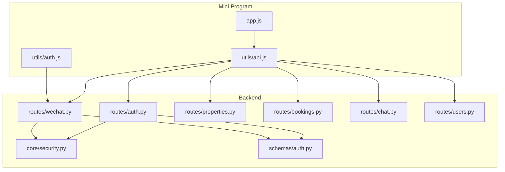
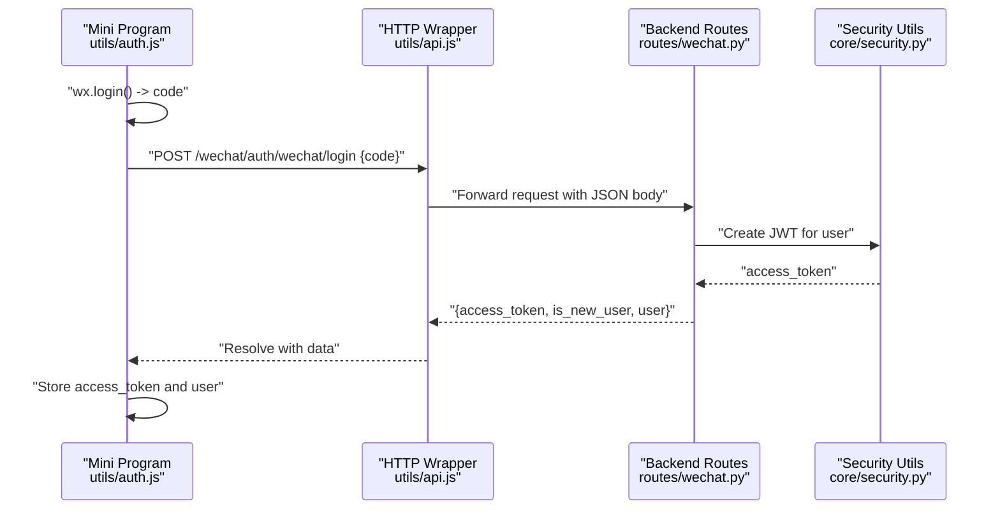
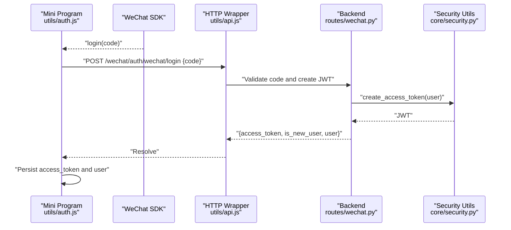
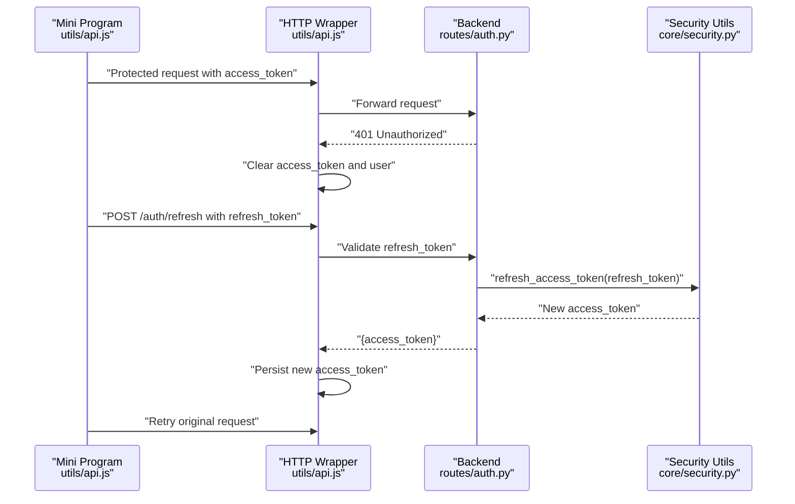
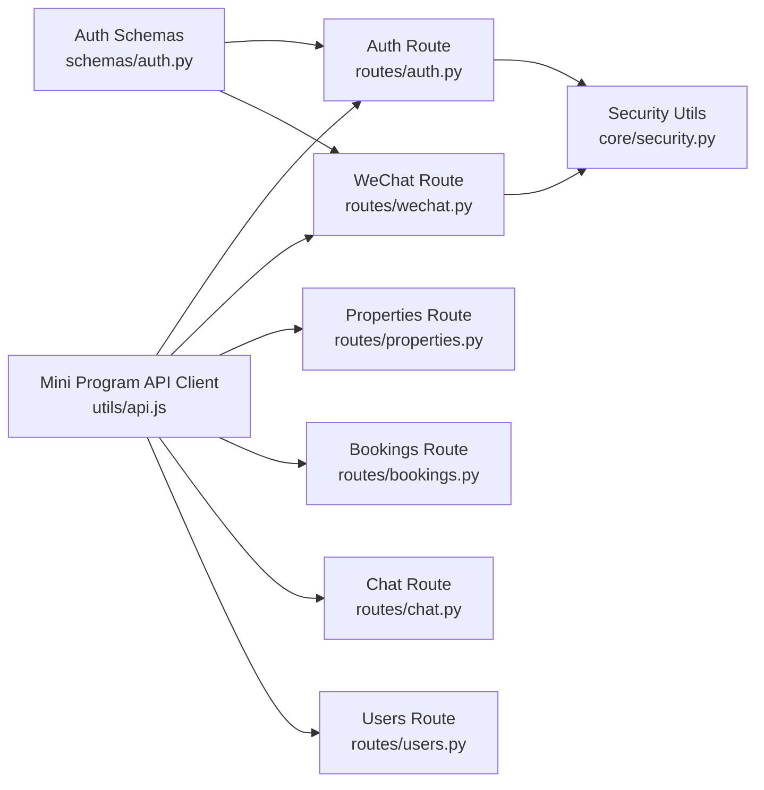

# Backend Communication & Authentication

<cite>
**Referenced Files in This Document**
- [api.js](file://wechat-miniprogram/utils/api.js)
- [auth.js](file://wechat-miniprogram/utils/auth.js)
- [app.js](file://wechat-miniprogram/app.js)
- [auth.py](file://backend/app/api/v1/routes/auth.py)
- [wechat.py](file://backend/app/api/v1/routes/wechat.py)
- [security.py](file://backend/app/core/security.py)
- [auth.py (schemas)](file://backend/app/schemas/auth.py)
- [properties.py](file://backend/app/api/v1/routes/properties.py)
- [bookings.py](file://backend/app/api/v1/routes/bookings.py)
- [chat.py](file://backend/app/api/v1/routes/chat.py)
- [users.py](file://backend/app/api/v1/routes/users.py)
</cite>

## Table of Contents
1. [Introduction](#introduction)
2. [Project Structure](#project-structure)
3. [Core Components](#core-components)
4. [Architecture Overview](#architecture-overview)
5. [Detailed Component Analysis](#detailed-component-analysis)
6. [Dependency Analysis](#dependency-analysis)
7. [Performance Considerations](#performance-considerations)
8. [Troubleshooting Guide](#troubleshooting-guide)
9. [Conclusion](#conclusion)

## Introduction
This document explains how the WeChat Mini Program communicates with the backend, focusing on:
- API client implementation and request/response handling
- Error management and response formatting
- JWT authentication flow from login through token refresh and session management
- Data transformation layer for converting backend responses to Mini Program compatible formats
- Example endpoints for properties, bookings, chat messages, and user management
- Caching strategies, offline support considerations, and performance optimization techniques for mobile networks
- Security measures including HTTPS enforcement, token storage, and input validation

## Project Structure
The relevant parts of the codebase include:
- Mini Program utilities for HTTP requests and authentication
- Backend FastAPI routes for authentication, resources, and chat
- Core security utilities for password hashing and JWT operations
- Pydantic schemas defining request/response contracts

**Diagram sources**
- [api.js:1-52](file://wechat-miniprogram/utils/api.js#L1-L52)
- [auth.js:1-81](file://wechat-miniprogram/utils/auth.js#L1-L81)
- [app.js:1-21](file://wechat-miniprogram/app.js#L1-L21)
- [auth.py:1-94](file://backend/app/api/v1/routes/auth.py#L1-L94)
- [wechat.py:1-82](file://backend/app/api/v1/routes/wechat.py#L1-L82)
- [properties.py:1-162](file://backend/app/api/v1/routes/properties.py#L1-L162)
- [bookings.py:1-112](file://backend/app/api/v1/routes/bookings.py#L1-L112)
- [chat.py:1-143](file://backend/app/api/v1/routes/chat.py#L1-L143)
- [users.py:1-102](file://backend/app/api/v1/routes/users.py#L1-L102)
- [security.py:1-34](file://backend/app/core/security.py#L1-L34)
- [auth.py (schemas):1-63](file://backend/app/schemas/auth.py#L1-L63)

**Section sources**
- [api.js:1-52](file://wechat-miniprogram/utils/api.js#L1-L52)
- [auth.js:1-81](file://wechat-miniprogram/utils/auth.js#L1-L81)
- [app.js:1-21](file://wechat-miniprogram/app.js#L1-L21)
- [auth.py:1-94](file://backend/app/api/v1/routes/auth.py#L1-L94)
- [wechat.py:1-82](file://backend/app/api/v1/routes/wechat.py#L1-L82)
- [properties.py:1-162](file://backend/app/api/v1/routes/properties.py#L1-L162)
- [bookings.py:1-112](file://backend/app/api/v1/routes/bookings.py#L1-L112)
- [chat.py:1-143](file://backend/app/api/v1/routes/chat.py#L1-L143)
- [users.py:1-102](file://backend/app/api/v1/routes/users.py#L1-L102)
- [security.py:1-34](file://backend/app/core/security.py#L1-L34)
- [auth.py (schemas):1-63](file://backend/app/schemas/auth.py#L1-L63)

## Core Components
- Mini Program HTTP wrapper: centralizes base URL, Authorization header injection, success/error handling, and convenience methods for GET/POST/PUT/PATCH/DELETE.
- Mini Program auth helper: orchestrates WeChat login code exchange, stores tokens and user info, checks login state, and provides logout.
- Backend authentication routes: standard username/password login, token refresh, current user retrieval, and WeChat login endpoint returning JWT.
- Core security utilities: password hashing/verification and JWT creation/decoding.
- Resource routes: properties, bookings, chat sessions/messages, and users with role-based access control.

**Section sources**
- [api.js:1-52](file://wechat-miniprogram/utils/api.js#L1-L52)
- [auth.js:1-81](file://wechat-miniprogram/utils/auth.js#L1-L81)
- [auth.py:1-94](file://backend/app/api/v1/routes/auth.py#L1-L94)
- [wechat.py:1-82](file://backend/app/api/v1/routes/wechat.py#L1-L82)
- [security.py:1-34](file://backend/app/core/security.py#L1-L34)

## Architecture Overview
End-to-end communication between the Mini Program and backend follows a clear pattern:
- The Mini Program’s HTTP wrapper attaches the JWT to every request when available.
- Auth flows use either WeChat login or username/password to obtain a JWT.
- Protected endpoints validate the JWT via dependencies and enforce roles.
- Responses are standardized via Pydantic schemas; errors return consistent detail payloads.

**Diagram sources**
- [auth.js:1-81](file://wechat-miniprogram/utils/auth.js#L1-L81)
- [api.js:1-52](file://wechat-miniprogram/utils/api.js#L1-L52)
- [wechat.py:1-82](file://backend/app/api/v1/routes/wechat.py#L1-L82)
- [security.py:1-34](file://backend/app/core/security.py#L1-L34)

## Detailed Component Analysis

### Mini Program API Client (utils/api.js)
Responsibilities:
- Base URL composition using global configuration.
- Automatic Authorization header injection when a token exists.
- Unified error handling:
  - 401 triggers logout by clearing local storage and global state.
  - Non-2xx responses show toast notifications and reject with server payload.
  - Network failures show generic toast and reject with error object.
- Convenience methods for common HTTP verbs.

Error management and response formatting:
- Success path resolves with raw response data.
- 401 path clears persisted tokens and user info, sets global login state false, and rejects with a structured error object.
- Other error paths display user-friendly messages and reject with server-provided details.

Token storage and lifecycle:
- Token read from persistent storage before each request.
- On 401, token and user are removed, ensuring subsequent calls trigger re-authentication at the app level.

**Section sources**
- [api.js:1-52](file://wechat-miniprogram/utils/api.js#L1-L52)
- [app.js:1-21](file://wechat-miniprogram/app.js#L1-L21)

### Mini Program Auth Helper (utils/auth.js)
Responsibilities:
- Login flow:
  - Calls wx.login to obtain a temporary code.
  - Exchanges code for JWT via backend WeChat login endpoint.
  - Persists access_token and user info; updates global login state.
- Check login:
  - If token exists, hydrate global state and resolve immediately.
  - Otherwise, perform login automatically.
- Logout:
  - Clears persisted tokens and user info; resets global state.
- User info accessors:
  - Provides current user and login status helpers.

Data transformation:
- Stores user object as JSON string in persistent storage; parses back into an object when restoring state.

**Section sources**
- [auth.js:1-81](file://wechat-miniprogram/utils/auth.js#L1-L81)

### Backend Authentication Routes
Standard login and token refresh:
- POST /auth/login authenticates with username/email and password, returns JWT.
- POST /auth/refresh issues a new access token using a refresh token provided in Authorization header.
- GET /auth/me returns current user profile when authenticated.

WeChat login:
- POST /wechat/auth/wechat/login exchanges wx.login code for JWT and user info.
- POST /wechat/auth/phone binds phone number to current user using WeChat API.
- GET /wechat/config exposes mini program config such as appid.

Security and schema contracts:
- Uses Pydantic models to validate inputs and serialize outputs.
- Integrates with core security utilities for JWT creation and decoding.

**Section sources**
- [auth.py:1-94](file://backend/app/api/v1/routes/auth.py#L1-L94)
- [wechat.py:1-82](file://backend/app/api/v1/routes/wechat.py#L1-L82)
- [auth.py (schemas):1-63](file://backend/app/schemas/auth.py#L1-L63)
- [security.py:1-34](file://backend/app/core/security.py#L1-L34)

### Properties Endpoints
Key capabilities:
- Create property with landlord ownership checks.
- Search with filters and natural language query support.
- List with pagination and filtering by district/status.
- Get, update, delete with authorization guards.

Response modeling:
- Returns PropertyRead objects with images included where applicable.
- Search results include similarity scores and image metadata.

**Section sources**
- [properties.py:1-162](file://backend/app/api/v1/routes/properties.py#L1-L162)

### Bookings Endpoints
Key capabilities:
- Create booking with validation that at least one of message or scheduled_date is provided.
- List bookings scoped by user role (tenant vs landlord/admin).
- Get single booking with access control.
- Update status (approve/reject) restricted to landlords/admins.
- Cancel booking restricted to tenants/admins.

Authorization:
- Enforces tenant/landlord/admin roles via dependencies.

**Section sources**
- [bookings.py:1-112](file://backend/app/api/v1/routes/bookings.py#L1-L112)

### Chat Sessions and Messages
Key capabilities:
- Create/list/delete chat sessions per user.
- Retrieve message history for a session.
- Send message with streaming server-sent events (SSE) response for real-time replies.

Streaming response:
- Returns text/event-stream with appropriate headers to avoid buffering.

**Section sources**
- [chat.py:1-143](file://backend/app/api/v1/routes/chat.py#L1-L143)

### User Management Endpoints
Key capabilities:
- Create user with uniqueness constraints.
- Admin-only list/get/update/delete users.
- Current user can get and update their own profile.

Validation and conflict handling:
- Integrity errors mapped to 409 Conflict with descriptive details.

**Section sources**
- [users.py:1-102](file://backend/app/api/v1/routes/users.py#L1-L102)

### Data Transformation Layer
- Backend uses Pydantic schemas to define strict request/response contracts, ensuring consistent serialization and validation.
- Mini Program transforms minimal data needed for UI:
  - Parses stored user JSON back into an object.
  - Handles 401 by clearing local state and prompting re-login.
  - Displays user-facing messages extracted from server error details.

Best practices:
- Keep Mini Program logic focused on presentation and state hydration.
- Rely on backend schemas for authoritative data shapes and validation.

**Section sources**
- [auth.js:1-81](file://wechat-miniprogram/utils/auth.js#L1-L81)
- [api.js:1-52](file://wechat-miniprogram/utils/api.js#L1-L52)
- [auth.py (schemas):1-63](file://backend/app/schemas/auth.py#L1-L63)

### Authentication Flow Sequence Diagrams

#### WeChat Login Flow

**Diagram sources**
- [auth.js:1-81](file://wechat-miniprogram/utils/auth.js#L1-L81)
- [api.js:1-52](file://wechat-miniprogram/utils/api.js#L1-L52)
- [wechat.py:1-82](file://backend/app/api/v1/routes/wechat.py#L1-L82)
- [security.py:1-34](file://backend/app/core/security.py#L1-L34)

#### Token Refresh Flow

**Diagram sources**
- [api.js:1-52](file://wechat-miniprogram/utils/api.js#L1-L52)
- [auth.py:1-94](file://backend/app/api/v1/routes/auth.py#L1-L94)
- [security.py:1-34](file://backend/app/core/security.py#L1-L34)

### Request/Response Handling and Error Management
- Mini Program wrapper:
  - Adds Authorization header if token present.
  - On 401, clears local storage and global state, then rejects with structured error.
  - On other errors, shows toast with server detail and rejects with payload.
  - On network failure, shows toast and rejects with error object.
- Backend:
  - Returns consistent JSON error bodies with detail fields.
  - Uses HTTP status codes to signal success/failure.

**Section sources**
- [api.js:1-52](file://wechat-miniprogram/utils/api.js#L1-L52)
- [auth.py:1-94](file://backend/app/api/v1/routes/auth.py#L1-L94)

### Security Measures
- HTTPS enforcement:
  - Ensure production deployments route traffic over HTTPS at the reverse proxy/load balancer layer.
- Token storage:
  - Mini Program persists access_token and user info in secure storage APIs.
  - Clear tokens on 401 to prevent stale sessions.
- Input validation:
  - Backend validates all inputs via Pydantic schemas.
  - Role-based access control enforced via dependencies on protected endpoints.

Recommendations:
- Store tokens securely and consider short-lived access tokens with refresh tokens.
- Implement token refresh on the Mini Program side before making protected calls.
- Validate and sanitize all inputs on both client and server sides.

**Section sources**
- [api.js:1-52](file://wechat-miniprogram/utils/api.js#L1-L52)
- [auth.js:1-81](file://wechat-miniprogram/utils/auth.js#L1-L81)
- [auth.py:1-94](file://backend/app/api/v1/routes/auth.py#L1-L94)
- [auth.py (schemas):1-63](file://backend/app/schemas/auth.py#L1-L63)

## Dependency Analysis
High-level dependency relationships among key components:

**Diagram sources**
- [api.js:1-52](file://wechat-miniprogram/utils/api.js#L1-L52)
- [auth.py:1-94](file://backend/app/api/v1/routes/auth.py#L1-L94)
- [wechat.py:1-82](file://backend/app/api/v1/routes/wechat.py#L1-L82)
- [properties.py:1-162](file://backend/app/api/v1/routes/properties.py#L1-L162)
- [bookings.py:1-112](file://backend/app/api/v1/routes/bookings.py#L1-L112)
- [chat.py:1-143](file://backend/app/api/v1/routes/chat.py#L1-L143)
- [users.py:1-102](file://backend/app/api/v1/routes/users.py#L1-L102)
- [security.py:1-34](file://backend/app/core/security.py#L1-L34)
- [auth.py (schemas):1-63](file://backend/app/schemas/auth.py#L1-L63)

**Section sources**
- [api.js:1-52](file://wechat-miniprogram/utils/api.js#L1-L52)
- [auth.py:1-94](file://backend/app/api/v1/routes/auth.py#L1-L94)
- [wechat.py:1-82](file://backend/app/api/v1/routes/wechat.py#L1-L82)
- [properties.py:1-162](file://backend/app/api/v1/routes/properties.py#L1-L162)
- [bookings.py:1-112](file://backend/app/api/v1/routes/bookings.py#L1-L112)
- [chat.py:1-143](file://backend/app/api/v1/routes/chat.py#L1-L143)
- [users.py:1-102](file://backend/app/api/v1/routes/users.py#L1-L102)
- [security.py:1-34](file://backend/app/core/security.py#L1-L34)
- [auth.py (schemas):1-63](file://backend/app/schemas/auth.py#L1-L63)

## Performance Considerations
- Reduce payload size:
  - Use pagination and field selection on list endpoints.
  - Avoid sending unnecessary fields in responses.
- Network efficiency:
  - Enable gzip compression at the reverse proxy.
  - Cache static assets and frequently accessed read-only data via CDN.
- Real-time features:
  - For chat, leverage SSE to stream responses without polling.
- Mobile network resilience:
  - Implement retry with exponential backoff for transient failures.
  - Provide graceful degradation when offline (e.g., cache last known good data).

[No sources needed since this section provides general guidance]

## Troubleshooting Guide
Common issues and resolutions:
- 401 Unauthorized:
  - Cause: Missing or expired token.
  - Resolution: Clear local token and user, re-authenticate via WeChat login or refresh flow.
- Network request failed:
  - Cause: Connectivity issues or invalid base URL.
  - Resolution: Verify baseUrl configuration and network availability.
- Validation errors:
  - Cause: Invalid input fields.
  - Resolution: Inspect server error detail and correct inputs accordingly.

Operational tips:
- Log request URLs and statuses for debugging.
- Use consistent error messages in detail fields for better UX.

**Section sources**
- [api.js:1-52](file://wechat-miniprogram/utils/api.js#L1-L52)
- [auth.js:1-81](file://wechat-miniprogram/utils/auth.js#L1-L81)

## Conclusion
The Mini Program integrates with the backend through a robust HTTP wrapper and a dedicated auth helper. Authentication leverages WeChat login to obtain JWTs, which are attached to subsequent requests. The backend enforces security via JWT validation and role-based access control, while Pydantic schemas ensure consistent data contracts. By following the patterns outlined here—centralized request handling, clear error management, and strong validation—you can implement additional endpoints reliably and maintain a secure, performant mobile experience.