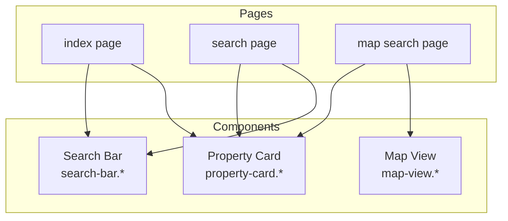
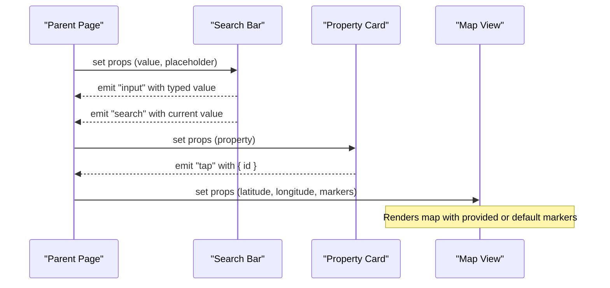
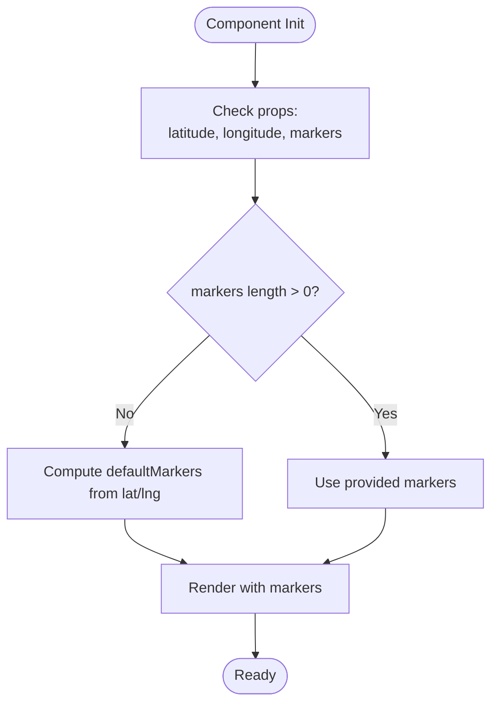
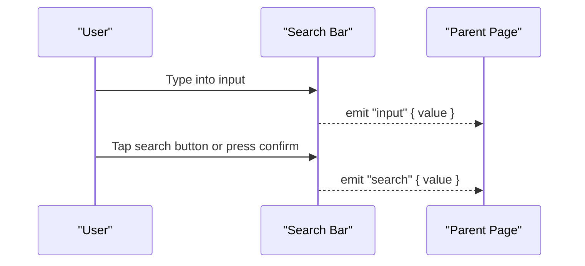
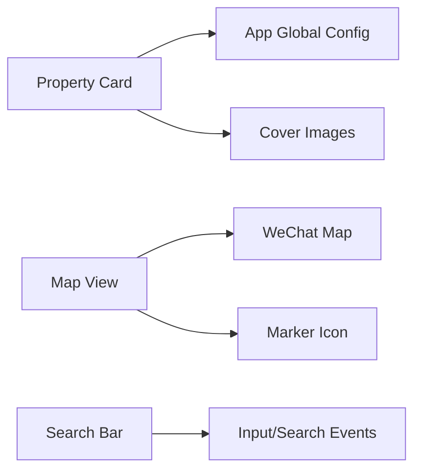

# Custom Components Development

<cite>
**Referenced Files in This Document**
- [property-card.js](file://wechat-miniprogram/components/property-card/property-card.js)
- [property-card.wxml](file://wechat-miniprogram/components/property-card/property-card.wxml)
- [property-card.wxss](file://wechat-miniprogram/components/property-card/property-card.wxss)
- [property-card.json](file://wechat-miniprogram/components/property-card/property-card.json)
- [map-view.js](file://wechat-miniprogram/components/map-view/map-view.js)
- [map-view.wxml](file://wechat-miniprogram/components/map-view/map-view.wxml)
- [map-view.wxss](file://wechat-miniprogram/components/map-view/map-view.wxss)
- [map-view.json](file://wechat-miniprogram/components/map-view/map-view.json)
- [search-bar.js](file://wechat-miniprogram/components/search-bar/search-bar.js)
- [search-bar.wxml](file://wechat-miniprogram/components/search-bar/search-bar.wxml)
- [search-bar.wxss](file://wechat-miniprogram/components/search-bar/search-bar.wxss)
- [search-bar.json](file://wechat-miniprogram/components/search-bar/search-bar.json)
</cite>

## Table of Contents
1. [Introduction](#introduction)
2. [Project Structure](#project-structure)
3. [Core Components](#core-components)
4. [Architecture Overview](#architecture-overview)
5. [Detailed Component Analysis](#detailed-component-analysis)
6. [Dependency Analysis](#dependency-analysis)
7. [Performance Considerations](#performance-considerations)
8. [Troubleshooting Guide](#troubleshooting-guide)
9. [Conclusion](#conclusion)

## Introduction
This document explains how to develop and compose custom components in the WeChat Mini Program for this project. It focuses on three reusable UI components:
- Property Card: displays property details with image, title, address, tags, and price; emits tap events to parent pages.
- Map View: renders a map with markers and supports default location pinning via properties.
- Search Bar: provides input handling and emits input and search events to parent pages.

The guide covers data binding, event emission, styling customization, prop validation patterns, composition strategies, state management, lifecycle usage, and performance best practices.

## Project Structure
Custom components are organized under wechat-miniprogram/components, each component folder containing:
- .js: component logic (properties, data, observers, methods)
- .wxml: template markup
- .wxss: styles scoped to the component
- .json: component registration metadata



[No sources needed since this diagram shows conceptual workflow, not actual code structure]

## Core Components
- Property Card
  - Purpose: Display a property card with cover image, title, address, optional tags, and price. Emits a tap event carrying the property id.
  - Data Binding: Receives a property object via a property; computes an absolute cover URL using app global base URL.
  - Events: Emits a tap event with payload { id }.
  - Styling: Scoped CSS defines layout, typography, tags, and price formatting.

- Map View
  - Purpose: Render a map centered at given coordinates and display either provided markers or a default marker based on latitude/longitude.
  - Data Binding: Accepts latitude, longitude, and markers properties; maintains defaultMarkers derived from lat/lng.
  - Interactivity: Uses built-in map features like show-location and scale.

- Search Bar
  - Purpose: Provide a text input with placeholder and a search button.
  - Data Binding: Binds value and placeholder via properties.
  - Events: Emits input events on typing and search events on confirm or button tap.

**Section sources**
- [property-card.js:1-30](file://wechat-miniprogram/components/property-card/property-card.js#L1-L30)
- [property-card.wxml:1-15](file://wechat-miniprogram/components/property-card/property-card.wxml#L1-L15)
- [property-card.wxss:1-66](file://wechat-miniprogram/components/property-card/property-card.wxss#L1-L66)
- [map-view.js:1-29](file://wechat-miniprogram/components/map-view/map-view.js#L1-L29)
- [map-view.wxml:1-10](file://wechat-miniprogram/components/map-view/map-view.wxml#L1-L10)
- [map-view.wxss:1-7](file://wechat-miniprogram/components/map-view/map-view.wxss#L1-L7)
- [search-bar.js:1-17](file://wechat-miniprogram/components/search-bar/search-bar.js#L1-L17)
- [search-bar.wxml:1-14](file://wechat-miniprogram/components/search-bar/search-bar.wxml#L1-L14)
- [search-bar.wxss:1-25](file://wechat-miniprogram/components/search-bar/search-bar.wxss#L1-L25)

## Architecture Overview
The components follow a unidirectional data flow pattern:
- Parent pages pass props down to components.
- Components emit events upward to notify parents of user interactions or internal changes.
- Styles are encapsulated per component.



**Diagram sources**
- [search-bar.js:8-16](file://wechat-miniprogram/components/search-bar/search-bar.js#L8-L16)
- [property-card.js:24-28](file://wechat-miniprogram/components/property-card/property-card.js#L24-L28)
- [map-view.js:13-27](file://wechat-miniprogram/components/map-view/map-view.js#L13-L27)

## Detailed Component Analysis

### Property Card Component
- Properties
  - property: Object, default {}. Used to render title, address, tags, price, and cover image.
- Data
  - coverUrl: String, computed from property.cover_url and app.globalData.baseUrl.
- Observers
  - Watches property changes; updates coverUrl when cover_url is present.
- Methods
  - onTap(): triggers a 'tap' event with { id: property.id }.
- Template
  - Displays cover image with lazy loading, title, address, conditional tags, and formatted price.
- Styles
  - Card container, cover image sizing, body padding, typography, tag chips, and price emphasis.

```mermaid
classDiagram
class PropertyCard {
+Object property
+String coverUrl
+onTap()
}
class ParentPage {
+handleCardTap(e)
}
ParentPage --> PropertyCard : "passes property prop"
PropertyCard -->> ParentPage : "emits 'tap' event"
```

**Diagram sources**
- [property-card.js:3-8](file://wechat-miniprogram/components/property-card/property-card.js#L3-L8)
- [property-card.js:14-22](file://wechat-miniprogram/components/property-card/property-card.js#L14-L22)
- [property-card.js:24-28](file://wechat-miniprogram/components/property-card/property-card.js#L24-L28)
- [property-card.wxml:1-15](file://wechat-miniprogram/components/property-card/property-card.wxml#L1-L15)
- [property-card.wxss:1-66](file://wechat-miniprogram/components/property-card/property-card.wxss#L1-L66)

**Section sources**
- [property-card.js:1-30](file://wechat-miniprogram/components/property-card/property-card.js#L1-L30)
- [property-card.wxml:1-15](file://wechat-miniprogram/components/property-card/property-card.wxml#L1-L15)
- [property-card.wxss:1-66](file://wechat-miniprogram/components/property-card/property-card.wxss#L1-L66)
- [property-card.json:1-4](file://wechat-miniprogram/components/property-card/property-card.json#L1-L4)

### Map View Component
- Properties
  - latitude: Number, default 31.299
  - longitude: Number, default 120.585
  - markers: Array, default []
- Data
  - defaultMarkers: Array, computed from latitude/longitude to provide a single marker if none provided.
- Observers
  - When latitude or longitude change, sets defaultMarkers with a marker icon and callout content.
- Template
  - Renders a map with provided markers or defaultMarkers; enables show-location and sets scale.
- Styles
  - Full-width map with rounded corners and fixed height.



**Diagram sources**
- [map-view.js:3-7](file://wechat-miniprogram/components/map-view/map-view.js#L3-L7)
- [map-view.js:13-27](file://wechat-miniprogram/components/map-view/map-view.js#L13-L27)
- [map-view.wxml:2-9](file://wechat-miniprogram/components/map-view/map-view.wxml#L2-L9)
- [map-view.wxss:1-7](file://wechat-miniprogram/components/map-view/map-view.wxss#L1-L7)

**Section sources**
- [map-view.js:1-29](file://wechat-miniprogram/components/map-view/map-view.js#L1-L29)
- [map-view.wxml:1-10](file://wechat-miniprogram/components/map-view/map-view.wxml#L1-L10)
- [map-view.wxss:1-7](file://wechat-miniprogram/components/map-view/map-view.wxss#L1-L7)
- [map-view.json:1-4](file://wechat-miniprogram/components/map-view/map-view.json#L1-L4)

### Search Bar Component
- Properties
  - value: String, default ''
  - placeholder: String, default '搜索房源'
- Methods
  - onInput(e): emits 'input' with e.detail.value
  - onSearch(): emits 'search' with current value
- Template
  - Input bound to value and placeholder; binds input and confirm events; includes a search button that triggers onSearch.
- Styles
  - Flex layout, input field styling, and search button color.



**Diagram sources**
- [search-bar.js:8-16](file://wechat-miniprogram/components/search-bar/search-bar.js#L8-L16)
- [search-bar.wxml:2-13](file://wechat-miniprogram/components/search-bar/search-bar.wxml#L2-L13)
- [search-bar.wxss:1-25](file://wechat-miniprogram/components/search-bar/search-bar.wxss#L1-L25)

**Section sources**
- [search-bar.js:1-17](file://wechat-miniprogram/components/search-bar/search-bar.js#L1-L17)
- [search-bar.wxml:1-14](file://wechat-miniprogram/components/search-bar/search-bar.wxml#L1-L14)
- [search-bar.wxss:1-25](file://wechat-miniprogram/components/search-bar/search-bar.wxss#L1-L25)
- [search-bar.json:1-4](file://wechat-miniprogram/components/search-bar/search-bar.json#L1-L4)

## Dependency Analysis
- Property Card depends on:
  - App global configuration for base URL resolution (via getApp().globalData.baseUrl).
  - Image resource paths for cover images.
- Map View depends on:
  - WeChat map native component capabilities.
  - Marker icon asset path (/images/marker.png).
- Search Bar has no external dependencies beyond standard input events.



**Diagram sources**
- [property-card.js:14-22](file://wechat-miniprogram/components/property-card/property-card.js#L14-L22)
- [map-view.js:13-27](file://wechat-miniprogram/components/map-view/map-view.js#L13-L27)

**Section sources**
- [property-card.js:14-22](file://wechat-miniprogram/components/property-card/property-card.js#L14-L22)
- [map-view.js:13-27](file://wechat-miniprogram/components/map-view/map-view.js#L13-L27)

## Performance Considerations
- Property Card
  - Use lazy-load for images to reduce initial load time.
  - Avoid heavy computations in observers; keep coverUrl derivation minimal.
  - Prefer stable property structures to minimize re-renders.
- Map View
  - Limit the number of markers passed to avoid rendering overhead.
  - Reuse marker objects and avoid frequent full array replacements; update only changed entries.
  - Keep defaultMarkers computation simple and triggered only on coordinate changes.
- Search Bar
  - Debounce input events at the parent level if performing expensive filtering or network requests.
  - Avoid unnecessary setData calls inside the component; rely on event emission instead.

[No sources needed since this section provides general guidance]

## Troubleshooting Guide
- Property Card
  - Cover image not displaying: ensure property.cover_url exists and baseUrl resolves correctly; verify uploads path construction.
  - Tap event not received: confirm parent page listens to the 'tap' event and handles payload { id }.
- Map View
  - Default marker missing: check that latitude/longitude are valid numbers and /images/marker.png exists.
  - Provided markers ignored: ensure markers array is non-empty; otherwise defaultMarkers will be used.
- Search Bar
  - Input not updating: verify parent page binds to the 'input' event and updates its local value accordingly.
  - Search action not firing: ensure both bindconfirm and button tap trigger onSearch.

**Section sources**
- [property-card.js:14-22](file://wechat-miniprogram/components/property-card/property-card.js#L14-L22)
- [property-card.js:24-28](file://wechat-miniprogram/components/property-card/property-card.js#L24-L28)
- [map-view.js:13-27](file://wechat-miniprogram/components/map-view/map-view.js#L13-L27)
- [search-bar.js:8-16](file://wechat-miniprogram/components/search-bar/search-bar.js#L8-L16)

## Conclusion
These three components demonstrate a clean, maintainable approach to building reusable UI elements in the WeChat Mini Program:
- Clear prop contracts and event emissions enable predictable parent-child communication.
- Observers simplify derived data computation while keeping templates declarative.
- Scoped styles ensure visual consistency without leakage.
Adopting these patterns helps create scalable, testable, and performant mini program interfaces.