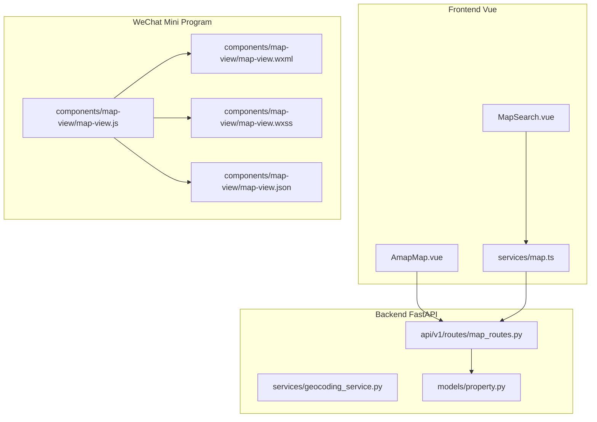
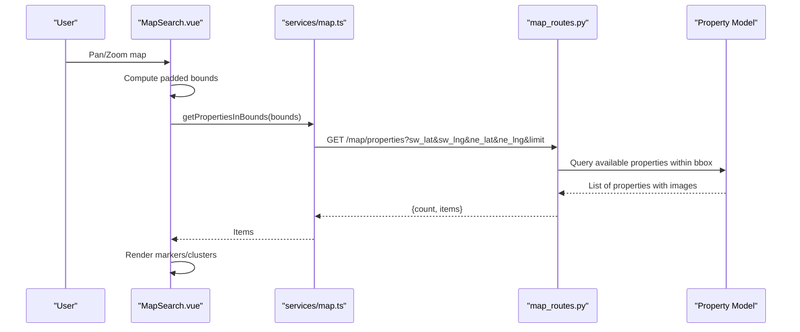
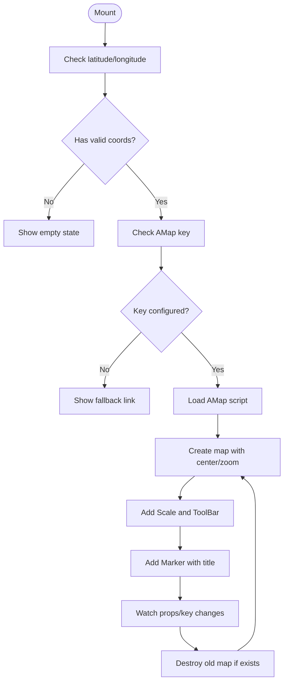
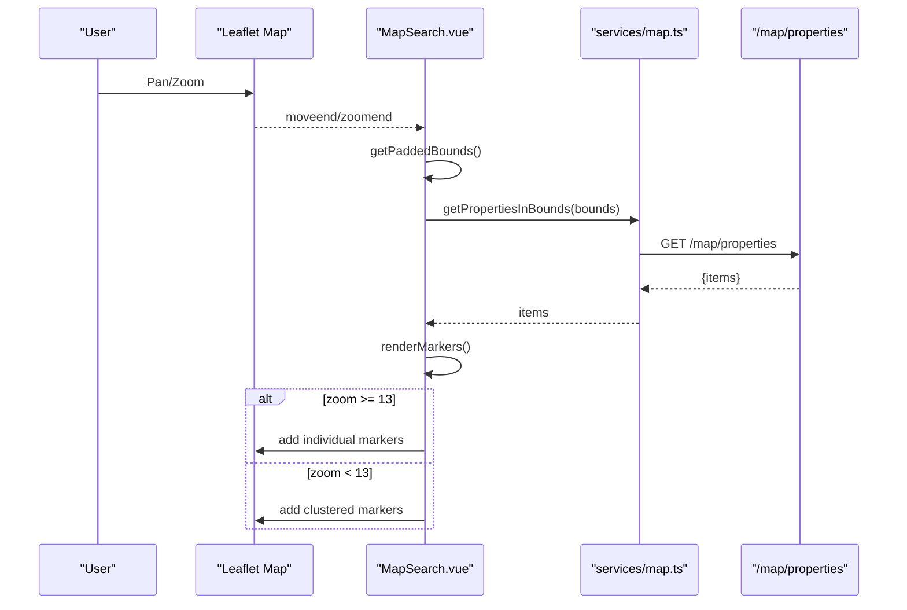
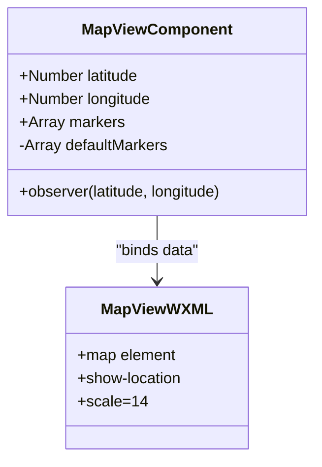
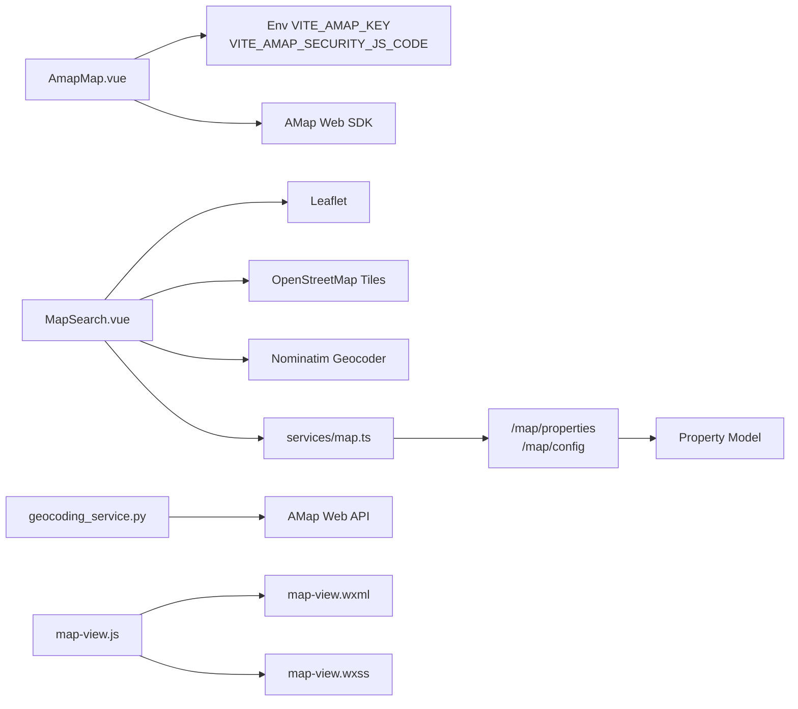

# Map View Component

<cite>
**Referenced Files in This Document**
- [AmapMap.vue](file://frontend/src/components/AmapMap.vue)
- [MapSearch.vue](file://frontend/src/views/MapSearch.vue)
- [map.ts](file://frontend/src/services/map.ts)
- [map_routes.py](file://backend/app/api/v1/routes/map_routes.py)
- [geocoding_service.py](file://backend/app/services/geocoding_service.py)
- [property.py](file://backend/app/models/property.py)
- [map-view.js](file://wechat-miniprogram/components/map-view/map-view.js)
- [map-view.wxml](file://wechat-miniprogram/components/map-view/map-view.wxml)
- [map-view.wxss](file://wechat-miniprogram/components/map-view/map-view.wxss)
- [map-view.json](file://wechat-miniprogram/components/map-view/map-view.json)
</cite>

## Table of Contents
1. [Introduction](#introduction)
2. [Project Structure](#project-structure)
3. [Core Components](#core-components)
4. [Architecture Overview](#architecture-overview)
5. [Detailed Component Analysis](#detailed-component-analysis)
6. [Dependency Analysis](#dependency-analysis)
7. [Performance Considerations](#performance-considerations)
8. [Troubleshooting Guide](#troubleshooting-guide)
9. [Conclusion](#conclusion)
10. [Appendices](#appendices)

## Introduction
This document explains the Map View component implementation across three platforms:
- Vue web frontend with two map implementations:
  - A lightweight, embeddable AMap (Gaode) marker card for property details.
  - An interactive Leaflet-based map search page with clustering and viewport queries.
- WeChat Mini Program embedded map component for property detail pages.

It covers location services integration, map initialization, marker management, interactive features (user location detection, zoom controls, navigation), API surface for markers and events, configuration options (appearance, custom markers, geolocation permissions), examples integrating with property listings and search by location, and error handling with fallback strategies.

## Project Structure
The map-related code spans frontend components, services, backend routes, and a mini program component:
- Frontend Vue:
  - AmapMap.vue: Embeds AMap to show a single property marker with scale and toolbar controls; supports fallback to external link if key is missing.
  - MapSearch.vue: Full-screen Leaflet map with OpenStreetMap tiles, viewport-based property loading, manual clustering, and city search via Nominatim.
  - map.ts: Types and service methods for map endpoints (/map/properties, /map/config).
- Backend FastAPI:
  - map_routes.py: Endpoints for viewport property query and map config.
  - geocoding_service.py: AMap geocoding and nearby POI lookup utilities used elsewhere in the app.
  - property.py: Property model including latitude/longitude fields used by map endpoints.
- WeChat Mini Program:
  - map-view.*: Reusable map component that renders a default marker based on props and shows user location.

**Diagram sources**
- [AmapMap.vue:1-198](file://frontend/src/components/AmapMap.vue#L1-L198)
- [MapSearch.vue:1-612](file://frontend/src/views/MapSearch.vue#L1-L612)
- [map.ts:1-57](file://frontend/src/services/map.ts#L1-L57)
- [map_routes.py:1-80](file://backend/app/api/v1/routes/map_routes.py#L1-L80)
- [geocoding_service.py:1-145](file://backend/app/services/geocoding_service.py#L1-L145)
- [property.py:1-86](file://backend/app/models/property.py#L1-L86)
- [map-view.js:1-29](file://wechat-miniprogram/components/map-view/map-view.js#L1-L29)
- [map-view.wxml:1-10](file://wechat-miniprogram/components/map-view/map-view.wxml#L1-L10)
- [map-view.wxss:1-7](file://wechat-miniprogram/components/map-view/map-view.wxss#L1-L7)
- [map-view.json:1-4](file://wechat-miniprogram/components/map-view/map-view.json#L1-L4)

**Section sources**
- [AmapMap.vue:1-198](file://frontend/src/components/AmapMap.vue#L1-L198)
- [MapSearch.vue:1-612](file://frontend/src/views/MapSearch.vue#L1-L612)
- [map.ts:1-57](file://frontend/src/services/map.ts#L1-L57)
- [map_routes.py:1-80](file://backend/app/api/v1/routes/map_routes.py#L1-L80)
- [geocoding_service.py:1-145](file://backend/app/services/geocoding_service.py#L1-L145)
- [property.py:1-86](file://backend/app/models/property.py#L1-L86)
- [map-view.js:1-29](file://wechat-miniprogram/components/map-view/map-view.js#L1-L29)
- [map-view.wxml:1-10](file://wechat-miniprogram/components/map-view/map-view.wxml#L1-L10)
- [map-view.wxss:1-7](file://wechat-miniprogram/components/map-view/map-view.wxss#L1-L7)
- [map-view.json:1-4](file://wechat-miniprogram/components/map-view/map-view.json#L1-L4)

## Core Components
- AmapMap.vue
  - Purpose: Display a single property on AMap with optional scale and toolbar controls; provide an external link fallback when AMap key is not configured.
  - Key behaviors:
    - Dynamically loads AMap script with security config if present.
    - Initializes map at provided coordinates with configurable zoom and height.
    - Adds Scale and ToolBar controls and a Marker with title from address.
    - Watches coordinate and key changes to reinitialize safely.
    - Cleans up map instance on unmount.
  - Configuration props:
    - latitude, longitude, address, height, zoom.
  - Fallback behavior:
    - If no coordinates or AMap key missing, shows empty state and provides an external AMap link.

- MapSearch.vue
  - Purpose: Interactive map search using Leaflet + OpenStreetMap tiles.
  - Key behaviors:
    - Fixes Leaflet default icon paths.
    - Loads properties within current viewport bounds via /map/properties.
    - Debounces moveend/zoomend to avoid excessive requests.
    - Renders individual markers when zoom >= 13; otherwise clusters into grid-based groups.
    - Provides city search via Nominatim and resets to national view.
    - Side drawer lists viewport properties with images and price info; clicking flies to property and opens popup.
  - Interactions:
    - Move/zoom triggers data refresh.
    - Clicking cluster zooms into area.
    - Clicking list item navigates to property marker and opens popup.

- map.ts
  - Purpose: Typed client for map endpoints.
  - Methods:
    - getPropertiesInBounds(bounds, limit): Fetches lightweight property items for map display.
    - getConfig(): Retrieves map configuration such as AMap key and default center/zoom.

- Backend map_routes.py
  - Endpoints:
    - GET /map/properties: Returns available properties with images filtered by bounding box and status.
    - GET /map/config: Returns AMap JS key and default center/zoom.

- geocoding_service.py
  - Purpose: AMap geocoding and nearby POI lookup utilities used by other parts of the application (e.g., address-to-coordinates conversion).

- property.py
  - Data model includes latitude/longitude numeric fields used by map endpoints.

- WeChat Mini Program map-view.*
  - Purpose: Embedded map showing a default marker derived from props and enabling user location display.
  - Behavior:
    - Observes latitude/longitude and sets defaultMarkers accordingly.
    - Uses native <map> with show-location and fixed scale.

**Section sources**
- [AmapMap.vue:1-198](file://frontend/src/components/AmapMap.vue#L1-L198)
- [MapSearch.vue:1-612](file://frontend/src/views/MapSearch.vue#L1-L612)
- [map.ts:1-57](file://frontend/src/services/map.ts#L1-L57)
- [map_routes.py:1-80](file://backend/app/api/v1/routes/map_routes.py#L1-L80)
- [geocoding_service.py:1-145](file://backend/app/services/geocoding_service.py#L1-L145)
- [property.py:1-86](file://backend/app/models/property.py#L1-L86)
- [map-view.js:1-29](file://wechat-miniprogram/components/map-view/map-view.js#L1-L29)
- [map-view.wxml:1-10](file://wechat-miniprogram/components/map-view/map-view.wxml#L1-L10)
- [map-view.wxss:1-7](file://wechat-miniprogram/components/map-view/map-view.wxss#L1-L7)
- [map-view.json:1-4](file://wechat-miniprogram/components/map-view/map-view.json#L1-L4)

## Architecture Overview
End-to-end flow for map-driven property discovery:

**Diagram sources**
- [MapSearch.vue:124-167](file://frontend/src/views/MapSearch.vue#L124-L167)
- [map.ts:38-56](file://frontend/src/services/map.ts#L38-L56)
- [map_routes.py:14-68](file://backend/app/api/v1/routes/map_routes.py#L14-L68)
- [property.py:38-86](file://backend/app/models/property.py#L38-L86)

## Detailed Component Analysis

### AMap Embeddable Card (AmapMap.vue)
- Initialization
  - Conditionally loads AMap script with optional security code.
  - Creates map instance centered at provided coordinates with configurable zoom and adds Scale and ToolBar controls.
  - Places a Marker with title from resolved address.
- Lifecycle
  - Watches coordinates and AMap key; reinitializes map safely.
  - Destroys previous map instance before creating new one; cleans up on unmount.
- Fallbacks
  - If no coordinates or AMap key missing, displays empty state and offers an external AMap link.

**Diagram sources**
- [AmapMap.vue:66-139](file://frontend/src/components/AmapMap.vue#L66-L139)

**Section sources**
- [AmapMap.vue:1-198](file://frontend/src/components/AmapMap.vue#L1-L198)

### Leaflet Map Search Page (MapSearch.vue)
- Initialization
  - Fixes Leaflet default marker icons.
  - Creates map with OSM tile layer, min/max zoom, and initial center/zoom.
  - Adds empty marker and cluster layers; invalidates size after mount.
- Data Loading
  - Computes padded bounds from current viewport.
  - Debounced load on moveend/zoomend to fetch properties within bounds.
- Rendering
  - At zoom >= 13: render individual markers with popups.
  - Below threshold: perform manual grid clustering; cluster icons show count and price range; clicking cluster flies to area.
- Navigation
  - City search via Nominatim; reset to national view.
  - Drawer list click flies to property and opens popup.

**Diagram sources**
- [MapSearch.vue:333-362](file://frontend/src/views/MapSearch.vue#L333-L362)
- [MapSearch.vue:124-167](file://frontend/src/views/MapSearch.vue#L124-L167)
- [MapSearch.vue:148-253](file://frontend/src/views/MapSearch.vue#L148-L253)
- [map.ts:38-56](file://frontend/src/services/map.ts#L38-L56)

**Section sources**
- [MapSearch.vue:1-612](file://frontend/src/views/MapSearch.vue#L1-612)
- [map.ts:1-57](file://frontend/src/services/map.ts#L1-L57)

### WeChat Mini Program Map View (map-view.*)
- Props and defaults
  - latitude, longitude, markers; default markers computed from props.
- Behavior
  - Observer updates defaultMarkers when latitude/longitude change.
  - Native <map> shows user location and uses provided or default markers.
- Styling and registration
  - wxss defines map dimensions and border radius.
  - json declares component usage.

**Diagram sources**
- [map-view.js:1-29](file://wechat-miniprogram/components/map-view/map-view.js#L1-L29)
- [map-view.wxml:1-10](file://wechat-miniprogram/components/map-view/map-view.wxml#L1-L10)
- [map-view.wxss:1-7](file://wechat-miniprogram/components/map-view/map-view.wxss#L1-L7)
- [map-view.json:1-4](file://wechat-miniprogram/components/map-view/map-view.json#L1-L4)

**Section sources**
- [map-view.js:1-29](file://wechat-miniprogram/components/map-view/map-view.js#L1-L29)
- [map-view.wxml:1-10](file://wechat-miniprogram/components/map-view/map-view.wxml#L1-L10)
- [map-view.wxss:1-7](file://wechat-miniprogram/components/map-view/map-view.wxss#L1-L7)
- [map-view.json:1-4](file://wechat-miniprogram/components/map-view/map-view.json#L1-L4)

## Dependency Analysis
- Frontend dependencies
  - AmapMap.vue depends on environment variables for AMap key and security code; dynamically loads AMap SDK.
  - MapSearch.vue depends on Leaflet and OSM tiles; uses Nominatim for geocoding; calls backend /map/properties.
  - map.ts types and methods abstract backend map endpoints.
- Backend dependencies
  - map_routes.py depends on database session, Property model, and settings for AMap keys.
  - geocoding_service.py depends on AMap web key and HTTP client for geocoding/nearby searches.
  - property.py defines schema for latitude/longitude used by map endpoints.
- Mini program dependencies
  - map-view.* relies on platform-native map capabilities and local image assets.

**Diagram sources**
- [AmapMap.vue:54-87](file://frontend/src/components/AmapMap.vue#L54-L87)
- [MapSearch.vue:71-85](file://frontend/src/views/MapSearch.vue#L71-L85)
- [MapSearch.vue:279-301](file://frontend/src/views/MapSearch.vue#L279-L301)
- [map.ts:38-56](file://frontend/src/services/map.ts#L38-L56)
- [map_routes.py:14-80](file://backend/app/api/v1/routes/map_routes.py#L14-L80)
- [geocoding_service.py:38-85](file://backend/app/services/geocoding_service.py#L38-L85)
- [map-view.js:1-29](file://wechat-miniprogram/components/map-view/map-view.js#L1-L29)
- [map-view.wxml:1-10](file://wechat-miniprogram/components/map-view/map-view.wxml#L1-L10)
- [map-view.wxss:1-7](file://wechat-miniprogram/components/map-view/map-view.wxss#L1-L7)

**Section sources**
- [AmapMap.vue:1-198](file://frontend/src/components/AmapMap.vue#L1-L198)
- [MapSearch.vue:1-612](file://frontend/src/views/MapSearch.vue#L1-L612)
- [map.ts:1-57](file://frontend/src/services/map.ts#L1-L57)
- [map_routes.py:1-80](file://backend/app/api/v1/routes/map_routes.py#L1-L80)
- [geocoding_service.py:1-145](file://backend/app/services/geocoding_service.py#L1-L145)
- [property.py:1-86](file://backend/app/models/property.py#L1-L86)
- [map-view.js:1-29](file://wechat-miniprogram/components/map-view/map-view.js#L1-L29)
- [map-view.wxml:1-10](file://wechat-miniprogram/components/map-view/map-view.wxml#L1-L10)
- [map-view.wxss:1-7](file://wechat-miniprogram/components/map-view/map-view.wxss#L1-L7)
- [map-view.json:1-4](file://wechat-miniprogram/components/map-view/map-view.json#L1-L4)

## Performance Considerations
- Debouncing viewport queries reduces network overhead during pan/zoom.
- Manual clustering avoids heavy third-party libraries and allows custom UI for counts and price ranges.
- Conditional rendering of markers vs clusters based on zoom level balances detail and performance.
- Dynamic AMap script loading prevents blocking initial page load and enables graceful fallback.
- Limiting returned properties via limit parameter prevents large payloads.

[No sources needed since this section provides general guidance]

## Troubleshooting Guide
- AMap script fails to load
  - Symptom: Empty state with message indicating script load failure.
  - Action: Verify VITE_AMAP_KEY and VITE_AMAP_SECURITY_JS_CODE; ensure network access to AMap CDN.
- Missing AMap key
  - Symptom: Empty state with suggestion to use external link.
  - Action: Configure AMap key in environment; test /map/config endpoint availability.
- No properties in viewport
  - Symptom: “No properties in current area” hint.
  - Action: Zoom out or move map; verify backend /map/properties returns data for bounds; check property latitude/longitude presence.
- Leaflet marker icons missing
  - Symptom: Broken marker icons.
  - Action: Ensure Leaflet CSS and asset imports are correct; confirm mergeOptions overrides default icon URLs.
- Geocoding errors
  - Symptom: Errors when searching locations or converting addresses.
  - Action: For Nominatim, check network and rate limits; for AMap geocoding, ensure AMAP_WEB_KEY is set and timeouts are appropriate.

**Section sources**
- [AmapMap.vue:66-87](file://frontend/src/components/AmapMap.vue#L66-L87)
- [MapSearch.vue:279-301](file://frontend/src/views/MapSearch.vue#L279-L301)
- [geocoding_service.py:46-85](file://backend/app/services/geocoding_service.py#L46-L85)

## Conclusion
The Map View implementation provides flexible mapping experiences across platforms:
- AMap embeddable card for simple property visualization with robust fallbacks.
- Leaflet-based interactive map search with efficient viewport queries and manual clustering.
- WeChat Mini Program map component for native mobile experience.
Together, they integrate with backend endpoints and geocoding services to deliver rich location-driven property discovery.

[No sources needed since this section summarizes without analyzing specific files]

## Appendices

### API Surface and Usage Examples

- Adding markers (Vue AMap card)
  - Provide latitude, longitude, and address props; the component initializes AMap and places a marker automatically.
  - Example path: [AmapMap.vue:105-122](file://frontend/src/components/AmapMap.vue#L105-L122)

- Handling map events (Leaflet)
  - Listen to moveend/zoomend to trigger debounced viewport queries.
  - Example path: [MapSearch.vue:353-356](file://frontend/src/views/MapSearch.vue#L353-L356)

- Managing map state (Leaflet)
  - Maintain markerLayer and clusterLayer; clear and repopulate on data changes.
  - Example path: [MapSearch.vue:148-167](file://frontend/src/views/MapSearch.vue#L148-L167)

- Configuration options
  - AMap card: latitude, longitude, address, height, zoom.
  - Leaflet map: center, zoom, minZoom, maxZoom, tile layer URL.
  - Paths:
    - [AmapMap.vue:37-50](file://frontend/src/components/AmapMap.vue#L37-L50)
    - [MapSearch.vue:336-347](file://frontend/src/views/MapSearch.vue#L336-L347)

- Custom markers
  - Leaflet: Use L.marker with custom icon or divIcon for clusters.
  - AMap: Use AMap.Marker with position and title.
  - Paths:
    - [MapSearch.vue:170-186](file://frontend/src/views/MapSearch.vue#L170-L186)
    - [AmapMap.vue:115-119](file://frontend/src/components/AmapMap.vue#L115-L119)

- Geolocation permissions
  - Leaflet: No built-in permission prompts; rely on browser APIs if adding locate control.
  - AMap: Depends on browser/device permissions if using built-in location features.
  - Mini Program: show-location requires user permission; configure in app manifest if required.

- Integrating with property listings
  - Use /map/properties to populate markers for current viewport.
  - Path: [map.ts:38-50](file://frontend/src/services/map.ts#L38-L50)

- Implementing search by location
  - Use Nominatim for city search; flyTo result and update map.
  - Path: [MapSearch.vue:279-301](file://frontend/src/views/MapSearch.vue#L279-L301)

- Error handling and fallbacks
  - AMap script load failure and missing key fallback to external link.
  - Network errors for viewport queries handled gracefully with empty states.
  - Paths:
    - [AmapMap.vue:66-87](file://frontend/src/components/AmapMap.vue#L66-L87)
    - [MapSearch.vue:124-137](file://frontend/src/views/MapSearch.vue#L124-L137)

**Section sources**
- [AmapMap.vue:37-50](file://frontend/src/components/AmapMap.vue#L37-L50)
- [AmapMap.vue:105-122](file://frontend/src/components/AmapMap.vue#L105-L122)
- [AmapMap.vue:66-87](file://frontend/src/components/AmapMap.vue#L66-L87)
- [MapSearch.vue:124-137](file://frontend/src/views/MapSearch.vue#L124-L137)
- [MapSearch.vue:148-167](file://frontend/src/views/MapSearch.vue#L148-L167)
- [MapSearch.vue:170-186](file://frontend/src/views/MapSearch.vue#L170-L186)
- [MapSearch.vue:279-301](file://frontend/src/views/MapSearch.vue#L279-L301)
- [MapSearch.vue:336-347](file://frontend/src/views/MapSearch.vue#L336-L347)
- [map.ts:38-50](file://frontend/src/services/map.ts#L38-L50)