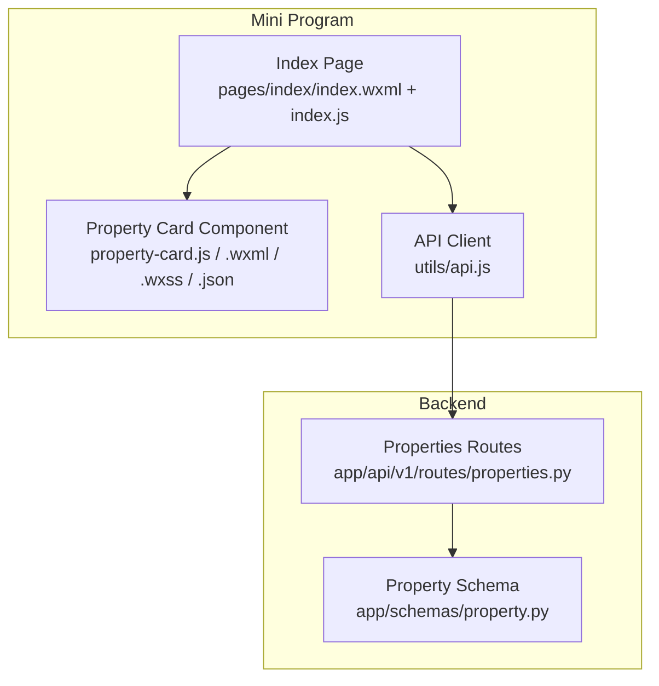
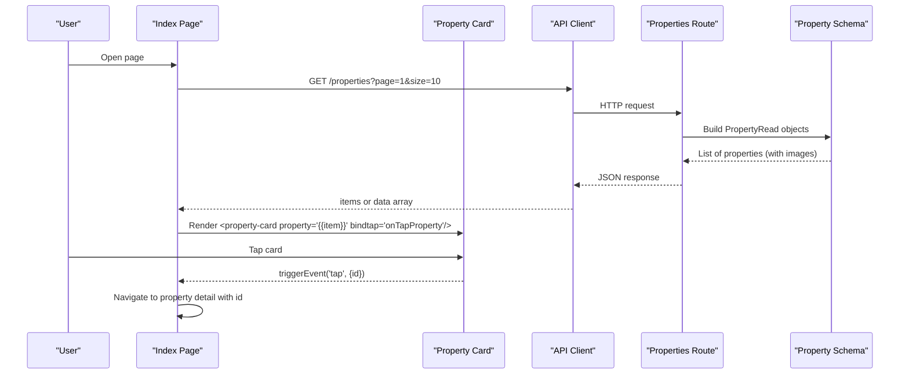
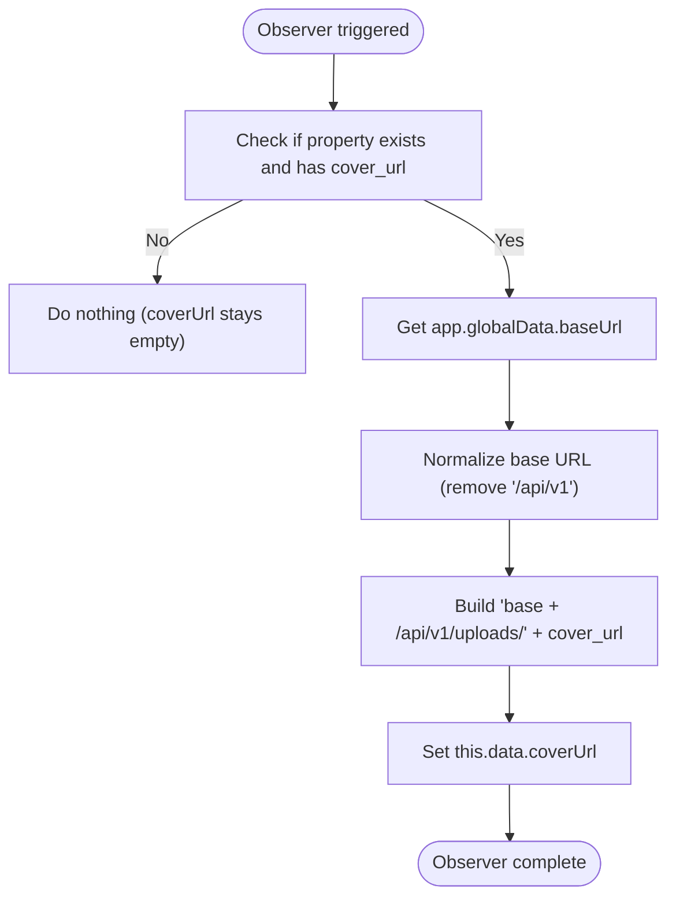
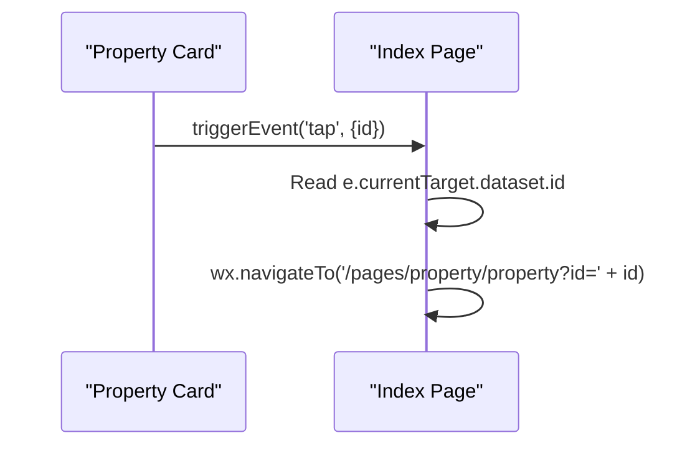
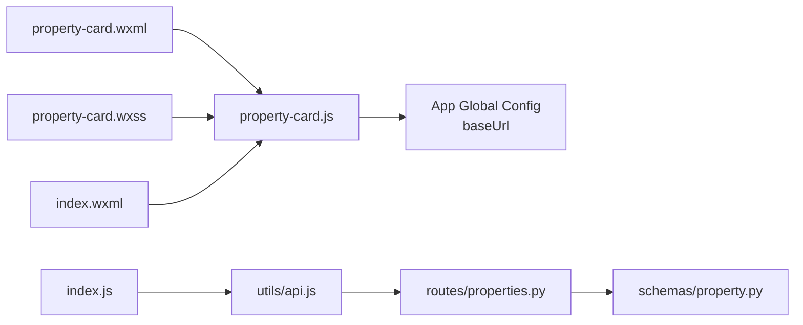

# Property Card Component

<cite>
**Referenced Files in This Document**
- [property-card.js](file://wechat-miniprogram/components/property-card/property-card.js)
- [property-card.wxml](file://wechat-miniprogram/components/property-card/property-card.wxml)
- [property-card.wxss](file://wechat-miniprogram/components/property-card/property-card.wxss)
- [property-card.json](file://wechat-miniprogram/components/property-card/property-card.json)
- [index.wxml](file://wechat-miniprogram/pages/index/index.wxml)
- [index.js](file://wechat-miniprogram/pages/index/index.js)
- [api.js](file://wechat-miniprogram/utils/api.js)
- [property.py](file://backend/app/schemas/property.py)
- [properties.py](file://backend/app/api/v1/routes/properties.py)
</cite>

## Table of Contents
1. [Introduction](#introduction)
2. [Project Structure](#project-structure)
3. [Core Components](#core-components)
4. [Architecture Overview](#architecture-overview)
5. [Detailed Component Analysis](#detailed-component-analysis)
6. [Dependency Analysis](#dependency-analysis)
7. [Performance Considerations](#performance-considerations)
8. [Troubleshooting Guide](#troubleshooting-guide)
9. [Conclusion](#conclusion)

## Introduction
This document provides comprehensive documentation for the WeChat Mini Program Property Card component. It explains how the component receives a property object, resolves image URLs using a base URL, binds data via observers, emits tap events with parameters, and renders responsive card UI. It also covers integration patterns with parent pages, styling customization options, image loading strategies, performance optimization techniques, and best practices for reusable card components.

## Project Structure
The Property Card is implemented as a standard WeChat Mini Program component composed of four files: JavaScript logic, WXML template, WXSS styles, and component registration JSON. The component is consumed by the index page to render a list of recommended properties.

**Diagram sources**
- [property-card.js:1-29](file://wechat-miniprogram/components/property-card/property-card.js#L1-L29)
- [property-card.wxml:1-15](file://wechat-miniprogram/components/property-card/property-card.wxml#L1-L15)
- [property-card.wxss:1-66](file://wechat-miniprogram/components/property-card/property-card.wxss#L1-L66)
- [property-card.json:1-4](file://wechat-miniprogram/components/property-card/property-card.json#L1-L4)
- [index.wxml:32-37](file://wechat-miniprogram/pages/index/index.wxml#L32-L37)
- [index.js:26-37](file://wechat-miniprogram/pages/index/index.js#L26-L37)
- [api.js:1-52](file://wechat-miniprogram/utils/api.js#L1-L52)
- [properties.py:94-107](file://backend/app/api/v1/routes/properties.py#L94-L107)
- [property.py:46-60](file://backend/app/schemas/property.py#L46-L60)

**Section sources**
- [property-card.js:1-29](file://wechat-miniprogram/components/property-card/property-card.js#L1-L29)
- [property-card.wxml:1-15](file://wechat-miniprogram/components/property-card/property-card.wxml#L1-L15)
- [property-card.wxss:1-66](file://wechat-miniprogram/components/property-card/property-card.wxss#L1-L66)
- [property-card.json:1-4](file://wechat-miniprogram/components/property-card/property-card.json#L1-L4)
- [index.wxml:32-37](file://wechat-miniprogram/pages/index/index.wxml#L32-L37)
- [index.js:26-37](file://wechat-miniprogram/pages/index/index.js#L26-L37)
- [api.js:1-52](file://wechat-miniprogram/utils/api.js#L1-L52)
- [properties.py:94-107](file://backend/app/api/v1/routes/properties.py#L94-L107)
- [property.py:46-60](file://backend/app/schemas/property.py#L46-L60)

## Core Components
- Property Card Component
  - Properties: Accepts a single property object.
  - Data Binding: Uses an observer on the property prop to compute coverUrl from cover_url and global base URL.
  - Event Emission: Emits a tap event carrying the property id.
  - Template: Renders cover image, title, address, optional tags, and price with unit.
  - Styles: Provides card layout, typography, tag chips, and price formatting.

Key responsibilities:
- Resolve absolute image URL from relative filename using app.globalData.baseUrl.
- Reactively update internal state when the property prop changes.
- Emit user interaction events to parent pages.

**Section sources**
- [property-card.js:3-22](file://wechat-miniprogram/components/property-card/property-card.js#L3-L22)
- [property-card.wxml:1-15](file://wechat-miniprogram/components/property-card/property-card.wxml#L1-L15)
- [property-card.wxss:1-66](file://wechat-miniprogram/components/property-card/property-card.wxss#L1-L66)

## Architecture Overview
The Property Card integrates into the Index page’s recommended property list. The Index page fetches a list of properties from the backend, maps them to the component’s expected shape, and listens to tap events to navigate to the detail page.

**Diagram sources**
- [index.js:26-37](file://wechat-miniprogram/pages/index/index.js#L26-L37)
- [index.wxml:32-37](file://wechat-miniprogram/pages/index/index.wxml#L32-L37)
- [property-card.js:24-28](file://wechat-miniprogram/components/property-card/property-card.js#L24-L28)
- [api.js:1-52](file://wechat-miniprogram/utils/api.js#L1-L52)
- [properties.py:94-107](file://backend/app/api/v1/routes/properties.py#L94-L107)
- [property.py:46-60](file://backend/app/schemas/property.py#L46-L60)

## Detailed Component Analysis

### Component Properties and Data Model
- Input property object fields used by the component:
  - id: number — used for navigation on tap.
  - title: string — displayed in the card header.
  - address: string — displayed below the title.
  - tags: string[] (optional) — rendered as small chips if present.
  - price: number — displayed with a monthly unit suffix.
  - cover_url: string (relative path) — resolved to an absolute URL using the global base URL.

Notes:
- The backend schema exposes images and a computed primary_image_url; however, the component expects cover_url at the top level of the item passed to it. Ensure the parent page maps the response accordingly before passing to the component.

**Section sources**
- [property-card.js:3-8](file://wechat-miniprogram/components/property-card/property-card.js#L3-L8)
- [property-card.wxml:1-15](file://wechat-miniprogram/components/property-card/property-card.wxml#L1-L15)
- [property.py:46-60](file://backend/app/schemas/property.py#L46-L60)

### Base URL Resolution and Cover Image Handling
- The component observes the property prop and computes coverUrl:
  - Reads app.globalData.baseUrl.
  - Normalizes the base by removing trailing /api/v1 segment.
  - Constructs final image URL by appending /api/v1/uploads/{cover_url}.
- If cover_url is missing or falsy, coverUrl remains empty and no image is shown.

**Diagram sources**
- [property-card.js:14-22](file://wechat-miniprogram/components/property-card/property-card.js#L14-L22)

**Section sources**
- [property-card.js:14-22](file://wechat-miniprogram/components/property-card/property-card.js#L14-L22)

### Data Binding Mechanism Using Observers
- Observer key: 'property'
- Behavior:
  - Triggers whenever the property prop changes.
  - Updates internal coverUrl reactively without requiring manual setData calls from the parent.
- Benefits:
  - Keeps the component self-contained for image URL resolution.
  - Simplifies parent code by avoiding repeated URL construction.

**Section sources**
- [property-card.js:14-22](file://wechat-miniprogram/components/property-card/property-card.js#L14-L22)

### Event Emission System and Tap Handling
- Interaction:
  - The root view binds a tap handler that triggers a custom 'tap' event.
  - The event payload includes the property id.
- Parent usage:
  - The Index page listens to bindtap and navigates to the property detail page with the id parameter.

**Diagram sources**
- [property-card.js:24-28](file://wechat-miniprogram/components/property-card/property-card.js#L24-L28)
- [index.wxml:32-37](file://wechat-miniprogram/pages/index/index.wxml#L32-L37)
- [index.js:56-60](file://wechat-miniprogram/pages/index/index.js#L56-L60)

**Section sources**
- [property-card.js:24-28](file://wechat-miniprogram/components/property-card/property-card.js#L24-L28)
- [index.wxml:32-37](file://wechat-miniprogram/pages/index/index.wxml#L32-L37)
- [index.js:56-60](file://wechat-miniprogram/pages/index/index.js#L56-L60)

### Styling Customization Options
- Layout and spacing:
  - Card border radius, margin, shadow, and overflow hidden are defined for consistent appearance.
- Typography:
  - Title uses line-clamp to truncate long titles across two lines.
  - Address uses muted color and smaller font size.
- Tags:
  - Optional tags are rendered as inline chips with background and rounded corners.
- Price:
  - Prominent price with a smaller unit label for “/月”.
- Responsive design:
  - Uses rpx units for scalable sizing across devices.
  - Flexbox layout for footer alignment.

Customization tips:
- Adjust .card-cover height to change image prominence.
- Modify .card-tag colors and padding to match brand guidelines.
- Change .card-price color and weight to emphasize pricing strategy.

**Section sources**
- [property-card.wxss:1-66](file://wechat-miniprogram/components/property-card/property-card.wxss#L1-L66)

### Image Loading Strategies
- Lazy loading:
  - The image element uses lazy-load to defer offscreen image downloads.
- Aspect ratio:
  - mode="aspectFill" ensures full coverage while preserving aspect ratio.
- Fallback behavior:
  - If cover_url is absent, the src remains empty and no image is displayed.

Best practices:
- Ensure cover_url is always provided for cards in lists.
- Consider adding a placeholder image when cover_url is missing.
- Use CDN or optimized image sizes for faster rendering.

**Section sources**
- [property-card.wxml:3](file://wechat-miniprogram/components/property-card/property-card.wxml#L3)
- [property-card.js:14-22](file://wechat-miniprogram/components/property-card/property-card.js#L14-L22)

### Integration with Parent Components
- Registration:
  - The component is declared in its own JSON file with "component": true.
- Usage in Index page:
  - The Index page iterates over recommendList and renders a property-card for each item.
  - The parent passes the entire item as the property prop and listens to the tap event.
- Data preparation:
  - The parent should map backend responses to include cover_url and other fields required by the component.

Example integration points:
- Component declaration: [property-card.json:1-4](file://wechat-miniprogram/components/property-card/property-card.json#L1-L4)
- Rendering loop and event binding: [index.wxml:32-37](file://wechat-miniprogram/pages/index/index.wxml#L32-L37)
- Fetching and setting recommendList: [index.js:26-37](file://wechat-miniprogram/pages/index/index.js#L26-L37)

**Section sources**
- [property-card.json:1-4](file://wechat-miniprogram/components/property-card/property-card.json#L1-L4)
- [index.wxml:32-37](file://wechat-miniprogram/pages/index/index.wxml#L32-L37)
- [index.js:26-37](file://wechat-miniprogram/pages/index/index.js#L26-L37)

### Prop Validation and Defensive Programming
- Current validation:
  - The property prop is typed as Object with a default empty object.
- Recommended enhancements:
  - Add a validator function to ensure required fields exist (e.g., id, title, price).
  - Provide a fallback structure for missing fields to avoid undefined rendering.
  - Guard against malformed cover_url values before constructing URLs.

Suggested approach:
- Implement a validator in the properties definition to return normalized defaults.
- In the observer, add defensive checks for null/undefined values.

[No sources needed since this section proposes enhancements]

## Dependency Analysis
The component depends on:
- Global application configuration for base URL.
- Parent page for data provisioning and event handling.
- Backend routes and schemas for property data contracts.

**Diagram sources**
- [property-card.js:14-22](file://wechat-miniprogram/components/property-card/property-card.js#L14-L22)
- [property-card.wxml:1-15](file://wechat-miniprogram/components/property-card/property-card.wxml#L1-L15)
- [property-card.wxss:1-66](file://wechat-miniprogram/components/property-card/property-card.wxss#L1-L66)
- [index.wxml:32-37](file://wechat-miniprogram/pages/index/index.wxml#L32-L37)
- [index.js:26-37](file://wechat-miniprogram/pages/index/index.js#L26-L37)
- [api.js:1-52](file://wechat-miniprogram/utils/api.js#L1-L52)
- [properties.py:94-107](file://backend/app/api/v1/routes/properties.py#L94-L107)
- [property.py:46-60](file://backend/app/schemas/property.py#L46-L60)

**Section sources**
- [property-card.js:14-22](file://wechat-miniprogram/components/property-card/property-card.js#L14-L22)
- [index.js:26-37](file://wechat-miniprogram/pages/index/index.js#L26-L37)
- [api.js:1-52](file://wechat-miniprogram/utils/api.js#L1-L52)
- [properties.py:94-107](file://backend/app/api/v1/routes/properties.py#L94-L107)
- [property.py:46-60](file://backend/app/schemas/property.py#L46-L60)

## Performance Considerations
- Image loading:
  - Keep lazy-load enabled to reduce initial network load.
  - Prefer appropriately sized images and consider CDN delivery.
- Re-rendering:
  - Avoid frequent updates to the property prop; batch updates where possible.
- Event handling:
  - Minimize work in parent handlers; keep navigation logic lightweight.
- Memory:
  - Ensure large arrays of properties are paginated or virtualized if necessary.

[No sources needed since this section provides general guidance]

## Troubleshooting Guide
Common issues and resolutions:
- Blank cover image:
  - Verify cover_url is present in the item passed to the component.
  - Confirm app.globalData.baseUrl is correctly set and does not contain unexpected segments.
- Incorrect image URL:
  - Ensure the base URL normalization removes /api/v1 once, then appends /api/v1/uploads/.
- No tap navigation:
  - Confirm the parent page binds bindtap and reads the id from the event payload.
  - Check that the target route exists and accepts the id parameter.
- Network errors:
  - Inspect api.js error handling and toast messages for failed requests.

**Section sources**
- [property-card.js:14-22](file://wechat-miniprogram/components/property-card/property-card.js#L14-L22)
- [property-card.js:24-28](file://wechat-miniprogram/components/property-card/property-card.js#L24-L28)
- [index.js:56-60](file://wechat-miniprogram/pages/index/index.js#L56-L60)
- [api.js:19-38](file://wechat-miniprogram/utils/api.js#L19-L38)

## Conclusion
The Property Card component encapsulates image URL resolution, reactive data binding, and user interaction emission, providing a clean interface for parent pages to display property listings. By following the integration patterns and performance recommendations outlined here, developers can build consistent, maintainable, and efficient card-based UIs within the WeChat Mini Program ecosystem.