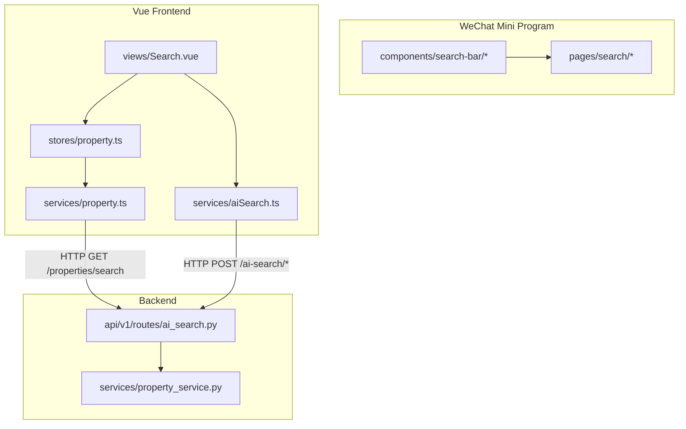
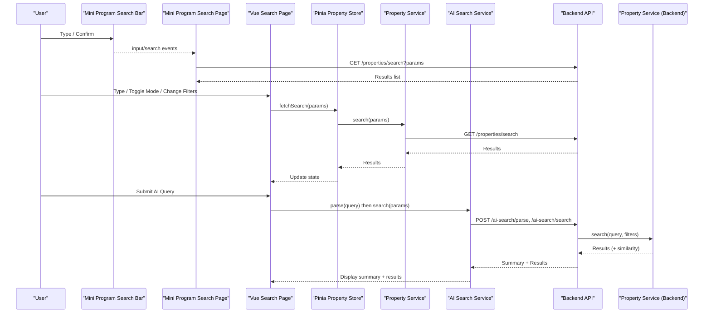
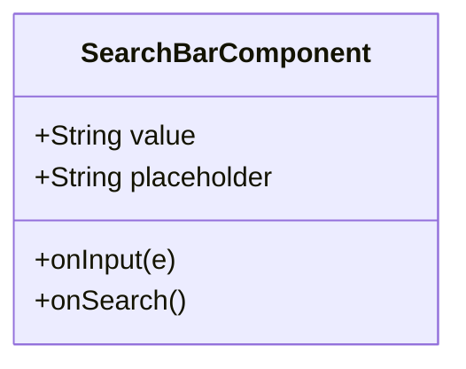
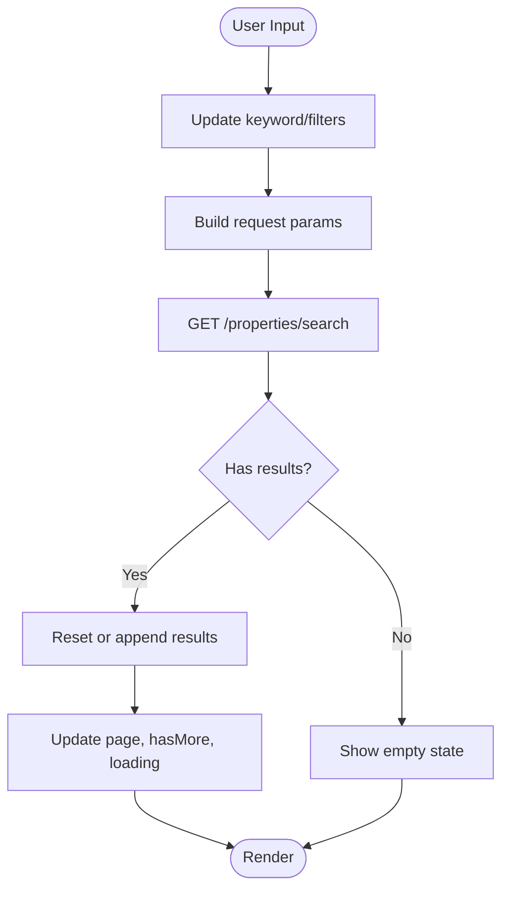
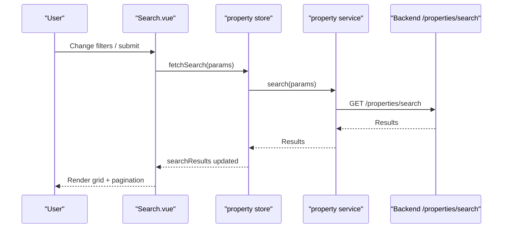
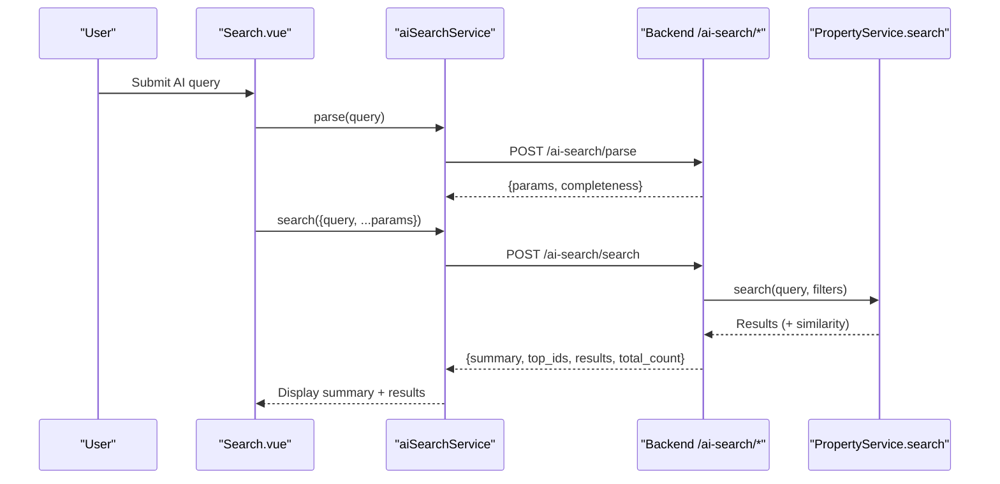
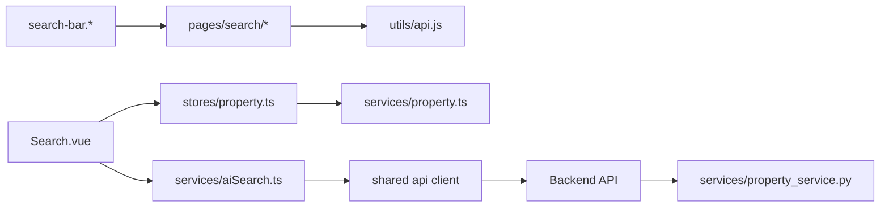

# Search Bar Component

<cite>
**Referenced Files in This Document**
- [search-bar.js](file://wechat-miniprogram/components/search-bar/search-bar.js)
- [search-bar.wxml](file://wechat-miniprogram/components/search-bar/search-bar.wxml)
- [search-bar.wxss](file://wechat-miniprogram/components/search-bar/search-bar.wxss)
- [search.js (Mini Program page)](file://wechat-miniprogram/pages/search/search.js)
- [search.wxml (Mini Program page)](file://wechat-miniprogram/pages/search/search.wxml)
- [Search.vue](file://frontend/src/views/Search.vue)
- [property.ts (store)](file://frontend/src/stores/property.ts)
- [property.ts (service)](file://frontend/src/services/property.ts)
- [aiSearch.ts](file://frontend/src/services/aiSearch.ts)
- [ai_search.py](file://backend/app/api/v1/routes/ai_search.py)
- [property_service.py](file://backend/app/services/property_service.py)
</cite>

## Table of Contents
1. [Introduction](#introduction)
2. [Project Structure](#project-structure)
3. [Core Components](#core-components)
4. [Architecture Overview](#architecture-overview)
5. [Detailed Component Analysis](#detailed-component-analysis)
6. [Dependency Analysis](#dependency-analysis)
7. [Performance Considerations](#performance-considerations)
8. [Troubleshooting Guide](#troubleshooting-guide)
9. [Conclusion](#conclusion)
10. [Appendices](#appendices)

## Introduction
This document provides comprehensive documentation for the Search Bar component across both the WeChat Mini Program and the Vue frontend, including input handling, real-time search behavior, filtering, keyboard interactions, styling customization, accessibility considerations, mobile optimizations, API usage, error states, empty results handling, and user feedback mechanisms. It also explains how to integrate with different data sources, implement autocomplete patterns, and manage search history.

## Project Structure
The Search Bar is implemented as a reusable component in the Mini Program and integrated into a full-featured search page in the Vue frontend. The backend exposes both traditional filtered search and AI-powered semantic search endpoints.

**Diagram sources**
- [search-bar.js:1-17](file://wechat-miniprogram/components/search-bar/search-bar.js#L1-L17)
- [search.wxml (Mini Program page):1-45](file://wechat-miniprogram/pages/search/search.wxml#L1-L45)
- [Search.vue:1-495](file://frontend/src/views/Search.vue#L1-L495)
- [property.ts (store):1-136](file://frontend/src/stores/property.ts#L1-L136)
- [property.ts (service):1-86](file://frontend/src/services/property.ts#L1-L86)
- [aiSearch.ts:1-66](file://frontend/src/services/aiSearch.ts#L1-L66)
- [ai_search.py:1-160](file://backend/app/api/v1/routes/ai_search.py#L1-L160)
- [property_service.py:1-200](file://backend/app/services/property_service.py#L1-L200)

**Section sources**
- [search-bar.js:1-17](file://wechat-miniprogram/components/search-bar/search-bar.js#L1-L17)
- [search-bar.wxml:1-14](file://wechat-miniprogram/components/search-bar/search-bar.wxml#L1-L14)
- [search-bar.wxss:1-25](file://wechat-miniprogram/components/search-bar/search-bar.wxss#L1-L25)
- [search.js (Mini Program page):1-100](file://wechat-miniprogram/pages/search/search.js#L1-L100)
- [search.wxml (Mini Program page):1-45](file://wechat-miniprogram/pages/search/search.wxml#L1-L45)
- [Search.vue:1-495](file://frontend/src/views/Search.vue#L1-L495)
- [property.ts (store):1-136](file://frontend/src/stores/property.ts#L1-L136)
- [property.ts (service):1-86](file://frontend/src/services/property.ts#L1-L86)
- [aiSearch.ts:1-66](file://frontend/src/services/aiSearch.ts#L1-L66)
- [ai_search.py:1-160](file://backend/app/api/v1/routes/ai_search.py#L1-L160)
- [property_service.py:1-200](file://backend/app/services/property_service.py#L1-L200)

## Core Components
- Mini Program Search Bar Component: A lightweight, event-driven input component that emits input and search events to its parent page.
- Mini Program Search Page: Consumes the component, manages filters, pagination, loading states, and navigates to property details.
- Vue Search Page: Provides advanced filtering, AI mode toggle, sorting, pagination, and integrates with Pinia store and services.
- Backend Search APIs: Traditional filtered search via GET and AI-powered parse + search via POST.

Key responsibilities:
- Input handling and event emission (Mini Program)
- Filter composition and query execution (both platforms)
- Real-time or on-demand search triggers
- Result rendering and empty/error states
- Integration with backend search endpoints

**Section sources**
- [search-bar.js:1-17](file://wechat-miniprogram/components/search-bar/search-bar.js#L1-L17)
- [search-bar.wxml:1-14](file://wechat-miniprogram/components/search-bar/search-bar.wxml#L1-L14)
- [search-bar.wxss:1-25](file://wechat-miniprogram/components/search-bar/search-bar.wxss#L1-L25)
- [search.js (Mini Program page):1-100](file://wechat-miniprogram/pages/search/search.js#L1-L100)
- [search.wxml (Mini Program page):1-45](file://wechat-miniprogram/pages/search/search.wxml#L1-L45)
- [Search.vue:1-495](file://frontend/src/views/Search.vue#L1-L495)
- [property.ts (store):1-136](file://frontend/src/stores/property.ts#L1-L136)
- [property.ts (service):1-86](file://frontend/src/services/property.ts#L1-L86)
- [aiSearch.ts:1-66](file://frontend/src/services/aiSearch.ts#L1-L66)
- [ai_search.py:1-160](file://backend/app/api/v1/routes/ai_search.py#L1-L160)
- [property_service.py:1-200](file://backend/app/services/property_service.py#L1-L200)

## Architecture Overview
End-to-end flow from user input to results:

**Diagram sources**
- [search-bar.js:1-17](file://wechat-miniprogram/components/search-bar/search-bar.js#L1-L17)
- [search.js (Mini Program page):1-100](file://wechat-miniprogram/pages/search/search.js#L1-L100)
- [Search.vue:1-495](file://frontend/src/views/Search.vue#L1-L495)
- [property.ts (store):1-136](file://frontend/src/stores/property.ts#L1-L136)
- [property.ts (service):1-86](file://frontend/src/services/property.ts#L1-L86)
- [aiSearch.ts:1-66](file://frontend/src/services/aiSearch.ts#L1-L66)
- [ai_search.py:1-160](file://backend/app/api/v1/routes/ai_search.py#L1-L160)
- [property_service.py:1-200](file://backend/app/services/property_service.py#L1-L200)

## Detailed Component Analysis

### Mini Program Search Bar Component
- Purpose: Provide a compact search input with icon, placeholder, and a text button to trigger search.
- Properties:
  - value: string, default empty
  - placeholder: string, default localized hint
- Events:
  - input: emitted with current value on each keystroke
  - search: emitted when confirm key is pressed or search button tapped
- Keyboard interaction:
  - Uses confirm-type="search" to show a dedicated confirm key on mobile keyboards
  - Triggers search on confirm
- Styling:
  - Flex layout with rounded input field and green search button
  - Responsive padding and font sizes using rpx units

**Diagram sources**
- [search-bar.js:1-17](file://wechat-miniprogram/components/search-bar/search-bar.js#L1-L17)
- [search-bar.wxml:1-14](file://wechat-miniprogram/components/search-bar/search-bar.wxml#L1-L14)
- [search-bar.wxss:1-25](file://wechat-miniprogram/components/search-bar/search-bar.wxss#L1-L25)

**Section sources**
- [search-bar.js:1-17](file://wechat-miniprogram/components/search-bar/search-bar.js#L1-L17)
- [search-bar.wxml:1-14](file://wechat-miniprogram/components/search-bar/search-bar.wxml#L1-L14)
- [search-bar.wxss:1-25](file://wechat-miniprogram/components/search-bar/search-bar.wxss#L1-L25)

### Mini Program Search Page Integration
- Consumes the Search Bar component via bind:input and bind:search
- Manages:
  - keyword state
  - filter state (district, propertyType, minPrice, maxPrice)
  - pagination (page, hasMore)
  - loading and empty states
- Behavior:
  - doSearch builds parameters and calls GET /properties/search
  - onKeywordInput updates local keyword
  - onSearchConfirm triggers search
  - onFilterChange updates filters and re-runs search
  - onReachBottom loads more results
  - onPullDownRefresh resets and reloads
- Empty and loading UI:
  - Shows “No matching properties” when results are empty
  - Shows “Searching...” while loading
  - Shows “No more” when hasMore is false

**Diagram sources**
- [search.js (Mini Program page):1-100](file://wechat-miniprogram/pages/search/search.js#L1-L100)
- [search.wxml (Mini Program page):1-45](file://wechat-miniprogram/pages/search/search.wxml#L1-L45)

**Section sources**
- [search.js (Mini Program page):1-100](file://wechat-miniprogram/pages/search/search.js#L1-L100)
- [search.wxml (Mini Program page):1-45](file://wechat-miniprogram/pages/search/search.wxml#L1-L45)

### Vue Search Page and Store Integration
- Features:
  - AI semantic search toggle
  - Country/district/overseas_area selectors mapped to backend district parameter
  - Price range, bedrooms, property type filters
  - Sorting options (similarity, price asc/desc, area desc)
  - Pagination via computed slice
- Data flow:
  - doSearch composes PropertySearchParams and calls propertyStore.fetchSearch
  - propertyStore.fetchSearch sets loading, stores lastSearchParams, and calls propertyService.search
  - propertyService.search performs GET /properties/search
  - Results update searchResults ref; Search.vue renders pagedResults
- Error and empty states:
  - v-loading during requests
  - el-empty with description and reset action when no results
- Accessibility and UX:
  - Clearable inputs and large size for readability
  - Enter key triggers search
  - Visual badges for semantic mode and active filters

**Diagram sources**
- [Search.vue:1-495](file://frontend/src/views/Search.vue#L1-L495)
- [property.ts (store):1-136](file://frontend/src/stores/property.ts#L1-L136)
- [property.ts (service):1-86](file://frontend/src/services/property.ts#L1-L86)

**Section sources**
- [Search.vue:1-495](file://frontend/src/views/Search.vue#L1-L495)
- [property.ts (store):1-136](file://frontend/src/stores/property.ts#L1-L136)
- [property.ts (service):1-86](file://frontend/src/services/property.ts#L1-L86)

### AI Search Flow (Parse + Search)
- Two-step process:
  - Parse natural language into structured parameters and completeness report
  - Execute vector-based search and generate an AI summary
- Frontend integration:
  - aiSearchService.parse(query) returns parsed params and missing fields
  - aiSearchService.search(params) returns summary, top IDs, results, total count
- Backend implementation:
  - /ai-search/parse uses LLM to extract district, price range, bedrooms, property_type, keywords
  - /ai-search/search composes query parts, runs PropertyService.search, optionally generates summary
  - Falls back gracefully if LLM is unavailable

**Diagram sources**
- [aiSearch.ts:1-66](file://frontend/src/services/aiSearch.ts#L1-L66)
- [ai_search.py:1-160](file://backend/app/api/v1/routes/ai_search.py#L1-L160)
- [property_service.py:1-200](file://backend/app/services/property_service.py#L1-L200)

**Section sources**
- [aiSearch.ts:1-66](file://frontend/src/services/aiSearch.ts#L1-L66)
- [ai_search.py:1-160](file://backend/app/api/v1/routes/ai_search.py#L1-L160)
- [property_service.py:1-200](file://backend/app/services/property_service.py#L1-L200)

## Dependency Analysis
- Mini Program:
  - components/search-bar depends only on native input and view elements
  - pages/search depends on components/search-bar and api utility
- Vue:
  - views/Search.vue depends on Pinia store and Element Plus components
  - stores/property.ts depends on services/property.ts
  - services/aiSearch.ts depends on shared api client
- Backend:
  - routes/ai_search.py depends on services.property_service and optional LLM service
  - services.property_service depends on SQLAlchemy session and optional Redis cache

**Diagram sources**
- [search-bar.js:1-17](file://wechat-miniprogram/components/search-bar/search-bar.js#L1-L17)
- [search.js (Mini Program page):1-100](file://wechat-miniprogram/pages/search/search.js#L1-L100)
- [Search.vue:1-495](file://frontend/src/views/Search.vue#L1-L495)
- [property.ts (store):1-136](file://frontend/src/stores/property.ts#L1-L136)
- [property.ts (service):1-86](file://frontend/src/services/property.ts#L1-L86)
- [aiSearch.ts:1-66](file://frontend/src/services/aiSearch.ts#L1-L66)
- [ai_search.py:1-160](file://backend/app/api/v1/routes/ai_search.py#L1-L160)
- [property_service.py:1-200](file://backend/app/services/property_service.py#L1-L200)

**Section sources**
- [search-bar.js:1-17](file://wechat-miniprogram/components/search-bar/search-bar.js#L1-L17)
- [search.js (Mini Program page):1-100](file://wechat-miniprogram/pages/search/search.js#L1-L100)
- [Search.vue:1-495](file://frontend/src/views/Search.vue#L1-L495)
- [property.ts (store):1-136](file://frontend/src/stores/property.ts#L1-L136)
- [property.ts (service):1-86](file://frontend/src/services/property.ts#L1-L86)
- [aiSearch.ts:1-66](file://frontend/src/services/aiSearch.ts#L1-L66)
- [ai_search.py:1-160](file://backend/app/api/v1/routes/ai_search.py#L1-L160)
- [property_service.py:1-200](file://backend/app/services/property_service.py#L1-L200)

## Performance Considerations
- Debounce strategy:
  - Not implemented in the current Search Bar or Search page; consider adding debounce on input to reduce network calls during rapid typing.
  - Example pattern exists elsewhere in the codebase (MapSearch.vue) and can be reused.
- Caching:
  - Backend caches non-vector search results using Redis with TTL; this improves performance for repeated filter queries.
- Pagination:
  - Both Mini Program and Vue implementations paginate results to limit payload size and improve rendering performance.
- Vector search cost:
  - AI semantic search involves embedding generation and similarity computation; ensure reasonable limits and fallback summaries when LLM is unavailable.

[No sources needed since this section provides general guidance]

## Troubleshooting Guide
Common issues and resolutions:
- No results returned:
  - Verify filters and district mapping; ensure backend supports requested parameters.
  - Check empty state rendering and reset actions.
- Network errors:
  - Ensure API endpoints are reachable and authentication headers are present where required.
  - For AI search, handle 502/503 responses gracefully and fall back to basic search.
- Loading stuck:
  - Confirm loading flags are toggled correctly in try/finally blocks.
  - Validate that pagination and pull-to-refresh handlers reset states appropriately.
- LLM unavailability:
  - Backend falls back to static summary messages; ensure UI displays meaningful hints.

**Section sources**
- [ai_search.py:80-160](file://backend/app/api/v1/routes/ai_search.py#L80-L160)
- [property_service.py:91-195](file://backend/app/services/property_service.py#L91-L195)
- [search.js (Mini Program page):30-98](file://wechat-miniprogram/pages/search/search.js#L30-L98)
- [Search.vue:200-240](file://frontend/src/views/Search.vue#L200-L240)

## Conclusion
The Search Bar component provides a simple, extensible foundation for search experiences across Mini Program and Vue. While it currently lacks built-in debounce and autocomplete, these features can be added at the consumer layer. The backend offers robust filtered search with caching and an AI-powered semantic search pipeline with graceful fallbacks. By following the documented API contracts and integrating with the provided services, teams can implement rich search behaviors, including autocomplete, history management, and personalized suggestions.

[No sources needed since this section summarizes without analyzing specific files]

## Appendices

### API Definitions
- GET /properties/search
  - Query parameters: q, district, overseas_area (mapped to district), price_min, price_max, bedrooms, property_type, limit
  - Response: Array of PropertySearchResult
- POST /ai-search/parse
  - Request body: { query: string }
  - Response: { params: ParsedSearchParams, completeness: CompletenessReport }
- POST /ai-search/search
  - Request body: AiSearchRequest
  - Response: AiSearchResponse (summary, top_ids, results, total_count, search_params)

**Section sources**
- [property.ts (service):28-35](file://frontend/src/services/property.ts#L28-L35)
- [aiSearch.ts:1-66](file://frontend/src/services/aiSearch.ts#L1-L66)
- [ai_search.py:80-160](file://backend/app/api/v1/routes/ai_search.py#L80-L160)

### Styling Customization Options
- Mini Program:
  - Modify .search-input and .search-btn classes in search-bar.wxss for colors, spacing, and typography.
  - Adjust container padding and border styles in .search-bar.
- Vue:
  - Use scoped CSS in Search.vue to override Element Plus wrapper styles and layout.
  - Leverage CSS variables for theme consistency.

**Section sources**
- [search-bar.wxss:1-25](file://wechat-miniprogram/components/search-bar/search-bar.wxss#L1-L25)
- [Search.vue:392-495](file://frontend/src/views/Search.vue#L392-L495)

### Accessibility Features
- Mini Program:
  - Use aria-like attributes if supported by platform; rely on clear placeholders and labels.
  - Ensure focus management when navigating results.
- Vue:
  - Element Plus inputs provide keyboard navigation and screen reader support.
  - Add descriptive labels and roles for custom overlays or suggestion lists.

[No sources needed since this section provides general guidance]

### Mobile-Specific Optimizations
- Mini Program:
  - Use rpx units for responsive sizing.
  - Implement pull-to-refresh and infinite scroll for better UX.
- Vue:
  - Responsive grid layouts adapt to smaller screens.
  - Large input sizes and clearable controls improve touch usability.

**Section sources**
- [search-bar.wxss:1-25](file://wechat-miniprogram/components/search-bar/search-bar.wxss#L1-L25)
- [Search.vue:470-495](file://frontend/src/views/Search.vue#L470-L495)

### Integrating with Different Data Sources
- Mini Program:
  - Replace api.get('/properties/search', params) with your endpoint and map response shape accordingly.
- Vue:
  - Extend propertyService.search to call alternative endpoints or add local filtering before calling backend.
- AI Search:
  - Integrate aiSearchService.parse and search to enable natural language queries and summaries.

**Section sources**
- [search.js (Mini Program page):40-62](file://wechat-miniprogram/pages/search/search.js#L40-L62)
- [property.ts (service):28-35](file://frontend/src/services/property.ts#L28-L35)
- [aiSearch.ts:56-66](file://frontend/src/services/aiSearch.ts#L56-L66)

### Autocomplete Implementation Pattern
- Recommended approach:
  - Debounce input changes (e.g., 300ms).
  - On each change, call a lightweight suggestion endpoint or filter locally.
  - Render a dropdown with highlighted matches and keyboard navigation (arrow keys, enter).
- Reference pattern:
  - MapSearch.vue demonstrates debounce logic that can be adapted for search suggestions.

**Section sources**
- [MapSearch.vue:95-141](file://frontend/src/views/MapSearch.vue#L95-L141)

### Handling Search History
- Mini Program:
  - Persist recent queries using wx.setStorageSync and display them in a history panel.
- Vue:
  - Use localStorage or a Pinia module to store and restore previous searches.
  - Allow clearing history and selecting past queries to auto-fill filters.

[No sources needed since this section provides general guidance]

### Error States and User Feedback
- Mini Program:
  - Show “Searching...” during requests; revert to empty state on failure.
  - Handle network errors silently or show toast notifications.
- Vue:
  - Use v-loading overlay and el-empty with actionable buttons to reset filters.
  - Display meta badges indicating active filters and semantic mode.

**Section sources**
- [search.wxml (Mini Program page):30-43](file://wechat-miniprogram/pages/search/search.wxml#L30-L43)
- [Search.vue:188-240](file://frontend/src/views/Search.vue#L188-L240)