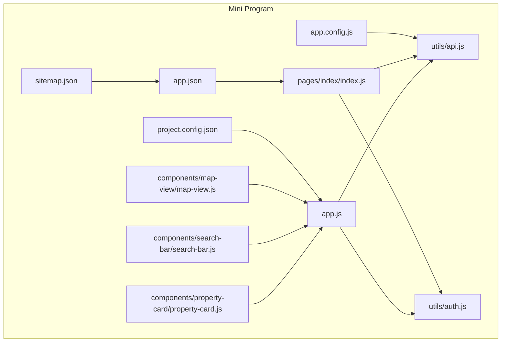
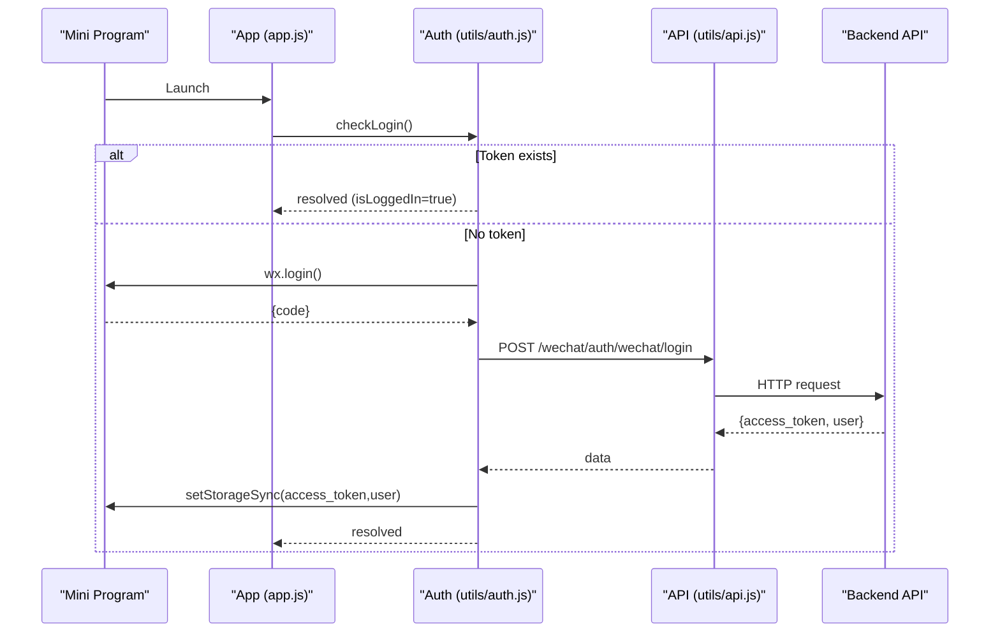
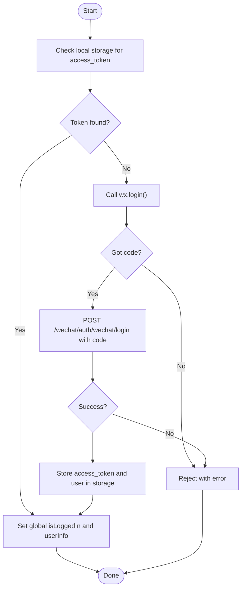
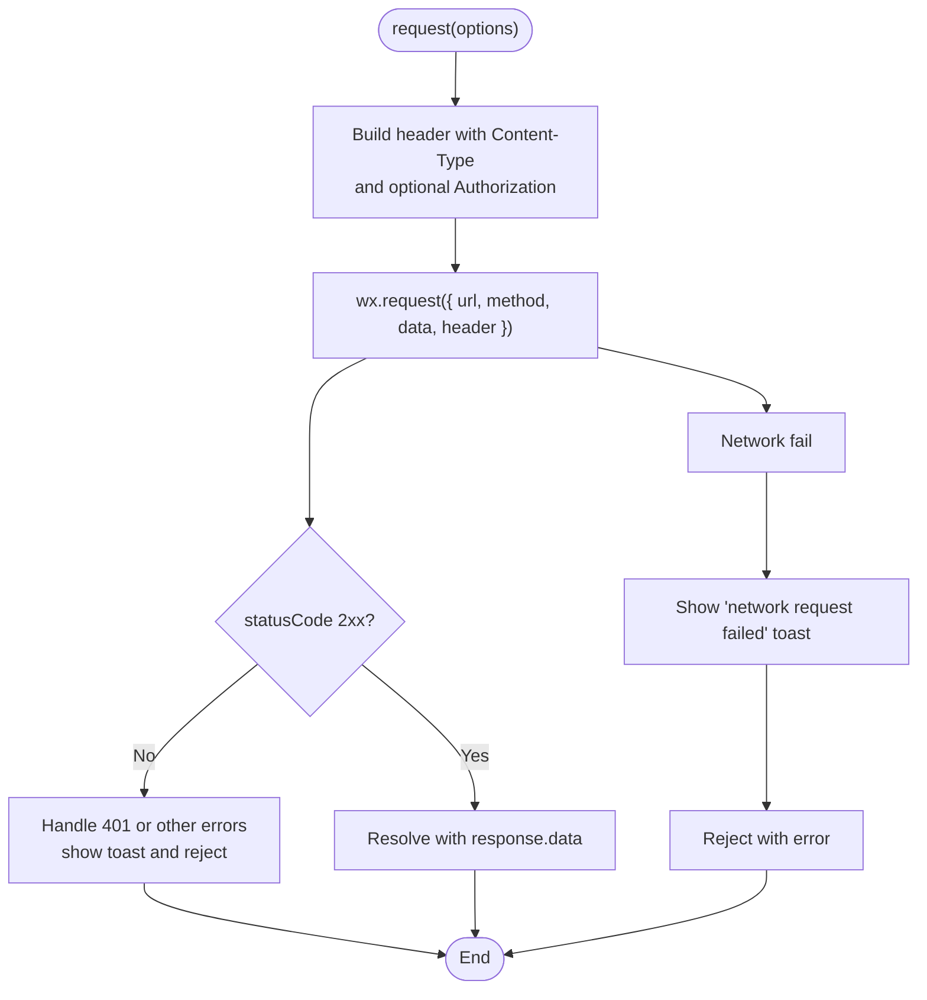
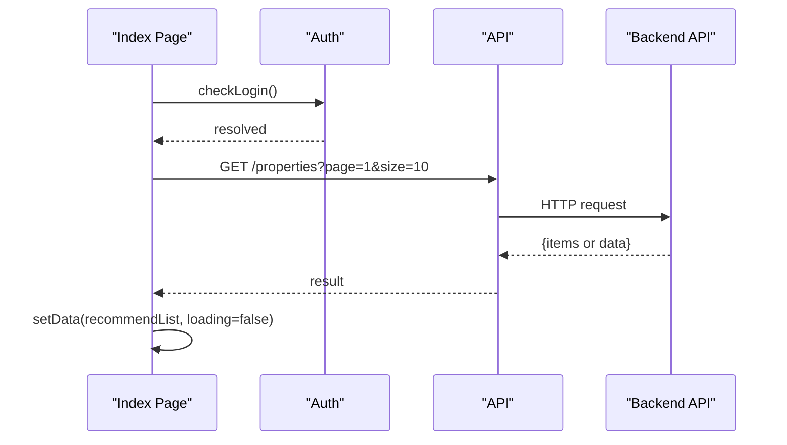
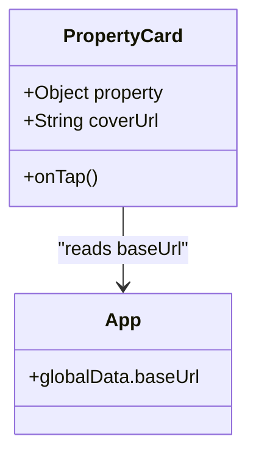
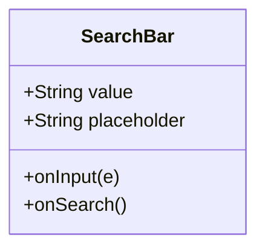
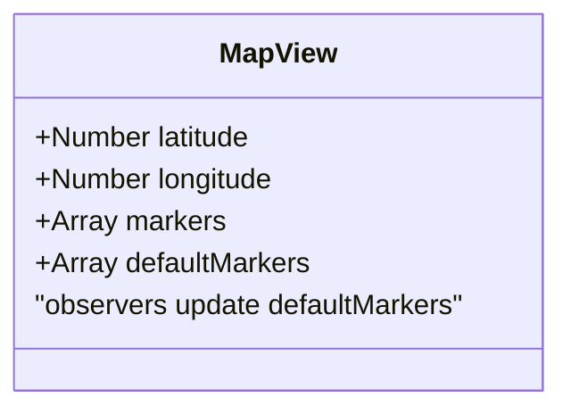
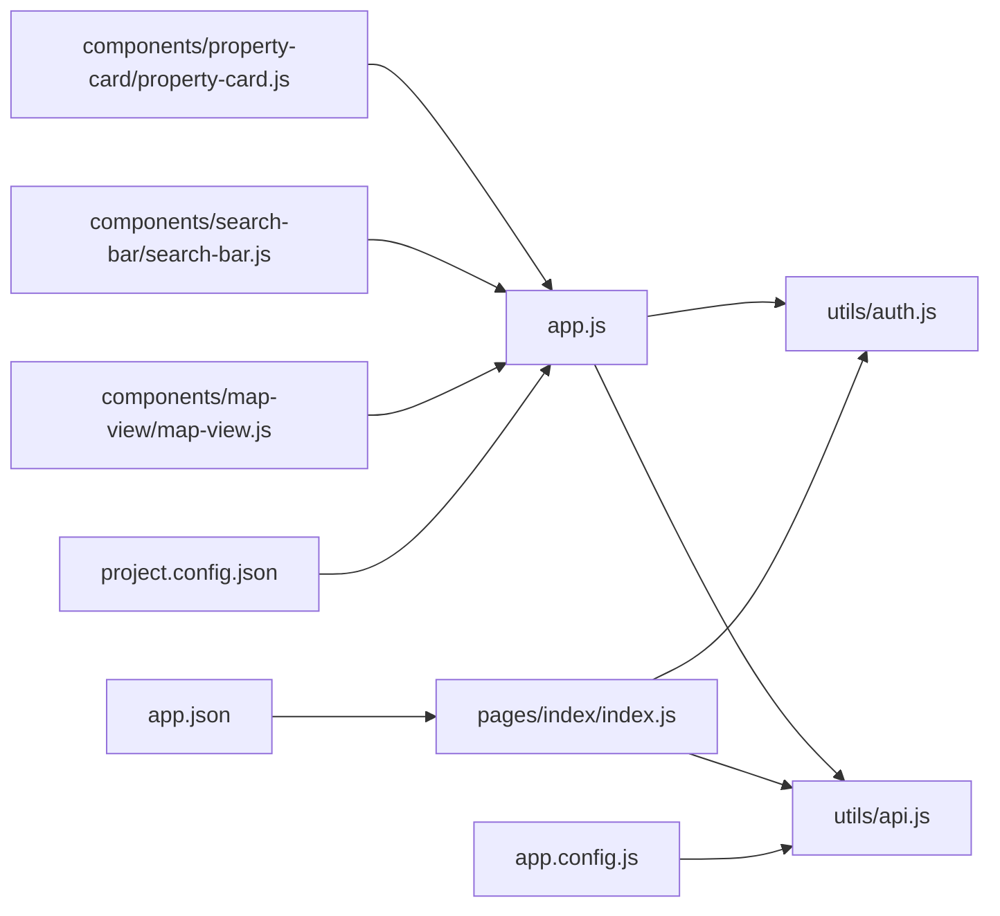

# Development & Debugging Workflow

<cite>
**Referenced Files in This Document**
- [app.js](file://wechat-miniprogram/app.js)
- [app.json](file://wechat-miniprogram/app.json)
- [project.config.json](file://wechat-miniprogram/project.config.json)
- [app.config.js](file://wechat-miniprogram/app.config.js)
- [utils/api.js](file://wechat-miniprogram/utils/api.js)
- [utils/auth.js](file://wechat-miniprogram/utils/auth.js)
- [pages/index/index.js](file://wechat-miniprogram/pages/index/index.js)
- [components/property-card/property-card.js](file://wechat-miniprogram/components/property-card/property-card.js)
- [components/search-bar/search-bar.js](file://wechat-miniprogram/components/search-bar/search-bar.js)
- [components/map-view/map-view.js](file://wechat-miniprogram/components/map-view/map-view.js)
- [sitemap.json](file://wechat-miniprogram/sitemap.json)
- [README.md](file://README.md)
- [DEPLOYMENT.md](file://DEPLOYMENT.md)
</cite>

## Table of Contents
1. Introduction
2. Project Structure
3. Core Components
4. Architecture Overview
5. Detailed Component Analysis
6. Dependency Analysis
7. Performance Considerations
8. Troubleshooting Guide
9. Conclusion
10. Appendices

## Introduction
This document provides a comprehensive development and debugging workflow for the WeChat Mini Program within this project. It covers environment setup, WeChat DevTools usage (console, network inspection, performance profiling), JavaScript error debugging, network request troubleshooting, component debugging, testing strategies, code organization best practices, version control workflows, collaboration tips, common pitfalls, and performance optimization techniques. The guidance is tailored to the actual implementation present in the repository’s wechat-miniprogram directory.

## Project Structure
The WeChat Mini Program follows the standard structure with pages, components, utilities, and configuration files:
- Pages: index, search, property, chat, booking, me
- Components: property-card, search-bar, map-view
- Utilities: api.js (HTTP wrapper), auth.js (WeChat login flow)
- Configuration: app.json (routing, tabBar, permissions), project.config.json (DevTools settings), app.config.js (environment-specific API base URLs), sitemap.json

**Diagram sources**
- [app.js:1-21](file://wechat-miniprogram/app.js#L1-L21)
- [app.json:1-57](file://wechat-miniprogram/app.json#L1-L57)
- [project.config.json:1-37](file://wechat-miniprogram/project.config.json#L1-L37)
- [app.config.js:1-16](file://wechat-miniprogram/app.config.js#L1-L16)
- [sitemap.json:1-7](file://wechat-miniprogram/sitemap.json#L1-L7)
- [utils/api.js:1-52](file://wechat-miniprogram/utils/api.js#L1-L52)
- [utils/auth.js:1-81](file://wechat-miniprogram/utils/auth.js#L1-L81)
- [pages/index/index.js:1-74](file://wechat-miniprogram/pages/index/index.js#L1-L74)
- [components/property-card/property-card.js:1-30](file://wechat-miniprogram/components/property-card/property-card.js#L1-L30)
- [components/search-bar/search-bar.js:1-17](file://wechat-miniprogram/components/search-bar/search-bar.js#L1-L17)
- [components/map-view/map-view.js:1-29](file://wechat-miniprogram/components/map-view/map-view.js#L1-L29)

**Section sources**
- [app.js:1-21](file://wechat-miniprogram/app.js#L1-L21)
- [app.json:1-57](file://wechat-miniprogram/app.json#L1-L57)
- [project.config.json:1-37](file://wechat-miniprogram/project.config.json#L1-L37)
- [app.config.js:1-16](file://wechat-miniprogram/app.config.js#L1-L16)
- [sitemap.json:1-7](file://wechat-miniprogram/sitemap.json#L1-L7)
- [utils/api.js:1-52](file://wechat-miniprogram/utils/api.js#L1-L52)
- [utils/auth.js:1-81](file://wechat-miniprogram/utils/auth.js#L1-L81)
- [pages/index/index.js:1-74](file://wechat-miniprogram/pages/index/index.js#L1-L74)
- [components/property-card/property-card.js:1-30](file://wechat-miniprogram/components/property-card/property-card.js#L1-L30)
- [components/search-bar/search-bar.js:1-17](file://wechat-miniprogram/components/search-bar/search-bar.js#L1-L17)
- [components/map-view/map-view.js:1-29](file://wechat-miniprogram/components/map-view/map-view.js#L1-L29)

## Core Components
- Application bootstrap and global state:
  - App initialization checks login status on launch and maintains global flags and user info.
- Environment configuration:
  - Centralized environment config defines baseUrl and wsUrl for development and production.
- HTTP client wrapper:
  - Unified request function adds Authorization headers, handles token expiration, and shows toast notifications.
- Authentication utility:
  - Implements WeChat login flow, stores tokens locally, and exposes helpers to check login state and logout.
- Page entry:
  - Index page loads recommended properties after authentication and supports navigation and pull-to-refresh.
- Reusable components:
  - Property card computes image URL using global baseUrl; search bar emits input/search events; map view renders default markers based on coordinates.

Key responsibilities and interactions are illustrated below.

**Section sources**
- [app.js:1-21](file://wechat-miniprogram/app.js#L1-L21)
- [app.config.js:1-16](file://wechat-miniprogram/app.config.js#L1-L16)
- [utils/api.js:1-52](file://wechat-miniprogram/utils/api.js#L1-L52)
- [utils/auth.js:1-81](file://wechat-miniprogram/utils/auth.js#L1-L81)
- [pages/index/index.js:1-74](file://wechat-miniprogram/pages/index/index.js#L1-L74)
- [components/property-card/property-card.js:1-30](file://wechat-miniprogram/components/property-card/property-card.js#L1-L30)
- [components/search-bar/search-bar.js:1-17](file://wechat-miniprogram/components/search-bar/search-bar.js#L1-L17)
- [components/map-view/map-view.js:1-29](file://wechat-miniprogram/components/map-view/map-view.js#L1-L29)

## Architecture Overview
The mini program architecture centers around a small set of modules:
- App lifecycle initializes global state and triggers login checks.
- Auth module orchestrates WeChat login and persists tokens.
- API module wraps wx.request, injects Authorization, and normalizes errors.
- Pages consume services and update UI via setData.
- Components encapsulate UI logic and emit events to parent pages.

**Diagram sources**
- [app.js:1-21](file://wechat-miniprogram/app.js#L1-L21)
- [utils/auth.js:1-81](file://wechat-miniprogram/utils/auth.js#L1-L81)
- [utils/api.js:1-52](file://wechat-miniprogram/utils/api.js#L1-L52)

## Detailed Component Analysis

### Authentication Flow
The authentication flow ensures users are logged in before accessing protected features. It uses WeChat’s login code exchange with the backend to obtain a JWT access token and stores it locally.

**Diagram sources**
- [utils/auth.js:1-81](file://wechat-miniprogram/utils/auth.js#L1-L81)
- [utils/api.js:1-52](file://wechat-miniprogram/utils/api.js#L1-L52)

**Section sources**
- [utils/auth.js:1-81](file://wechat-miniprogram/utils/auth.js#L1-L81)
- [utils/api.js:1-52](file://wechat-miniprogram/utils/api.js#L1-L52)

### HTTP Client Wrapper
The API wrapper centralizes request handling, header injection, and error management. It also handles token expiration by clearing local storage and notifying the user.

**Diagram sources**
- [utils/api.js:1-52](file://wechat-miniprogram/utils/api.js#L1-L52)

**Section sources**
- [utils/api.js:1-52](file://wechat-miniprogram/utils/api.js#L1-L52)

### Index Page Data Loading
The index page performs authentication before loading recommended properties and supports pull-to-refresh and navigation.

**Diagram sources**
- [pages/index/index.js:1-74](file://wechat-miniprogram/pages/index/index.js#L1-L74)
- [utils/api.js:1-52](file://wechat-miniprogram/utils/api.js#L1-L52)

**Section sources**
- [pages/index/index.js:1-74](file://wechat-miniprogram/pages/index/index.js#L1-L74)
- [utils/api.js:1-52](file://wechat-miniprogram/utils/api.js#L1-L52)

### Property Card Component
The property card component derives an image URL from the global baseUrl and emits tap events to parent pages.

**Diagram sources**
- [components/property-card/property-card.js:1-30](file://wechat-miniprogram/components/property-card/property-card.js#L1-L30)
- [app.js:1-21](file://wechat-miniprogram/app.js#L1-L21)

**Section sources**
- [components/property-card/property-card.js:1-30](file://wechat-miniprogram/components/property-card/property-card.js#L1-L30)
- [app.js:1-21](file://wechat-miniprogram/app.js#L1-L21)

### Search Bar Component
The search bar component manages input binding and emits input/search events to parent pages.

**Diagram sources**
- [components/search-bar/search-bar.js:1-17](file://wechat-miniprogram/components/search-bar/search-bar.js#L1-L17)

**Section sources**
- [components/search-bar/search-bar.js:1-17](file://wechat-miniprogram/components/search-bar/search-bar.js#L1-L17)

### Map View Component
The map view component updates default markers when latitude and longitude change.

**Diagram sources**
- [components/map-view/map-view.js:1-29](file://wechat-miniprogram/components/map-view/map-view.js#L1-L29)

**Section sources**
- [components/map-view/map-view.js:1-29](file://wechat-miniprogram/components/map-view/map-view.js#L1-L29)

## Dependency Analysis
The mini program has clear dependency boundaries:
- Pages depend on utils/api.js and utils/auth.js.
- Components depend on app.js for global baseUrl.
- App depends on utils/auth.js for initial login checks.
- Configuration files define routing, DevTools behavior, and environment endpoints.

**Diagram sources**
- [app.js:1-21](file://wechat-miniprogram/app.js#L1-L21)
- [utils/auth.js:1-81](file://wechat-miniprogram/utils/auth.js#L1-L81)
- [utils/api.js:1-52](file://wechat-miniprogram/utils/api.js#L1-L52)
- [pages/index/index.js:1-74](file://wechat-miniprogram/pages/index/index.js#L1-L74)
- [components/property-card/property-card.js:1-30](file://wechat-miniprogram/components/property-card/property-card.js#L1-L30)
- [components/search-bar/search-bar.js:1-17](file://wechat-miniprogram/components/search-bar/search-bar.js#L1-L17)
- [components/map-view/map-view.js:1-29](file://wechat-miniprogram/components/map-view/map-view.js#L1-L29)
- [app.config.js:1-16](file://wechat-miniprogram/app.config.js#L1-L16)
- [app.json:1-57](file://wechat-miniprogram/app.json#L1-L57)
- [project.config.json:1-37](file://wechat-miniprogram/project.config.json#L1-L37)

**Section sources**
- [app.js:1-21](file://wechat-miniprogram/app.js#L1-L21)
- [utils/auth.js:1-81](file://wechat-miniprogram/utils/auth.js#L1-L81)
- [utils/api.js:1-52](file://wechat-miniprogram/utils/api.js#L1-L52)
- [pages/index/index.js:1-74](file://wechat-miniprogram/pages/index/index.js#L1-L74)
- [components/property-card/property-card.js:1-30](file://wechat-miniprogram/components/property-card/property-card.js#L1-L30)
- [components/search-bar/search-bar.js:1-17](file://wechat-miniprogram/components/search-bar/search-bar.js#L1-L17)
- [components/map-view/map-view.js:1-29](file://wechat-miniprogram/components/map-view/map-view.js#L1-L29)
- [app.config.js:1-16](file://wechat-miniprogram/app.config.js#L1-L16)
- [app.json:1-57](file://wechat-miniprogram/app.json#L1-L57)
- [project.config.json:1-37](file://wechat-miniprogram/project.config.json#L1-L37)

## Performance Considerations
- Prefer lazy loading and pagination for lists (e.g., use page/size parameters).
- Minimize setData payloads; update only changed fields.
- Use component observers judiciously to avoid excessive re-renders.
- Cache frequently accessed data in local storage where appropriate.
- Avoid heavy computations on the main thread; offload to background tasks if needed.
- Optimize images and assets; ensure correct paths derived from baseUrl.

[No sources needed since this section provides general guidance]

## Troubleshooting Guide
Common issues and resolutions:
- Network requests failing:
  - Verify baseUrl in app.config.js matches your running backend.
  - Ensure CORS is configured correctly on the backend for localhost during development.
  - Inspect network logs in DevTools to confirm request/response details.
- Token expiration (401):
  - The API wrapper clears stored tokens and resets global login state; trigger re-login via auth.checkLogin().
- Permission prompts:
  - Confirm requiredPrivateInfos and permission scopes in app.json align with feature needs (e.g., getLocation).
- DevTools configuration:
  - Ensure project.config.json settings match your development preferences (e.g., es6, postcss, uploadWithSourceMap).
- Sitemap rules:
  - Validate sitemap.json rules if indexing or SEO-related features are used.

Operational references:
- Local development quick start and mini program setup steps are documented in the root README.
- Production deployment and troubleshooting commands are provided in DEPLOYMENT.md.

**Section sources**
- [app.config.js:1-16](file://wechat-miniprogram/app.config.js#L1-L16)
- [utils/api.js:1-52](file://wechat-miniprogram/utils/api.js#L1-L52)
- [app.json:1-57](file://wechat-miniprogram/app.json#L1-L57)
- [project.config.json:1-37](file://wechat-miniprogram/project.config.json#L1-L37)
- [sitemap.json:1-7](file://wechat-miniprogram/sitemap.json#L1-L7)
- [README.md:98-104](file://README.md#L98-L104)
- [DEPLOYMENT.md:112-134](file://DEPLOYMENT.md#L112-L134)

## Conclusion
This guide consolidates the development and debugging workflow for the WeChat Mini Program in this project. By leveraging the centralized API wrapper, robust authentication utility, and well-structured pages and components, developers can efficiently debug issues, optimize performance, and collaborate effectively. Following the outlined best practices and troubleshooting steps will streamline day-to-day development and reduce friction across the team.

[No sources needed since this section summarizes without analyzing specific files]

## Appendices

### WeChat DevTools Setup and Usage
- Open the wechat-miniprogram directory in WeChat DevTools.
- Set your AppID in project.config.json.
- Configure baseUrl and wsUrl in app.config.js for development or production.
- Enable source maps and ES6 support in project.config.json for better debugging experience.
- Use the Console panel to inspect logs and run snippets; use the Network panel to monitor requests; use the Performance panel to profile rendering and JS execution.

**Section sources**
- [project.config.json:1-37](file://wechat-miniprogram/project.config.json#L1-L37)
- [app.config.js:1-16](file://wechat-miniprogram/app.config.js#L1-L16)
- [README.md:98-104](file://README.md#L98-L104)

### Testing Strategies
- Unit testing:
  - For the mini program, unit tests typically target pure functions and utilities. In this repository, there are no dedicated mini program test files; consider adding tests for utils/api.js and utils/auth.js to validate request wrapping and login flows.
- Manual testing procedures:
  - Verify login flow end-to-end using DevTools.
  - Test network calls by toggling offline mode and checking error toasts.
  - Validate component behaviors (search input, property card tap, map marker updates) through interactive walkthroughs.

[No sources needed since this section provides general guidance]

### Code Organization Best Practices
- Keep business logic in utils and services; keep pages thin and focused on UI state.
- Centralize environment configuration in app.config.js.
- Use consistent naming and modularization for components and pages.
- Maintain clear separation between data fetching (api.js) and presentation (pages/components).

**Section sources**
- [utils/api.js:1-52](file://wechat-miniprogram/utils/api.js#L1-L52)
- [utils/auth.js:1-81](file://wechat-miniprogram/utils/auth.js#L1-L81)
- [app.config.js:1-16](file://wechat-miniprogram/app.config.js#L1-L16)
- [pages/index/index.js:1-74](file://wechat-miniprogram/pages/index/index.js#L1-L74)
- [components/property-card/property-card.js:1-30](file://wechat-miniprogram/components/property-card/property-card.js#L1-L30)
- [components/search-bar/search-bar.js:1-17](file://wechat-miniprogram/components/search-bar/search-bar.js#L1-L17)
- [components/map-view/map-view.js:1-29](file://wechat-miniprogram/components/map-view/map-view.js#L1-L29)

### Version Control and Collaboration Workflows
- Follow branch naming conventions and commit message formats as described in team documentation.
- Use GitHub Projects and labels to track tasks and automate workflow transitions.
- Ensure PRs include screenshots and CI passes before merging.

**Section sources**
- [README.md:22-62](file://README.md#L22-L62)
- [DEPLOYMENT.md:1-40](file://DEPLOYMENT.md#L1-L40)

### Hot Reloading and Efficient Debugging
- Hot reload is disabled by default in project.config.json; enable compileHotReLoad if desired for faster iteration.
- Use uploadWithSourceMap to improve stack traces in production builds.
- Leverage console logging strategically and avoid excessive logs in hot paths.

**Section sources**
- [project.config.json:1-37](file://wechat-miniprogram/project.config.json#L1-L37)