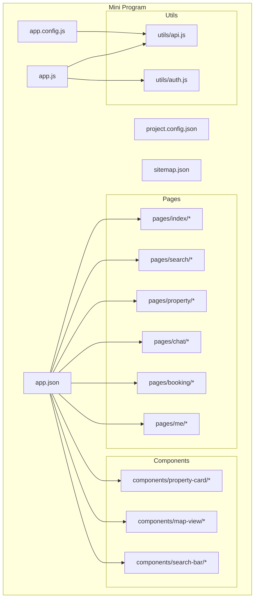
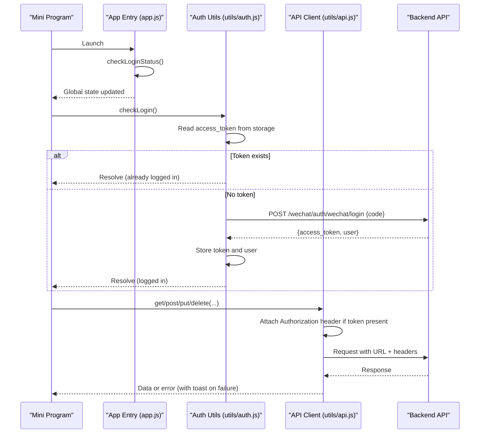
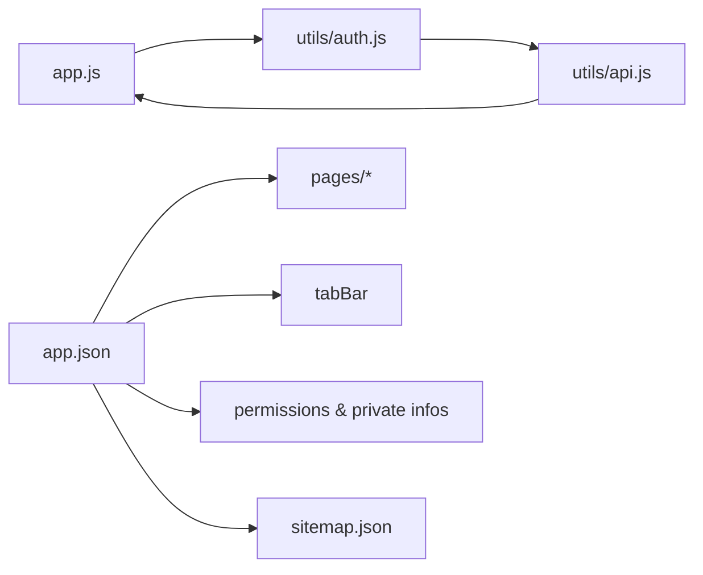

# Mini Program Setup & Configuration

<cite>
**Referenced Files in This Document**
- [app.json](file://wechat-miniprogram/app.json)
- [project.config.json](file://wechat-miniprogram/project.config.json)
- [sitemap.json](file://wechat-miniprogram/sitemap.json)
- [app.js](file://wechat-miniprogram/app.js)
- [app.config.js](file://wechat-miniprogram/app.config.js)
- [index.json](file://wechat-miniprogram/pages/index/index.json)
- [search.json](file://wechat-miniprogram/pages/search/search.json)
- [booking.json](file://wechat-miniprogram/pages/booking/booking.json)
- [me.json](file://wechat-miniprogram/pages/me/me.json)
- [property-card.json](file://wechat-miniprogram/components/property-card/property-card.json)
- [map-view.json](file://wechat-miniprogram/components/map-view/map-view.json)
- [api.js](file://wechat-miniprogram/utils/api.js)
- [auth.js](file://wechat-miniprogram/utils/auth.js)
</cite>

## Table of Contents
1. [Introduction](#introduction)
2. [Project Structure](#project-structure)
3. [Core Components](#core-components)
4. [Architecture Overview](#architecture-overview)
5. [Detailed Component Analysis](#detailed-component-analysis)
6. [Dependency Analysis](#dependency-analysis)
7. [Performance Considerations](#performance-considerations)
8. [Troubleshooting Guide](#troubleshooting-guide)
9. [Conclusion](#conclusion)
10. [Appendices](#appendices)

## Introduction
This document explains how to set up and configure the WeChat Mini Program for this project. It covers the app configuration, global settings, page registration, tabBar setup, development environment with WeChat DevTools, build options, sitemap configuration for search optimization, privacy compliance, environment variables, and basic debugging. It also provides common configuration patterns and best practices for initializing a mini program.

## Project Structure
The WeChat Mini Program resides under wechat-miniprogram. Key directories and files:
- Root configuration: app.json, project.config.json, sitemap.json
- App entry: app.js (initialization), app.config.js (environment-based API endpoints)
- Pages: pages/* (each page has .js, .json, .wxml, .wxss)
- Components: components/* (reusable UI blocks)
- Utilities: utils/* (API client, authentication helpers)

**Diagram sources**
- [app.json:1-57](file://wechat-miniprogram/app.json#L1-L57)
- [project.config.json:1-37](file://wechat-miniprogram/project.config.json#L1-L37)
- [sitemap.json:1-7](file://wechat-miniprogram/sitemap.json#L1-L7)
- [app.js:1-21](file://wechat-miniprogram/app.js#L1-L21)
- [app.config.js:1-16](file://wechat-miniprogram/app.config.js#L1-L16)
- [index.json:1-8](file://wechat-miniprogram/pages/index/index.json#L1-L8)
- [search.json:1-9](file://wechat-miniprogram/pages/search/search.json#L1-L9)
- [booking.json:1-5](file://wechat-miniprogram/pages/booking/booking.json#L1-L5)
- [me.json:1-4](file://wechat-miniprogram/pages/me/me.json#L1-L4)
- [property-card.json:1-4](file://wechat-miniprogram/components/property-card/property-card.json#L1-L4)
- [map-view.json:1-4](file://wechat-miniprogram/components/map-view/map-view.json#L1-L4)
- [api.js:1-52](file://wechat-miniprogram/utils/api.js#L1-L52)
- [auth.js:1-81](file://wechat-miniprogram/utils/auth.js#L1-L81)

**Section sources**
- [app.json:1-57](file://wechat-miniprogram/app.json#L1-L57)
- [project.config.json:1-37](file://wechat-miniprogram/project.config.json#L1-L37)
- [sitemap.json:1-7](file://wechat-miniprogram/sitemap.json#L1-L7)
- [app.js:1-21](file://wechat-miniprogram/app.js#L1-L21)
- [app.config.js:1-16](file://wechat-miniprogram/app.config.js#L1-L16)

## Core Components
- Application entry and initialization
  - app.js initializes the app, checks login status on launch, and exposes global data such as isLoggedIn, userInfo, and baseUrl.
- Environment configuration
  - app.config.js centralizes environment-specific endpoints (baseUrl, wsUrl). The current environment is selected by a simple variable.
- Global application configuration
  - app.json registers all pages, defines window appearance, sets up the tabBar, declares permissions and required private info, enables v2 style, and points to sitemap.json.
- Development and build settings
  - project.config.json configures compiler features, source map upload, library version, and other DevTools behaviors.
- Sitemap configuration
  - sitemap.json controls which pages are allowed for indexing.

Key responsibilities:
- Page registration and navigation via app.json
- TabBar layout and icons via app.json
- Permission declarations and privacy requirements via app.json
- Environment-driven API base URLs via app.config.js
- Authentication state management via utils/auth.js
- HTTP request wrapper with token injection and error handling via utils/api.js

**Section sources**
- [app.js:1-21](file://wechat-miniprogram/app.js#L1-L21)
- [app.config.js:1-16](file://wechat-miniprogram/app.config.js#L1-L16)
- [app.json:1-57](file://wechat-miniprogram/app.json#L1-L57)
- [project.config.json:1-37](file://wechat-miniprogram/project.config.json#L1-L37)
- [sitemap.json:1-7](file://wechat-miniprogram/sitemap.json#L1-L7)
- [api.js:1-52](file://wechat-miniprogram/utils/api.js#L1-L52)
- [auth.js:1-81](file://wechat-miniprogram/utils/auth.js#L1-L81)

## Architecture Overview
High-level flow:
- On launch, the app reads stored tokens and updates global state.
- Pages use the centralized API client to call backend services.
- Authentication utilities orchestrate WeChat login and token storage.
- Environment configuration determines whether requests go to local or production endpoints.

**Diagram sources**
- [app.js:1-21](file://wechat-miniprogram/app.js#L1-L21)
- [auth.js:1-81](file://wechat-miniprogram/utils/auth.js#L1-L81)
- [api.js:1-52](file://wechat-miniprogram/utils/api.js#L1-L52)

## Detailed Component Analysis

### Application Configuration (app.json)
- Pages registration: Declares all top-level pages.
- Window settings: Navigation bar background color, title text, text style, and page background color.
- TabBar: Defines tabs with page paths, labels, and icon assets for normal and selected states.
- Permissions and privacy: Declares location permission usage description and required private information for location access.
- Style and sitemap: Enables v2 style and references sitemap.json.

Best practices:
- Keep page order intentional; first page becomes default entry.
- Use consistent tab labels and clear icons.
- Provide concise permission descriptions to improve user trust.

**Section sources**
- [app.json:1-57](file://wechat-miniprogram/app.json#L1-L57)

### Development and Build Settings (project.config.json)
- Compiler features: ES6 support, enhanced compilation, postcss, minification, shadow root visibility, multi-frame runtime.
- Source maps: Upload with source map enabled for better debugging.
- Library version: Specifies the minimum WeChat library version.
- App ID placeholder: Replace with your actual AppID before publishing.
- Condition entries: Can be used for quick launch scenarios.

Recommended toggles:
- Enable uploadWithSourceMap during development.
- Keep es6 and enhance true for modern JS features.
- Validate compileType and libVersion when upgrading the SDK.

**Section sources**
- [project.config.json:1-37](file://wechat-miniprogram/project.config.json#L1-L37)

### Sitemap Configuration (sitemap.json)
- Rules: Allows indexing for all pages using a wildcard rule.
- Purpose: Improves discoverability within WeChat ecosystem where applicable.

Guidance:
- Restrict rules for sensitive pages if needed.
- Revisit rules before release to balance SEO and privacy.

**Section sources**
- [sitemap.json:1-7](file://wechat-miniprogram/sitemap.json#L1-L7)

### Environment Configuration (app.config.js)
- Centralized environment objects for development and production.
- Exposes baseUrl and wsUrl for HTTP and WebSocket connections.
- Simple env switch variable to toggle environments.

Recommendations:
- Do not hardcode secrets here; prefer secure storage or server-side proxies.
- Add staging environments as needed.

**Section sources**
- [app.config.js:1-16](file://wechat-miniprogram/app.config.js#L1-L16)

### Global State and Initialization (app.js)
- onLaunch: Invokes login status check.
- checkLoginStatus: Reads stored token and updates global isLoggedIn flag.
- globalData: Holds isLoggedIn, userInfo, and baseUrl.

Notes:
- Ensure globalData.baseUrl aligns with app.config.js values.
- Initialize auth early to protect protected routes.

**Section sources**
- [app.js:1-21](file://wechat-miniprogram/app.js#L1-L21)

### Authentication Flow (utils/auth.js)
- login: Performs wx.login, exchanges code for token via backend, stores token and user info, updates global state.
- checkLogin: If token exists, loads user info; otherwise triggers login.
- logout: Clears token and user info, resets global state.
- Helpers: getUserInfo, isLoggedIn.

Security considerations:
- Always store tokens securely using wx.setStorageSync only when necessary.
- Handle token expiration gracefully by prompting re-login.

**Section sources**
- [auth.js:1-81](file://wechat-miniprogram/utils/auth.js#L1-L81)

### API Client (utils/api.js)
- Wraps wx.request with Promise-based interface.
- Attaches Authorization header when token exists.
- Normalizes success and error responses; shows toast messages on failures.
- Provides convenience methods: get, post, put, patch, delete.

Error handling:
- 401 clears session and rejects with a message indicating expired login.
- Network errors show a generic toast.

Usage pattern:
- Import api and call api.get('/endpoint', data) or api.post('/endpoint', data).

**Section sources**
- [api.js:1-52](file://wechat-miniprogram/utils/api.js#L1-L52)

### Page-Level Configurations
- pages/index/index.json: Registers component usage, enables pull-down refresh, sets navigation title.
- pages/search/search.json: Similar setup with additional component registration.
- pages/booking/booking.json: Pull-down refresh and custom title.
- pages/me/me.json: Custom navigation title.

Common patterns:
- Register reusable components at the page level.
- Enable pull-down refresh for list-heavy pages.
- Set meaningful titles per page.

**Section sources**
- [index.json:1-8](file://wechat-miniprogram/pages/index/index.json#L1-L8)
- [search.json:1-9](file://wechat-miniprogram/pages/search/search.json#L1-L9)
- [booking.json:1-5](file://wechat-miniprogram/pages/booking/booking.json#L1-L5)
- [me.json:1-4](file://wechat-miniprogram/pages/me/me.json#L1-L4)

### Component Registration
- components/property-card/property-card.json: Declares component.
- components/map-view/map-view.json: Declares component.

Note:
- Each component must include a JSON file declaring component: true.

**Section sources**
- [property-card.json:1-4](file://wechat-miniprogram/components/property-card/property-card.json#L1-L4)
- [map-view.json:1-4](file://wechat-miniprogram/components/map-view/map-view.json#L1-L4)

## Dependency Analysis
Relationships between core modules:
- app.js depends on global storage and may interact with utils/auth.js and utils/api.js indirectly through pages.
- utils/auth.js depends on utils/api.js for backend calls.
- utils/api.js depends on app.js globalData.baseUrl for constructing full URLs.
- app.json drives page and tabBar structure consumed by the framework.
- sitemap.json influences indexing behavior.

**Diagram sources**
- [app.js:1-21](file://wechat-miniprogram/app.js#L1-L21)
- [auth.js:1-81](file://wechat-miniprogram/utils/auth.js#L1-L81)
- [api.js:1-52](file://wechat-miniprogram/utils/api.js#L1-L52)
- [app.json:1-57](file://wechat-miniprogram/app.json#L1-L57)
- [sitemap.json:1-7](file://wechat-miniprogram/sitemap.json#L1-L7)

**Section sources**
- [app.js:1-21](file://wechat-miniprogram/app.js#L1-L21)
- [auth.js:1-81](file://wechat-miniprogram/utils/auth.js#L1-L81)
- [api.js:1-52](file://wechat-miniprogram/utils/api.js#L1-L52)
- [app.json:1-57](file://wechat-miniprogram/app.json#L1-L57)
- [sitemap.json:1-7](file://wechat-miniprogram/sitemap.json#L1-L7)

## Performance Considerations
- Prefer lazy loading and pagination for large lists.
- Use pull-down refresh judiciously; debounce network calls.
- Minimize image sizes and reuse shared components.
- Keep globalData lean; avoid storing large payloads.
- Enable source maps in development for faster debugging.

[No sources needed since this section provides general guidance]

## Troubleshooting Guide
Common issues and resolutions:
- 401 Unauthorized: The API client clears session and prompts re-login. Ensure login flow completes successfully and tokens are stored.
- Network errors: Generic toast shown; verify baseUrl and connectivity.
- Location permission denied: Confirm permission description in app.json and that requiredPrivateInfos includes getLocation.
- TabBar icons missing: Ensure images exist at referenced paths and are correctly named.
- Pages not found: Verify page paths in app.json match directory structure.

Operational tips:
- Use WeChat DevTools console and network panel to inspect requests.
- Toggle uploadWithSourceMap in project.config.json for detailed stack traces.
- Check sitemap rules if pages are unexpectedly indexed or hidden.

**Section sources**
- [api.js:1-52](file://wechat-miniprogram/utils/api.js#L1-L52)
- [auth.js:1-81](file://wechat-miniprogram/utils/auth.js#L1-L81)
- [app.json:1-57](file://wechat-miniprogram/app.json#L1-L57)
- [project.config.json:1-37](file://wechat-miniprogram/project.config.json#L1-L37)
- [sitemap.json:1-7](file://wechat-miniprogram/sitemap.json#L1-L7)

## Conclusion
This guide outlined the essential setup and configuration for the WeChat Mini Program, including app.json, global settings, page registration, tabBar, environment configuration, sitemap, and privacy permissions. Following the recommended patterns ensures a robust initialization, maintainable configuration, and smooth development experience.

[No sources needed since this section summarizes without analyzing specific files]

## Appendices

### Step-by-Step Initial Setup
- Install WeChat DevTools and create a new Mini Program project.
- Open the wechat-miniprogram folder as the project root.
- In project.config.json, set the correct AppID and desired libVersion.
- Configure app.config.js for development (local backend) or production (remote API).
- Ensure app.json lists all pages and tabBar items accurately.
- Add sitemap.json rules appropriate for your content strategy.
- Run the mini program in DevTools and verify navigation and API calls.

**Section sources**
- [project.config.json:1-37](file://wechat-miniprogram/project.config.json#L1-L37)
- [app.config.js:1-16](file://wechat-miniprogram/app.config.js#L1-L16)
- [app.json:1-57](file://wechat-miniprogram/app.json#L1-L57)
- [sitemap.json:1-7](file://wechat-miniprogram/sitemap.json#L1-L7)

### Environment Variables and Endpoints
- Use app.config.js to define baseUrl and wsUrl per environment.
- Switch the env variable to change between development and production.
- For sensitive keys, consider server-side proxying or secure storage strategies.

**Section sources**
- [app.config.js:1-16](file://wechat-miniprogram/app.config.js#L1-L16)

### Basic Debugging Setup
- Enable uploadWithSourceMap in project.config.json.
- Use DevTools Console, Network, and Storage panels.
- Inspect globalData values from app.js context.
- Log API requests/responses in utils/api.js during development.

**Section sources**
- [project.config.json:1-37](file://wechat-miniprogram/project.config.json#L1-L37)
- [app.js:1-21](file://wechat-miniprogram/app.js#L1-L21)
- [api.js:1-52](file://wechat-miniprogram/utils/api.js#L1-L52)

### Common Configuration Patterns and Best Practices
- Centralize environment endpoints in app.config.js.
- Keep app.json minimal and declarative; move complex logic to JS.
- Declare permissions clearly and only request what you need.
- Use reusable components and register them at page level.
- Maintain consistent tabBar icons and labels.
- Review sitemap rules before release.

**Section sources**
- [app.config.js:1-16](file://wechat-miniprogram/app.config.js#L1-L16)
- [app.json:1-57](file://wechat-miniprogram/app.json#L1-L57)
- [index.json:1-8](file://wechat-miniprogram/pages/index/index.json#L1-L8)
- [search.json:1-9](file://wechat-miniprogram/pages/search/search.json#L1-L9)
- [booking.json:1-5](file://wechat-miniprogram/pages/booking/booking.json#L1-L5)
- [me.json:1-4](file://wechat-miniprogram/pages/me/me.json#L1-L4)
- [sitemap.json:1-7](file://wechat-miniprogram/sitemap.json#L1-L7)